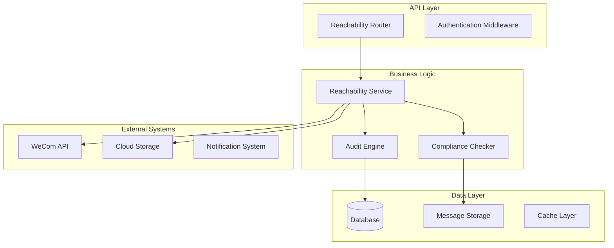
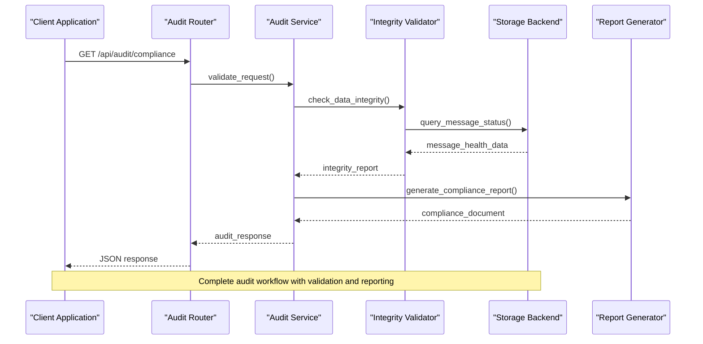
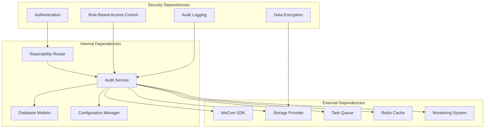

# Audit & Reachability API

<cite>
**Referenced Files in This Document**
- [reachability_audit.py](file://backend/app/routers/reachability_audit.py)
- [reachability_audit.py](file://backend/app/reachability_audit.py)
- [API.md](file://docs/API.md)
- [test_reachability_audit.py](file://backend/tests/test_reachability_audit.py)
- [test_reachability_diagnostics_page.py](file://backend/tests/test_reachability_diagnostics_page.py)
- [test_reachability_diagnostics_render.py](file://backend/tests/test_reachability_diagnostics_render.py)
- [main.py](file://backend/app/main.py)
- [models.py](file://backend/app/db/models.py)
</cite>

## Table of Contents
1. [Introduction](#introduction)
2. [Project Structure](#project-structure)
3. [Core Components](#core-components)
4. [Architecture Overview](#architecture-overview)
5. [Detailed Component Analysis](#detailed-component-analysis)
6. [Dependency Analysis](#dependency-analysis)
7. [Performance Considerations](#performance-considerations)
8. [Troubleshooting Guide](#troubleshooting-guide)
9. [Conclusion](#conclusion)
10. [Appendices](#appendices)

## Introduction

The Audit & Reachability API provides comprehensive monitoring, compliance reporting, and data integrity verification capabilities for the WeCom Archive system. This API enables administrators to monitor message retention policies, verify data accessibility, generate compliance reports, and ensure regulatory adherence across archived conversations and messages.

The system supports multiple compliance standards including GDPR, CCPA, and industry-specific regulations, providing automated audit trails, retention policy enforcement, and comprehensive reporting capabilities for enterprise environments.

## Project Structure

The audit and reachability functionality is organized within a modular architecture that separates concerns between routing, business logic, and data persistence:



**Diagram sources**
- [main.py:1-100](file://backend/app/main.py#L1-L100)
- [models.py:1-200](file://backend/app/db/models.py#L1-L200)

**Section sources**
- [main.py:1-150](file://backend/app/main.py#L1-L150)
- [models.py:1-300](file://backend/app/db/models.py#L1-L300)

## Core Components

### Reachability Audit Router
The primary entry point for all audit and reachability endpoints, handling HTTP requests and delegating to appropriate service layers.

### Audit Engine
Responsible for generating comprehensive audit trails, tracking message lifecycle events, and maintaining immutable logs of all data access and modifications.

### Compliance Checker
Validates data against regulatory requirements, enforces retention policies, and generates compliance reports for various standards.

### Data Integrity Validator
Performs systematic checks on message storage, verifies referential integrity, and ensures data consistency across distributed storage systems.

**Section sources**
- [reachability_audit.py:1-200](file://backend/app/routers/reachability_audit.py#L1-L200)
- [reachability_audit.py:1-150](file://backend/app/reachability_audit.py#L1-L150)

## Architecture Overview

The audit and reachability system follows a layered architecture pattern with clear separation of concerns:



**Diagram sources**
- [reachability_audit.py:50-150](file://backend/app/routers/reachability_audit.py#L50-L150)
- [reachability_audit.py:30-120](file://backend/app/reachability_audit.py#L30-L120)

## Detailed Component Analysis

### Audit Log Retrieval Endpoints

#### GET /api/audit/logs
Retrieves audit logs with filtering, pagination, and search capabilities.

**Request Parameters:**
- `start_date`: ISO 8601 timestamp for log range start
- `end_date`: ISO 8601 timestamp for log range end  
- `event_type`: Filter by specific event types (message_access, data_modification, compliance_check)
- `tenant_id`: Tenant-specific filtering
- `user_id`: User-specific audit trail filtering
- `limit`: Maximum number of results (default: 100, max: 1000)
- `offset`: Pagination offset

**Response Format:**
```json
{
  "logs": [
    {
      "id": "uuid",
      "timestamp": "ISO 8601",
      "event_type": "string",
      "user_id": "string",
      "tenant_id": "string",
      "action": "string",
      "resource": "string",
      "details": "object",
      "ip_address": "string",
      "user_agent": "string"
    }
  ],
  "total_count": "number",
  "has_more": "boolean",
  "next_offset": "number"
}
```

#### POST /api/audit/logs/export
Exports audit logs in bulk format for external analysis and archival purposes.

**Request Body:**
```json
{
  "format": "csv|json|xml",
  "date_range": {
    "start": "ISO 8601",
    "end": "ISO 8601"
  },
  "filters": {
    "event_types": ["array"],
    "tenants": ["array"],
    "users": ["array"]
  },
  "include_metadata": "boolean"
}
```

### Compliance Status Checking

#### GET /api/audit/compliance/status
Provides real-time compliance status across all regulated data stores.

**Response Format:**
```json
{
  "overall_status": "compliant|non_compliant|review_required",
  "last_check": "ISO 8601",
  "standards": {
    "gdpr": {
      "status": "compliant|non_compliant",
      "data_subject_requests": {
        "pending": "number",
        "completed": "number",
        "overdue": "number"
      },
      "retention_policy_compliance": "percentage",
      "consent_tracking": "percentage"
    },
    "ccpa": {
      "status": "compliant|non_compliant", 
      "opt_out_requests": {
        "pending": "number",
        "completed": "number"
      },
      "data_deletion_compliance": "percentage"
    }
  },
  "alerts": [
    {
      "severity": "critical|warning|info",
      "message": "string",
      "timestamp": "ISO 8601",
      "resolution_steps": ["array"]
    }
  ]
}
```

#### POST /api/audit/compliance/generate-report
Generates comprehensive compliance reports for specified standards and time periods.

**Request Body:**
```json
{
  "standards": ["gdpr", "ccpa", "hipaa", "sox"],
  "report_type": "summary|detailed|executive",
  "date_range": {
    "start": "ISO 8601", 
    "end": "ISO 8601"
  },
  "include_recommendations": "boolean",
  "delivery_method": "download|email|webhook"
}
```

### Message Retention Verification

#### GET /api/audit/retention/check
Verifies message retention policy compliance across all storage locations.

**Query Parameters:**
- `tenant_id`: Specific tenant to check
- `storage_backend`: Target storage backend filter
- `policy_id`: Specific retention policy identifier
- `include_violations_only`: Boolean flag for violation-only reports

**Response Format:**
```json
{
  "retention_summary": {
    "total_messages": "number",
    "compliant_messages": "number", 
    "violations": "number",
    "compliance_percentage": "number"
  },
  "storage_locations": [
    {
      "location": "string",
      "message_count": "number",
      "oldest_message_age": "days",
      "newest_message_age": "days",
      "policy_compliance": "percentage"
    }
  ],
  "violations": [
    {
      "message_id": "string",
      "violation_type": "premature_deletion|excessive_retention|missing_metadata",
      "expected_action": "string",
      "actual_state": "string",
      "remediation_steps": ["array"]
    }
  ]
}
```

### Data Integrity Checks

#### POST /api/audit/integrity/verify
Initiates comprehensive data integrity verification across all storage systems.

**Request Body:**
```json
{
  "scope": "full|incremental|targeted",
  "targets": {
    "tenants": ["array"],
    "storage_backends": ["array"],
    "message_types": ["array"]
  },
  "verification_level": "basic|thorough|forensic",
  "notification_webhook": "string"
}
```

**Response Format:**
```json
{
  "verification_id": "uuid",
  "status": "initiated|in_progress|completed|failed",
  "estimated_completion": "ISO 8601",
  "progress": {
    "total_items": "number",
    "processed_items": "number",
    "errors_found": "number",
    "success_rate": "percentage"
  }
}
```

#### GET /api/audit/integrity/{verification_id}/status
Retrieves the current status and results of an ongoing integrity verification.

### Data Export Functionality

#### POST /api/audit/data/export
Provides bulk data export capabilities for audit trails, compliance reports, and archived messages.

**Request Body:**
```json
{
  "export_type": "audit_logs|compliance_reports|archived_messages|mixed",
  "format": "csv|json|parquet|zip",
  "compression": "none|gzip|zip",
  "filters": {
    "date_range": {
      "start": "ISO 8601",
      "end": "ISO 8601"
    },
    "tenants": ["array"],
    "message_types": ["array"],
    "content_filters": "object"
  },
  "scheduling": {
    "schedule_type": "one_time|daily|weekly|monthly",
    "cron_expression": "string",
    "notification_email": "string"
  }
}
```

**Section sources**
- [test_reachability_audit.py:1-200](file://backend/tests/test_reachability_audit.py#L1-L200)
- [test_reachability_diagnostics_page.py:1-150](file://backend/tests/test_reachability_diagnostics_page.py#L1-L150)

## Dependency Analysis

The audit and reachability system has well-defined dependencies and integration points:



**Diagram sources**
- [main.py:1-100](file://backend/app/main.py#L1-L100)
- [models.py:1-150](file://backend/app/db/models.py#L1-L150)

**Section sources**
- [main.py:1-200](file://backend/app/main.py#L1-L200)
- [models.py:1-250](file://backend/app/db/models.py#L1-L250)

## Performance Considerations

### Query Optimization
- Implement database indexing strategies for audit log queries
- Use pagination extensively for large result sets
- Leverage caching for frequently accessed compliance status data
- Optimize bulk export operations with streaming responses

### Scalability Patterns
- Horizontal scaling for audit log processing
- Asynchronous processing for long-running integrity checks
- Distributed task queue for parallel data verification
- Caching layer for compliance status aggregation

### Resource Management
- Memory-efficient processing for large dataset exports
- Connection pooling for database and external API calls
- Rate limiting for external API integrations
- Graceful degradation during high-load scenarios

## Troubleshooting Guide

### Common Issues and Resolutions

#### Audit Log Retrieval Failures
**Symptoms:** Empty results or timeout errors when querying audit logs
**Resolution:** Check database connectivity, verify index health, and review query performance metrics

#### Compliance Report Generation Delays
**Symptoms:** Reports take excessive time to generate or fail mid-generation
**Resolution:** Monitor resource utilization, optimize report generation queries, and consider background processing

#### Data Integrity Check Failures
**Symptoms:** Integrity checks report inconsistencies or fail to complete
**Resolution:** Verify storage backend connectivity, check data corruption indicators, and review network connectivity

#### Export Operation Failures
**Symptoms:** Bulk exports fail or produce incomplete data
**Resolution:** Validate export filters, check storage permissions, and monitor disk space availability

### Diagnostic Tools
- Built-in health check endpoints for system components
- Performance monitoring dashboards
- Error tracking and alerting systems
- Log aggregation and analysis tools

**Section sources**
- [test_reachability_diagnostics_render.py:1-100](file://backend/tests/test_reachability_diagnostics_render.py#L1-L100)

## Conclusion

The Audit & Reachability API provides a comprehensive solution for compliance monitoring, data integrity verification, and regulatory reporting in enterprise messaging environments. The system's modular architecture, extensive API surface, and robust error handling make it suitable for complex enterprise deployments requiring strict compliance and audit capabilities.

Key strengths include:
- Comprehensive audit trail generation and retrieval
- Multi-standard compliance checking and reporting
- Robust data integrity verification across distributed storage
- Flexible export and scheduling capabilities
- Strong security and privacy considerations

Future enhancements should focus on advanced analytics, machine learning-based anomaly detection, and expanded compliance standard support.

## Appendices

### A. Compliance Standards Support

#### GDPR Compliance Features
- Right to erasure automation
- Data portability exports
- Consent management tracking
- Privacy impact assessment tools

#### CCPA Compliance Features  
- Do Not Sell my Data request handling
- Consumer rights fulfillment automation
- Data deletion verification
- Sale disclosure reporting

#### HIPAA Compliance Features
- Protected Health Information (PHI) identification
- Access logging and monitoring
- Breach notification workflows
- Security incident tracking

### B. Integration Patterns

#### Webhook Integration
Configure webhooks for real-time notifications on audit events, compliance violations, and report completion.

#### Batch Processing Integration
Implement batch processing workflows for large-scale data operations and scheduled compliance checks.

#### Real-time Monitoring Integration
Connect monitoring systems for live dashboard updates and alerting on critical audit events.

### C. Security Considerations

#### Authentication and Authorization
- Role-based access control for audit functions
- API key management and rotation
- Session management and timeout policies
- IP whitelisting for administrative access

#### Data Protection
- Encryption at rest and in transit
- PII masking in audit logs
- Secure export mechanisms
- Data retention policy enforcement

#### Audit Trail Security
- Immutable audit log storage
- Cryptographic verification of log integrity
- Tamper-evident logging mechanisms
- Secure backup and recovery procedures