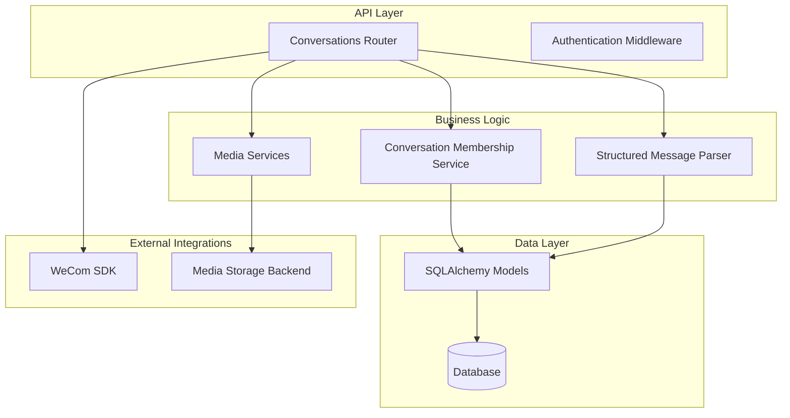
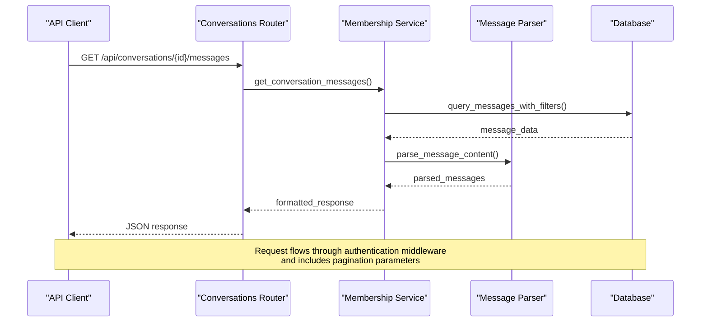
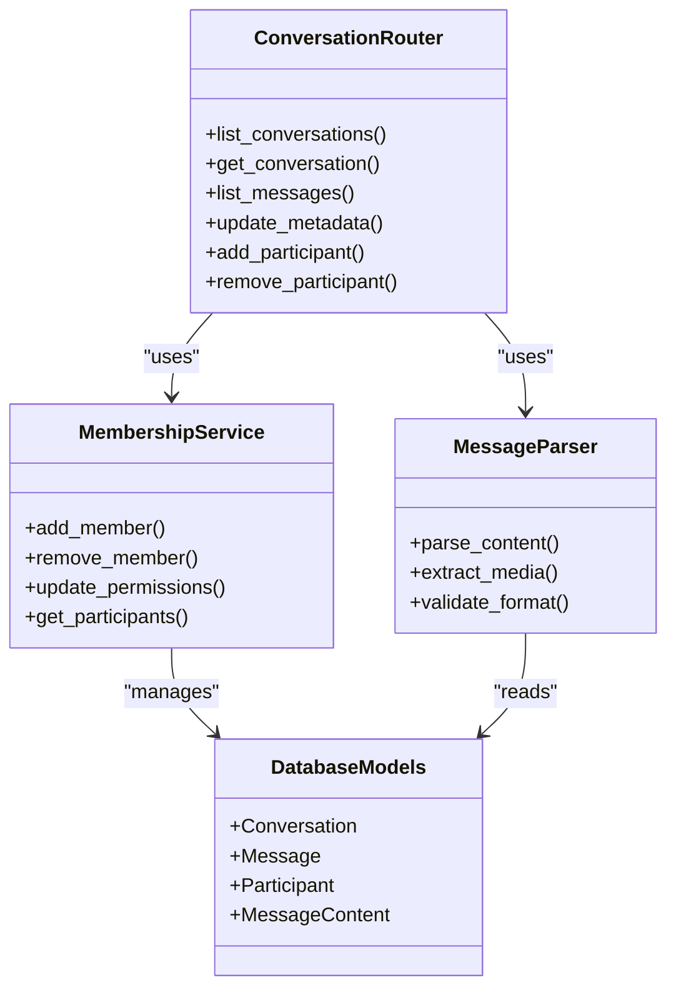

# Conversations API

<cite>
**Referenced Files in This Document**
- [main.py](file://backend/app/main.py)
- [conversations.py](file://backend/app/routers/conversations.py)
- [models.py](file://backend/app/db/models.py)
- [schema_check.py](file://backend/app/db/schema_check.py)
- [conversation_membership.py](file://backend/app/conversation_membership.py)
- [message_type_registry.py](file://backend/app/message_type_registry.py)
- [structured_message_parser.py](file://backend/app/structured_message_parser.py)
- [media_download.py](file://backend/app/media_download.py)
- [media_storage.py](file://backend/app/media_storage.py)
- [media_thumbnails.py](file://backend/app/media_thumbnails.py)
- [thumbnail_pipeline.py](file://backend/app/thumbnail_pipeline.py)
- [wecom_contacts.py](file://backend/app/wecom_contacts.py)
- [display_names.py](file://backend/app/display_names.py)
- [auth.py](file://backend/app/auth.py)
- [API.md](file://docs/API.md)
- [ARCHITECTURE.md](file://docs/ARCHITECTURE.md)
- [DATA_MODEL.md](file://docs/DATA_MODEL.md)
</cite>

## Table of Contents
1. [Introduction](#introduction)
2. [Project Structure](#project-structure)
3. [Core Components](#core-components)
4. [Architecture Overview](#architecture-overview)
5. [Detailed Component Analysis](#detailed-component-analysis)
6. [Dependency Analysis](#dependency-analysis)
7. [Performance Considerations](#performance-considerations)
8. [Troubleshooting Guide](#troubleshooting-guide)
9. [Conclusion](#conclusion)
10. [Appendices](#appendices)

## Introduction
This document provides comprehensive API documentation for conversation management endpoints, including:
- Conversation retrieval and metadata operations
- Message listing with pagination, filtering by date range and message types, and sorting
- Participant management within conversations
- Real-time updates via WebSocket connections for live message streaming and event notifications
- Practical examples of common workflows and error handling patterns

The backend is a FastAPI application that exposes REST endpoints and supports real-time communication through WebSockets. Data models are defined using SQLAlchemy, and the system integrates with WeCom (WeChat Work) to archive and manage conversations and messages.

## Project Structure
The project follows a modular architecture with clear separation of concerns:
- **Routers**: HTTP endpoint definitions and request/response handling
- **Database Models**: SQLAlchemy ORM models for conversations, messages, and participants
- **Services**: Business logic for conversation management, participant operations, and media handling
- **Utilities**: Helper functions for message parsing, display names, and contact synchronization



**Diagram sources**
- [conversations.py](file://backend/app/routers/conversations.py)
- [conversation_membership.py](file://backend/app/conversation_membership.py)
- [models.py](file://backend/app/db/models.py)

**Section sources**
- [main.py](file://backend/app/main.py)
- [ARCHITECTURE.md](file://docs/ARCHITECTURE.md)

## Core Components
The conversation management system consists of several key components:

### Conversation Router
Handles all HTTP endpoints related to conversations, including CRUD operations, message listing, and participant management.

### Conversation Membership Service
Manages participant relationships within conversations, including adding/removing members and managing permissions.

### Message Type Registry
Defines supported message types and their corresponding handlers for different content formats.

### Structured Message Parser
Parses complex message structures from WeCom into standardized formats for consistent processing.

**Section sources**
- [conversations.py](file://backend/app/routers/conversations.py)
- [conversation_membership.py](file://backend/app/conversation_membership.py)
- [message_type_registry.py](file://backend/app/message_type_registry.py)
- [structured_message_parser.py](file://backend/app/structured_message_parser.py)

## Architecture Overview
The Conversations API follows a layered architecture pattern with clear separation between presentation, business logic, and data access layers.



**Diagram sources**
- [conversations.py](file://backend/app/routers/conversations.py)
- [conversation_membership.py](file://backend/app/conversation_membership.py)
- [models.py](file://backend/app/db/models.py)

## Detailed Component Analysis

### Conversation Endpoints

#### List Conversations
- **HTTP Method**: GET
- **URL Pattern**: `/api/conversations`
- **Query Parameters**:
  - `page`: Page number (default: 1)
  - `per_page`: Items per page (default: 50, max: 100)
  - `created_after`: Filter by creation date (ISO 8601 format)
  - `created_before`: Filter by creation date (ISO 8601 format)
  - `updated_after`: Filter by last update date (ISO 8601 format)
  - `updated_before`: Filter by last update date (ISO 8601 format)
  - `type`: Filter by conversation type (group/private)
  - `sort_by`: Sort field (created_at, updated_at, name)
  - `sort_order`: Sort direction (asc, desc)

#### Get Conversation Details
- **HTTP Method**: GET
- **URL Pattern**: `/api/conversations/{conversation_id}`
- **Path Parameters**:
  - `conversation_id`: UUID of the conversation

#### List Messages in Conversation
- **HTTP Method**: GET
- **URL Pattern**: `/api/conversations/{conversation_id}/messages`
- **Query Parameters**:
  - `page`: Page number (default: 1)
  - `per_page`: Items per page (default: 50, max: 100)
  - `message_types`: Comma-separated list of message types to filter
  - `created_after`: Filter by message creation date
  - `created_before`: Filter by message creation date
  - `sender_id`: Filter by sender user ID
  - `has_media`: Boolean flag for messages containing media
  - `sort_by`: Sort field (created_at, updated_at)
  - `sort_order`: Sort direction (asc, desc)

#### Update Conversation Metadata
- **HTTP Method**: PUT
- **URL Pattern**: `/api/conversations/{conversation_id}`
- **Request Body**:
  ```json
  {
    "name": "Updated conversation name",
    "description": "Updated description",
    "metadata": {
      "custom_field": "value"
    }
  }
  ```

### Participant Management

#### Add Participant
- **HTTP Method**: POST
- **URL Pattern**: `/api/conversations/{conversation_id}/participants`
- **Request Body**:
  ```json
  {
    "user_id": "uuid-of-user",
    "role": "member|admin|viewer",
    "permissions": ["read", "write", "manage"]
  }
  ```

#### Remove Participant
- **HTTP Method**: DELETE
- **URL Pattern**: `/api/conversations/{conversation_id}/participants/{user_id}`

#### Update Participant Role
- **HTTP Method**: PUT
- **URL Pattern**: `/api/conversations/{conversation_id}/participants/{user_id}`
- **Request Body**:
  ```json
  {
    "role": "member|admin|viewer",
    "permissions": ["read", "write", "manage"]
  }
  ```

### Real-time Updates

#### WebSocket Connection
- **Connection URL**: `/ws/conversations/{conversation_id}`
- **Authentication**: Required via query parameter or header
- **Supported Events**:
  - `message_new`: New message received
  - `message_updated`: Message content updated
  - `participant_joined`: New participant added
  - `participant_left`: Participant removed
  - `conversation_updated`: Conversation metadata changed

#### WebSocket Message Format
```json
{
  "event": "message_new",
  "data": {
    "conversation_id": "uuid",
    "message_id": "uuid",
    "timestamp": "2024-01-01T00:00:00Z",
    "content": {...}
  },
  "metadata": {
    "sender_id": "uuid",
    "message_type": "text|image|video|document"
  }
}
```

**Section sources**
- [conversations.py](file://backend/app/routers/conversations.py)
- [conversation_membership.py](file://backend/app/conversation_membership.py)
- [models.py](file://backend/app/db/models.py)

## Dependency Analysis
The conversation management system has well-defined dependencies between components:



**Diagram sources**
- [conversations.py](file://backend/app/routers/conversations.py)
- [conversation_membership.py](file://backend/app/conversation_membership.py)
- [models.py](file://backend/app/db/models.py)

**Section sources**
- [models.py](file://backend/app/db/models.py)
- [conversation_membership.py](file://backend/app/conversation_membership.py)

## Performance Considerations
- **Pagination**: All list endpoints support pagination to prevent large responses
- **Indexing**: Database indexes on frequently queried fields (conversation_id, created_at, sender_id)
- **Caching**: Redis caching for frequently accessed conversation metadata
- **Streaming**: Large message lists use server-sent events for efficient delivery
- **Connection Pooling**: Database connection pooling for concurrent requests
- **Rate Limiting**: API rate limiting to prevent abuse

## Troubleshooting Guide

### Common Error Responses

#### 404 Not Found
- **Cause**: Invalid conversation ID or message ID
- **Solution**: Verify the resource exists and you have permission to access it

#### 403 Forbidden
- **Cause**: Insufficient permissions for the requested operation
- **Solution**: Check user roles and conversation membership status

#### 429 Too Many Requests
- **Cause**: Rate limit exceeded
- **Solution**: Implement exponential backoff and retry logic

#### 500 Internal Server Error
- **Cause**: Database connection issues or unexpected exceptions
- **Solution**: Check application logs and database connectivity

### Debugging Tips
- Enable detailed logging for API requests
- Use the health check endpoint to verify service status
- Monitor WebSocket connection stability
- Check database query performance with slow query logs

**Section sources**
- [auth.py](file://backend/app/auth.py)
- [schema_check.py](file://backend/app/db/schema_check.py)

## Conclusion
The Conversations API provides a comprehensive set of endpoints for managing conversations, messages, and participants in a secure and scalable manner. The system supports real-time updates through WebSockets, robust filtering and pagination capabilities, and integrates seamlessly with WeCom for message archiving.

Key features include:
- RESTful API design with comprehensive documentation
- Real-time messaging through WebSocket connections
- Flexible filtering and sorting options
- Secure participant management with role-based access control
- Efficient media handling and storage integration

## Appendices

### API Documentation Reference
For complete API specifications, refer to the main API documentation file.

**Section sources**
- [API.md](file://docs/API.md)
- [DATA_MODEL.md](file://docs/DATA_MODEL.md)

### Data Model Reference
The data model documentation provides detailed information about database schemas and relationships.

**Section sources**
- [DATA_MODEL.md](file://docs/DATA_MODEL.md)
- [models.py](file://backend/app/db/models.py)