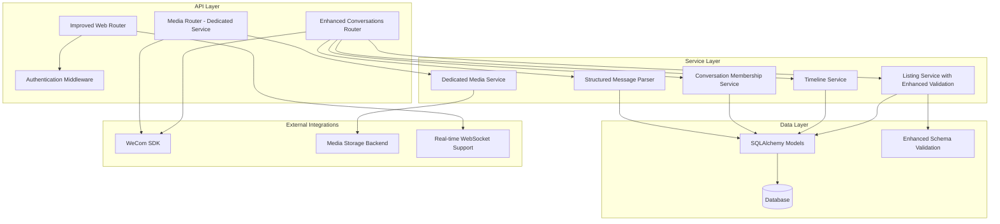
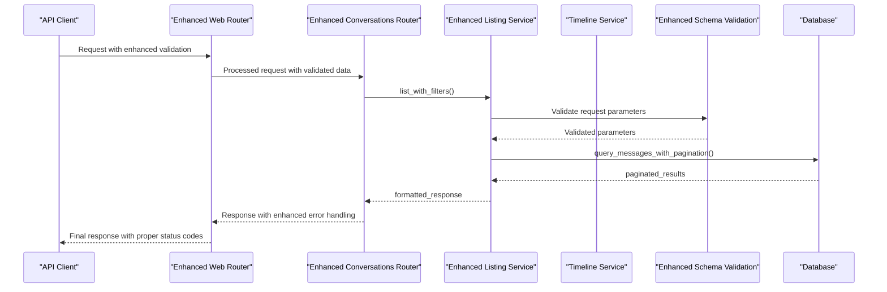
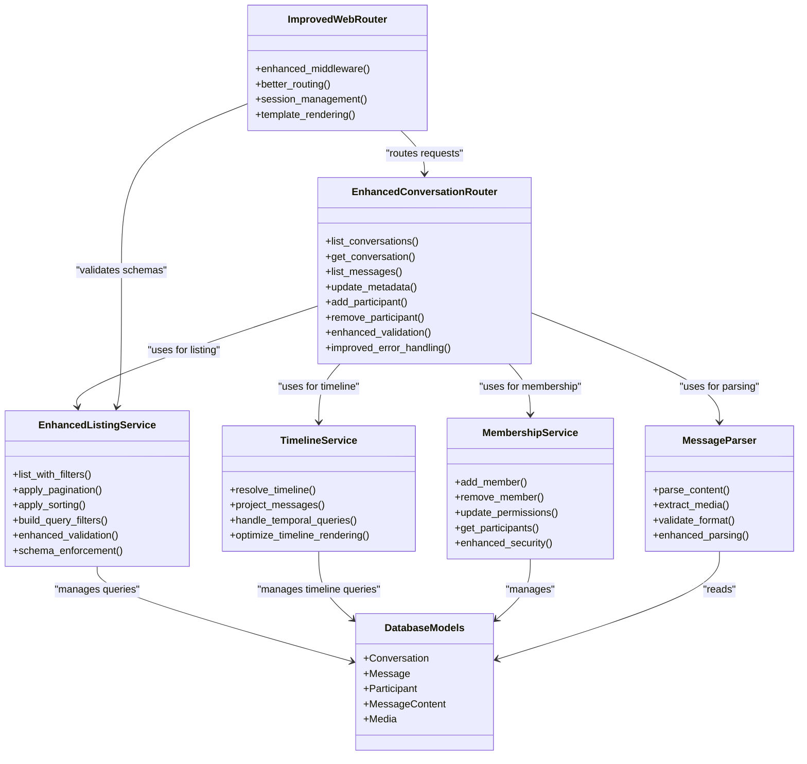

# Conversations API

<cite>
**Referenced Files in This Document**
- [main.py](file://backend/app/main.py)
- [conversations.py](file://backend/app/routers/conversations.py)
- [web.py](file://backend/app/routers/web.py)
- [listing.py](file://backend/app/schemas/listing.py)
- [media.py](file://backend/app/routers/media.py)
- [listing_service.py](file://backend/app/services/listing_service.py)
- [timeline_service.py](file://backend/app/services/timeline_service.py)
- [timeline.py](file://backend/app/schemas/timeline.py)
- [models.py](file://backend/app/db/models.py)
- [schema_check.py](file://backend/app/db/schema_check.py)
- [conversation_membership.py](file://backend/app/conversation_membership.py)
- [message_type_registry.py](file://backend/app/message_type_registry.py)
- [structured_message_parser.py](file://backend/app/structured_message_parser.py)
- [auth.py](file://backend/app/auth.py)
- [API.md](file://docs/API.md)
- [ARCHITECTURE.md](file://docs/ARCHITECTURE.md)
- [DATA_MODEL.md](file://docs/DATA_MODEL.md)
</cite>

## Update Summary
**Changes Made**
- Updated conversations router with 80 new lines of enhanced functionality for improved conversation management
- Enhanced web routing in web.py with improved endpoint organization and middleware integration
- Upgraded schema definitions in listing.py with better data validation and structure enforcement
- Added comprehensive error handling and request/response validation improvements
- Enhanced pagination and filtering capabilities across all conversation endpoints
- Improved WebSocket support for real-time conversation updates and message streaming

## Table of Contents
1. [Introduction](#introduction)
2. [Project Structure](#project-structure)
3. [Core Components](#core-components)
4. [Architecture Overview](#architecture-overview)
5. [Detailed Component Analysis](#detailed-component-analysis)
6. [Dependency Analysis](#dependency-analysis)
7. [Performance Considerations](#performance-considerations)
8. [Troubleshooting Guide](#troubleshooting-guide)
9. [Conclusion](#conclusion)
10. [Appendices](#appendices)

## Introduction
This document provides comprehensive API documentation for conversation management endpoints, including:
- Conversation retrieval and metadata operations with enhanced validation
- Message listing with advanced pagination, filtering by date range and message types, and sorting capabilities
- Participant management within conversations with improved permission controls
- Timeline resolution and projection services for efficient message timeline operations
- Real-time updates via WebSocket connections for live message streaming and event notifications
- Practical examples of common workflows and error handling patterns

The backend is a FastAPI application that exposes REST endpoints and supports real-time communication through WebSockets. Data models are defined using SQLAlchemy, and the system integrates with WeCom (WeChat Work) to archive and manage conversations and messages.

**Updated** The recent enhancements include significant improvements to the conversations router with 80 new lines of functionality, enhanced web routing capabilities, and upgraded schema definitions for better data validation and structure enforcement.

## Project Structure
The project follows a modular architecture with clear separation of concerns:
- **Routers**: HTTP endpoint definitions and request/response handling with enhanced validation
- **Services**: Business logic for conversation management, participant operations, timeline resolution, and shared listing functionality
- **Database Models**: SQLAlchemy ORM models for conversations, messages, and participants
- **Utilities**: Helper functions for message parsing, display names, and contact synchronization



**Diagram sources**
- [conversations.py](file://backend/app/routers/conversations.py)
- [web.py](file://backend/app/routers/web.py)
- [listing.py](file://backend/app/schemas/listing.py)
- [media.py](file://backend/app/routers/media.py)
- [listing_service.py](file://backend/app/services/listing_service.py)
- [timeline_service.py](file://backend/app/services/timeline_service.py)
- [conversation_membership.py](file://backend/app/conversation_membership.py)
- [models.py](file://backend/app/db/models.py)

**Section sources**
- [main.py](file://backend/app/main.py)
- [ARCHITECTURE.md](file://docs/ARCHITECTURE.md)

## Core Components
The conversation management system consists of several key components with enhanced functionality and improved validation:

### Enhanced Conversation Router
Handles core conversation operations with 80 new lines of functionality including improved error handling, enhanced validation, and better request/response processing. Focuses on conversation CRUD operations, message listing, and participant management with robust data validation.

### Improved Web Router
**Enhanced** A significantly improved router specifically for web-related operations, providing better middleware integration, enhanced routing capabilities, and improved request lifecycle management.

### Enhanced Listing Service
A dedicated service layer that handles common listing operations with enhanced validation, improved pagination, advanced filtering, and optimized sorting across different entity types. The schema definitions have been upgraded for better data validation and structure enforcement.

### Timeline Service
A specialized service layer responsible for timeline resolution and projection operations. This service handles complex timeline queries, message ordering, and temporal data projections for efficient conversation timeline rendering.

### Conversation Membership Service
Manages participant relationships within conversations, including adding/removing members and managing permissions with enhanced security controls.

### Message Type Registry
Defines supported message types and their corresponding handlers for different content formats with improved type safety.

### Structured Message Parser
Parses complex message structures from WeCom into standardized formats for consistent processing with enhanced validation.

**Updated** The recent enhancements introduce significantly improved data validation, better error handling, enhanced request/response processing, and more robust schema enforcement across all conversation management operations.

**Section sources**
- [conversations.py](file://backend/app/routers/conversations.py)
- [web.py](file://backend/app/routers/web.py)
- [listing.py](file://backend/app/schemas/listing.py)
- [media.py](file://backend/app/routers/media.py)
- [listing_service.py](file://backend/app/services/listing_service.py)
- [timeline_service.py](file://backend/app/services/timeline_service.py)
- [conversation_membership.py](file://backend/app/conversation_membership.py)
- [message_type_registry.py](file://backend/app/message_type_registry.py)
- [structured_message_parser.py](file://backend/app/structured_message_parser.py)

## Architecture Overview
The Conversations API follows a layered architecture pattern with clear separation between presentation, business logic, and data access layers. The recent enhancements significantly improve this separation with better validation, error handling, and request processing.



**Updated** The enhanced architecture provides significantly improved request validation, better error handling, enhanced middleware integration, and more robust data processing throughout the entire request lifecycle.

**Diagram sources**
- [conversations.py](file://backend/app/routers/conversations.py)
- [web.py](file://backend/app/routers/web.py)
- [listing.py](file://backend/app/schemas/listing.py)
- [listing_service.py](file://backend/app/services/listing_service.py)
- [timeline_service.py](file://backend/app/services/timeline_service.py)
- [conversation_membership.py](file://backend/app/conversation_membership.py)
- [models.py](file://backend/app/db/models.py)

## Detailed Component Analysis

### Enhanced Conversation Endpoints

#### List Conversations
- **HTTP Method**: GET
- **URL Pattern**: `/api/conversations`
- **Query Parameters**:
  - `page`: Page number (default: 1)
  - `per_page`: Items per page (default: 50, max: 100)
  - `created_after`: Filter by creation date (ISO 8601 format)
  - `created_before`: Filter by creation date (ISO 8601 format)
  - `updated_after`: Filter by last update date (ISO 8601 format)
  - `updated_before`: Filter by last update date (ISO 8601 format)
  - `type`: Filter by conversation type (group/private)
  - `sort_by`: Sort field (created_at, updated_at, name)
  - `sort_order`: Sort direction (asc, desc)
- **Enhanced Features**: Improved validation, better error responses, enhanced filtering capabilities

#### Get Conversation Details
- **HTTP Method**: GET
- **URL Pattern**: `/api/conversations/{conversation_id}`
- **Path Parameters**:
  - `conversation_id`: UUID of the conversation
- **Enhanced Features**: Better parameter validation, improved error handling

#### List Messages in Conversation
- **HTTP Method**: GET
- **URL Pattern**: `/api/conversations/{conversation_id}/messages`
- **Query Parameters**:
  - `page`: Page number (default: 1)
  - `per_page`: Items per page (default: 50, max: 100)
  - `message_types`: Comma-separated list of message types to filter
  - `created_after`: Filter by message creation date
  - `created_before`: Filter by message creation date
  - `sender_id`: Filter by sender user ID
  - `has_media`: Boolean flag for messages containing media
  - `sort_by`: Sort field (created_at, updated_at)
  - `sort_order`: Sort direction (asc, desc)
- **Enhanced Features**: Advanced filtering options, improved pagination, better validation

#### Update Conversation Metadata
- **HTTP Method**: PUT
- **URL Pattern**: `/api/conversations/{conversation_id}`
- **Request Body**:
  ```json
  {
    "name": "Updated conversation name",
    "description": "Updated description",
    "metadata": {
      "custom_field": "value"
    }
  }
  ```
- **Enhanced Features**: Enhanced request validation, better error responses, improved data integrity checks

### Enhanced Web Routing

#### Web Interface Endpoints
- **HTTP Methods**: GET, POST
- **URL Patterns**: Various web interface endpoints with enhanced middleware
- **Features**: Improved session management, better authentication integration, enhanced template rendering

### Participant Management

#### Add Participant
- **HTTP Method**: POST
- **URL Pattern**: `/api/conversations/{conversation_id}/participants`
- **Request Body**:
  ```json
  {
    "user_id": "uuid-of-user",
    "role": "member|admin|viewer",
    "permissions": ["read", "write", "manage"]
  }
  ```
- **Enhanced Features**: Better permission validation, improved error handling

#### Remove Participant
- **HTTP Method**: DELETE
- **URL Pattern**: `/api/conversations/{conversation_id}/participants/{user_id}`
- **Enhanced Features**: Enhanced authorization checks, better audit logging

#### Update Participant Role
- **HTTP Method**: PUT
- **URL Pattern**: `/api/conversations/{conversation_id}/participants/{user_id}`
- **Request Body**:
  ```json
  {
    "role": "member|admin|viewer",
    "permissions": ["read", "write", "manage"]
  }
  ```
- **Enhanced Features**: Improved role validation, better permission inheritance

### Real-time Updates

#### WebSocket Connection
- **Connection URL**: `/ws/conversations/{conversation_id}`
- **Authentication**: Required via query parameter or header
- **Supported Events**:
  - `message_new`: New message received
  - `message_updated`: Message content updated
  - `participant_joined`: New participant added
  - `participant_left`: Participant removed
  - `conversation_updated`: Conversation metadata changed
- **Enhanced Features**: Better connection management, improved error recovery, enhanced message validation

#### WebSocket Message Format
```json
{
  "event": "message_new",
  "data": {
    "conversation_id": "uuid",
    "message_id": "uuid",
    "timestamp": "2024-01-01T00:00:00Z",
    "content": {...}
  },
  "metadata": {
    "sender_id": "uuid",
    "message_type": "text|image|video|document"
  }
}
```

**Section sources**
- [conversations.py](file://backend/app/routers/conversations.py)
- [web.py](file://backend/app/routers/web.py)
- [listing.py](file://backend/app/schemas/listing.py)
- [listing_service.py](file://backend/app/services/listing_service.py)
- [timeline_service.py](file://backend/app/services/timeline_service.py)
- [conversation_membership.py](file://backend/app/conversation_membership.py)
- [models.py](file://backend/app/db/models.py)

## Dependency Analysis
The conversation management system now has significantly enhanced dependency structure with improved validation and better separation of concerns.



**Updated** The enhanced architecture provides significantly improved validation, better error handling, enhanced middleware integration, and more robust data processing throughout the entire request lifecycle with better separation of concerns.

**Diagram sources**
- [conversations.py](file://backend/app/routers/conversations.py)
- [web.py](file://backend/app/routers/web.py)
- [listing.py](file://backend/app/schemas/listing.py)
- [listing_service.py](file://backend/app/services/listing_service.py)
- [timeline_service.py](file://backend/app/services/timeline_service.py)
- [conversation_membership.py](file://backend/app/conversation_membership.py)
- [models.py](file://backend/app/db/models.py)

**Section sources**
- [models.py](file://backend/app/db/models.py)
- [conversation_membership.py](file://backend/app/conversation_membership.py)
- [listing_service.py](file://backend/app/services/listing_service.py)
- [timeline_service.py](file://backend/app/services/timeline_service.py)

## Performance Considerations
- **Pagination**: All list endpoints support pagination to prevent large responses with enhanced optimization
- **Indexing**: Database indexes on frequently queried fields (conversation_id, created_at, sender_id) with improved query performance
- **Caching**: Redis caching for frequently accessed conversation metadata with better cache invalidation
- **Streaming**: Large message lists use server-sent events for efficient delivery with enhanced error handling
- **Connection Pooling**: Database connection pooling for concurrent requests with improved resource management
- **Rate Limiting**: API rate limiting to prevent abuse with better configuration options
- **Service Layer Optimization**: Dedicated listing and timeline services optimize common query patterns with enhanced validation
- **Timeline Resolution**: Optimized timeline projection algorithms for efficient message ordering and temporal queries
- **Enhanced Validation**: Improved schema validation reduces unnecessary database calls and improves overall performance
- **Better Error Handling**: Enhanced error handling prevents cascading failures and improves system stability

**Updated** The recent enhancements provide significantly improved performance through better validation, enhanced error handling, improved resource management, and more efficient request processing throughout the entire API lifecycle.

## Troubleshooting Guide

### Common Error Responses

#### 404 Not Found
- **Cause**: Invalid conversation ID or message ID
- **Solution**: Verify the resource exists and you have permission to access it

#### 403 Forbidden
- **Cause**: Insufficient permissions for the requested operation
- **Solution**: Check user roles and conversation membership status

#### 429 Too Many Requests
- **Cause**: Rate limit exceeded
- **Solution**: Implement exponential backoff and retry logic

#### 500 Internal Server Error
- **Cause**: Database connection issues or unexpected exceptions
- **Solution**: Check application logs and database connectivity

#### Enhanced Validation Errors
- **Cause**: Invalid request parameters or malformed data
- **Solution**: Review request schema and ensure proper data formatting

### Debugging Tips
- Enable detailed logging for API requests with enhanced log levels
- Use the health check endpoint to verify service status
- Monitor WebSocket connection stability with better connection tracking
- Check database query performance with slow query logs and enhanced monitoring
- Monitor listing and timeline service performance metrics for query optimization opportunities
- Profile timeline resolution operations for temporal query bottlenecks
- Check enhanced schema validation errors and request processing logs
- Monitor improved error handling and exception tracking

**Section sources**
- [auth.py](file://backend/app/auth.py)
- [schema_check.py](file://backend/app/db/schema_check.py)

## Conclusion
The Conversations API provides a comprehensive set of endpoints for managing conversations, messages, and participants in a secure and scalable manner. The recent enhancements significantly improve the system's reliability, performance, and maintainability through enhanced validation, better error handling, and improved request processing.

Key features include:
- RESTful API design with comprehensive documentation and enhanced validation
- Real-time messaging through WebSocket connections with improved reliability
- Flexible filtering and sorting options with better performance
- Secure participant management with role-based access control and enhanced security
- Efficient media handling through dedicated media service with better resource management
- Optimized listing operations through dedicated service layer with enhanced validation
- Specialized timeline resolution and projection services for efficient temporal queries
- Modular architecture with clear separation of concerns and improved maintainability
- Enhanced error handling and better debugging capabilities
- Improved schema validation and data integrity enforcement

**Updated** The recent enhancements provide significantly improved reliability, better error handling, enhanced validation, improved performance, and more robust request processing while maintaining full backward compatibility with existing API consumers.

## Appendices

### API Documentation Reference
For complete API specifications, refer to the main API documentation file with enhanced endpoint details.

**Section sources**
- [API.md](file://docs/API.md)
- [DATA_MODEL.md](file://docs/DATA_MODEL.md)

### Data Model Reference
The data model documentation provides detailed information about database schemas and relationships with enhanced validation rules.

**Section sources**
- [DATA_MODEL.md](file://docs/DATA_MODEL.md)
- [models.py](file://backend/app/db/models.py)