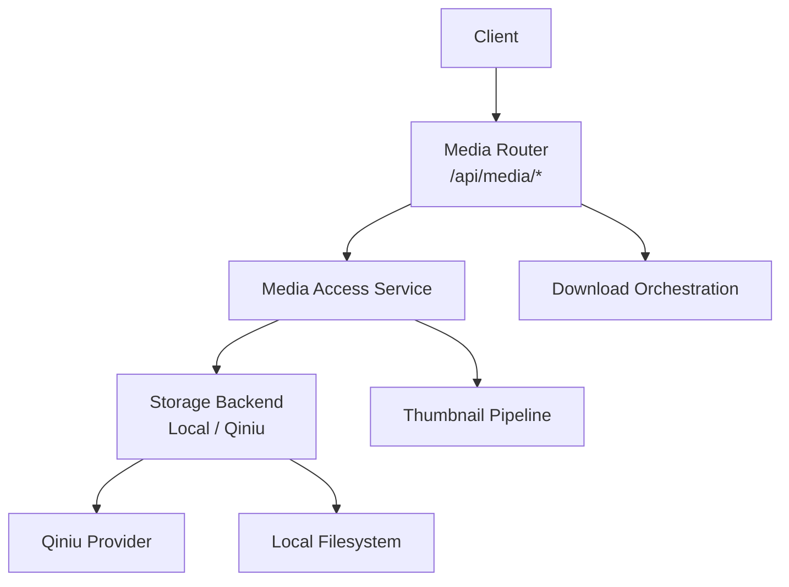
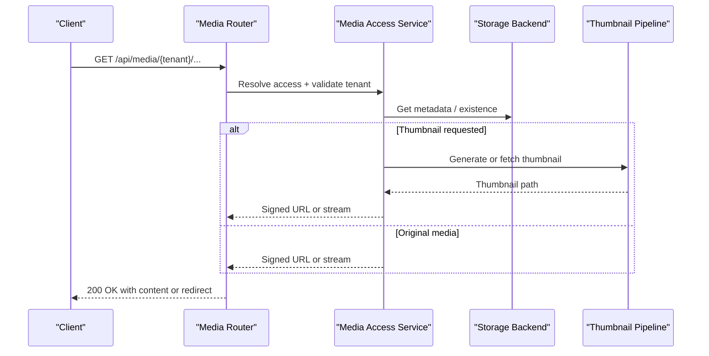
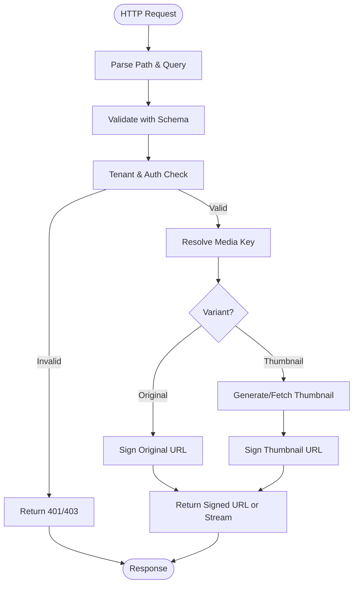
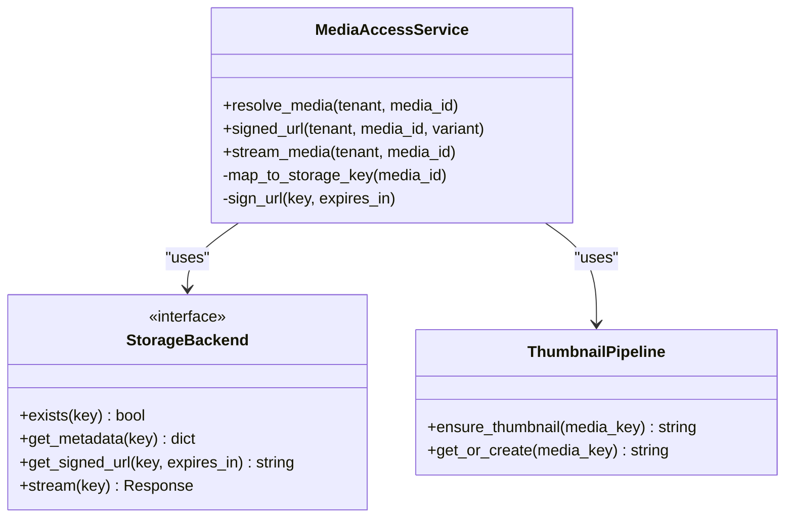
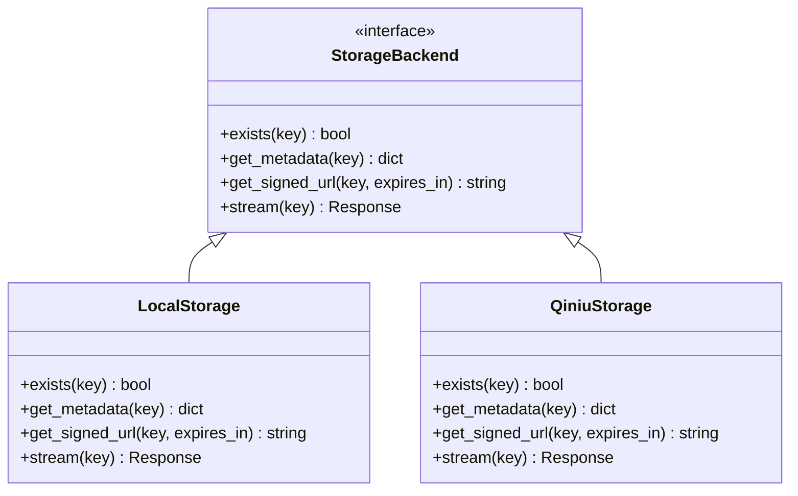
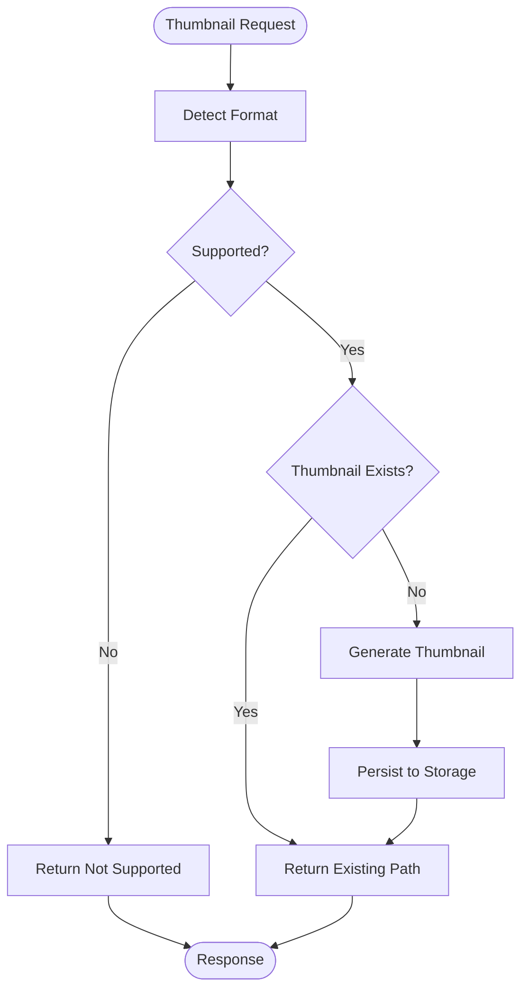
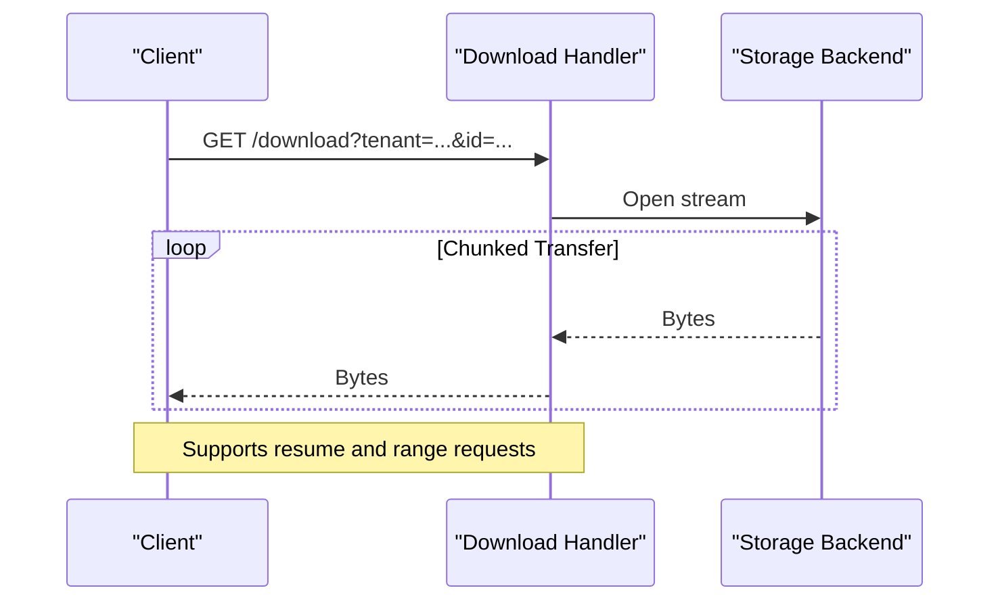
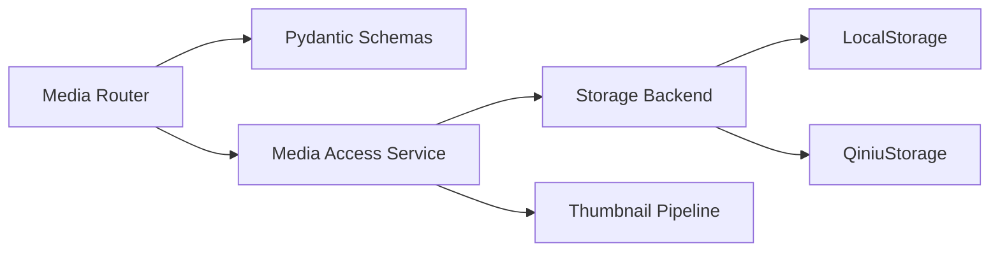

# Media Router API Endpoints

<cite>
**Referenced Files in This Document**
- [main.py](file://backend/app/main.py)
- [media.py](file://backend/app/routers/media.py)
- [media_schema.py](file://backend/app/schemas/media.py)
- [media_access_service.py](file://backend/app/services/media_access.py)
- [media_storage.py](file://backend/app/media_storage.py)
- [qiniu_storage.py](file://backend/app/qiniu_storage.py)
- [media_download.py](file://backend/app/media_download.py)
- [thumbnail_pipeline.py](file://backend/app/thumbnail_pipeline.py)
- [media_thumbnails.py](file://backend/app/media_thumbnails.py)
- [API.md](file://docs/API.md)
</cite>

## Table of Contents
1. [Introduction](#introduction)
2. [Project Structure](#project-structure)
3. [Core Components](#core-components)
4. [Architecture Overview](#architecture-overview)
5. [Detailed Component Analysis](#detailed-component-analysis)
6. [Dependency Analysis](#dependency-analysis)
7. [Performance Considerations](#performance-considerations)
8. [Troubleshooting Guide](#troubleshooting-guide)
9. [Conclusion](#conclusion)

## Introduction
This document describes the Media Router API endpoints exposed by the application, focusing on how media assets are discovered, accessed, and served through a secure, tenant-scoped interface. It explains request flows, storage backends, thumbnail generation, and download orchestration, with guidance for integration and troubleshooting.

## Project Structure
The media subsystem is organized around FastAPI routers, Pydantic schemas, service layers, and storage providers:
- Routers define HTTP endpoints and validation
- Schemas define request/response models
- Services encapsulate business logic (access control, signing, orchestration)
- Storage modules implement backend-specific behavior (local filesystem, Qiniu/Kodo)
- Thumbnail pipeline generates and caches thumbnails
- Download utilities handle large file retrieval and streaming

**Diagram sources**
- [media.py](file://backend/app/routers/media.py)
- [media_access_service.py](file://backend/app/services/media_access.py)
- [media_storage.py](file://backend/app/media_storage.py)
- [qiniu_storage.py](file://backend/app/qiniu_storage.py)
- [thumbnail_pipeline.py](file://backend/app/thumbnail_pipeline.py)
- [media_download.py](file://backend/app/media_download.py)

**Section sources**
- [main.py](file://backend/app/main.py)
- [media.py](file://backend/app/routers/media.py)
- [media_schema.py](file://backend/app/schemas/media.py)
- [media_access_service.py](file://backend/app/services/media_access.py)
- [media_storage.py](file://backend/app/media_storage.py)
- [qiniu_storage.py](file://backend/app/qiniu_storage.py)
- [thumbnail_pipeline.py](file://backend/app/thumbnail_pipeline.py)
- [media_download.py](file://backend/app/media_download.py)

## Core Components
- Media Router: Registers endpoints under a common prefix, validates inputs, and delegates to services.
- Media Access Service: Enforces tenant scoping, resolves storage keys, and produces signed URLs or streams.
- Storage Abstraction: Pluggable backends for local disk and object storage (e.g., Qiniu).
- Thumbnail Pipeline: Generates thumbnails on demand and caches them alongside originals.
- Download Orchestration: Streams large files efficiently and handles retries/backoff.

Key responsibilities:
- Tenant isolation for media access
- Secure, time-bound access via signed URLs
- Efficient streaming for large media
- Thumbnail generation and caching
- Consistent error responses and status codes

**Section sources**
- [media.py](file://backend/app/routers/media.py)
- [media_schema.py](file://backend/app/schemas/media.py)
- [media_access_service.py](file://backend/app/services/media_access.py)
- [media_storage.py](file://backend/app/media_storage.py)
- [qiniu_storage.py](file://backend/app/qiniu_storage.py)
- [thumbnail_pipeline.py](file://backend/app/thumbnail_pipeline.py)
- [media_download.py](file://backend/app/media_download.py)

## Architecture Overview
The media API follows a layered architecture:
- Presentation layer (FastAPI router) handles HTTP I/O and validation
- Service layer implements access control and orchestration
- Storage layer abstracts backend details
- Thumbnail pipeline integrates with storage to produce derived assets

**Diagram sources**
- [media.py](file://backend/app/routers/media.py)
- [media_access_service.py](file://backend/app/services/media_access.py)
- [media_storage.py](file://backend/app/media_storage.py)
- [thumbnail_pipeline.py](file://backend/app/thumbnail_pipeline.py)

## Detailed Component Analysis

### Media Router Endpoints
Responsibilities:
- Define routes under a tenant-aware prefix
- Validate query parameters and path segments
- Return appropriate HTTP status codes and structured errors
- Delegate to services for business logic

Typical endpoint categories:
- List media items for a conversation or message
- Retrieve signed URLs for original or thumbnail variants
- Stream media directly when needed
- Trigger thumbnail generation or regeneration

Request flow highlights:
- Input validation via Pydantic schemas
- Tenant extraction and authorization checks
- Delegation to access service for resolution and signing
- Streaming responses for large payloads

**Diagram sources**
- [media.py](file://backend/app/routers/media.py)
- [media_schema.py](file://backend/app/schemas/media.py)
- [media_access_service.py](file://backend/app/services/media_access.py)

**Section sources**
- [media.py](file://backend/app/routers/media.py)
- [media_schema.py](file://backend/app/schemas/media.py)

### Media Access Service
Responsibilities:
- Enforce tenant scoping and permissions
- Map logical media identifiers to storage keys
- Produce signed URLs or direct streams based on configuration
- Coordinate thumbnail generation and caching

Key behaviors:
- Cache-friendly headers and conditional requests
- Time-bounded signatures to limit exposure
- Fallback strategies when thumbnails are missing
- Error mapping to consistent HTTP responses

**Diagram sources**
- [media_access_service.py](file://backend/app/services/media_access.py)
- [media_storage.py](file://backend/app/media_storage.py)
- [thumbnail_pipeline.py](file://backend/app/thumbnail_pipeline.py)

**Section sources**
- [media_access_service.py](file://backend/app/services/media_access.py)
- [media_storage.py](file://backend/app/media_storage.py)

### Storage Backends
Responsibilities:
- Abstract storage operations behind a common interface
- Implement tenant-aware key naming and paths
- Provide signed URL generation and streaming
- Handle backend-specific metadata and capabilities

Backends:
- Local filesystem: simple path-based storage
- Qiniu/Kodo: cloud object storage with CDN and signed URLs

**Diagram sources**
- [media_storage.py](file://backend/app/media_storage.py)
- [qiniu_storage.py](file://backend/app/qiniu_storage.py)

**Section sources**
- [media_storage.py](file://backend/app/media_storage.py)
- [qiniu_storage.py](file://backend/app/qiniu_storage.py)

### Thumbnail Pipeline
Responsibilities:
- Generate thumbnails from original media
- Cache thumbnails alongside originals
- Support regeneration and invalidation
- Integrate with storage backend for persistence

Processing steps:
- Detect supported formats
- Create resized image or extract frame
- Store thumbnail with deterministic key
- Return thumbnail path or URL

**Diagram sources**
- [thumbnail_pipeline.py](file://backend/app/thumbnail_pipeline.py)
- [media_thumbnails.py](file://backend/app/media_thumbnails.py)

**Section sources**
- [thumbnail_pipeline.py](file://backend/app/thumbnail_pipeline.py)
- [media_thumbnails.py](file://backend/app/media_thumbnails.py)

### Download Orchestration
Responsibilities:
- Stream large files efficiently without loading into memory
- Handle retries and partial downloads
- Provide progress hooks and timeouts
- Normalize errors across backends

**Diagram sources**
- [media_download.py](file://backend/app/media_download.py)
- [media_storage.py](file://backend/app/media_storage.py)

**Section sources**
- [media_download.py](file://backend/app/media_download.py)

## Dependency Analysis
The media subsystem exhibits clear separation of concerns:
- Router depends on schemas and services
- Services depend on storage abstraction and thumbnail pipeline
- Storage implementations are interchangeable
- Thumbnail pipeline depends on storage for persistence

**Diagram sources**
- [media.py](file://backend/app/routers/media.py)
- [media_schema.py](file://backend/app/schemas/media.py)
- [media_access_service.py](file://backend/app/services/media_access.py)
- [media_storage.py](file://backend/app/media_storage.py)
- [qiniu_storage.py](file://backend/app/qiniu_storage.py)
- [thumbnail_pipeline.py](file://backend/app/thumbnail_pipeline.py)

**Section sources**
- [media.py](file://backend/app/routers/media.py)
- [media_schema.py](file://backend/app/schemas/media.py)
- [media_access_service.py](file://backend/app/services/media_access.py)
- [media_storage.py](file://backend/app/media_storage.py)
- [qiniu_storage.py](file://backend/app/qiniu_storage.py)
- [thumbnail_pipeline.py](file://backend/app/thumbnail_pipeline.py)

## Performance Considerations
- Prefer signed URLs for large assets to offload bandwidth to storage provider
- Use streaming responses to minimize server memory usage
- Cache thumbnails aggressively and leverage CDN where available
- Set appropriate cache-control headers for static variants
- Batch thumbnail generation during ingestion to avoid cold starts
- Tune timeout and retry policies for network resilience

[No sources needed since this section provides general guidance]

## Troubleshooting Guide
Common issues and resolutions:
- 401/403 errors: Verify tenant context and authentication tokens
- 404 not found: Confirm media exists and storage key mapping is correct
- Timeout or partial downloads: Check network conditions and adjust chunk sizes
- Missing thumbnails: Ensure format support and regeneration triggers
- Signed URL expiration: Increase expiry window if clients are slow to consume

Operational checks:
- Validate storage backend connectivity and credentials
- Inspect thumbnail cache directory structure
- Review logs for storage errors and signature failures
- Test with curl using range requests for resume capability

**Section sources**
- [media.py](file://backend/app/routers/media.py)
- [media_access_service.py](file://backend/app/services/media_access.py)
- [media_storage.py](file://backend/app/media_storage.py)
- [thumbnail_pipeline.py](file://backend/app/thumbnail_pipeline.py)
- [media_download.py](file://backend/app/media_download.py)

## Conclusion
The Media Router API provides a secure, scalable, and tenant-isolated interface for accessing and serving media assets. By separating routing, access control, storage abstraction, and thumbnail generation, the system remains flexible and performant. Adopting signed URLs, streaming, and caching ensures efficient delivery while maintaining strong security boundaries.

[No sources needed since this section summarizes without analyzing specific files]