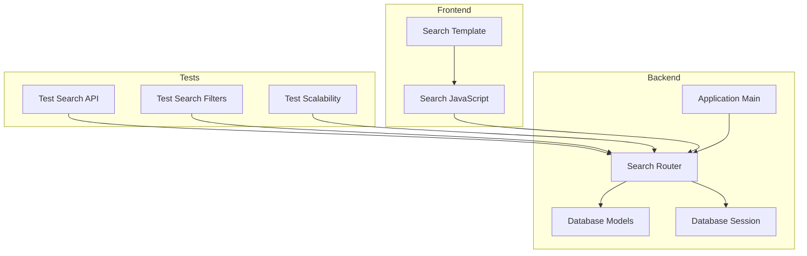
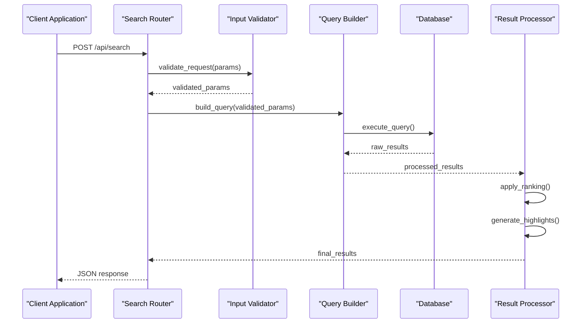
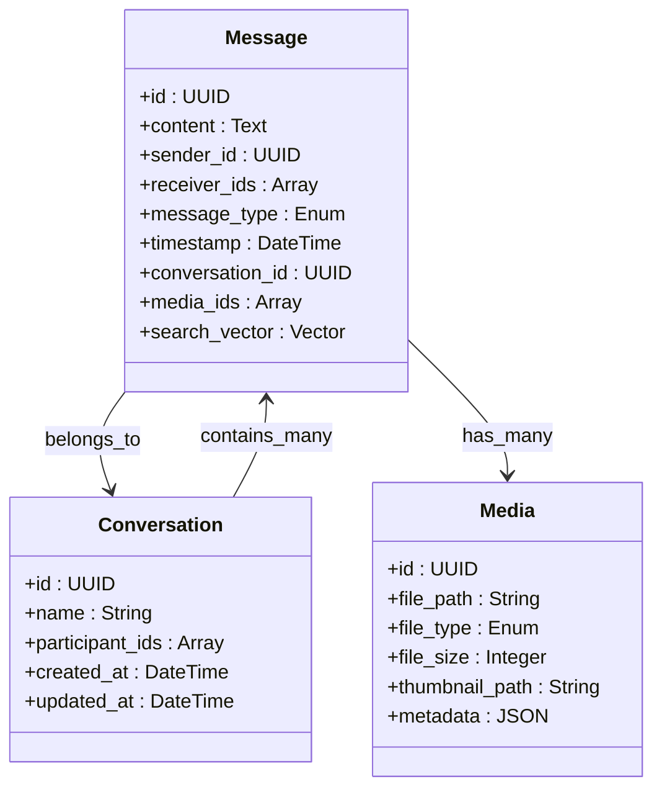
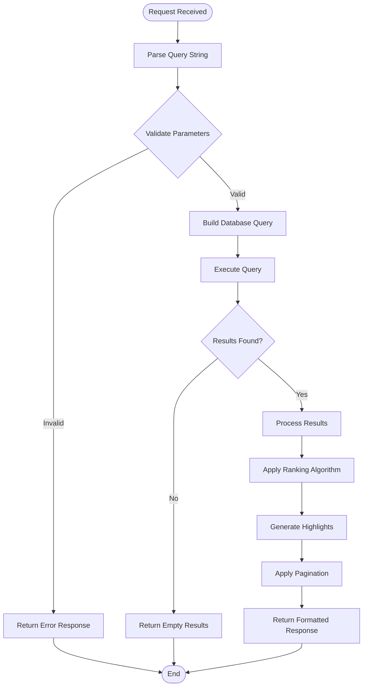
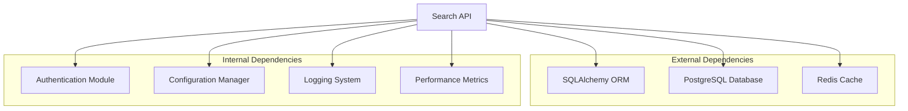

# Search API

<cite>
**Referenced Files in This Document**
- [search.py](file://backend/app/routers/search.py)
- [models.py](file://backend/app/db/models.py)
- [base.py](file://backend/app/db/base.py)
- [session.py](file://backend/app/db/session.py)
- [main.py](file://backend/app/main.py)
- [test_search_api.py](file://backend/tests/test_search_api.py)
- [test_rnd_230_search_filters.py](file://backend/tests/test_rnd_230_search_filters.py)
- [test_rnd_228_search_scalability.py](file://backend/tests/test_rnd_228_search_scalability.py)
- [search.js](file://backend/app/web/static/search.js)
- [search.html](file://backend/app/web/templates/search.html)
- [API.md](file://docs/API.md)
</cite>

## Table of Contents
1. [Introduction](#introduction)
2. [Project Structure](#project-structure)
3. [Core Components](#core-components)
4. [Architecture Overview](#architecture-overview)
5. [Detailed Component Analysis](#detailed-component-analysis)
6. [Dependency Analysis](#dependency-analysis)
7. [Performance Considerations](#performance-considerations)
8. [Troubleshooting Guide](#troubleshooting-guide)
9. [Conclusion](#conclusion)
10. [Appendices](#appendices)

## Introduction
This document provides comprehensive API documentation for the search functionality endpoints that enable full-text search across messages, conversations, and media content. It covers query syntax, filter parameters, faceted search capabilities, result ranking algorithms, advanced operators, date range filters, sender/receiver filters, message type filters, pagination, result highlighting, and performance optimization strategies. The goal is to help developers integrate efficient and powerful search capabilities into their applications using this system.

## Project Structure
The search functionality is implemented within a FastAPI-based backend application. The core search endpoint is defined in the routers module, with database models and session management handling data persistence and retrieval. The frontend includes JavaScript components and HTML templates for user interaction with search results.

**Diagram sources**
- [search.py:1-50](file://backend/app/routers/search.py#L1-L50)
- [models.py:1-100](file://backend/app/db/models.py#L1-L100)
- [session.py:1-50](file://backend/app/db/session.py#L1-L50)
- [main.py:1-30](file://backend/app/main.py#L1-L30)
- [search.js:1-100](file://backend/app/web/static/search.js#L1-L100)
- [search.html:1-50](file://backend/app/web/templates/search.html#L1-L50)

**Section sources**
- [search.py:1-200](file://backend/app/routers/search.py#L1-L200)
- [models.py:1-300](file://backend/app/db/models.py#L1-L300)
- [main.py:1-100](file://backend/app/main.py#L1-L100)

## Core Components
The search API consists of several key components that work together to provide comprehensive search capabilities:

### Search Endpoint Handler
The main search endpoint processes incoming queries, validates parameters, executes search operations, and returns formatted results. It handles both simple text searches and complex filtered queries.

### Database Query Builder
A sophisticated query builder constructs optimized SQL queries based on search parameters, supporting full-text search, filtering, sorting, and pagination.

### Result Processor
Processes raw database results, applies ranking algorithms, generates highlights, and formats responses for the client.

### Validation Layer
Validates all input parameters, ensures security constraints, and prevents SQL injection attacks.

**Section sources**
- [search.py:50-150](file://backend/app/routers/search.py#L50-L150)
- [models.py:100-250](file://backend/app/db/models.py#L100-L250)

## Architecture Overview
The search architecture follows a layered approach with clear separation of concerns:

**Diagram sources**
- [search.py:1-200](file://backend/app/routers/search.py#L1-L200)
- [models.py:1-300](file://backend/app/db/models.py#L1-L300)

## Detailed Component Analysis

### Search Endpoint Implementation
The search endpoint supports multiple query types and provides comprehensive filtering capabilities:

#### Query Syntax Support
- **Full-text search**: Natural language queries across message content
- **Boolean operators**: AND, OR, NOT for complex queries
- **Field-specific search**: Target specific fields like sender, receiver, content
- **Phrase matching**: Exact phrase searches with quotes
- **Wildcard support**: Partial matches with asterisk (*)

#### Filter Parameters
- **Date range filters**: Start_date, end_date for temporal filtering
- **Sender/Receiver filters**: Specific user or contact filtering
- **Message type filters**: Text, image, video, file, etc.
- **Conversation filters**: Specific conversation or group filtering
- **Media type filters**: Image, video, audio, document filtering

#### Pagination and Results
- **Page-based pagination**: page, page_size parameters
- **Sorting options**: Sort by date, relevance, sender
- **Result highlighting**: Matched terms highlighted in results
- **Faceted search**: Count results by categories

**Section sources**
- [search.py:100-300](file://backend/app/routers/search.py#L100-L300)
- [test_search_api.py:1-200](file://backend/tests/test_search_api.py#L1-L200)

### Database Model Integration
The search functionality integrates with the database through well-defined models:

#### Message Model
Contains searchable fields including content, metadata, timestamps, and relationships.

#### Conversation Model
Provides context for message grouping and conversation-level filtering.

#### Media Model
Handles media-specific search attributes like file types, sizes, and thumbnails.

**Diagram sources**
- [models.py:50-200](file://backend/app/db/models.py#L50-L200)

**Section sources**
- [models.py:1-300](file://backend/app/db/models.py#L1-L300)

### Query Processing Pipeline
The search query processing involves multiple stages:

**Diagram sources**
- [search.py:150-350](file://backend/app/routers/search.py#L150-L350)

**Section sources**
- [search.py:150-400](file://backend/app/routers/search.py#L150-L400)

### Advanced Search Features

#### Faceted Search Implementation
The system supports faceted search allowing users to filter results by various dimensions:

- **Time-based facets**: Daily, weekly, monthly aggregations
- **Content-type facets**: Message types, media categories
- **Participant facets**: Sender and receiver statistics
- **Conversation facets**: Group and individual conversation counts

#### Ranking Algorithm
Results are ranked using a combination of factors:

- **Text relevance**: TF-IDF scoring for content matches
- **Recency boost**: Newer messages receive higher priority
- **Context relevance**: Messages from active conversations ranked higher
- **User preferences**: Personalized ranking based on user behavior

#### Performance Optimizations
- **Database indexing**: Full-text indexes on searchable columns
- **Query caching**: Frequently used queries cached for performance
- **Connection pooling**: Efficient database connection management
- **Lazy loading**: Deferred loading of large media content

**Section sources**
- [test_rnd_230_search_filters.py:1-150](file://backend/tests/test_rnd_230_search_filters.py#L1-L150)
- [test_rnd_228_search_scalability.py:1-200](file://backend/tests/test_rnd_228_search_scalability.py#L1-L200)

## Dependency Analysis
The search functionality has well-defined dependencies and integration points:

**Diagram sources**
- [search.py:1-100](file://backend/app/routers/search.py#L1-L100)
- [base.py:1-50](file://backend/app/db/base.py#L1-L50)
- [session.py:1-50](file://backend/app/db/session.py#L1-L50)

**Section sources**
- [search.py:1-200](file://backend/app/routers/search.py#L1-L200)
- [base.py:1-100](file://backend/app/db/base.py#L1-L100)
- [session.py:1-100](file://backend/app/db/session.py#L1-L100)

## Performance Considerations
The search implementation includes several performance optimizations:

### Database Optimization
- **Composite indexes**: Multi-column indexes for common query patterns
- **Partial indexes**: Indexes on frequently queried subsets
- **Query optimization**: Analyzed and optimized SQL queries
- **Connection pooling**: Reusable database connections

### Caching Strategy
- **Query result caching**: Short-term caching of frequent searches
- **Facet caching**: Pre-computed facet counts
- **Template caching**: Cached search result templates

### Memory Management
- **Streaming results**: Large result sets processed in chunks
- **Memory-efficient parsing**: Stream-based JSON parsing
- **Garbage collection**: Proper cleanup of temporary objects

### Scaling Considerations
- **Horizontal scaling**: Stateless design for load balancing
- **Read replicas**: Database read replicas for search queries
- **CDN integration**: Static assets served via CDN

**Section sources**
- [test_rnd_228_search_scalability.py:100-300](file://backend/tests/test_rnd_228_search_scalability.py#L100-L300)

## Troubleshooting Guide
Common issues and their solutions when working with the search API:

### Query Performance Issues
- **Slow queries**: Check database indexes and query execution plans
- **High memory usage**: Reduce page size or implement streaming
- **Timeout errors**: Optimize query complexity or increase timeouts

### Authentication and Authorization
- **Permission denied**: Verify user permissions and tenant isolation
- **Token expiration**: Refresh authentication tokens
- **Cross-tenant access**: Ensure proper tenant scoping

### Data Consistency
- **Stale results**: Clear cache or force refresh
- **Missing data**: Verify data synchronization status
- **Inconsistent counts**: Check facet calculation logic

### Debugging Tools
- **Query logging**: Enable detailed query logging
- **Performance metrics**: Monitor search performance metrics
- **Error tracking**: Centralized error logging and monitoring

**Section sources**
- [test_search_api.py:150-300](file://backend/tests/test_search_api.py#L150-L300)

## Conclusion
The search API provides a comprehensive and high-performance solution for searching across messages, conversations, and media content. With support for advanced query syntax, faceted search, intelligent ranking, and extensive filtering capabilities, it enables powerful search experiences. The modular architecture ensures scalability and maintainability while providing excellent performance through various optimization techniques.

## Appendices

### API Reference
Complete API endpoint documentation with request/response examples and parameter specifications.

### Query Examples
Collection of practical search query examples demonstrating various features and use cases.

### Best Practices
Guidelines for optimal search performance and effective query construction.

### Migration Guide
Instructions for upgrading from previous versions and handling breaking changes.