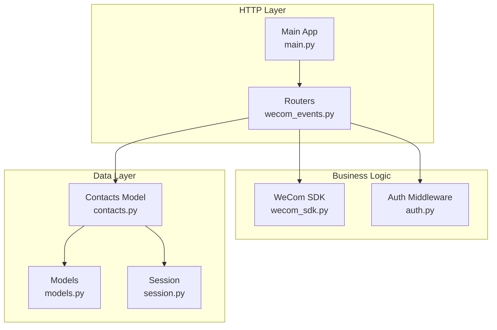
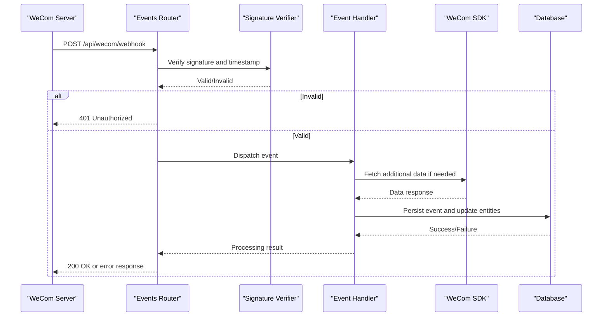
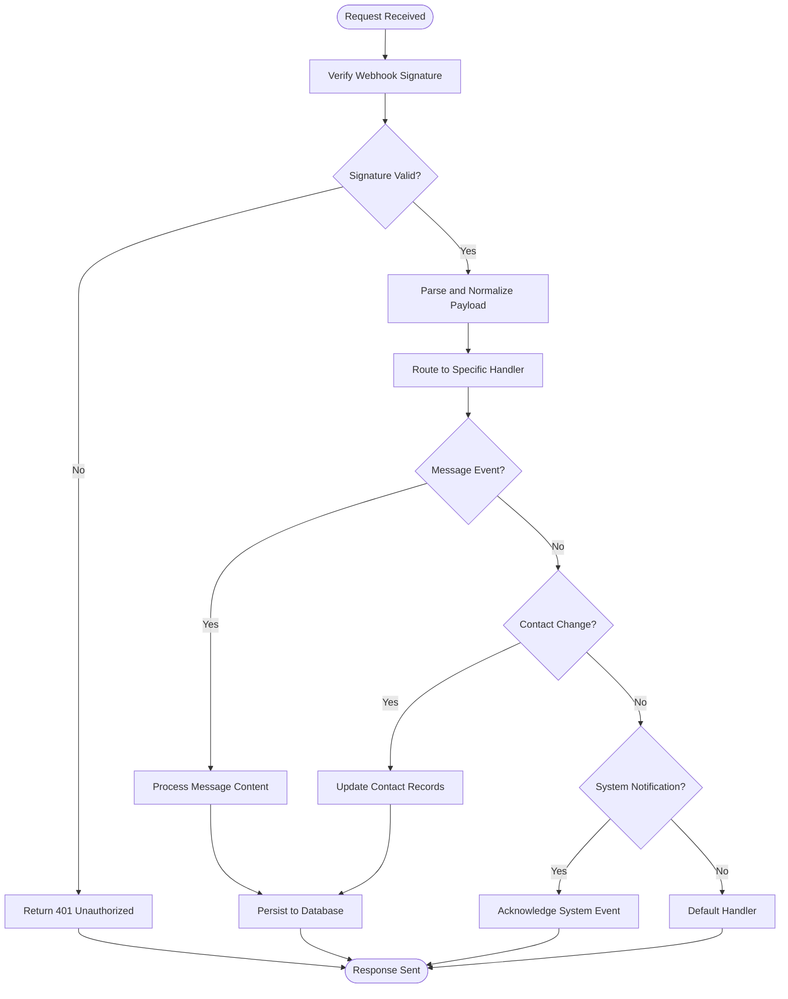
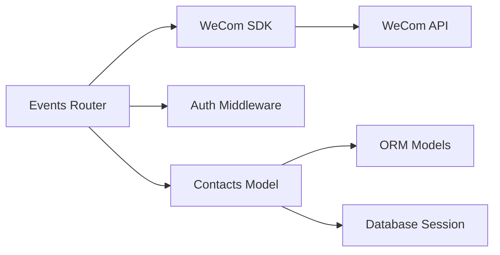

# Webhook & Event API

<cite>
**Referenced Files in This Document**
- [wecom_events.py](file://backend/app/routers/wecom_events.py)
- [main.py](file://backend/app/main.py)
- [wecom_sdk.py](file://backend/app/sdk/wecom_sdk.py)
- [contacts.py](file://backend/app/db/contacts.py)
- [models.py](file://backend/app/db/models.py)
- [session.py](file://backend/app/db/session.py)
- [auth.py](file://backend/app/auth.py)
- [API.md](file://docs/API.md)
</cite>

## Table of Contents
1. [Introduction](#introduction)
2. [Project Structure](#project-structure)
3. [Core Components](#core-components)
4. [Architecture Overview](#architecture-overview)
5. [Detailed Component Analysis](#detailed-component-analysis)
6. [Dependency Analysis](#dependency-analysis)
7. [Performance Considerations](#performance-considerations)
8. [Troubleshooting Guide](#troubleshooting-guide)
9. [Conclusion](#conclusion)
10. [Appendices](#appendices)

## Introduction
This document provides comprehensive API documentation for WeCom webhook handlers and event processing endpoints within the application. It covers incoming webhook endpoints for message events, contact changes, and system notifications, including payload formats, signature verification, retry mechanisms, error handling, event subscription management, webhook configuration, delivery status tracking, security requirements, rate limiting, and troubleshooting guidance. Examples of webhook event payloads and processing workflows are included to help developers integrate and debug effectively.

## Project Structure
The WeCom webhook and event processing functionality is implemented primarily under the backend application routers and SDK modules:
- Router layer exposes HTTP endpoints for receiving webhooks and exposing internal APIs.
- SDK module encapsulates WeCom client interactions and utilities.
- Database models and sessions manage persistence of contacts, messages, and related metadata.
- Authentication middleware secures endpoints where applicable.

**Diagram sources**
- [main.py](file://backend/app/main.py)
- [wecom_events.py](file://backend/app/routers/wecom_events.py)
- [wecom_sdk.py](file://backend/app/sdk/wecom_sdk.py)
- [auth.py](file://backend/app/auth.py)
- [models.py](file://backend/app/db/models.py)
- [contacts.py](file://backend/app/db/contacts.py)
- [session.py](file://backend/app/db/session.py)

**Section sources**
- [main.py](file://backend/app/main.py)
- [wecom_events.py](file://backend/app/routers/wecom_events.py)
- [wecom_sdk.py](file://backend/app/sdk/wecom_sdk.py)
- [auth.py](file://backend/app/auth.py)
- [models.py](file://backend/app/db/models.py)
- [contacts.py](file://backend/app/db/contacts.py)
- [session.py](file://backend/app/db/session.py)

## Core Components
- WeCom Events Router: Defines endpoints for receiving and processing WeCom webhooks (message events, contact changes, system notifications). Handles request validation, signature verification, and dispatching to appropriate handlers.
- WeCom SDK: Provides methods for interacting with WeCom APIs, including token management, decryption utilities, and data retrieval operations.
- Contacts Model: Manages contact-related database operations, syncing updates from WeCom events, and maintaining tenant-scoped contact records.
- Models and Session: Define ORM models and session management for persistent storage of messages, contacts, and metadata.
- Auth Middleware: Enforces authentication and authorization for protected endpoints.

Key responsibilities:
- Validate and verify webhook signatures using configured secrets.
- Parse and normalize incoming payloads into internal event structures.
- Persist processed events and update relevant entities (e.g., contacts, messages).
- Return appropriate HTTP responses to acknowledge receipt or signal errors.
- Integrate with background workers for long-running tasks like media downloads.

**Section sources**
- [wecom_events.py](file://backend/app/routers/wecom_events.py)
- [wecom_sdk.py](file://backend/app/sdk/wecom_sdk.py)
- [contacts.py](file://backend/app/db/contacts.py)
- [models.py](file://backend/app/db/models.py)
- [session.py](file://backend/app/db/session.py)
- [auth.py](file://backend/app/auth.py)

## Architecture Overview
The webhook architecture follows a layered approach:
- HTTP endpoints receive raw webhook requests from WeCom.
- Middleware validates authentication and request integrity.
- Router logic parses payloads, verifies signatures, and routes to specific event handlers.
- Handlers interact with the WeCom SDK for additional data fetching or decryption.
- Data layer persists events and updates related entities.
- Background workers handle asynchronous tasks such as media processing.

**Diagram sources**
- [wecom_events.py](file://backend/app/routers/wecom_events.py)
- [wecom_sdk.py](file://backend/app/sdk/wecom_sdk.py)
- [contacts.py](file://backend/app/db/contacts.py)
- [models.py](file://backend/app/db/models.py)
- [session.py](file://backend/app/db/session.py)

## Detailed Component Analysis

### WeCom Events Router
The router defines endpoints for receiving webhooks and managing event subscriptions. It handles:
- Message events: Incoming messages from users or groups.
- Contact changes: Updates to employee or department information.
- System notifications: Health checks, configuration updates, and administrative events.

Key features:
- Signature verification using HMAC-SHA256 with configured tokens.
- Payload parsing and normalization into internal event structures.
- Error handling with appropriate HTTP status codes.
- Integration with background workers for async processing.

**Diagram sources**
- [wecom_events.py](file://backend/app/routers/wecom_events.py)

**Section sources**
- [wecom_events.py](file://backend/app/routers/wecom_events.py)

### WeCom SDK
The SDK provides utilities for interacting with WeCom APIs:
- Token management for authenticated requests.
- Decryption functions for encrypted message content.
- Methods for retrieving user and group information.
- Error handling and retry logic for network failures.

Key responsibilities:
- Maintain secure credentials and tokens.
- Provide consistent interfaces for API calls.
- Handle rate limiting and exponential backoff.
- Log errors and provide debugging information.

**Section sources**
- [wecom_sdk.py](file://backend/app/sdk/wecom_sdk.py)

### Contacts Model
The contacts model manages contact-related database operations:
- Syncing employee and department information from WeCom.
- Maintaining tenant-scoped contact records.
- Handling updates and deletions based on webhook events.
- Providing query interfaces for contact lookup and filtering.

Key features:
- Idempotent updates to prevent duplicate records.
- Batch operations for efficient bulk updates.
- Audit logging for contact changes.

**Section sources**
- [contacts.py](file://backend/app/db/contacts.py)
- [models.py](file://backend/app/db/models.py)
- [session.py](file://backend/app/db/session.py)

### Authentication Middleware
The auth middleware secures endpoints by:
- Validating JWT tokens for protected routes.
- Enforcing role-based access control.
- Logging authentication attempts and failures.
- Integrating with session management for stateful operations.

**Section sources**
- [auth.py](file://backend/app/auth.py)

## Dependency Analysis
The webhook system has clear dependencies between components:
- Router depends on SDK for external API calls and validation utilities.
- Handlers depend on database models for persistence operations.
- Models depend on session management for database connectivity.
- Authentication middleware protects sensitive endpoints.

**Diagram sources**
- [wecom_events.py](file://backend/app/routers/wecom_events.py)
- [wecom_sdk.py](file://backend/app/sdk/wecom_sdk.py)
- [auth.py](file://backend/app/auth.py)
- [contacts.py](file://backend/app/db/contacts.py)
- [models.py](file://backend/app/db/models.py)
- [session.py](file://backend/app/db/session.py)

**Section sources**
- [wecom_events.py](file://backend/app/routers/wecom_events.py)
- [wecom_sdk.py](file://backend/app/sdk/wecom_sdk.py)
- [auth.py](file://backend/app/auth.py)
- [contacts.py](file://backend/app/db/contacts.py)
- [models.py](file://backend/app/db/models.py)
- [session.py](file://backend/app/db/session.py)

## Performance Considerations
- Use connection pooling for database operations to handle high throughput.
- Implement caching for frequently accessed contact and configuration data.
- Optimize payload parsing by using streaming for large messages.
- Employ background workers for long-running tasks like media downloads.
- Monitor memory usage and implement garbage collection strategies.
- Use async I/O for non-blocking operations where possible.

[No sources needed since this section provides general guidance]

## Troubleshooting Guide
Common webhook issues and solutions:
- Signature verification failures: Check token configuration and timestamp validation.
- Payload parsing errors: Validate JSON structure and field types.
- Database connection issues: Verify connection strings and pool settings.
- Rate limiting errors: Implement exponential backoff and retry logic.
- Missing event handlers: Ensure all event types are properly registered.

Debugging steps:
- Enable detailed logging for webhook processing.
- Use test endpoints to validate signature verification.
- Monitor error rates and response times.
- Check database transaction logs for failed operations.

**Section sources**
- [wecom_events.py](file://backend/app/routers/wecom_events.py)
- [wecom_sdk.py](file://backend/app/sdk/wecom_sdk.py)

## Conclusion
The WeCom webhook and event processing system provides a robust foundation for handling real-time communication events. With proper signature verification, error handling, and performance optimizations, it ensures reliable integration with WeCom services. The modular architecture allows for easy extension and maintenance while maintaining security and scalability requirements.

[No sources needed since this section summarizes without analyzing specific files]

## Appendices

### Webhook Payload Formats
- Message Events: Contains sender information, message content, timestamps, and conversation details.
- Contact Changes: Includes employee IDs, department mappings, and change types (add/update/delete).
- System Notifications: Health check signals, configuration updates, and administrative alerts.

### Security Requirements
- HMAC-SHA256 signature verification for all webhook requests.
- TLS encryption for all external communications.
- Role-based access control for administrative endpoints.
- Input validation and sanitization to prevent injection attacks.

### Rate Limiting
- Implement per-tenant rate limiting to prevent abuse.
- Use sliding window algorithms for accurate rate calculation.
- Return appropriate HTTP status codes (429 Too Many Requests).
- Provide retry-after headers for clients.

### Delivery Status Tracking
- Track webhook delivery attempts and success rates.
- Implement dead letter queues for failed processing.
- Provide monitoring dashboards for webhook health.
- Alert on high failure rates or latency spikes.

**Section sources**
- [API.md](file://docs/API.md)