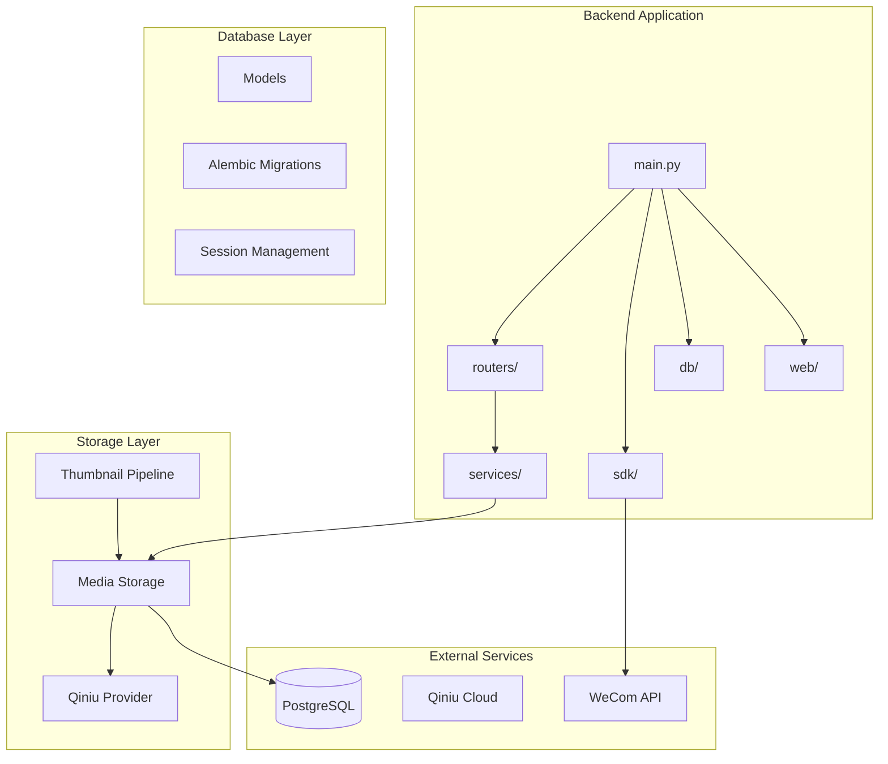
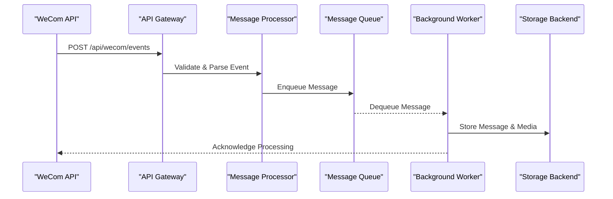
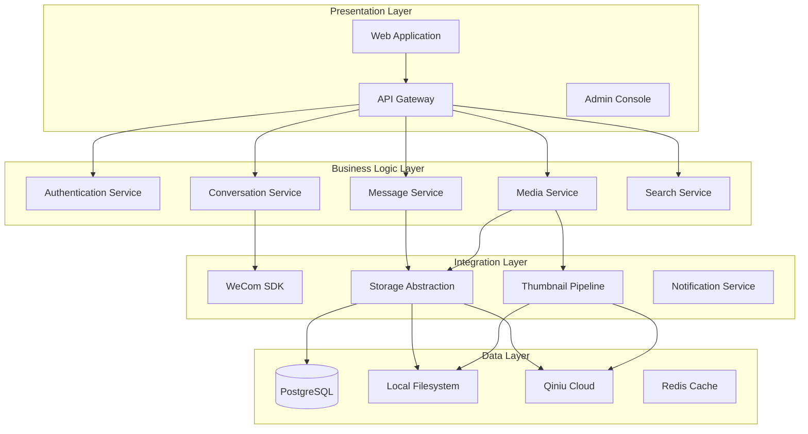
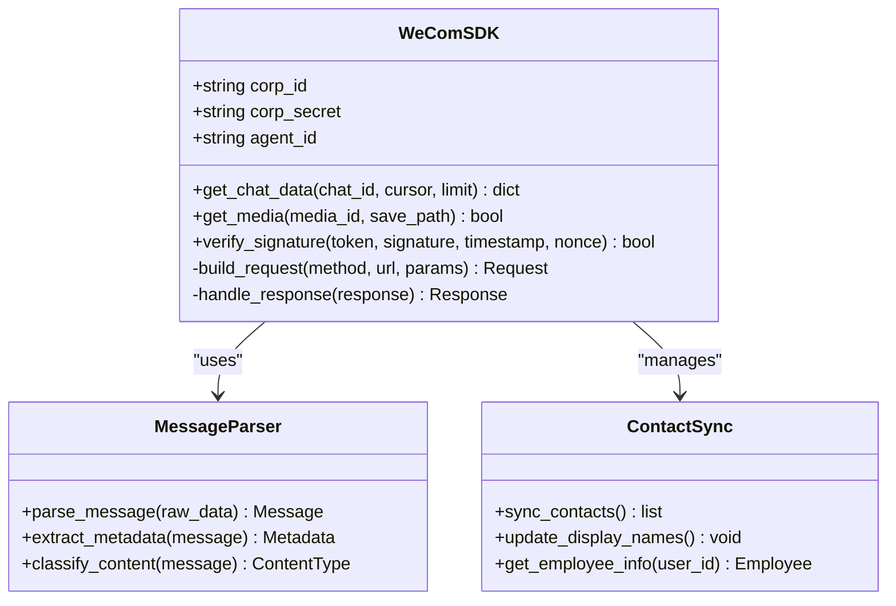
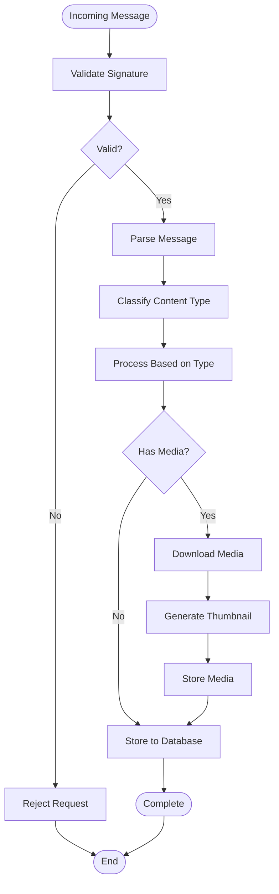
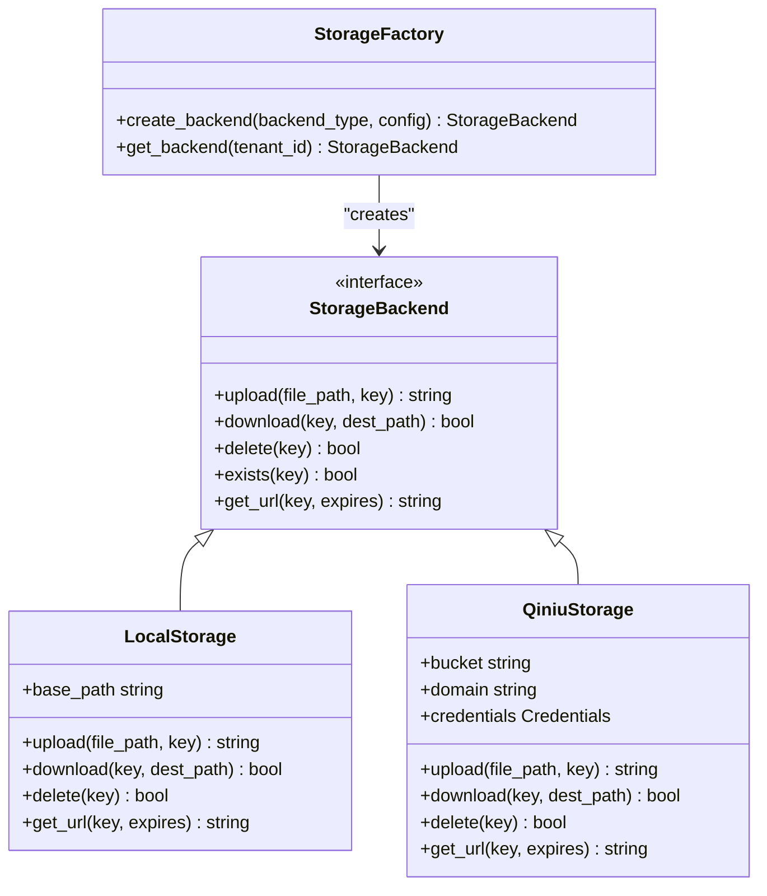
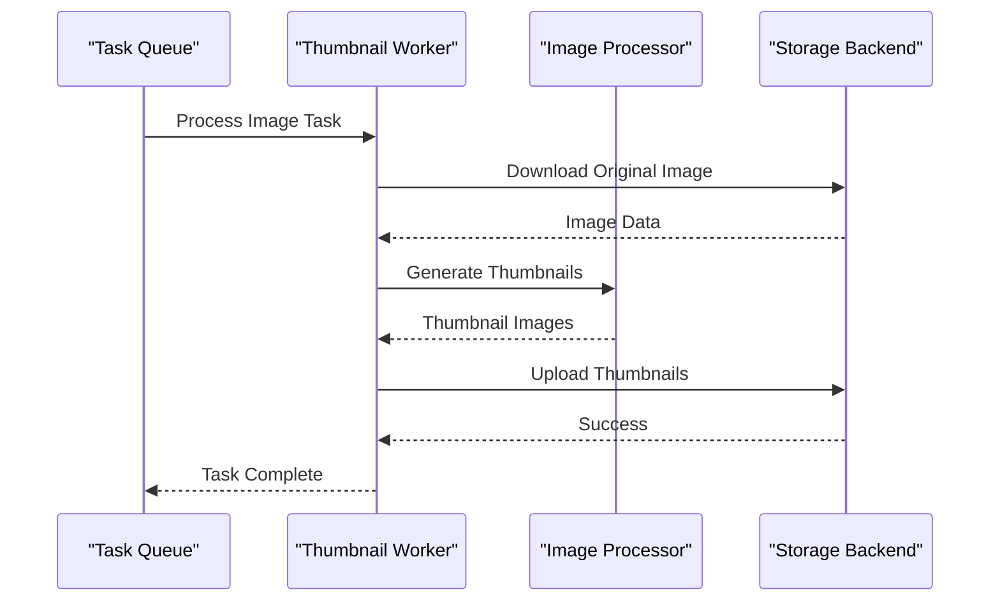
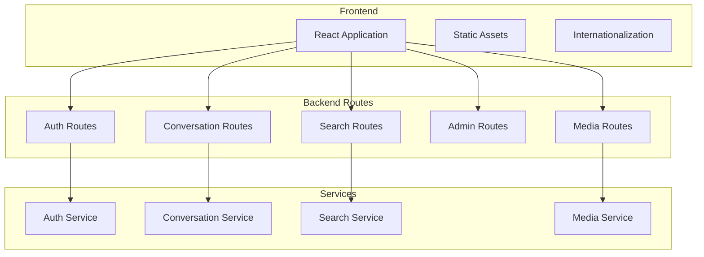
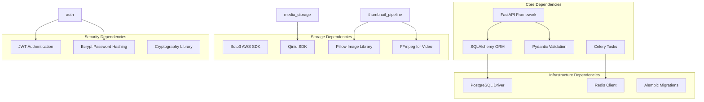

# Architecture

<cite>
**Referenced Files in This Document**
- [main.py](file://backend/app/main.py)
- [models.py](file://backend/app/db/models.py)
- [wecom_sdk.py](file://backend/app/sdk/wecom_sdk.py)
- [media_storage.py](file://backend/app/media_storage.py)
- [qiniu_storage.py](file://backend/app/qiniu_storage.py)
- [thumbnail_pipeline.py](file://backend/app/thumbnail_pipeline.py)
- [auth.py](file://backend/app/auth.py)
- [conversations.py](file://backend/app/routers/conversations.py)
- [wecom_events.py](file://backend/app/routers/wecom_events.py)
- [ARCHITECTURE.md](file://docs/ARCHITECTURE.md)
- [DATA_MODEL.md](file://docs/DATA_MODEL.md)
- [alembic.ini](file://backend/alembic.ini)
</cite>

## Table of Contents
1. [Introduction](#introduction)
2. [Project Structure](#project-structure)
3. [Core Components](#core-components)
4. [Architecture Overview](#architecture-overview)
5. [Detailed Component Analysis](#detailed-component-analysis)
6. [Dependency Analysis](#dependency-analysis)
7. [Performance Considerations](#performance-considerations)
8. [Troubleshooting Guide](#troubleshooting-guide)
9. [Conclusion](#conclusion)

## Introduction

WeCom Archive 365 is a comprehensive enterprise messaging archive system designed to integrate with WeCom (Enterprise WeChat) APIs for message archiving, storage, and retrieval. The system implements a microservices architecture with event-driven message processing and multi-tenant isolation to support multiple organizations securely. It provides a complete solution for compliance, audit, and review of corporate communications through WeCom's enterprise messaging platform.

The system handles the entire lifecycle of WeCom messages from ingestion through processing, storage, thumbnail generation, and web-based retrieval, while maintaining strict tenant isolation and supporting multiple storage backends including local filesystem and Qiniu Cloud storage.

## Project Structure

The WeCom Archive 365 system follows a modular Python application structure with clear separation of concerns:

**Diagram sources**
- [main.py:1-50](file://backend/app/main.py#L1-L50)
- [models.py:1-100](file://backend/app/db/models.py#L1-L100)

**Section sources**
- [main.py:1-100](file://backend/app/main.py#L1-L100)
- [ARCHITECTURE.md:1-200](file://docs/ARCHITECTURE.md#L1-L200)

## Core Components

### Microservices Architecture Pattern

The system implements a microservices architecture with clear service boundaries:

- **API Gateway**: FastAPI-based HTTP server handling all external requests
- **Message Ingestion Service**: Processes incoming WeCom events and messages
- **Storage Abstraction Service**: Manages data persistence across multiple backends
- **Thumbnail Generation Service**: Asynchronous media processing pipeline
- **Web Application Service**: Serves the user interface and management console

### Event-Driven Message Processing

The system uses an event-driven architecture for handling WeCom messages:

**Diagram sources**
- [wecom_events.py:1-150](file://backend/app/routers/wecom_events.py#L1-L150)
- [thumbnail_pipeline.py:1-200](file://backend/app/thumbnail_pipeline.py#L1-L200)

### Multi-Tenant Isolation

The system implements strict tenant isolation at multiple levels:

- **Database Level**: Tenant-scoped queries and data partitioning
- **Storage Level**: Tenant-specific media directories and access controls
- **API Level**: Tenant context validation and authorization
- **Cache Level**: Tenant-isolated caching strategies

**Section sources**
- [models.py:1-300](file://backend/app/db/models.py#L1-L300)
- [auth.py:1-200](file://backend/app/auth.py#L1-L200)

## Architecture Overview

The WeCom Archive 365 system follows a layered architecture pattern with clear separation between presentation, business logic, and data access layers:

**Diagram sources**
- [main.py:1-100](file://backend/app/main.py#L1-L100)
- [media_storage.py:1-200](file://backend/app/media_storage.py#L1-L200)

## Detailed Component Analysis

### WeCom SDK Integration Layer

The WeCom SDK integration layer provides a clean abstraction over WeCom's REST APIs:

**Diagram sources**
- [wecom_sdk.py:1-200](file://backend/app/sdk/wecom_sdk.py#L1-L200)

### Message Ingestion Pipeline

The message ingestion pipeline handles the complete flow of WeCom messages:

**Diagram sources**
- [wecom_events.py:1-200](file://backend/app/routers/wecom_events.py#L1-L200)

### Storage Abstraction Layer

The storage abstraction layer supports multiple backends with unified interface:

**Diagram sources**
- [media_storage.py:1-300](file://backend/app/media_storage.py#L1-L300)
- [qiniu_storage.py:1-200](file://backend/app/qiniu_storage.py#L1-L200)

### Thumbnail Generation Pipeline

The thumbnail generation pipeline processes media files asynchronously:

**Diagram sources**
- [thumbnail_pipeline.py:1-250](file://backend/app/thumbnail_pipeline.py#L1-L250)

### Web Application Serving

The web application provides both user-facing and administrative interfaces:

**Diagram sources**
- [conversations.py:1-200](file://backend/app/routers/conversations.py#L1-L200)

**Section sources**
- [wecom_sdk.py:1-300](file://backend/app/sdk/wecom_sdk.py#L1-L300)
- [media_storage.py:1-400](file://backend/app/media_storage.py#L1-L400)
- [thumbnail_pipeline.py:1-300](file://backend/app/thumbnail_pipeline.py#L1-L300)

## Dependency Analysis

The system has well-defined dependencies between components:

**Diagram sources**
- [requirements.txt:1-100](file://backend/requirements.txt#L1-L100)

**Section sources**
- [requirements.txt:1-150](file://backend/requirements.txt#L1-L150)

## Performance Considerations

### Database Optimization
- Connection pooling with SQLAlchemy
- Query optimization with proper indexing
- Tenant-scoped queries for performance
- Caching strategies for frequently accessed data

### Storage Performance
- CDN integration for media delivery
- Async processing for heavy operations
- Chunked uploads for large files
- Compression for storage efficiency

### Scalability Patterns
- Horizontal scaling of stateless services
- Database read replicas for query distribution
- Message queue for load balancing
- Cache layer for reduced database load

## Troubleshooting Guide

### Common Issues
- **WeCom API Rate Limiting**: Implement exponential backoff
- **Storage Backend Failures**: Fallback mechanisms and retry logic
- **Memory Issues**: Stream processing for large files
- **Database Connection Pool Exhaustion**: Proper connection management

### Monitoring and Logging
- Structured logging with correlation IDs
- Health check endpoints for service monitoring
- Metrics collection for performance tracking
- Alerting for critical failures

**Section sources**
- [auth.py:1-200](file://backend/app/auth.py#L1-L200)
- [media_storage.py:1-400](file://backend/app/media_storage.py#L1-L400)

## Conclusion

The WeCom Archive 365 system provides a robust, scalable, and secure solution for enterprise message archiving. Its microservices architecture, event-driven design, and multi-tenant isolation make it suitable for large-scale deployments. The flexible storage abstraction allows organizations to choose their preferred storage backend while maintaining consistent APIs and behavior.

The system's comprehensive approach to security, performance, and scalability ensures reliable operation in enterprise environments while providing the necessary tools for compliance and audit requirements.