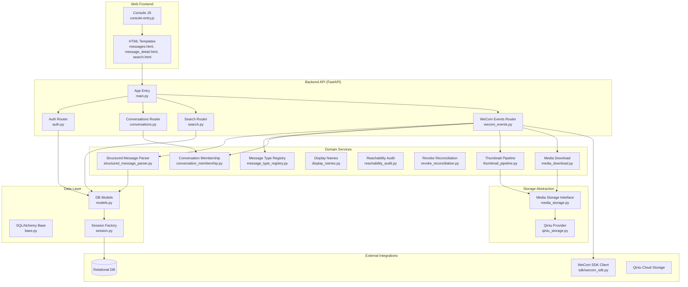
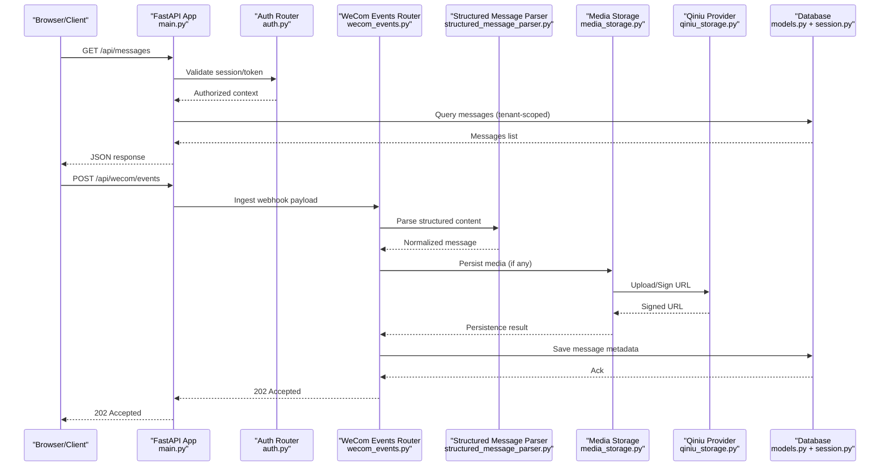
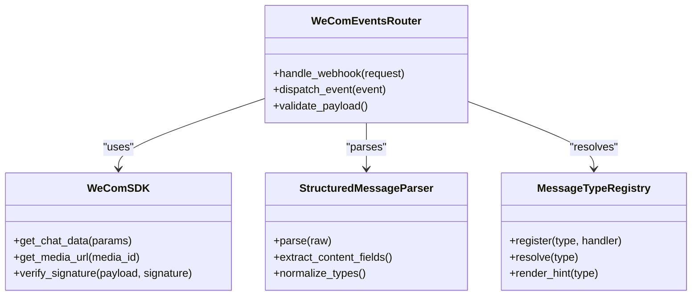
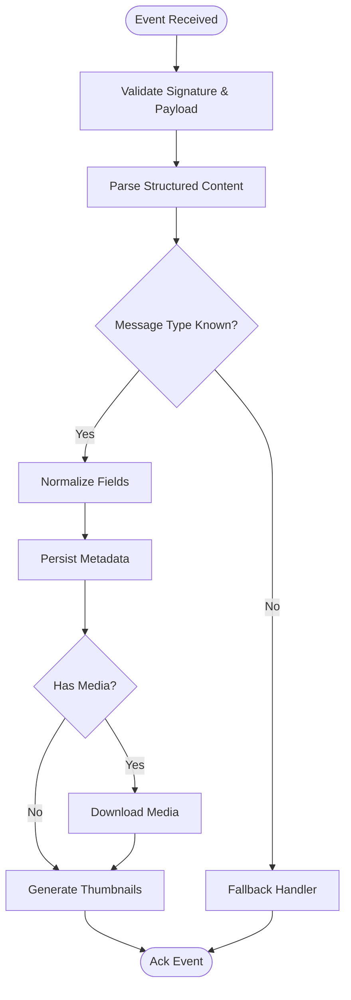
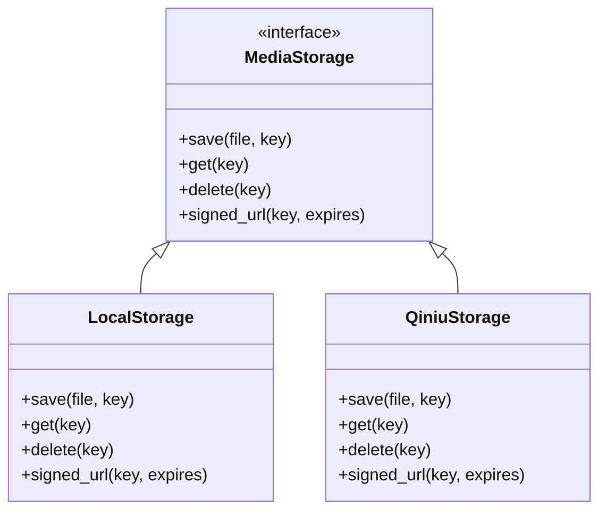
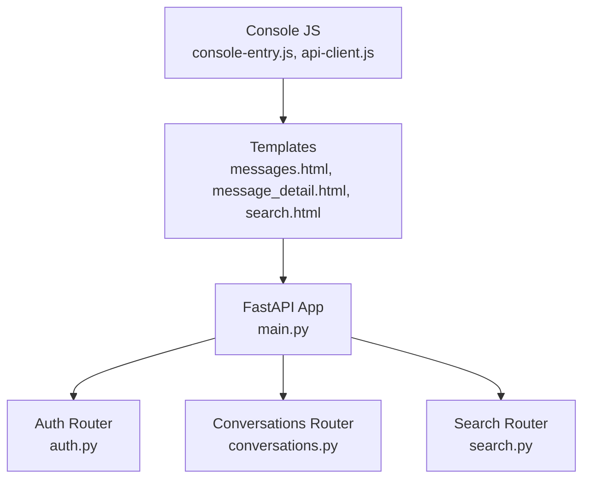
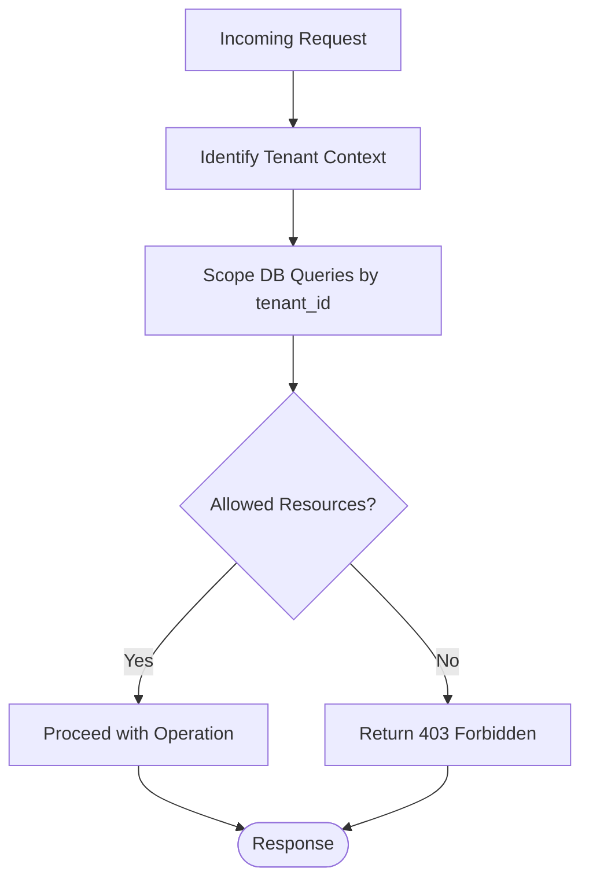
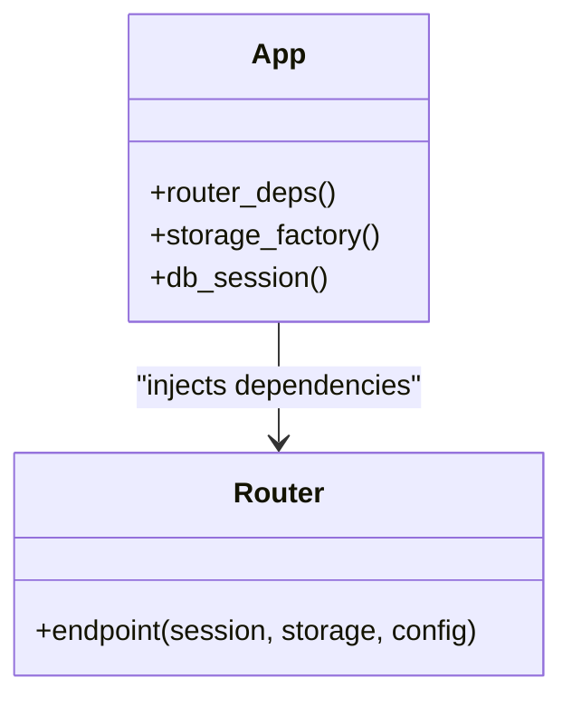
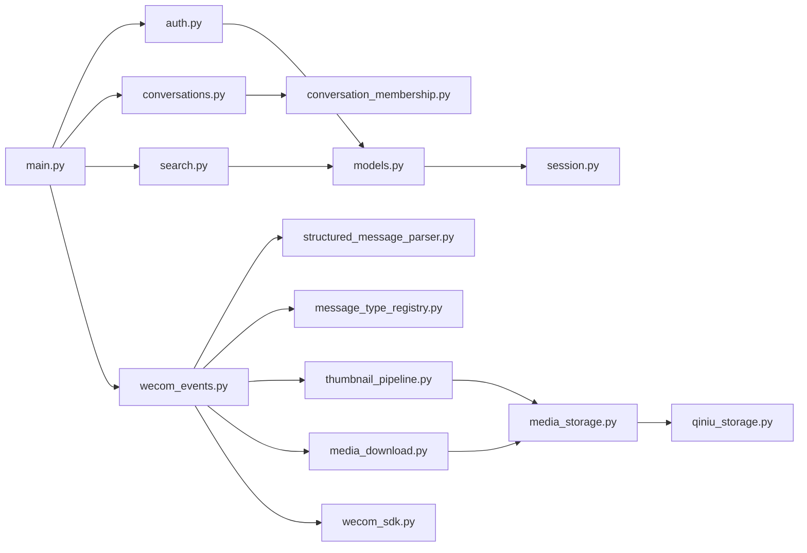

# Core Architecture Patterns

<cite>
**Referenced Files in This Document**
- [main.py](file://backend/app/main.py)
- [auth.py](file://backend/app/auth.py)
- [wecom_sdk.py](file://backend/app/sdk/wecom_sdk.py)
- [wecom_events.py](file://backend/app/routers/wecom_events.py)
- [conversations.py](file://backend/app/routers/conversations.py)
- [search.py](file://backend/app/routers/search.py)
- [models.py](file://backend/app/db/models.py)
- [base.py](file://backend/app/db/base.py)
- [session.py](file://backend/app/db/session.py)
- [media_storage.py](file://backend/app/media_storage.py)
- [qiniu_storage.py](file://backend/app/qiniu_storage.py)
- [thumbnail_pipeline.py](file://backend/app/thumbnail_pipeline.py)
- [structured_message_parser.py](file://backend/app/structured_message_parser.py)
- [message_type_registry.py](file://backend/app/message_type_registry.py)
- [media_download.py](file://backend/app/media_download.py)
- [conversation_membership.py](file://backend/app/conversation_membership.py)
- [display_names.py](file://backend/app/display_names.py)
- [reachability_audit.py](file://backend/app/reachability_audit.py)
- [revoke_reconciliation.py](file://backend/app/revoke_reconciliation.py)
- [i18n_assets.py](file://backend/app/i18n_assets.py)
- [__init__.py](file://backend/app/web/__init__.py)
- [console-entry.js](file://backend/app/web/static/console/console-entry.js)
- [api-client.js](file://backend/app/web/static/console/api-client.js)
- [messages.html](file://backend/app/web/templates/messages.html)
- [message_detail.html](file://backend/app/web/templates/message_detail.html)
- [search.html](file://backend/app/web/templates/search.html)
- [ARCHITECTURE.md](file://docs/ARCHITECTURE.md)
- [API.md](file://docs/API.md)
- [DEPLOYMENT.md](file://docs/DEPLOYMENT.md)
- [wecom_archive_worker_runbook.md](file://docs/wecom_archive_worker_runbook.md)
- [wecom_archive_media_download_runbook.md](file://docs/wecom_archive_media_download_runbook.md)
- [0002_tenant_foundation.py](file://backend/alembic/versions/0002_tenant_foundation.py)
- [0003_media_tenant_scoping.py](file://backend/alembic/versions/0003_media_tenant_scoping.py)
- [0004_tenant_wecom_config_corp_id_uniqueness.py](file://backend/alembic/versions/0004_tenant_wecom_config_corp_id_uniqueness.py)
- [bootstrap_default_tenant.py](file://backend/scripts/bootstrap_default_tenant.py)
- [run_archive_worker_once.py](file://backend/scripts/run_archive_worker_once.py)
- [download_wecom_media_once.py](file://backend/scripts/download_wecom_media_once.py)
- [sync_wecom_archive_once.py](file://backend/scripts/sync_wecom_archive_once.py)
- [decrypt_wecom_messages_once.py](file://backend/scripts/decrypt_wecom_messages_once.py)
- [backfill_thumbnails_once.py](file://backend/scripts/backfill_thumbnails_once.py)
- [check_message_revocations_integrity.py](file://backend/scripts/check_message_revocations_integrity.py)
- [migrate_local_media_to_qiniu.py](file://backend/scripts/migrate_local_media_to_qiniu.py)
- [sync_contact_display_names_once.py](file://backend/scripts/sync_contact_display_names_once.py)
- [test_tenant_isolation.py](file://backend/tests/test_tenant_isolation.py)
- [test_tenant_media_access.py](file://backend/tests/test_tenant_media_access.py)
- [test_wecom_sdk_media.py](file://backend/tests/test_wecom_sdk_media.py)
- [test_thumbnail_pipeline.py](file://backend/tests/test_thumbnail_pipeline.py)
- [test_structured_message_parser.py](file://backend/tests/test_structured_message_parser.py)
- [test_search_api.py](file://backend/tests/test_search_api.py)
- [test_auth.py](file://backend/tests/test_auth.py)
</cite>

## Table of Contents
1. [Introduction](#introduction)
2. [Project Structure](#project-structure)
3. [Core Components](#core-components)
4. [Architecture Overview](#architecture-overview)
5. [Detailed Component Analysis](#detailed-component-analysis)
6. [Dependency Analysis](#dependency-analysis)
7. [Performance Considerations](#performance-considerations)
8. [Troubleshooting Guide](#troubleshooting-guide)
9. [Conclusion](#conclusion)
10. [Appendices](#appendices)

## Introduction
This document explains the core architectural patterns of WeCom Archive 365, focusing on microservices boundaries, multi-tenant isolation, and event-driven message processing. It maps how the WeCom SDK integration, message ingestion pipeline, storage abstraction layer, and web application interact, while detailing dependency injection, configuration management, error handling, scalability, fault tolerance, and monitoring points.

## Project Structure
The backend is a FastAPI-based application with:
- API routers for authentication, conversations, search, and WeCom events
- A database layer using SQLAlchemy models and Alembic migrations
- Storage abstractions supporting local and Qiniu backends
- Web templates and static assets for the console UI
- Worker scripts for background tasks (archive sync, media download, thumbnails)
- Tests validating tenant isolation, storage behavior, parsing, and APIs

**Diagram sources**
- [main.py](file://backend/app/main.py)
- [auth.py](file://backend/app/auth.py)
- [conversations.py](file://backend/app/routers/conversations.py)
- [search.py](file://backend/app/routers/search.py)
- [wecom_events.py](file://backend/app/routers/wecom_events.py)
- [structured_message_parser.py](file://backend/app/structured_message_parser.py)
- [message_type_registry.py](file://backend/app/message_type_registry.py)
- [conversation_membership.py](file://backend/app/conversation_membership.py)
- [display_names.py](file://backend/app/display_names.py)
- [reachability_audit.py](file://backend/app/reachability_audit.py)
- [revoke_reconciliation.py](file://backend/app/revoke_reconciliation.py)
- [thumbnail_pipeline.py](file://backend/app/thumbnail_pipeline.py)
- [media_download.py](file://backend/app/media_download.py)
- [media_storage.py](file://backend/app/media_storage.py)
- [qiniu_storage.py](file://backend/app/qiniu_storage.py)
- [models.py](file://backend/app/db/models.py)
- [base.py](file://backend/app/db/base.py)
- [session.py](file://backend/app/db/session.py)
- [wecom_sdk.py](file://backend/app/sdk/wecom_sdk.py)

**Section sources**
- [main.py](file://backend/app/main.py)
- [ARCHITECTURE.md](file://docs/ARCHITECTURE.md)
- [API.md](file://docs/API.md)
- [DEPLOYMENT.md](file://docs/DEPLOYMENT.md)

## Core Components
- Application entrypoint and router registration
- Authentication and authorization middleware
- WeCom event ingestion and processing
- Structured message parsing and type registry
- Conversation membership and display name resolution
- Thumbnail generation pipeline
- Media download and storage abstraction (local/Qiniu)
- Search and reachability audit endpoints
- Background workers and one-off scripts

Key responsibilities:
- API Gateway-like routing and request validation
- Tenant-scoped data access via session and models
- Event-driven processing of WeCom archive messages
- Pluggable storage providers through an interface
- Consistent error handling and logging across services

**Section sources**
- [main.py](file://backend/app/main.py)
- [auth.py](file://backend/app/auth.py)
- [wecom_events.py](file://backend/app/routers/wecom_events.py)
- [structured_message_parser.py](file://backend/app/structured_message_parser.py)
- [message_type_registry.py](file://backend/app/message_type_registry.py)
- [conversation_membership.py](file://backend/app/conversation_membership.py)
- [display_names.py](file://backend/app/display_names.py)
- [thumbnail_pipeline.py](file://backend/app/thumbnail_pipeline.py)
- [media_download.py](file://backend/app/media_download.py)
- [media_storage.py](file://backend/app/media_storage.py)
- [qiniu_storage.py](file://backend/app/qiniu_storage.py)
- [search.py](file://backend/app/routers/search.py)
- [reachability_audit.py](file://backend/app/reachability_audit.py)

## Architecture Overview
The system follows a layered microservice-style architecture within a single FastAPI process, with clear service boundaries:
- Presentation: Web templates and JavaScript console
- API Layer: FastAPI routers exposing REST endpoints
- Domain Services: Parsing, membership, thumbnails, downloads, audits
- Storage Abstraction: Pluggable backends (local filesystem, Qiniu)
- Data Access: SQLAlchemy models and sessions
- External Integrations: WeCom SDK client for archive retrieval

**Diagram sources**
- [main.py](file://backend/app/main.py)
- [auth.py](file://backend/app/auth.py)
- [wecom_events.py](file://backend/app/routers/wecom_events.py)
- [structured_message_parser.py](file://backend/app/structured_message_parser.py)
- [media_storage.py](file://backend/app/media_storage.py)
- [qiniu_storage.py](file://backend/app/qiniu_storage.py)
- [models.py](file://backend/app/db/models.py)
- [session.py](file://backend/app/db/session.py)

**Section sources**
- [ARCHITECTURE.md](file://docs/ARCHITECTURE.md)
- [API.md](file://docs/API.md)

## Detailed Component Analysis

### WeCom SDK Integration and Event Ingestion
- The WeCom SDK client encapsulates authentication and API calls to retrieve archive data.
- The WeCom events router receives webhook payloads, validates signatures, and dispatches processing.
- Structured message parser normalizes incoming payloads into internal models.
- Message type registry handles variant types and rendering hints.

**Diagram sources**
- [wecom_sdk.py](file://backend/app/sdk/wecom_sdk.py)
- [wecom_events.py](file://backend/app/routers/wecom_events.py)
- [structured_message_parser.py](file://backend/app/structured_message_parser.py)
- [message_type_registry.py](file://backend/app/message_type_registry.py)

**Section sources**
- [wecom_sdk.py](file://backend/app/sdk/wecom_sdk.py)
- [wecom_events.py](file://backend/app/routers/wecom_events.py)
- [structured_message_parser.py](file://backend/app/structured_message_parser.py)
- [message_type_registry.py](file://backend/app/message_type_registry.py)
- [test_wecom_sdk_media.py](file://backend/tests/test_wecom_sdk_media.py)
- [test_structured_message_parser.py](file://backend/tests/test_structured_message_parser.py)

### Message Ingestion Pipeline
- Receives events from WeCom webhooks or scheduled syncs.
- Validates and parses payloads, resolves message types, and persists metadata.
- Triggers thumbnail generation and media download when needed.
- Ensures idempotency and ordering where applicable.

**Diagram sources**
- [wecom_events.py](file://backend/app/routers/wecom_events.py)
- [structured_message_parser.py](file://backend/app/structured_message_parser.py)
- [message_type_registry.py](file://backend/app/message_type_registry.py)
- [media_download.py](file://backend/app/media_download.py)
- [thumbnail_pipeline.py](file://backend/app/thumbnail_pipeline.py)

**Section sources**
- [wecom_events.py](file://backend/app/routers/wecom_events.py)
- [media_download.py](file://backend/app/media_download.py)
- [thumbnail_pipeline.py](file://backend/app/thumbnail_pipeline.py)
- [run_archive_worker_once.py](file://backend/scripts/run_archive_worker_once.py)
- [sync_wecom_archive_once.py](file://backend/scripts/sync_wecom_archive_once.py)

### Storage Abstraction Layer
- Defines a common interface for media storage operations.
- Implements local filesystem and Qiniu cloud storage providers.
- Provides signed URLs and access control consistent with tenant scoping.

**Diagram sources**
- [media_storage.py](file://backend/app/media_storage.py)
- [qiniu_storage.py](file://backend/app/qiniu_storage.py)

**Section sources**
- [media_storage.py](file://backend/app/media_storage.py)
- [qiniu_storage.py](file://backend/app/qiniu_storage.py)
- [test_qiniu_storage.py](file://backend/tests/test_qiniu_storage.py)
- [test_qiniu_provider_factory.py](file://backend/tests/test_qiniu_provider_factory.py)
- [test_generic_media_serving.py](file://backend/tests/test_generic_media_serving.py)

### Web Application and API Gateway Responsibilities
- FastAPI app registers routers and middleware for auth, CORS, and error handling.
- Templates render HTML pages; static assets include console JS modules.
- API endpoints expose search, conversation listing, and diagnostics.

**Diagram sources**
- [main.py](file://backend/app/main.py)
- [__init__.py](file://backend/app/web/__init__.py)
- [console-entry.js](file://backend/app/web/static/console/console-entry.js)
- [api-client.js](file://backend/app/web/static/console/api-client.js)
- [messages.html](file://backend/app/web/templates/messages.html)
- [message_detail.html](file://backend/app/web/templates/message_detail.html)
- [search.html](file://backend/app/web/templates/search.html)
- [auth.py](file://backend/app/auth.py)
- [conversations.py](file://backend/app/routers/conversations.py)
- [search.py](file://backend/app/routers/search.py)

**Section sources**
- [main.py](file://backend/app/main.py)
- [__init__.py](file://backend/app/web/__init__.py)
- [console-entry.js](file://backend/app/web/static/console/console-entry.js)
- [api-client.js](file://backend/app/web/static/console/api-client.js)
- [messages.html](file://backend/app/web/templates/messages.html)
- [message_detail.html](file://backend/app/web/templates/message_detail.html)
- [search.html](file://backend/app/web/templates/search.html)
- [test_search_api.py](file://backend/tests/test_search_api.py)

### Multi-Tenant Isolation Strategy
- Tenant foundation model and migrations enforce tenant scoping at the schema level.
- Database sessions and queries are scoped by tenant identifiers.
- Media access is restricted per tenant, ensuring isolation across tenants.

**Diagram sources**
- [models.py](file://backend/app/db/models.py)
- [session.py](file://backend/app/db/session.py)
- [0002_tenant_foundation.py](file://backend/alembic/versions/0002_tenant_foundation.py)
- [0003_media_tenant_scoping.py](file://backend/alembic/versions/0003_media_tenant_scoping.py)
- [0004_tenant_wecom_config_corp_id_uniqueness.py](file://backend/alembic/versions/0004_tenant_wecom_config_corp_id_uniqueness.py)

**Section sources**
- [0002_tenant_foundation.py](file://backend/alembic/versions/0002_tenant_foundation.py)
- [0003_media_tenant_scoping.py](file://backend/alembic/versions/0003_media_tenant_scoping.py)
- [0004_tenant_wecom_config_corp_id_uniqueness.py](file://backend/alembic/versions/0004_tenant_wecom_config_corp_id_uniqueness.py)
- [test_tenant_isolation.py](file://backend/tests/test_tenant_isolation.py)
- [test_tenant_media_access.py](file://backend/tests/test_tenant_media_access.py)
- [bootstrap_default_tenant.py](file://backend/scripts/bootstrap_default_tenant.py)

### Dependency Injection Patterns
- FastAPI’s dependency injection is used to provide:
  - Database sessions
  - Storage provider instances
  - Configuration values
  - Authenticated user context
- Routers depend on these injected components rather than constructing them directly.

**Diagram sources**
- [main.py](file://backend/app/main.py)
- [session.py](file://backend/app/db/session.py)
- [media_storage.py](file://backend/app/media_storage.py)

**Section sources**
- [main.py](file://backend/app/main.py)
- [session.py](file://backend/app/db/session.py)
- [media_storage.py](file://backend/app/media_storage.py)

### Configuration Management
- Environment variables drive runtime configuration (e.g., storage backend, credentials).
- Bootstrap scripts initialize default tenant and seed configurations.
- Deployment docs describe environment setup and secrets management.

**Section sources**
- [DEPLOYMENT.md](file://docs/DEPLOYMENT.md)
- [bootstrap_default_tenant.py](file://backend/scripts/bootstrap_default_tenant.py)

### Error Handling Strategies
- Centralized exception handlers return consistent error responses.
- Validation errors are normalized for clients.
- Logging captures contextual information for debugging.

**Section sources**
- [main.py](file://backend/app/main.py)
- [auth.py](file://backend/app/auth.py)
- [test_auth.py](file://backend/tests/test_auth.py)

## Dependency Analysis

**Diagram sources**
- [main.py](file://backend/app/main.py)
- [auth.py](file://backend/app/auth.py)
- [conversations.py](file://backend/app/routers/conversations.py)
- [search.py](file://backend/app/routers/search.py)
- [wecom_events.py](file://backend/app/routers/wecom_events.py)
- [structured_message_parser.py](file://backend/app/structured_message_parser.py)
- [message_type_registry.py](file://backend/app/message_type_registry.py)
- [thumbnail_pipeline.py](file://backend/app/thumbnail_pipeline.py)
- [media_download.py](file://backend/app/media_download.py)
- [conversation_membership.py](file://backend/app/conversation_membership.py)
- [models.py](file://backend/app/db/models.py)
- [session.py](file://backend/app/db/session.py)
- [media_storage.py](file://backend/app/media_storage.py)
- [qiniu_storage.py](file://backend/app/qiniu_storage.py)
- [wecom_sdk.py](file://backend/app/sdk/wecom_sdk.py)

**Section sources**
- [main.py](file://backend/app/main.py)
- [wecom_events.py](file://backend/app/routers/wecom_events.py)
- [media_storage.py](file://backend/app/media_storage.py)
- [models.py](file://backend/app/db/models.py)

## Performance Considerations
- Use connection pooling for database sessions to reduce latency.
- Cache frequently accessed metadata (e.g., display names) where appropriate.
- Stream media downloads and generate thumbnails asynchronously to avoid blocking requests.
- Implement pagination and filtering for search endpoints to handle large datasets.
- Prefer signed URLs for direct client-to-storage access to offload bandwidth.

[No sources needed since this section provides general guidance]

## Troubleshooting Guide
- Verify WeCom webhook signature validation and payload structure.
- Check storage provider credentials and network connectivity.
- Inspect tenant scoping issues if resources appear missing.
- Review worker logs for failed syncs or media downloads.
- Use diagnostics endpoints to validate reachability and health.

**Section sources**
- [wecom_archive_worker_runbook.md](file://docs/wecom_archive_worker_runbook.md)
- [wecom_archive_media_download_runbook.md](file://docs/wecom_archive_media_download_runbook.md)
- [reachability_audit.py](file://backend/app/reachability_audit.py)
- [test_reachability_diagnostics_page.py](file://backend/tests/test_reachability_diagnostics_page.py)

## Conclusion
WeCom Archive 365 employs a clear microservice-style architecture within a FastAPI application, emphasizing tenant isolation, pluggable storage, and event-driven processing. The design supports scalability through asynchronous pipelines, signed URLs, and robust error handling. Monitoring and runbooks facilitate operational reliability.

[No sources needed since this section summarizes without analyzing specific files]

## Appendices

### Background Workers and Scripts
- Archive worker scripts synchronize WeCom archives and reconcile revocations.
- Media download scripts fetch and store media assets.
- Thumbnail backfill ensures consistent previews.
- Integrity checks validate message revocation associations.

**Section sources**
- [run_archive_worker_once.py](file://backend/scripts/run_archive_worker_once.py)
- [download_wecom_media_once.py](file://backend/scripts/download_wecom_media_once.py)
- [sync_wecom_archive_once.py](file://backend/scripts/sync_wecom_archive_once.py)
- [decrypt_wecom_messages_once.py](file://backend/scripts/decrypt_wecom_messages_once.py)
- [backfill_thumbnails_once.py](file://backend/scripts/backfill_thumbnails_once.py)
- [check_message_revocations_integrity.py](file://backend/scripts/check_message_revocations_integrity.py)
- [migrate_local_media_to_qiniu.py](file://backend/scripts/migrate_local_media_to_qiniu.py)
- [sync_contact_display_names_once.py](file://backend/scripts/sync_contact_display_names_once.py)

### Testing Coverage Highlights
- Tenant isolation and media access tests ensure strict scoping.
- Storage provider tests validate upload, retrieval, and signed URLs.
- Parser and thumbnail pipeline tests cover edge cases and performance.
- Search API tests confirm query correctness and pagination.

**Section sources**
- [test_tenant_isolation.py](file://backend/tests/test_tenant_isolation.py)
- [test_tenant_media_access.py](file://backend/tests/test_tenant_media_access.py)
- [test_wecom_sdk_media.py](file://backend/tests/test_wecom_sdk_media.py)
- [test_thumbnail_pipeline.py](file://backend/tests/test_thumbnail_pipeline.py)
- [test_structured_message_parser.py](file://backend/tests/test_structured_message_parser.py)
- [test_search_api.py](file://backend/tests/test_search_api.py)
- [test_auth.py](file://backend/tests/test_auth.py)