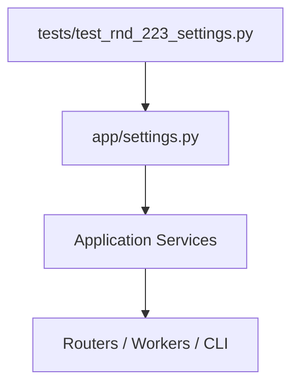
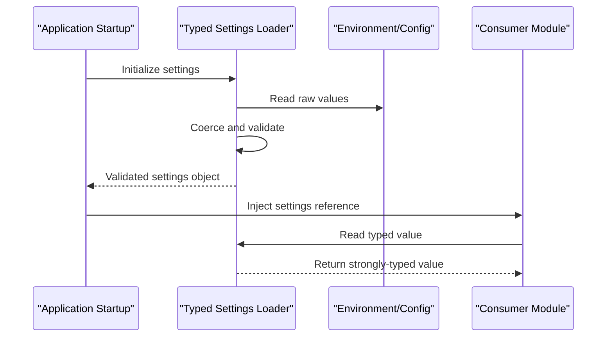
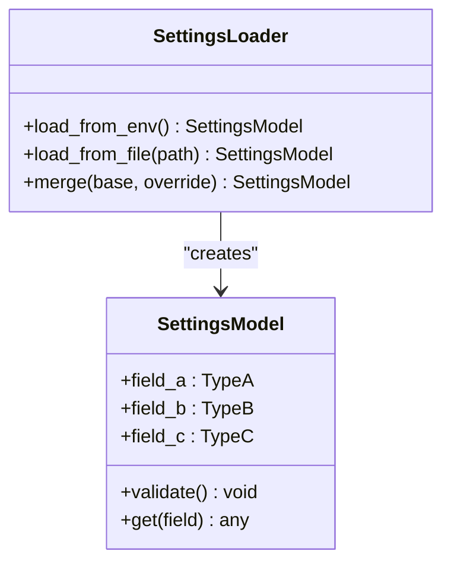
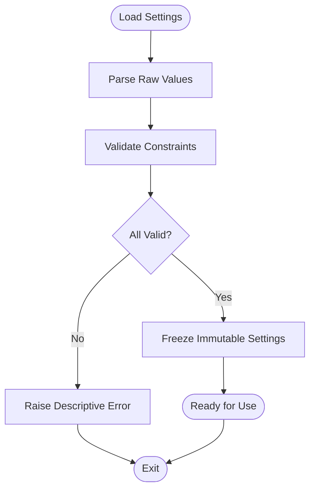
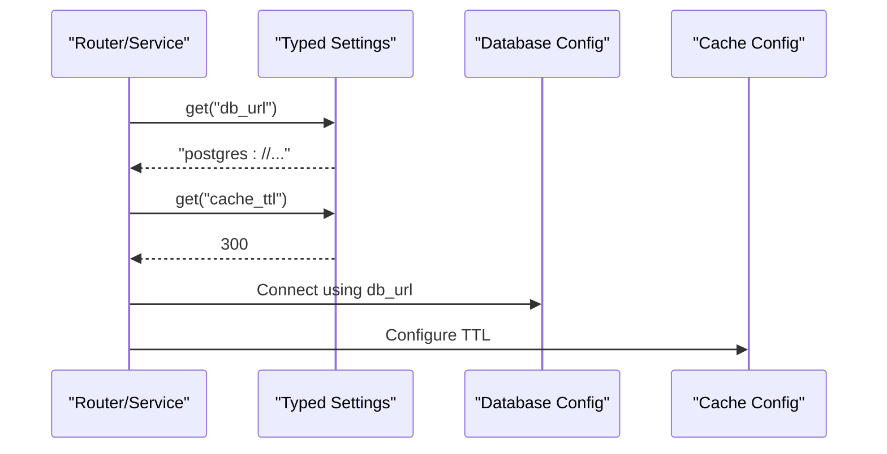
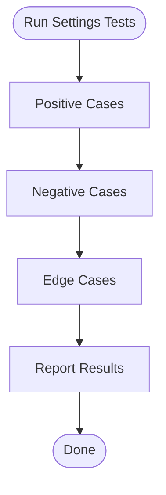
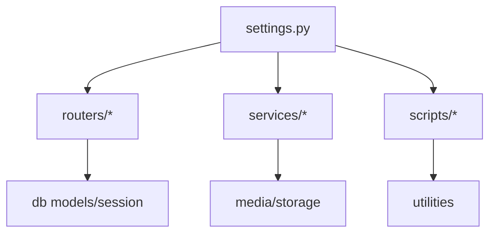

# Typed Settings System

<cite>
**Referenced Files in This Document**
- [settings.py](file://backend/app/settings.py)
- [test_rnd_223_settings.py](file://backend/tests/test_rnd_223_settings.py)
</cite>

## Table of Contents
1. [Introduction](#introduction)
2. [Project Structure](#project-structure)
3. [Core Components](#core-components)
4. [Architecture Overview](#architecture-overview)
5. [Detailed Component Analysis](#detailed-component-analysis)
6. [Dependency Analysis](#dependency-analysis)
7. [Performance Considerations](#performance-considerations)
8. [Troubleshooting Guide](#troubleshooting-guide)
9. [Conclusion](#conclusion)

## Introduction
This document describes the typed settings system used by the application. It explains how configuration values are defined, validated, and consumed across services with strong typing guarantees. The goal is to provide a clear mental model for developers who need to add or modify settings while ensuring correctness and consistency.

## Project Structure
The typed settings implementation lives under the backend application module. The primary source file defines the settings schema and loaders, while tests validate behavior and edge cases.

**Diagram sources**
- [settings.py](file://backend/app/settings.py)
- [test_rnd_223_settings.py](file://backend/tests/test_rnd_223_settings.py)

**Section sources**
- [settings.py](file://backend/app/settings.py)
- [test_rnd_223_settings.py](file://backend/tests/test_rnd_223_settings.py)

## Core Components
- Typed settings model: Defines all configuration keys with explicit types and default values.
- Validation layer: Enforces constraints at load time (e.g., required fields, ranges).
- Environment integration: Loads values from environment variables and/or config files.
- Accessors: Provides type-safe getters for use throughout the application.

Key responsibilities:
- Centralize configuration definitions to avoid drift.
- Fail fast on invalid configurations during startup.
- Provide consistent access patterns across modules.

**Section sources**
- [settings.py](file://backend/app/settings.py)

## Architecture Overview
The settings system follows a layered approach:
- Definition layer: Declares settings with types and defaults.
- Loading layer: Reads from environment/config sources and coerces types.
- Validation layer: Checks constraints and raises descriptive errors.
- Consumption layer: Modules import and read settings via typed accessors.

**Diagram sources**
- [settings.py](file://backend/app/settings.py)

## Detailed Component Analysis

### Settings Model and Loaders
- Strongly typed fields ensure that each setting has a known type and optional default.
- Loaders parse environment variables into typed values and apply validation rules.
- Errors are raised early with clear messages indicating which field failed validation.

**Diagram sources**
- [settings.py](file://backend/app/settings.py)

**Section sources**
- [settings.py](file://backend/app/settings.py)

### Validation Rules and Error Handling
- Required fields: Missing mandatory settings cause startup failure.
- Range checks: Numeric bounds enforced to prevent out-of-range values.
- Format checks: Patterns validated for strings like URLs or identifiers.
- Error messages: Include field name, expected type, and received value for quick triage.

**Diagram sources**
- [settings.py](file://backend/app/settings.py)

**Section sources**
- [settings.py](file://backend/app/settings.py)

### Consumer Integration
- Modules import the settings instance and read values through typed accessors.
- No direct environment parsing in consumers; all logic centralized in settings.
- Consistent usage reduces duplication and risk of misconfiguration.

**Diagram sources**
- [settings.py](file://backend/app/settings.py)

**Section sources**
- [settings.py](file://backend/app/settings.py)

### Test Coverage and Behavior Verification
- Tests assert correct parsing, coercion, and validation outcomes.
- Negative cases verify error messages and failure modes.
- Edge cases cover boundary values and malformed inputs.

**Diagram sources**
- [test_rnd_223_settings.py](file://backend/tests/test_rnd_223_settings.py)

**Section sources**
- [test_rnd_223_settings.py](file://backend/tests/test_rnd_223_settings.py)

## Dependency Analysis
- Settings module is a foundational dependency for routers, workers, and CLI scripts.
- Consumers should not bypass the settings loader to maintain type safety and validation.
- External integrations (database, cache, storage) depend on settings for connection parameters.

**Diagram sources**
- [settings.py](file://backend/app/settings.py)

**Section sources**
- [settings.py](file://backend/app/settings.py)

## Performance Considerations
- Settings loading occurs once at startup; subsequent reads are O(1) lookups.
- Avoid heavy computations in validators; keep validation lightweight.
- Prefer immutable settings objects to prevent runtime mutation overhead.

[No sources needed since this section provides general guidance]

## Troubleshooting Guide
Common issues and resolutions:
- Missing required setting: Ensure environment variable or config file includes the key.
- Invalid type: Check value format matches expected type (e.g., integer vs string).
- Out-of-range value: Adjust within allowed bounds specified by validation rules.
- Startup failure due to settings: Inspect error message for field name and expected constraints.

**Section sources**
- [settings.py](file://backend/app/settings.py)
- [test_rnd_223_settings.py](file://backend/tests/test_rnd_223_settings.py)

## Conclusion
The typed settings system centralizes configuration management with strong typing and validation. By enforcing constraints at load time and providing consistent accessors, it reduces configuration-related bugs and improves reliability across the application.

[No sources needed since this section summarizes without analyzing specific files]