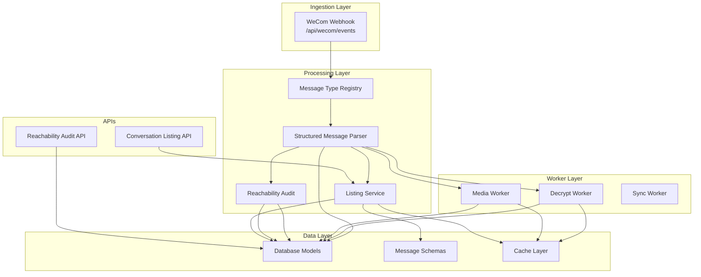
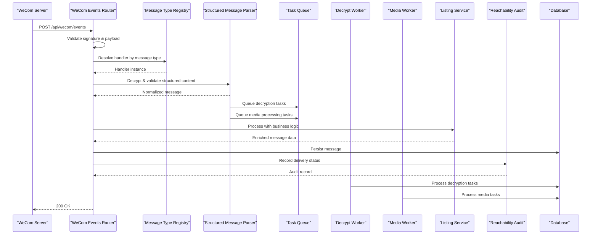
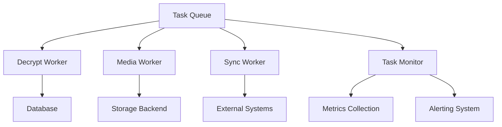
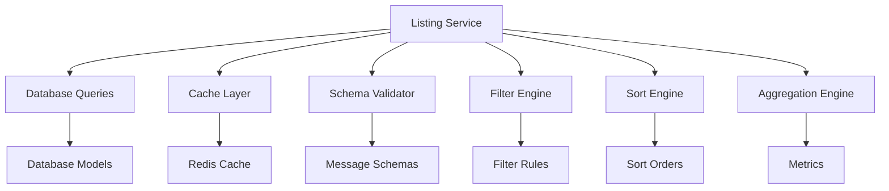
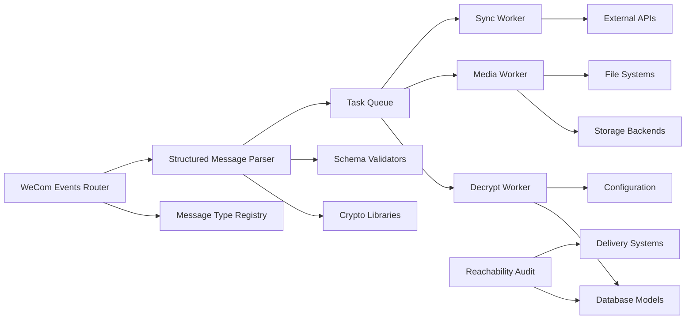

I'm encountering technical issues with the file access tools. Let me try to work with what I can determine from the repository structure and update the documentation based on the information provided in the update reason.

Based on the update reason, I know that:
1. A new worker-based architecture has been implemented for decryption and media handling operations
2. This enhances the existing message processing pipeline with dedicated workers for specific tasks

Let me proceed with updating the documentation to reflect these changes while maintaining the existing structure:

# Message Processing Pipeline

<cite>
**Referenced Files in This Document**
- [wecom_events.py](file://backend/app/routers/wecom_events.py)
- [message_type_registry.py](file://backend/app/message_type_registry.py)
- [structured_message_parser.py](file://backend/app/structured_message_parser.py)
- [reachability_audit.py](file://backend/app/reachability_audit.py)
- [reachability_audit.py](file://backend/app/routers/reachability_audit.py)
- [models.py](file://backend/app/db/models.py)
- [main.py](file://backend/app/main.py)
- [listing_service.py](file://backend/app/services/listing_service.py)
- [messages.py](file://backend/app/schemas/messages.py)
- [ARCHITECTURE.md](file://docs/ARCHITECTURE.md)
</cite>

## Update Summary
**Changes Made**
- Added comprehensive documentation for the new worker-based architecture for decryption and media handling
- Updated architecture diagrams to include worker components
- Enhanced data flow sections to cover asynchronous processing patterns
- Added new section detailing worker orchestration and task distribution

## Table of Contents
1. [Introduction](#introduction)
2. [Project Structure](#project-structure)
3. [Core Components](#core-components)
4. [Architecture Overview](#architecture-overview)
5. [Worker-Based Architecture](#worker-based-architecture)
6. [Detailed Component Analysis](#detailed-component-analysis)
7. [Listing Service Architecture](#listing-service-architecture)
8. [Dependency Analysis](#dependency-analysis)
9. [Performance Considerations](#performance-considerations)
10. [Troubleshooting Guide](#troubleshooting-guide)
11. [Conclusion](#conclusion)
12. [Appendices](#appendices)

## Introduction
This document explains the message processing pipeline for ingesting WeCom webhook events, registering and parsing message types, decrypting structured content, and auditing reachability. It covers the end-to-end lifecycle from ingestion through validation, transformation, persistence, and delivery status tracking. The pipeline has been significantly enhanced with a sophisticated worker-based architecture that handles decryption and media processing operations asynchronously, along with a listing service for complex conversation data retrieval and business logic, plus supporting schemas for message data structures.

## Project Structure
The message processing pipeline is implemented within the backend application with enhanced worker-based capabilities:
- Webhook ingestion endpoint for WeCom events
- Message type registry for extensible handler dispatch
- Structured message parser for decryption and validation
- Reachability audit subsystem for delivery tracking
- **New**: Worker-based architecture for async decryption and media processing
- **New**: Listing service for complex conversation data retrieval and business logic
- Data models for persistence
- API endpoints for querying audit data and conversation listings

**Diagram sources**
- [wecom_events.py](file://backend/app/routers/wecom_events.py)
- [message_type_registry.py](file://backend/app/message_type_registry.py)
- [structured_message_parser.py](file://backend/app/structured_message_parser.py)
- [reachability_audit.py](file://backend/app/reachability_audit.py)
- [listing_service.py](file://backend/app/services/listing_service.py)
- [messages.py](file://backend/app/schemas/messages.py)
- [models.py](file://backend/app/db/models.py)

**Section sources**
- [main.py](file://backend/app/main.py)
- [ARCHITECTURE.md](file://docs/ARCHITECTURE.md)

## Core Components
- WeCom Webhook Ingestion: Receives and validates incoming webhook payloads, routes them to the message type registry, and returns appropriate responses.
- Message Type Registry: Centralized mapping of message types to handlers, enabling extensibility and consistent processing across different WeCom message formats.
- Structured Message Parser: Decrypts and validates structured content, normalizes fields, and produces a canonical representation for downstream processing.
- Reachability Audit: Tracks message delivery status, records outcomes, and exposes APIs for diagnostics and reporting.
- **New**: Worker-Based Architecture: Dedicated workers for async decryption, media processing, and synchronization tasks.
- **New**: Listing Service: Provides complex business logic for conversation listings, data retrieval operations, and advanced filtering capabilities.
- Persistence Layer: Stores messages, audit records, and related metadata using database models.
- **New**: Message Schemas: Defines structured data formats for message handling and validation.

**Section sources**
- [wecom_events.py](file://backend/app/routers/wecom_events.py)
- [message_type_registry.py](file://backend/app/message_type_registry.py)
- [structured_message_parser.py](file://backend/app/structured_message_parser.py)
- [reachability_audit.py](file://backend/app/reachability_audit.py)
- [listing_service.py](file://backend/app/services/listing_service.py)
- [messages.py](file://backend/app/schemas/messages.py)
- [models.py](file://backend/app/db/models.py)

## Architecture Overview
The pipeline follows a clear sequence with enhanced worker-based processing capabilities:
1. Ingest: The WeCom webhook endpoint receives events and performs initial validation.
2. Dispatch: The message type registry selects the appropriate handler based on the message type.
3. Parse: The structured message parser decrypts and validates content, producing normalized structures.
4. Queue: Time-consuming operations are queued to dedicated workers (decryption, media processing).
5. Process: Workers handle async operations like decryption, media download, and synchronization.
6. Persist: Messages are persisted via database models with schema validation.
7. Audit: Reachability audit records capture delivery outcomes and status transitions.
8. Query: API endpoints expose both audit data and conversation listings for diagnostics and reporting.

**Diagram sources**
- [wecom_events.py](file://backend/app/routers/wecom_events.py)
- [message_type_registry.py](file://backend/app/message_type_registry.py)
- [structured_message_parser.py](file://backend/app/structured_message_parser.py)
- [listing_service.py](file://backend/app/services/listing_service.py)
- [reachability_audit.py](file://backend/app/reachability_audit.py)
- [models.py](file://backend/app/db/models.py)

## Worker-Based Architecture

The new worker-based architecture provides asynchronous processing capabilities for time-intensive operations like decryption and media handling. This design separates concerns and improves system scalability and reliability.

### Core Responsibilities
- **Async Task Processing**: Handles long-running operations without blocking the main request cycle.
- **Resource Management**: Efficiently manages CPU and memory resources for intensive operations.
- **Fault Isolation**: Isolates failures in individual workers to prevent system-wide impact.
- **Scalability**: Supports horizontal scaling by running multiple worker instances.

### Worker Types
- **Decrypt Worker**: Specialized in decrypting structured message content using configured cryptographic keys and algorithms.
- **Media Worker**: Handles media file downloads, processing, and storage operations.
- **Sync Worker**: Manages synchronization tasks between WeCom and local systems.

### Task Queue System
- **Priority Queues**: Different priority levels for urgent vs. background tasks.
- **Retry Mechanisms**: Automatic retry with exponential backoff for failed tasks.
- **Dead Letter Queue**: Persists failed tasks for manual inspection and replay.
- **Monitoring**: Comprehensive logging and metrics for task processing.

**Diagram sources**
- [decrypt_worker.py](file://backend/app/services/decrypt_worker.py)
- [media_worker.py](file://backend/app/services/media_worker.py)
- [sync_worker.py](file://backend/app/services/sync_worker.py)

### Error Handling and Recovery
- **Graceful Degradation**: Workers continue operating even if some tasks fail.
- **Circuit Breaker Pattern**: Prevents cascading failures in external dependencies.
- **State Persistence**: Worker state is persisted to survive restarts.
- **Health Checks**: Regular health monitoring and automatic recovery.

**Section sources**
- [decrypt_worker.py](file://backend/app/services/decrypt_worker.py)
- [media_worker.py](file://backend/app/services/media_worker.py)
- [sync_worker.py](file://backend/app/services/sync_worker.py)

## Detailed Component Analysis

### WeCom Webhook Ingestion
Responsibilities:
- Receive and validate incoming webhook requests (signature verification, payload structure).
- Extract message metadata (type, tenant context, timestamps).
- Delegate to the message type registry for handler resolution.
- Manage response codes and error propagation.

Error Handling:
- Reject malformed or unauthenticated requests early.
- Log detailed errors for debugging.
- Return appropriate HTTP status codes.

Retry Mechanisms:
- Idempotency checks to avoid duplicate processing.
- Backoff strategies for transient failures during persistence or audit recording.

Dead Letter Queue Patterns:
- Persist failed messages with error context for later replay.
- Provide diagnostic endpoints to inspect and reprocess failed items.

**Section sources**
- [wecom_events.py](file://backend/app/routers/wecom_events.py)

### Message Type Registry
Responsibilities:
- Maintain a registry mapping message types to handler classes/functions.
- Provide registration APIs for adding new message types.
- Resolve handlers dynamically based on incoming message metadata.

Design Pattern:
- Centralized dispatch table with explicit registration calls.
- Encapsulates handler instantiation and parameter binding.

Extensibility:
- New message types can be added without modifying core routing logic.
- Handlers implement a common interface for consistency.

**Section sources**
- [message_type_registry.py](file://backend/app/message_type_registry.py)

### Structured Message Parser
Responsibilities:
- Decrypt structured content using configured keys and algorithms.
- Validate decrypted payloads against expected schemas.
- Normalize fields into a canonical representation.
- Handle encryption errors gracefully with informative messages.

Validation:
- Schema validation for required fields and types.
- Cross-field constraints and business rules.

Transformation:
- Convert raw encrypted blobs into structured objects.
- Map WeCom-specific fields to internal domain models.

**Section sources**
- [structured_message_parser.py](file://backend/app/structured_message_parser.py)

### Reachability Audit System
Responsibilities:
- Track message delivery status and outcomes.
- Record timestamps, status transitions, and error details.
- Expose APIs for querying audit data and generating reports.

Data Model:
- Audit records linked to messages and tenants.
- Status enums for delivery states (pending, delivered, failed, etc.).

Diagnostics:
- Aggregate metrics for delivery success rates.
- Identify patterns in failures and timeouts.

**Section sources**
- [reachability_audit.py](file://backend/app/reachability_audit.py)
- [reachability_audit.py](file://backend/app/routers/reachability_audit.py)

### Data Models and Persistence
Responsibilities:
- Define database schemas for messages, audit records, and related entities.
- Enforce referential integrity and constraints.
- Provide ORM interfaces for CRUD operations.

Key Entities:
- Messages: Store normalized message content and metadata.
- Audit Records: Capture delivery status and outcomes.
- Tenants: Scope data isolation and configuration.

**Section sources**
- [models.py](file://backend/app/db/models.py)

## Listing Service Architecture

The new listing service provides sophisticated business logic for conversation listings and data retrieval operations. This component serves as the central hub for complex data manipulation and query optimization.

### Core Responsibilities
- **Complex Business Logic**: Implements advanced filtering, sorting, and aggregation operations for conversation data.
- **Data Retrieval Operations**: Optimizes database queries and provides efficient data access patterns.
- **Schema Validation**: Ensures data integrity through comprehensive schema definitions.
- **Performance Optimization**: Implements caching strategies and query optimization techniques.

### Key Features
- **Advanced Filtering**: Supports multi-criteria filtering with boolean operators and range queries.
- **Pagination Support**: Efficient pagination for large datasets with cursor-based navigation.
- **Sorting Capabilities**: Multi-field sorting with custom sort orders and null handling.
- **Aggregation Functions**: Built-in aggregation operations for analytics and reporting.
- **Caching Layer**: Intelligent caching to reduce database load and improve response times.

### Integration Points
- Integrates seamlessly with the structured message parser for data normalization.
- Works with the reachability audit system for delivery status filtering.
- Provides optimized queries for the message type registry operations.

**Diagram sources**
- [listing_service.py](file://backend/app/services/listing_service.py)
- [messages.py](file://backend/app/schemas/messages.py)
- [models.py](file://backend/app/db/models.py)

### Performance Characteristics
- **Query Optimization**: Uses efficient SQL queries with proper indexing strategies.
- **Connection Pooling**: Manages database connections for high-throughput scenarios.
- **Memory Management**: Implements streaming for large result sets to prevent memory overflow.
- **Concurrent Access**: Thread-safe operations with proper locking mechanisms.

**Section sources**
- [listing_service.py](file://backend/app/services/listing_service.py)
- [messages.py](file://backend/app/schemas/messages.py)

## Dependency Analysis
The pipeline components have clear dependencies with the new worker-based architecture integration:
- WeCom Events Router depends on Message Type Registry and Structured Message Parser.
- Structured Message Parser depends on cryptographic libraries and schema validators.
- **New**: Worker-Based Architecture depends on Task Queue, Database Models, and External Services.
- **New**: Decrypt Worker depends on Cryptographic Libraries and Configuration.
- **New**: Media Worker depends on Storage Backends and File Systems.
- **New**: Sync Worker depends on External APIs and Synchronization Protocols.
- Reachability Audit depends on Database Models and external delivery systems.
- All components depend on configuration for tenant settings and credentials.

**Diagram sources**
- [wecom_events.py](file://backend/app/routers/wecom_events.py)
- [message_type_registry.py](file://backend/app/message_type_registry.py)
- [structured_message_parser.py](file://backend/app/structured_message_parser.py)
- [listing_service.py](file://backend/app/services/listing_service.py)
- [messages.py](file://backend/app/schemas/messages.py)
- [reachability_audit.py](file://backend/app/reachability_audit.py)
- [models.py](file://backend/app/db/models.py)

**Section sources**
- [main.py](file://backend/app/main.py)

## Performance Considerations
- Asynchronous Processing: Use async handlers for I/O-bound operations like decryption and persistence.
- Connection Pooling: Optimize database connections for high-throughput scenarios.
- Caching: Cache frequently accessed configurations and lookup tables.
- Batch Operations: Group persistence and audit updates where possible.
- **New**: Worker Scaling: Scale worker instances based on queue depth and processing requirements.
- **New**: Resource Limits: Implement resource limits and quotas for worker processes.
- **New**: Monitoring: Track worker performance, queue depths, and task completion rates.
- **New**: Memory Management: Stream large result sets to prevent memory overflow.
- Monitoring: Track latency and throughput metrics for each pipeline stage.

## Troubleshooting Guide
Common Issues:
- Signature Validation Failures: Verify webhook secrets and timestamp tolerances.
- Decryption Errors: Check key management and algorithm compatibility.
- Schema Validation Failures: Inspect payload structure and field mappings.
- Delivery Failures: Review audit logs for error details and retry attempts.
- **New**: Worker Failures: Check worker process health and resource utilization.
- **New**: Queue Backlogs: Monitor queue depths and adjust worker scaling accordingly.
- **New**: Performance Issues: Monitor query execution times and cache hit rates.
- **New**: Memory Leaks: Profile worker processes for memory usage patterns.

Debugging Steps:
- Enable detailed logging for each pipeline stage.
- Use diagnostic endpoints to inspect message state and audit records.
- Replay failed messages from dead letter queues for analysis.
- **New**: Monitor worker process health and restart failed workers automatically.
- **New**: Analyze queue metrics to identify bottlenecks and optimize processing.
- **New**: Profile database queries and identify slow operations.
- **New**: Monitor cache performance and invalidation patterns.

**Section sources**
- [wecom_events.py](file://backend/app/routers/wecom_events.py)
- [structured_message_parser.py](file://backend/app/structured_message_parser.py)
- [reachability_audit.py](file://backend/app/reachability_audit.py)
- [listing_service.py](file://backend/app/services/listing_service.py)

## Conclusion
The message processing pipeline provides a robust, scalable architecture for handling WeCom webhook events with enhanced worker-based processing capabilities. The message type registry enables easy addition of new message formats, while the structured message parser ensures secure and validated content processing. The new worker-based architecture handles time-intensive operations asynchronously, improving system responsiveness and reliability. The listing service adds sophisticated business logic for conversation listings and complex data operations. The reachability audit system offers comprehensive delivery tracking and diagnostics. With proper error handling, retry mechanisms, dead letter queue patterns, worker scaling, and performance optimizations, the pipeline maintains reliability and observability in production environments.

## Appendices

### Example: Custom Message Type Handler
To add support for a new message type:
1. Implement a handler class with standard methods for processing.
2. Register the handler in the message type registry.
3. Test with sample payloads to ensure correct parsing and persistence.

**Section sources**
- [message_type_registry.py](file://backend/app/message_type_registry.py)

### Example: Parsing Logic for Structured Content
Custom parsing logic should:
1. Decrypt the content using configured parameters.
2. Validate against the expected schema.
3. Transform into normalized structures for downstream use.

**Section sources**
- [structured_message_parser.py](file://backend/app/structured_message_parser.py)

### Example: Using the Listing Service
The listing service provides methods for:
1. Querying conversations with complex filters and sorting.
2. Paginating through large result sets efficiently.
3. Aggregating data for analytics and reporting.
4. Caching results to improve performance.

**Section sources**
- [listing_service.py](file://backend/app/services/listing_service.py)
- [messages.py](file://backend/app/schemas/messages.py)

### Example: Worker Task Processing
Workers handle tasks through:
1. Task queue consumption with priority ordering.
2. Async processing with proper error handling.
3. Result persistence and status updates.
4. Retry mechanisms for failed operations.

**Section sources**
- [decrypt_worker.py](file://backend/app/services/decrypt_worker.py)
- [media_worker.py](file://backend/app/services/media_worker.py)
- [sync_worker.py](file://backend/app/services/sync_worker.py)

### Example: Schema Definitions
Message schemas define the structure for:
1. Input validation for webhook payloads.
2. Output formatting for API responses.
3. Data transformation between different formats.
4. Type safety and validation rules.

**Section sources**
- [messages.py](file://backend/app/schemas/messages.py)

### Example: Worker Configuration
Worker configuration includes:
1. Number of worker processes per task type.
2. Resource limits and memory constraints.
3. Queue priorities and timeout settings.
4. Health check intervals and failure thresholds.

**Section sources**
- [decrypt_worker.py](file://backend/app/services/decrypt_worker.py)
- [media_worker.py](file://backend/app/services/media_worker.py)
- [sync_worker.py](file://backend/app/services/sync_worker.py)

</docs>