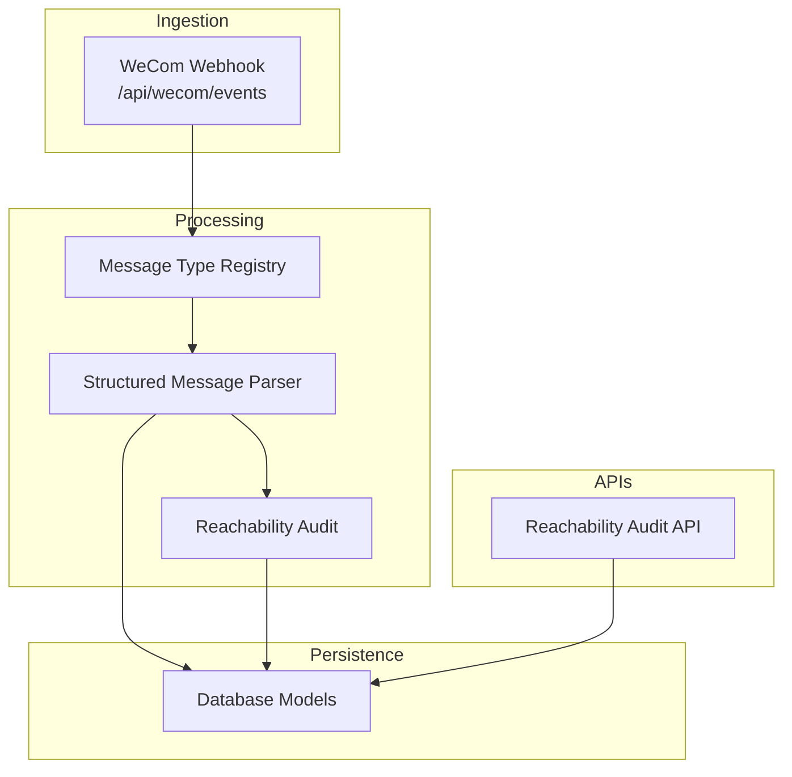
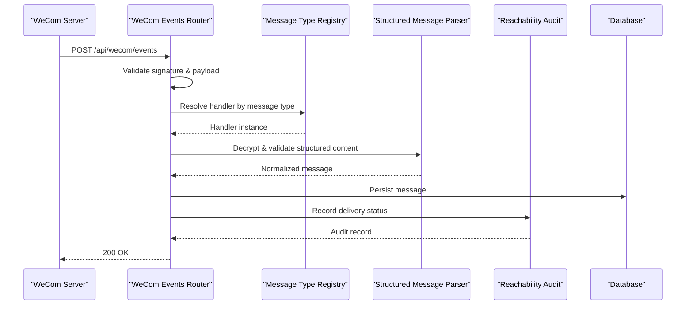
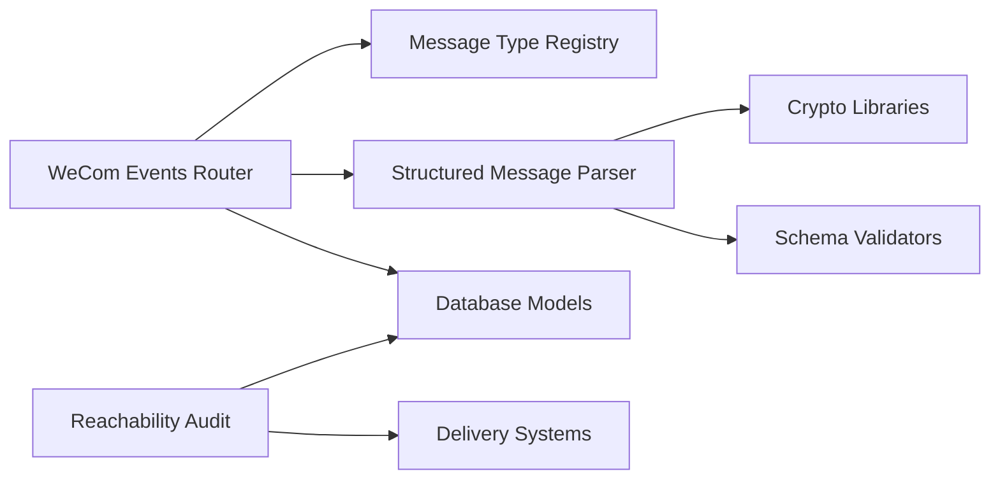

# Message Processing Pipeline

<cite>
**Referenced Files in This Document**
- [wecom_events.py](file://backend/app/routers/wecom_events.py)
- [message_type_registry.py](file://backend/app/message_type_registry.py)
- [structured_message_parser.py](file://backend/app/structured_message_parser.py)
- [reachability_audit.py](file://backend/app/reachability_audit.py)
- [reachability_audit.py](file://backend/app/routers/reachability_audit.py)
- [models.py](file://backend/app/db/models.py)
- [main.py](file://backend/app/main.py)
- [ARCHITECTURE.md](file://docs/ARCHITECTURE.md)
</cite>

## Table of Contents
1. [Introduction](#introduction)
2. [Project Structure](#project-structure)
3. [Core Components](#core-components)
4. [Architecture Overview](#architecture-overview)
5. [Detailed Component Analysis](#detailed-component-analysis)
6. [Dependency Analysis](#dependency-analysis)
7. [Performance Considerations](#performance-considerations)
8. [Troubleshooting Guide](#troubleshooting-guide)
9. [Conclusion](#conclusion)
10. [Appendices](#appendices)

## Introduction
This document explains the message processing pipeline for ingesting WeCom webhook events, registering and parsing message types, decrypting structured content, and auditing reachability. It covers the end-to-end lifecycle from ingestion through validation, transformation, persistence, and delivery status tracking. It also documents the message type registry pattern, structured message parser, and reachability audit system, along with error handling strategies, retry mechanisms, and dead letter queue patterns. Examples are provided to guide custom message type handlers and parsing logic.

## Project Structure
The message processing pipeline is implemented within the backend application:
- Webhook ingestion endpoint for WeCom events
- Message type registry for extensible handler dispatch
- Structured message parser for decryption and validation
- Reachability audit subsystem for delivery tracking
- Data models for persistence
- API endpoints for querying audit data

**Diagram sources**
- [wecom_events.py](file://backend/app/routers/wecom_events.py)
- [message_type_registry.py](file://backend/app/message_type_registry.py)
- [structured_message_parser.py](file://backend/app/structured_message_parser.py)
- [reachability_audit.py](file://backend/app/reachability_audit.py)
- [reachability_audit.py](file://backend/app/routers/reachability_audit.py)
- [models.py](file://backend/app/db/models.py)

**Section sources**
- [main.py](file://backend/app/main.py)
- [ARCHITECTURE.md](file://docs/ARCHITECTURE.md)

## Core Components
- WeCom Webhook Ingestion: Receives and validates incoming webhook payloads, routes them to the message type registry, and returns appropriate responses.
- Message Type Registry: Centralized mapping of message types to handlers, enabling extensibility and consistent processing across different WeCom message formats.
- Structured Message Parser: Decrypts and validates structured content, normalizes fields, and produces a canonical representation for downstream processing.
- Reachability Audit: Tracks message delivery status, records outcomes, and exposes APIs for diagnostics and reporting.
- Persistence Layer: Stores messages, audit records, and related metadata using database models.

**Section sources**
- [wecom_events.py](file://backend/app/routers/wecom_events.py)
- [message_type_registry.py](file://backend/app/message_type_registry.py)
- [structured_message_parser.py](file://backend/app/structured_message_parser.py)
- [reachability_audit.py](file://backend/app/reachability_audit.py)
- [models.py](file://backend/app/db/models.py)

## Architecture Overview
The pipeline follows a clear sequence:
1. Ingest: The WeCom webhook endpoint receives events and performs initial validation.
2. Dispatch: The message type registry selects the appropriate handler based on the message type.
3. Parse: The structured message parser decrypts and validates content, producing normalized structures.
4. Persist: Normalized messages are persisted via database models.
5. Audit: Reachability audit records capture delivery outcomes and status transitions.
6. Query: API endpoints expose audit data for diagnostics and reporting.

**Diagram sources**
- [wecom_events.py](file://backend/app/routers/wecom_events.py)
- [message_type_registry.py](file://backend/app/message_type_registry.py)
- [structured_message_parser.py](file://backend/app/structured_message_parser.py)
- [reachability_audit.py](file://backend/app/reachability_audit.py)
- [models.py](file://backend/app/db/models.py)

## Detailed Component Analysis

### WeCom Webhook Ingestion
Responsibilities:
- Receive and validate incoming webhook requests (signature verification, payload structure).
- Extract message metadata (type, tenant context, timestamps).
- Delegate to the message type registry for handler resolution.
- Manage response codes and error propagation.

Error Handling:
- Reject malformed or unauthenticated requests early.
- Log detailed errors for debugging.
- Return appropriate HTTP status codes.

Retry Mechanisms:
- Idempotency checks to avoid duplicate processing.
- Backoff strategies for transient failures during persistence or audit recording.

Dead Letter Queue Patterns:
- Persist failed messages with error context for later replay.
- Provide diagnostic endpoints to inspect and reprocess failed items.

**Section sources**
- [wecom_events.py](file://backend/app/routers/wecom_events.py)

### Message Type Registry
Responsibilities:
- Maintain a registry mapping message types to handler classes/functions.
- Provide registration APIs for adding new message types.
- Resolve handlers dynamically based on incoming message metadata.

Design Pattern:
- Centralized dispatch table with explicit registration calls.
- Encapsulates handler instantiation and parameter binding.

Extensibility:
- New message types can be added without modifying core routing logic.
- Handlers implement a common interface for consistency.

**Section sources**
- [message_type_registry.py](file://backend/app/message_type_registry.py)

### Structured Message Parser
Responsibilities:
- Decrypt structured content using configured keys and algorithms.
- Validate decrypted payloads against expected schemas.
- Normalize fields into a canonical representation.
- Handle encryption errors gracefully with informative messages.

Validation:
- Schema validation for required fields and types.
- Cross-field constraints and business rules.

Transformation:
- Convert raw encrypted blobs into structured objects.
- Map WeCom-specific fields to internal domain models.

**Section sources**
- [structured_message_parser.py](file://backend/app/structured_message_parser.py)

### Reachability Audit System
Responsibilities:
- Track message delivery status and outcomes.
- Record timestamps, status transitions, and error details.
- Expose APIs for querying audit data and generating reports.

Data Model:
- Audit records linked to messages and tenants.
- Status enums for delivery states (pending, delivered, failed, etc.).

Diagnostics:
- Aggregate metrics for delivery success rates.
- Identify patterns in failures and timeouts.

**Section sources**
- [reachability_audit.py](file://backend/app/reachability_audit.py)
- [reachability_audit.py](file://backend/app/routers/reachability_audit.py)

### Data Models and Persistence
Responsibilities:
- Define database schemas for messages, audit records, and related entities.
- Enforce referential integrity and constraints.
- Provide ORM interfaces for CRUD operations.

Key Entities:
- Messages: Store normalized message content and metadata.
- Audit Records: Capture delivery status and outcomes.
- Tenants: Scope data isolation and configuration.

**Section sources**
- [models.py](file://backend/app/db/models.py)

## Dependency Analysis
The pipeline components have clear dependencies:
- WeCom Events Router depends on Message Type Registry and Structured Message Parser.
- Structured Message Parser depends on cryptographic libraries and schema validators.
- Reachability Audit depends on Database Models and external delivery systems.
- All components depend on configuration for tenant settings and credentials.

**Diagram sources**
- [wecom_events.py](file://backend/app/routers/wecom_events.py)
- [message_type_registry.py](file://backend/app/message_type_registry.py)
- [structured_message_parser.py](file://backend/app/structured_message_parser.py)
- [reachability_audit.py](file://backend/app/reachability_audit.py)
- [models.py](file://backend/app/db/models.py)

**Section sources**
- [main.py](file://backend/app/main.py)

## Performance Considerations
- Asynchronous Processing: Use async handlers for I/O-bound operations like decryption and persistence.
- Connection Pooling: Optimize database connections for high-throughput scenarios.
- Caching: Cache frequently accessed configurations and lookup tables.
- Batch Operations: Group persistence and audit updates where possible.
- Monitoring: Track latency and throughput metrics for each pipeline stage.

[No sources needed since this section provides general guidance]

## Troubleshooting Guide
Common Issues:
- Signature Validation Failures: Verify webhook secrets and timestamp tolerances.
- Decryption Errors: Check key management and algorithm compatibility.
- Schema Validation Failures: Inspect payload structure and field mappings.
- Delivery Failures: Review audit logs for error details and retry attempts.

Debugging Steps:
- Enable detailed logging for each pipeline stage.
- Use diagnostic endpoints to inspect message state and audit records.
- Replay failed messages from dead letter queues for analysis.

**Section sources**
- [wecom_events.py](file://backend/app/routers/wecom_events.py)
- [structured_message_parser.py](file://backend/app/structured_message_parser.py)
- [reachability_audit.py](file://backend/app/reachability_audit.py)

## Conclusion
The message processing pipeline provides a robust, extensible architecture for handling WeCom webhook events. The message type registry enables easy addition of new message formats, while the structured message parser ensures secure and validated content processing. The reachability audit system offers comprehensive delivery tracking and diagnostics. With proper error handling, retry mechanisms, and dead letter queue patterns, the pipeline maintains reliability and observability in production environments.

[No sources needed since this section summarizes without analyzing specific files]

## Appendices

### Example: Custom Message Type Handler
To add support for a new message type:
1. Implement a handler class with standard methods for processing.
2. Register the handler in the message type registry.
3. Test with sample payloads to ensure correct parsing and persistence.

**Section sources**
- [message_type_registry.py](file://backend/app/message_type_registry.py)

### Example: Parsing Logic for Structured Content
Custom parsing logic should:
1. Decrypt the content using configured parameters.
2. Validate against the expected schema.
3. Transform into normalized structures for downstream use.

**Section sources**
- [structured_message_parser.py](file://backend/app/structured_message_parser.py)