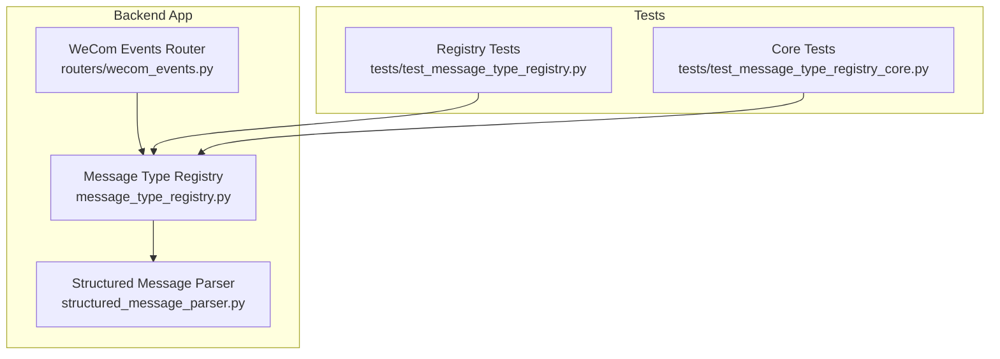
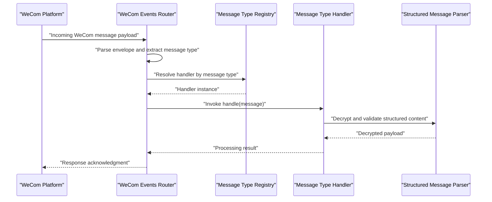
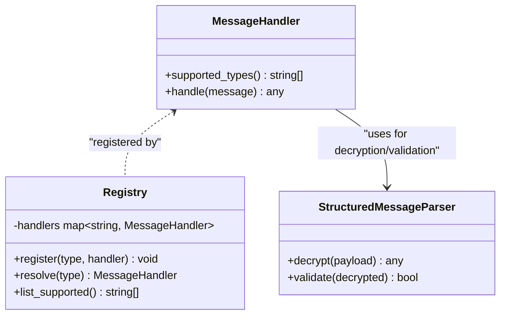
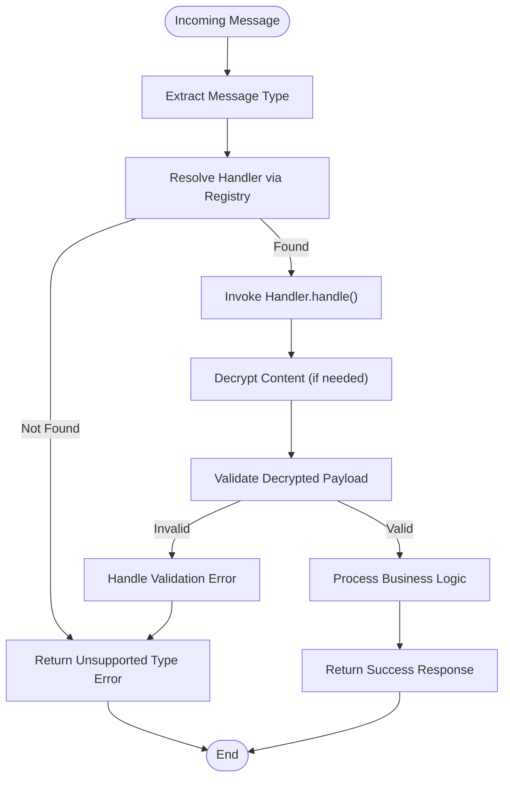
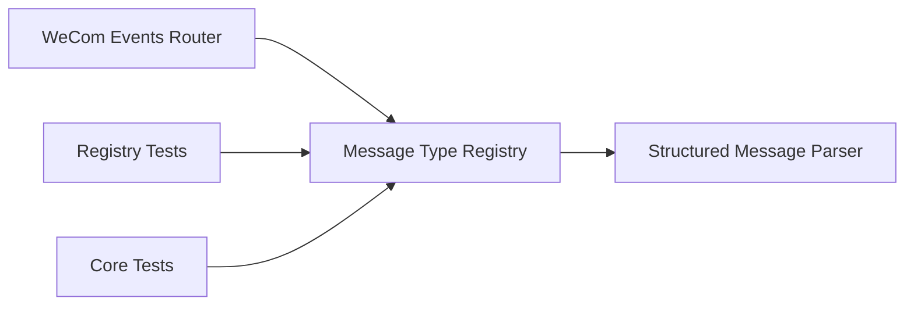

# Message Type Registry

<cite>
**Referenced Files in This Document**
- [message_type_registry.py](file://backend/app/message_type_registry.py)
- [structured_message_parser.py](file://backend/app/structured_message_parser.py)
- [wecom_events.py](file://backend/app/routers/wecom_events.py)
- [test_message_type_registry.py](file://backend/tests/test_message_type_registry.py)
- [test_message_type_registry_core.py](file://backend/tests/test_message_type_registry_core.py)
</cite>

## Table of Contents
1. [Introduction](#introduction)
2. [Project Structure](#project-structure)
3. [Core Components](#core-components)
4. [Architecture Overview](#architecture-overview)
5. [Detailed Component Analysis](#detailed-component-analysis)
6. [Dependency Analysis](#dependency-analysis)
7. [Performance Considerations](#performance-considerations)
8. [Troubleshooting Guide](#troubleshooting-guide)
9. [Conclusion](#conclusion)
10. [Appendices](#appendices)

## Introduction
This document explains the message type registry system used to manage WeCom message types across the application. It covers how message types are defined, registered, discovered, and processed through a centralized registry pattern. You will learn the interface for message handlers, the registration process, handler invocation flow, and how new message types can be added and validated. The relationship between message types and their corresponding parsers is also documented, along with examples of implementing custom handlers and integrating with the structured message parser for content decryption and validation.

## Project Structure
The message type registry lives under the backend application module and integrates with the WeCom event router and the structured message parser:
- Message type registry implementation and utilities
- Structured message parser for decrypting and validating content
- WeCom events router that dispatches incoming messages to the registry
- Tests covering registry behavior and core functionality

**Diagram sources**
- [message_type_registry.py](file://backend/app/message_type_registry.py)
- [structured_message_parser.py](file://backend/app/structured_message_parser.py)
- [wecom_events.py](file://backend/app/routers/wecom_events.py)
- [test_message_type_registry.py](file://backend/tests/test_message_type_registry.py)
- [test_message_type_registry_core.py](file://backend/tests/test_message_type_registry_core.py)

**Section sources**
- [message_type_registry.py](file://backend/app/message_type_registry.py)
- [structured_message_parser.py](file://backend/app/structured_message_parser.py)
- [wecom_events.py](file://backend/app/routers/wecom_events.py)
- [test_message_type_registry.py](file://backend/tests/test_message_type_registry.py)
- [test_message_type_registry_core.py](file://backend/tests/test_message_type_registry_core.py)

## Core Components
- Message Type Interface: Defines the contract for handling specific WeCom message types, including metadata such as supported types and parsing rules.
- Registry: Centralized store mapping message type identifiers to handler implementations, providing discovery and invocation capabilities.
- Handler Invocation Mechanism: Dispatches incoming messages to the appropriate handler based on the message type, invoking parsing and processing logic.
- Structured Message Parser Integration: Decrypts and validates structured content before handing it off to the message handler.

Key responsibilities:
- Registration: Handlers register themselves with the registry using decorators or explicit registration calls.
- Discovery: The registry exposes methods to list supported types and retrieve handlers by type.
- Processing: Incoming messages are routed to the correct handler, which may use the structured message parser to decrypt and validate content.

**Section sources**
- [message_type_registry.py](file://backend/app/message_type_registry.py)
- [structured_message_parser.py](file://backend/app/structured_message_parser.py)
- [wecom_events.py](file://backend/app/routers/wecom_events.py)

## Architecture Overview
The registry follows a centralized pattern where all message type handlers are registered once at startup and then invoked dynamically based on the incoming message type. The WeCom events router receives raw payloads, determines the message type, and delegates processing to the registry. The registry selects the appropriate handler, which may call the structured message parser to decrypt and validate content before business logic execution.

**Diagram sources**
- [wecom_events.py](file://backend/app/routers/wecom_events.py)
- [message_type_registry.py](file://backend/app/message_type_registry.py)
- [structured_message_parser.py](file://backend/app/structured_message_parser.py)

## Detailed Component Analysis

### Message Type Interface and Registry
The message type interface defines the expected behavior for handlers, including supported message types and processing methods. The registry maintains a mapping from message type strings to handler classes or functions, enabling dynamic resolution and invocation.

Key aspects:
- Interface contract: Handlers must implement a standardized method signature for processing messages.
- Registration API: Provides decorator-based or programmatic registration to associate message types with handlers.
- Validation: Ensures that only valid and supported message types are registered and invoked.

**Diagram sources**
- [message_type_registry.py](file://backend/app/message_type_registry.py)
- [structured_message_parser.py](file://backend/app/structured_message_parser.py)

**Section sources**
- [message_type_registry.py](file://backend/app/message_type_registry.py)
- [structured_message_parser.py](file://backend/app/structured_message_parser.py)

### Handler Invocation Flow
When a WeCom message arrives, the router extracts the message type and asks the registry to resolve the corresponding handler. The handler processes the message, optionally using the structured message parser to decrypt and validate content. Errors during resolution or processing are handled gracefully with appropriate logging and error responses.

**Diagram sources**
- [wecom_events.py](file://backend/app/routers/wecom_events.py)
- [message_type_registry.py](file://backend/app/message_type_registry.py)
- [structured_message_parser.py](file://backend/app/structured_message_parser.py)

**Section sources**
- [wecom_events.py](file://backend/app/routers/wecom_events.py)
- [message_type_registry.py](file://backend/app/message_type_registry.py)
- [structured_message_parser.py](file://backend/app/structured_message_parser.py)

### Adding a New Message Type
To add support for a new WeCom message type:
1. Implement a handler class that adheres to the message type interface.
2. Register the handler with the registry using the provided registration API.
3. Ensure the handler integrates with the structured message parser if decryption or validation is required.
4. Add tests to verify registration, resolution, and processing behavior.

Best practices:
- Keep handlers focused on a single message type.
- Use dependency injection for external services (e.g., storage, notifications).
- Validate input payloads early to fail fast.
- Log meaningful errors without exposing sensitive data.

**Section sources**
- [message_type_registry.py](file://backend/app/message_type_registry.py)
- [structured_message_parser.py](file://backend/app/structured_message_parser.py)
- [test_message_type_registry.py](file://backend/tests/test_message_type_registry.py)
- [test_message_type_registry_core.py](file://backend/tests/test_message_type_registry_core.py)

### Integrating with the Structured Message Parser
Handlers that deal with encrypted or structured content should integrate with the structured message parser to ensure secure and valid processing:
- Decrypt the payload using the parser’s decryption method.
- Validate the decrypted structure against expected schemas.
- Proceed with business logic only after successful validation.

Common pitfalls:
- Failing to handle decryption errors gracefully.
- Not validating payload structure before processing.
- Leaking sensitive information in logs or error messages.

**Section sources**
- [structured_message_parser.py](file://backend/app/structured_message_parser.py)
- [message_type_registry.py](file://backend/app/message_type_registry.py)

## Dependency Analysis
The registry depends on the structured message parser for content decryption and validation. The WeCom events router depends on the registry for handler resolution. Tests provide coverage for registry behavior and integration points.

**Diagram sources**
- [wecom_events.py](file://backend/app/routers/wecom_events.py)
- [message_type_registry.py](file://backend/app/message_type_registry.py)
- [structured_message_parser.py](file://backend/app/structured_message_parser.py)
- [test_message_type_registry.py](file://backend/tests/test_message_type_registry.py)
- [test_message_type_registry_core.py](file://backend/tests/test_message_type_registry_core.py)

**Section sources**
- [wecom_events.py](file://backend/app/routers/wecom_events.py)
- [message_type_registry.py](file://backend/app/message_type_registry.py)
- [structured_message_parser.py](file://backend/app/structured_message_parser.py)
- [test_message_type_registry.py](file://backend/tests/test_message_type_registry.py)
- [test_message_type_registry_core.py](file://backend/tests/test_message_type_registry_core.py)

## Performance Considerations
- Registry lookups should be O(1) using hash maps for efficient handler resolution.
- Avoid heavy initialization in handlers; defer expensive operations until needed.
- Cache frequently accessed configuration or keys used by the structured message parser.
- Batch processing for high-throughput scenarios to reduce overhead.

[No sources needed since this section provides general guidance]

## Troubleshooting Guide
Common issues and resolutions:
- Unsupported message type: Verify that the handler is registered and the message type string matches exactly.
- Decryption failures: Check encryption keys and payload integrity; ensure the structured message parser is configured correctly.
- Validation errors: Inspect payload schema and ensure handlers validate inputs properly.
- Logging: Enable debug logs to trace message flow and identify bottlenecks or failures.

**Section sources**
- [message_type_registry.py](file://backend/app/message_type_registry.py)
- [structured_message_parser.py](file://backend/app/structured_message_parser.py)
- [wecom_events.py](file://backend/app/routers/wecom_events.py)

## Conclusion
The message type registry provides a robust and extensible framework for managing WeCom message types. By centralizing registration and discovery, it simplifies adding new handlers and ensures consistent processing across the application. Integration with the structured message parser enables secure and validated content handling. Following the guidelines in this document will help developers extend the system effectively while maintaining reliability and performance.

[No sources needed since this section summarizes without analyzing specific files]

## Appendices
- Example usage patterns for registering handlers
- Best practices for error handling and logging
- Checklist for validating new message type implementations

[No sources needed since this section provides general guidance]