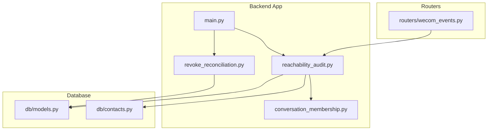
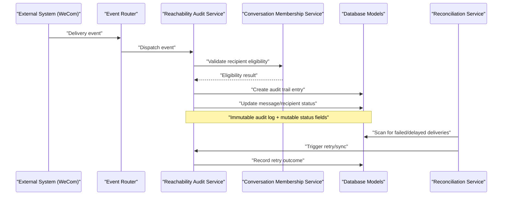
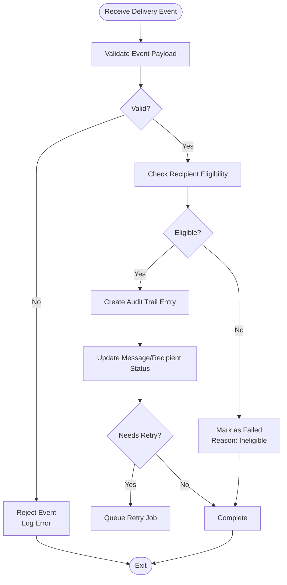
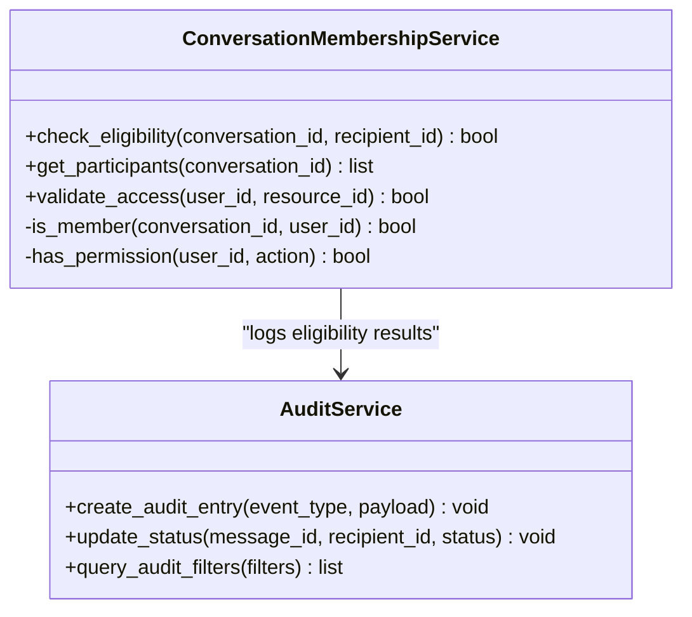
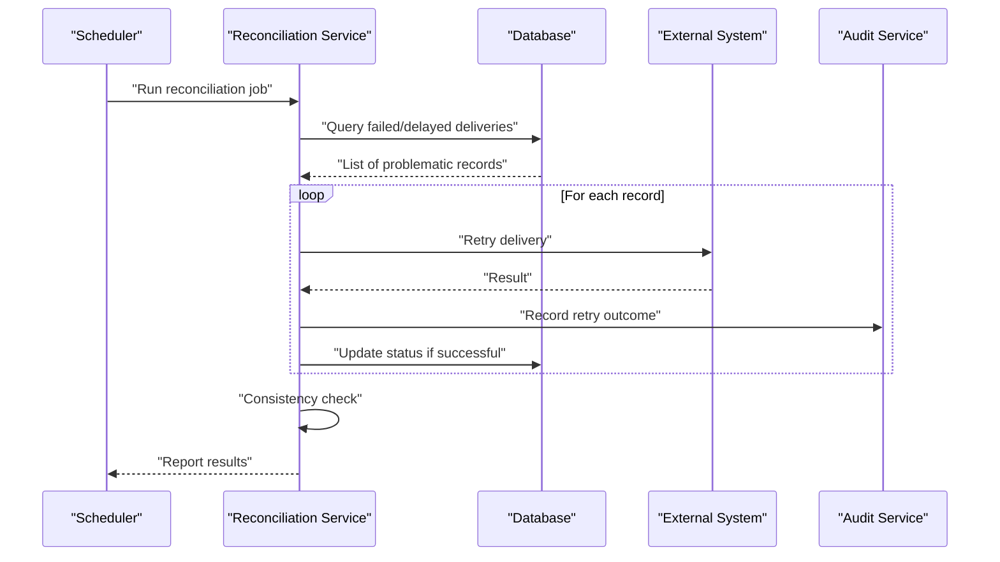
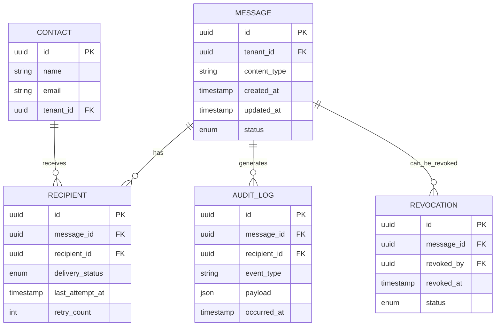
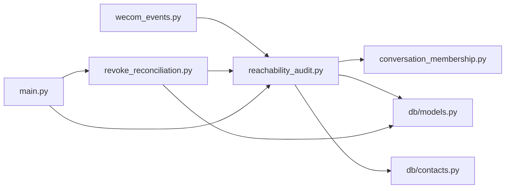

# Reachability Audit Processing

<cite>
**Referenced Files in This Document**
- [reachability_audit.py](file://backend/app/reachability_audit.py)
- [conversation_membership.py](file://backend/app/conversation_membership.py)
- [revoke_reconciliation.py](file://backend/app/revoke_reconciliation.py)
- [main.py](file://backend/app/main.py)
- [models.py](file://backend/app/db/models.py)
- [contacts.py](file://backend/app/db/contacts.py)
- [wecom_events.py](file://backend/app/routers/wecom_events.py)
- [test_reachability_audit.py](file://backend/tests/test_reachability_audit.py)
- [test_revoke_reconciliation.py](file://backend/tests/test_revoke_reconciliation.py)
</cite>

## Table of Contents
1. [Introduction](#introduction)
2. [Project Structure](#project-structure)
3. [Core Components](#core-components)
4. [Architecture Overview](#architecture-overview)
5. [Detailed Component Analysis](#detailed-component-analysis)
6. [Dependency Analysis](#dependency-analysis)
7. [Performance Considerations](#performance-considerations)
8. [Troubleshooting Guide](#troubleshooting-guide)
9. [Conclusion](#conclusion)
10. [Appendices](#appendices)

## Introduction
This document explains the reachability audit processing system that tracks, audits, and reconciles message delivery status across systems. It covers how audit trails are created, how statuses are updated and synchronized, and how conversation membership is integrated to validate recipient eligibility and access permissions. It also documents reconciliation processes for handling delivery failures, retries, and consistency checks, along with examples of audit query patterns, reporting mechanisms, and troubleshooting steps for delivery issues.

## Project Structure
The reachability audit functionality is implemented primarily within the backend application module, with supporting database models and event routing:
- Core logic resides in a dedicated reachability audit module and related services.
- Conversation membership validation is provided by a membership service.
- Reconciliation logic is encapsulated in a separate reconciliation module.
- Database models define entities used by the audit and reconciliation flows.
- Event routing integrates external events (e.g., WeCom events) into the audit pipeline.

**Diagram sources**
- [reachability_audit.py](file://backend/app/reachability_audit.py)
- [conversation_membership.py](file://backend/app/conversation_membership.py)
- [revoke_reconciliation.py](file://backend/app/revoke_reconciliation.py)
- [main.py](file://backend/app/main.py)
- [models.py](file://backend/app/db/models.py)
- [contacts.py](file://backend/app/db/contacts.py)
- [wecom_events.py](file://backend/app/routers/wecom_events.py)

**Section sources**
- [reachability_audit.py](file://backend/app/reachability_audit.py)
- [conversation_membership.py](file://backend/app/conversation_membership.py)
- [revoke_reconciliation.py](file://backend/app/revoke_reconciliation.py)
- [main.py](file://backend/app/main.py)
- [models.py](file://backend/app/db/models.py)
- [contacts.py](file://backend/app/db/contacts.py)
- [wecom_events.py](file://backend/app/routers/wecom_events.py)

## Core Components
- Reachability Audit Service: Orchestrates tracking of message delivery outcomes, creates audit trail entries, updates statuses, and coordinates reconciliation.
- Conversation Membership Service: Validates recipient eligibility and access permissions before marking messages as delivered or failed.
- Reconciliation Service: Handles delivery failures, retries, and synchronization between internal state and external systems.
- Database Models: Define entities for messages, recipients, audit logs, revocations, and contact information.
- Event Router: Ingests external events (e.g., from WeCom) and triggers audit updates.

Key responsibilities:
- Create immutable audit trail records for each delivery attempt.
- Update message and recipient statuses based on delivery results.
- Validate membership and permissions to ensure only eligible recipients receive messages.
- Perform periodic reconciliation to detect inconsistencies and retry failed deliveries.

**Section sources**
- [reachability_audit.py](file://backend/app/reachability_audit.py)
- [conversation_membership.py](file://backend/app/conversation_membership.py)
- [revoke_reconciliation.py](file://backend/app/revoke_reconciliation.py)
- [models.py](file://backend/app/db/models.py)
- [contacts.py](file://backend/app/db/contacts.py)
- [wecom_events.py](file://backend/app/routers/wecom_events.py)

## Architecture Overview
The reachability audit system follows an event-driven architecture where external events trigger audit updates. The flow includes ingestion, validation, auditing, and reconciliation phases.

**Diagram sources**
- [wecom_events.py](file://backend/app/routers/wecom_events.py)
- [reachability_audit.py](file://backend/app/reachability_audit.py)
- [conversation_membership.py](file://backend/app/conversation_membership.py)
- [models.py](file://backend/app/db/models.py)
- [revoke_reconciliation.py](file://backend/app/revoke_reconciliation.py)

## Detailed Component Analysis

### Reachability Audit Service
Responsibilities:
- Ingest delivery events and create audit trail entries.
- Update message and recipient statuses consistently.
- Coordinate with membership validation and reconciliation.

Key behaviors:
- Idempotent processing of duplicate events.
- Immutable audit logging with timestamps and context.
- Status transitions: pending -> delivered/failed -> retried -> final.

**Diagram sources**
- [reachability_audit.py](file://backend/app/reachability_audit.py)
- [conversation_membership.py](file://backend/app/conversation_membership.py)
- [models.py](file://backend/app/db/models.py)

**Section sources**
- [reachability_audit.py](file://backend/app/reachability_audit.py)
- [test_reachability_audit.py](file://backend/tests/test_reachability_audit.py)

### Conversation Membership Integration
Responsibilities:
- Validate recipient eligibility based on conversation membership rules.
- Enforce access permissions for message delivery.
- Provide clear failure reasons when recipients are ineligible.

Key behaviors:
- Checks group/participant membership.
- Validates user status and permissions.
- Returns structured eligibility results for audit logging.

**Diagram sources**
- [conversation_membership.py](file://backend/app/conversation_membership.py)
- [reachability_audit.py](file://backend/app/reachability_audit.py)

**Section sources**
- [conversation_membership.py](file://backend/app/conversation_membership.py)

### Reconciliation Service
Responsibilities:
- Detect inconsistent states between internal records and external systems.
- Handle delivery failures with retry logic.
- Synchronize status updates across systems.

Key behaviors:
- Periodic scanning for failed/delayed deliveries.
- Exponential backoff for retries.
- Idempotent retry operations.
- Consistency checks for audit trail integrity.

**Diagram sources**
- [revoke_reconciliation.py](file://backend/app/revoke_reconciliation.py)
- [models.py](file://backend/app/db/models.py)
- [reachability_audit.py](file://backend/app/reachability_audit.py)

**Section sources**
- [revoke_reconciliation.py](file://backend/app/revoke_reconciliation.py)
- [test_revoke_reconciliation.py](file://backend/tests/test_revoke_reconciliation.py)

### Database Models
Entities involved in reachability auditing:
- Messages: Core message metadata and status.
- Recipients: Individual recipient delivery status.
- Audit Logs: Immutable records of all delivery attempts and outcomes.
- Revocations: Track message revocation status and associations.
- Contacts: Contact information and relationship data.

**Diagram sources**
- [models.py](file://backend/app/db/models.py)
- [contacts.py](file://backend/app/db/contacts.py)

**Section sources**
- [models.py](file://backend/app/db/models.py)
- [contacts.py](file://backend/app/db/contacts.py)

## Dependency Analysis
The reachability audit system has well-defined dependencies:
- Event router depends on external systems and dispatches to audit service.
- Audit service depends on membership validation and database models.
- Reconciliation service depends on database models and audit service.
- All components depend on consistent database schema and contact data.

**Diagram sources**
- [wecom_events.py](file://backend/app/routers/wecom_events.py)
- [reachability_audit.py](file://backend/app/reachability_audit.py)
- [conversation_membership.py](file://backend/app/conversation_membership.py)
- [models.py](file://backend/app/db/models.py)
- [contacts.py](file://backend/app/db/contacts.py)
- [revoke_reconciliation.py](file://backend/app/revoke_reconciliation.py)
- [main.py](file://backend/app/main.py)

**Section sources**
- [wecom_events.py](file://backend/app/routers/wecom_events.py)
- [reachability_audit.py](file://backend/app/reachability_audit.py)
- [conversation_membership.py](file://backend/app/conversation_membership.py)
- [models.py](file://backend/app/db/models.py)
- [contacts.py](file://backend/app/db/contacts.py)
- [revoke_reconciliation.py](file://backend/app/revoke_reconciliation.py)
- [main.py](file://backend/app/main.py)

## Performance Considerations
- Batch processing: Process multiple delivery events in batches to reduce database overhead.
- Indexing: Ensure proper database indexes on frequently queried fields like message_id, recipient_id, and status.
- Caching: Cache membership validation results to reduce repeated checks.
- Async processing: Use background jobs for long-running reconciliation tasks.
- Connection pooling: Configure database connection pools appropriately for high-throughput scenarios.
- Rate limiting: Implement rate limiting for external API calls during retries.

[No sources needed since this section provides general guidance]

## Troubleshooting Guide
Common issues and resolution steps:

1. **Delivery Failures**:
   - Check audit logs for error details and failure reasons.
   - Verify recipient eligibility using membership validation.
   - Review retry counts and backoff strategies.

2. **Inconsistent Statuses**:
   - Run reconciliation jobs to detect and fix inconsistencies.
   - Compare internal status with external system records.
   - Investigate network timeouts or partial failures.

3. **Permission Issues**:
   - Validate user permissions and conversation membership.
   - Check for recent permission changes or user deactivations.
   - Review access control policies and enforcement.

4. **Performance Issues**:
   - Monitor database query performance and optimize slow queries.
   - Check for excessive retry attempts causing load spikes.
   - Review connection pool utilization and scaling needs.

Diagnostic queries and reports:
- Query recent delivery failures by date range and status.
- Generate reports on retry success rates and average retry counts.
- Identify conversations with high failure rates for investigation.

**Section sources**
- [reachability_audit.py](file://backend/app/reachability_audit.py)
- [revoke_reconciliation.py](file://backend/app/revoke_reconciliation.py)
- [test_reachability_audit.py](file://backend/tests/test_reachability_audit.py)
- [test_revoke_reconciliation.py](file://backend/tests/test_revoke_reconciliation.py)

## Conclusion
The reachability audit processing system provides comprehensive tracking, auditing, and reconciliation of message delivery status. Through immutable audit trails, robust membership validation, and automated reconciliation, it ensures reliable message delivery while maintaining consistency across systems. The modular architecture allows for easy extension and maintenance, while the detailed logging and reporting capabilities support effective troubleshooting and monitoring.

[No sources needed since this section summarizes without analyzing specific files]

## Appendices

### Audit Query Patterns
Example query patterns for investigating delivery issues:

1. **Recent Failures**: Find all failed deliveries in the last 24 hours
   - Filter by status = 'failed' AND occurred_at > NOW() - INTERVAL '24 hours'
   - Group by message_id to identify problematic messages

2. **Retry Analysis**: Analyze retry patterns and success rates
   - Query retry_count distribution across failed deliveries
   - Calculate success rate after retries vs initial failures

3. **Membership Validation**: Investigate eligibility-related failures
   - Filter audit logs by event_type containing 'membership_check'
   - Correlate with recipient eligibility results

4. **Convergence Reports**: Generate delivery convergence metrics
   - Count messages with final status vs pending status
   - Track time-to-delivery statistics per recipient type

### Reporting Mechanisms
- Real-time dashboards showing delivery status overview
- Daily/weekly reports on delivery success rates
- Alerting for unusual failure patterns or performance degradation
- Export capabilities for compliance and audit purposes

[No sources needed since this section provides general guidance]