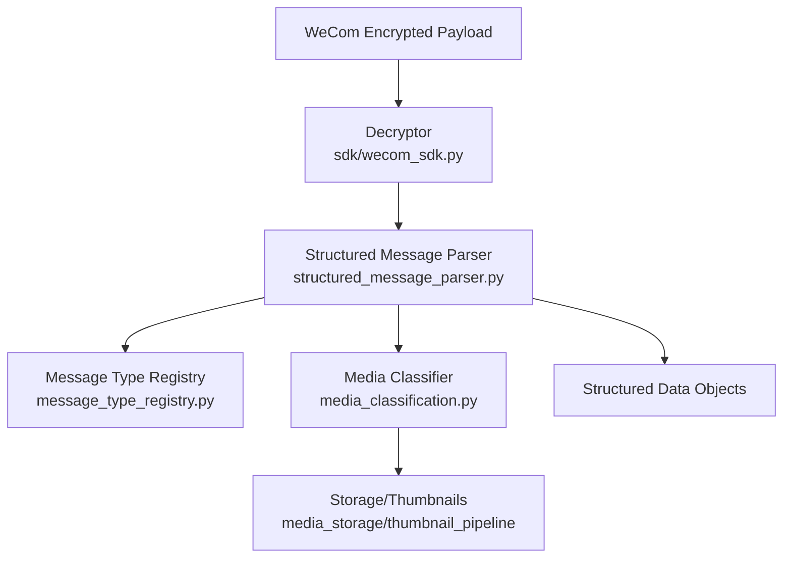
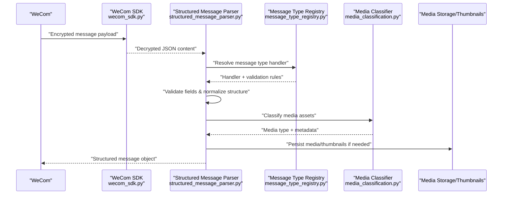
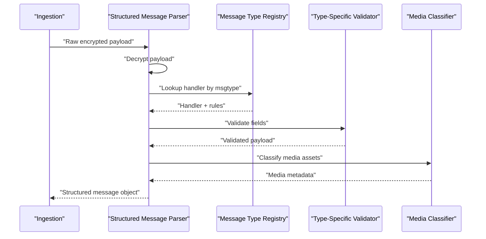
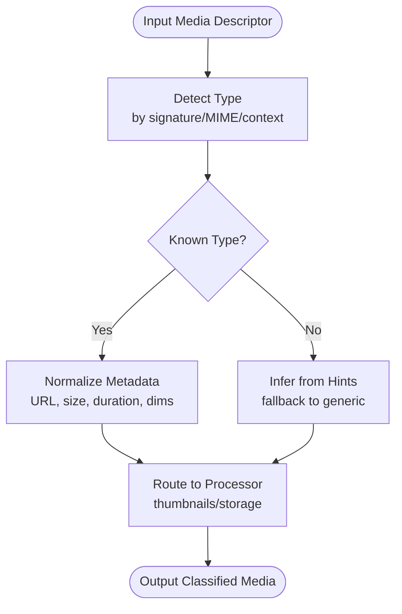
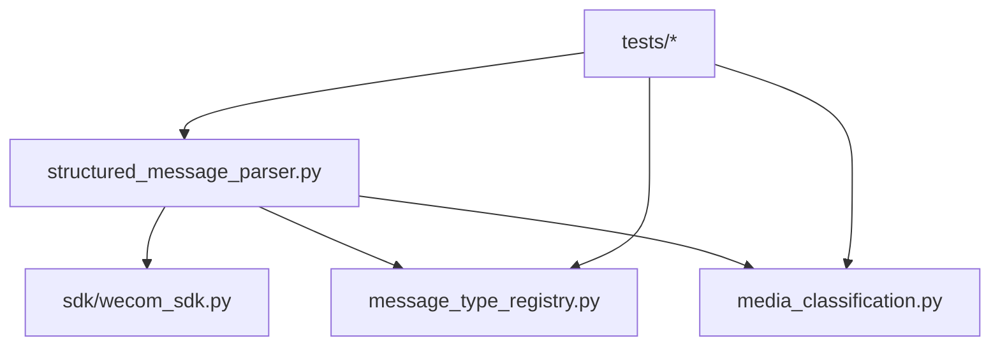

# Structured Message Parsing

<cite>
**Referenced Files in This Document**
- [structured_message_parser.py](file://backend/app/structured_message_parser.py)
- [media_classification.py](file://backend/app/media_classification.py)
- [message_type_registry.py](file://backend/app/message_type_registry.py)
- [wecom_sdk.py](file://backend/app/sdk/wecom_sdk.py)
- [decrypt_wecom_messages_once.py](file://backend/scripts/decrypt_wecom_messages_once.py)
- [test_structured_message_parser.py](file://backend/tests/test_structured_message_parser.py)
- [test_media_classification.py](file://backend/tests/test_media_classification.py)
- [test_rnd_210_msgtype_and_card.py](file://backend/tests/test_rnd_210_msgtype_and_card.py)
- [test_rnd_226_nested_entity_context.py](file://backend/tests/test_rnd_226_nested_entity_context.py)
- [test_rnd_206_rich_media.py](file://backend/tests/test_rnd_206_rich_media.py)
- [test_rnd_206_top_level_image.py](file://backend/tests/test_rnd_206_top_level_image.py)
- [test_decrypt_structured_content.py](file://backend/tests/test_decrypt_structured_content.py)
</cite>

## Table of Contents
1. [Introduction](#introduction)
2. [Project Structure](#project-structure)
3. [Core Components](#core-components)
4. [Architecture Overview](#architecture-overview)
5. [Detailed Component Analysis](#detailed-component-analysis)
6. [Dependency Analysis](#dependency-analysis)
7. [Performance Considerations](#performance-considerations)
8. [Troubleshooting Guide](#troubleshooting-guide)
9. [Conclusion](#conclusion)
10. [Appendices](#appendices)

## Introduction
This document explains the structured message parsing system for encrypted WeCom messages. It covers how raw, encrypted payloads are decrypted, validated, and transformed into structured data objects. It also documents the media classification system that identifies file types and applies appropriate processing, as well as support for various message formats, nested content structures, and metadata extraction. Examples illustrate parsing different message types, handling malformed content, and extending the parser for custom formats.

## Project Structure
The structured message parsing system is implemented primarily under backend/app with supporting scripts and tests:
- Parser core: structured_message_parser.py
- Media classification: media_classification.py
- Message type registry: message_type_registry.py
- WeCom SDK integration: sdk/wecom_sdk.py
- Decryption utility script: scripts/decrypt_wecom_messages_once.py
- Tests validating behavior across message types and edge cases

**Diagram sources**
- [wecom_sdk.py](file://backend/app/sdk/wecom_sdk.py)
- [structured_message_parser.py](file://backend/app/structured_message_parser.py)
- [message_type_registry.py](file://backend/app/message_type_registry.py)
- [media_classification.py](file://backend/app/media_classification.py)

**Section sources**
- [structured_message_parser.py](file://backend/app/structured_message_parser.py)
- [media_classification.py](file://backend/app/media_classification.py)
- [message_type_registry.py](file://backend/app/message_type_registry.py)
- [wecom_sdk.py](file://backend/app/sdk/wecom_sdk.py)
- [decrypt_wecom_messages_once.py](file://backend/scripts/decrypt_wecom_messages_once.py)

## Core Components
- Structured Message Parser: Decrypts, validates, and parses WeCom message payloads into typed structured objects. Supports text, images, files, rich media, cards, and nested entities.
- Media Classification: Detects media types from content or metadata and routes to appropriate handlers (e.g., thumbnails, storage backends).
- Message Type Registry: Centralized mapping of message types to parsers and validators, enabling extensibility for custom formats.
- WeCom SDK Integration: Provides decryption utilities and accessors for WeCom-specific fields.

Key responsibilities:
- Decryption: Use WeCom-provided algorithms to decrypt payload content securely.
- Validation: Enforce schema constraints, required fields, and format rules per message type.
- Parsing: Convert raw bytes/JSON into strongly-typed objects with normalized metadata.
- Media Handling: Classify and extract media attributes; generate thumbnails where applicable.
- Error Handling: Provide clear error categories and recovery strategies for malformed inputs.

**Section sources**
- [structured_message_parser.py](file://backend/app/structured_message_parser.py)
- [media_classification.py](file://backend/app/media_classification.py)
- [message_type_registry.py](file://backend/app/message_type_registry.py)
- [wecom_sdk.py](file://backend/app/sdk/wecom_sdk.py)

## Architecture Overview
The end-to-end flow transforms encrypted WeCom messages into structured data ready for storage and display.

**Diagram sources**
- [wecom_sdk.py](file://backend/app/sdk/wecom_sdk.py)
- [structured_message_parser.py](file://backend/app/structured_message_parser.py)
- [message_type_registry.py](file://backend/app/message_type_registry.py)
- [media_classification.py](file://backend/app/media_classification.py)

## Detailed Component Analysis

### Structured Message Parser
Responsibilities:
- Decrypt incoming payloads using WeCom SDK utilities.
- Validate message schemas based on type-specific rules.
- Parse into structured objects with normalized fields and metadata.
- Coordinate media classification and thumbnail generation.
- Handle errors gracefully with categorized exceptions.

Processing logic highlights:
- Decryption: Uses WeCom SDK to transform ciphertext into plaintext JSON.
- Validation: Checks presence of required keys, correct types, and value ranges.
- Parsing: Dispatches to type-specific handlers via the registry.
- Metadata: Extracts timestamps, sender info, conversation context, and media descriptors.
- Nested Content: Supports embedded entities within rich messages and cards.

Error handling strategy:
- Malformed JSON: Returns a parse error with diagnostic details.
- Missing fields: Raises validation errors indicating missing/invalid keys.
- Unsupported types: Delegates to fallback handlers or returns a generic unsupported message.
- Media failures: Logs errors and continues parsing non-media parts when possible.

Extensibility:
- Register new message types by adding entries to the registry with corresponding parsers and validators.
- Implement custom media classifiers for proprietary formats.

**Section sources**
- [structured_message_parser.py](file://backend/app/structured_message_parser.py)
- [message_type_registry.py](file://backend/app/message_type_registry.py)
- [media_classification.py](file://backend/app/media_classification.py)
- [wecom_sdk.py](file://backend/app/sdk/wecom_sdk.py)

#### Sequence Diagram: Parsing Flow

**Diagram sources**
- [structured_message_parser.py](file://backend/app/structured_message_parser.py)
- [message_type_registry.py](file://backend/app/message_type_registry.py)
- [media_classification.py](file://backend/app/media_classification.py)

### Media Classification System
Responsibilities:
- Identify media types from content signatures, MIME hints, or metadata.
- Normalize media descriptors (URLs, sizes, durations, dimensions).
- Route to appropriate processors (thumbnail generation, storage backends).
- Support nested media within rich messages and cards.

Classification logic highlights:
- Heuristics: File extension, magic numbers, and content-type headers.
- Contextual cues: Field names like image_url, file_name, video_duration.
- Fallbacks: Default to generic binary when type cannot be determined.

Error handling:
- Ambiguous types: Log warnings and use conservative defaults.
- Missing metadata: Attempt inference; otherwise mark as unknown.
- Processing failures: Return partial results and continue pipeline.

Extensibility:
- Add new classifiers by registering detection rules and processors.
- Integrate custom storage backends via adapters.

**Section sources**
- [media_classification.py](file://backend/app/media_classification.py)

#### Flowchart: Media Classification Algorithm

**Diagram sources**
- [media_classification.py](file://backend/app/media_classification.py)

### Message Type Registry
Responsibilities:
- Maintain mappings between message types and their parsers/validators.
- Provide lookup functions for efficient dispatch.
- Support registration of custom types at runtime.

Design patterns:
- Registry pattern centralizes type resolution.
- Pluggable handlers enable modular extensions.

Extensibility:
- New message types register handlers and validation rules.
- Backward compatibility maintained via versioned handlers.

**Section sources**
- [message_type_registry.py](file://backend/app/message_type_registry.py)

### WeCom SDK Integration
Responsibilities:
- Decrypt WeCom payloads using provided cryptographic primitives.
- Access WeCom-specific fields and structures.
- Provide utilities for signature verification and timestamp checks.

Security considerations:
- Use tenant-scoped keys for decryption.
- Validate signatures before processing.

**Section sources**
- [wecom_sdk.py](file://backend/app/sdk/wecom_sdk.py)

## Dependency Analysis
The parser depends on the SDK for decryption, the registry for type dispatch, and the classifier for media handling. Tests validate behavior across message types and edge cases.

**Diagram sources**
- [structured_message_parser.py](file://backend/app/structured_message_parser.py)
- [wecom_sdk.py](file://backend/app/sdk/wecom_sdk.py)
- [message_type_registry.py](file://backend/app/message_type_registry.py)
- [media_classification.py](file://backend/app/media_classification.py)
- [test_structured_message_parser.py](file://backend/tests/test_structured_message_parser.py)
- [test_media_classification.py](file://backend/tests/test_media_classification.py)
- [test_rnd_210_msgtype_and_card.py](file://backend/tests/test_rnd_210_msgtype_and_card.py)
- [test_rnd_226_nested_entity_context.py](file://backend/tests/test_rnd_226_nested_entity_context.py)
- [test_rnd_206_rich_media.py](file://backend/tests/test_rnd_206_rich_media.py)
- [test_rnd_206_top_level_image.py](file://backend/tests/test_rnd_206_top_level_image.py)
- [test_decrypt_structured_content.py](file://backend/tests/test_decrypt_structured_content.py)

**Section sources**
- [structured_message_parser.py](file://backend/app/structured_message_parser.py)
- [wecom_sdk.py](file://backend/app/sdk/wecom_sdk.py)
- [message_type_registry.py](file://backend/app/message_type_registry.py)
- [media_classification.py](file://backend/app/media_classification.py)
- [test_structured_message_parser.py](file://backend/tests/test_structured_message_parser.py)
- [test_media_classification.py](file://backend/tests/test_media_classification.py)
- [test_rnd_210_msgtype_and_card.py](file://backend/tests/test_rnd_210_msgtype_and_card.py)
- [test_rnd_226_nested_entity_context.py](file://backend/tests/test_rnd_226_nested_entity_context.py)
- [test_rnd_206_rich_media.py](file://backend/tests/test_rnd_206_rich_media.py)
- [test_rnd_206_top_level_image.py](file://backend/tests/test_rnd_206_top_level_image.py)
- [test_decrypt_structured_content.py](file://backend/tests/test_decrypt_structured_content.py)

## Performance Considerations
- Decryption overhead: Batch operations where possible; cache tenant keys.
- Validation efficiency: Early exit on missing critical fields; avoid deep recursion.
- Media classification: Prefer fast heuristics; defer heavy inference to background jobs.
- Thumbnail generation: Asynchronous pipelines reduce request latency.
- Memory usage: Stream large media descriptors; avoid loading full payloads into memory.

[No sources needed since this section provides general guidance]

## Troubleshooting Guide
Common issues and resolutions:
- Decryption failures: Verify tenant configuration and key validity; check signature timestamps.
- Validation errors: Inspect field presence and types; ensure schema updates align with WeCom changes.
- Media classification mismatches: Review detection rules; add explicit mappings for known formats.
- Parser crashes: Enable detailed logging; isolate failing message IDs for reproduction.

Recovery strategies:
- Retry with fallback handlers for unsupported types.
- Queue problematic messages for manual review.
- Update registry/classifiers incrementally without downtime.

**Section sources**
- [structured_message_parser.py](file://backend/app/structured_message_parser.py)
- [media_classification.py](file://backend/app/media_classification.py)
- [message_type_registry.py](file://backend/app/message_type_registry.py)
- [wecom_sdk.py](file://backend/app/sdk/wecom_sdk.py)

## Conclusion
The structured message parsing system provides a robust, extensible framework for decrypting, validating, and parsing WeCom messages into structured objects. The media classification system ensures accurate handling of diverse file types, while the message type registry enables seamless addition of new formats. With comprehensive error handling and performance optimizations, the system supports reliable ingestion and processing of complex, nested message content.

[No sources needed since this section summarizes without analyzing specific files]

## Appendices

### Examples of Parsing Different Message Types
- Text messages: Basic string content with sender and timestamp metadata.
- Image messages: URL-based images with optional captions and thumbnails.
- File messages: Binary attachments with filenames and sizes.
- Rich media: Embedded images, videos, and links within a single message.
- Cards: Structured layouts with buttons and form fields.

Validation and parsing steps:
- Decrypt payload using WeCom SDK.
- Resolve message type via registry.
- Validate fields against type-specific schema.
- Classify media assets and extract metadata.
- Return structured object with normalized fields.

**Section sources**
- [test_structured_message_parser.py](file://backend/tests/test_structured_message_parser.py)
- [test_rnd_210_msgtype_and_card.py](file://backend/tests/test_rnd_210_msgtype_and_card.py)
- [test_rnd_206_rich_media.py](file://backend/tests/test_rnd_206_rich_media.py)
- [test_rnd_206_top_level_image.py](file://backend/tests/test_rnd_206_top_level_image.py)

### Handling Malformed Content
Strategies:
- Catch JSON parse errors and return descriptive diagnostics.
- Skip invalid nested entities while preserving valid parts.
- Mark messages as partially parsed with warnings.

Best practices:
- Log full error context including message ID and payload hash.
- Provide retry mechanisms for transient failures.
- Monitor error rates and alert on anomalies.

**Section sources**
- [test_structured_message_parser.py](file://backend/tests/test_structured_message_parser.py)
- [test_rnd_226_nested_entity_context.py](file://backend/tests/test_rnd_226_nested_entity_context.py)

### Extending the Parser for Custom Formats
Steps:
- Define new message type handler with validation rules.
- Register handler in the message type registry.
- Implement media classifier for any custom media types.
- Add tests covering expected inputs and outputs.

Guidelines:
- Maintain backward compatibility with existing parsers.
- Use versioned handlers for evolving schemas.
- Document new types in API and user guides.

**Section sources**
- [message_type_registry.py](file://backend/app/message_type_registry.py)
- [media_classification.py](file://backend/app/media_classification.py)

### Decryption Utilities
Usage:
- Invoke decryption script to process historical payloads.
- Ensure tenant keys are correctly configured.
- Validate output integrity post-decryption.

Operational notes:
- Run in isolated environment to prevent key exposure.
- Audit logs for decryption attempts and failures.

**Section sources**
- [decrypt_wecom_messages_once.py](file://backend/scripts/decrypt_wecom_messages_once.py)
- [test_decrypt_structured_content.py](file://backend/tests/test_decrypt_structured_content.py)