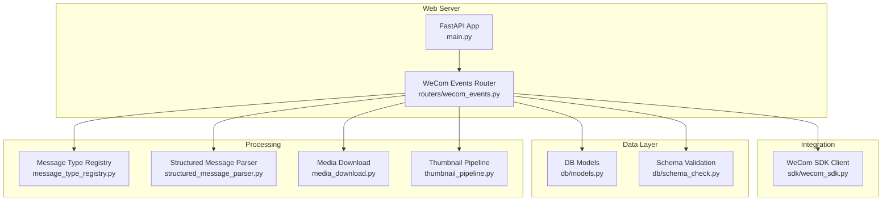
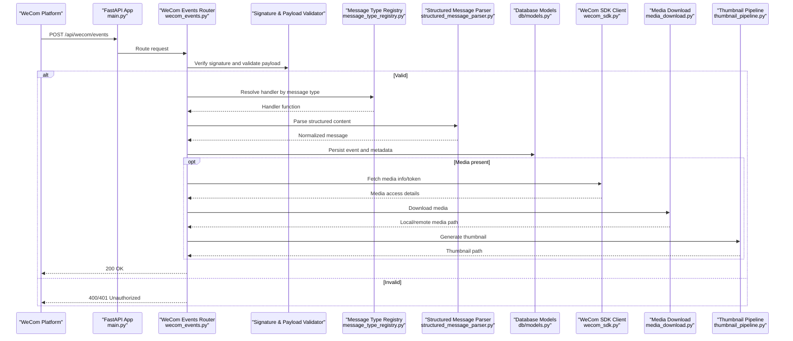
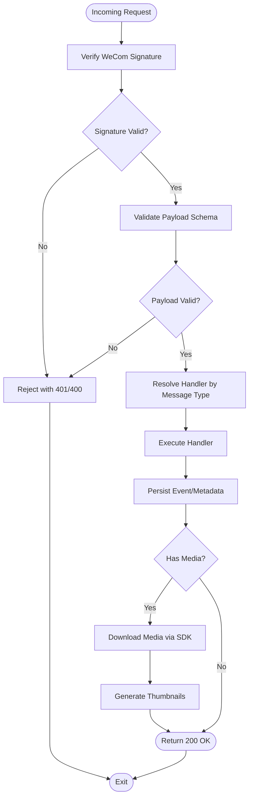
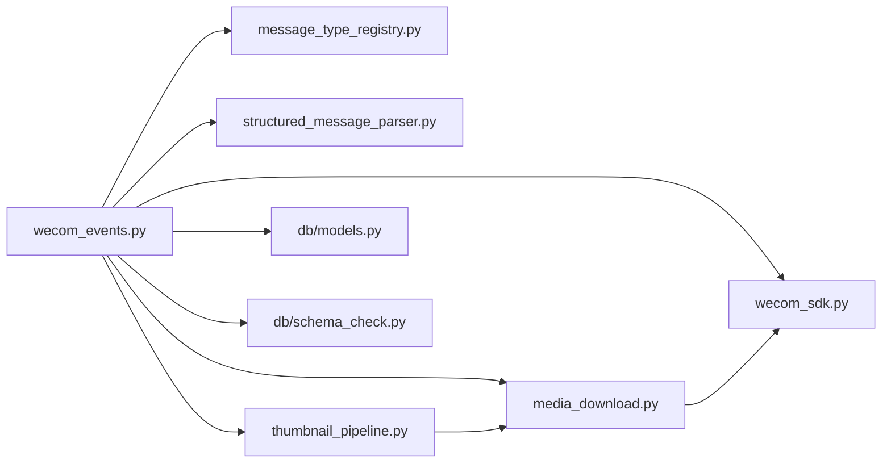

# Webhook Event Ingestion

<cite>
**Referenced Files in This Document**
- [main.py](file://backend/app/main.py)
- [wecom_events.py](file://backend/app/routers/wecom_events.py)
- [wecom_sdk.py](file://backend/app/sdk/wecom_sdk.py)
- [models.py](file://backend/app/db/models.py)
- [schema_check.py](file://backend/app/db/schema_check.py)
- [message_type_registry.py](file://backend/app/message_type_registry.py)
- [structured_message_parser.py](file://backend/app/structured_message_parser.py)
- [media_download.py](file://backend/app/media_download.py)
- [thumbnail_pipeline.py](file://backend/app/thumbnail_pipeline.py)
- [auth.py](file://backend/app/auth.py)
- [requirements.txt](file://backend/requirements.txt)
</cite>

## Table of Contents
1. [Introduction](#introduction)
2. [Project Structure](#project-structure)
3. [Core Components](#core-components)
4. [Architecture Overview](#architecture-overview)
5. [Detailed Component Analysis](#detailed-component-analysis)
6. [Dependency Analysis](#dependency-analysis)
7. [Performance Considerations](#performance-considerations)
8. [Troubleshooting Guide](#troubleshooting-guide)
9. [Conclusion](#conclusion)
10. [Appendices](#appendices)

## Introduction
This document explains the WeCom webhook event ingestion system implemented in the backend application. It covers how incoming webhook requests are received, validated, authenticated, and routed to appropriate handlers. It also documents signature verification, payload validation, error handling, security considerations, rate limiting strategies, monitoring approaches, configuration examples, common errors, and troubleshooting steps for delivery issues.

## Project Structure
The webhook ingestion is primarily implemented under the backend application module:
- HTTP router for WeCom events
- SDK integration with WeCom APIs
- Database models and schema checks
- Message type registry and structured message parsing
- Media download and thumbnail pipeline
- Authentication utilities

**Diagram sources**
- [main.py](file://backend/app/main.py)
- [wecom_events.py](file://backend/app/routers/wecom_events.py)
- [wecom_sdk.py](file://backend/app/sdk/wecom_sdk.py)
- [models.py](file://backend/app/db/models.py)
- [schema_check.py](file://backend/app/db/schema_check.py)
- [message_type_registry.py](file://backend/app/message_type_registry.py)
- [structured_message_parser.py](file://backend/app/structured_message_parser.py)
- [media_download.py](file://backend/app/media_download.py)
- [thumbnail_pipeline.py](file://backend/app/thumbnail_pipeline.py)

**Section sources**
- [main.py](file://backend/app/main.py)
- [wecom_events.py](file://backend/app/routers/wecom_events.py)
- [wecom_sdk.py](file://backend/app/sdk/wecom_sdk.py)
- [models.py](file://backend/app/db/models.py)
- [schema_check.py](file://backend/app/db/schema_check.py)
- [message_type_registry.py](file://backend/app/message_type_registry.py)
- [structured_message_parser.py](file://backend/app/structured_message_parser.py)
- [media_download.py](file://backend/app/media_download.py)
- [thumbnail_pipeline.py](file://backend/app/thumbnail_pipeline.py)

## Core Components
- WeCom Events Router: Defines endpoints that receive WeCom webhook payloads, validates signatures, parses messages, and routes them to specialized handlers based on message type.
- WeCom SDK Client: Encapsulates interactions with WeCom APIs (e.g., token management, media retrieval).
- Message Type Registry: Maps message types to handler functions or processing pipelines.
- Structured Message Parser: Parses complex message structures into normalized forms for downstream processing.
- Media Download and Thumbnail Pipeline: Handles downloading WeCom media assets and generating thumbnails asynchronously.
- Database Models and Schema Checks: Persist events and metadata; ensure schema consistency.

Key responsibilities:
- Signature verification against WeCom-provided secrets
- Payload validation and normalization
- Routing by message type
- Error handling and idempotency
- Integration with storage backends via SDK

**Section sources**
- [wecom_events.py](file://backend/app/routers/wecom_events.py)
- [wecom_sdk.py](file://backend/app/sdk/wecom_sdk.py)
- [message_type_registry.py](file://backend/app/message_type_registry.py)
- [structured_message_parser.py](file://backend/app/structured_message_parser.py)
- [media_download.py](file://backend/app/media_download.py)
- [thumbnail_pipeline.py](file://backend/app/thumbnail_pipeline.py)
- [models.py](file://backend/app/db/models.py)
- [schema_check.py](file://backend/app/db/schema_check.py)

## Architecture Overview
The ingestion flow starts at the FastAPI application which mounts the WeCom events router. Incoming requests are authenticated and validated before being dispatched to specific handlers. Processing may involve database persistence, media downloads, and thumbnail generation.

**Diagram sources**
- [main.py](file://backend/app/main.py)
- [wecom_events.py](file://backend/app/routers/wecom_events.py)
- [message_type_registry.py](file://backend/app/message_type_registry.py)
- [structured_message_parser.py](file://backend/app/structured_message_parser.py)
- [wecom_sdk.py](file://backend/app/sdk/wecom_sdk.py)
- [media_download.py](file://backend/app/media_download.py)
- [thumbnail_pipeline.py](file://backend/app/thumbnail_pipeline.py)
- [models.py](file://backend/app/db/models.py)

## Detailed Component Analysis

### WeCom Events Router
Responsibilities:
- Define webhook endpoints
- Validate request headers and body
- Verify WeCom signature using configured secrets
- Dispatch to message-type-specific handlers
- Handle errors and return appropriate status codes

Security:
- Enforce signature verification before any processing
- Reject malformed or tampered payloads
- Rate-limiting middleware can be applied at the router level

Error Handling:
- Return clear error responses for invalid signatures
- Log failures with contextual information
- Ensure idempotent processing where applicable

**Diagram sources**
- [wecom_events.py](file://backend/app/routers/wecom_events.py)
- [wecom_sdk.py](file://backend/app/sdk/wecom_sdk.py)
- [media_download.py](file://backend/app/media_download.py)
- [thumbnail_pipeline.py](file://backend/app/thumbnail_pipeline.py)
- [models.py](file://backend/app/db/models.py)

**Section sources**
- [wecom_events.py](file://backend/app/routers/wecom_events.py)

### WeCom SDK Client
Responsibilities:
- Manage authentication tokens with WeCom
- Retrieve media URLs and temporary access tokens
- Provide consistent API calls for media operations

Integration Points:
- Used by media download pipeline to fetch WeCom-hosted media
- Supports retry and timeout configurations

**Section sources**
- [wecom_sdk.py](file://backend/app/sdk/wecom_sdk.py)

### Message Type Registry
Responsibilities:
- Maintain mapping from message types to handler functions
- Support dynamic registration of new message types
- Enable modular extension without modifying core routing logic

Design Patterns:
- Registry pattern for decoupling handler discovery
- Centralized configuration for message-to-handler mappings

**Section sources**
- [message_type_registry.py](file://backend/app/message_type_registry.py)

### Structured Message Parser
Responsibilities:
- Parse complex WeCom message structures into normalized forms
- Extract key fields such as sender, timestamp, content parts
- Handle edge cases like nested cards and rich media

Output:
- Consistent data model for downstream consumers
- Validation and sanitization of parsed content

**Section sources**
- [structured_message_parser.py](file://backend/app/structured_message_parser.py)

### Media Download and Thumbnail Pipeline
Responsibilities:
- Download media files referenced in messages using WeCom SDK
- Store media in configured backends (local or cloud)
- Generate thumbnails for images and videos
- Track media metadata and associations with messages

Idempotency:
- Avoid duplicate downloads by checking existing media records
- Use checksums or unique identifiers for deduplication

**Section sources**
- [media_download.py](file://backend/app/media_download.py)
- [thumbnail_pipeline.py](file://backend/app/thumbnail_pipeline.py)

### Database Models and Schema Checks
Responsibilities:
- Define persistent entities for messages, media, and metadata
- Ensure schema integrity through Alembic migrations
- Provide query interfaces for retrieval and auditing

Validation:
- Schema checks verify database state matches expected migrations
- Prevent inconsistencies during deployments

**Section sources**
- [models.py](file://backend/app/db/models.py)
- [schema_check.py](file://backend/app/db/schema_check.py)

## Dependency Analysis
The ingestion system has clear layering and dependencies:
- Router depends on SDK, Registry, Parser, Media, and DB layers
- Media and Thumbnail modules depend on SDK and storage backends
- Registry enables extensibility without tight coupling

**Diagram sources**
- [wecom_events.py](file://backend/app/routers/wecom_events.py)
- [wecom_sdk.py](file://backend/app/sdk/wecom_sdk.py)
- [message_type_registry.py](file://backend/app/message_type_registry.py)
- [structured_message_parser.py](file://backend/app/structured_message_parser.py)
- [media_download.py](file://backend/app/media_download.py)
- [thumbnail_pipeline.py](file://backend/app/thumbnail_pipeline.py)
- [models.py](file://backend/app/db/models.py)
- [schema_check.py](file://backend/app/db/schema_check.py)

**Section sources**
- [wecom_events.py](file://backend/app/routers/wecom_events.py)
- [wecom_sdk.py](file://backend/app/sdk/wecom_sdk.py)
- [message_type_registry.py](file://backend/app/message_type_registry.py)
- [structured_message_parser.py](file://backend/app/structured_message_parser.py)
- [media_download.py](file://backend/app/media_download.py)
- [thumbnail_pipeline.py](file://backend/app/thumbnail_pipeline.py)
- [models.py](file://backend/app/db/models.py)
- [schema_check.py](file://backend/app/db/schema_check.py)

## Performance Considerations
- Asynchronous Processing: Offload media downloads and thumbnail generation to background workers to avoid blocking request threads.
- Caching: Cache WeCom tokens and frequently accessed metadata to reduce API calls.
- Connection Pooling: Configure database and HTTP client connection pools for efficient resource usage.
- Backpressure: Implement queue-based ingestion to handle spikes in webhook volume.
- Monitoring: Track latency, error rates, and throughput metrics for proactive scaling.

[No sources needed since this section provides general guidance]

## Troubleshooting Guide
Common Issues:
- Signature Verification Failures:
  - Ensure correct secret configuration
  - Verify request headers include required signature fields
  - Check clock skew between systems

- Payload Validation Errors:
  - Confirm message structure matches expected schema
  - Inspect parser logs for malformed content
  - Validate field types and required attributes

- Media Download Failures:
  - Check WeCom token validity and expiration
  - Verify network connectivity and firewall rules
  - Review storage backend permissions and quotas

- Delivery Delays:
  - Monitor worker queues and job processing times
  - Scale workers horizontally if backlog grows
  - Investigate slow database queries or locks

Monitoring Approaches:
- Log all webhook events with correlation IDs
- Emit metrics for success/failure rates and processing latency
- Set up alerts for error thresholds and queue backlogs

Configuration Examples:
- WeCom Webhook URL: Point WeCom platform to your endpoint (e.g., https://your-domain/api/wecom/events)
- Secrets Management: Store WeCom app secrets in environment variables or secure vaults
- Rate Limiting: Configure per-IP or per-tenant limits at the reverse proxy or application layer

Error Scenarios:
- 401 Unauthorized: Invalid or missing signature
- 400 Bad Request: Malformed payload or missing fields
- 500 Internal Server Error: Unexpected exceptions in handlers
- 503 Service Unavailable: Downstream services (DB, storage) unavailable

**Section sources**
- [wecom_events.py](file://backend/app/routers/wecom_events.py)
- [wecom_sdk.py](file://backend/app/sdk/wecom_sdk.py)
- [media_download.py](file://backend/app/media_download.py)
- [thumbnail_pipeline.py](file://backend/app/thumbnail_pipeline.py)
- [models.py](file://backend/app/db/models.py)
- [schema_check.py](file://backend/app/db/schema_check.py)

## Conclusion
The WeCom webhook ingestion system provides a robust, extensible framework for receiving, validating, and processing messages from WeCom. By leveraging modular components such as the message type registry, structured message parser, and media pipeline, it supports diverse message types and scalable processing. Security is enforced through signature verification and payload validation, while performance is optimized via asynchronous workflows and caching. Comprehensive monitoring and troubleshooting guidance ensure reliable operation in production environments.

[No sources needed since this section summarizes without analyzing specific files]

## Appendices

### Security Considerations
- Always verify WeCom signatures before processing payloads
- Use HTTPS for all webhook endpoints
- Restrict access via IP whitelisting at the network layer
- Rotate secrets regularly and store securely
- Implement rate limiting to prevent abuse

### Rate Limiting Strategies
- Application-level: Use middleware to limit requests per IP or tenant
- Reverse Proxy: Configure Nginx or similar to throttle incoming traffic
- Queue-Based: Buffer events in a message broker to smooth bursts

### Monitoring Approaches
- Metrics: Track webhook volume, processing time, error rates
- Logs: Capture detailed context for each webhook event
- Alerts: Notify on anomalies such as sudden error spikes or queue growth

### Webhook Configuration Example
- Endpoint: https://your-domain/api/wecom/events
- Secret: Configure in environment variables
- Retry Policy: Enable retries on failure in WeCom console
- Timeout: Set appropriate timeouts for long-running operations

**Section sources**
- [wecom_events.py](file://backend/app/routers/wecom_events.py)
- [wecom_sdk.py](file://backend/app/sdk/wecom_sdk.py)
- [requirements.txt](file://backend/requirements.txt)