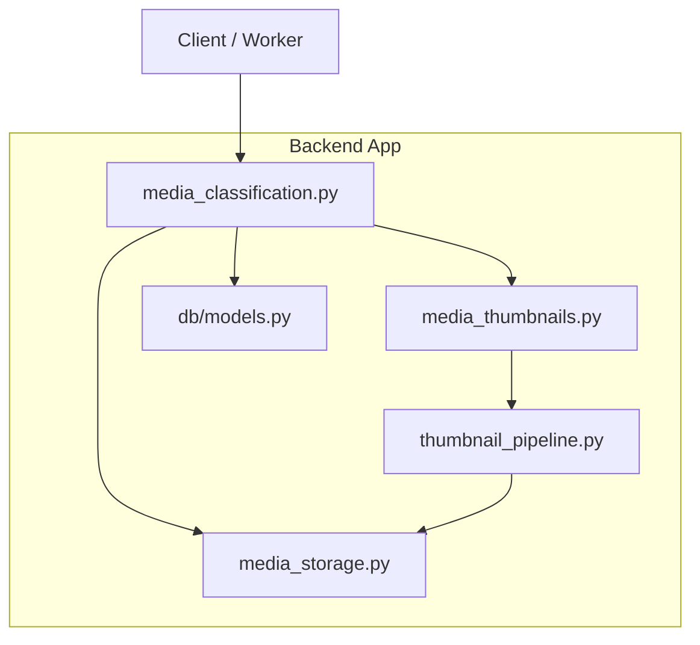
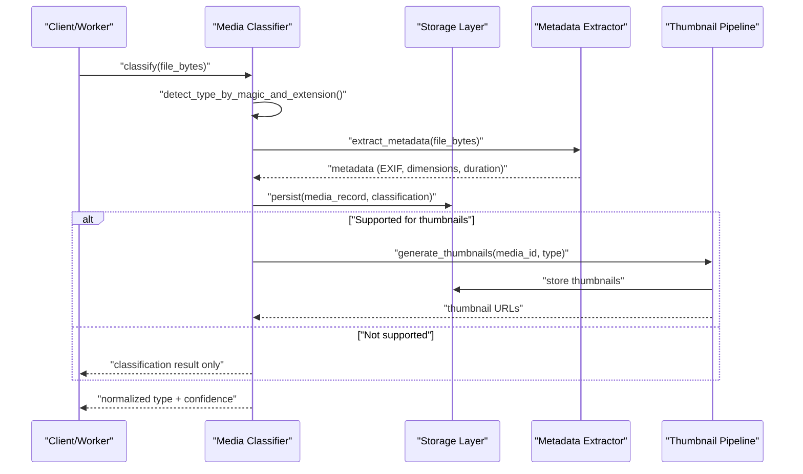
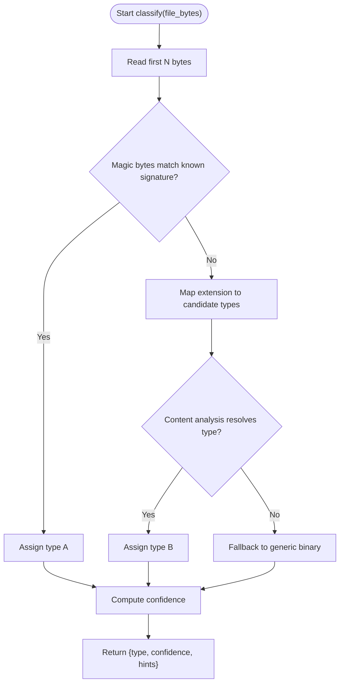
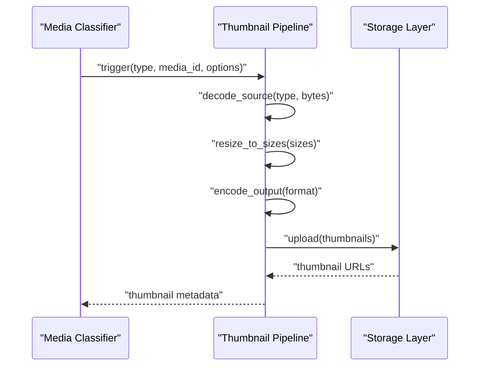
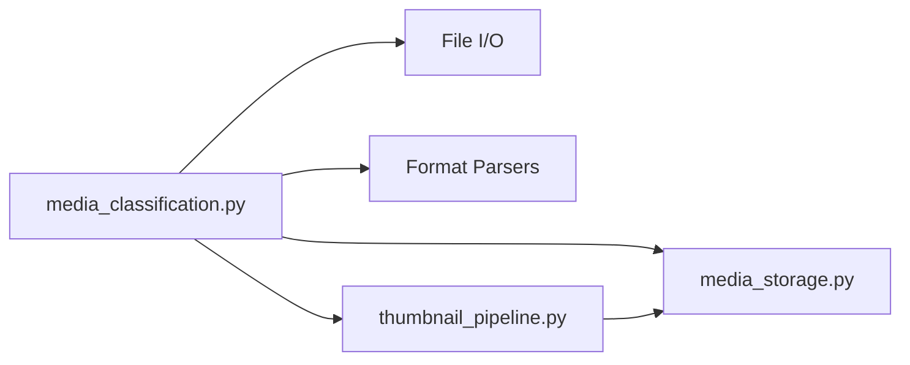

# Media Classification System

<cite>
**Referenced Files in This Document**
- [media_classification.py](file://backend/app/media_classification.py)
- [media_storage.py](file://backend/app/media_storage.py)
- [media_thumbnails.py](file://backend/app/media_thumbnails.py)
- [thumbnail_pipeline.py](file://backend/app/thumbnail_pipeline.py)
- [models.py](file://backend/app/db/models.py)
- [test_media_classification.py](file://backend/tests/test_media_classification.py)
- [test_media_thumbnails.py](file://backend/tests/test_media_thumbnails.py)
- [test_thumbnail_pipeline.py](file://backend/tests/test_thumbnail_pipeline.py)
</cite>

## Table of Contents
1. [Introduction](#introduction)
2. [Project Structure](#project-structure)
3. [Core Components](#core-components)
4. [Architecture Overview](#architecture-overview)
5. [Detailed Component Analysis](#detailed-component-analysis)
6. [Dependency Analysis](#dependency-analysis)
7. [Performance Considerations](#performance-considerations)
8. [Troubleshooting Guide](#troubleshooting-guide)
9. [Conclusion](#conclusion)

## Introduction
This document explains the media classification system used to automatically detect and classify uploaded media files, extract metadata (including EXIF), and integrate with storage and thumbnail generation. It covers detection algorithms, format recognition, content analysis techniques, classification rules and priority ordering, fallback mechanisms for ambiguous cases, metadata extraction workflows, custom rule configuration, performance optimizations, caching strategies, batch processing capabilities, and how classification impacts media serving and thumbnail generation.

## Project Structure
The media classification system is implemented as a set of Python modules within the backend application:
- Classification logic and rules live in a dedicated module.
- Storage integration abstracts local and remote backends.
- Thumbnail pipeline orchestrates image/video thumbnail creation based on classification results.
- Database models store media records and their classification metadata.
- Tests validate classification behavior, thumbnail generation, and pipeline orchestration.

**Diagram sources**
- [media_classification.py](file://backend/app/media_classification.py)
- [media_storage.py](file://backend/app/media_storage.py)
- [media_thumbnails.py](file://backend/app/media_thumbnails.py)
- [thumbnail_pipeline.py](file://backend/app/thumbnail_pipeline.py)
- [models.py](file://backend/app/db/models.py)

**Section sources**
- [media_classification.py](file://backend/app/media_classification.py)
- [media_storage.py](file://backend/app/media_storage.py)
- [media_thumbnails.py](file://backend/app/media_thumbnails.py)
- [thumbnail_pipeline.py](file://backend/app/thumbnail_pipeline.py)
- [models.py](file://backend/app/db/models.py)

## Core Components
- Media Classifier: Detects file type using magic bytes, extension heuristics, and optional content analysis; applies classification rules and priority ordering; returns a normalized media type and confidence score.
- Metadata Extractor: Reads EXIF/IPTC/XMP where applicable, extracts dimensions, duration, orientation, color space, and other relevant attributes; handles malformed or missing metadata gracefully.
- Storage Integration: Persists media records, updates classification metadata, and provides accessors for serving URLs and signed links.
- Thumbnail Pipeline: Consumes classification results to generate thumbnails for images and videos; supports multiple sizes and formats; integrates with storage backends.

Key responsibilities:
- Automatic media type detection and normalization.
- Robust fallback mechanisms for ambiguous or unsupported formats.
- Efficient metadata extraction with error isolation.
- Consistent data model updates for downstream consumers.

**Section sources**
- [media_classification.py](file://backend/app/media_classification.py)
- [media_storage.py](file://backend/app/media_storage.py)
- [media_thumbnails.py](file://backend/app/media_thumbnails.py)
- [thumbnail_pipeline.py](file://backend/app/thumbnail_pipeline.py)
- [models.py](file://backend/app/db/models.py)

## Architecture Overview
The classification workflow begins when media is ingested. The classifier inspects the file header and extension, runs content analysis if needed, and assigns a normalized media type. Metadata is extracted and stored alongside the media record. Based on the classification, the thumbnail pipeline generates previews for supported types. All operations are integrated with the storage layer, which may be local filesystem or a cloud provider.

**Diagram sources**
- [media_classification.py](file://backend/app/media_classification.py)
- [media_storage.py](file://backend/app/media_storage.py)
- [media_thumbnails.py](file://backend/app/media_thumbnails.py)
- [thumbnail_pipeline.py](file://backend/app/thumbnail_pipeline.py)

## Detailed Component Analysis

### Media Classifier
Responsibilities:
- Detect media type via magic bytes, extension mapping, and optional content analysis.
- Apply classification rules with explicit priority ordering.
- Provide fallback mechanisms for ambiguous or partially recognized files.
- Return normalized type, subtype hints, and confidence scores.

Classification rules and priority:
- Magic byte signatures take highest priority for reliable detection.
- Extension-based heuristics refine type when magic bytes are inconclusive.
- Content analysis (e.g., parsing headers or minimal decoding) resolves ambiguities.
- Fallback defaults to generic binary when no confident match exists.

Ambiguity handling:
- If multiple candidates exist, choose by confidence score and rule precedence.
- For partial matches, return best-effort type with reduced confidence and warnings.

Custom classification rules:
- Extensible registry allows adding new detectors or overriding defaults.
- Rule weights can be tuned per tenant or environment.

**Diagram sources**
- [media_classification.py](file://backend/app/media_classification.py)

**Section sources**
- [media_classification.py](file://backend/app/media_classification.py)
- [test_media_classification.py](file://backend/tests/test_media_classification.py)

### Metadata Extraction and EXIF Handling
Responsibilities:
- Extract EXIF/IPTC/XMP tags from images and certain video containers.
- Normalize common fields (width, height, duration, orientation, color profile).
- Handle corrupted or incomplete metadata without failing classification.

Extraction process:
- Attempt library-specific readers (e.g., EXIF for JPEG/PNG, container parsers for MP4/MOV).
- Merge available tags into a unified metadata object.
- Validate ranges and coerce types; discard invalid values.

Error isolation:
- Metadata failures do not block classification; they produce partial metadata with warnings.
- Unknown or unsupported formats yield minimal metadata.

**Section sources**
- [media_classification.py](file://backend/app/media_classification.py)
- [media_storage.py](file://backend/app/media_storage.py)

### Storage Integration
Responsibilities:
- Persist media records with classification metadata.
- Provide accessors for serving URLs and signed links.
- Support multiple backends (local filesystem, cloud providers).

Integration points:
- On successful classification, update media record fields (type, subtype, confidence, metadata hash).
- Generate or retrieve storage keys and URLs for client access.
- Ensure tenant scoping and access control at the storage layer.

**Section sources**
- [media_storage.py](file://backend/app/media_storage.py)
- [models.py](file://backend/app/db/models.py)

### Thumbnail Pipeline
Responsibilities:
- Generate thumbnails for images and video frames based on classification results.
- Support multiple output sizes and formats.
- Integrate with storage backends for efficient upload and retrieval.

Pipeline steps:
- Decode source media according to type.
- Resize/crop to target dimensions while preserving aspect ratio.
- Encode to desired format (e.g., WebP, JPEG).
- Store thumbnails and associate them with the media record.

**Diagram sources**
- [media_thumbnails.py](file://backend/app/media_thumbnails.py)
- [thumbnail_pipeline.py](file://backend/app/thumbnail_pipeline.py)
- [media_storage.py](file://backend/app/media_storage.py)

**Section sources**
- [media_thumbnails.py](file://backend/app/media_thumbnails.py)
- [thumbnail_pipeline.py](file://backend/app/thumbnail_pipeline.py)
- [test_media_thumbnails.py](file://backend/tests/test_media_thumbnails.py)
- [test_thumbnail_pipeline.py](file://backend/tests/test_thumbnail_pipeline.py)

## Dependency Analysis
The classifier depends on:
- File I/O utilities for reading headers and streams.
- Format-specific libraries for magic bytes and metadata parsing.
- Storage abstraction for persistence and URL generation.
- Thumbnail pipeline for preview generation.

**Diagram sources**
- [media_classification.py](file://backend/app/media_classification.py)
- [media_storage.py](file://backend/app/media_storage.py)
- [thumbnail_pipeline.py](file://backend/app/thumbnail_pipeline.py)

**Section sources**
- [media_classification.py](file://backend/app/media_classification.py)
- [media_storage.py](file://backend/app/media_storage.py)
- [thumbnail_pipeline.py](file://backend/app/thumbnail_pipeline.py)

## Performance Considerations
Optimization strategies:
- Lazy metadata extraction: Only parse EXIF when needed or requested.
- Caching: Cache classification results and metadata by content hash to avoid reprocessing identical files.
- Batch processing: Process multiple files concurrently with bounded worker pools to balance throughput and resource usage.
- Streamed reads: Avoid loading entire files into memory when possible; read only necessary headers.
- Thumbnail optimization: Use efficient codecs and pre-sized templates; cache generated thumbnails.

Caching mechanisms:
- In-memory LRU cache for recent classifications and metadata.
- Disk-backed cache keyed by content hash for cross-process reuse.
- Conditional regeneration when source changes or configuration updates.

Batch processing:
- Queue-based ingestion with retry and backoff.
- Idempotent operations to handle duplicate uploads safely.
- Progress tracking and failure isolation per item.

[No sources needed since this section provides general guidance]

## Troubleshooting Guide
Common issues and resolutions:
- Ambiguous classification: Increase reliance on magic bytes; add custom rules for edge-case formats.
- Missing EXIF data: Verify source format support; ensure metadata reader libraries are installed.
- Thumbnail generation failures: Check codec availability; validate input dimensions and supported formats.
- Storage errors: Confirm backend credentials and permissions; verify tenant scoping and path resolution.

Debugging tips:
- Enable detailed logs for classification steps and metadata parsing.
- Inspect confidence scores and warnings to identify weak detections.
- Use test fixtures to reproduce problematic files locally.

**Section sources**
- [test_media_classification.py](file://backend/tests/test_media_classification.py)
- [test_media_thumbnails.py](file://backend/tests/test_media_thumbnails.py)
- [test_thumbnail_pipeline.py](file://backend/tests/test_thumbnail_pipeline.py)

## Conclusion
The media classification system provides robust automatic detection, flexible rule-based classification, and resilient metadata extraction. It integrates seamlessly with storage and thumbnail pipelines, supporting scalable batch processing and caching for high performance. Customization points allow adaptation to specific formats and tenant requirements, while clear fallback mechanisms ensure reliability across diverse media inputs.