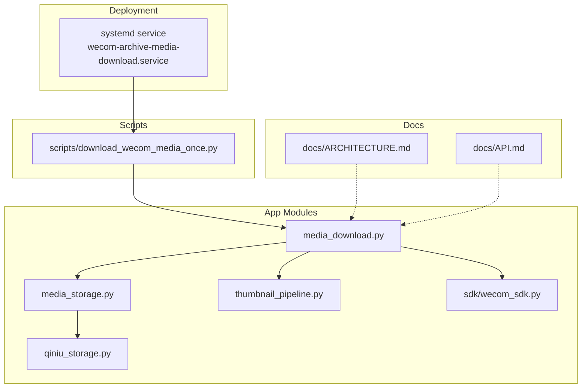
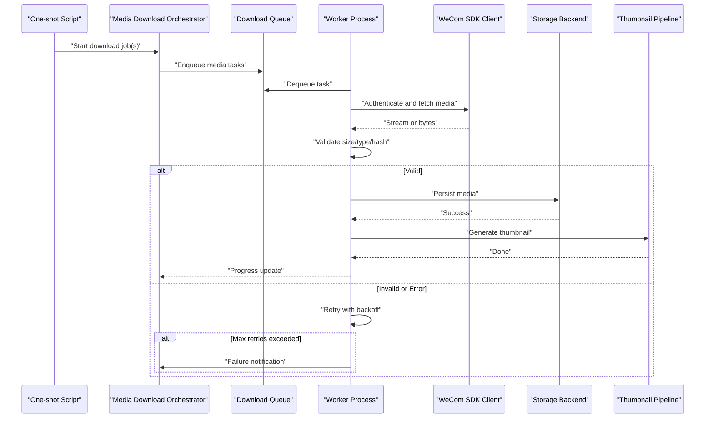
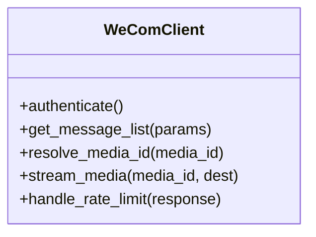
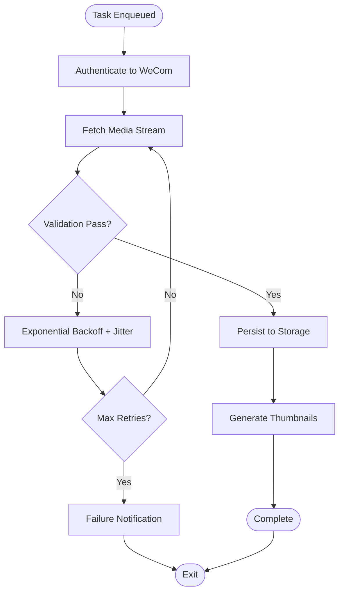
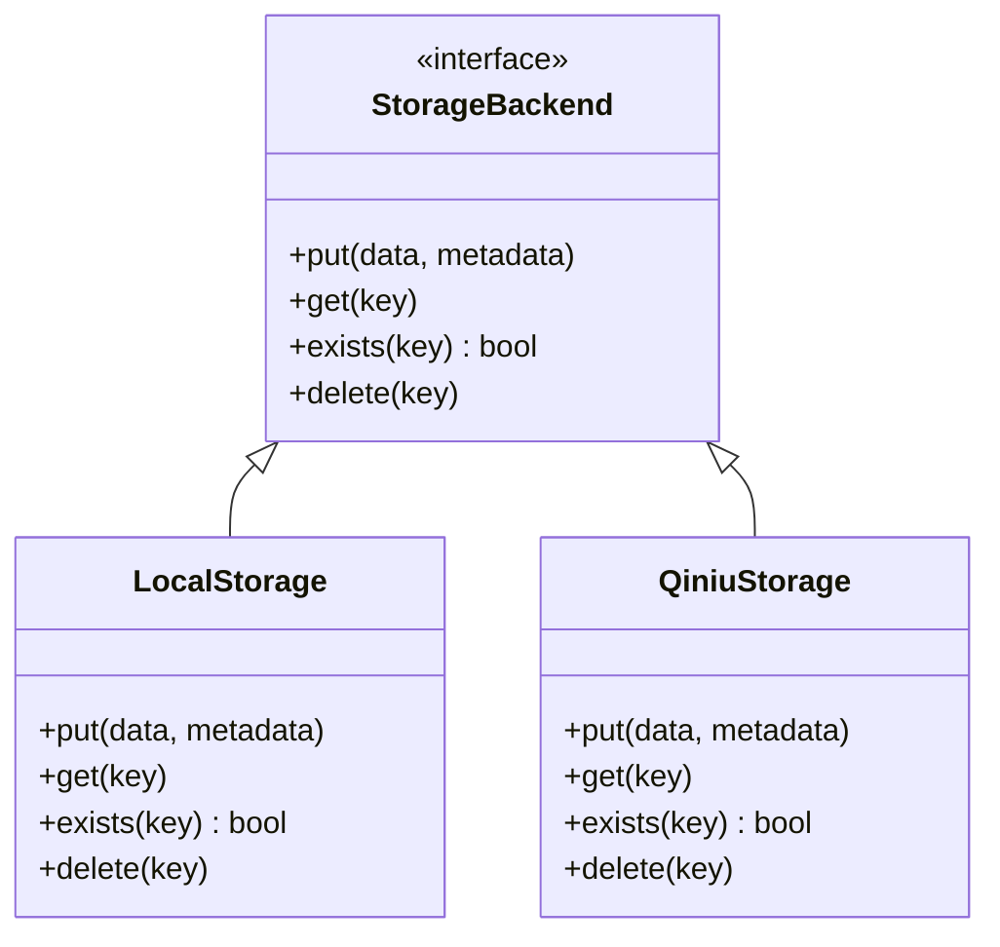
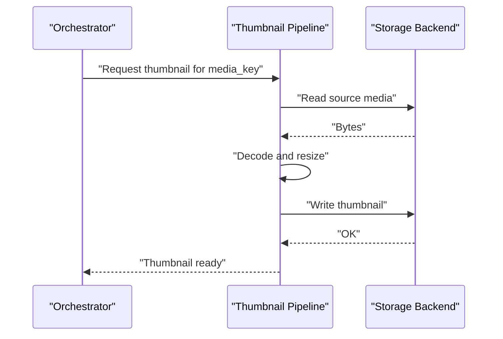
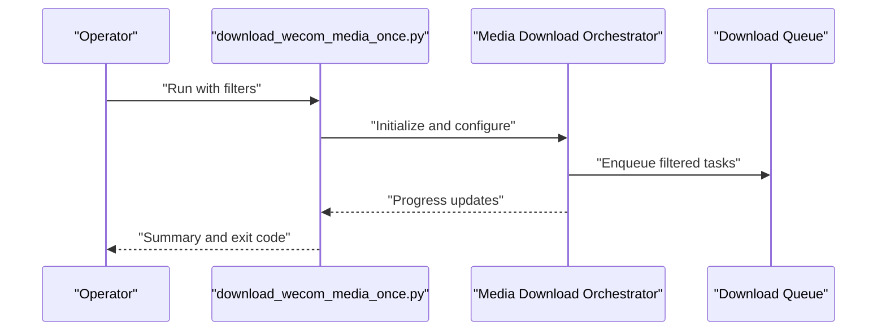
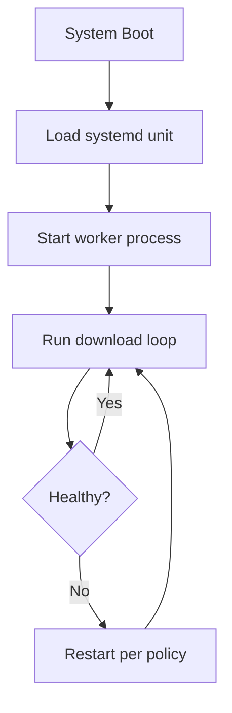
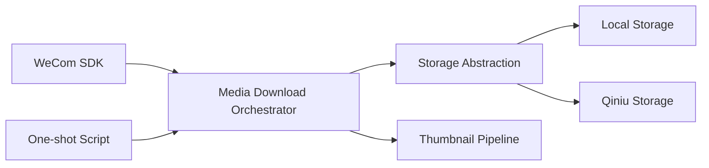

# Media Download Pipeline

<cite>
**Referenced Files in This Document**
- [media_download.py](file://backend/app/media_download.py)
- [media_storage.py](file://backend/app/media_storage.py)
- [qiniu_storage.py](file://backend/app/qiniu_storage.py)
- [thumbnail_pipeline.py](file://backend/app/thumbnail_pipeline.py)
- [wecom_sdk.py](file://backend/app/sdk/wecom_sdk.py)
- [download_wecom_media_once.py](file://backend/scripts/download_wecom_media_once.py)
- [wecom-archive-media-download.service](file://deploy/systemd/wecom-archive-media-download.service)
- [ARCHITECTURE.md](file://docs/ARCHITECTURE.md)
- [API.md](file://docs/API.md)
- [test_media_download.py](file://backend/tests/test_media_download.py)
- [test_qiniu_worker_integration.py](file://backend/tests/test_qiniu_worker_integration.py)
</cite>

## Table of Contents
1. [Introduction](#introduction)
2. [Project Structure](#project-structure)
3. [Core Components](#core-components)
4. [Architecture Overview](#architecture-overview)
5. [Detailed Component Analysis](#detailed-component-analysis)
6. [Dependency Analysis](#dependency-analysis)
7. [Performance Considerations](#performance-considerations)
8. [Troubleshooting Guide](#troubleshooting-guide)
9. [Conclusion](#conclusion)

## Introduction
This document explains the media download pipeline for WeCom (Enterprise WeChat) content, focusing on how media is retrieved from WeCom, queued and processed concurrently, validated for integrity, stored across backends, and monitored with progress tracking and retry/backoff strategies. It covers authentication to WeCom, rate limiting, error recovery, storage integration, and end-to-end data flow from initial download to final placement.

## Project Structure
The media download pipeline spans application modules, scripts, and deployment units:
- Application modules implement the download orchestration, storage abstraction, and thumbnail generation.
- A dedicated script drives one-shot downloads for historical or manual runs.
- Systemd units schedule and manage long-running workers.
- Documentation provides architectural context and API contracts.

**Diagram sources**
- [media_download.py](file://backend/app/media_download.py)
- [media_storage.py](file://backend/app/media_storage.py)
- [qiniu_storage.py](file://backend/app/qiniu_storage.py)
- [thumbnail_pipeline.py](file://backend/app/thumbnail_pipeline.py)
- [wecom_sdk.py](file://backend/app/sdk/wecom_sdk.py)
- [download_wecom_media_once.py](file://backend/scripts/download_wecom_media_once.py)
- [wecom-archive-media-download.service](file://deploy/systemd/wecom-archive-media-download.service)
- [ARCHITECTURE.md](file://docs/ARCHITECTURE.md)
- [API.md](file://docs/API.md)

**Section sources**
- [ARCHITECTURE.md](file://docs/ARCHITECTURE.md)
- [API.md](file://docs/API.md)

## Core Components
- WeCom SDK client: encapsulates authentication, token management, and API calls to retrieve media metadata and streams.
- Media download orchestrator: manages queueing, concurrency, retries, backoff, progress tracking, and validation.
- Storage abstraction: defines a common interface for storing media bytes and metadata; concrete implementations include local filesystem and Qiniu Kodo.
- Thumbnail pipeline: generates thumbnails post-download and integrates with storage backends.
- One-shot downloader script: triggers batch or targeted downloads via the orchestrator.
- Systemd unit: ensures the worker process runs reliably and restarts on failure.

Key responsibilities:
- Authentication and token refresh for WeCom APIs.
- Rate limiting and throttling to respect provider limits.
- Retry with exponential backoff and jitter for transient failures.
- Integrity checks (size/hash/content-type) and corruption handling.
- Progress reporting and observability hooks.
- Pluggable storage backends with consistent semantics.

**Section sources**
- [media_download.py](file://backend/app/media_download.py)
- [media_storage.py](file://backend/app/media_storage.py)
- [qiniu_storage.py](file://backend/app/qiniu_storage.py)
- [thumbnail_pipeline.py](file://backend/app/thumbnail_pipeline.py)
- [wecom_sdk.py](file://backend/app/sdk/wecom_sdk.py)
- [download_wecom_media_once.py](file://backend/scripts/download_wecom_media_once.py)
- [wecom-archive-media-download.service](file://deploy/systemd/wecom-archive-media-download.service)

## Architecture Overview
The pipeline follows a producer-consumer model:
- Producers enqueue media tasks derived from WeCom conversations/messages.
- Consumers pull tasks, authenticate with WeCom, download media, validate, store, and generate thumbnails.
- Observability tracks per-task progress and aggregate metrics.
- Failure paths trigger retries with backoff and notifications upon exhaustion.

**Diagram sources**
- [media_download.py](file://backend/app/media_download.py)
- [wecom_sdk.py](file://backend/app/sdk/wecom_sdk.py)
- [media_storage.py](file://backend/app/media_storage.py)
- [qiniu_storage.py](file://backend/app/qiniu_storage.py)
- [thumbnail_pipeline.py](file://backend/app/thumbnail_pipeline.py)
- [download_wecom_media_once.py](file://backend/scripts/download_wecom_media_once.py)

## Detailed Component Analysis

### WeCom SDK Client
Responsibilities:
- Obtain and cache access tokens using tenant credentials.
- Call WeCom APIs to list messages, resolve media IDs, and stream media content.
- Enforce rate limits and handle HTTP errors with appropriate exceptions.

**Diagram sources**
- [wecom_sdk.py](file://backend/app/sdk/wecom_sdk.py)

**Section sources**
- [wecom_sdk.py](file://backend/app/sdk/wecom_sdk.py)

### Media Download Orchestrator
Responsibilities:
- Build and manage a concurrent download queue.
- Configure retry policies, exponential backoff, and jitter.
- Track per-task progress and aggregate status.
- Validate downloaded content before persisting.
- Integrate with storage backends and thumbnail pipeline.

**Diagram sources**
- [media_download.py](file://backend/app/media_download.py)

**Section sources**
- [media_download.py](file://backend/app/media_download.py)

### Storage Abstraction and Qiniu Backend
Responsibilities:
- Define a unified interface for storing media bytes and associated metadata.
- Implement concrete backends: local filesystem and Qiniu Kodo.
- Provide idempotent put operations and verification helpers.

**Diagram sources**
- [media_storage.py](file://backend/app/media_storage.py)
- [qiniu_storage.py](file://backend/app/qiniu_storage.py)

**Section sources**
- [media_storage.py](file://backend/app/media_storage.py)
- [qiniu_storage.py](file://backend/app/qiniu_storage.py)

### Thumbnail Pipeline
Responsibilities:
- Trigger thumbnail generation after successful media storage.
- Handle different media types and formats.
- Persist thumbnails alongside original media metadata.

**Diagram sources**
- [thumbnail_pipeline.py](file://backend/app/thumbnail_pipeline.py)
- [media_storage.py](file://backend/app/media_storage.py)

**Section sources**
- [thumbnail_pipeline.py](file://backend/app/thumbnail_pipeline.py)

### One-shot Downloader Script
Responsibilities:
- Parse arguments for target tenants, conversations, or message ranges.
- Initialize the orchestrator and run a bounded number of concurrent workers.
- Report progress and exit codes for automation and monitoring.

**Diagram sources**
- [download_wecom_media_once.py](file://backend/scripts/download_wecom_media_once.py)
- [media_download.py](file://backend/app/media_download.py)

**Section sources**
- [download_wecom_media_once.py](file://backend/scripts/download_wecom_media_once.py)

### Systemd Service Integration
Responsibilities:
- Manage lifecycle of the media download worker process.
- Ensure automatic restart on crashes and controlled shutdown.
- Provide environment configuration for backend credentials and concurrency.

**Diagram sources**
- [wecom-archive-media-download.service](file://deploy/systemd/wecom-archive-media-download.service)

**Section sources**
- [wecom-archive-media-download.service](file://deploy/systemd/wecom-archive-media-download.service)

## Dependency Analysis
The pipeline exhibits clear separation of concerns:
- The orchestrator depends on the WeCom SDK for retrieval and on the storage abstraction for persistence.
- The storage abstraction decouples implementation details from the orchestrator.
- The thumbnail pipeline depends on storage and image processing capabilities.
- The one-shot script depends on the orchestrator for execution.

**Diagram sources**
- [media_download.py](file://backend/app/media_download.py)
- [media_storage.py](file://backend/app/media_storage.py)
- [qiniu_storage.py](file://backend/app/qiniu_storage.py)
- [thumbnail_pipeline.py](file://backend/app/thumbnail_pipeline.py)
- [wecom_sdk.py](file://backend/app/sdk/wecom_sdk.py)
- [download_wecom_media_once.py](file://backend/scripts/download_wecom_media_once.py)

**Section sources**
- [media_download.py](file://backend/app/media_download.py)
- [media_storage.py](file://backend/app/media_storage.py)
- [qiniu_storage.py](file://backend/app/qiniu_storage.py)
- [thumbnail_pipeline.py](file://backend/app/thumbnail_pipeline.py)
- [wecom_sdk.py](file://backend/app/sdk/wecom_sdk.py)
- [download_wecom_media_once.py](file://backend/scripts/download_wecom_media_once.py)

## Performance Considerations
- Concurrency tuning: adjust worker count based on CPU, I/O, and WeCom rate limits.
- Streaming downloads: prefer streaming over buffering to reduce memory usage.
- Batched operations: group small writes where supported by storage backends.
- Caching: cache WeCom tokens and frequently accessed metadata to reduce latency.
- Backoff strategy: use exponential backoff with jitter to avoid thundering herds.
- Validation early: perform quick checks (content-type, size bounds) before full processing.

[No sources needed since this section provides general guidance]

## Troubleshooting Guide
Common issues and resolutions:
- Authentication failures: verify tenant credentials and token expiration handling.
- Rate limit errors: increase backoff intervals and reduce concurrency.
- Network timeouts: enable retries with jitter and check upstream connectivity.
- Integrity mismatches: re-download and compare hashes; mark corrupted entries for review.
- Storage write failures: inspect backend permissions, quotas, and network reachability.
- Thumbnail generation errors: validate input formats and resource availability.

Operational tips:
- Use the one-shot script with dry-run flags to validate configurations.
- Monitor system logs for worker health and retry patterns.
- Inspect storage backend dashboards for upload success rates.

**Section sources**
- [test_media_download.py](file://backend/tests/test_media_download.py)
- [test_qiniu_worker_integration.py](file://backend/tests/test_qiniu_worker_integration.py)

## Conclusion
The media download pipeline provides a robust, extensible framework for retrieving WeCom media, enforcing reliability through retries and backoff, ensuring integrity via validation, and supporting multiple storage backends. Its modular design enables easy extension and maintenance while offering strong operational visibility and control.

[No sources needed since this section summarizes without analyzing specific files]