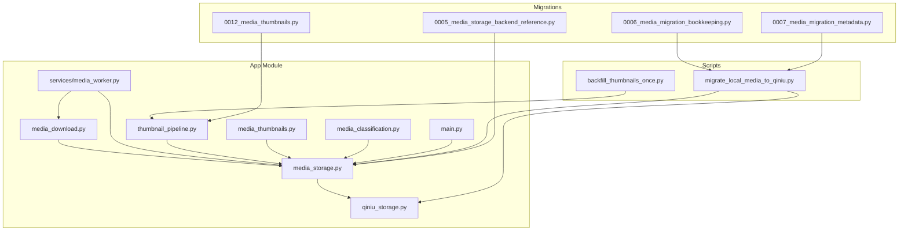
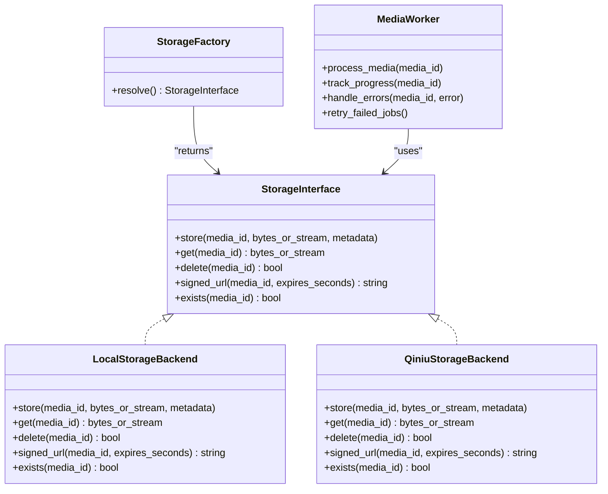
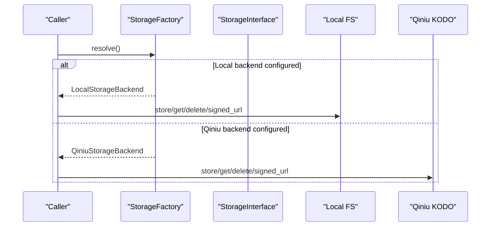
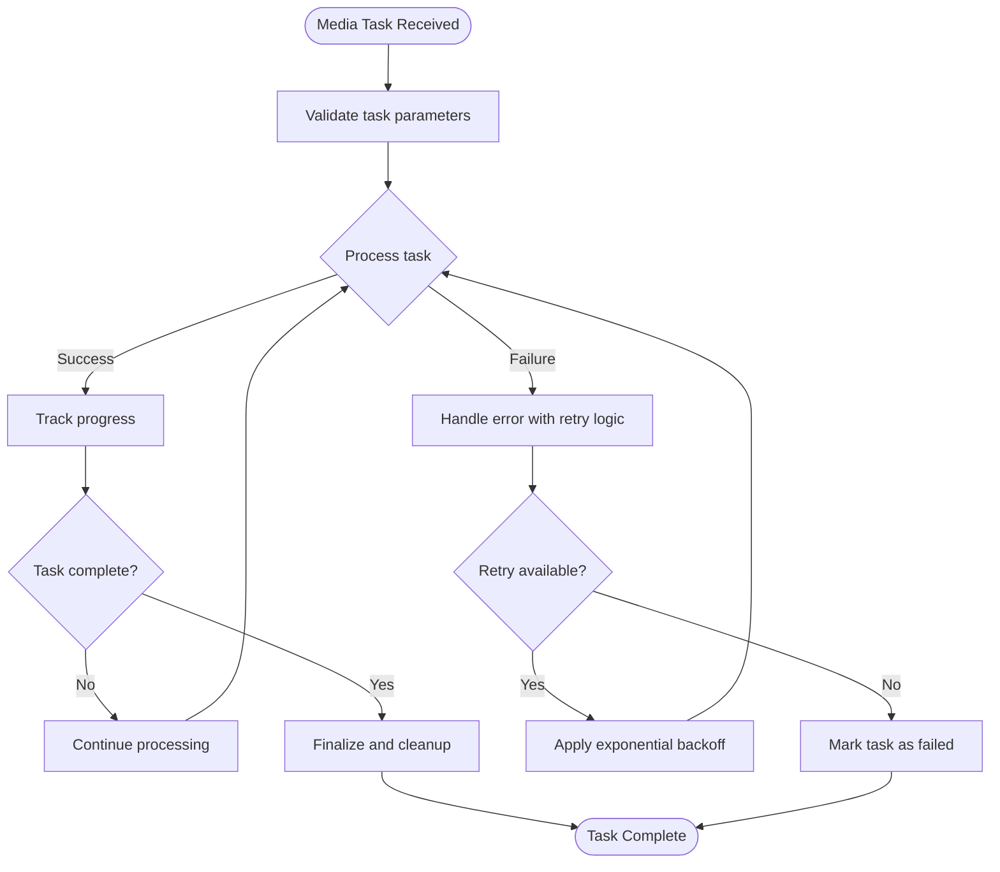
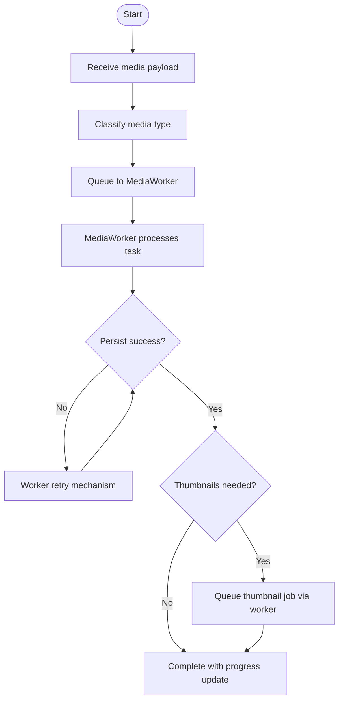
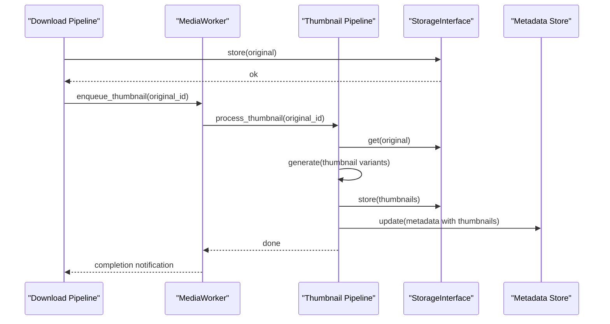
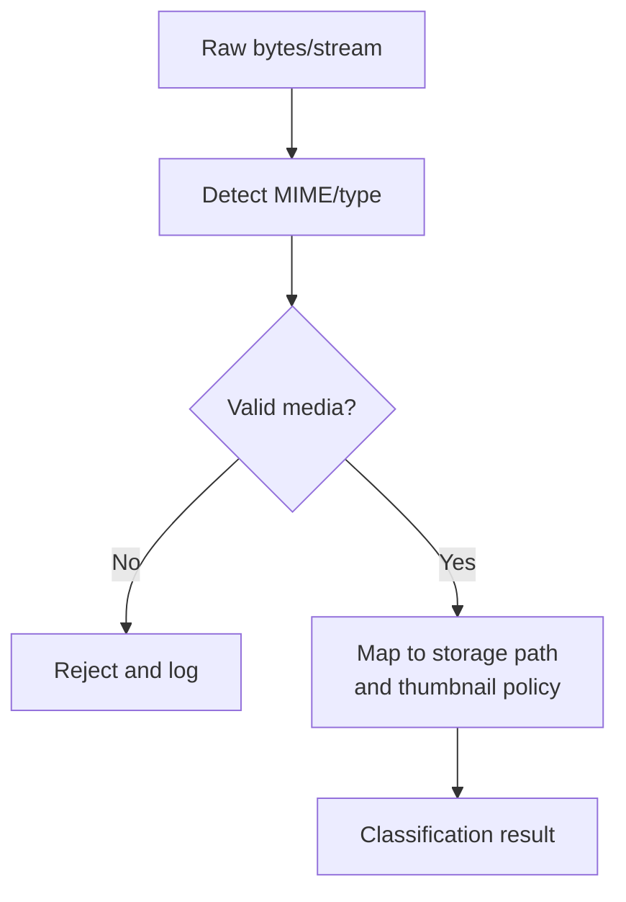
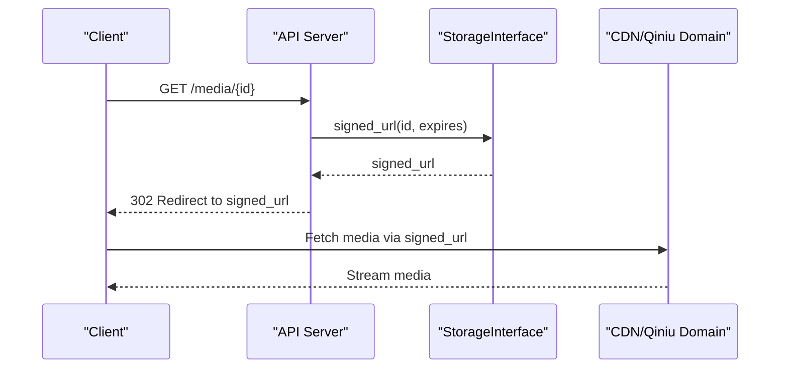
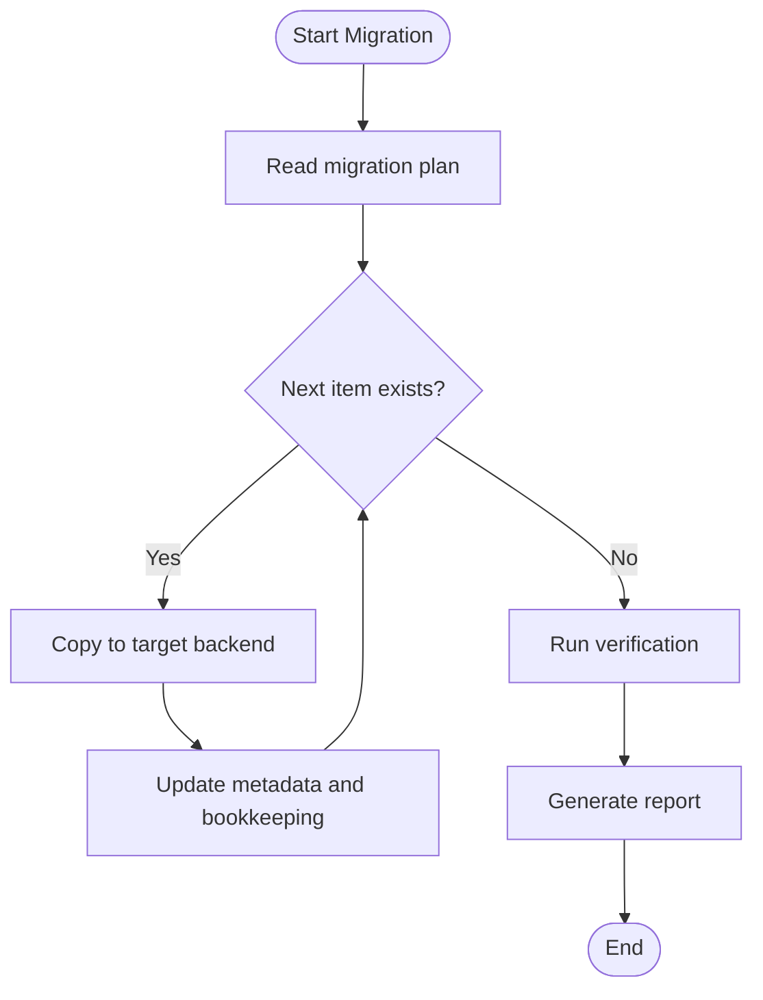
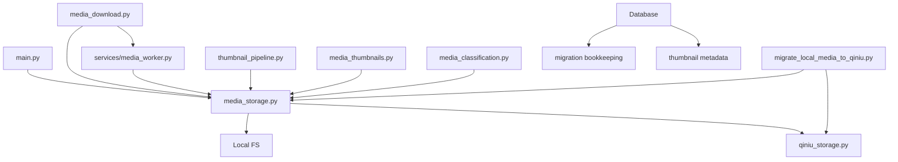

# Storage Abstraction Layer

<cite>
**Referenced Files in This Document**
- [media_storage.py](file://backend/app/media_storage.py)
- [qiniu_storage.py](file://backend/app/qiniu_storage.py)
- [media_download.py](file://backend/app/media_download.py)
- [media_worker.py](file://backend/app/services/media_worker.py)
- [thumbnail_pipeline.py](file://backend/app/thumbnail_pipeline.py)
- [media_thumbnails.py](file://backend/app/media_thumbnails.py)
- [media_classification.py](file://backend/app/media_classification.py)
- [main.py](file://backend/app/main.py)
- [0005_media_storage_backend_reference.py](file://backend/alembic/versions/0005_media_storage_backend_reference.py)
- [0006_media_migration_bookkeeping.py](file://backend/alembic/versions/0006_media_migration_bookkeeping.py)
- [0007_media_migration_metadata.py](file://backend/alembic/versions/0007_media_migration_metadata.py)
- [0012_media_thumbnails.py](file://backend/alembic/versions/0012_media_thumbnails.py)
- [migrate_local_media_to_qiniu.py](file://backend/scripts/migrate_local_media_to_qiniu.py)
- [backfill_thumbnails_once.py](file://backend/scripts/backfill_thumbnails_once.py)
- [ARCHITECTURE.md](file://docs/ARCHITECTURE.md)
- [rnd_185_media_storage_abstraction.md](file://docs/research/rnd_185_media_storage_abstraction.md)
- [rnd_186_local_qiniu_migration.md](file://docs/research/rnd_186_local_qiniu_migration.md)
- [wecom_archive_media_download_runbook.md](file://docs/wecom_archive_media_download_runbook.md)
- [wecom_archive_worker_runbook.md](file://docs/wecom_archive_worker_runbook.md)
</cite>

## Update Summary
**Changes Made**
- Added dedicated MediaWorker service section for improved reliability and progress tracking
- Updated media download pipeline architecture to reflect the new worker-based approach
- Enhanced reliability and monitoring capabilities documentation
- Updated dependency analysis to include the new MediaWorker component

## Table of Contents
1. [Introduction](#introduction)
2. [Project Structure](#project-structure)
3. [Core Components](#core-components)
4. [Architecture Overview](#architecture-overview)
5. [Detailed Component Analysis](#detailed-component-analysis)
6. [Dependency Analysis](#dependency-analysis)
7. [Performance Considerations](#performance-considerations)
8. [Troubleshooting Guide](#troubleshooting-guide)
9. [Conclusion](#conclusion)
10. [Appendices](#appendices)

## Introduction
This document explains the storage abstraction layer that unifies media persistence across multiple backends, primarily local filesystem and Qiniu Cloud Object Storage (KODO). It covers the unified interface, backend factory pattern, enhanced media download pipeline with dedicated MediaWorker service for improved reliability and progress tracking, thumbnail generation workflow, classification system, access control, CDN integration, migration framework for moving media between backends, backup strategies, disaster recovery procedures, and performance optimizations such as caching, connection pooling, and concurrent operations.

## Project Structure
The storage abstraction is implemented under the backend application module with dedicated files for storage interfaces, backend implementations, worker services, pipelines, and scripts. Alembic migrations provide schema evolution for backend references, migration bookkeeping, metadata, and thumbnails. Operational runbooks and research documents describe design decisions and operational procedures.

**Diagram sources**
- [media_storage.py](file://backend/app/media_storage.py)
- [qiniu_storage.py](file://backend/app/qiniu_storage.py)
- [media_download.py](file://backend/app/media_download.py)
- [media_worker.py](file://backend/app/services/media_worker.py)
- [thumbnail_pipeline.py](file://backend/app/thumbnail_pipeline.py)
- [media_thumbnails.py](file://backend/app/media_thumbnails.py)
- [media_classification.py](file://backend/app/media_classification.py)
- [main.py](file://backend/app/main.py)
- [0005_media_storage_backend_reference.py](file://backend/alembic/versions/0005_media_storage_backend_reference.py)
- [0006_media_migration_bookkeeping.py](file://backend/alembic/versions/0006_media_migration_bookkeeping.py)
- [0007_media_migration_metadata.py](file://backend/alembic/versions/0007_media_migration_metadata.py)
- [0012_media_thumbnails.py](file://backend/alembic/versions/0012_media_thumbnails.py)
- [migrate_local_media_to_qiniu.py](file://backend/scripts/migrate_local_media_to_qiniu.py)
- [backfill_thumbnails_once.py](file://backend/scripts/backfill_thumbnails_once.py)

**Section sources**
- [ARCHITECTURE.md](file://docs/ARCHITECTURE.md)
- [rnd_185_media_storage_abstraction.md](file://docs/research/rnd_185_media_storage_abstraction.md)

## Core Components
- Unified storage interface: Defines a consistent API for storing, retrieving, deleting, and generating signed URLs for media objects, abstracting backend specifics.
- Local filesystem backend: Implements the interface using the local disk, suitable for development or small-scale deployments.
- Qiniu Cloud backend: Implements the interface against Qiniu KODO, including signed URL generation and CDN domain support.
- Backend factory: Resolves the active storage backend based on configuration, enabling runtime selection without changing callers.
- **Enhanced Media Worker Service**: Dedicated service for reliable media processing with progress tracking, retry mechanisms, and error handling.
- Media download pipeline: Orchestrates fetching media from WeCom, classifying content, persisting via the storage interface, and triggering downstream processing through the MediaWorker.
- Thumbnail pipeline: Generates thumbnails for supported media types, persists them alongside originals, and updates metadata.
- Classification system: Determines media type and properties to guide storage paths, thumbnail generation, and access policies.
- Access control and CDN: Enforces tenant isolation and generates time-limited signed URLs; integrates with CDN domains for efficient delivery.

**Section sources**
- [media_storage.py](file://backend/app/media_storage.py)
- [qiniu_storage.py](file://backend/app/qiniu_storage.py)
- [media_download.py](file://backend/app/media_download.py)
- [media_worker.py](file://backend/app/services/media_worker.py)
- [thumbnail_pipeline.py](file://backend/app/thumbnail_pipeline.py)
- [media_thumbnails.py](file://backend/app/media_thumbnails.py)
- [media_classification.py](file://backend/app/media_classification.py)
- [rnd_185_media_storage_abstraction.md](file://docs/research/rnd_185_media_storage_abstraction.md)

## Architecture Overview
The storage abstraction layer provides a single entry point for all media operations. Callers use the unified interface without knowing whether data resides locally or on Qiniu. The factory selects the backend at startup based on environment configuration. The enhanced architecture now includes a dedicated MediaWorker service that handles media processing tasks with improved reliability, progress tracking, and error recovery. Downstream components like download and thumbnail pipelines consume this interface uniformly while leveraging the worker service for robust processing.

**Diagram sources**
- [media_storage.py](file://backend/app/media_storage.py)
- [qiniu_storage.py](file://backend/app/qiniu_storage.py)
- [media_worker.py](file://backend/app/services/media_worker.py)

**Section sources**
- [rnd_185_media_storage_abstraction.md](file://docs/research/rnd_185_media_storage_abstraction.md)

## Detailed Component Analysis

### Unified Storage Interface and Factory
- Interface contract: Methods for store/get/delete/signed_url/exists ensure consistent behavior across backends.
- Factory resolution: Reads configuration to instantiate either LocalStorageBackend or QiniuStorageBackend.
- Tenant scoping: Paths and keys incorporate tenant identifiers to isolate media per tenant.
- Error handling: Normalizes backend-specific errors into common exceptions for upstream handling.

**Diagram sources**
- [media_storage.py](file://backend/app/media_storage.py)
- [qiniu_storage.py](file://backend/app/qiniu_storage.py)

**Section sources**
- [media_storage.py](file://backend/app/media_storage.py)
- [qiniu_storage.py](file://backend/app/qiniu_storage.py)

### Enhanced Media Worker Service
**Updated** The media download pipeline now leverages a dedicated MediaWorker service that provides improved reliability, progress tracking, and error handling capabilities.

- **Reliable Processing**: Implements retry mechanisms with exponential backoff for failed operations
- **Progress Tracking**: Monitors and reports download/upload progress for long-running operations
- **Error Recovery**: Automatically recovers from transient failures and network interruptions
- **Resource Management**: Manages concurrent operations and resource allocation efficiently
- **Health Monitoring**: Provides status endpoints and metrics for operational visibility

**Diagram sources**
- [media_worker.py](file://backend/app/services/media_worker.py)
- [media_download.py](file://backend/app/media_download.py)

**Section sources**
- [media_worker.py](file://backend/app/services/media_worker.py)
- [media_download.py](file://backend/app/media_download.py)

### Media Download Pipeline
**Updated** The media download pipeline now integrates with the MediaWorker service for enhanced reliability and progress tracking.

- Ingestion: Receives media payloads from WeCom events or scheduled syncs.
- Classification: Detects media type and attributes to determine storage path and thumbnail needs.
- **Worker Integration**: Delegates processing to MediaWorker for reliable execution with progress tracking.
- Persistence: Uses the storage interface to write media with metadata.
- Post-processing: Triggers thumbnail generation when applicable through the worker service.

**Diagram sources**
- [media_download.py](file://backend/app/media_download.py)
- [media_worker.py](file://backend/app/services/media_worker.py)
- [media_classification.py](file://backend/app/media_classification.py)

**Section sources**
- [media_download.py](file://backend/app/media_download.py)
- [media_worker.py](file://backend/app/services/media_worker.py)
- [media_classification.py](file://backend/app/media_classification.py)

### Thumbnail Generation Workflow
- Trigger: After successful media persistence, thumbnails are generated for supported formats.
- Processing: Converts original media to standardized thumbnail sizes and formats.
- Storage: Persists thumbnails via the same storage interface, co-located with originals.
- Metadata update: Records thumbnail availability and dimensions for fast serving.

**Diagram sources**
- [thumbnail_pipeline.py](file://backend/app/thumbnail_pipeline.py)
- [media_thumbnails.py](file://backend/app/media_thumbnails.py)
- [media_storage.py](file://backend/app/media_storage.py)
- [media_worker.py](file://backend/app/services/media_worker.py)

**Section sources**
- [thumbnail_pipeline.py](file://backend/app/thumbnail_pipeline.py)
- [media_thumbnails.py](file://backend/app/media_thumbnails.py)

### Media Classification System
- Type detection: Analyzes headers, magic numbers, and file extensions to classify media.
- Attributes: Extracts size, MIME type, and capabilities (e.g., image/video/audio).
- Policy mapping: Maps classification results to storage paths and thumbnail rules.

**Diagram sources**
- [media_classification.py](file://backend/app/media_classification.py)

**Section sources**
- [media_classification.py](file://backend/app/media_classification.py)

### Access Control and CDN Integration
- Signed URLs: Time-limited, cryptographically signed links prevent unauthorized access.
- Tenant isolation: Keys include tenant context to enforce isolation.
- CDN domains: Configurable CDN endpoints serve signed URLs efficiently.
- Cache headers: Appropriate cache-control directives balance freshness and bandwidth.

**Diagram sources**
- [media_storage.py](file://backend/app/media_storage.py)
- [qiniu_storage.py](file://backend/app/qiniu_storage.py)

**Section sources**
- [media_storage.py](file://backend/app/media_storage.py)
- [qiniu_storage.py](file://backend/app/qiniu_storage.py)

### Migration Framework for Moving Media Between Backends
- Schema support: Migrations add backend reference fields, migration bookkeeping, and metadata tracking.
- Script-driven migration: Batch process moves media from local to Qiniu while preserving metadata and consistency.
- Idempotency: Bookkeeping ensures safe retries and rollback points.
- Validation: Post-migration verification checks completeness and integrity.

**Diagram sources**
- [0005_media_storage_backend_reference.py](file://backend/alembic/versions/0005_media_storage_backend_reference.py)
- [0006_media_migration_bookkeeping.py](file://backend/alembic/versions/0006_media_migration_bookkeeping.py)
- [0007_media_migration_metadata.py](file://backend/alembic/versions/0007_media_migration_metadata.py)
- [migrate_local_media_to_qiniu.py](file://backend/scripts/migrate_local_media_to_qiniu.py)

**Section sources**
- [0005_media_storage_backend_reference.py](file://backend/alembic/versions/0005_media_storage_backend_reference.py)
- [0006_media_migration_bookkeeping.py](file://backend/alembic/versions/0006_media_migration_bookkeeping.py)
- [0007_media_migration_metadata.py](file://backend/alembic/versions/0007_media_migration_metadata.py)
- [migrate_local_media_to_qiniu.py](file://backend/scripts/migrate_local_media_to_qiniu.py)
- [rnd_186_local_qiniu_migration.md](file://docs/research/rnd_186_local_qiniu_migration.md)

### Backup Strategies and Disaster Recovery
- Backups: Periodic snapshots of local storage and object listings for cloud backends; metadata backups to database.
- Restore: Rebuild indexes and verify checksums; re-download missing items if necessary.
- DR procedures: Failover between backends by switching configuration; validate signed URLs and CDN routing.
- Runbooks: Step-by-step guides for incident response and recovery.

**Section sources**
- [wecom_archive_media_download_runbook.md](file://docs/wecom_archive_media_download_runbook.md)
- [wecom_archive_worker_runbook.md](file://docs/wecom_archive_worker_runbook.md)

## Dependency Analysis
**Updated** The storage layer now includes the MediaWorker service as a central component for reliable media processing, integrating with configuration for backend selection, WeCom SDK for ingestion, database for metadata, and CDN for delivery. Migrations evolve schema to support backend references and migration bookkeeping.

**Diagram sources**
- [main.py](file://backend/app/main.py)
- [media_storage.py](file://backend/app/media_storage.py)
- [qiniu_storage.py](file://backend/app/qiniu_storage.py)
- [media_download.py](file://backend/app/media_download.py)
- [media_worker.py](file://backend/app/services/media_worker.py)
- [thumbnail_pipeline.py](file://backend/app/thumbnail_pipeline.py)
- [media_thumbnails.py](file://backend/app/media_thumbnails.py)
- [media_classification.py](file://backend/app/media_classification.py)
- [migrate_local_media_to_qiniu.py](file://backend/scripts/migrate_local_media_to_qiniu.py)
- [0006_media_migration_bookkeeping.py](file://backend/alembic/versions/0006_media_migration_bookkeeping.py)
- [0012_media_thumbnails.py](file://backend/alembic/versions/0012_media_thumbnails.py)

**Section sources**
- [main.py](file://backend/app/main.py)
- [media_storage.py](file://backend/app/media_storage.py)
- [qiniu_storage.py](file://backend/app/qiniu_storage.py)
- [media_download.py](file://backend/app/media_download.py)
- [media_worker.py](file://backend/app/services/media_worker.py)
- [thumbnail_pipeline.py](file://backend/app/thumbnail_pipeline.py)
- [media_thumbnails.py](file://backend/app/media_thumbnails.py)
- [media_classification.py](file://backend/app/media_classification.py)
- [migrate_local_media_to_qiniu.py](file://backend/scripts/migrate_local_media_to_qiniu.py)
- [0006_media_migration_bookkeeping.py](file://backend/alembic/versions/0006_media_migration_bookkeeping.py)
- [0012_media_thumbnails.py](file://backend/alembic/versions/0012_media_thumbnails.py)

## Performance Considerations
- Caching: Use in-process caches for frequently accessed metadata and signed URL results; leverage CDN edge caching for media.
- Connection pooling: Configure HTTP clients and storage SDKs with pooled connections to reduce latency and resource usage.
- Concurrent operations: Parallelize uploads/downloads where safe; throttle concurrency to avoid overwhelming backends.
- Streaming: Stream large media to minimize memory footprint during upload/download and thumbnail generation.
- Chunked transfers: For large objects, implement chunked uploads and resumable downloads.
- Thumbnail optimization: Generate only necessary sizes and formats; cache thumbnails aggressively.
- **Worker Optimization**: Leverage MediaWorker's built-in concurrency controls and resource management for optimal throughput.
- **Progress Tracking**: Utilize worker progress tracking for better user experience and monitoring.

[No sources needed since this section provides general guidance]

## Troubleshooting Guide
- Signed URL failures: Validate expiration windows, signing keys, and CDN domain configuration.
- Backend connectivity: Check network reachability, credentials, and quotas for Qiniu; verify local filesystem permissions.
- Migration issues: Inspect bookkeeping tables for partial progress; rerun idempotent steps; verify checksums post-copy.
- Thumbnail generation: Confirm input format support and output constraints; review worker logs for conversion errors.
- Access control: Ensure tenant scoping in keys and correct ACL settings; test signed URL retrieval with different tenants.
- **Worker Issues**: Monitor MediaWorker health endpoints, check retry queues, and review error logs for processing failures.
- **Progress Tracking**: Investigate stuck tasks by examining worker progress logs and queue status.

**Section sources**
- [wecom_archive_media_download_runbook.md](file://docs/wecom_archive_media_download_runbook.md)
- [wecom_archive_worker_runbook.md](file://docs/wecom_archive_worker_runbook.md)

## Conclusion
The storage abstraction layer delivers a robust, extensible foundation for media management across local and cloud backends. By standardizing operations through a unified interface and factory pattern, it simplifies integration, enables seamless migration, and supports scalable delivery via CDN. The enhanced architecture with the dedicated MediaWorker service provides improved reliability, progress tracking, and error recovery capabilities. Combined with strong access control, comprehensive migration tooling, and operational runbooks, it provides a reliable platform for enterprise-grade media archival and retrieval.

## Appendices
- Configuration examples: Backend selection, CDN domains, and timeout/pooling parameters.
- Migration runbook: Step-by-step instructions for moving media between backends safely.
- Operational checklists: Pre/post migration validations, backup schedules, and DR drills.
- **Worker Configuration**: MediaWorker setup, scaling parameters, and monitoring configuration.

[No sources needed since this section provides general guidance]