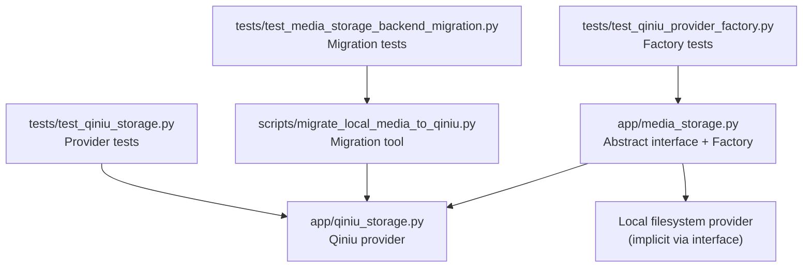
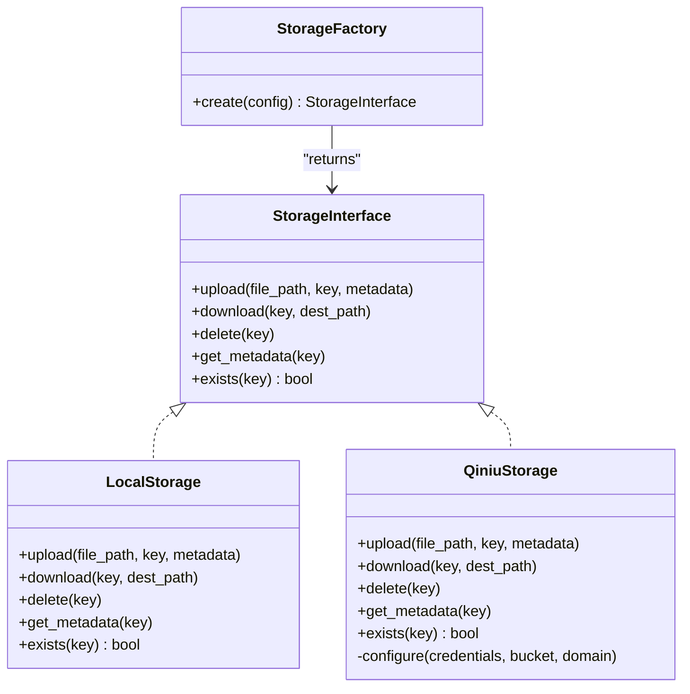
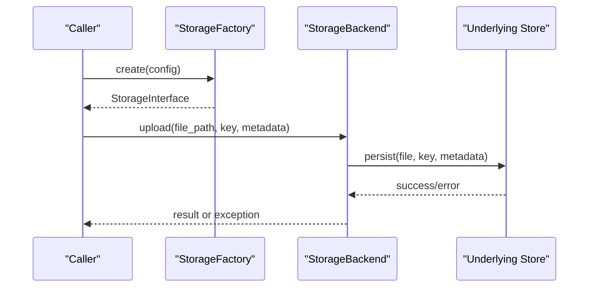
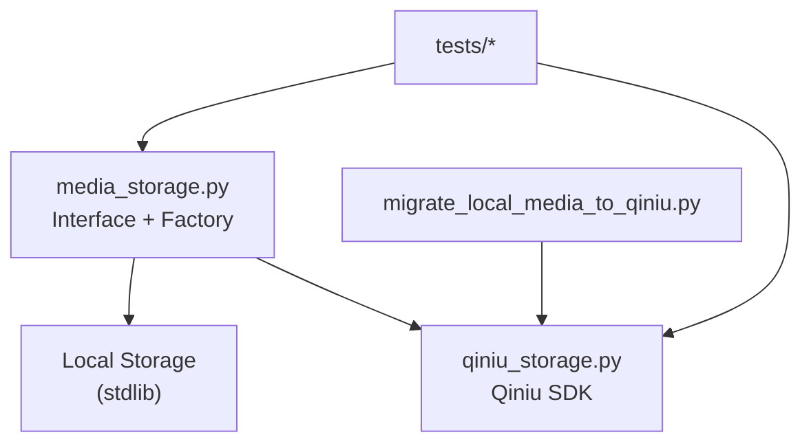

# Storage Backends

<cite>
**Referenced Files in This Document**
- [media_storage.py](file://backend/app/media_storage.py)
- [qiniu_storage.py](file://backend/app/qiniu_storage.py)
- [migrate_local_media_to_qiniu.py](file://backend/scripts/migrate_local_media_to_qiniu.py)
- [test_qiniu_provider_factory.py](file://backend/tests/test_qiniu_provider_factory.py)
- [test_qiniu_storage.py](file://backend/tests/test_qiniu_storage.py)
- [test_media_storage_backend_migration.py](file://backend/tests/test_media_storage_backend_migration.py)
- [rnd_186_local_qiniu_migration.md](file://docs/research/rnd_186_local_qiniu_migration.md)
- [rnd_185_media_storage_abstraction.md](file://docs/research/rnd_185_media_storage_abstraction.md)
- [media_storage_ops.md](file://docs/ops/media_storage_ops.md)
</cite>

## Table of Contents
1. [Introduction](#introduction)
2. [Project Structure](#project-structure)
3. [Core Components](#core-components)
4. [Architecture Overview](#architecture-overview)
5. [Detailed Component Analysis](#detailed-component-analysis)
6. [Dependency Analysis](#dependency-analysis)
7. [Performance Considerations](#performance-considerations)
8. [Troubleshooting Guide](#troubleshooting-guide)
9. [Conclusion](#conclusion)
10. [Appendices](#appendices)

## Introduction
This document explains the storage backend implementations used by the application to manage media assets. It covers the abstract storage interface, concrete backends (local filesystem and Qiniu Cloud), the factory pattern for backend selection, supported operations (upload, download, delete, metadata), configuration and authentication, error handling strategies, performance characteristics, scalability considerations, and migration procedures between backends.

## Project Structure
The storage subsystem is implemented under the backend application module with a clear separation between the abstract interface and concrete providers:
- Abstract storage interface and factory are defined in the core app module.
- The Qiniu provider implementation resides in its own module.
- Migration scripts and tests validate behavior and transitions between backends.
- Operational guidance and research notes provide context on design decisions and runbooks.

**Diagram sources**
- [media_storage.py](file://backend/app/media_storage.py)
- [qiniu_storage.py](file://backend/app/qiniu_storage.py)
- [migrate_local_media_to_qiniu.py](file://backend/scripts/migrate_local_media_to_qiniu.py)
- [test_qiniu_provider_factory.py](file://backend/tests/test_qiniu_provider_factory.py)
- [test_qiniu_storage.py](file://backend/tests/test_qiniu_storage.py)
- [test_media_storage_backend_migration.py](file://backend/tests/test_media_storage_backend_migration.py)

**Section sources**
- [media_storage.py](file://backend/app/media_storage.py)
- [qiniu_storage.py](file://backend/app/qiniu_storage.py)
- [migrate_local_media_to_qiniu.py](file://backend/scripts/migrate_local_media_to_qiniu.py)
- [test_qiniu_provider_factory.py](file://backend/tests/test_qiniu_provider_factory.py)
- [test_qiniu_storage.py](file://backend/tests/test_qiniu_storage.py)
- [test_media_storage_backend_migration.py](file://backend/tests/test_media_storage_backend_migration.py)

## Core Components
- Abstract storage interface defines the contract for all storage backends, including upload, download, delete, and metadata operations.
- Concrete implementations include:
  - Local filesystem storage: stores files directly on disk using paths configured per tenant or environment.
  - Qiniu Cloud storage provider: interacts with Qiniu Kodo via SDK credentials and bucket configuration.
- Factory pattern selects the appropriate backend based on configuration values, enabling runtime switching without changing callers.

Key responsibilities:
- Interface abstraction ensures consistent APIs across backends.
- Factory centralizes instantiation logic and configuration validation.
- Providers encapsulate backend-specific details such as authentication, URL generation, and error mapping.

**Section sources**
- [media_storage.py](file://backend/app/media_storage.py)
- [qiniu_storage.py](file://backend/app/qiniu_storage.py)

## Architecture Overview
The storage layer follows a clean separation of concerns:
- Callers interact only with the abstract interface.
- The factory resolves the concrete backend from configuration.
- Each provider implements the same operations but uses different mechanisms.

**Diagram sources**
- [media_storage.py](file://backend/app/media_storage.py)
- [qiniu_storage.py](file://backend/app/qiniu_storage.py)

## Detailed Component Analysis

### Abstract Storage Interface
The abstract interface defines the canonical set of operations that all storage backends must implement:
- Upload: persist a file to the backend with an identifier and optional metadata.
- Download: retrieve a file from the backend to a local path.
- Delete: remove a file identified by its key.
- Metadata management: read or update metadata associated with a stored object.
- Existence check: verify whether a key exists in the backend.

Design principles:
- Uniform API across backends simplifies caller code.
- Metadata operations allow storing attributes like content type, size, and custom tags.
- Error semantics should be consistent (e.g., raising exceptions or returning standardized error codes).

Operational implications:
- Callers can switch backends transparently by changing configuration.
- Tests can mock the interface to validate behavior without touching real storage.

**Section sources**
- [media_storage.py](file://backend/app/media_storage.py)

### Local Filesystem Storage
The local filesystem provider implements the abstract interface using the local disk:
- Upload writes files to a configured directory structure keyed by tenant and asset identifiers.
- Download reads files from disk into memory or streams them to a destination path.
- Delete removes files from the filesystem.
- Metadata may be stored alongside files or in a lightweight index depending on implementation.

Configuration highlights:
- Base directory path for storage root.
- Optional subdirectory organization per tenant or media type.
- Permissions and ownership settings for deployed environments.

Error handling:
- File system errors (permission denied, disk full) are translated into standardized exceptions.
- Idempotent operations where possible (e.g., overwrite existing keys safely).

Scalability considerations:
- Suitable for single-node deployments or small-scale usage.
- Not ideal for high concurrency or distributed environments without shared filesystems.

**Section sources**
- [media_storage.py](file://backend/app/media_storage.py)

### Qiniu Cloud Storage Provider
The Qiniu provider implements the abstract interface using Qiniu Kodo:
- Upload uploads files to a configured bucket with keys derived from tenant and asset identifiers.
- Download retrieves objects via signed URLs or direct streaming depending on configuration.
- Delete removes objects from the bucket.
- Metadata includes standard headers and custom fields managed through Qiniu’s metadata API.

Authentication and configuration:
- Credentials include access key and secret key for API authorization.
- Bucket name and CDN domain configuration determine how URLs are generated.
- Optional HTTPS enforcement and signed URL expiration policies.

Error handling:
- Network and API errors are mapped to standardized exceptions.
- Retries and timeouts are configurable to handle transient failures.

Performance characteristics:
- High throughput and availability due to cloud infrastructure.
- Signed URLs reduce server load by serving downloads directly from CDN when enabled.

**Section sources**
- [qiniu_storage.py](file://backend/app/qiniu_storage.py)

### Factory Pattern for Backend Selection
The factory creates the appropriate storage backend based on configuration:
- Reads backend type (e.g., “local” or “qiniu”) from configuration.
- Validates required parameters for the selected backend.
- Instantiates and returns the corresponding provider instance.

Benefits:
- Decouples caller code from backend specifics.
- Enables easy addition of new backends by implementing the interface and registering with the factory.

Usage flow:
- Application loads configuration at startup.
- Factory is invoked to create the storage instance.
- Callers use the returned interface uniformly.

**Section sources**
- [media_storage.py](file://backend/app/media_storage.py)
- [test_qiniu_provider_factory.py](file://backend/tests/test_qiniu_provider_factory.py)

### Storage Operations Sequence
The typical sequence for uploading media involves:
- Caller prepares file and metadata.
- Factory provides the configured storage backend.
- Backend performs upload and returns success or raises an error.

**Diagram sources**
- [media_storage.py](file://backend/app/media_storage.py)
- [qiniu_storage.py](file://backend/app/qiniu_storage.py)

### Migration Between Backends
Migration tools enable moving media from local storage to Qiniu:
- Scans local storage for existing files.
- Uploads each file to the target backend with preserved keys and metadata.
- Updates bookkeeping records to reflect the new backend reference.
- Supports dry-run mode for validation before actual migration.

Operational steps:
- Configure source and target backends.
- Run migration script with appropriate flags.
- Verify integrity post-migration using checksums or metadata comparison.

**Section sources**
- [migrate_local_media_to_qiniu.py](file://backend/scripts/migrate_local_media_to_qiniu.py)
- [test_media_storage_backend_migration.py](file://backend/tests/test_media_storage_backend_migration.py)
- [rnd_186_local_qiniu_migration.md](file://docs/research/rnd_186_local_qiniu_migration.md)

## Dependency Analysis
The storage subsystem has minimal external dependencies beyond the chosen backend SDKs:
- Local storage depends only on Python’s standard library for file operations.
- Qiniu storage depends on the Qiniu SDK for API interactions.
- Factory and interface modules have no runtime dependencies other than configuration parsing.

**Diagram sources**
- [media_storage.py](file://backend/app/media_storage.py)
- [qiniu_storage.py](file://backend/app/qiniu_storage.py)
- [migrate_local_media_to_qiniu.py](file://backend/scripts/migrate_local_media_to_qiniu.py)
- [test_qiniu_provider_factory.py](file://backend/tests/test_qiniu_provider_factory.py)
- [test_qiniu_storage.py](file://backend/tests/test_qiniu_storage.py)
- [test_media_storage_backend_migration.py](file://backend/tests/test_media_storage_backend_migration.py)

**Section sources**
- [media_storage.py](file://backend/app/media_storage.py)
- [qiniu_storage.py](file://backend/app/qiniu_storage.py)
- [migrate_local_media_to_qiniu.py](file://backend/scripts/migrate_local_media_to_qiniu.py)

## Performance Considerations
- Local storage offers low latency for single-node deployments but lacks horizontal scalability.
- Qiniu storage provides high throughput, global distribution, and CDN acceleration when configured.
- Signed URLs reduce application load by offloading downloads to the CDN.
- Metadata operations should be batched where possible to minimize API calls.
- Concurrency limits and retry policies should be tuned based on backend capabilities and network conditions.

[No sources needed since this section provides general guidance]

## Troubleshooting Guide
Common issues and resolutions:
- Authentication failures: verify credentials and permissions for the configured bucket or directory.
- Permission errors: ensure correct file ownership and ACLs for local storage; check IAM policies for cloud storage.
- Network timeouts: adjust timeout and retry settings; monitor backend health endpoints.
- Migration inconsistencies: run verification scripts to compare counts and checksums between source and target.

Operational references:
- Review operational guides for storage maintenance and disaster recovery procedures.

**Section sources**
- [media_storage_ops.md](file://docs/ops/media_storage_ops.md)

## Conclusion
The storage backend architecture provides a flexible and scalable foundation for managing media assets. By abstracting storage operations behind a uniform interface and using a factory for backend selection, the system supports seamless transitions between local and cloud storage. Proper configuration, error handling, and migration procedures ensure reliable operation across diverse deployment scenarios.

[No sources needed since this section summarizes without analyzing specific files]

## Appendices

### Configuration Reference
- Backend type selector: determines which provider to instantiate.
- Local storage: base directory path, optional tenant scoping.
- Qiniu storage: access key, secret key, bucket name, CDN domain, HTTPS settings.

[No sources needed since this section provides general guidance]

### Migration Procedures
- Pre-migration checks: validate source data integrity and target capacity.
- Execution: run migration with dry-run first, then perform actual migration.
- Post-migration validation: verify object counts, metadata consistency, and accessibility.

**Section sources**
- [rnd_186_local_qiniu_migration.md](file://docs/research/rnd_186_local_qiniu_migration.md)
- [migrate_local_media_to_qiniu.py](file://backend/scripts/migrate_local_media_to_qiniu.py)

### Design Notes
- Abstraction rationale and trade-offs between backends.
- Future extensibility for additional storage providers.

**Section sources**
- [rnd_185_media_storage_abstraction.md](file://docs/research/rnd_185_media_storage_abstraction.md)