# Thumbnail Generation System

<cite>
**Referenced Files in This Document**
- [media_thumbnails.py](file://backend/app/media_thumbnails.py)
- [thumbnail_pipeline.py](file://backend/app/thumbnail_pipeline.py)
- [media_access.py](file://backend/app/services/media_access.py)
- [main.py](file://backend/app/main.py)
- [models.py](file://backend/app/db/models.py)
- [0012_media_thumbnails.py](file://backend/alembic/versions/0012_media_thumbnails.py)
- [test_media_thumbnails.py](file://backend/tests/test_media_thumbnails.py)
- [test_thumbnail_pipeline.py](file://backend/tests/test_thumbnail_pipeline.py)
- [test_nested_media_access.py](file://backend/tests/test_nested_media_access.py)
- [test_thumbnail_media_access.py](file://backend/tests/test_thumbnail_media_access.py)
- [qiniu_storage.py](file://backend/app/qiniu_storage.py)
- [media_storage.py](file://backend/app/media_storage.py)
- [wecom-archive-worker.service](file://deploy/systemd/wecom-archive-worker.service)
- [wecom-thumbnail-backfill.service](file://deploy/systemd/wecom-thumbnail-backfill.service)
</cite>

## Update Summary
**Changes Made**
- Updated architecture overview to reflect integration with new media access service
- Added documentation for nested media access patterns and dedicated media service
- Enhanced component analysis to show new service layer integration
- Updated dependency analysis to include media access service relationships
- Added new sections covering nested media access patterns and service orchestration

## Table of Contents
1. [Introduction](#introduction)
2. [Project Structure](#project-structure)
3. [Core Components](#core-components)
4. [Architecture Overview](#architecture-overview)
5. [Detailed Component Analysis](#detailed-component-analysis)
6. [Nested Media Access Patterns](#nested-media-access-patterns)
7. [Media Service Integration](#media-service-integration)
8. [Dependency Analysis](#dependency-analysis)
9. [Performance Considerations](#performance-considerations)
10. [Troubleshooting Guide](#troubleshooting-guide)
11. [Conclusion](#conclusion)
12. [Appendices](#appendices)

## Introduction
This document explains the thumbnail generation system used to create optimized thumbnails for media assets. The system has been recently integrated into a new media access service architecture, providing enhanced support for nested media access patterns and dedicated media service orchestration. It covers the end-to-end workflow from media ingestion to thumbnail delivery, supported formats, size optimization strategies, asynchronous processing and background job scheduling, resource management, caching and storage organization, CDN integration patterns, quality and format options, fallback mechanisms, and monitoring/logging approaches for failures.

## Project Structure
The thumbnail system is now implemented as part of a comprehensive media access service architecture:
- A FastAPI application exposing endpoints and orchestrating thumbnail operations through the media service
- A dedicated thumbnail pipeline module handling image decoding, resizing, encoding, and metadata updates
- A new media access service layer providing unified access patterns and nested media handling
- Storage abstraction over local and cloud backends (e.g., Qiniu)
- Background workers and systemd units for scheduled jobs and backfills
- Database models and migrations tracking thumbnail state and URLs

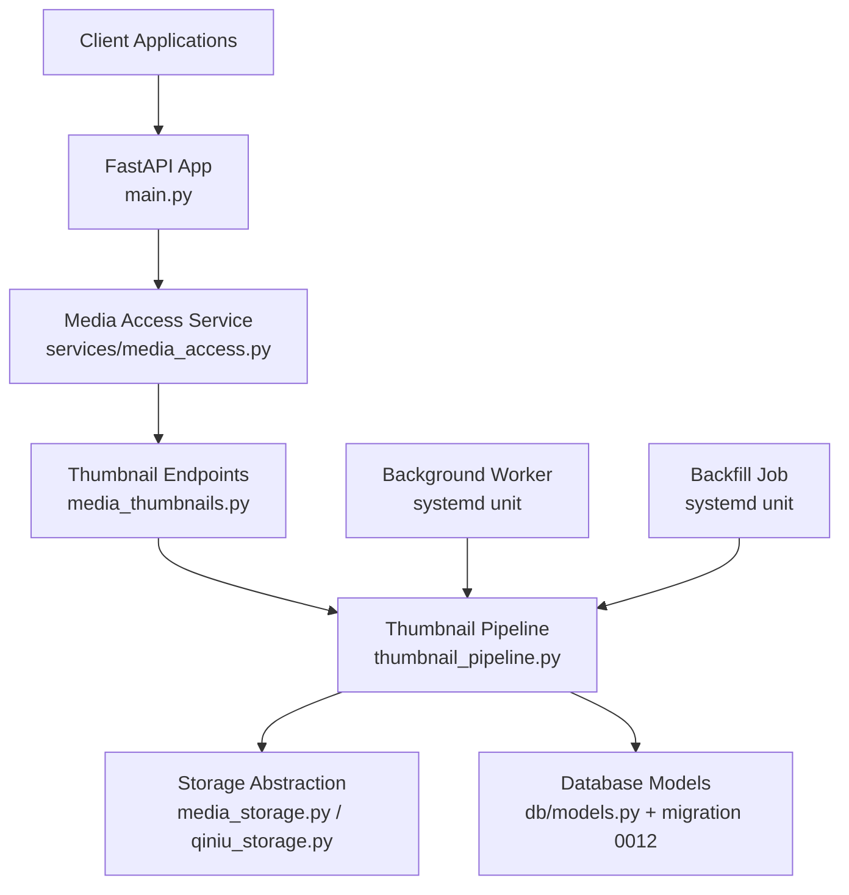

**Diagram sources**
- [main.py](file://backend/app/main.py)
- [media_access.py](file://backend/app/services/media_access.py)
- [media_thumbnails.py](file://backend/app/media_thumbnails.py)
- [thumbnail_pipeline.py](file://backend/app/thumbnail_pipeline.py)
- [media_storage.py](file://backend/app/media_storage.py)
- [qiniu_storage.py](file://backend/app/qiniu_storage.py)
- [models.py](file://backend/app/db/models.py)
- [0012_media_thumbnails.py](file://backend/alembic/versions/0012_media_thumbnails.py)
- [wecom-archive-worker.service](file://deploy/systemd/wecom-archive-worker.service)
- [wecom-thumbnail-backfill.service](file://deploy/systemd/wecom-thumbnail-backfill.service)

**Section sources**
- [main.py](file://backend/app/main.py)
- [media_access.py](file://backend/app/services/media_access.py)
- [media_thumbnails.py](file://backend/app/media_thumbnails.py)
- [thumbnail_pipeline.py](file://backend/app/thumbnail_pipeline.py)
- [media_storage.py](file://backend/app/media_storage.py)
- [qiniu_storage.py](file://backend/app/qiniu_storage.py)
- [models.py](file://backend/app/db/models.py)
- [0012_media_thumbnails.py](file://backend/alembic/versions/0012_media_thumbnails.py)
- [wecom-archive-worker.service](file://deploy/systemd/wecom-archive-worker.service)
- [wecom-thumbnail-backfill.service](file://deploy/systemd/wecom-thumbnail-backfill.service)

## Core Components
- **Media Access Service**: New dedicated service layer that provides unified access patterns for media resources, including nested media handling and thumbnail generation orchestration
- **Thumbnail endpoints and orchestration**: Expose APIs to request thumbnail creation, retrieval, and regeneration; coordinate with the pipeline and storage layer through the media service
- **Thumbnail pipeline**: Encapsulates image decoding, validation, resizing, encoding, and persistence of thumbnail metadata and URLs
- **Storage abstraction**: Provides unified access to local filesystem or cloud object storage (e.g., Qiniu), including signed URL generation and path conventions
- **Background workers and backfill jobs**: Scheduled tasks that process queued thumbnail jobs and backfill missing thumbnails for existing media
- **Data model and migrations**: Track thumbnail existence, sizes, formats, and storage keys; ensure schema consistency across environments

Key responsibilities:
- Validate input media types and dimensions through the media service
- Compute target sizes based on configuration and client hints
- Encode output in optimal formats with configurable quality
- Persist thumbnail artifacts and update database records
- Return CDN-ready URLs or signed links
- Support nested media access patterns for complex media hierarchies

**Section sources**
- [media_access.py](file://backend/app/services/media_access.py)
- [media_thumbnails.py](file://backend/app/media_thumbnails.py)
- [thumbnail_pipeline.py](file://backend/app/thumbnail_pipeline.py)
- [media_storage.py](file://backend/app/media_storage.py)
- [qiniu_storage.py](file://backend/app/qiniu_storage.py)
- [models.py](file://backend/app/db/models.py)
- [0012_media_thumbnails.py](file://backend/alembic/versions/0012_media_thumbnails.py)

## Architecture Overview
The thumbnail system follows an async-first architecture with integrated media access service:
- HTTP requests trigger thumbnail operations via FastAPI endpoints through the media service
- The media access service provides unified access patterns and nested media handling
- The pipeline performs CPU-intensive work off the critical path using background tasks
- Storage abstraction decouples artifact persistence from the pipeline logic
- Workers and backfill jobs run independently to handle queues and historical data

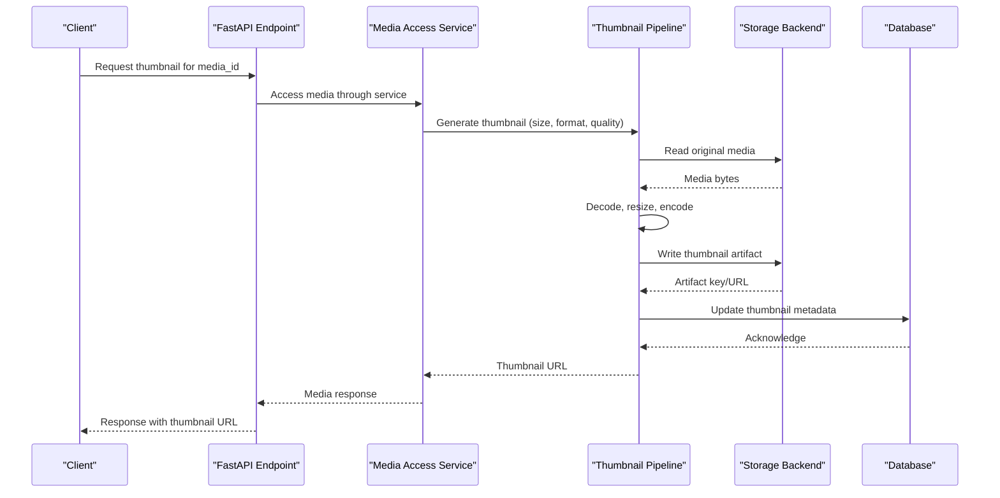

**Diagram sources**
- [main.py](file://backend/app/main.py)
- [media_access.py](file://backend/app/services/media_access.py)
- [media_thumbnails.py](file://backend/app/media_thumbnails.py)
- [thumbnail_pipeline.py](file://backend/app/thumbnail_pipeline.py)
- [media_storage.py](file://backend/app/media_storage.py)
- [qiniu_storage.py](file://backend/app/qiniu_storage.py)
- [models.py](file://backend/app/db/models.py)

## Detailed Component Analysis

### Media Access Service Layer
**Updated** The new media access service provides a unified interface for all media operations, including thumbnail generation and nested media access patterns.

Responsibilities:
- Unified media resource access across different storage backends
- Nested media pattern support for complex media hierarchies
- Thumbnail generation orchestration through standardized interfaces
- Context propagation for tenant isolation and access control
- Error handling and retry mechanisms for media operations

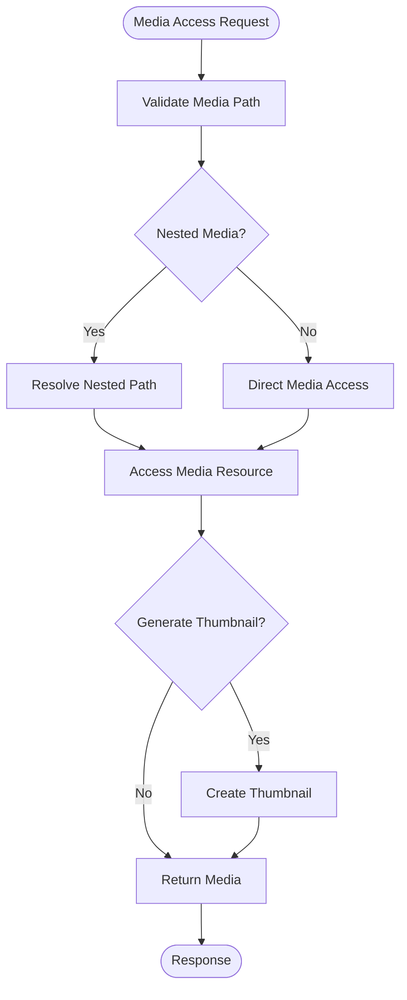

**Diagram sources**
- [media_access.py](file://backend/app/services/media_access.py)

**Section sources**
- [media_access.py](file://backend/app/services/media_access.py)

### Thumbnail Endpoints and Orchestration
- Accepts parameters such as media identifier, desired width/height, format, and quality
- Validates inputs and delegates to the pipeline through the media service
- Returns immediate responses for cached thumbnails or enqueues background jobs when needed
- Integrates with storage backend to resolve final URLs (CDN or signed URLs)
- Supports nested media access patterns for complex media hierarchies

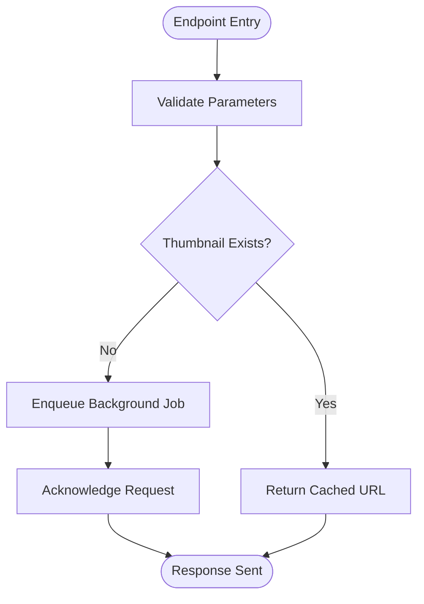

**Diagram sources**
- [media_thumbnails.py](file://backend/app/media_thumbnails.py)
- [thumbnail_pipeline.py](file://backend/app/thumbnail_pipeline.py)

**Section sources**
- [media_thumbnails.py](file://backend/app/media_thumbnails.py)

### Thumbnail Pipeline
Responsibilities:
- Image decoding and validation
- Size computation and aspect ratio preservation
- Format conversion and quality tuning
- Artifact writing and metadata persistence

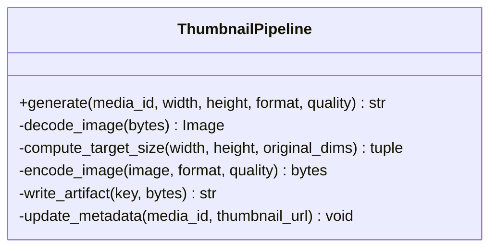

**Diagram sources**
- [thumbnail_pipeline.py](file://backend/app/thumbnail_pipeline.py)

**Section sources**
- [thumbnail_pipeline.py](file://backend/app/thumbnail_pipeline.py)

### Storage Abstraction and CDN Integration
- Unified interface for reading originals and writing thumbnails
- Supports local filesystem and cloud providers (e.g., Qiniu)
- Generates CDN-ready URLs or signed URLs depending on provider configuration
- Organizes artifacts by tenant and media identifiers for isolation and scalability

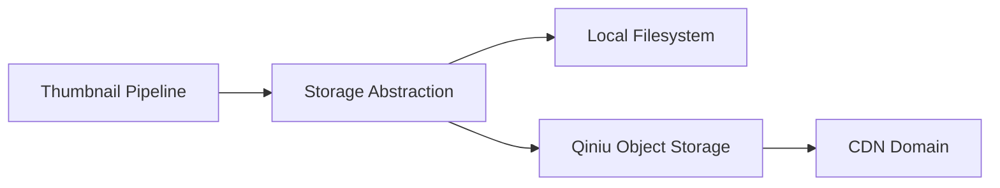

**Diagram sources**
- [media_storage.py](file://backend/app/media_storage.py)
- [qiniu_storage.py](file://backend/app/qiniu_storage.py)

**Section sources**
- [media_storage.py](file://backend/app/media_storage.py)
- [qiniu_storage.py](file://backend/app/qiniu_storage.py)

### Background Jobs and Scheduling
- Systemd timers and services schedule periodic execution of worker processes
- Workers consume queued thumbnail jobs and execute the pipeline asynchronously
- Backfill service scans existing media and generates missing thumbnails

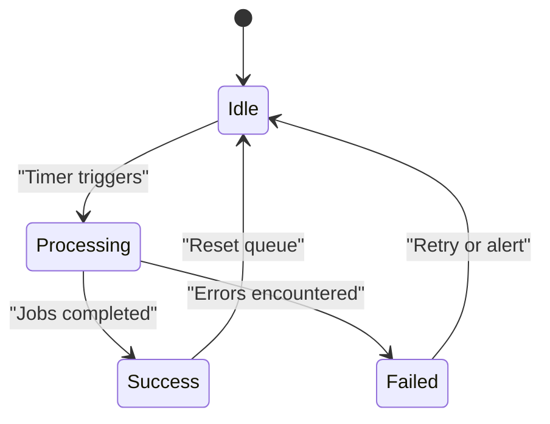

**Diagram sources**
- [wecom-archive-worker.service](file://deploy/systemd/wecom-archive-worker.service)
- [wecom-thumbnail-backfill.service](file://deploy/systemd/wecom-thumbnail-backfill.service)

**Section sources**
- [wecom-archive-worker.service](file://deploy/systemd/wecom-archive-worker.service)
- [wecom-thumbnail-backfill.service](file://deploy/systemd/wecom-thumbnail-backfill.service)

### Data Model and Migration
- Tracks thumbnail existence, dimensions, format, quality, and storage key
- Ensures consistent schema across environments via Alembic migrations
- Enables efficient queries for cache hits and backfill operations

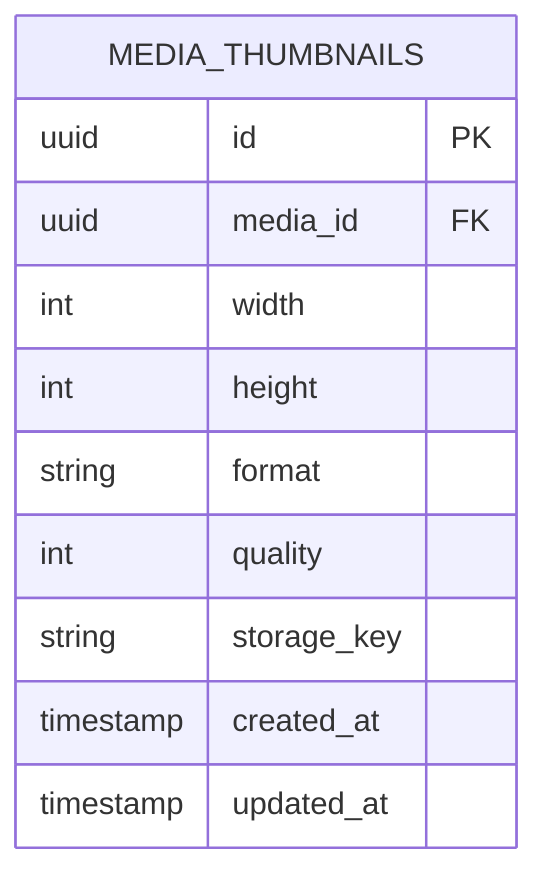

**Diagram sources**
- [models.py](file://backend/app/db/models.py)
- [0012_media_thumbnails.py](file://backend/alembic/versions/0012_media_thumbnails.py)

**Section sources**
- [models.py](file://backend/app/db/models.py)
- [0012_media_thumbnails.py](file://backend/alembic/versions/0012_media_thumbnails.py)

## Nested Media Access Patterns
**New Section** The thumbnail generation system now supports nested media access patterns, allowing for complex media hierarchies and contextual thumbnail generation.

### Nested Media Structure
- Hierarchical media organization with parent-child relationships
- Context-aware thumbnail generation based on media position in hierarchy
- Efficient path resolution for deeply nested media structures
- Tenant isolation at each level of the media hierarchy

### Access Pattern Implementation
- Standardized interfaces for accessing nested media resources
- Automatic context propagation through media access chains
- Optimized path resolution algorithms for deep hierarchies
- Caching mechanisms for frequently accessed nested paths

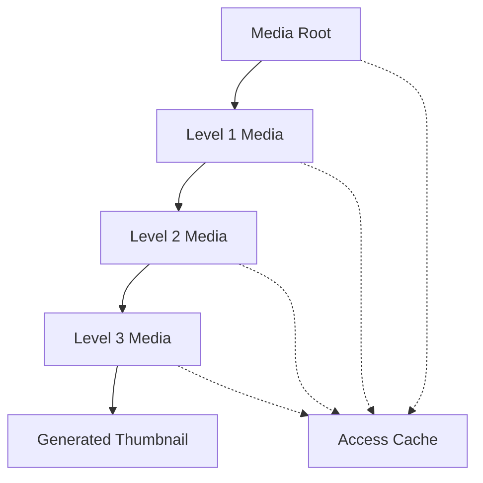

**Diagram sources**
- [media_access.py](file://backend/app/services/media_access.py)

**Section sources**
- [media_access.py](file://backend/app/services/media_access.py)

## Media Service Integration
**New Section** The thumbnail generation system is fully integrated into the new media access service architecture, providing enhanced functionality and improved performance.

### Service Layer Benefits
- Unified API surface for all media operations
- Consistent error handling and retry mechanisms
- Improved performance through connection pooling and caching
- Enhanced security through centralized access control
- Better observability through structured logging and metrics

### Integration Points
- Thumbnail generation requests flow through the media service layer
- Context information is propagated throughout the access chain
- Storage operations are abstracted through the service interface
- Background jobs integrate with the service's task queue

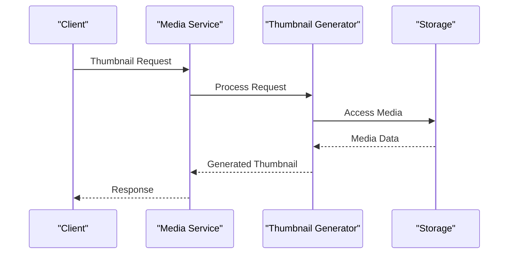

**Diagram sources**
- [media_access.py](file://backend/app/services/media_access.py)
- [media_thumbnails.py](file://backend/app/media_thumbnails.py)

**Section sources**
- [media_access.py](file://backend/app/services/media_access.py)
- [media_thumbnails.py](file://backend/app/media_thumbnails.py)

## Dependency Analysis
- Endpoints depend on the media service for unified access patterns
- Media service depends on the pipeline for core processing logic
- Pipeline depends on storage abstraction for I/O operations
- Storage abstraction depends on provider-specific implementations (local/Qiniu)
- Background jobs and backfill services depend on the pipeline and database models

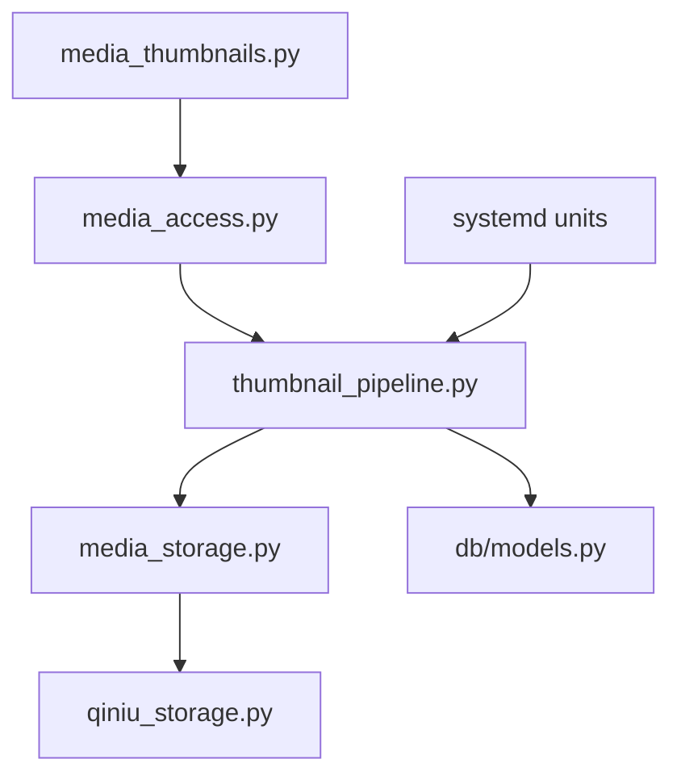

**Diagram sources**
- [media_thumbnails.py](file://backend/app/media_thumbnails.py)
- [media_access.py](file://backend/app/services/media_access.py)
- [thumbnail_pipeline.py](file://backend/app/thumbnail_pipeline.py)
- [media_storage.py](file://backend/app/media_storage.py)
- [qiniu_storage.py](file://backend/app/qiniu_storage.py)
- [models.py](file://backend/app/db/models.py)

**Section sources**
- [media_thumbnails.py](file://backend/app/media_thumbnails.py)
- [media_access.py](file://backend/app/services/media_access.py)
- [thumbnail_pipeline.py](file://backend/app/thumbnail_pipeline.py)
- [media_storage.py](file://backend/app/media_storage.py)
- [qiniu_storage.py](file://backend/app/qiniu_storage.py)
- [models.py](file://backend/app/db/models.py)

## Performance Considerations
- Use async background tasks to avoid blocking HTTP responses
- Cache thumbnails in both memory and persistent storage to minimize recomputation
- Optimize image decoding/encoding pipelines with appropriate libraries and settings
- Implement progressive loading and adaptive sizing based on client device capabilities
- Leverage CDN caching headers and edge caching for frequently accessed thumbnails
- Utilize the media service's connection pooling and caching mechanisms
- Optimize nested media access patterns with efficient path resolution algorithms

[No sources needed since this section provides general guidance]

## Troubleshooting Guide
Common issues and resolutions:
- Unsupported media formats: Validate input types and provide clear error messages
- Insufficient resources: Monitor memory and CPU usage during heavy encoding tasks
- Storage failures: Check connectivity and permissions for local/cloud storage backends
- Database inconsistencies: Verify migration status and re-run backfill if necessary
- CDN misconfiguration: Ensure domain bindings and SSL certificates are valid
- Media service connectivity issues: Check service health endpoints and dependency availability
- Nested media access errors: Verify path resolution and hierarchical structure integrity

Monitoring and logging:
- Log all pipeline steps with contextual metadata (media_id, size, format, quality)
- Emit structured logs for errors and retries
- Integrate with centralized logging and alerting systems
- Monitor media service health and performance metrics
- Track nested media access patterns and resolution times

**Section sources**
- [test_media_thumbnails.py](file://backend/tests/test_media_thumbnails.py)
- [test_thumbnail_pipeline.py](file://backend/tests/test_thumbnail_pipeline.py)
- [test_nested_media_access.py](file://backend/tests/test_nested_media_access.py)
- [test_thumbnail_media_access.py](file://backend/tests/test_thumbnail_media_access.py)

## Conclusion
The thumbnail generation system has been successfully integrated into the new media access service architecture, providing enhanced support for nested media access patterns and dedicated media service orchestration. By combining async processing, flexible storage abstractions, efficient caching strategies, and the new unified media service layer, it delivers high performance while maintaining reliability and observability. The integration enables more sophisticated media handling scenarios while preserving backward compatibility and improving overall system resilience.

[No sources needed since this section summarizes without analyzing specific files]

## Appendices

### Supported Formats and Quality Settings
- Input formats: Common image formats supported by decoding libraries
- Output formats: Optimized formats for web delivery (e.g., JPEG, PNG, WebP)
- Quality settings: Configurable quality levels balancing file size and visual fidelity

[No sources needed since this section provides general guidance]

### Fallback Mechanisms
- Graceful degradation when primary format is unsupported
- Automatic fallback to alternative encoders or formats
- Error propagation with actionable diagnostics
- Media service-level fallbacks for storage backend failures

[No sources needed since this section provides general guidance]

### Nested Media Access Patterns
- Hierarchical media organization with parent-child relationships
- Context-aware thumbnail generation based on media position
- Efficient path resolution for deeply nested structures
- Tenant isolation at each hierarchy level

[No sources needed since this section provides general guidance]

### Media Service Integration Guidelines
- Use standardized interfaces for all media operations
- Implement proper error handling and retry mechanisms
- Leverage connection pooling and caching features
- Follow tenant isolation patterns throughout the access chain

[No sources needed since this section provides general guidance]