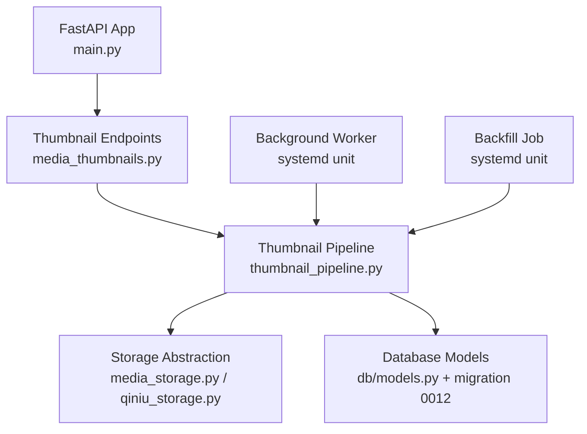
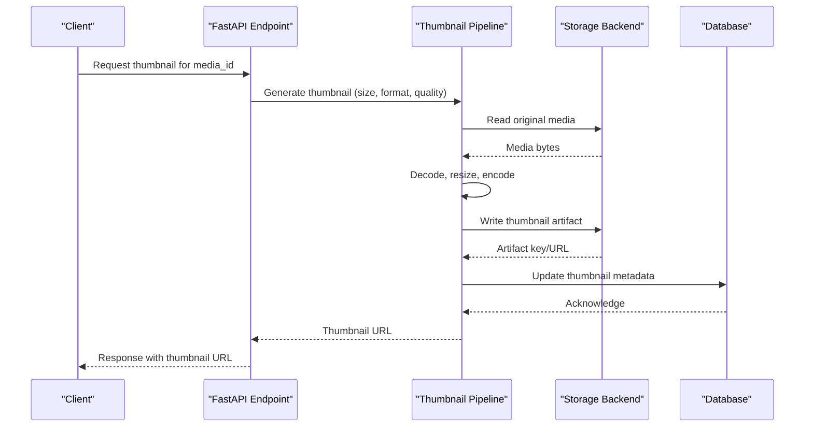
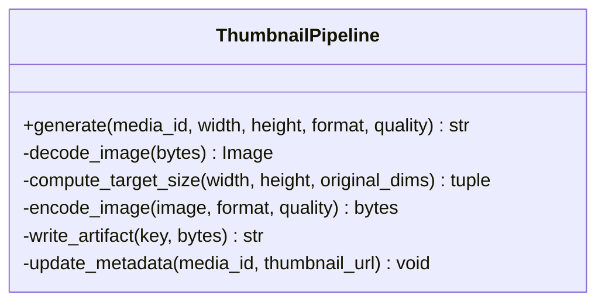
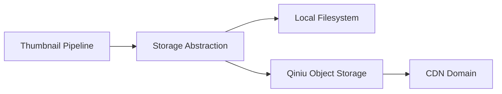
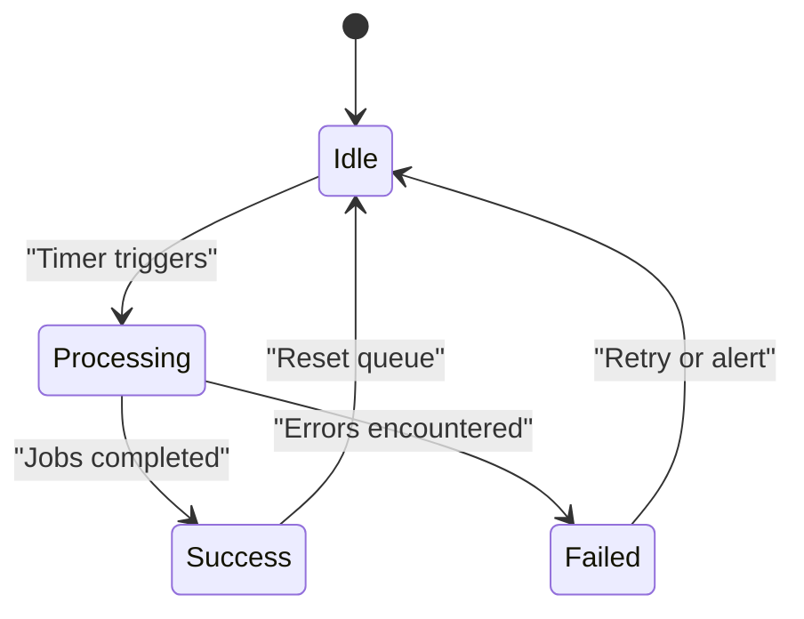
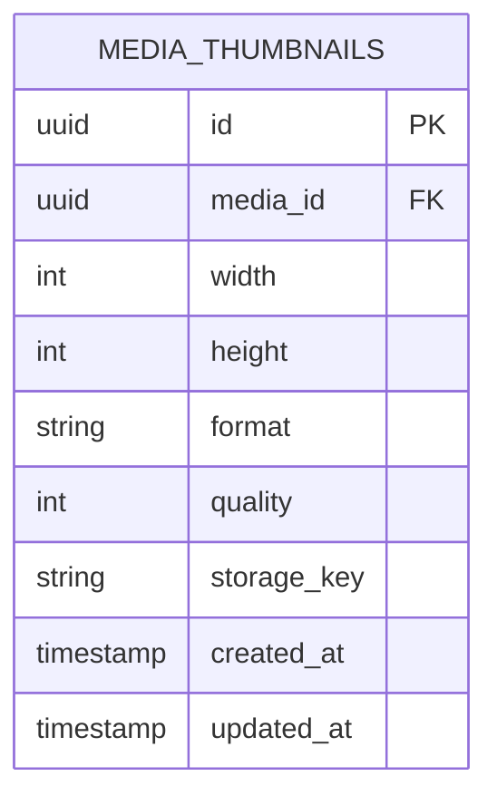
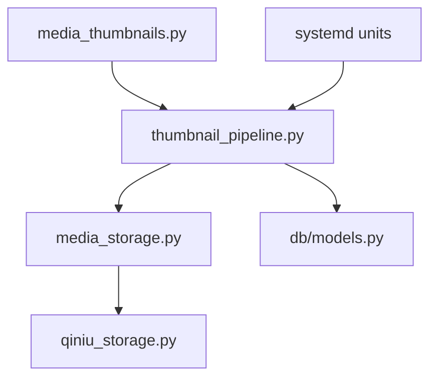

# Thumbnail Generation System

<cite>
**Referenced Files in This Document**
- [media_thumbnails.py](file://backend/app/media_thumbnails.py)
- [thumbnail_pipeline.py](file://backend/app/thumbnail_pipeline.py)
- [main.py](file://backend/app/main.py)
- [models.py](file://backend/app/db/models.py)
- [0012_media_thumbnails.py](file://backend/alembic/versions/0012_media_thumbnails.py)
- [test_media_thumbnails.py](file://backend/tests/test_media_thumbnails.py)
- [test_thumbnail_pipeline.py](file://backend/tests/test_thumbnail_pipeline.py)
- [test_rnd_207_thumbnail_frontend.py](file://backend/tests/test_rnd_207_thumbnail_frontend.py)
- [qiniu_storage.py](file://backend/app/qiniu_storage.py)
- [media_storage.py](file://backend/app/media_storage.py)
- [wecom-archive-worker.service](file://deploy/systemd/wecom-archive-worker.service)
- [wecom-thumbnail-backfill.service](file://deploy/systemd/wecom-thumbnail-backfill.service)
</cite>

## Table of Contents
1. [Introduction](#introduction)
2. [Project Structure](#project-structure)
3. [Core Components](#core-components)
4. [Architecture Overview](#architecture-overview)
5. [Detailed Component Analysis](#detailed-component-analysis)
6. [Dependency Analysis](#dependency-analysis)
7. [Performance Considerations](#performance-considerations)
8. [Troubleshooting Guide](#troubleshooting-guide)
9. [Conclusion](#conclusion)
10. [Appendices](#appendices)

## Introduction
This document explains the thumbnail generation system used to create optimized thumbnails for media assets. It covers the end-to-end workflow from media ingestion to thumbnail delivery, supported formats, size optimization strategies, asynchronous processing and background job scheduling, resource management, caching and storage organization, CDN integration patterns, quality and format options, fallback mechanisms, and monitoring/logging approaches for failures.

## Project Structure
The thumbnail system is implemented as a combination of:
- A FastAPI application exposing endpoints and orchestrating thumbnail operations
- A dedicated thumbnail pipeline module handling image decoding, resizing, encoding, and metadata updates
- Storage abstraction over local and cloud backends (e.g., Qiniu)
- Background workers and systemd units for scheduled jobs and backfills
- Database models and migrations tracking thumbnail state and URLs

**Diagram sources**
- [main.py](file://backend/app/main.py)
- [media_thumbnails.py](file://backend/app/media_thumbnails.py)
- [thumbnail_pipeline.py](file://backend/app/thumbnail_pipeline.py)
- [media_storage.py](file://backend/app/media_storage.py)
- [qiniu_storage.py](file://backend/app/qiniu_storage.py)
- [models.py](file://backend/app/db/models.py)
- [0012_media_thumbnails.py](file://backend/alembic/versions/0012_media_thumbnails.py)
- [wecom-archive-worker.service](file://deploy/systemd/wecom-archive-worker.service)
- [wecom-thumbnail-backfill.service](file://deploy/systemd/wecom-thumbnail-backfill.service)

**Section sources**
- [main.py](file://backend/app/main.py)
- [media_thumbnails.py](file://backend/app/media_thumbnails.py)
- [thumbnail_pipeline.py](file://backend/app/thumbnail_pipeline.py)
- [media_storage.py](file://backend/app/media_storage.py)
- [qiniu_storage.py](file://backend/app/qiniu_storage.py)
- [models.py](file://backend/app/db/models.py)
- [0012_media_thumbnails.py](file://backend/alembic/versions/0012_media_thumbnails.py)
- [wecom-archive-worker.service](file://deploy/systemd/wecom-archive-worker.service)
- [wecom-thumbnail-backfill.service](file://deploy/systemd/wecom-thumbnail-backfill.service)

## Core Components
- Thumbnail endpoints and orchestration: Expose APIs to request thumbnail creation, retrieval, and regeneration; coordinate with the pipeline and storage layer.
- Thumbnail pipeline: Encapsulates image decoding, validation, resizing, encoding, and persistence of thumbnail metadata and URLs.
- Storage abstraction: Provides unified access to local filesystem or cloud object storage (e.g., Qiniu), including signed URL generation and path conventions.
- Background workers and backfill jobs: Scheduled tasks that process queued thumbnail jobs and backfill missing thumbnails for existing media.
- Data model and migrations: Track thumbnail existence, sizes, formats, and storage keys; ensure schema consistency across environments.

Key responsibilities:
- Validate input media types and dimensions
- Compute target sizes based on configuration and client hints
- Encode output in optimal formats with configurable quality
- Persist thumbnail artifacts and update database records
- Return CDN-ready URLs or signed links

**Section sources**
- [media_thumbnails.py](file://backend/app/media_thumbnails.py)
- [thumbnail_pipeline.py](file://backend/app/thumbnail_pipeline.py)
- [media_storage.py](file://backend/app/media_storage.py)
- [qiniu_storage.py](file://backend/app/qiniu_storage.py)
- [models.py](file://backend/app/db/models.py)
- [0012_media_thumbnails.py](file://backend/alembic/versions/0012_media_thumbnails.py)

## Architecture Overview
The thumbnail system follows an async-first architecture:
- HTTP requests trigger thumbnail operations via FastAPI endpoints
- The pipeline performs CPU-intensive work off the critical path using background tasks
- Storage abstraction decouples artifact persistence from the pipeline logic
- Workers and backfill jobs run independently to handle queues and historical data

**Diagram sources**
- [media_thumbnails.py](file://backend/app/media_thumbnails.py)
- [thumbnail_pipeline.py](file://backend/app/thumbnail_pipeline.py)
- [media_storage.py](file://backend/app/media_storage.py)
- [qiniu_storage.py](file://backend/app/qiniu_storage.py)
- [models.py](file://backend/app/db/models.py)

## Detailed Component Analysis

### Thumbnail Endpoints and Orchestration
- Accepts parameters such as media identifier, desired width/height, format, and quality
- Validates inputs and delegates to the pipeline
- Returns immediate responses for cached thumbnails or enqueues background jobs when needed
- Integrates with storage backend to resolve final URLs (CDN or signed URLs)

**Diagram sources**
- [media_thumbnails.py](file://backend/app/media_thumbnails.py)
- [thumbnail_pipeline.py](file://backend/app/thumbnail_pipeline.py)

**Section sources**
- [media_thumbnails.py](file://backend/app/media_thumbnails.py)

### Thumbnail Pipeline
Responsibilities:
- Image decoding and validation
- Size computation and aspect ratio preservation
- Format conversion and quality tuning
- Artifact writing and metadata persistence

**Diagram sources**
- [thumbnail_pipeline.py](file://backend/app/thumbnail_pipeline.py)

**Section sources**
- [thumbnail_pipeline.py](file://backend/app/thumbnail_pipeline.py)

### Storage Abstraction and CDN Integration
- Unified interface for reading originals and writing thumbnails
- Supports local filesystem and cloud providers (e.g., Qiniu)
- Generates CDN-ready URLs or signed URLs depending on provider configuration
- Organizes artifacts by tenant and media identifiers for isolation and scalability

**Diagram sources**
- [media_storage.py](file://backend/app/media_storage.py)
- [qiniu_storage.py](file://backend/app/qiniu_storage.py)

**Section sources**
- [media_storage.py](file://backend/app/media_storage.py)
- [qiniu_storage.py](file://backend/app/qiniu_storage.py)

### Background Jobs and Scheduling
- Systemd timers and services schedule periodic execution of worker processes
- Workers consume queued thumbnail jobs and execute the pipeline asynchronously
- Backfill service scans existing media and generates missing thumbnails

**Diagram sources**
- [wecom-archive-worker.service](file://deploy/systemd/wecom-archive-worker.service)
- [wecom-thumbnail-backfill.service](file://deploy/systemd/wecom-thumbnail-backfill.service)

**Section sources**
- [wecom-archive-worker.service](file://deploy/systemd/wecom-archive-worker.service)
- [wecom-thumbnail-backfill.service](file://deploy/systemd/wecom-thumbnail-backfill.service)

### Data Model and Migration
- Tracks thumbnail existence, dimensions, format, quality, and storage key
- Ensures consistent schema across environments via Alembic migrations
- Enables efficient queries for cache hits and backfill operations

**Diagram sources**
- [models.py](file://backend/app/db/models.py)
- [0012_media_thumbnails.py](file://backend/alembic/versions/0012_media_thumbnails.py)

**Section sources**
- [models.py](file://backend/app/db/models.py)
- [0012_media_thumbnails.py](file://backend/alembic/versions/0012_media_thumbnails.py)

## Dependency Analysis
- Endpoints depend on the pipeline for core processing logic
- Pipeline depends on storage abstraction for I/O operations
- Storage abstraction depends on provider-specific implementations (local/Qiniu)
- Background jobs and backfill services depend on the pipeline and database models

**Diagram sources**
- [media_thumbnails.py](file://backend/app/media_thumbnails.py)
- [thumbnail_pipeline.py](file://backend/app/thumbnail_pipeline.py)
- [media_storage.py](file://backend/app/media_storage.py)
- [qiniu_storage.py](file://backend/app/qiniu_storage.py)
- [models.py](file://backend/app/db/models.py)

**Section sources**
- [media_thumbnails.py](file://backend/app/media_thumbnails.py)
- [thumbnail_pipeline.py](file://backend/app/thumbnail_pipeline.py)
- [media_storage.py](file://backend/app/media_storage.py)
- [qiniu_storage.py](file://backend/app/qiniu_storage.py)
- [models.py](file://backend/app/db/models.py)

## Performance Considerations
- Use async background tasks to avoid blocking HTTP responses
- Cache thumbnails in both memory and persistent storage to minimize recomputation
- Optimize image decoding/encoding pipelines with appropriate libraries and settings
- Implement progressive loading and adaptive sizing based on client device capabilities
- Leverage CDN caching headers and edge caching for frequently accessed thumbnails

[No sources needed since this section provides general guidance]

## Troubleshooting Guide
Common issues and resolutions:
- Unsupported media formats: Validate input types and provide clear error messages
- Insufficient resources: Monitor memory and CPU usage during heavy encoding tasks
- Storage failures: Check connectivity and permissions for local/cloud storage backends
- Database inconsistencies: Verify migration status and re-run backfill if necessary
- CDN misconfiguration: Ensure domain bindings and SSL certificates are valid

Monitoring and logging:
- Log all pipeline steps with contextual metadata (media_id, size, format, quality)
- Emit structured logs for errors and retries
- Integrate with centralized logging and alerting systems

**Section sources**
- [test_media_thumbnails.py](file://backend/tests/test_media_thumbnails.py)
- [test_thumbnail_pipeline.py](file://backend/tests/test_thumbnail_pipeline.py)
- [test_rnd_207_thumbnail_frontend.py](file://backend/tests/test_rnd_207_thumbnail_frontend.py)

## Conclusion
The thumbnail generation system provides a robust, scalable solution for creating optimized thumbnails across diverse media types. By combining async processing, flexible storage abstractions, and efficient caching strategies, it delivers high performance while maintaining reliability and observability. Proper configuration and monitoring ensure smooth operation in production environments.

[No sources needed since this section summarizes without analyzing specific files]

## Appendices

### Supported Formats and Quality Settings
- Input formats: Common image formats supported by decoding libraries
- Output formats: Optimized formats for web delivery (e.g., JPEG, PNG, WebP)
- Quality settings: Configurable quality levels balancing file size and visual fidelity

[No sources needed since this section provides general guidance]

### Fallback Mechanisms
- Graceful degradation when primary format is unsupported
- Automatic fallback to alternative encoders or formats
- Error propagation with actionable diagnostics

[No sources needed since this section provides general guidance]