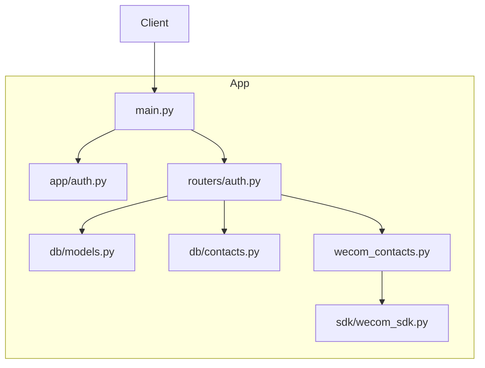
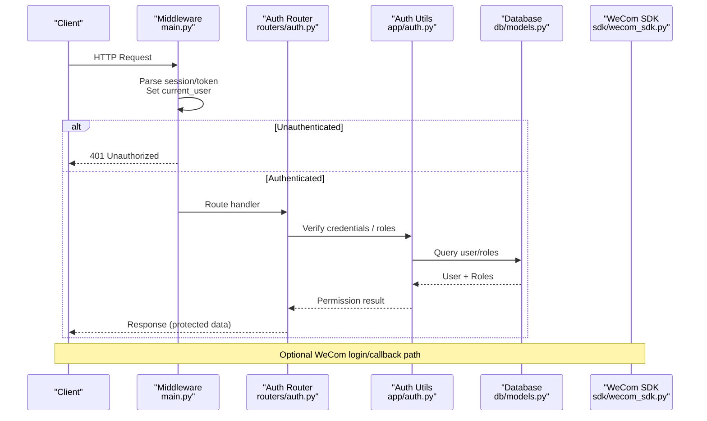
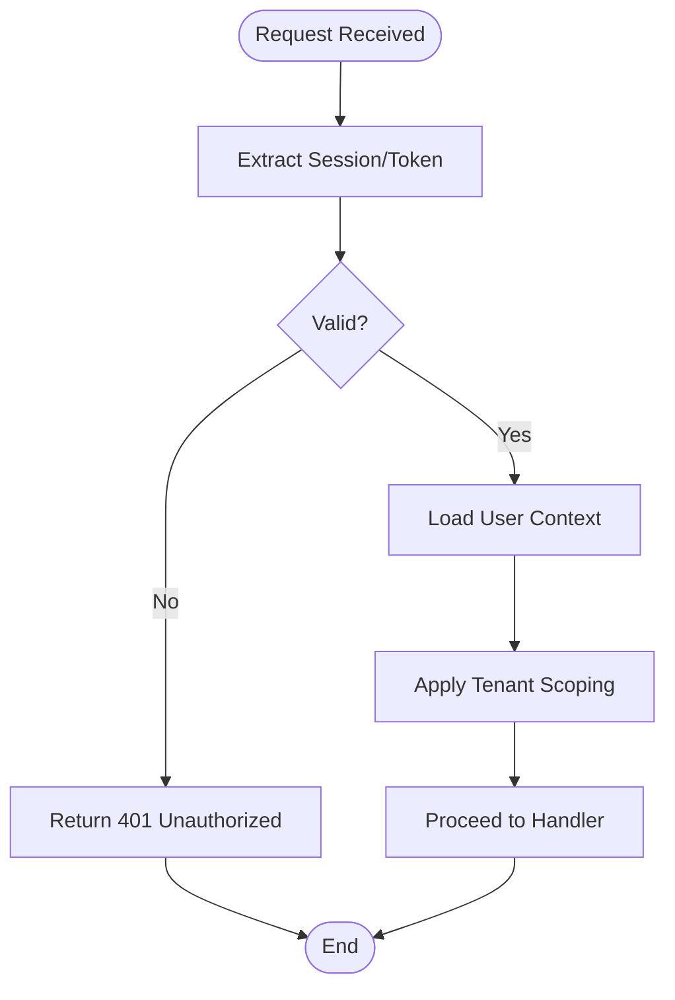
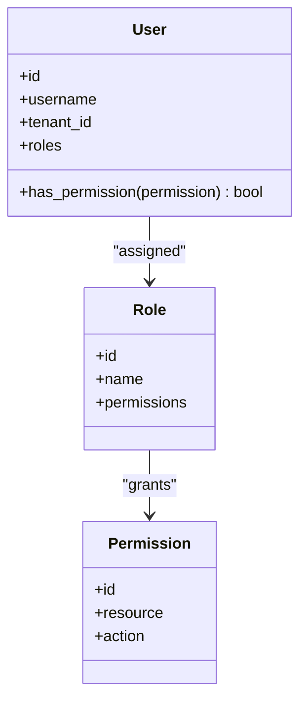
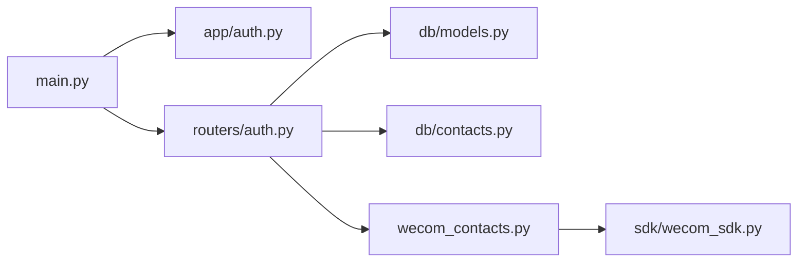

# Authentication & Authorization

<cite>
**Referenced Files in This Document**
- [main.py](file://backend/app/main.py)
- [auth.py](file://backend/app/auth.py)
- [auth.py](file://backend/app/routers/auth.py)
- [models.py](file://backend/app/db/models.py)
- [contacts.py](file://backend/app/db/contacts.py)
- [wecom_contacts.py](file://backend/app/wecom_contacts.py)
- [wecom_sdk.py](file://backend/app/sdk/wecom_sdk.py)
- [test_auth.py](file://backend/tests/test_auth.py)
- [test_password_auth.py](file://backend/tests/test_password_auth.py)
- [test_tenant_isolation.py](file://backend/tests/test_tenant_isolation.py)
- [test_contact_sync.py](file://backend/tests/test_contact_sync.py)
</cite>

## Table of Contents
1. [Introduction](#introduction)
2. [Project Structure](#project-structure)
3. [Core Components](#core-components)
4. [Architecture Overview](#architecture-overview)
5. [Detailed Component Analysis](#detailed-component-analysis)
6. [Dependency Analysis](#dependency-analysis)
7. [Performance Considerations](#performance-considerations)
8. [Troubleshooting Guide](#troubleshooting-guide)
9. [Conclusion](#conclusion)

## Introduction
This document explains the authentication middleware, session management, and role-based access control (RBAC) implemented in the backend application. It covers user authentication flows, permission checks, security headers, CSRF protection, input validation patterns, contact synchronization, user profile management, and tenant isolation. The goal is to provide both a high-level understanding and code-level insights for developers and operators.

## Project Structure
The authentication and authorization features are primarily implemented under:
- Application entrypoint and middleware configuration
- Authentication utilities and dependency injection
- Auth router endpoints
- Data models for users, roles, and tenants
- WeCom integration for contacts and events
- Tests validating auth flows, password auth, tenant isolation, and contact sync

**Diagram sources**
- [main.py](file://backend/app/main.py)
- [auth.py](file://backend/app/auth.py)
- [auth.py](file://backend/app/routers/auth.py)
- [models.py](file://backend/app/db/models.py)
- [contacts.py](file://backend/app/db/contacts.py)
- [wecom_contacts.py](file://backend/app/wecom_contacts.py)
- [wecom_sdk.py](file://backend/app/sdk/wecom_sdk.py)

**Section sources**
- [main.py](file://backend/app/main.py)
- [auth.py](file://backend/app/auth.py)
- [auth.py](file://backend/app/routers/auth.py)
- [models.py](file://backend/app/db/models.py)
- [contacts.py](file://backend/app/db/contacts.py)
- [wecom_contacts.py](file://backend/app/wecom_contacts.py)
- [wecom_sdk.py](file://backend/app/sdk/wecom_sdk.py)

## Core Components
- Authentication middleware: Enforces login state, sets current user context, and applies tenant scoping where applicable.
- Session management: Uses secure cookies or server-side sessions to maintain authenticated state across requests.
- RBAC: Role definitions and permission checks integrated into request handlers via dependencies.
- Auth endpoints: Login, logout, token/session issuance, and profile operations.
- Tenant isolation: Ensures data access is scoped to the active tenant.
- Contact synchronization: Integrates with WeCom to sync employee/contact data into local storage.

Key responsibilities:
- Validate credentials and issue sessions/tokens
- Protect routes with role/permission checks
- Enforce tenant boundaries on all queries
- Provide safe defaults for security headers and CSRF handling
- Validate inputs rigorously before processing

**Section sources**
- [auth.py](file://backend/app/auth.py)
- [auth.py](file://backend/app/routers/auth.py)
- [models.py](file://backend/app/db/models.py)
- [contacts.py](file://backend/app/db/contacts.py)
- [wecom_contacts.py](file://backend/app/wecom_contacts.py)
- [wecom_sdk.py](file://backend/app/sdk/wecom_sdk.py)

## Architecture Overview
The authentication flow integrates FastAPI-style middleware and routers with database-backed user and role models, and optional WeCom identity sources.

**Diagram sources**
- [main.py](file://backend/app/main.py)
- [auth.py](file://backend/app/auth.py)
- [auth.py](file://backend/app/routers/auth.py)
- [models.py](file://backend/app/db/models.py)
- [wecom_sdk.py](file://backend/app/sdk/wecom_sdk.py)

## Detailed Component Analysis

### Authentication Middleware
Responsibilities:
- Extracts session or token from incoming requests
- Validates session integrity and expiration
- Populates current user context for downstream handlers
- Applies tenant scoping based on user’s tenant membership

Security considerations:
- Rejects invalid or expired sessions promptly
- Fails closed when user context cannot be resolved
- Avoids leaking sensitive information in error responses

**Diagram sources**
- [main.py](file://backend/app/main.py)
- [auth.py](file://backend/app/auth.py)

**Section sources**
- [main.py](file://backend/app/main.py)
- [auth.py](file://backend/app/auth.py)

### Session Management
Features:
- Secure cookie settings (httpOnly, secure, sameSite)
- Session store backed by database or in-memory cache depending on environment
- Rotation and revocation support for logout and security incidents

Best practices:
- Use short-lived sessions with refresh mechanisms if tokens are used
- Bind sessions to client attributes (e.g., IP/User-Agent) when appropriate
- Ensure consistent session serialization across processes

**Section sources**
- [auth.py](file://backend/app/auth.py)

### Role-Based Access Control (RBAC)
Design:
- Roles and permissions defined in models
- Dependency-injected permission checks in route handlers
- Fine-grained checks for resource-level access (e.g., tenant-scoped resources)

Implementation patterns:
- Centralized permission helper functions
- Decorators or dependencies that enforce required roles
- Default deny unless explicitly allowed

**Diagram sources**
- [models.py](file://backend/app/db/models.py)

**Section sources**
- [models.py](file://backend/app/db/models.py)
- [auth.py](file://backend/app/auth.py)

### Auth Endpoints
Endpoints typically include:
- Login: Accepts credentials, validates, issues session/token
- Logout: Invalidates session/token
- Profile: Returns current user info (with RBAC checks)
- Password change: Updates credentials securely

Input validation:
- Strict schemas for payloads
- Rate limiting on sensitive endpoints
- Sanitization and normalization of inputs

**Section sources**
- [auth.py](file://backend/app/routers/auth.py)
- [auth.py](file://backend/app/auth.py)

### Tenant Isolation
Mechanisms:
- Every query is automatically scoped to the active tenant
- User-to-tenant membership enforced at middleware level
- Cross-tenant access denied by default

Data model implications:
- Entities carry tenant identifiers
- Indexes and constraints ensure efficient tenant-scoped lookups

**Section sources**
- [models.py](file://backend/app/db/models.py)
- [auth.py](file://backend/app/auth.py)

### Contact Synchronization
Workflow:
- Triggered by admin action or scheduled job
- Fetches employee/contact list from WeCom via SDK
- Upserts local records while preserving history
- Maps display names and roles to local entities

Error handling:
- Retries on transient failures
- Idempotent upserts to avoid duplicates
- Audit logs for sync operations

**Section sources**
- [wecom_contacts.py](file://backend/app/wecom_contacts.py)
- [contacts.py](file://backend/app/db/contacts.py)
- [wecom_sdk.py](file://backend/app/sdk/wecom_sdk.py)

### Security Headers and CSRF Protection
Headers:
- Content-Security-Policy
- X-Content-Type-Options
- X-Frame-Options
- Strict-Transport-Security (when HTTPS enabled)
- Referrer-Policy and Permissions-Policy

CSRF:
- Double-submit cookie or SameSite=Strict/Lax strategy
- Token-based CSRF for state-changing requests
- Validation on POST/PUT/DELETE endpoints

**Section sources**
- [main.py](file://backend/app/main.py)
- [auth.py](file://backend/app/auth.py)

### Input Validation Patterns
Patterns:
- Pydantic models for request/response schemas
- Field-level validators for emails, IDs, and enums
- Whitelisting allowed characters for free-text fields
- Rejection of oversized payloads early

**Section sources**
- [auth.py](file://backend/app/routers/auth.py)
- [models.py](file://backend/app/db/models.py)

## Dependency Analysis

**Diagram sources**
- [main.py](file://backend/app/main.py)
- [auth.py](file://backend/app/auth.py)
- [auth.py](file://backend/app/routers/auth.py)
- [models.py](file://backend/app/db/models.py)
- [contacts.py](file://backend/app/db/contacts.py)
- [wecom_contacts.py](file://backend/app/wecom_contacts.py)
- [wecom_sdk.py](file://backend/app/sdk/wecom_sdk.py)

**Section sources**
- [main.py](file://backend/app/main.py)
- [auth.py](file://backend/app/auth.py)
- [auth.py](file://backend/app/routers/auth.py)
- [models.py](file://backend/app/db/models.py)
- [contacts.py](file://backend/app/db/contacts.py)
- [wecom_contacts.py](file://backend/app/wecom_contacts.py)
- [wecom_sdk.py](file://backend/app/sdk/wecom_sdk.py)

## Performance Considerations
- Minimize DB round-trips by batching user/role lookups
- Cache frequently accessed role/permission mappings
- Use connection pooling and proper timeouts
- Avoid heavy computations in middleware; defer to handlers
- Paginate large contact sync results and process incrementally

[No sources needed since this section provides general guidance]

## Troubleshooting Guide
Common issues:
- 401 Unauthorized due to missing or expired session
- 403 Forbidden from insufficient roles/permissions
- Tenant isolation errors when accessing cross-tenant data
- Contact sync failures due to API rate limits or network errors

Debugging steps:
- Inspect session cookies and tokens
- Enable request logging for auth middleware
- Verify tenant membership and role assignments
- Check WeCom SDK connectivity and credentials

**Section sources**
- [test_auth.py](file://backend/tests/test_auth.py)
- [test_password_auth.py](file://backend/tests/test_password_auth.py)
- [test_tenant_isolation.py](file://backend/tests/test_tenant_isolation.py)
- [test_contact_sync.py](file://backend/tests/test_contact_sync.py)

## Conclusion
The authentication and authorization system combines robust middleware, secure session management, and fine-grained RBAC to protect resources within tenant boundaries. Contact synchronization integrates seamlessly with WeCom while maintaining data integrity. Adhering to the outlined security best practices ensures a resilient and scalable platform.

[No sources needed since this section summarizes without analyzing specific files]