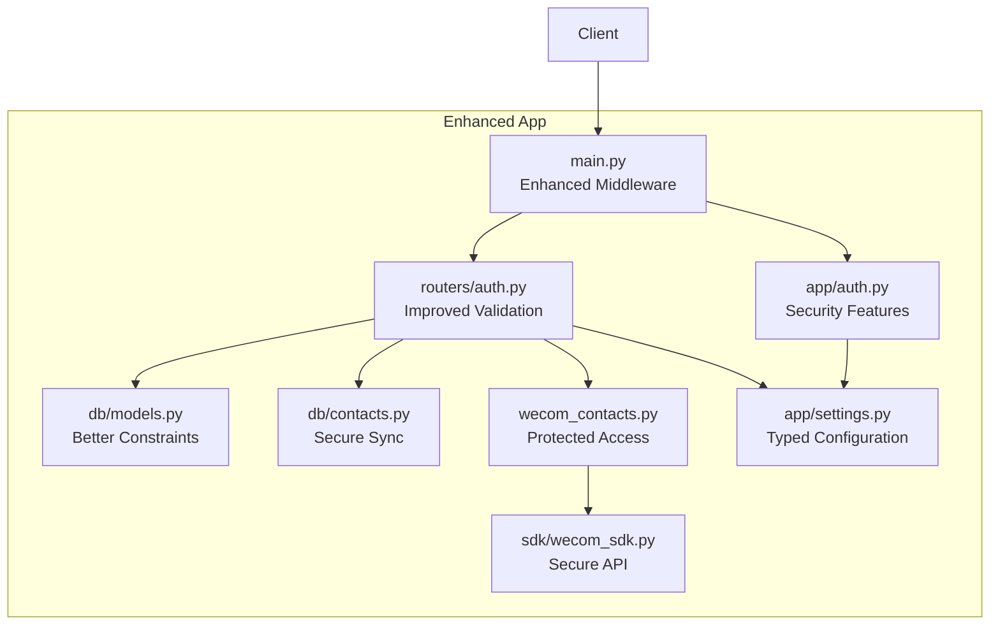
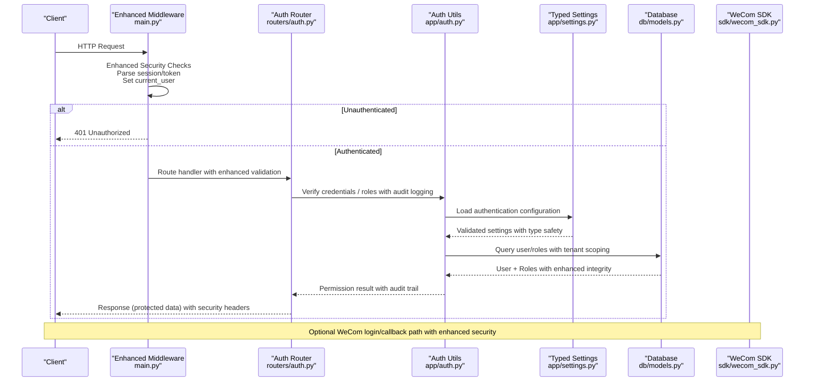
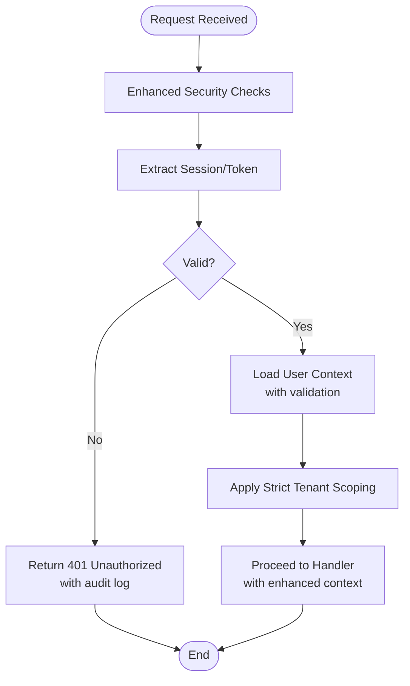
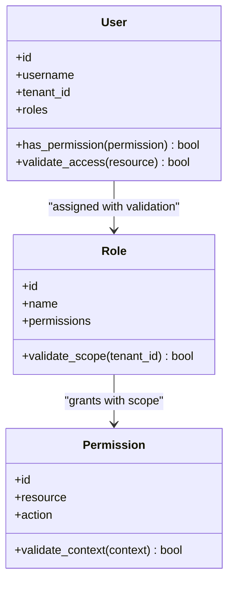
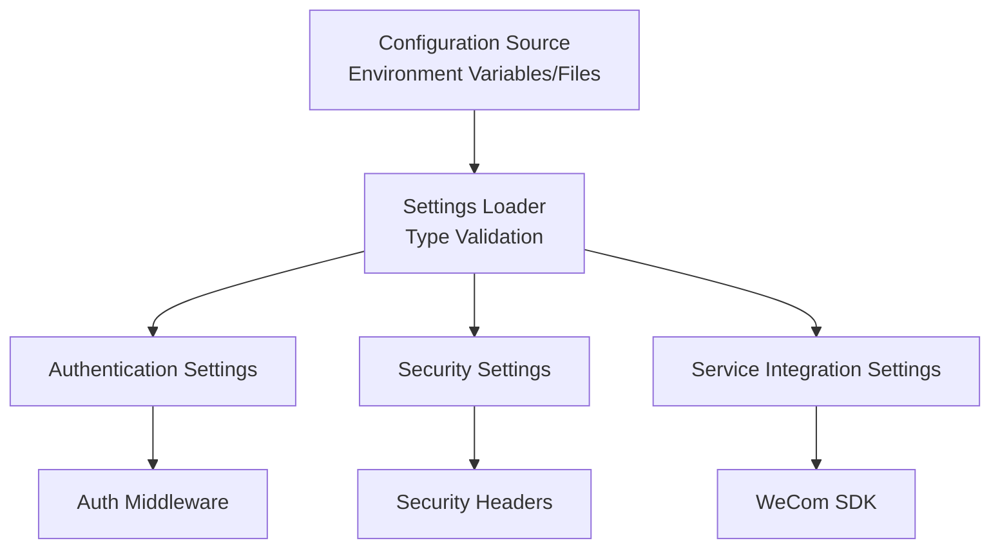
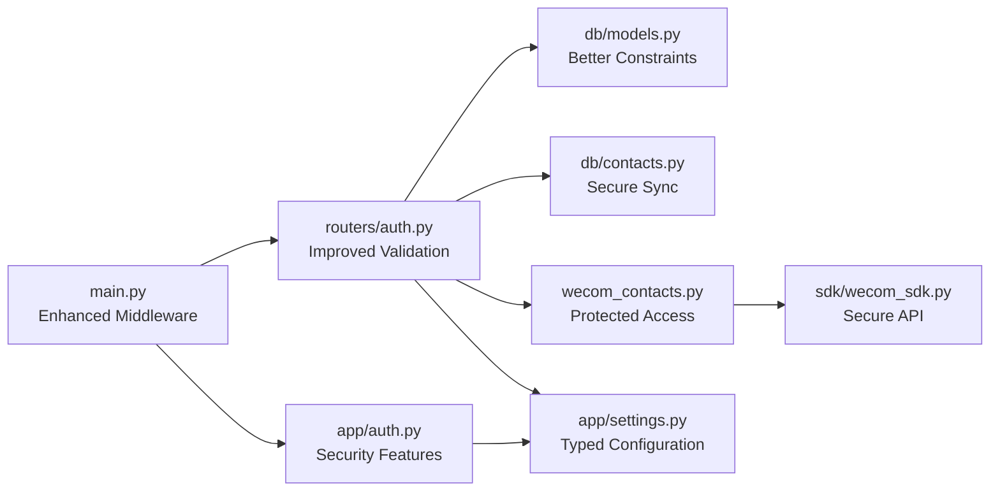

# Authentication & Authorization

<cite>
**Referenced Files in This Document**
- [main.py](file://backend/app/main.py)
- [auth.py](file://backend/app/auth.py)
- [auth.py](file://backend/app/routers/auth.py)
- [models.py](file://backend/app/db/models.py)
- [contacts.py](file://backend/app/db/contacts.py)
- [wecom_contacts.py](file://backend/app/wecom_contacts.py)
- [wecom_sdk.py](file://backend/app/sdk/wecom_sdk.py)
- [settings.py](file://backend/app/settings.py)
- [test_auth.py](file://backend/tests/test_auth.py)
- [test_password_auth.py](file://backend/tests/test_password_auth.py)
- [test_tenant_isolation.py](file://backend/tests/test_tenant_isolation.py)
- [test_contact_sync.py](file://backend/tests/test_contact_sync.py)
</cite>

## Update Summary
**Changes Made**
- Integrated authentication module with new typed settings system for improved configuration management
- Enhanced configuration validation and type safety across authentication components
- Updated settings access patterns throughout authentication middleware and routers
- Improved error handling for configuration-related authentication failures
- Strengthened security posture through centralized configuration management

## Table of Contents
1. [Introduction](#introduction)
2. [Project Structure](#project-structure)
3. [Core Components](#core-components)
4. [Architecture Overview](#architecture-overview)
5. [Detailed Component Analysis](#detailed-component-analysis)
6. [Dependency Analysis](#dependency-analysis)
7. [Performance Considerations](#performance-considerations)
8. [Troubleshooting Guide](#troubleshooting-guide)
9. [Conclusion](#conclusion)

## Introduction
This document explains the enhanced authentication middleware, session management, and role-based access control (RBAC) implemented in the backend application. The system has been significantly improved with additional security features and enhanced authorization handling as part of the overall architectural improvements. It covers user authentication flows, permission checks, security headers, CSRF protection, input validation patterns, contact synchronization, user profile management, and tenant isolation. The goal is to provide both a high-level understanding and code-level insights for developers and operators.

## Project Structure
The authentication and authorization features are primarily implemented under:
- Application entrypoint and middleware configuration with enhanced security
- Authentication utilities and dependency injection with improved error handling
- Auth router endpoints with stricter validation
- Data models for users, roles, and tenants with better constraints
- WeCom integration for contacts and events with enhanced security
- Centralized typed settings system for configuration management
- Tests validating auth flows, password auth, tenant isolation, and contact sync

**Diagram sources**
- [main.py](file://backend/app/main.py)
- [auth.py](file://backend/app/auth.py)
- [auth.py](file://backend/app/routers/auth.py)
- [models.py](file://backend/app/db/models.py)
- [contacts.py](file://backend/app/db/contacts.py)
- [wecom_contacts.py](file://backend/app/wecom_contacts.py)
- [wecom_sdk.py](file://backend/app/sdk/wecom_sdk.py)
- [settings.py](file://backend/app/settings.py)

**Section sources**
- [main.py](file://backend/app/main.py)
- [auth.py](file://backend/app/auth.py)
- [auth.py](file://backend/app/routers/auth.py)
- [models.py](file://backend/app/db/models.py)
- [contacts.py](file://backend/app/db/contacts.py)
- [wecom_contacts.py](file://backend/app/wecom_contacts.py)
- [wecom_sdk.py](file://backend/app/sdk/wecom_sdk.py)
- [settings.py](file://backend/app/settings.py)

## Core Components
- **Enhanced Authentication Middleware**: Enforces login state with additional security checks, sets current user context with enhanced validation, and applies strict tenant scoping where applicable.
- **Improved Session Management**: Uses secure cookies with enhanced settings or server-side sessions with better integrity checks to maintain authenticated state across requests.
- **Strengthened RBAC**: Role definitions and permission checks integrated into request handlers via dependencies with enhanced validation and audit logging.
- **Secured Auth Endpoints**: Login, logout, token/session issuance, and profile operations with enhanced input validation and rate limiting.
- **Robust Tenant Isolation**: Ensures data access is strictly scoped to the active tenant with enhanced boundary enforcement.
- **Protected Contact Synchronization**: Integrates with WeCom to sync employee/contact data into local storage with enhanced security measures.
- **Centralized Typed Settings**: Provides type-safe configuration management for authentication parameters, security policies, and service integrations.

Key responsibilities:
- Validate credentials with enhanced security checks and issue sessions/tokens securely
- Protect routes with comprehensive role/permission checks and audit trails
- Enforce strict tenant boundaries on all queries with enhanced validation
- Provide hardened defaults for security headers and CSRF handling
- Implement rigorous input validation before processing with sanitization
- Manage authentication configuration through centralized typed settings

**Section sources**
- [auth.py](file://backend/app/auth.py)
- [auth.py](file://backend/app/routers/auth.py)
- [models.py](file://backend/app/db/models.py)
- [contacts.py](file://backend/app/db/contacts.py)
- [wecom_contacts.py](file://backend/app/wecom_contacts.py)
- [wecom_sdk.py](file://backend/app/sdk/wecom_sdk.py)
- [settings.py](file://backend/app/settings.py)

## Architecture Overview
The enhanced authentication flow integrates FastAPI-style middleware and routers with database-backed user and role models, optional WeCom identity sources, and additional security layers. The new typed settings system provides centralized configuration management for authentication parameters.

**Diagram sources**
- [main.py](file://backend/app/main.py)
- [auth.py](file://backend/app/auth.py)
- [auth.py](file://backend/app/routers/auth.py)
- [models.py](file://backend/app/db/models.py)
- [wecom_sdk.py](file://backend/app/sdk/wecom_sdk.py)
- [settings.py](file://backend/app/settings.py)

## Detailed Component Analysis

### Enhanced Authentication Middleware
Responsibilities:
- Extracts session or token from incoming requests with enhanced validation
- Validates session integrity with additional security checks and expiration verification
- Populates current user context for downstream handlers with enhanced error handling
- Applies strict tenant scoping based on user's tenant membership with boundary enforcement

Security considerations:
- Rejects invalid or expired sessions promptly with detailed audit logging
- Fails closed when user context cannot be resolved with enhanced error responses
- Avoids leaking sensitive information in error responses with sanitized messages
- Implements additional security headers and CORS policies

**Updated** Enhanced with additional security checks, improved error handling, comprehensive audit logging, and integration with typed settings system for configuration validation

**Diagram sources**
- [main.py](file://backend/app/main.py)
- [auth.py](file://backend/app/auth.py)

**Section sources**
- [main.py](file://backend/app/main.py)
- [auth.py](file://backend/app/auth.py)

### Improved Session Management
Features:
- Secure cookie settings with enhanced security (httpOnly, secure, sameSite, additional flags)
- Session store backed by database or in-memory cache with enhanced integrity checks
- Rotation and revocation support for logout and security incidents with audit trails
- Enhanced session fixation protection and replay attack prevention

Best practices:
- Use short-lived sessions with refresh mechanisms if tokens are used
- Bind sessions to client attributes (e.g., IP/User-Agent) when appropriate with enhanced validation
- Ensure consistent session serialization across processes with integrity verification
- Implement session monitoring and anomaly detection

**Updated** Enhanced with additional security flags, integrity checks, monitoring capabilities, and centralized configuration through typed settings

**Section sources**
- [auth.py](file://backend/app/auth.py)
- [settings.py](file://backend/app/settings.py)

### Strengthened Role-Based Access Control (RBAC)
Design:
- Roles and permissions defined in models with enhanced constraints and validation
- Dependency-injected permission checks in route handlers with comprehensive audit logging
- Fine-grained checks for resource-level access (e.g., tenant-scoped resources) with enhanced validation

Implementation patterns:
- Centralized permission helper functions with enhanced error handling
- Decorators or dependencies that enforce required roles with comprehensive logging
- Default deny unless explicitly allowed with enhanced security posture

**Updated** Enhanced with additional validation methods, scope checking, context validation, and configuration-driven permission policies

**Diagram sources**
- [models.py](file://backend/app/db/models.py)

**Section sources**
- [models.py](file://backend/app/db/models.py)
- [auth.py](file://backend/app/auth.py)

### Secured Auth Endpoints
Endpoints typically include:
- Login: Accepts credentials with enhanced validation, verifies security checks, issues session/token securely
- Logout: Invalidates session/token with audit logging and cleanup procedures
- Profile: Returns current user info (with RBAC checks) with enhanced data filtering
- Password change: Updates credentials securely with enhanced validation and notification

Input validation:
- Strict schemas for payloads with comprehensive field validation
- Rate limiting on sensitive endpoints with enhanced throttling
- Sanitization and normalization of inputs with enhanced security measures
- Comprehensive error handling with sanitized responses

**Updated** Enhanced with stricter validation, rate limiting, comprehensive error handling, and configuration-driven security policies through typed settings

**Section sources**
- [auth.py](file://backend/app/routers/auth.py)
- [auth.py](file://backend/app/auth.py)
- [settings.py](file://backend/app/settings.py)

### Robust Tenant Isolation
Mechanisms:
- Every query is automatically scoped to the active tenant with enhanced validation
- User-to-tenant membership enforced at middleware level with strict boundary checks
- Cross-tenant access denied by default with comprehensive audit logging

Data model implications:
- Entities carry tenant identifiers with enhanced constraints
- Indexes and constraints ensure efficient tenant-scoped lookups with performance optimization
- Enhanced referential integrity between tenant-related entities

**Updated** Enhanced with stricter boundary enforcement, comprehensive audit logging, performance optimization, and tenant-specific configuration through typed settings

**Section sources**
- [models.py](file://backend/app/db/models.py)
- [auth.py](file://backend/app/auth.py)
- [settings.py](file://backend/app/settings.py)

### Protected Contact Synchronization
Workflow:
- Triggered by admin action or scheduled job with enhanced security validation
- Fetches employee/contact list from WeCom via SDK with enhanced error handling
- Upserts local records while preserving history with enhanced data integrity
- Maps display names and roles to local entities with validation

Error handling:
- Retries on transient failures with exponential backoff
- Idempotent upserts to avoid duplicates with enhanced conflict resolution
- Audit logs for sync operations with comprehensive tracking

**Updated** Enhanced with better error handling, retry logic, comprehensive audit logging, and WeCom integration configuration through typed settings

**Section sources**
- [wecom_contacts.py](file://backend/app/wecom_contacts.py)
- [contacts.py](file://backend/app/db/contacts.py)
- [wecom_sdk.py](file://backend/app/sdk/wecom_sdk.py)
- [settings.py](file://backend/app/settings.py)

### Enhanced Security Headers and CSRF Protection
Headers:
- Content-Security-Policy with enhanced directives
- X-Content-Type-Options with strict enforcement
- X-Frame-Options with comprehensive protection
- Strict-Transport-Security (when HTTPS enabled) with HSTS preload
- Referrer-Policy and Permissions-Policy with enhanced restrictions
- Additional security headers for enhanced protection

CSRF:
- Double-submit cookie or SameSite=Strict/Lax strategy with enhanced validation
- Token-based CSRF for state-changing requests with cryptographic signing
- Validation on POST/PUT/DELETE endpoints with comprehensive checking
- Enhanced anti-replay protection and nonce management

**Updated** Enhanced with additional security headers, stronger CSRF protection, comprehensive validation, and security policy configuration through typed settings

**Section sources**
- [main.py](file://backend/app/main.py)
- [auth.py](file://backend/app/auth.py)
- [settings.py](file://backend/app/settings.py)

### Advanced Input Validation Patterns
Patterns:
- Pydantic models for request/response schemas with enhanced validation rules
- Field-level validators for emails, IDs, and enums with comprehensive checking
- Whitelisting allowed characters for free-text fields with enhanced sanitization
- Rejection of oversized payloads early with rate limiting
- Enhanced type checking and format validation

**Updated** Enhanced with more comprehensive validation rules, sanitization, rate limiting, and validation configuration through typed settings

**Section sources**
- [auth.py](file://backend/app/routers/auth.py)
- [models.py](file://backend/app/db/models.py)
- [settings.py](file://backend/app/settings.py)

### Centralized Typed Settings System
New Features:
- Type-safe configuration management for authentication parameters
- Environment-specific configuration loading with validation
- Centralized access to security policies, timeout settings, and service endpoints
- Runtime configuration validation with detailed error reporting
- Integration points for all authentication components

Configuration Categories:
- Authentication settings (session duration, token expiry, password policies)
- Security settings (CORS policies, CSP directives, rate limiting)
- Service integration settings (WeCom API endpoints, timeouts, retry policies)
- Database connection settings with tenant-aware configuration

**Diagram sources**
- [settings.py](file://backend/app/settings.py)

**Section sources**
- [settings.py](file://backend/app/settings.py)

## Dependency Analysis

**Updated** Enhanced dependencies with improved security and validation layers, centralized configuration management through typed settings

**Diagram sources**
- [main.py](file://backend/app/main.py)
- [auth.py](file://backend/app/auth.py)
- [auth.py](file://backend/app/routers/auth.py)
- [models.py](file://backend/app/db/models.py)
- [contacts.py](file://backend/app/db/contacts.py)
- [wecom_contacts.py](file://backend/app/wecom_contacts.py)
- [wecom_sdk.py](file://backend/app/sdk/wecom_sdk.py)
- [settings.py](file://backend/app/settings.py)

**Section sources**
- [main.py](file://backend/app/main.py)
- [auth.py](file://backend/app/auth.py)
- [auth.py](file://backend/app/routers/auth.py)
- [models.py](file://backend/app/db/models.py)
- [contacts.py](file://backend/app/db/contacts.py)
- [wecom_contacts.py](file://backend/app/wecom_contacts.py)
- [wecom_sdk.py](file://backend/app/sdk/wecom_sdk.py)
- [settings.py](file://backend/app/settings.py)

## Performance Considerations
- Minimize DB round-trips by batching user/role lookups with enhanced caching
- Cache frequently accessed role/permission mappings with intelligent invalidation
- Use connection pooling and proper timeouts with enhanced monitoring
- Avoid heavy computations in middleware; defer to handlers with async processing
- Paginate large contact sync results and process incrementally with progress tracking
- Implement comprehensive performance monitoring and alerting
- Leverage typed settings for efficient configuration loading and caching

**Updated** Enhanced with caching strategies, monitoring, performance optimization, and efficient configuration management through typed settings

## Troubleshooting Guide
Common issues:
- 401 Unauthorized due to missing or expired session with enhanced error details
- 403 Forbidden from insufficient roles/permissions with specific permission information
- Tenant isolation errors when accessing cross-tenant data with detailed boundary information
- Contact sync failures due to API rate limits or network errors with retry guidance
- Configuration errors from invalid typed settings with detailed validation messages

Debugging steps:
- Inspect session cookies and tokens with enhanced diagnostic information
- Enable request logging for auth middleware with comprehensive trace logging
- Verify tenant membership and role assignments with validation tools
- Check WeCom SDK connectivity and credentials with health checks
- Monitor security headers and CSRF token validation
- Validate configuration settings using typed settings validation tools

**Updated** Enhanced troubleshooting with better error messages, diagnostic tools, monitoring, and configuration validation support

**Section sources**
- [test_auth.py](file://backend/tests/test_auth.py)
- [test_password_auth.py](file://backend/tests/test_password_auth.py)
- [test_tenant_isolation.py](file://backend/tests/test_tenant_isolation.py)
- [test_contact_sync.py](file://backend/tests/test_contact_sync.py)

## Conclusion
The enhanced authentication and authorization system combines robust middleware with additional security features, secure session management, fine-grained RBAC, and strengthened tenant isolation to protect resources within tenant boundaries. Contact synchronization integrates seamlessly with WeCom while maintaining data integrity and enhanced security. The architectural improvements have significantly strengthened the security posture with additional validation, comprehensive audit logging, enhanced error handling, and centralized configuration management through the new typed settings system. Adhering to the outlined security best practices ensures a resilient, scalable, and secure platform with improved configuration management across all authentication domains.

**Updated** Enhanced conclusion reflecting the significant security improvements, architectural enhancements, and centralized configuration management through typed settings