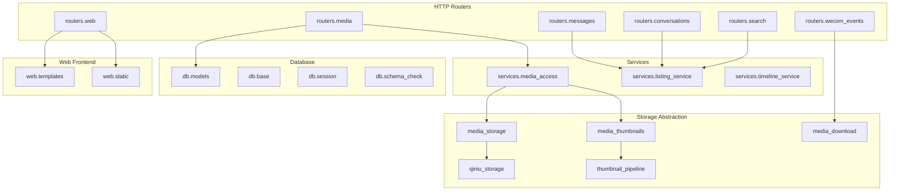
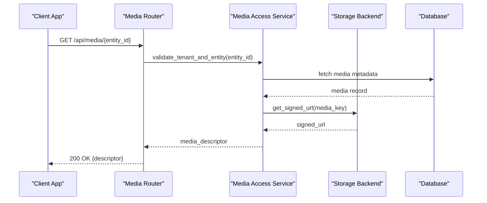
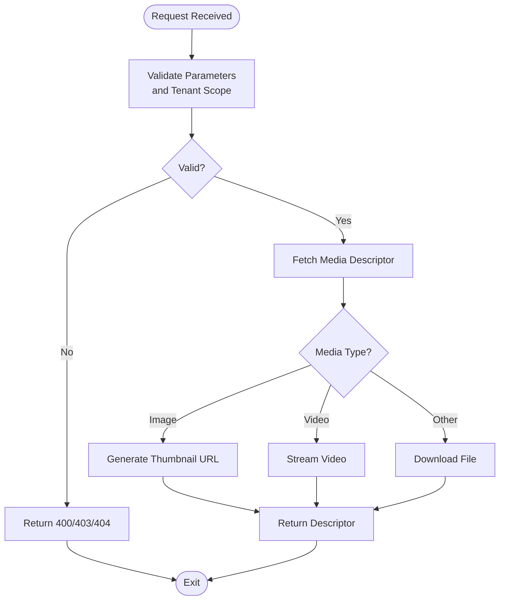
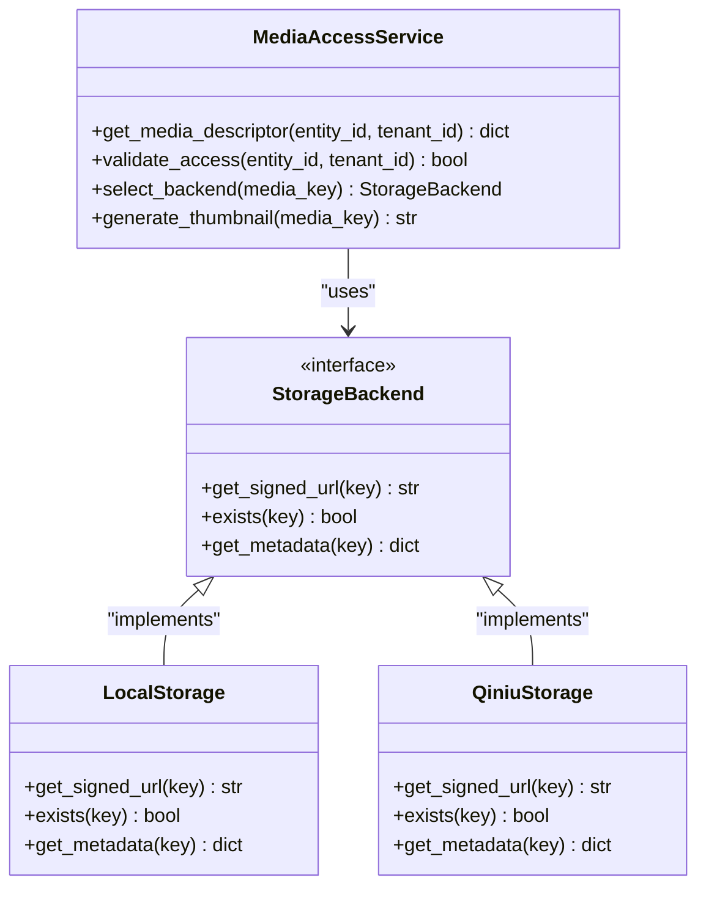
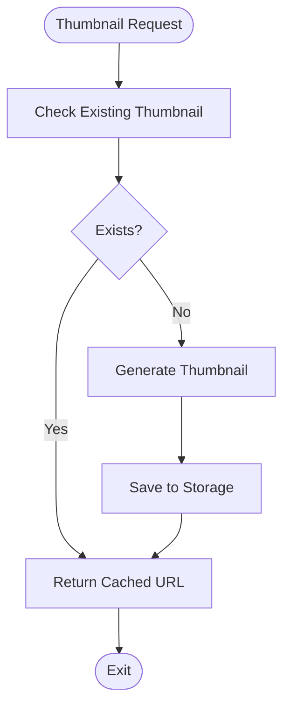
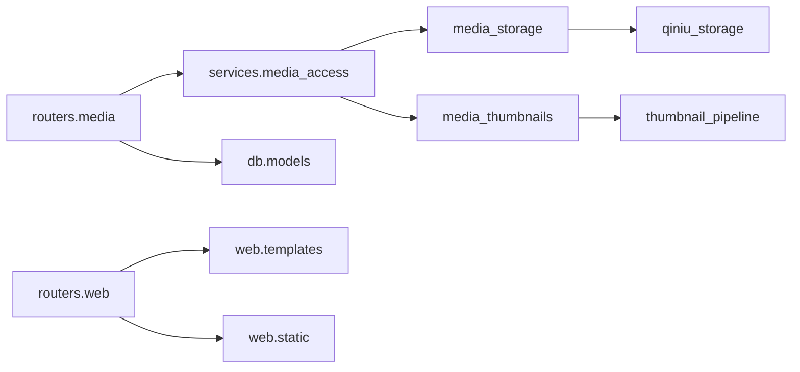

# Media Access Service Architecture

<cite>
**Referenced Files in This Document**
- [main.py](file://backend/app/main.py)
- [media.py](file://backend/app/routers/media.py)
- [media_access.py](file://backend/app/services/media_access.py)
- [media_storage.py](file://backend/app/media_storage.py)
- [qiniu_storage.py](file://backend/app/qiniu_storage.py)
- [media_thumbnails.py](file://backend/app/media_thumbnails.py)
- [thumbnail_pipeline.py](file://backend/app/thumbnail_pipeline.py)
- [media_download.py](file://backend/app/media_download.py)
- [models.py](file://backend/app/db/models.py)
- [base.py](file://backend/app/db/base.py)
- [session.py](file://backend/app/db/session.py)
- [schema_check.py](file://backend/app/db/schema_check.py)
- [auth.py](file://backend/app/auth.py)
- [wecom_events.py](file://backend/app/routers/wecom_events.py)
- [messages.py](file://backend/app/routers/messages.py)
- [conversations.py](file://backend/app/routers/conversations.py)
- [search.py](file://backend/app/routers/search.py)
- [web.py](file://backend/app/routers/web.py)
- [listing_service.py](file://backend/app/services/listing_service.py)
- [timeline_service.py](file://backend/app/services/timeline_service.py)
- [structured_message_parser.py](file://backend/app/structured_message_parser.py)
- [message_type_registry.py](file://backend/app/message_type_registry.py)
- [display_names.py](file://backend/app/display_names.py)
- [i18n_assets.py](file://backend/app/i18n_assets.py)
- [html_helpers.py](file://backend/app/html_helpers.py)
- [reachability_audit.py](file://backend/app/reachability_audit.py)
- [revoke_reconciliation.py](file://backend/app/revoke_reconciliation.py)
- [wecom_contacts.py](file://backend/app/wecom_contacts.py)
- [api-client.js](file://backend/app/web/static/console/api-client.js)
- [console-entry.js](file://backend/app/web/static/console/console-entry.js)
- [console-state.js](file://backend/app/web/static/console/console-state.js)
- [conversation-list.js](file://backend/app/web/static/console/conversation-list.js)
- [media-viewer.js](file://backend/app/web/static/console/media-viewer.js)
- [message-renderers.js](file://backend/app/web/static/console/message-renderers.js)
- [refresh.js](file://backend/app/web/static/console/refresh.js)
- [timeline.js](file://backend/app/web/static/console/timeline.js)
- [base.css](file://backend/app/web/static/base.css)
- [diagnostics.css](file://backend/app/web/static/diagnostics.css)
- [diagnostics.js](file://backend/app/web/static/diagnostics.js)
- [search.js](file://backend/app/web/static/search.js)
- [messages.html](file://backend/app/web/templates/messages.html)
- [message_detail.html](file://backend/app/web/templates/message_detail.html)
- [review_console.html](file://backend/app/web/templates/review_console.html)
- [search.html](file://backend/app/web/templates/search.html)
- [diagnostics.html](file://backend/app/web/templates/diagnostics.html)
</cite>

## Table of Contents
1. [Introduction](#introduction)
2. [Project Structure](#project-structure)
3. [Core Components](#core-components)
4. [Architecture Overview](#architecture-overview)
5. [Detailed Component Analysis](#detailed-component-analysis)
6. [Dependency Analysis](#dependency-analysis)
7. [Performance Considerations](#performance-considerations)
8. [Troubleshooting Guide](#troubleshooting-guide)
9. [Conclusion](#conclusion)
10. [Appendices](#appendices)

## Introduction
This document describes the Media Access Service architecture for a WeCom archive system. It explains how media assets are discovered, stored, accessed, and served to clients through a secure, tenant-scoped API. The service integrates with external storage backends (local filesystem and Qiniu Kodo), supports thumbnails, signed URLs, and caching headers, and is backed by a relational database with Alembic migrations.

## Project Structure
The backend is organized into clear layers:
- HTTP routers expose REST endpoints for media access and related features.
- Services encapsulate business logic such as media access control and listing.
- Storage abstraction provides pluggable backends (local and Qiniu).
- Database layer defines models and sessions.
- Web module serves templates and static assets for the console UI.

**Diagram sources**
- [media.py](file://backend/app/routers/media.py)
- [media_access.py](file://backend/app/services/media_access.py)
- [media_storage.py](file://backend/app/media_storage.py)
- [qiniu_storage.py](file://backend/app/qiniu_storage.py)
- [media_thumbnails.py](file://backend/app/media_thumbnails.py)
- [thumbnail_pipeline.py](file://backend/app/thumbnail_pipeline.py)
- [media_download.py](file://backend/app/media_download.py)
- [models.py](file://backend/app/db/models.py)
- [web.py](file://backend/app/routers/web.py)

**Section sources**
- [main.py](file://backend/app/main.py)
- [media.py](file://backend/app/routers/media.py)
- [media_access.py](file://backend/app/services/media_access.py)
- [media_storage.py](file://backend/app/media_storage.py)
- [qiniu_storage.py](file://backend/app/qiniu_storage.py)
- [media_thumbnails.py](file://backend/app/media_thumbnails.py)
- [thumbnail_pipeline.py](file://backend/app/thumbnail_pipeline.py)
- [media_download.py](file://backend/app/media_download.py)
- [models.py](file://backend/app/db/models.py)
- [web.py](file://backend/app/routers/web.py)

## Core Components
- Media Router: Exposes endpoints for retrieving media descriptors, signed URLs, and thumbnail links. It enforces tenant scoping and validates request parameters.
- Media Access Service: Implements authorization checks, descriptor generation, and selection of appropriate storage backend based on configuration.
- Storage Abstraction: Provides a unified interface for local filesystem and Qiniu Kodo backends, including signed URL generation and content retrieval.
- Thumbnail Pipeline: Generates and caches thumbnails for supported media types, integrating with storage backends.
- Database Models: Define entities for messages, conversations, tenants, and media metadata used by access controls and listings.
- Web Module: Renders HTML templates and serves static assets for the review console and diagnostics.

**Section sources**
- [media.py](file://backend/app/routers/media.py)
- [media_access.py](file://backend/app/services/media_access.py)
- [media_storage.py](file://backend/app/media_storage.py)
- [qiniu_storage.py](file://backend/app/qiniu_storage.py)
- [media_thumbnails.py](file://backend/app/media_thumbnails.py)
- [thumbnail_pipeline.py](file://backend/app/thumbnail_pipeline.py)
- [models.py](file://backend/app/db/models.py)
- [web.py](file://backend/app/routers/web.py)

## Architecture Overview
The Media Access Service follows a layered architecture:
- HTTP Layer: FastAPI routers handle requests, parse inputs, and return responses.
- Service Layer: Business logic for media access decisions, descriptor creation, and tenant scoping.
- Storage Layer: Pluggable backends abstract away differences between local and cloud storage.
- Data Layer: Relational models and migrations ensure data integrity and schema evolution.
- Frontend Layer: Console UI consumes APIs to display messages and media.

**Diagram sources**
- [media.py](file://backend/app/routers/media.py)
- [media_access.py](file://backend/app/services/media_access.py)
- [models.py](file://backend/app/db/models.py)
- [media_storage.py](file://backend/app/media_storage.py)

## Detailed Component Analysis

### Media Router
Responsibilities:
- Parse and validate request parameters for media access.
- Enforce tenant isolation and entity ownership.
- Return standardized media descriptors or direct download responses.

Key behaviors:
- Supports query parameters for cache control and response formatting.
- Integrates with authentication middleware for staff-only endpoints.
- Delegates actual media retrieval to the storage backend via the access service.

**Diagram sources**
- [media.py](file://backend/app/routers/media.py)
- [media_access.py](file://backend/app/services/media_access.py)
- [media_thumbnails.py](file://backend/app/media_thumbnails.py)

**Section sources**
- [media.py](file://backend/app/routers/media.py)

### Media Access Service
Responsibilities:
- Implement authorization rules for media access.
- Generate media descriptors including type, size, and availability.
- Select appropriate storage backend based on configuration.

Key behaviors:
- Validates tenant context and message ownership.
- Handles nested media contexts (e.g., rich media cards).
- Integrates with thumbnail pipeline for image/video previews.

**Diagram sources**
- [media_access.py](file://backend/app/services/media_access.py)
- [media_storage.py](file://backend/app/media_storage.py)
- [qiniu_storage.py](file://backend/app/qiniu_storage.py)

**Section sources**
- [media_access.py](file://backend/app/services/media_access.py)
- [media_storage.py](file://backend/app/media_storage.py)
- [qiniu_storage.py](file://backend/app/qiniu_storage.py)

### Thumbnail Pipeline
Responsibilities:
- Generate thumbnails for images and videos.
- Cache thumbnails in the configured storage backend.
- Provide thumbnail URLs through the media access service.

Key behaviors:
- Supports multiple output formats and sizes.
- Handles concurrent thumbnail generation safely.
- Integrates with storage backends for persistence.

**Diagram sources**
- [media_thumbnails.py](file://backend/app/media_thumbnails.py)
- [thumbnail_pipeline.py](file://backend/app/thumbnail_pipeline.py)

**Section sources**
- [media_thumbnails.py](file://backend/app/media_thumbnails.py)
- [thumbnail_pipeline.py](file://backend/app/thumbnail_pipeline.py)

### Database Models
Responsibilities:
- Define entities for messages, conversations, tenants, and media metadata.
- Support tenant isolation and relationship management.
- Enable efficient querying for media access and listing operations.

Key entities:
- Message: Represents individual chat messages with media attachments.
- Conversation: Groups messages within chat contexts.
- Tenant: Isolates data across organizations.
- MediaMetadata: Stores file information and storage locations.

**Section sources**
- [models.py](file://backend/app/db/models.py)
- [base.py](file://backend/app/db/base.py)
- [session.py](file://backend/app/db/session.py)
- [schema_check.py](file://backend/app/db/schema_check.py)

### Web Module
Responsibilities:
- Render HTML templates for the review console and diagnostics.
- Serve static assets (CSS, JavaScript) for the frontend application.
- Integrate with i18n for multi-language support.

Key components:
- Templates: HTML files for different pages (messages, search, diagnostics).
- Static Assets: CSS stylesheets and JavaScript modules.
- Console Application: Interactive web interface for reviewing archived content.

**Section sources**
- [web.py](file://backend/app/routers/web.py)
- [messages.html](file://backend/app/web/templates/messages.html)
- [message_detail.html](file://backend/app/web/templates/message_detail.html)
- [review_console.html](file://backend/app/web/templates/review_console.html)
- [search.html](file://backend/app/web/templates/search.html)
- [diagnostics.html](file://backend/app/web/templates/diagnostics.html)
- [base.css](file://backend/app/web/static/base.css)
- [diagnostics.css](file://backend/app/web/static/diagnostics.css)
- [api-client.js](file://backend/app/web/static/console/api-client.js)
- [console-entry.js](file://backend/app/web/static/console/console-entry.js)
- [console-state.js](file://backend/app/web/static/console/console-state.js)
- [conversation-list.js](file://backend/app/web/static/console/conversation-list.js)
- [media-viewer.js](file://backend/app/web/static/console/media-viewer.js)
- [message-renderers.js](file://backend/app/web/static/console/message-renderers.js)
- [refresh.js](file://backend/app/web/static/console/refresh.js)
- [timeline.js](file://backend/app/web/static/console/timeline.js)
- [diagnostics.js](file://backend/app/web/static/diagnostics.js)
- [search.js](file://backend/app/web/static/search.js)

## Dependency Analysis
The Media Access Service has well-defined dependencies:
- Routers depend on services for business logic.
- Services depend on storage abstractions and database models.
- Storage backends are interchangeable through interfaces.
- Frontend depends on API endpoints and static assets.

**Diagram sources**
- [media.py](file://backend/app/routers/media.py)
- [media_access.py](file://backend/app/services/media_access.py)
- [media_storage.py](file://backend/app/media_storage.py)
- [qiniu_storage.py](file://backend/app/qiniu_storage.py)
- [media_thumbnails.py](file://backend/app/media_thumbnails.py)
- [thumbnail_pipeline.py](file://backend/app/thumbnail_pipeline.py)
- [models.py](file://backend/app/db/models.py)
- [web.py](file://backend/app/routers/web.py)

**Section sources**
- [media.py](file://backend/app/routers/media.py)
- [media_access.py](file://backend/app/services/media_access.py)
- [media_storage.py](file://backend/app/media_storage.py)
- [qiniu_storage.py](file://backend/app/qiniu_storage.py)
- [media_thumbnails.py](file://backend/app/media_thumbnails.py)
- [thumbnail_pipeline.py](file://backend/app/thumbnail_pipeline.py)
- [models.py](file://backend/app/db/models.py)
- [web.py](file://backend/app/routers/web.py)

## Performance Considerations
- Use signed URLs to avoid direct backend storage access for large files.
- Implement caching headers for frequently accessed media.
- Generate thumbnails asynchronously to prevent blocking requests.
- Optimize database queries with proper indexing on tenant and entity IDs.
- Consider CDN integration for global media distribution.

## Troubleshooting Guide
Common issues and solutions:
- Authentication failures: Verify tenant context and user permissions.
- Storage backend errors: Check configuration and network connectivity.
- Thumbnail generation failures: Ensure input media format is supported.
- Database connection issues: Verify connection strings and credentials.
- Frontend loading problems: Check static asset paths and CORS settings.

**Section sources**
- [auth.py](file://backend/app/auth.py)
- [reachability_audit.py](file://backend/app/reachability_audit.py)
- [revoke_reconciliation.py](file://backend/app/revoke_reconciliation.py)

## Conclusion
The Media Access Service provides a robust, scalable solution for managing media assets in a WeCom archive system. Its modular architecture allows for easy extension and maintenance while ensuring security and performance through tenant isolation, signed URLs, and efficient caching strategies.

## Appendices

### API Endpoints Reference
- Media Access: GET /api/media/{entity_id} - Retrieve media descriptor and access URLs
- Thumbnail Generation: GET /api/media/{entity_id}/thumbnail - Get thumbnail URL
- Health Check: GET /health - Service health status
- Diagnostics: GET /diagnostics - System diagnostics page

### Configuration Options
- Storage Backend: local or qiniu
- Cache Control: max-age and public/private settings
- Thumbnail Settings: formats, sizes, and quality options
- Database Connection: connection string and pool settings