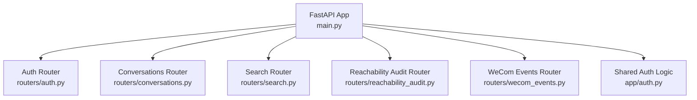
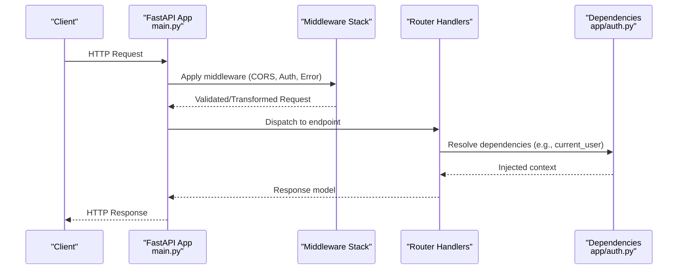
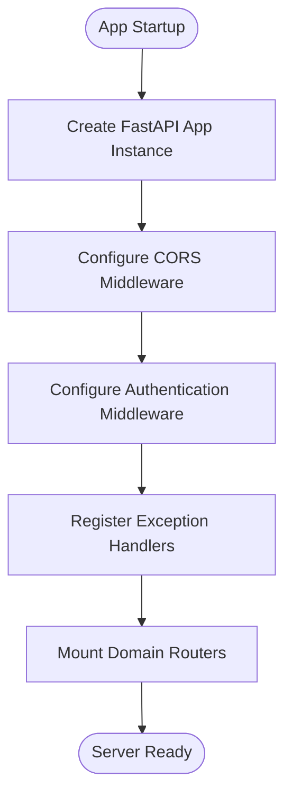
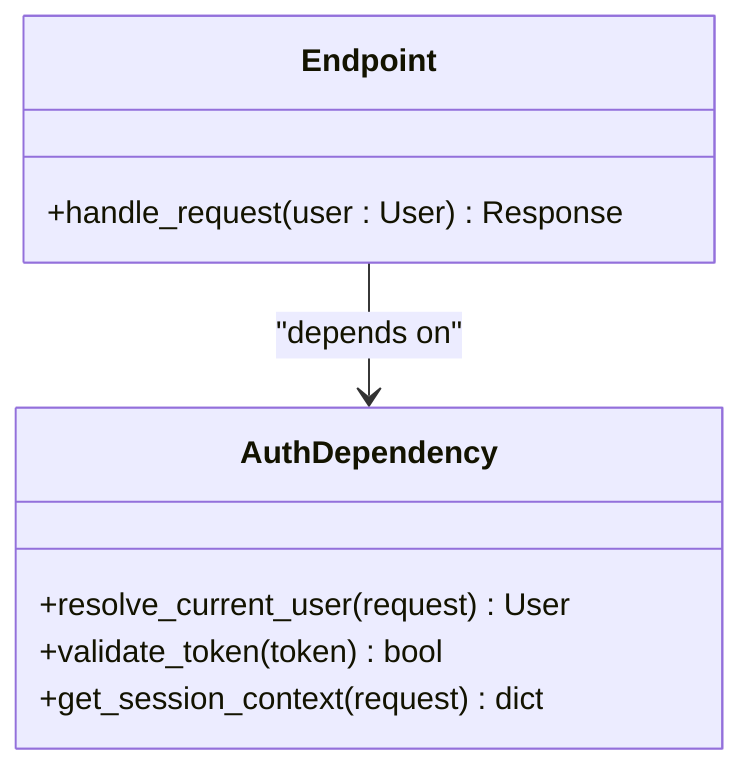
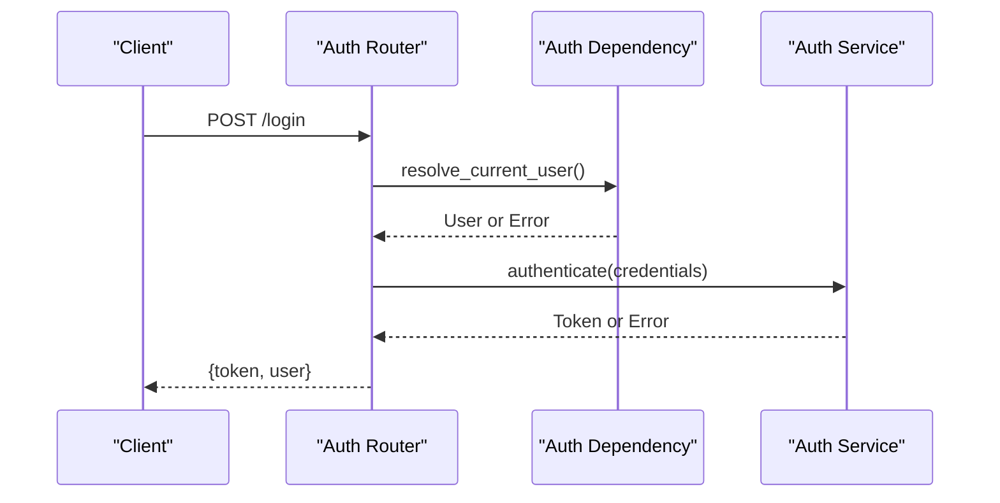
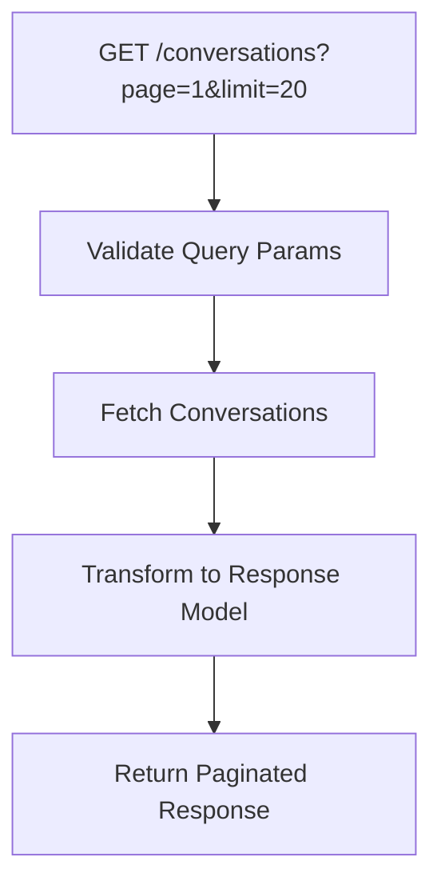
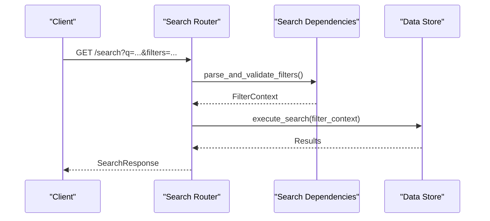
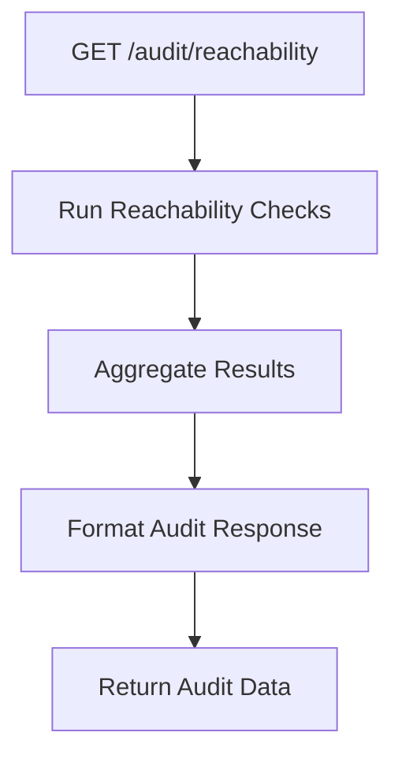
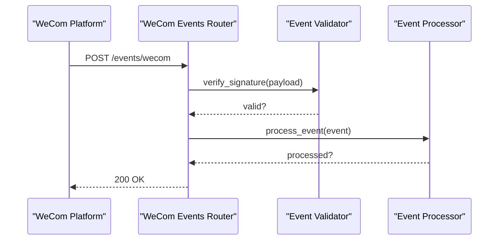
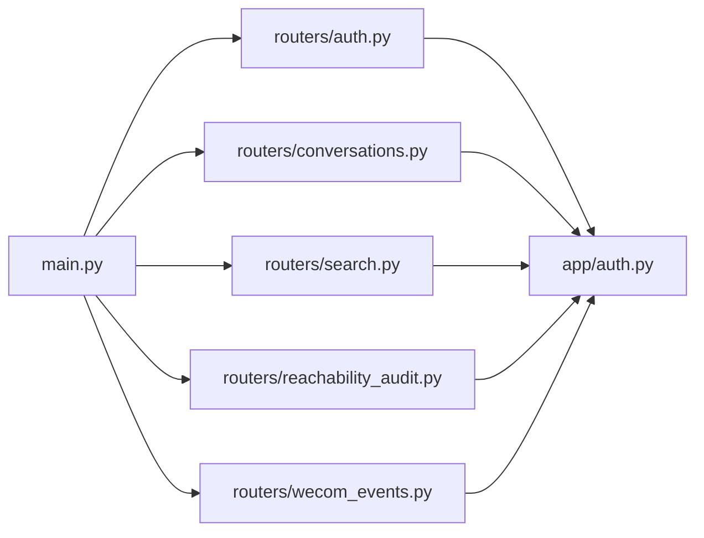

# Server & Routing

<cite>
**Referenced Files in This Document**
- [main.py](file://backend/app/main.py)
- [auth.py](file://backend/app/auth.py)
- [auth.py](file://backend/app/routers/auth.py)
- [conversations.py](file://backend/app/routers/conversations.py)
- [search.py](file://backend/app/routers/search.py)
- [reachability_audit.py](file://backend/app/routers/reachability_audit.py)
- [wecom_events.py](file://backend/app/routers/wecom_events.py)
</cite>

## Table of Contents
1. [Introduction](#introduction)
2. [Project Structure](#project-structure)
3. [Core Components](#core-components)
4. [Architecture Overview](#architecture-overview)
5. [Detailed Component Analysis](#detailed-component-analysis)
6. [Dependency Analysis](#dependency-analysis)
7. [Performance Considerations](#performance-considerations)
8. [Troubleshooting Guide](#troubleshooting-guide)
9. [Conclusion](#conclusion)

## Introduction
This document explains the FastAPI server configuration, route organization, and request handling patterns for the backend application. It focuses on how middleware is composed (authentication, CORS, error handling), how routers are structured by functional area (authentication, conversations, search, audit, WeCom events), and how request/response validation and dependency injection are applied across endpoints. It also outlines API versioning strategies used or available within the codebase.

## Project Structure
The FastAPI application is organized under the backend/app directory:
- Application entry point and middleware assembly live in main.py.
- Routers are grouped by domain: auth, conversations, search, reachability_audit, wecom_events.
- Shared authentication logic resides in app/auth.py.

**Diagram sources**
- [main.py](file://backend/app/main.py)
- [auth.py](file://backend/app/routers/auth.py)
- [conversations.py](file://backend/app/routers/conversations.py)
- [search.py](file://backend/app/routers/search.py)
- [reachability_audit.py](file://backend/app/routers/reachability_audit.py)
- [wecom_events.py](file://backend/app/routers/wecom_events.py)
- [auth.py](file://backend/app/auth.py)

**Section sources**
- [main.py](file://backend/app/main.py)
- [auth.py](file://backend/app/auth.py)
- [auth.py](file://backend/app/routers/auth.py)
- [conversations.py](file://backend/app/routers/conversations.py)
- [search.py](file://backend/app/routers/search.py)
- [reachability_audit.py](file://backend/app/routers/reachability_audit.py)
- [wecom_events.py](file://backend/app/routers/wecom_events.py)

## Core Components
- FastAPI application instance and global configuration are defined in the main module.
- Middleware stack includes CORS, authentication, and error handling hooks.
- Routers expose domain-specific endpoints with Pydantic-based request/response models.
- Dependency injection is used to provide authenticated user context and shared services.

Key responsibilities:
- main.py: Create the FastAPI app, register middleware, mount routers, configure lifespan and error handlers.
- app/auth.py: Provide authentication dependencies and helpers used by routers.
- routers/*: Define endpoint functions, validate inputs/outputs, and implement business logic.

**Section sources**
- [main.py](file://backend/app/main.py)
- [auth.py](file://backend/app/auth.py)
- [auth.py](file://backend/app/routers/auth.py)
- [conversations.py](file://backend/app/routers/conversations.py)
- [search.py](file://backend/app/routers/search.py)
- [reachability_audit.py](file://backend/app/routers/reachability_audit.py)
- [wecom_events.py](file://backend/app/routers/wecom_events.py)

## Architecture Overview
The server composes a layered architecture:
- HTTP layer: FastAPI handles routing, request parsing, response serialization, and exception mapping.
- Middleware layer: CORS, authentication, and error handling intercept requests before they reach routers.
- Router layer: Domain-specific endpoints encapsulate business logic and return validated responses.
- Dependency layer: Reusable components (e.g., current user, database sessions) are injected via FastAPI’s dependency system.

**Diagram sources**
- [main.py](file://backend/app/main.py)
- [auth.py](file://backend/app/auth.py)
- [auth.py](file://backend/app/routers/auth.py)
- [conversations.py](file://backend/app/routers/conversations.py)
- [search.py](file://backend/app/routers/search.py)
- [reachability_audit.py](file://backend/app/routers/reachability_audit.py)
- [wecom_events.py](file://backend/app/routers/wecom_events.py)

## Detailed Component Analysis

### FastAPI Application and Middleware Stack
- The application instance is created and configured in the main module.
- Middleware registration order matters: typically CORS first, then authentication, then error handling.
- Lifespan events can be used to initialize resources at startup and clean up at shutdown.
- Global exception handlers map exceptions to consistent JSON responses.

**Diagram sources**
- [main.py](file://backend/app/main.py)

**Section sources**
- [main.py](file://backend/app/main.py)

### Authentication Middleware and Dependencies
- Authentication is implemented as a dependency that extracts credentials from requests (e.g., headers, cookies).
- The dependency validates tokens or session state and injects an authenticated user object into endpoints.
- Endpoints requiring authentication depend on this dependency to enforce access control.

**Diagram sources**
- [auth.py](file://backend/app/auth.py)
- [auth.py](file://backend/app/routers/auth.py)

**Section sources**
- [auth.py](file://backend/app/auth.py)
- [auth.py](file://backend/app/routers/auth.py)

### Router: Authentication Endpoints
- Provides login, logout, token refresh, and profile endpoints.
- Uses Pydantic models for request/response validation.
- Depends on authentication dependency to protect sensitive operations.

**Diagram sources**
- [auth.py](file://backend/app/routers/auth.py)
- [auth.py](file://backend/app/auth.py)

**Section sources**
- [auth.py](file://backend/app/routers/auth.py)
- [auth.py](file://backend/app/auth.py)

### Router: Conversations Endpoints
- Exposes endpoints for listing, retrieving, and managing conversations.
- Validates query parameters and path variables using Pydantic.
- Returns paginated results and standardized error responses.

**Diagram sources**
- [conversations.py](file://backend/app/routers/conversations.py)

**Section sources**
- [conversations.py](file://backend/app/routers/conversations.py)

### Router: Search Endpoints
- Implements full-text or filtered search over messages/conversations.
- Supports filters like date ranges, participants, and message types.
- Uses dependency injection for pagination and filtering logic.

**Diagram sources**
- [search.py](file://backend/app/routers/search.py)

**Section sources**
- [search.py](file://backend/app/routers/search.py)

### Router: Reachability Audit Endpoints
- Provides diagnostics and audit endpoints for reachability checks.
- Returns status information and diagnostic data in structured format.
- May include internal metrics or health indicators.

**Diagram sources**
- [reachability_audit.py](file://backend/app/routers/reachability_audit.py)

**Section sources**
- [reachability_audit.py](file://backend/app/routers/reachability_audit.py)

### Router: WeCom Events Endpoints
- Handles incoming webhooks and events from WeCom platform.
- Validates event signatures and payloads.
- Processes events asynchronously or synchronously based on requirements.

**Diagram sources**
- [wecom_events.py](file://backend/app/routers/wecom_events.py)

**Section sources**
- [wecom_events.py](file://backend/app/routers/wecom_events.py)

## Dependency Analysis
The following diagram shows how routers depend on shared authentication logic and each other through the FastAPI application:

**Diagram sources**
- [main.py](file://backend/app/main.py)
- [auth.py](file://backend/app/auth.py)
- [auth.py](file://backend/app/routers/auth.py)
- [conversations.py](file://backend/app/routers/conversations.py)
- [search.py](file://backend/app/routers/search.py)
- [reachability_audit.py](file://backend/app/routers/reachability_audit.py)
- [wecom_events.py](file://backend/app/routers/wecom_events.py)

**Section sources**
- [main.py](file://backend/app/main.py)
- [auth.py](file://backend/app/auth.py)
- [auth.py](file://backend/app/routers/auth.py)
- [conversations.py](file://backend/app/routers/conversations.py)
- [search.py](file://backend/app/routers/search.py)
- [reachability_audit.py](file://backend/app/routers/reachability_audit.py)
- [wecom_events.py](file://backend/app/routers/wecom_events.py)

## Performance Considerations
- Use efficient Pydantic models to minimize serialization overhead.
- Leverage FastAPI’s async capabilities for I/O-bound operations.
- Implement caching for frequently accessed data where appropriate.
- Optimize database queries with proper indexing and pagination.
- Monitor middleware performance to identify bottlenecks.

[No sources needed since this section provides general guidance]

## Troubleshooting Guide
Common issues and resolutions:
- Authentication failures: Verify token format, expiration, and signature validation.
- CORS errors: Ensure allowed origins, methods, and headers are correctly configured.
- Validation errors: Check request payload structure against Pydantic models.
- Database connectivity: Confirm connection strings and network accessibility.
- Event processing: Validate webhook signatures and payload formats.

**Section sources**
- [auth.py](file://backend/app/auth.py)
- [main.py](file://backend/app/main.py)

## Conclusion
The FastAPI server follows a clean separation of concerns with middleware handling cross-cutting concerns, routers organizing domain functionality, and dependency injection promoting reusability. Request/response validation ensures data integrity, while consistent error handling improves debugging and client experience. The modular router structure supports scalability and maintainability as new features are added.

[No sources needed since this section summarizes without analyzing specific files]