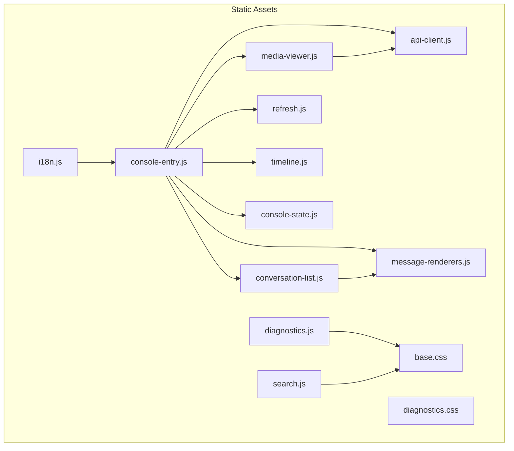
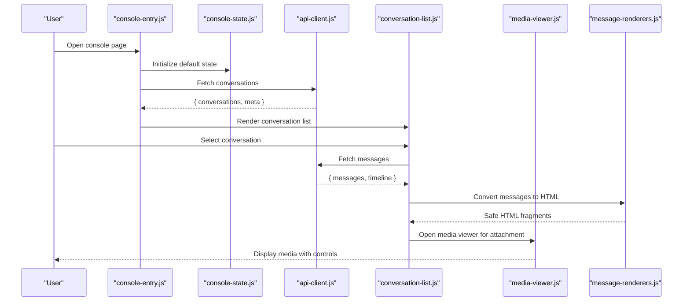
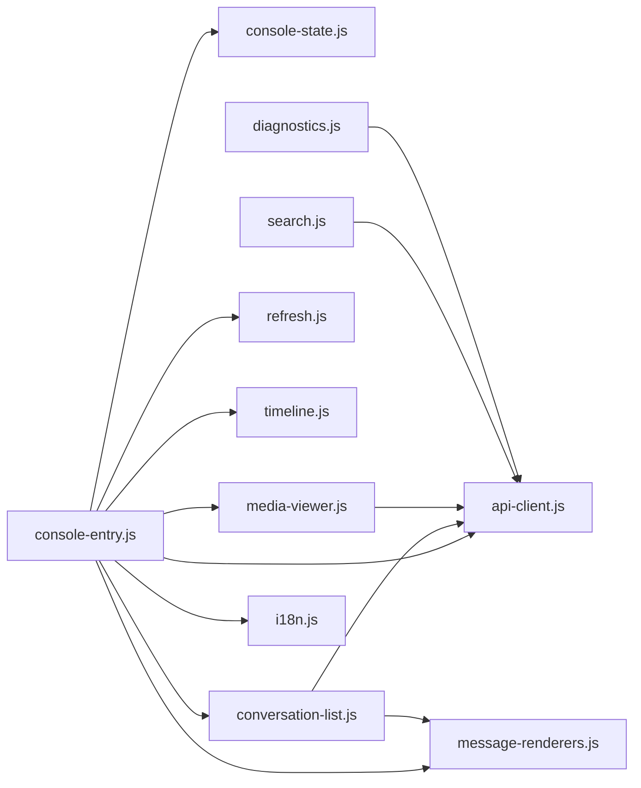

# Static Assets & Client-Side Framework

<cite>
**Referenced Files in This Document**
- [console-entry.js](file://backend/app/web/static/console/console-entry.js)
- [api-client.js](file://backend/app/web/static/console/api-client.js)
- [conversation-list.js](file://backend/app/web/static/console/conversation-list.js)
- [media-viewer.js](file://backend/app/web/static/console/media-viewer.js)
- [message-renderers.js](file://backend/app/web/static/console/message-renderers.js)
- [refresh.js](file://backend/app/web/static/console/refresh.js)
- [timeline.js](file://backend/app/web/static/console/timeline.js)
- [console-state.js](file://backend/app/web/static/console/console-state.js)
- [base.css](file://backend/app/web/static/base.css)
- [diagnostics.css](file://backend/app/web/static/diagnostics.css)
- [diagnostics.js](file://backend/app/web/static/diagnostics.js)
- [search.js](file://backend/app/web/static/search.js)
- [i18n.js](file://backend/app/assets/i18n.js)
</cite>

## Table of Contents
1. [Introduction](#introduction)
2. [Project Structure](#project-structure)
3. [Core Components](#core-components)
4. [Architecture Overview](#architecture-overview)
5. [Detailed Component Analysis](#detailed-component-analysis)
6. [Dependency Analysis](#dependency-analysis)
7. [Performance Considerations](#performance-considerations)
8. [Troubleshooting Guide](#troubleshooting-guide)
9. [Conclusion](#conclusion)

## Introduction
This document describes the client-side JavaScript architecture, module organization, and asset management for the WeCom Archive console. It explains how the console entry point initializes the UI, how the API client communicates with the backend, and how conversation listing, media viewing, and diagnostics are implemented. It also covers CSS styling patterns, responsive design, cross-browser compatibility, asset bundling, caching strategies, and performance optimization techniques used across the frontend.

## Project Structure
The client-side code is organized under the static assets directory with clear separation between modules:
- Console modules: Entry point, state, API client, UI components (conversation list, media viewer, message renderers), refresh logic, and timeline rendering.
- Shared styles: Base stylesheet and diagnostics-specific styles.
- Diagnostics and search: Standalone scripts for diagnostics and search functionality.
- Internationalization: i18n helper for localized strings.

**Diagram sources**
- [console-entry.js](file://backend/app/web/static/console/console-entry.js)
- [api-client.js](file://backend/app/web/static/console/api-client.js)
- [conversation-list.js](file://backend/app/web/static/console/conversation-list.js)
- [media-viewer.js](file://backend/app/web/static/console/media-viewer.js)
- [message-renderers.js](file://backend/app/web/static/console/message-renderers.js)
- [refresh.js](file://backend/app/web/static/console/refresh.js)
- [timeline.js](file://backend/app/web/static/console/timeline.js)
- [console-state.js](file://backend/app/web/static/console/console-state.js)
- [base.css](file://backend/app/web/static/base.css)
- [diagnostics.css](file://backend/app/web/static/diagnostics.css)
- [diagnostics.js](file://backend/app/web/static/diagnostics.js)
- [search.js](file://backend/app/web/static/search.js)
- [i18n.js](file://backend/app/assets/i18n.js)

**Section sources**
- [console-entry.js](file://backend/app/web/static/console/console-entry.js)
- [base.css](file://backend/app/web/static/base.css)
- [diagnostics.css](file://backend/app/web/static/diagnostics.css)
- [diagnostics.js](file://backend/app/web/static/diagnostics.js)
- [search.js](file://backend/app/web/static/search.js)
- [i18n.js](file://backend/app/assets/i18n.js)

## Core Components
- Console entry point: Initializes the application, sets up internationalization, binds UI events, and orchestrates loading of conversation data and timeline rendering.
- API client: Encapsulates HTTP requests to backend endpoints, handles authentication headers, error responses, retries, and response normalization.
- Conversation list: Renders a paginated or filtered list of conversations, supports selection, and triggers detail view.
- Media viewer: Displays images, videos, and other media types with appropriate controls and fallbacks.
- Message renderers: Converts structured message payloads into HTML fragments, handling different message types safely.
- Refresh logic: Implements incremental updates and polling strategies to keep the UI current without full reloads.
- Timeline: Renders chronological message timelines with grouping and navigation.
- Console state: Centralized state store for UI state, selected items, filters, and pagination.

**Section sources**
- [console-entry.js](file://backend/app/web/static/console/console-entry.js)
- [api-client.js](file://backend/app/web/static/console/api-client.js)
- [conversation-list.js](file://backend/app/web/static/console/conversation-list.js)
- [media-viewer.js](file://backend/app/web/static/console/media-viewer.js)
- [message-renderers.js](file://backend/app/web/static/console/message-renderers.js)
- [refresh.js](file://backend/app/web/static/console/refresh.js)
- [timeline.js](file://backend/app/web/static/console/timeline.js)
- [console-state.js](file://backend/app/web/static/console/console-state.js)

## Architecture Overview
The client-side follows a modular architecture with a clear separation of concerns:
- Entry point bootstraps modules and wires event handlers.
- API client abstracts network communication and centralizes error handling.
- UI components manage DOM updates and user interactions.
- State module holds shared UI state and provides reactive updates.
- Styles are centralized and theme-aware, with responsive utilities.

**Diagram sources**
- [console-entry.js](file://backend/app/web/static/console/console-entry.js)
- [console-state.js](file://backend/app/web/static/console/console-state.js)
- [api-client.js](file://backend/app/web/static/console/api-client.js)
- [conversation-list.js](file://backend/app/web/static/console/conversation-list.js)
- [media-viewer.js](file://backend/app/web/static/console/media-viewer.js)
- [message-renderers.js](file://backend/app/web/static/console/message-renderers.js)

## Detailed Component Analysis

### Console Entry Point
Responsibilities:
- Load i18n resources and set locale.
- Initialize console state and bind global event listeners.
- Trigger initial data fetch and render conversation list.
- Handle routing-like behavior for switching views (list, detail, diagnostics).

Key behaviors:
- Graceful error handling for failed loads.
- Debounced input handling for search and filters.
- Lazy-loading of heavy modules when needed.

**Section sources**
- [console-entry.js](file://backend/app/web/static/console/console-entry.js)
- [i18n.js](file://backend/app/assets/i18n.js)

### API Client
Responsibilities:
- Provide methods for GET/POST requests to backend endpoints.
- Attach authentication headers and tenant context.
- Normalize responses and map errors to user-friendly messages.
- Implement retry logic and timeouts.

Error handling:
- Network failures: Retry with backoff and notify UI.
- Authentication errors: Redirect to login or prompt re-auth.
- Validation errors: Surface field-level messages.

Caching:
- Cache GET responses where safe (e.g., metadata).
- Invalidate caches on mutations.

**Section sources**
- [api-client.js](file://backend/app/web/static/console/api-client.js)

### Conversation List
Responsibilities:
- Render a scrollable list of conversations with thumbnails and summaries.
- Support filtering by date, participants, and keywords.
- Paginate results and implement infinite scrolling if applicable.
- Highlight selected conversation and update URL state.

Interactions:
- Click to open detail view.
- Keyboard navigation and accessibility support.
- Debounced search input.

**Section sources**
- [conversation-list.js](file://backend/app/web/static/console/conversation-list.js)
- [base.css](file://backend/app/web/static/base.css)

### Media Viewer
Responsibilities:
- Display images, videos, and documents with appropriate controls.
- Provide zoom, fullscreen, and download options.
- Handle unsupported formats with fallbacks.
- Respect CSP and security policies for inline media.

Accessibility:
- ARIA labels and keyboard shortcuts.
- Focus management and screen reader support.

**Section sources**
- [media-viewer.js](file://backend/app/web/static/console/media-viewer.js)
- [base.css](file://backend/app/web/static/base.css)

### Message Renderers
Responsibilities:
- Convert structured message payloads into safe HTML fragments.
- Sanitize content to prevent XSS.
- Handle various message types (text, rich text, cards, attachments).
- Provide placeholders for unsupported types.

Security:
- Use allowlists for allowed tags and attributes.
- Escape dynamic content before insertion.

**Section sources**
- [message-renderers.js](file://backend/app/web/static/console/message-renderers.js)

### Refresh Logic
Responsibilities:
- Implement incremental updates for new messages.
- Polling or WebSocket integration for real-time updates.
- Debounce rapid changes to avoid excessive requests.

Strategies:
- Timestamp-based diffs to minimize payload.
- Optimistic updates with rollback on failure.

**Section sources**
- [refresh.js](file://backend/app/web/static/console/refresh.js)

### Timeline
Responsibilities:
- Render chronological message timeline with grouping by date.
- Provide navigation to specific timestamps.
- Optimize rendering for large datasets using virtualization.

Performance:
- Virtualize visible items.
- Defer off-screen rendering.

**Section sources**
- [timeline.js](file://backend/app/web/static/console/timeline.js)

### Console State
Responsibilities:
- Hold UI state: selected conversation, filters, pagination, and viewer state.
- Emit change events for reactive updates.
- Persist critical state to localStorage for resilience.

Reactivity:
- Subscribe/unsubscribe to state changes.
- Batch updates to reduce re-renders.

**Section sources**
- [console-state.js](file://backend/app/web/static/console/console-state.js)

## Dependency Analysis
Module relationships:
- console-entry.js depends on i18n.js, console-state.js, api-client.js, conversation-list.js, media-viewer.js, message-renderers.js, refresh.js, and timeline.js.
- conversation-list.js uses api-client.js and message-renderers.js.
- media-viewer.js uses api-client.js for fetching media URLs.
- diagnostics.js and search.js depend on base.css and may use api-client.js for queries.

**Diagram sources**
- [console-entry.js](file://backend/app/web/static/console/console-entry.js)
- [console-state.js](file://backend/app/web/static/console/console-state.js)
- [api-client.js](file://backend/app/web/static/console/api-client.js)
- [conversation-list.js](file://backend/app/web/static/console/conversation-list.js)
- [media-viewer.js](file://backend/app/web/static/console/media-viewer.js)
- [message-renderers.js](file://backend/app/web/static/console/message-renderers.js)
- [refresh.js](file://backend/app/web/static/console/refresh.js)
- [timeline.js](file://backend/app/web/static/console/timeline.js)
- [search.js](file://backend/app/web/static/search.js)
- [diagnostics.js](file://backend/app/web/static/diagnostics.js)
- [i18n.js](file://backend/app/assets/i18n.js)

**Section sources**
- [console-entry.js](file://backend/app/web/static/console/console-entry.js)
- [api-client.js](file://backend/app/web/static/console/api-client.js)
- [conversation-list.js](file://backend/app/web/static/console/conversation-list.js)
- [media-viewer.js](file://backend/app/web/static/console/media-viewer.js)
- [message-renderers.js](file://backend/app/web/static/console/message-renderers.js)
- [refresh.js](file://backend/app/web/static/console/refresh.js)
- [timeline.js](file://backend/app/web/static/console/timeline.js)
- [console-state.js](file://backend/app/web/static/console/console-state.js)
- [search.js](file://backend/app/web/static/search.js)
- [diagnostics.js](file://backend/app/web/static/diagnostics.js)
- [i18n.js](file://backend/app/assets/i18n.js)

## Performance Considerations
- Asset bundling: Combine and minify JS/CSS for production; split bundles by feature (e.g., separate diagnostics bundle).
- Caching strategies:
  - Versioned filenames for cache busting.
  - Long-lived cache for static assets; short TTL for dynamic JSON.
  - Service Worker caching for offline resilience (if enabled).
- Rendering optimizations:
  - Virtualization for long lists and timelines.
  - Debounce/throttle user inputs and scroll events.
  - Lazy-load heavy modules (media viewer, diagnostics).
- Network efficiency:
  - Pagination and incremental updates.
  - Compressed responses and efficient payloads.
  - Retry with exponential backoff and jitter.
- Cross-browser compatibility:
  - Polyfills for older browsers where necessary.
  - Feature detection for advanced APIs.
  - Graceful degradation for unsupported features.

[No sources needed since this section provides general guidance]

## Troubleshooting Guide
Common issues and resolutions:
- API failures: Check network tab, verify authentication headers, inspect error responses from api-client.js.
- Rendering errors: Validate message payloads in message-renderers.js; ensure sanitization rules are correct.
- Memory leaks: Ensure event listeners are removed on component teardown; monitor console logs for unhandled promises.
- Performance bottlenecks: Profile rendering with browser devtools; identify heavy operations in conversation-list.js and timeline.js.
- Diagnostics page: Use diagnostics.js to capture environment details and network traces; share logs for debugging.

**Section sources**
- [api-client.js](file://backend/app/web/static/console/api-client.js)
- [message-renderers.js](file://backend/app/web/static/console/message-renderers.js)
- [conversation-list.js](file://backend/app/web/static/console/conversation-list.js)
- [timeline.js](file://backend/app/web/static/console/timeline.js)
- [diagnostics.js](file://backend/app/web/static/diagnostics.js)

## Conclusion
The client-side architecture is modular and maintainable, with clear separation between networking, state, and UI concerns. The API client centralizes communication and error handling, while UI components focus on rendering and interaction. Styling is centralized and responsive, ensuring consistent experiences across devices. Performance optimizations like virtualization, debouncing, and caching improve responsiveness. Cross-browser compatibility is addressed through polyfills and feature detection. For further enhancements, consider adopting a lightweight framework for state management and introducing a service worker for offline capabilities.

[No sources needed since this section summarizes without analyzing specific files]