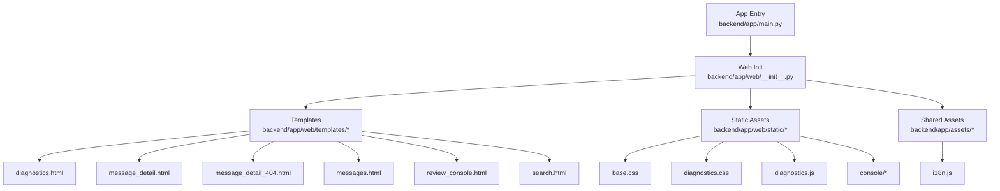
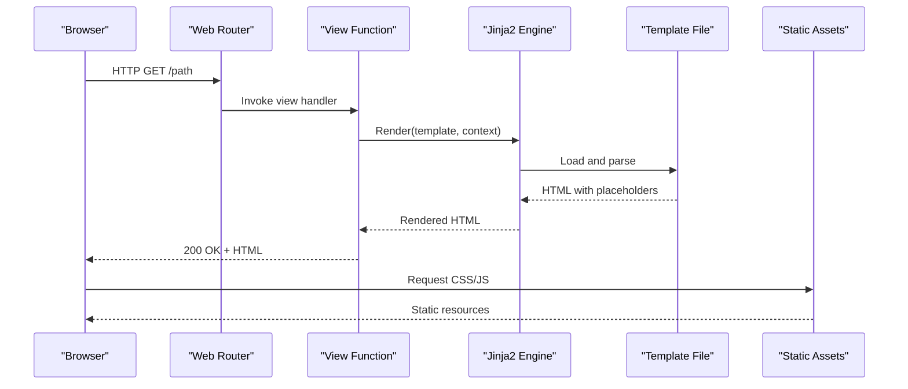
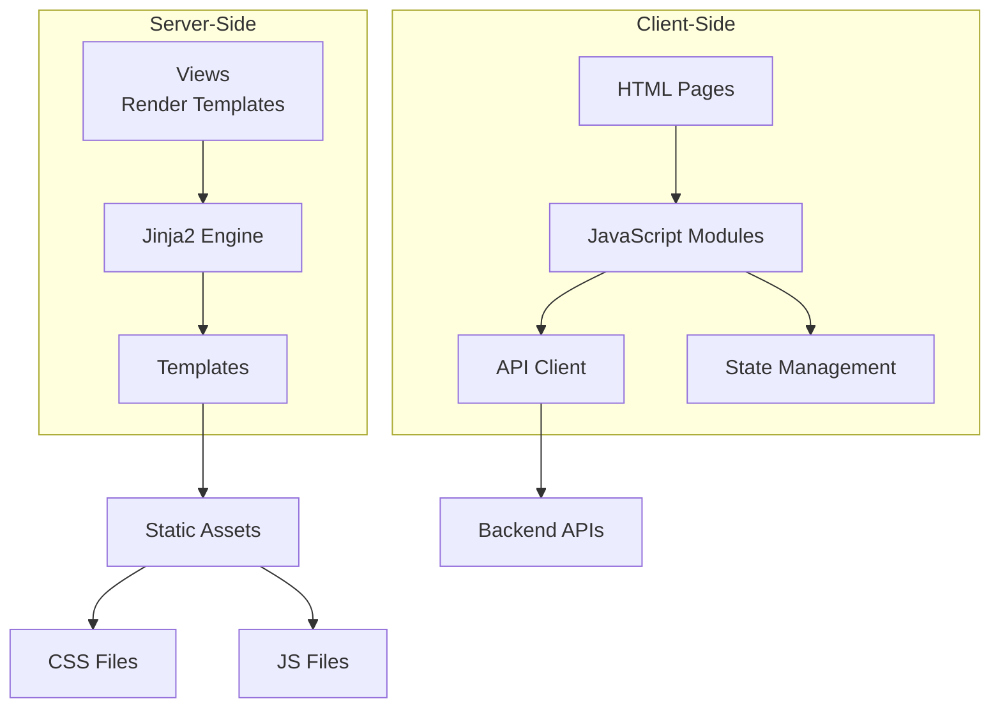

# Template Engine & Views

<cite>
**Referenced Files in This Document**
- [main.py](file://backend/app/main.py)
- [__init__.py](file://backend/app/web/__init__.py)
- [diagnostics.html](file://backend/app/web/templates/diagnostics.html)
- [message_detail.html](file://backend/app/web/templates/message_detail.html)
- [message_detail_404.html](file://backend/app/web/templates/message_detail_404.html)
- [messages.html](file://backend/app/web/templates/messages.html)
- [review_console.html](file://backend/app/web/templates/review_console.html)
- [search.html](file://backend/app/web/templates/search.html)
- [base.css](file://backend/app/web/static/base.css)
- [diagnostics.css](file://backend/app/web/static/diagnostics.css)
- [diagnostics.js](file://backend/app/web/static/diagnostics.js)
- [console-entry.js](file://backend/app/web/static/console/console-entry.js)
- [console-state.js](file://backend/app/web/static/console/console-state.js)
- [api-client.js](file://backend/app/web/static/console/api-client.js)
- [conversation-list.js](file://backend/app/web/static/console/conversation-list.js)
- [media-viewer.js](file://backend/app/web/static/console/media-viewer.js)
- [message-renderers.js](file://backend/app/web/static/console/message-renderers.js)
- [refresh.js](file://backend/app/web/static/console/refresh.js)
- [timeline.js](file://backend/app/web/static/console/timeline.js)
- [i18n.js](file://backend/app/assets/i18n.js)
</cite>

## Table of Contents
1. [Introduction](#introduction)
2. [Project Structure](#project-structure)
3. [Core Components](#core-components)
4. [Architecture Overview](#architecture-overview)
5. [Detailed Component Analysis](#detailed-component-analysis)
6. [Dependency Analysis](#dependency-analysis)
7. [Performance Considerations](#performance-considerations)
8. [Troubleshooting Guide](#troubleshooting-guide)
9. [Conclusion](#conclusion)

## Introduction
This document explains the Jinja2 template system, view rendering patterns, and data context management used by the web layer of the application. It covers how templates are organized, how views render content, and how dynamic data is passed into templates. It also details diagnostic templates, message detail views, and the console interface templates, including their JavaScript interactions. Security considerations for template rendering, performance optimization techniques, and debugging strategies are provided to help developers maintain a robust and efficient UI.

## Project Structure
The web layer is implemented under backend/app/web with:
- Templates stored in backend/app/web/templates
- Static assets (CSS/JS) stored in backend/app/web/static and backend/app/assets
- Web application initialization and routing configuration in backend/app/web/__init__.py and backend/app/main.py

**Diagram sources**
- [main.py](file://backend/app/main.py)
- [__init__.py](file://backend/app/web/__init__.py)
- [diagnostics.html](file://backend/app/web/templates/diagnostics.html)
- [message_detail.html](file://backend/app/web/templates/message_detail.html)
- [message_detail_404.html](file://backend/app/web/templates/message_detail_404.html)
- [messages.html](file://backend/app/web/templates/messages.html)
- [review_console.html](file://backend/app/web/templates/review_console.html)
- [search.html](file://backend/app/web/templates/search.html)
- [base.css](file://backend/app/web/static/base.css)
- [diagnostics.css](file://backend/app/web/static/diagnostics.css)
- [diagnostics.js](file://backend/app/web/static/diagnostics.js)
- [console-entry.js](file://backend/app/web/static/console/console-entry.js)
- [console-state.js](file://backend/app/web/static/console/console-state.js)
- [api-client.js](file://backend/app/web/static/console/api-client.js)
- [conversation-list.js](file://backend/app/web/static/console/conversation-list.js)
- [media-viewer.js](file://backend/app/web/static/console/media-viewer.js)
- [message-renderers.js](file://backend/app/web/static/console/message-renderers.js)
- [refresh.js](file://backend/app/web/static/console/refresh.js)
- [timeline.js](file://backend/app/web/static/console/timeline.js)
- [i18n.js](file://backend/app/assets/i18n.js)

**Section sources**
- [main.py](file://backend/app/main.py)
- [__init__.py](file://backend/app/web/__init__.py)

## Core Components
- Template engine setup and loader configuration are handled during web initialization. The Jinja2 environment is configured to locate templates within the templates directory and to resolve static assets via the app’s static routes.
- View functions return rendered HTML responses using the configured template engine, passing structured data contexts that include message metadata, conversation information, and UI state flags.
- Static assets are served through dedicated routes, enabling CSS and JS files to be referenced from templates without exposing file paths directly.

Key responsibilities:
- Initialize Jinja2 environment and template loader
- Register routes that render specific templates
- Provide consistent data context structures across views
- Serve static assets securely and efficiently

**Section sources**
- [__init__.py](file://backend/app/web/__init__.py)
- [main.py](file://backend/app/main.py)

## Architecture Overview
The web architecture follows a clear separation between routing, template rendering, and asset serving:
- Routes defined in the web module map URLs to view functions
- View functions prepare data contexts and render templates
- Templates compose HTML with dynamic content and reference static assets
- Client-side JavaScript enhances interactivity and fetches additional data via APIs

**Diagram sources**
- [__init__.py](file://backend/app/web/__init__.py)
- [main.py](file://backend/app/main.py)

## Detailed Component Analysis

### Diagnostics Template
The diagnostics template provides a user-friendly interface for system health checks and troubleshooting. It includes:
- Dynamic sections for status indicators and diagnostic results
- Client-side scripts to trigger checks and update the UI
- Styling for clear visual feedback

Data context typically includes:
- System status flags
- Diagnostic result payloads
- UI state for toggling sections

Security considerations:
- Ensure all dynamic content is escaped to prevent XSS
- Validate inputs before rendering diagnostic results

Performance tips:
- Use conditional rendering to avoid unnecessary DOM updates
- Defer heavy operations to client-side scripts

Debugging techniques:
- Inspect network requests triggered by diagnostics scripts
- Use browser dev tools to monitor template rendering performance

**Section sources**
- [diagnostics.html](file://backend/app/web/templates/diagnostics.html)
- [diagnostics.css](file://backend/app/web/static/diagnostics.css)
- [diagnostics.js](file://backend/app/web/static/diagnostics.js)

### Message Detail Views
Message detail views render individual message content with rich formatting and media support. Key aspects:
- Template structure supports various message types and embedded media
- Context includes message metadata, sender info, timestamps, and media URLs
- Client-side scripts handle media playback and interactive elements

Data context typically includes:
- Message content and type
- Media descriptors and access tokens
- Conversation context and participant info

Security considerations:
- Sanitize any user-generated content before embedding in templates
- Use secure links for media access with expiration tokens

Performance tips:
- Lazy-load large media assets
- Cache frequently accessed message metadata

Debugging techniques:
- Verify media URL generation and access permissions
- Check template variable resolution for complex message structures

**Section sources**
- [message_detail.html](file://backend/app/web/templates/message_detail.html)
- [message_detail_404.html](file://backend/app/web/templates/message_detail_404.html)

### Console Interface Templates
The console interface provides an administrative dashboard for managing conversations and messages. Features include:
- Conversation listing with search and filtering
- Real-time updates and refresh mechanisms
- Media viewer integration for previewing attachments

Data context typically includes:
- Conversation lists and pagination state
- Search query parameters and filters
- User session and permission flags

Client-side components:
- API client for fetching data
- State management for UI consistency
- Message renderers for different content types
- Timeline visualization for message sequences

Security considerations:
- Implement proper authentication and authorization checks
- Validate all API responses before updating UI state

Performance tips:
- Use virtual scrolling for large conversation lists
- Debounce search input to reduce API calls

Debugging techniques:
- Monitor API response times and error rates
- Use state inspection tools to debug UI inconsistencies

**Section sources**
- [review_console.html](file://backend/app/web/templates/review_console.html)
- [console-entry.js](file://backend/app/web/static/console/console-entry.js)
- [console-state.js](file://backend/app/web/static/console/console-state.js)
- [api-client.js](file://backend/app/web/static/console/api-client.js)
- [conversation-list.js](file://backend/app/web/static/console/conversation-list.js)
- [media-viewer.js](file://backend/app/web/static/console/media-viewer.js)
- [message-renderers.js](file://backend/app/web/static/console/message-renderers.js)
- [refresh.js](file://backend/app/web/static/console/refresh.js)
- [timeline.js](file://backend/app/web/static/console/timeline.js)

### Messages List Template
The messages list template displays paginated message entries with quick actions. It includes:
- Dynamic message rows with type-specific rendering
- Pagination controls and loading indicators
- Integration with search functionality

Data context typically includes:
- Message list with pagination metadata
- Current filter and sort parameters
- User action permissions

**Section sources**
- [messages.html](file://backend/app/web/templates/messages.html)

### Search Template
The search template provides advanced search capabilities with real-time results. Features include:
- Query input with autocomplete suggestions
- Result highlighting and contextual snippets
- Filter options for message types and date ranges

Data context typically includes:
- Search query and result set
- Available filters and current selections
- Pagination state for large result sets

**Section sources**
- [search.html](file://backend/app/web/templates/search.html)

### Shared Assets and Internationalization
Shared CSS and JavaScript files provide consistent styling and functionality across templates:
- Base styles define common layout and typography
- Internationalization scripts enable multi-language support
- Utility functions are shared across different template pages

**Section sources**
- [base.css](file://backend/app/web/static/base.css)
- [i18n.js](file://backend/app/assets/i18n.js)

## Dependency Analysis
The template system has clear dependencies between components:
- Templates depend on static assets for styling and interactivity
- Client-side JavaScript modules coordinate data fetching and UI updates
- Server-side views prepare data contexts that match template expectations

**Diagram sources**
- [__init__.py](file://backend/app/web/__init__.py)
- [diagnostics.html](file://backend/app/web/templates/diagnostics.html)
- [console-entry.js](file://backend/app/web/static/console/console-entry.js)
- [api-client.js](file://backend/app/web/static/console/api-client.js)

**Section sources**
- [__init__.py](file://backend/app/web/__init__.py)

## Performance Considerations
Optimization strategies for template rendering and client-side performance:
- Template caching: Enable Jinja2 template caching in production environments
- Asset bundling: Combine and minify CSS/JS files to reduce HTTP requests
- Lazy loading: Defer loading of non-critical assets and components
- Database query optimization: Minimize N+1 queries when preparing data contexts
- Response compression: Enable gzip or brotli compression for HTML responses
- CDN integration: Serve static assets through a content delivery network

## Troubleshooting Guide
Common issues and debugging approaches:
- Template rendering errors: Check variable names and data structure compatibility
- Missing static assets: Verify asset paths and server configuration
- JavaScript errors: Use browser developer tools to inspect console errors
- API failures: Monitor network tab for failed requests and error responses
- Performance bottlenecks: Profile template rendering and database queries
- Security issues: Audit template escaping and input validation

Debugging utilities:
- Enable debug mode during development for detailed error messages
- Use logging to track template rendering performance
- Implement health check endpoints for monitoring service status

**Section sources**
- [diagnostics.html](file://backend/app/web/templates/diagnostics.html)
- [diagnostics.js](file://backend/app/web/static/diagnostics.js)

## Conclusion
The Jinja2 template system in this project provides a robust foundation for rendering dynamic web content. The clear separation between server-side rendering and client-side interactivity enables maintainable and scalable web interfaces. By following the security guidelines, performance optimization techniques, and debugging strategies outlined in this document, developers can create reliable and efficient template-based views. The modular approach to template composition and component reuse facilitates easy maintenance and future enhancements.