# Web Application Architecture

<cite>
**Referenced Files in This Document**
- [main.py](file://backend/app/main.py)
- [auth.py](file://backend/app/auth.py)
- [routers/auth.py](file://backend/app/routers/auth.py)
- [routers/conversations.py](file://backend/app/routers/conversations.py)
- [routers/search.py](file://backend/app/routers/search.py)
- [web/__init__.py](file://backend/app/web/__init__.py)
- [assets/i18n.js](file://backend/app/assets/i18n.js)
- [static/console/console-entry.js](file://backend/app/web/static/console/console-entry.js)
- [static/console/api-client.js](file://backend/app/web/static/console/api-client.js)
- [static/console/conversation-list.js](file://backend/app/web/static/console/conversation-list.js)
- [static/console/media-viewer.js](file://backend/app/web/static/console/media-viewer.js)
- [static/console/message-renderers.js](file://backend/app/web/static/console/message-renderers.js)
- [static/console/timeline.js](file://backend/app/web/static/console/timeline.js)
- [static/diagnostics.js](file://backend/app/web/static/diagnostics.js)
- [templates/messages.html](file://backend/app/web/templates/messages.html)
- [templates/message_detail.html](file://backend/app/web/templates/message_detail.html)
- [templates/review_console.html](file://backend/app/web/templates/review_console.html)
- [templates/search.html](file://backend/app/web/templates/search.html)
- [templates/diagnostics.html](file://backend/app/web/templates/diagnostics.html)
- [db/models.py](file://backend/app/db/models.py)
- [db/session.py](file://backend/app/db/session.py)
- [media_storage.py](file://backend/app/media_storage.py)
- [media_thumbnails.py](file://backend/app/media_thumbnails.py)
- [structured_message_parser.py](file://backend/app/structured_message_parser.py)
</cite>

## Table of Contents
1. [Introduction](#introduction)
2. [Project Structure](#project-structure)
3. [Core Components](#core-components)
4. [Architecture Overview](#architecture-overview)
5. [Detailed Component Analysis](#detailed-component-analysis)
6. [Dependency Analysis](#dependency-analysis)
7. [Performance Considerations](#performance-considerations)
8. [Troubleshooting Guide](#troubleshooting-guide)
9. [Conclusion](#conclusion)

## Introduction
This document describes the web application architecture for a WeCom archive system built with FastAPI. It covers server setup, template rendering, static asset management, and the client-side JavaScript console used for conversation listing, message viewing, media browsing, and search. It also explains authentication middleware, session management, role-based access control, responsive design patterns, internationalization support, real-time update mechanisms, diagnostics and health endpoints, error handling strategies, and performance monitoring integration.

## Project Structure
The backend is organized under backend/app with clear separation between API routers, data models, storage logic, and web-facing assets (templates and static files). The frontend console is implemented as vanilla JavaScript modules loaded by templates.

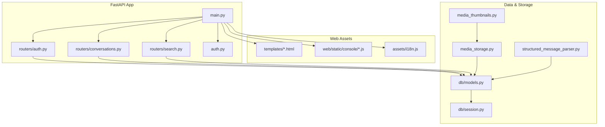

**Diagram sources**
- [main.py](file://backend/app/main.py)
- [routers/auth.py](file://backend/app/routers/auth.py)
- [routers/conversations.py](file://backend/app/routers/conversations.py)
- [routers/search.py](file://backend/app/routers/search.py)
- [auth.py](file://backend/app/auth.py)
- [web/__init__.py](file://backend/app/web/__init__.py)
- [assets/i18n.js](file://backend/app/assets/i18n.js)
- [static/console/console-entry.js](file://backend/app/web/static/console/console-entry.js)
- [db/models.py](file://backend/app/db/models.py)
- [db/session.py](file://backend/app/db/session.py)
- [media_storage.py](file://backend/app/media_storage.py)
- [media_thumbnails.py](file://backend/app/media_thumbnails.py)
- [structured_message_parser.py](file://backend/app/structured_message_parser.py)

**Section sources**
- [main.py](file://backend/app/main.py)
- [web/__init__.py](file://backend/app/web/__init__.py)

## Core Components
- FastAPI Server: Centralized app initialization, router registration, middleware stack, and static/template mounting.
- Authentication Middleware: Validates sessions, enforces roles, and protects routes.
- Routers: REST endpoints for authentication, conversations, and search.
- Template Engine: Renders HTML pages with context data.
- Static Asset Management: Serves CSS/JS for the console and diagnostics.
- Client-Side Console: Vanilla JS modules for UI interactions, API calls, state management, and real-time updates.
- Data Layer: SQLAlchemy models and session configuration.
- Media Pipeline: Storage abstraction, thumbnails generation, and structured message parsing.

**Section sources**
- [main.py](file://backend/app/main.py)
- [auth.py](file://backend/app/auth.py)
- [routers/auth.py](file://backend/app/routers/auth.py)
- [routers/conversations.py](file://backend/app/routers/conversations.py)
- [routers/search.py](file://backend/app/routers/search.py)
- [web/__init__.py](file://backend/app/web/__init__.py)
- [assets/i18n.js](file://backend/app/assets/i18n.js)
- [static/console/console-entry.js](file://backend/app/web/static/console/console-entry.js)
- [db/models.py](file://backend/app/db/models.py)
- [db/session.py](file://backend/app/db/session.py)
- [media_storage.py](file://backend/app/media_storage.py)
- [media_thumbnails.py](file://backend/app/media_thumbnails.py)
- [structured_message_parser.py](file://backend/app/structured_message_parser.py)

## Architecture Overview
The FastAPI application exposes HTTP endpoints for authentication, conversation retrieval, and search. Pages are rendered via Jinja2 templates that load static JavaScript modules to build the interactive console. Authentication middleware guards sensitive routes using session cookies and role checks. Media assets are served through a storage abstraction that supports local and cloud backends, with thumbnail generation on demand.

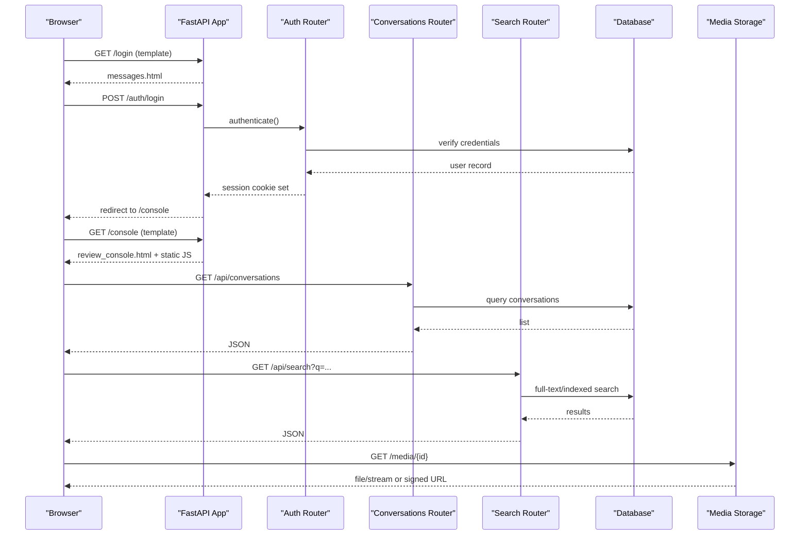

**Diagram sources**
- [main.py](file://backend/app/main.py)
- [routers/auth.py](file://backend/app/routers/auth.py)
- [routers/conversations.py](file://backend/app/routers/conversations.py)
- [routers/search.py](file://backend/app/routers/search.py)
- [db/models.py](file://backend/app/db/models.py)
- [db/session.py](file://backend/app/db/session.py)
- [media_storage.py](file://backend/app/media_storage.py)

## Detailed Component Analysis

### FastAPI Server Setup and Routing
- Initializes the FastAPI app, registers routers, mounts static files, and configures template directories.
- Applies global middleware including authentication, CORS, and logging.
- Exposes diagnostic and health endpoints for operational visibility.

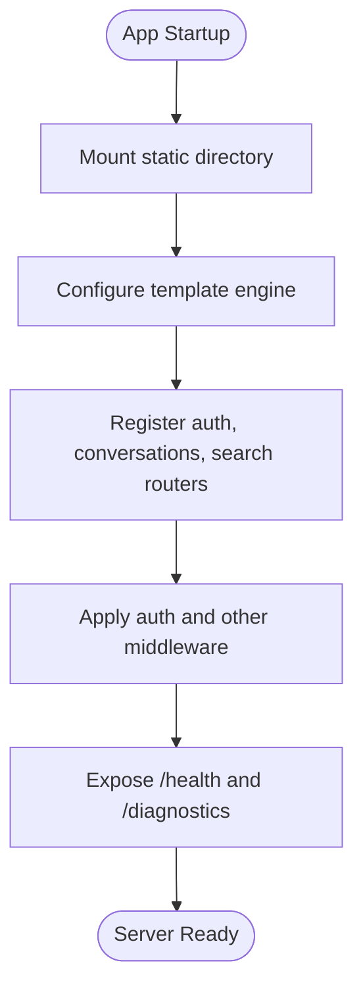

**Diagram sources**
- [main.py](file://backend/app/main.py)
- [web/__init__.py](file://backend/app/web/__init__.py)

**Section sources**
- [main.py](file://backend/app/main.py)
- [web/__init__.py](file://backend/app/web/__init__.py)

### Authentication Middleware and Session Management
- Middleware validates session cookies, extracts user identity and roles, and attaches them to request state.
- Protects routes by requiring specific roles; unauthorized requests receive appropriate responses.
- Login flow sets secure session cookies and redirects authenticated users to the console.

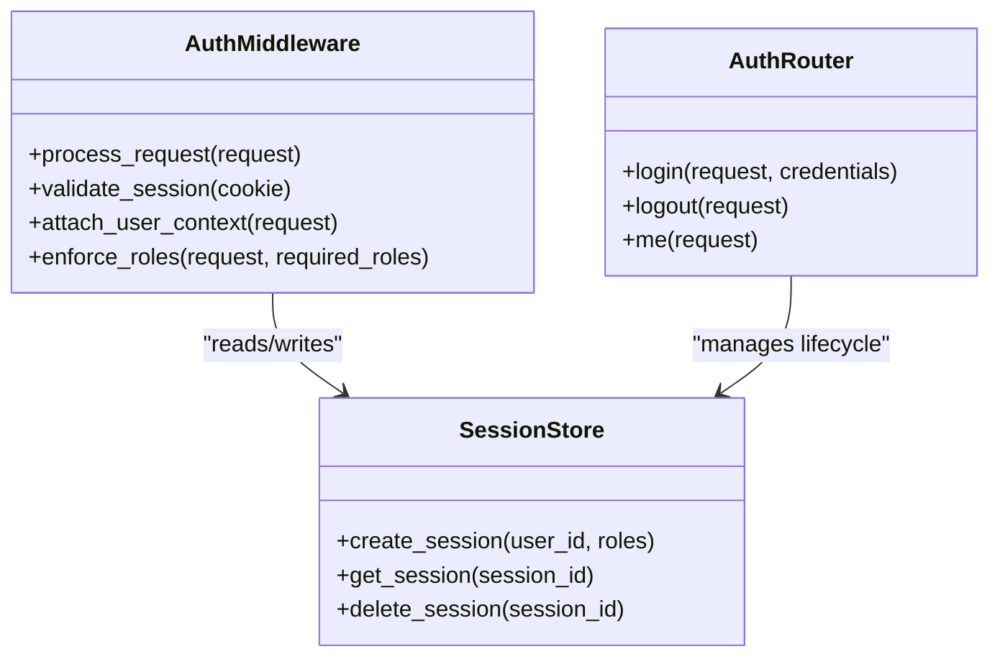

**Diagram sources**
- [auth.py](file://backend/app/auth.py)
- [routers/auth.py](file://backend/app/routers/auth.py)

**Section sources**
- [auth.py](file://backend/app/auth.py)
- [routers/auth.py](file://backend/app/routers/auth.py)

### Conversations and Messages
- Provides endpoints to list conversations and fetch message details.
- Integrates with database models to retrieve tenant-scoped data.
- Supports pagination and filtering parameters.

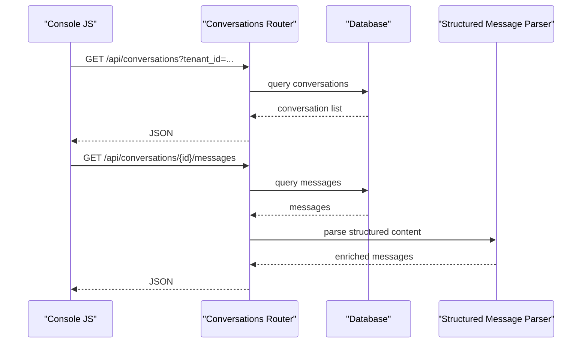

**Diagram sources**
- [routers/conversations.py](file://backend/app/routers/conversations.py)
- [db/models.py](file://backend/app/db/models.py)
- [structured_message_parser.py](file://backend/app/structured_message_parser.py)

**Section sources**
- [routers/conversations.py](file://backend/app/routers/conversations.py)
- [db/models.py](file://backend/app/db/models.py)
- [structured_message_parser.py](file://backend/app/structured_message_parser.py)

### Search Functionality
- Exposes a search endpoint supporting queries and filters.
- Uses indexed fields for efficient lookups across messages and metadata.
- Returns paginated results suitable for client-side rendering.

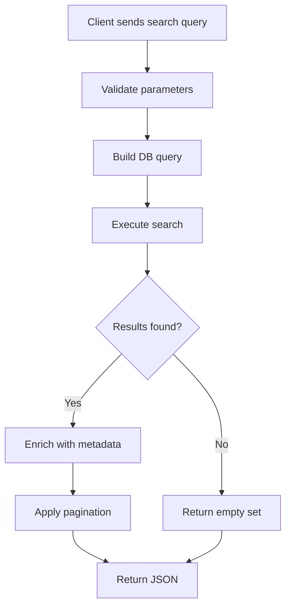

**Diagram sources**
- [routers/search.py](file://backend/app/routers/search.py)
- [db/models.py](file://backend/app/db/models.py)

**Section sources**
- [routers/search.py](file://backend/app/routers/search.py)
- [db/models.py](file://backend/app/db/models.py)

### Template Rendering and Static Assets
- Templates render HTML pages with embedded i18n scripts and module loaders.
- Static assets include CSS and JS modules for the console, diagnostics, and search UI.
- Templates pass context variables such as user roles, locale, and feature flags.

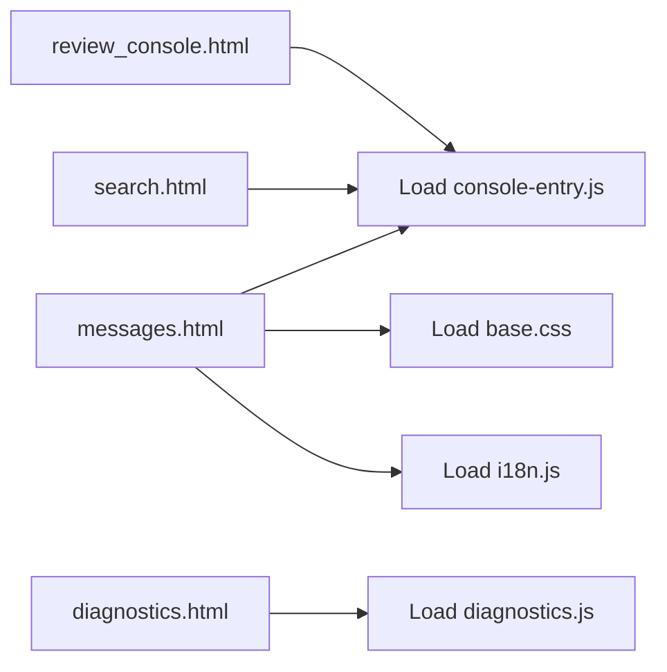

**Diagram sources**
- [templates/messages.html](file://backend/app/web/templates/messages.html)
- [templates/review_console.html](file://backend/app/web/templates/review_console.html)
- [templates/search.html](file://backend/app/web/templates/search.html)
- [templates/diagnostics.html](file://backend/app/web/templates/diagnostics.html)
- [assets/i18n.js](file://backend/app/assets/i18n.js)
- [static/console/console-entry.js](file://backend/app/web/static/console/console-entry.js)
- [static/diagnostics.js](file://backend/app/web/static/diagnostics.js)

**Section sources**
- [templates/messages.html](file://backend/app/web/templates/messages.html)
- [templates/review_console.html](file://backend/app/web/templates/review_console.html)
- [templates/search.html](file://backend/app/web/templates/search.html)
- [templates/diagnostics.html](file://backend/app/web/templates/diagnostics.html)
- [assets/i18n.js](file://backend/app/assets/i18n.js)
- [static/console/console-entry.js](file://backend/app/web/static/console/console-entry.js)
- [static/diagnostics.js](file://backend/app/web/static/diagnostics.js)

### Client-Side JavaScript Framework (Vanilla Modules)
- Entry point initializes modules, handles routing, and manages global state.
- API client abstracts HTTP calls, error handling, and retries.
- Conversation list renders paginated lists with filters and refresh controls.
- Media viewer loads images/videos and handles fallbacks.
- Message renderers format different message types and structured content.
- Timeline component visualizes chronological events.

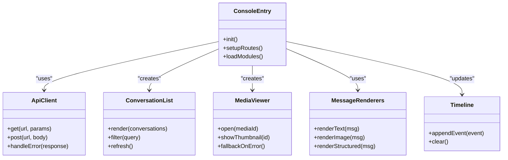

**Diagram sources**
- [static/console/console-entry.js](file://backend/app/web/static/console/console-entry.js)
- [static/console/api-client.js](file://backend/app/web/static/console/api-client.js)
- [static/console/conversation-list.js](file://backend/app/web/static/console/conversation-list.js)
- [static/console/media-viewer.js](file://backend/app/web/static/console/media-viewer.js)
- [static/console/message-renderers.js](file://backend/app/web/static/console/message-renderers.js)
- [static/console/timeline.js](file://backend/app/web/static/console/timeline.js)

**Section sources**
- [static/console/console-entry.js](file://backend/app/web/static/console/console-entry.js)
- [static/console/api-client.js](file://backend/app/web/static/console/api-client.js)
- [static/console/conversation-list.js](file://backend/app/web/static/console/conversation-list.js)
- [static/console/media-viewer.js](file://backend/app/web/static/console/media-viewer.js)
- [static/console/message-renderers.js](file://backend/app/web/static/console/message-renderers.js)
- [static/console/timeline.js](file://backend/app/web/static/console/timeline.js)

### Internationalization Support
- i18n script provides translation lookup and dynamic locale switching.
- Templates inject locale-specific strings into the page context.
- Client modules consume i18n functions to render localized UI text.

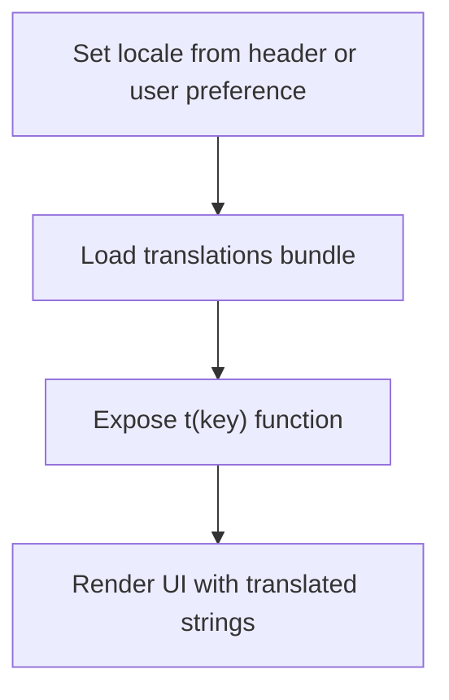

**Diagram sources**
- [assets/i18n.js](file://backend/app/assets/i18n.js)

**Section sources**
- [assets/i18n.js](file://backend/app/assets/i18n.js)

### Real-Time Update Mechanisms
- Console uses periodic polling or event-driven updates to refresh conversation lists and timelines.
- Refresh utilities trigger re-fetches and incremental updates without full page reloads.

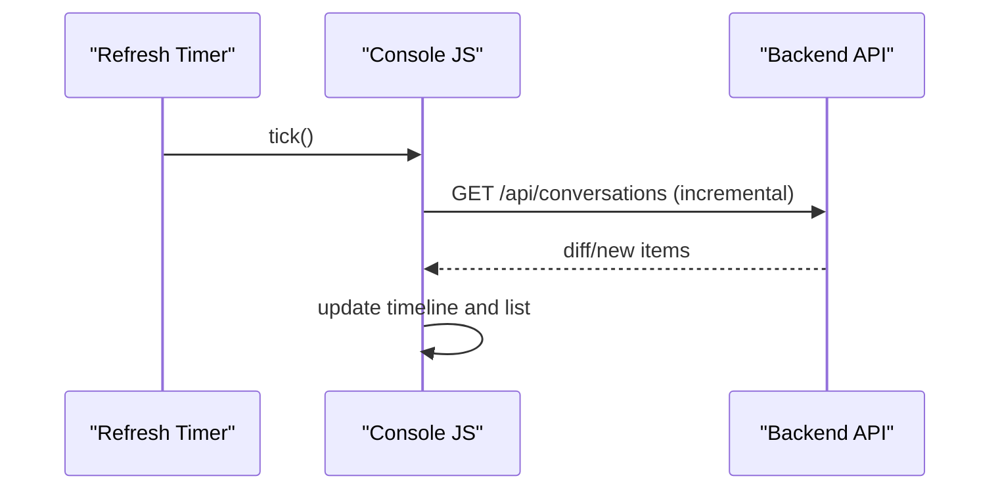

**Diagram sources**
- [static/console/refresh.js](file://backend/app/web/static/console/refresh.js)
- [static/console/timeline.js](file://backend/app/web/static/console/timeline.js)

**Section sources**
- [static/console/refresh.js](file://backend/app/web/static/console/refresh.js)
- [static/console/timeline.js](file://backend/app/web/static/console/timeline.js)

### Responsive Design Patterns
- Base CSS defines responsive grids, typography scales, and mobile-first layouts.
- Console modules adapt layouts based on viewport size and device capabilities.

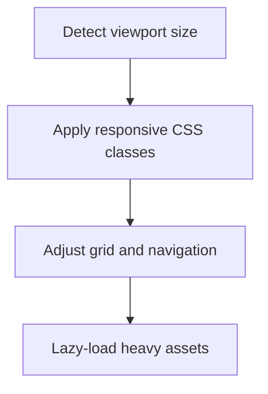

**Diagram sources**
- [static/base.css](file://backend/app/web/static/base.css)

**Section sources**
- [static/base.css](file://backend/app/web/static/base.css)

### Diagnostics and Health Check Endpoints
- Health endpoint returns service status and dependencies readiness.
- Diagnostics page aggregates logs, metrics, and runtime information for troubleshooting.

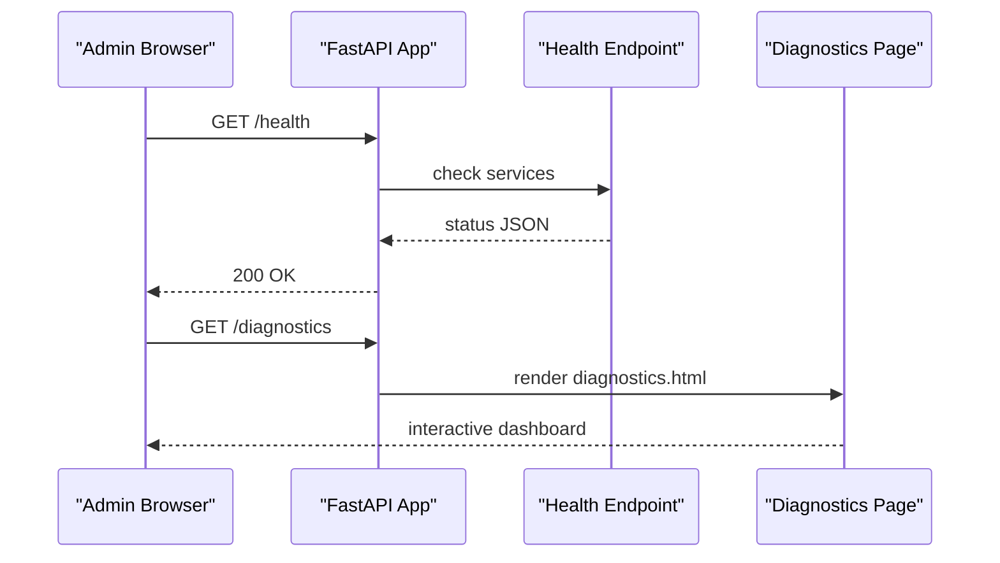

**Diagram sources**
- [main.py](file://backend/app/main.py)
- [templates/diagnostics.html](file://backend/app/web/templates/diagnostics.html)
- [static/diagnostics.js](file://backend/app/web/static/diagnostics.js)

**Section sources**
- [main.py](file://backend/app/main.py)
- [templates/diagnostics.html](file://backend/app/web/templates/diagnostics.html)
- [static/diagnostics.js](file://backend/app/web/static/diagnostics.js)

### Error Handling Strategies
- Global exception handlers return consistent error formats for API and HTML contexts.
- Client-side error handling displays user-friendly messages and retry options.
- Logging captures stack traces and contextual data for debugging.

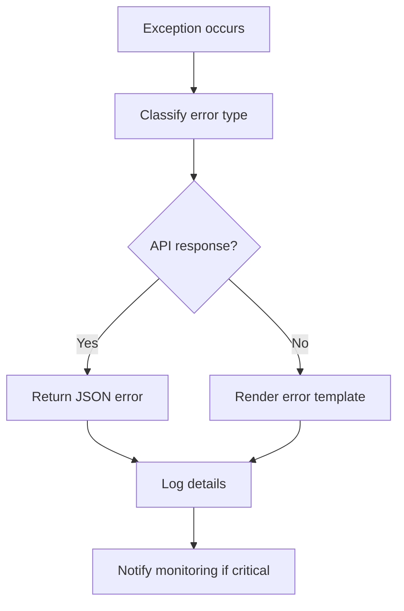

**Diagram sources**
- [main.py](file://backend/app/main.py)
- [static/console/api-client.js](file://backend/app/web/static/console/api-client.js)

**Section sources**
- [main.py](file://backend/app/main.py)
- [static/console/api-client.js](file://backend/app/web/static/console/api-client.js)

### Performance Monitoring Integration
- Metrics collection points capture request latency, error rates, and resource usage.
- Middleware instruments endpoints and stores metrics for external collectors.
- Diagnostics page exposes key metrics for quick inspection.

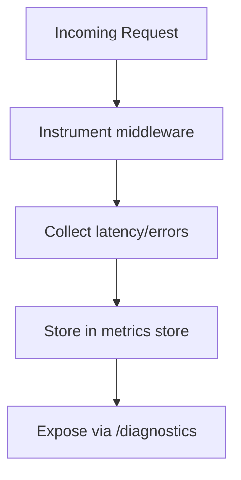

**Diagram sources**
- [main.py](file://backend/app/main.py)
- [static/diagnostics.js](file://backend/app/web/static/diagnostics.js)

**Section sources**
- [main.py](file://backend/app/main.py)
- [static/diagnostics.js](file://backend/app/web/static/diagnostics.js)

## Dependency Analysis
The application exhibits clear layering: routers depend on models and storage abstractions; templates depend on static assets; client modules depend on the API client and i18n utilities.

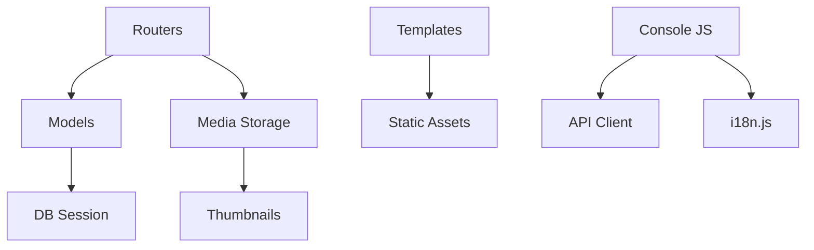

**Diagram sources**
- [routers/auth.py](file://backend/app/routers/auth.py)
- [routers/conversations.py](file://backend/app/routers/conversations.py)
- [routers/search.py](file://backend/app/routers/search.py)
- [db/models.py](file://backend/app/db/models.py)
- [db/session.py](file://backend/app/db/session.py)
- [media_storage.py](file://backend/app/media_storage.py)
- [media_thumbnails.py](file://backend/app/media_thumbnails.py)
- [assets/i18n.js](file://backend/app/assets/i18n.js)
- [static/console/api-client.js](file://backend/app/web/static/console/api-client.js)

**Section sources**
- [routers/auth.py](file://backend/app/routers/auth.py)
- [routers/conversations.py](file://backend/app/routers/conversations.py)
- [routers/search.py](file://backend/app/routers/search.py)
- [db/models.py](file://backend/app/db/models.py)
- [db/session.py](file://backend/app/db/session.py)
- [media_storage.py](file://backend/app/media_storage.py)
- [media_thumbnails.py](file://backend/app/media_thumbnails.py)
- [assets/i18n.js](file://backend/app/assets/i18n.js)
- [static/console/api-client.js](file://backend/app/web/static/console/api-client.js)

## Performance Considerations
- Use pagination and filtering on all list endpoints to reduce payload sizes.
- Implement caching for frequently accessed resources like conversation lists and search results.
- Lazy-load heavy assets (images, videos) and use thumbnails where possible.
- Monitor and optimize database queries with proper indexing and joins.
- Leverage browser caching headers for static assets and media.

[No sources needed since this section provides general guidance]

## Troubleshooting Guide
- Verify health endpoint responds with expected status codes and dependency checks.
- Inspect diagnostics page for runtime metrics and logs.
- Check browser console for JavaScript errors and network failures.
- Validate session cookies and role claims when encountering authorization issues.
- Review server logs for stack traces and error context.

**Section sources**
- [main.py](file://backend/app/main.py)
- [templates/diagnostics.html](file://backend/app/web/templates/diagnostics.html)
- [static/diagnostics.js](file://backend/app/web/static/diagnostics.js)

## Conclusion
The web application combines a robust FastAPI backend with a modular vanilla JavaScript console to deliver a responsive, internationalized, and secure experience. Authentication middleware ensures role-based access, while media pipelines and structured message parsing enrich the user interface. Diagnostics and health endpoints provide operational visibility, and performance monitoring integrates seamlessly for proactive maintenance.

[No sources needed since this section summarizes without analyzing specific files]