# Web Application Architecture

<cite>
**Referenced Files in This Document**
- [main.py](file://backend/app/main.py)
- [routers/messages.py](file://backend/app/routers/messages.py)
- [routers/web.py](file://backend/app/routers/web.py)
- [routers/auth.py](file://backend/app/routers/auth.py)
- [routers/conversations.py](file://backend/app/routers/conversations.py)
- [routers/search.py](file://backend/app/routers/search.py)
- [services/listing_service.py](file://backend/app/services/listing_service.py)
- [services/timeline_service.py](file://backend/app/services/timeline_service.py)
- [auth.py](file://backend/app/auth.py)
- [web/__init__.py](file://backend/app/web/__init__.py)
- [assets/i18n.js](file://backend/app/assets/i18n.js)
- [static/console/console-entry.js](file://backend/app/web/static/console/console-entry.js)
- [static/console/api-client.js](file://backend/app/web/static/console/api-client.js)
- [static/console/conversation-list.js](file://backend/app/web/static/console/conversation-list.js)
- [static/console/media-viewer.js](file://backend/app/web/static/console/media-viewer.js)
- [static/console/message-renderers.js](file://backend/app/web/static/console/message-renderers.js)
- [static/console/timeline.js](file://backend/app/web/static/console/timeline.js)
- [static/diagnostics.js](file://backend/app/web/static/diagnostics.js)
- [templates/messages.html](file://backend/app/web/templates/messages.html)
- [templates/message_detail.html](file://backend/app/web/templates/message_detail.html)
- [templates/review_console.html](file://backend/app/web/templates/review_console.html)
- [templates/search.html](file://backend/app/web/templates/search.html)
- [templates/diagnostics.html](file://backend/app/web/templates/diagnostics.html)
- [db/models.py](file://backend/app/db/models.py)
- [db/session.py](file://backend/app/db/session.py)
- [media_storage.py](file://backend/app/media_storage.py)
- [media_thumbnails.py](file://backend/app/media_thumbnails.py)
- [structured_message_parser.py](file://backend/app/structured_message_parser.py)
</cite>

## Update Summary
**Changes Made**
- Updated FastAPI Server Setup section to document the new App Factory pattern implementation
- Enhanced architecture diagrams to reflect factory-based application initialization
- Added detailed analysis of how the application now uses factory functions for better testability and configuration management
- Updated dependency analysis to include the factory pattern benefits for testing and environment-specific configurations
- Strengthened the separation between application configuration and runtime initialization

## Table of Contents
1. [Introduction](#introduction)
2. [Project Structure](#project-structure)
3. [Core Components](#core-components)
4. [Architecture Overview](#architecture-overview)
5. [Detailed Component Analysis](#detailed-component-analysis)
6. [Service Layer Architecture](#service-layer-architecture)
7. [Timeline Resolution and Projection Service](#timeline-resolution-and-projection-service)
8. [Dependency Analysis](#dependency-analysis)
9. [Performance Considerations](#performance-considerations)
10. [Troubleshooting Guide](#troubleshooting-guide)
11. [Conclusion](#conclusion)

## Introduction
This document describes the web application architecture for a WeCom archive system built with FastAPI. The application has undergone significant architectural enhancements including the introduction of a dedicated Timeline Resolution and Projection Service that abstracts complex timeline operations from direct route handler logic, and the adoption of the App Factory pattern for application bootstrapping. The modular router architecture follows Flask/FastAPI best practices with clear boundaries between authentication, conversation management, message operations, web page rendering, and search functionality. Business logic is now properly abstracted into service layers including the new timeline service for better maintainability and testability. It covers server setup using factory-based initialization, template rendering, static asset management, and the client-side JavaScript console used for conversation listing, message viewing, media browsing, and search. It also explains authentication middleware, session management, role-based access control, responsive design patterns, internationalization support, real-time update mechanisms, diagnostics and health endpoints, error handling strategies, and performance monitoring integration.

## Project Structure
The backend is organized under backend/app with clear separation between API routers, service layer, data models, storage logic, and web-facing assets (templates and static files). The recent architectural enhancements have introduced both a dedicated Timeline Resolution and Projection Service that handles complex timeline operations through proper service abstraction rather than direct route handler logic, and an App Factory pattern for application initialization. Each router module handles specific functional areas: authentication, conversations, messages, web pages, and search. The frontend console is implemented as vanilla JavaScript modules loaded by templates. The architecture now follows Flask/FastAPI best practices with dedicated modules for different concerns, enhanced modularity, comprehensive service layer abstraction, and factory-based application initialization for improved testability and configuration management.

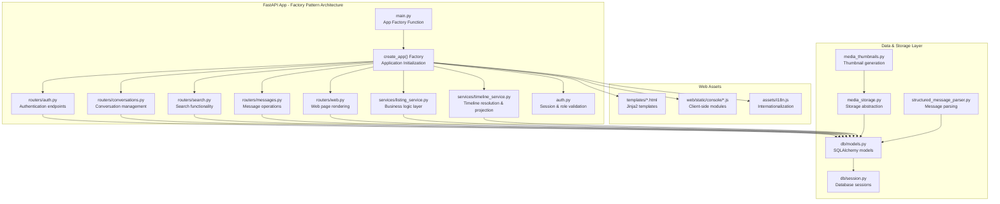

**Diagram sources**
- [main.py](file://backend/app/main.py)
- [routers/auth.py](file://backend/app/routers/auth.py)
- [routers/conversations.py](file://backend/app/routers/conversations.py)
- [routers/search.py](file://backend/app/routers/search.py)
- [routers/messages.py](file://backend/app/routers/messages.py)
- [routers/web.py](file://backend/app/routers/web.py)
- [services/listing_service.py](file://backend/app/services/listing_service.py)
- [services/timeline_service.py](file://backend/app/services/timeline_service.py)
- [auth.py](file://backend/app/auth.py)
- [web/__init__.py](file://backend/app/web/__init__.py)
- [assets/i18n.js](file://backend/app/assets/i18n.js)
- [static/console/console-entry.js](file://backend/app/web/static/console/console-entry.js)
- [db/models.py](file://backend/app/db/models.py)
- [db/session.py](file://backend/app/db/session.py)
- [media_storage.py](file://backend/app/media_storage.py)
- [media_thumbnails.py](file://backend/app/media_thumbnails.py)
- [structured_message_parser.py](file://backend/app/structured_message_parser.py)

**Section sources**
- [main.py](file://backend/app/main.py)
- [routers/messages.py](file://backend/app/routers/messages.py)
- [routers/web.py](file://backend/app/routers/web.py)
- [services/listing_service.py](file://backend/app/services/listing_service.py)
- [services/timeline_service.py](file://backend/app/services/timeline_service.py)
- [web/__init__.py](file://backend/app/web/__init__.py)

## Core Components
- **FastAPI Server with App Factory**: Centralized app initialization using factory pattern for better testability and configuration management, with modular router registration, middleware stack configuration, and static/template mounting. Significantly simplified through route extraction to dedicated modules and factory-based initialization.
- **Authentication Middleware**: Validates sessions, enforces roles, and protects routes with secure cookie handling.
- **Modular Routers**: REST endpoints organized by concern - authentication, conversations, messages, web pages, and search, each in dedicated modules following separation of concerns.
- **Enhanced Service Layer**: Business logic extracted into dedicated services including the new timeline service for better maintainability and testability.
- **Template Engine**: Renders HTML pages with context data using Jinja2.
- **Static Asset Management**: Serves CSS/JS for the console and diagnostics with proper caching.
- **Client-Side Console**: Vanilla JS modules for UI interactions, API calls, state management, and real-time updates.
- **Data Layer**: SQLAlchemy models and session configuration with proper connection pooling.
- **Media Pipeline**: Storage abstraction, thumbnails generation, and structured message parsing.

**Section sources**
- [main.py](file://backend/app/main.py)
- [auth.py](file://backend/app/auth.py)
- [routers/auth.py](file://backend/app/routers/auth.py)
- [routers/conversations.py](file://backend/app/routers/conversations.py)
- [routers/search.py](file://backend/app/routers/search.py)
- [routers/messages.py](file://backend/app/routers/messages.py)
- [routers/web.py](file://backend/app/routers/web.py)
- [services/listing_service.py](file://backend/app/services/listing_service.py)
- [services/timeline_service.py](file://backend/app/services/timeline_service.py)
- [web/__init__.py](file://backend/app/web/__init__.py)
- [assets/i18n.js](file://backend/app/assets/i18n.js)
- [static/console/console-entry.js](file://backend/app/web/static/console/console-entry.js)
- [db/models.py](file://backend/app/db/models.py)
- [db/session.py](file://backend/app/db/session.py)
- [media_storage.py](file://backend/app/media_storage.py)
- [media_thumbnails.py](file://backend/app/media_thumbnails.py)
- [structured_message_parser.py](file://backend/app/structured_message_parser.py)

## Architecture Overview
The FastAPI application exposes HTTP endpoints through modular routers for authentication, conversation retrieval, message operations, and search functionality. Pages are rendered via Jinja2 templates that load static JavaScript modules to build the interactive console. Authentication middleware guards sensitive routes using session cookies and role checks. The enhanced service layer provides business logic abstraction including the new timeline resolution and projection service for complex timeline operations. The application now uses an App Factory pattern for initialization, providing better testability and environment-specific configuration management. Media assets are served through a storage abstraction that supports local and cloud backends, with thumbnail generation on demand. The modular router architecture ensures clear separation between request handling, business logic, and data access, with timeline operations now properly abstracted through the timeline service layer.

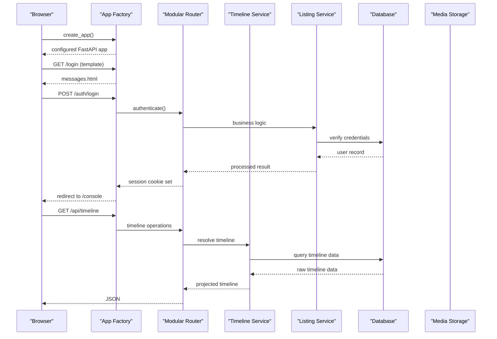

**Diagram sources**
- [main.py](file://backend/app/main.py)
- [routers/auth.py](file://backend/app/routers/auth.py)
- [routers/conversations.py](file://backend/app/routers/conversations.py)
- [routers/search.py](file://backend/app/routers/search.py)
- [routers/messages.py](file://backend/app/routers/messages.py)
- [services/listing_service.py](file://backend/app/services/listing_service.py)
- [services/timeline_service.py](file://backend/app/services/timeline_service.py)
- [db/models.py](file://backend/app/db/models.py)
- [db/session.py](file://backend/app/db/session.py)
- [media_storage.py](file://backend/app/media_storage.py)

## Detailed Component Analysis

### FastAPI Server Setup with App Factory Pattern
- Initializes the FastAPI app using a factory function pattern for better testability and configuration management.
- Factory function creates and configures the application instance with all dependencies injected.
- Registers modular routers following separation of concerns principles.
- Mounts static files and configures template directories within the factory.
- Applies global middleware including authentication, CORS, and logging during factory initialization.
- Exposes diagnostic and health endpoints for operational visibility.
- **Updated**: Application initialization now uses the App Factory pattern, allowing for environment-specific configurations, easier testing with mock dependencies, and cleaner separation between application configuration and runtime initialization. Routes are organized in dedicated modules (messages.py, web.py) following separation of concerns, making the factory function simpler and more maintainable.

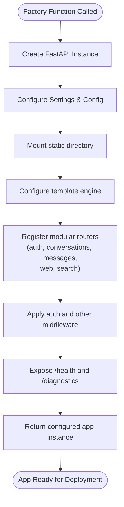

**Diagram sources**
- [main.py](file://backend/app/main.py)
- [web/__init__.py](file://backend/app/web/__init__.py)

**Section sources**
- [main.py](file://backend/app/main.py)
- [web/__init__.py](file://backend/app/web/__init__.py)

### Authentication Middleware and Session Management
- Middleware validates session cookies, extracts user identity and roles, and attaches them to request state.
- Protects routes by requiring specific roles; unauthorized requests receive appropriate responses.
- Login flow sets secure session cookies and redirects authenticated users to the console.
- Integrated with modular routers for consistent authorization across all endpoints.

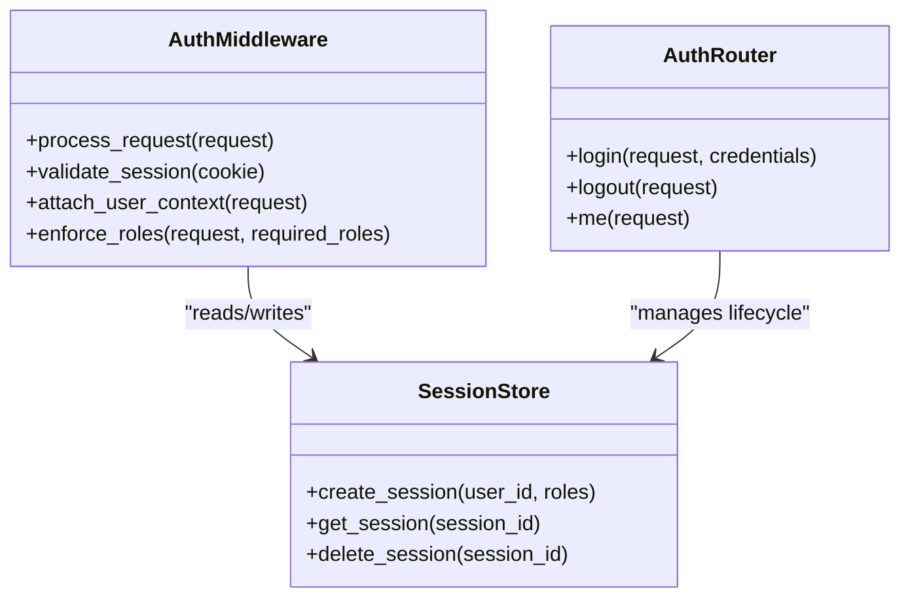

**Diagram sources**
- [auth.py](file://backend/app/auth.py)
- [routers/auth.py](file://backend/app/routers/auth.py)

**Section sources**
- [auth.py](file://backend/app/auth.py)
- [routers/auth.py](file://backend/app/routers/auth.py)

### Conversations and Messages
- Provides endpoints to list conversations and fetch message details through dedicated message router.
- Integrates with database models to retrieve tenant-scoped data.
- Supports pagination and filtering parameters.
- **Updated**: Message operations are now handled by the dedicated messages router module, providing clear separation from other concerns and improved maintainability.

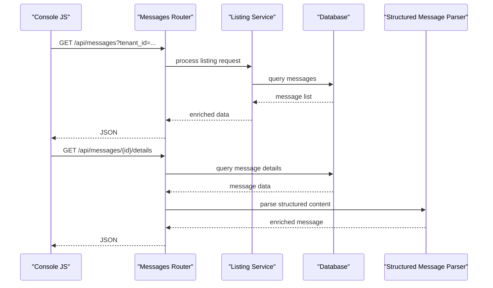

**Diagram sources**
- [routers/messages.py](file://backend/app/routers/messages.py)
- [services/listing_service.py](file://backend/app/services/listing_service.py)
- [db/models.py](file://backend/app/db/models.py)
- [structured_message_parser.py](file://backend/app/structured_message_parser.py)

**Section sources**
- [routers/messages.py](file://backend/app/routers/messages.py)
- [services/listing_service.py](file://backend/app/services/listing_service.py)
- [db/models.py](file://backend/app/db/models.py)
- [structured_message_parser.py](file://backend/app/structured_message_parser.py)

### Search Functionality
- Exposes a search endpoint supporting queries and filters.
- Uses indexed fields for efficient lookups across messages and metadata.
- Returns paginated results suitable for client-side rendering.
- Integrated into the modular router architecture for consistent request handling.

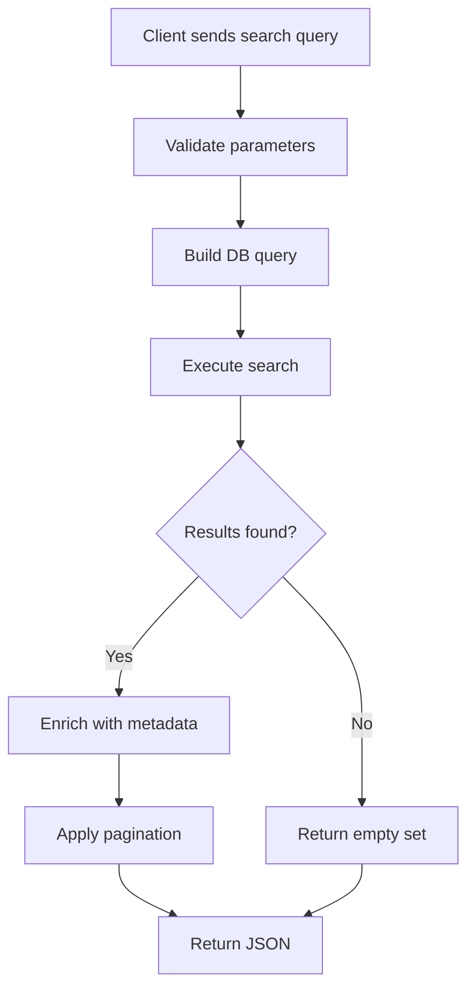

**Diagram sources**
- [routers/search.py](file://backend/app/routers/search.py)
- [db/models.py](file://backend/app/db/models.py)

**Section sources**
- [routers/search.py](file://backend/app/routers/search.py)
- [db/models.py](file://backend/app/db/models.py)

### Template Rendering and Static Assets
- Templates render HTML pages with embedded i18n scripts and module loaders.
- Static assets include CSS and JS modules for the console, diagnostics, and search UI.
- Templates pass context variables such as user roles, locale, and feature flags.
- Web router handles page-specific rendering logic in dedicated module.

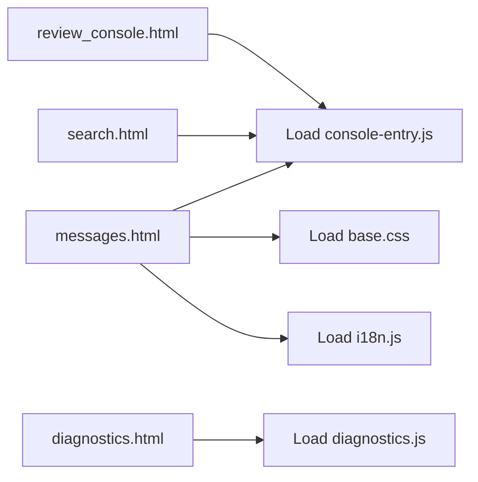

**Diagram sources**
- [templates/messages.html](file://backend/app/web/templates/messages.html)
- [templates/review_console.html](file://backend/app/web/templates/review_console.html)
- [templates/search.html](file://backend/app/web/templates/search.html)
- [templates/diagnostics.html](file://backend/app/web/templates/diagnostics.html)
- [assets/i18n.js](file://backend/app/assets/i18n.js)
- [static/console/console-entry.js](file://backend/app/web/static/console/console-entry.js)
- [static/diagnostics.js](file://backend/app/web/static/diagnostics.js)

**Section sources**
- [templates/messages.html](file://backend/app/web/templates/messages.html)
- [templates/review_console.html](file://backend/app/web/templates/review_console.html)
- [templates/search.html](file://backend/app/web/templates/search.html)
- [templates/diagnostics.html](file://backend/app/web/templates/diagnostics.html)
- [assets/i18n.js](file://backend/app/assets/i18n.js)
- [static/console/console-entry.js](file://backend/app/web/static/console/console-entry.js)
- [static/diagnostics.js](file://backend/app/web/static/diagnostics.js)

### Client-Side JavaScript Framework (Vanilla Modules)
- Entry point initializes modules, handles routing, and manages global state.
- API client abstracts HTTP calls, error handling, and retries.
- Conversation list renders paginated lists with filters and refresh controls.
- Media viewer loads images/videos and handles fallbacks.
- Message renderers format different message types and structured content.
- Timeline component visualizes chronological events.

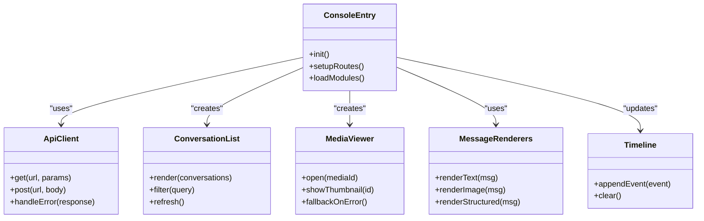

**Diagram sources**
- [static/console/console-entry.js](file://backend/app/web/static/console/console-entry.js)
- [static/console/api-client.js](file://backend/app/web/static/console/api-client.js)
- [static/console/conversation-list.js](file://backend/app/web/static/console/conversation-list.js)
- [static/console/media-viewer.js](file://backend/app/web/static/console/media-viewer.js)
- [static/console/message-renderers.js](file://backend/app/web/static/console/message-renderers.js)
- [static/console/timeline.js](file://backend/app/web/static/console/timeline.js)

**Section sources**
- [static/console/console-entry.js](file://backend/app/web/static/console/console-entry.js)
- [static/console/api-client.js](file://backend/app/web/static/console/api-client.js)
- [static/console/conversation-list.js](file://backend/app/web/static/console/conversation-list.js)
- [static/console/media-viewer.js](file://backend/app/web/static/console/media-viewer.js)
- [static/console/message-renderers.js](file://backend/app/web/static/console/message-renderers.js)
- [static/console/timeline.js](file://backend/app/web/static/console/timeline.js)

### Internationalization Support
- i18n script provides translation lookup and dynamic locale switching.
- Templates inject locale-specific strings into the page context.
- Client modules consume i18n functions to render localized UI text.

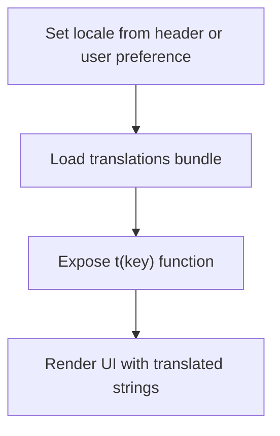

**Diagram sources**
- [assets/i18n.js](file://backend/app/assets/i18n.js)

**Section sources**
- [assets/i18n.js](file://backend/app/assets/i18n.js)

### Real-Time Update Mechanisms
- Console uses periodic polling or event-driven updates to refresh conversation lists and timelines.
- Refresh utilities trigger re-fetches and incremental updates without full page reloads.

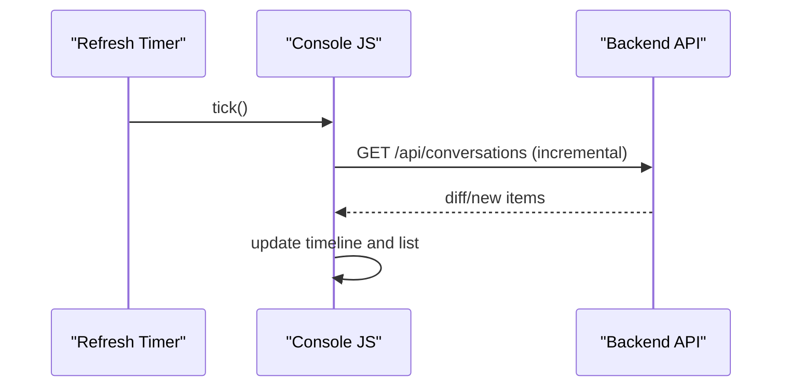

**Diagram sources**
- [static/console/refresh.js](file://backend/app/web/static/console/refresh.js)
- [static/console/timeline.js](file://backend/app/web/static/console/timeline.js)

**Section sources**
- [static/console/refresh.js](file://backend/app/web/static/console/refresh.js)
- [static/console/timeline.js](file://backend/app/web/static/console/timeline.js)

### Responsive Design Patterns
- Base CSS defines responsive grids, typography scales, and mobile-first layouts.
- Console modules adapt layouts based on viewport size and device capabilities.

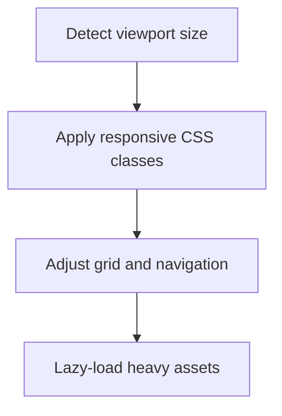

**Diagram sources**
- [static/base.css](file://backend/app/web/static/base.css)

**Section sources**
- [static/base.css](file://backend/app/web/static/base.css)

### Diagnostics and Health Check Endpoints
- Health endpoint returns service status and dependencies readiness.
- Diagnostics page aggregates logs, metrics, and runtime information for troubleshooting.
- Integrated into the modular router architecture for consistent endpoint handling.

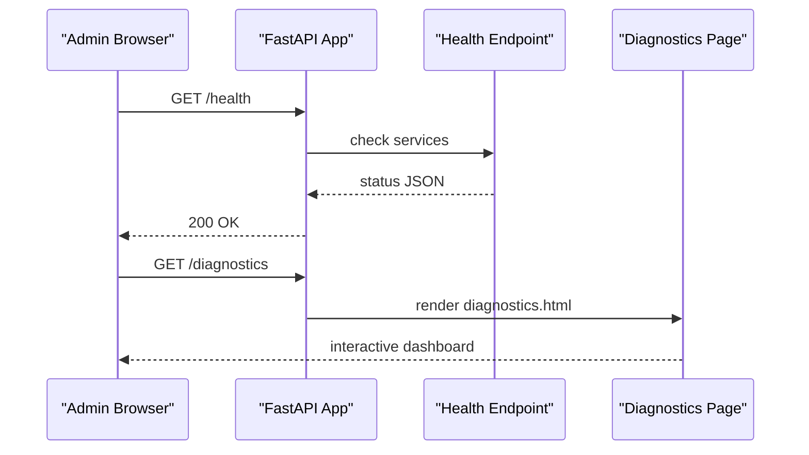

**Diagram sources**
- [main.py](file://backend/app/main.py)
- [templates/diagnostics.html](file://backend/app/web/templates/diagnostics.html)
- [static/diagnostics.js](file://backend/app/web/static/diagnostics.js)

**Section sources**
- [main.py](file://backend/app/main.py)
- [templates/diagnostics.html](file://backend/app/web/templates/diagnostics.html)
- [static/diagnostics.js](file://backend/app/web/static/diagnostics.js)

### Error Handling Strategies
- Global exception handlers return consistent error formats for API and HTML contexts.
- Client-side error handling displays user-friendly messages and retry options.
- Logging captures stack traces and contextual data for debugging.
- Modular router structure enables consistent error handling across all endpoints.

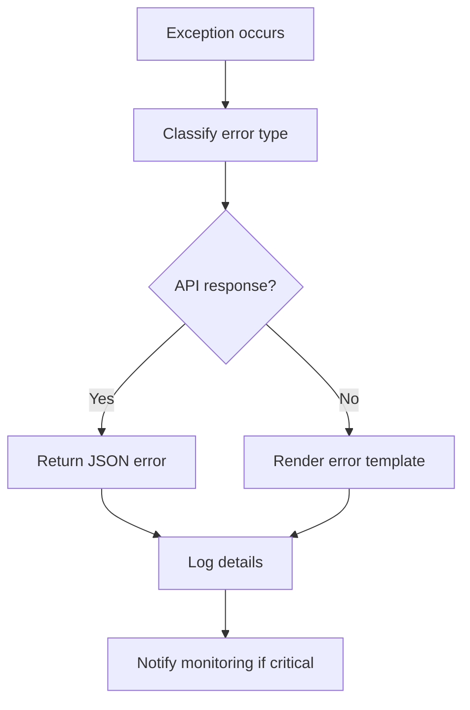

**Diagram sources**
- [main.py](file://backend/app/main.py)
- [static/console/api-client.js](file://backend/app/web/static/console/api-client.js)

**Section sources**
- [main.py](file://backend/app/main.py)
- [static/console/api-client.js](file://backend/app/web/static/console/api-client.js)

### Performance Monitoring Integration
- Metrics collection points capture request latency, error rates, and resource usage.
- Middleware instruments endpoints and stores metrics for external collectors.
- Diagnostics page exposes key metrics for quick inspection.
- Modular architecture enables granular performance monitoring per router.

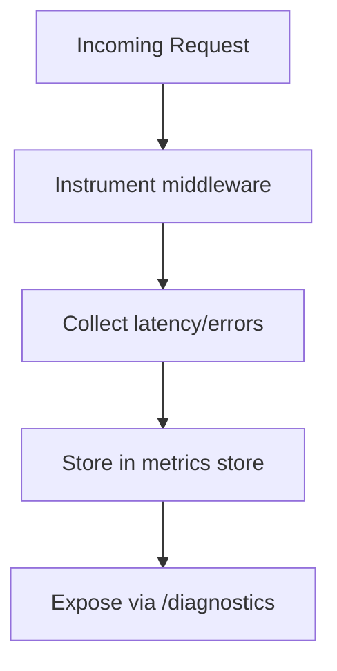

**Diagram sources**
- [main.py](file://backend/app/main.py)
- [static/diagnostics.js](file://backend/app/web/static/diagnostics.js)

**Section sources**
- [main.py](file://backend/app/main.py)
- [static/diagnostics.js](file://backend/app/web/static/diagnostics.js)

## Service Layer Architecture
The application now includes a dedicated service layer that encapsulates business logic, providing better separation of concerns and testability. The listing service specifically handles complex data operations and business rules for conversation and message listings. The modular router architecture ensures that routers focus on request/response handling while delegating business logic to services. **Updated**: The service layer has been enhanced with the new Timeline Resolution and Projection Service that abstracts complex timeline operations from direct route handler logic, providing proper service abstraction for timeline-related business logic. The App Factory pattern further enhances testability by allowing easy injection of mock services during testing.

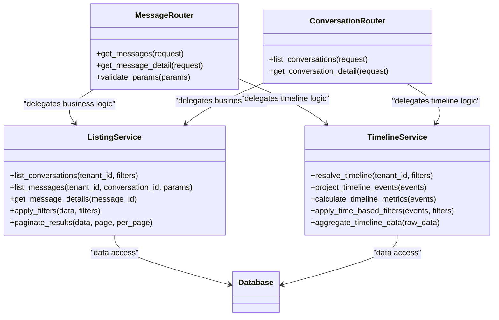

**Diagram sources**
- [services/listing_service.py](file://backend/app/services/listing_service.py)
- [services/timeline_service.py](file://backend/app/services/timeline_service.py)
- [routers/messages.py](file://backend/app/routers/messages.py)
- [routers/conversations.py](file://backend/app/routers/conversations.py)

**Section sources**
- [services/listing_service.py](file://backend/app/services/listing_service.py)
- [services/timeline_service.py](file://backend/app/services/timeline_service.py)
- [routers/messages.py](file://backend/app/routers/messages.py)
- [routers/conversations.py](file://backend/app/routers/conversations.py)

## Timeline Resolution and Projection Service
**New Section** The Timeline Resolution and Projection Service represents a significant enhancement to the service layer architecture, providing dedicated abstraction for complex timeline operations. This service handles timeline data resolution, event projection, time-based filtering, and metric calculation, ensuring that route handlers remain focused on request/response handling while complex business logic is properly encapsulated.

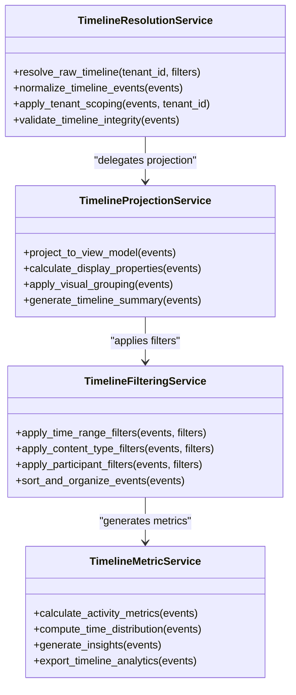

**Diagram sources**
- [services/timeline_service.py](file://backend/app/services/timeline_service.py)

**Section sources**
- [services/timeline_service.py](file://backend/app/services/timeline_service.py)

## Dependency Analysis
The application exhibits clear layering with enhanced separation: routers depend on service layer which depends on models and storage abstractions; templates depend on static assets; client modules depend on the API client and i18n utilities. **Updated**: The service layer now includes both the listing service and the new timeline service, acting as intermediaries between routers and data access, improving maintainability and testability. The App Factory pattern enables clean dependency injection and easier testing with mock implementations. The modular router architecture ensures that each router has well-defined dependencies and responsibilities, with timeline operations properly abstracted through the timeline service layer. Factory-based initialization allows for environment-specific configurations and easier testing scenarios.

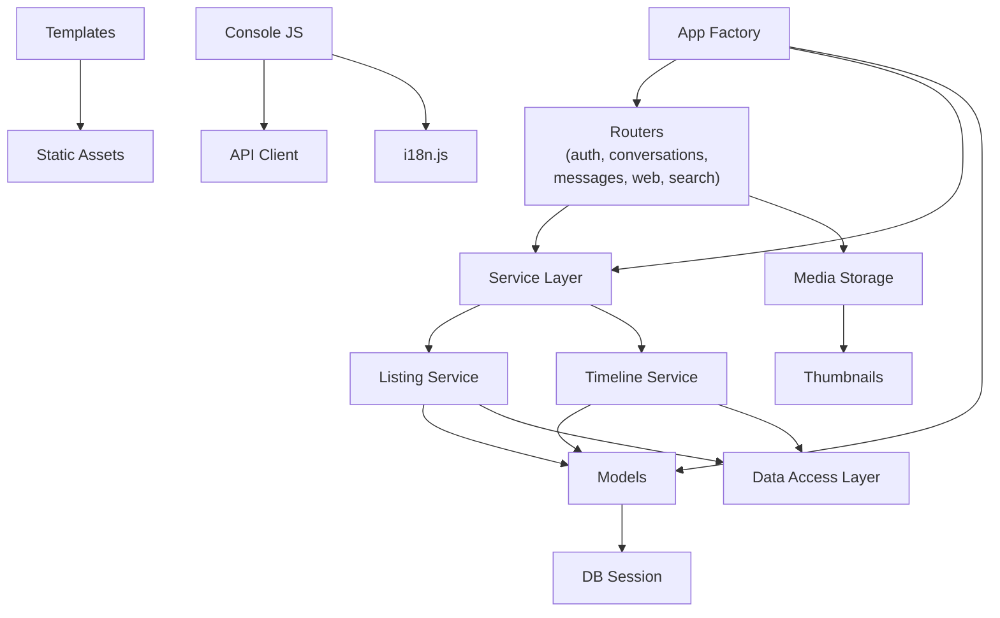

**Diagram sources**
- [routers/auth.py](file://backend/app/routers/auth.py)
- [routers/conversations.py](file://backend/app/routers/conversations.py)
- [routers/search.py](file://backend/app/routers/search.py)
- [routers/messages.py](file://backend/app/routers/messages.py)
- [routers/web.py](file://backend/app/routers/web.py)
- [services/listing_service.py](file://backend/app/services/listing_service.py)
- [services/timeline_service.py](file://backend/app/services/timeline_service.py)
- [db/models.py](file://backend/app/db/models.py)
- [db/session.py](file://backend/app/db/session.py)
- [media_storage.py](file://backend/app/media_storage.py)
- [media_thumbnails.py](file://backend/app/media_thumbnails.py)
- [assets/i18n.js](file://backend/app/assets/i18n.js)
- [static/console/api-client.js](file://backend/app/web/static/console/api-client.js)

**Section sources**
- [routers/auth.py](file://backend/app/routers/auth.py)
- [routers/conversations.py](file://backend/app/routers/conversations.py)
- [routers/search.py](file://backend/app/routers/search.py)
- [routers/messages.py](file://backend/app/routers/messages.py)
- [routers/web.py](file://backend/app/routers/web.py)
- [services/listing_service.py](file://backend/app/services/listing_service.py)
- [services/timeline_service.py](file://backend/app/services/timeline_service.py)
- [db/models.py](file://backend/app/db/models.py)
- [db/session.py](file://backend/app/db/session.py)
- [media_storage.py](file://backend/app/media_storage.py)
- [media_thumbnails.py](file://backend/app/media_thumbnails.py)
- [assets/i18n.js](file://backend/app/assets/i18n.js)
- [static/console/api-client.js](file://backend/app/web/static/console/api-client.js)

## Performance Considerations
- Use pagination and filtering on all list endpoints to reduce payload sizes.
- Implement caching for frequently accessed resources like conversation lists and search results.
- Lazy-load heavy assets (images, videos) and use thumbnails where possible.
- Monitor and optimize database queries with proper indexing and joins.
- Leverage browser caching headers for static assets and media.
- **Updated**: Enhanced service layer enables better caching strategies and business logic optimization, particularly for timeline operations. The timeline service can implement sophisticated caching for resolved and projected timeline data. The App Factory pattern allows for optimized configuration loading and dependency injection. Modular router architecture allows for targeted performance monitoring and optimization per functional area, with timeline operations benefiting from dedicated service-level optimizations. Factory-based initialization enables environment-specific performance tuning.

## Troubleshooting Guide
- Verify health endpoint responds with expected status codes and dependency checks.
- Inspect diagnostics page for runtime metrics and logs.
- Check browser console for JavaScript errors and network failures.
- Validate session cookies and role claims when encountering authorization issues.
- Review server logs for stack traces and error context.
- **Updated**: Check service layer logs for business logic errors and data processing issues, particularly timeline resolution and projection operations. Modular router structure makes it easier to isolate and debug specific functional areas, with timeline service providing dedicated logging for timeline-related operations. App Factory pattern simplifies testing and debugging by allowing isolated configuration and dependency injection.

**Section sources**
- [main.py](file://backend/app/main.py)
- [templates/diagnostics.html](file://backend/app/web/templates/diagnostics.html)
- [static/diagnostics.js](file://backend/app/web/static/diagnostics.js)

## Conclusion
The web application combines a robust FastAPI backend with a modular vanilla JavaScript console to deliver a responsive, internationalized, and secure experience. The recent architectural enhancements including the introduction of the Timeline Resolution and Projection Service and the adoption of the App Factory pattern represent significant steps forward in service layer abstraction and application initialization. The factory-based approach provides better testability, environment-specific configuration management, and cleaner separation between application setup and runtime behavior. The modular router architecture with separated concerns, dedicated router modules (messages.py, web.py), and comprehensive service layer extraction follows Flask/FastAPI best practices, significantly reducing main.py complexity and improving maintainability and scalability. Authentication middleware ensures role-based access, while media pipelines and structured message parsing enrich the user interface. Diagnostics and health endpoints provide operational visibility, and performance monitoring integrates seamlessly for proactive maintenance. The enhanced service layer architecture including the new timeline service enables better testing, caching, and business logic management. The App Factory pattern facilitates easier testing with mock dependencies and environment-specific configurations. The modular router approach creates clear boundaries between request handling, business logic, and data access, making the codebase more maintainable and scalable with proper separation of timeline-related concerns and factory-based initialization patterns.