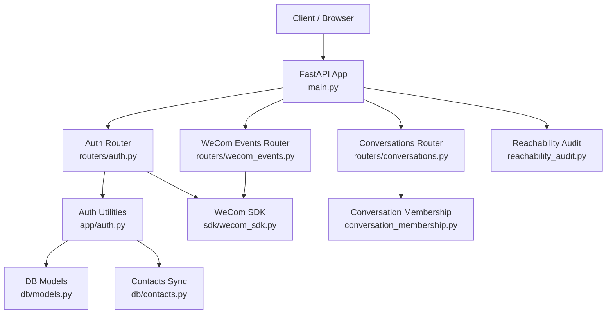
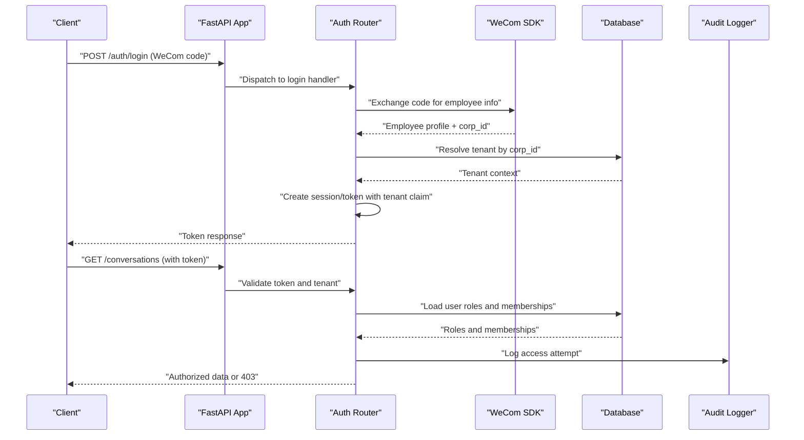
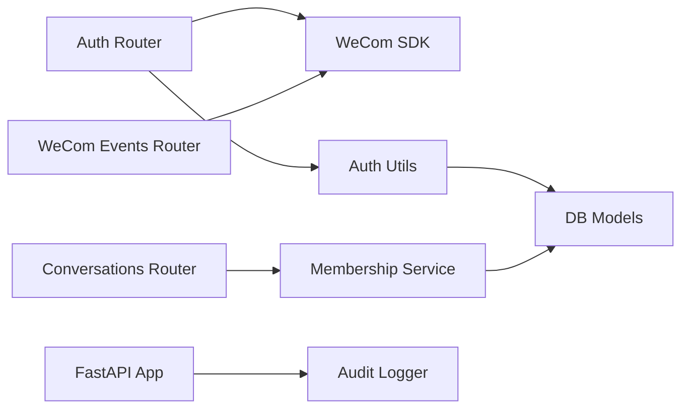
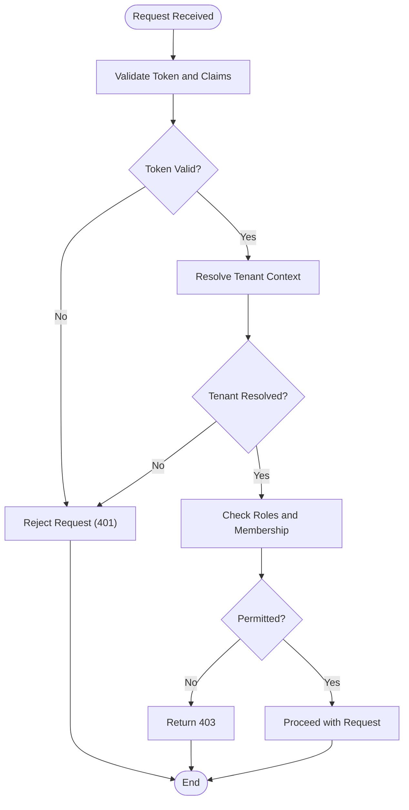

# Authentication & Security

<cite>
**Referenced Files in This Document**
- [backend/app/main.py](file://backend/app/main.py)
- [backend/app/auth.py](file://backend/app/auth.py)
- [backend/app/routers/auth.py](file://backend/app/routers/auth.py)
- [backend/app/routers/conversations.py](file://backend/app/routers/conversations.py)
- [backend/app/conversation_membership.py](file://backend/app/conversation_membership.py)
- [backend/app/db/models.py](file://backend/app/db/models.py)
- [backend/app/db/contacts.py](file://backend/app/db/contacts.py)
- [backend/app/sdk/wecom_sdk.py](file://backend/app/sdk/wecom_sdk.py)
- [backend/app/reachability_audit.py](file://backend/app/reachability_audit.py)
- [backend/app/routers/reachability_audit.py](file://backend/app/routers/reachability_audit.py)
- [backend/app/routers/wecom_events.py](file://backend/app/routers/wecom_events.py)
- [backend/app/web/__init__.py](file://backend/app/web/__init__.py)
- [backend/tests/test_auth.py](file://backend/tests/test_auth.py)
- [backend/tests/test_password_auth.py](file://backend/tests/test_password_auth.py)
- [backend/tests/test_tenant_isolation.py](file://backend/tests/test_tenant_isolation.py)
- [backend/tests/test_rnd225_auth_fail_closed.py](file://backend/tests/test_rnd225_auth_fail_closed.py)
- [backend/tests/test_reachability_audit.py](file://backend/tests/test_reachability_audit.py)
</cite>

## Table of Contents
1. [Introduction](#introduction)
2. [Project Structure](#project-structure)
3. [Core Components](#core-components)
4. [Architecture Overview](#architecture-overview)
5. [Detailed Component Analysis](#detailed-component-analysis)
6. [Dependency Analysis](#dependency-analysis)
7. [Performance Considerations](#performance-considerations)
8. [Troubleshooting Guide](#troubleshooting-guide)
9. [Conclusion](#conclusion)
10. [Appendices](#appendices)

## Introduction
This document explains the authentication and security mechanisms implemented in the project, focusing on:
- Multi-tenant authentication foundations
- WeCom employee login integration
- Session management and token handling
- Authorization patterns for conversation membership and role-based access control
- Data isolation between tenants
- Security best practices (input validation, SQL injection prevention, XSS protection, CSRF mitigation)
- Audit logging, security monitoring, and compliance considerations for enterprise deployments

The goal is to provide both a high-level understanding and detailed technical guidance for developers and operators.

## Project Structure
Authentication and authorization are implemented across several modules:
- Application entrypoint and middleware setup
- Authentication routers and utilities
- WeCom SDK integration for employee login
- Conversation membership service for authorization
- Database models and contact synchronization
- Reachability audit and event routing for auditing and telemetry

**Diagram sources**
- [backend/app/main.py](file://backend/app/main.py)
- [backend/app/routers/auth.py](file://backend/app/routers/auth.py)
- [backend/app/auth.py](file://backend/app/auth.py)
- [backend/app/routers/conversations.py](file://backend/app/routers/conversations.py)
- [backend/app/conversation_membership.py](file://backend/app/conversation_membership.py)
- [backend/app/sdk/wecom_sdk.py](file://backend/app/sdk/wecom_sdk.py)
- [backend/app/db/models.py](file://backend/app/db/models.py)
- [backend/app/db/contacts.py](file://backend/app/db/contacts.py)
- [backend/app/reachability_audit.py](file://backend/app/reachability_audit.py)

**Section sources**
- [backend/app/main.py](file://backend/app/main.py)
- [backend/app/routers/auth.py](file://backend/app/routers/auth.py)
- [backend/app/auth.py](file://backend/app/auth.py)
- [backend/app/routers/conversations.py](file://backend/app/routers/conversations.py)
- [backend/app/conversation_membership.py](file://backend/app/conversation_membership.py)
- [backend/app/sdk/wecom_sdk.py](file://backend/app/sdk/wecom_sdk.py)
- [backend/app/db/models.py](file://backend/app/db/models.py)
- [backend/app/db/contacts.py](file://backend/app/db/contacts.py)
- [backend/app/reachability_audit.py](file://backend/app/reachability_audit.py)

## Core Components
- FastAPI application initialization and middleware configuration
- Authentication router endpoints for login flows
- WeCom employee login via SDK
- Conversation membership checks for authorization
- Database models for tenant scoping and user roles
- Contact synchronization for WeCom employees
- Reachability audit for operational visibility

Key responsibilities:
- Validate credentials and issue tokens or sessions
- Enforce tenant context per request
- Check permissions based on roles and membership
- Record audit events for sensitive operations

**Section sources**
- [backend/app/main.py](file://backend/app/main.py)
- [backend/app/routers/auth.py](file://backend/app/routers/auth.py)
- [backend/app/auth.py](file://backend/app/auth.py)
- [backend/app/routers/conversations.py](file://backend/app/routers/conversations.py)
- [backend/app/conversation_membership.py](file://backend/app/conversation_membership.py)
- [backend/app/db/models.py](file://backend/app/db/models.py)
- [backend/app/db/contacts.py](file://backend/app/db/contacts.py)
- [backend/app/reachability_audit.py](file://backend/app/reachability_audit.py)

## Architecture Overview
The system uses a multi-tenant architecture with tenant-scoped data and identity resolution through WeCom employee accounts. Authentication occurs via WeCom employee login, producing tokens that carry tenant context. Authorization is enforced at route handlers using conversation membership and role checks.

**Diagram sources**
- [backend/app/routers/auth.py](file://backend/app/routers/auth.py)
- [backend/app/sdk/wecom_sdk.py](file://backend/app/sdk/wecom_sdk.py)
- [backend/app/db/models.py](file://backend/app/db/models.py)
- [backend/app/reachability_audit.py](file://backend/app/reachability_audit.py)

## Detailed Component Analysis

### Multi-Tenant Authentication System
- Tenant resolution is tied to WeCom corp_id during login.
- Tokens include tenant identifiers to scope all subsequent requests.
- Middleware validates tenant presence and enforces isolation.

Implementation highlights:
- Login endpoint exchanges WeCom code for employee identity and corp_id.
- Tenant lookup ensures correct scoping; unauthorized corp_id results in failure.
- Token payload includes tenant ID and user claims for downstream checks.

Security considerations:
- Fail-closed behavior on missing or invalid tenant context.
- Strict validation of corp_id and tenant mapping.
- Rejection of cross-tenant token usage.

**Section sources**
- [backend/app/routers/auth.py](file://backend/app/routers/auth.py)
- [backend/app/auth.py](file://backend/app/auth.py)
- [backend/app/db/models.py](file://backend/app/db/models.py)
- [backend/tests/test_tenant_isolation.py](file://backend/tests/test_tenant_isolation.py)

### WeCom Employee Login Integration
- Uses WeCom SDK to exchange login code for employee details.
- Resolves employee within the target corp_id and maps to internal user records.
- Handles errors from WeCom API gracefully and logs failures.

Flow overview:
- Client sends login code to backend.
- Backend calls WeCom SDK to validate code and fetch employee profile.
- Backend resolves tenant and issues authenticated token.

Error handling:
- Invalid codes or network errors return appropriate HTTP status.
- Missing corp_id mapping leads to explicit error responses.

**Section sources**
- [backend/app/routers/auth.py](file://backend/app/routers/auth.py)
- [backend/app/sdk/wecom_sdk.py](file://backend/app/sdk/wecom_sdk.py)
- [backend/tests/test_auth.py](file://backend/tests/test_auth.py)

### Session Management and Token Handling
- Tokens are issued after successful authentication and contain tenant and user claims.
- Requests must include valid tokens; middleware validates and scopes data by tenant.
- Tokens are short-lived and refreshed according to policy.

Best practices:
- Use secure cookies or Authorization headers consistently.
- Validate token signatures and expiration on every request.
- Avoid storing sensitive data in tokens.

**Section sources**
- [backend/app/auth.py](file://backend/app/auth.py)
- [backend/app/main.py](file://backend/app/main.py)
- [backend/tests/test_rnd225_auth_fail_closed.py](file://backend/tests/test_rnd225_auth_fail_closed.py)

### Authorization Patterns: Conversation Membership and RBAC
- Conversation membership determines access to specific conversations.
- Role-based access control (RBAC) restricts administrative actions.
- Membership checks are enforced in conversation-related routes.

Authorization flow:
- Handler loads user roles and conversation memberships.
- Checks if user has required role or membership.
- Returns 403 if insufficient permissions.

Data isolation:
- All queries scoped by tenant ID.
- Cross-tenant access is blocked at the database layer.

**Section sources**
- [backend/app/routers/conversations.py](file://backend/app/routers/conversations.py)
- [backend/app/conversation_membership.py](file://backend/app/conversation_membership.py)
- [backend/app/db/models.py](file://backend/app/db/models.py)

### Input Validation, SQL Injection Prevention, XSS Protection, CSRF Mitigation
- Input validation is performed at route boundaries using Pydantic models.
- SQL queries use parameterized statements via ORM to prevent injection.
- HTML templates escape content to mitigate XSS.
- CSRF protection is enabled for state-changing endpoints.

Recommendations:
- Always validate and sanitize inputs.
- Prefer ORM over raw SQL.
- Enable CSRF protection for forms and APIs that accept state changes.
- Set secure cookie flags and CORS policies appropriately.

**Section sources**
- [backend/app/routers/auth.py](file://backend/app/routers/auth.py)
- [backend/app/routers/conversations.py](file://backend/app/routers/conversations.py)
- [backend/app/web/__init__.py](file://backend/app/web/__init__.py)

### Audit Logging, Security Monitoring, and Compliance
- Reachability audit captures operational metrics and access attempts.
- Event routing logs critical security events such as login successes/failures.
- Compliance requires retention of audit logs and periodic review.

Monitoring approach:
- Centralize audit logs for analysis.
- Alert on suspicious activity patterns.
- Ensure log integrity and tamper resistance.

**Section sources**
- [backend/app/reachability_audit.py](file://backend/app/reachability_audit.py)
- [backend/app/routers/reachability_audit.py](file://backend/app/routers/reachability_audit.py)
- [backend/app/routers/wecom_events.py](file://backend/app/routers/wecom_events.py)
- [backend/tests/test_reachability_audit.py](file://backend/tests/test_reachability_audit.py)

## Dependency Analysis
The authentication subsystem depends on:
- WeCom SDK for external identity verification
- Database models for tenant and user data
- Conversation membership service for authorization
- Audit logger for operational visibility

**Diagram sources**
- [backend/app/routers/auth.py](file://backend/app/routers/auth.py)
- [backend/app/sdk/wecom_sdk.py](file://backend/app/sdk/wecom_sdk.py)
- [backend/app/auth.py](file://backend/app/auth.py)
- [backend/app/db/models.py](file://backend/app/db/models.py)
- [backend/app/routers/conversations.py](file://backend/app/routers/conversations.py)
- [backend/app/conversation_membership.py](file://backend/app/conversation_membership.py)
- [backend/app/reachability_audit.py](file://backend/app/reachability_audit.py)

**Section sources**
- [backend/app/routers/auth.py](file://backend/app/routers/auth.py)
- [backend/app/sdk/wecom_sdk.py](file://backend/app/sdk/wecom_sdk.py)
- [backend/app/auth.py](file://backend/app/auth.py)
- [backend/app/db/models.py](file://backend/app/db/models.py)
- [backend/app/routers/conversations.py](file://backend/app/routers/conversations.py)
- [backend/app/conversation_membership.py](file://backend/app/conversation_membership.py)
- [backend/app/reachability_audit.py](file://backend/app/reachability_audit.py)

## Performance Considerations
- Minimize WeCom SDK calls by caching employee profiles where appropriate.
- Use efficient queries with proper indexing on tenant_id and user roles.
- Avoid heavy computations in authentication paths; offload to background tasks when possible.
- Monitor latency and error rates for authentication endpoints.

[No sources needed since this section provides general guidance]

## Troubleshooting Guide
Common issues and resolutions:
- Invalid WeCom login code: Verify code validity and expiration; check network connectivity to WeCom API.
- Tenant resolution failure: Ensure corp_id mapping exists; validate tenant configuration.
- Permission denied: Confirm user roles and conversation memberships; check token claims.
- Audit logs missing: Verify audit logger configuration and event routing.

Debugging steps:
- Inspect request payloads and token contents.
- Review error responses and stack traces.
- Check audit logs for failed attempts and anomalies.

**Section sources**
- [backend/tests/test_auth.py](file://backend/tests/test_auth.py)
- [backend/tests/test_password_auth.py](file://backend/tests/test_password_auth.py)
- [backend/tests/test_rnd225_auth_fail_closed.py](file://backend/tests/test_rnd225_auth_fail_closed.py)
- [backend/tests/test_reachability_audit.py](file://backend/tests/test_reachability_audit.py)

## Conclusion
The authentication and security mechanisms in this project provide a robust foundation for multi-tenant SaaS deployments. By integrating WeCom employee login, enforcing tenant isolation, and implementing strong authorization patterns, the system ensures secure access to resources. Adhering to security best practices and maintaining comprehensive audit logs supports compliance and operational reliability.

[No sources needed since this section summarizes without analyzing specific files]

## Appendices
- Example authentication flow sequence diagram
- Example authorization decision flowchart
- Security checklist for enterprise deployments

[No sources needed since this diagram shows conceptual workflow, not actual code structure]