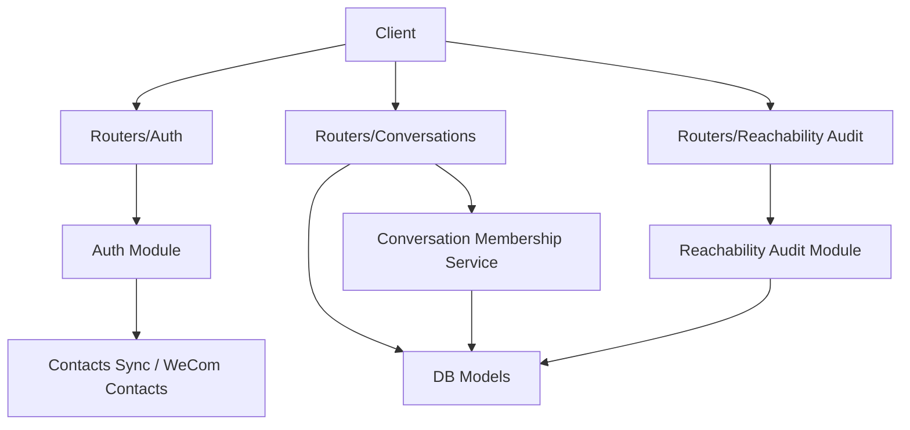
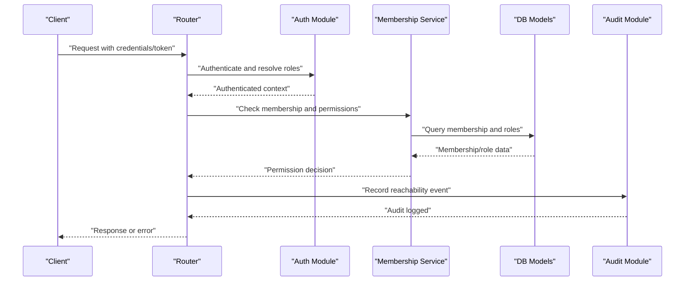
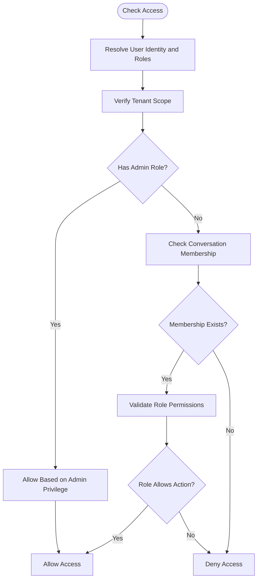
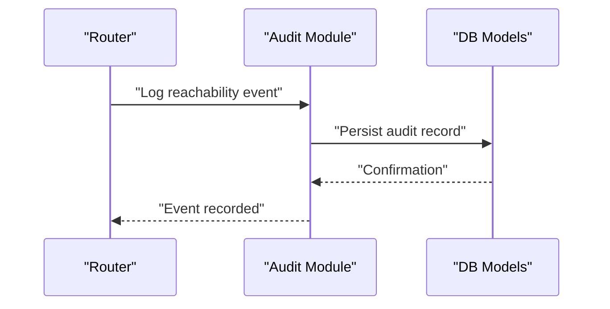
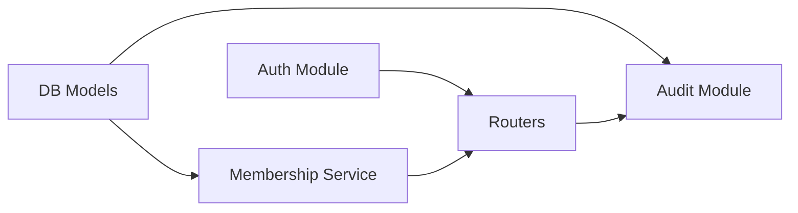

# Authorization & Access Control

<cite>
**Referenced Files in This Document**
- [backend/app/main.py](file://backend/app/main.py)
- [backend/app/auth.py](file://backend/app/auth.py)
- [backend/app/conversation_membership.py](file://backend/app/conversation_membership.py)
- [backend/app/routers/auth.py](file://backend/app/routers/auth.py)
- [backend/app/routers/conversations.py](file://backend/app/routers/conversations.py)
- [backend/app/reachability_audit.py](file://backend/app/reachability_audit.py)
- [backend/app/routers/reachability_audit.py](file://backend/app/routers/reachability_audit.py)
- [backend/app/db/models.py](file://backend/app/db/models.py)
- [backend/app/db/contacts.py](file://backend/app/db/contacts.py)
- [backend/app/wecom_contacts.py](file://backend/app/wecom_contacts.py)
- [backend/app/sync_wecom_archive_once.py](file://backend/scripts/sync_wecom_archive_once.py)
- [backend/tests/test_auth.py](file://backend/tests/test_auth.py)
- [backend/tests/test_conversation_membership_service.py](file://backend/tests/test_conversation_membership_service.py)
- [backend/tests/test_reachability_audit.py](file://backend/tests/test_reachability_audit.py)
</cite>

## Table of Contents
1. [Introduction](#introduction)
2. [Project Structure](#project-structure)
3. [Core Components](#core-components)
4. [Architecture Overview](#architecture-overview)
5. [Detailed Component Analysis](#detailed-component-analysis)
6. [Dependency Analysis](#dependency-analysis)
7. [Performance Considerations](#performance-considerations)
8. [Troubleshooting Guide](#troubleshooting-guide)
9. [Conclusion](#conclusion)

## Introduction
This document explains the authorization and access control mechanisms implemented in the backend, focusing on:
- Conversation membership management
- Role-based permissions and resource-level access control
- Permission checking workflow and user role-to-conversation access mapping
- Reachability audit system for tracking user access patterns and compliance monitoring
- Examples of custom permission decorators, middleware implementations, and audit logging patterns
- Security best practices to prevent privilege escalation and ensure data isolation

The goal is to provide both a conceptual overview and code-level insights so that developers can understand, extend, and secure these features effectively.

## Project Structure
Authorization and access control span multiple modules:
- Authentication entry points and session handling
- Conversation membership service for managing who can access which conversations
- Routers enforcing access checks at API boundaries
- Reachability audit subsystem recording access events
- Data models and contact synchronization supporting identity and roles

**Diagram sources**
- [backend/app/routers/auth.py](file://backend/app/routers/auth.py)
- [backend/app/routers/conversations.py](file://backend/app/routers/conversations.py)
- [backend/app/routers/reachability_audit.py](file://backend/app/routers/reachability_audit.py)
- [backend/app/auth.py](file://backend/app/auth.py)
- [backend/app/conversation_membership.py](file://backend/app/conversation_membership.py)
- [backend/app/reachability_audit.py](file://backend/app/reachability_audit.py)
- [backend/app/db/models.py](file://backend/app/db/models.py)
- [backend/app/wecom_contacts.py](file://backend/app/wecom_contacts.py)

**Section sources**
- [backend/app/main.py](file://backend/app/main.py)
- [backend/app/routers/auth.py](file://backend/app/routers/auth.py)
- [backend/app/routers/conversations.py](file://backend/app/routers/conversations.py)
- [backend/app/routers/reachability_audit.py](file://backend/app/routers/reachability_audit.py)
- [backend/app/auth.py](file://backend/app/auth.py)
- [backend/app/conversation_membership.py](file://backend/app/conversation_membership.py)
- [backend/app/reachability_audit.py](file://backend/app/reachability_audit.py)
- [backend/app/db/models.py](file://backend/app/db/models.py)
- [backend/app/wecom_contacts.py](file://backend/app/wecom_contacts.py)

## Core Components
- Authentication module: Handles login flows, token/session creation, and basic role resolution.
- Conversation membership service: Manages membership records and enforces per-conversation access rights based on roles and tenant scoping.
- Reachability audit module: Records user access attempts and outcomes for compliance and auditing.
- Routers: Apply authentication and authorization checks before delegating to business logic.
- Data models: Define entities such as users, roles, tenants, conversations, memberships, and audit logs.

Key responsibilities:
- Authenticate users and establish context (user identity, roles, tenant).
- Resolve conversation membership and validate permissions for requested resources.
- Record reachability events with sufficient detail for audits.
- Enforce tenant isolation and role-based access across all endpoints.

**Section sources**
- [backend/app/auth.py](file://backend/app/auth.py)
- [backend/app/conversation_membership.py](file://backend/app/conversation_membership.py)
- [backend/app/reachability_audit.py](file://backend/app/reachability_audit.py)
- [backend/app/routers/auth.py](file://backend/app/routers/auth.py)
- [backend/app/routers/conversations.py](file://backend/app/routers/conversations.py)
- [backend/app/routers/reachability_audit.py](file://backend/app/routers/reachability_audit.py)
- [backend/app/db/models.py](file://backend/app/db/models.py)

## Architecture Overview
The authorization architecture follows a layered approach:
- HTTP layer (routers) validates requests and applies decorators/middleware for authN/authZ.
- Business layer (membership service) resolves permissions using roles and membership records.
- Data layer (models and contacts sync) provides identity, roles, and tenant-scoped data.
- Audit layer captures access events for compliance and diagnostics.

**Diagram sources**
- [backend/app/routers/auth.py](file://backend/app/routers/auth.py)
- [backend/app/auth.py](file://backend/app/auth.py)
- [backend/app/conversation_membership.py](file://backend/app/conversation_membership.py)
- [backend/app/db/models.py](file://backend/app/db/models.py)
- [backend/app/reachability_audit.py](file://backend/app/reachability_audit.py)

## Detailed Component Analysis

### Authentication and Role Resolution
- Login flow: Validates credentials, creates an authenticated session or token, and attaches user identity and roles to request context.
- Role mapping: Derives roles from user attributes and tenant configuration; supports admin and member roles.
- Middleware/decorators: Enforce authentication at router level and propagate context downstream.

Security considerations:
- Fail-closed behavior on missing or invalid tokens.
- Strict validation of credentials and token payloads.
- Tenant-aware role resolution to prevent cross-tenant privilege leakage.

**Section sources**
- [backend/app/auth.py](file://backend/app/auth.py)
- [backend/app/routers/auth.py](file://backend/app/routers/auth.py)
- [backend/tests/test_auth.py](file://backend/tests/test_auth.py)

### Conversation Membership Management
- Membership model: Tracks user-conversation relationships, including role assignments within a conversation.
- Membership service: Provides methods to add/remove members, update roles, and check access rights.
- Resource-level access: Endpoints require explicit membership or higher privileges to read/write conversation data.

Access rights mapping:
- Admin roles may bypass membership checks where appropriate.
- Member roles are constrained by explicit membership records.
- Tenant scoping ensures users only access resources within their tenant.

**Diagram sources**
- [backend/app/conversation_membership.py](file://backend/app/conversation_membership.py)
- [backend/app/db/models.py](file://backend/app/db/models.py)

**Section sources**
- [backend/app/conversation_membership.py](file://backend/app/conversation_membership.py)
- [backend/app/routers/conversations.py](file://backend/app/routers/conversations.py)
- [backend/tests/test_conversation_membership_service.py](file://backend/tests/test_conversation_membership_service.py)

### Permission Checking Workflow
- Entry point: Router receives request and invokes authentication decorator/middleware.
- Context propagation: Authenticated user, roles, and tenant are attached to request state.
- Authorization: Membership service evaluates permissions based on roles and membership records.
- Decision: If allowed, proceed to business logic; otherwise, return 403/401 with appropriate messages.

Best practices:
- Centralize permission checks in dedicated services to avoid duplication.
- Use fail-closed defaults; explicitly allow only what is necessary.
- Log denied attempts for audit and security analysis.

**Section sources**
- [backend/app/routers/conversations.py](file://backend/app/routers/conversations.py)
- [backend/app/conversation_membership.py](file://backend/app/conversation_membership.py)

### Reachability Audit System
- Purpose: Track user access patterns, successes, failures, and compliance-related events.
- Event types: Login attempts, resource access, membership changes, and errors.
- Storage: Persisted via data models with tenant scoping and timestamps.
- Reporting: Exposed through diagnostic endpoints and scripts for compliance reviews.

Audit logging patterns:
- Include user identity, tenant, resource identifiers, action type, and outcome.
- Avoid logging sensitive data; use hashed identifiers where necessary.
- Ensure idempotency and consistent formatting for downstream analytics.

**Diagram sources**
- [backend/app/reachability_audit.py](file://backend/app/reachability_audit.py)
- [backend/app/routers/reachability_audit.py](file://backend/app/routers/reachability_audit.py)
- [backend/app/db/models.py](file://backend/app/db/models.py)

**Section sources**
- [backend/app/reachability_audit.py](file://backend/app/reachability_audit.py)
- [backend/app/routers/reachability_audit.py](file://backend/app/routers/reachability_audit.py)
- [backend/tests/test_reachability_audit.py](file://backend/tests/test_reachability_audit.py)

### Custom Permission Decorators and Middleware
- Decorators: Wrap endpoint handlers to enforce authentication and role checks before execution.
- Middleware: Intercept requests to validate tokens, set context, and apply global policies.
- Examples:
  - Require authenticated user and specific role for write operations.
  - Enforce tenant isolation by filtering queries based on tenant ID.
  - Rate-limit sensitive endpoints to mitigate abuse.

Implementation guidance:
- Keep decorators small and focused; delegate complex checks to services.
- Use consistent error responses for unauthorized/unauthorized actions.
- Test decorators thoroughly with edge cases (missing tokens, expired sessions, invalid roles).

**Section sources**
- [backend/app/routers/auth.py](file://backend/app/routers/auth.py)
- [backend/app/auth.py](file://backend/app/auth.py)
- [backend/tests/test_auth.py](file://backend/tests/test_auth.py)

### Contact Synchronization and Role Sources
- Contact sync: Integrates with external systems (e.g., WeCom) to populate user identities and roles.
- Role derivation: Maps external roles to internal roles used for authorization decisions.
- Updates: Periodic sync ensures up-to-date role information and prevents stale permissions.

Security considerations:
- Validate and sanitize external role mappings.
- Handle sync failures gracefully without breaking authentication.
- Maintain audit trails for role changes originating from external sources.

**Section sources**
- [backend/app/wecom_contacts.py](file://backend/app/wecom_contacts.py)
- [backend/app/db/contacts.py](file://backend/app/db/contacts.py)
- [backend/scripts/sync_wecom_archive_once.py](file://backend/scripts/sync_wecom_archive_once.py)

## Dependency Analysis
Authorization components depend on:
- Authentication module for identity and role resolution.
- Membership service for permission evaluation.
- Data models for persistence and tenant scoping.
- Audit module for compliance logging.

**Diagram sources**
- [backend/app/auth.py](file://backend/app/auth.py)
- [backend/app/conversation_membership.py](file://backend/app/conversation_membership.py)
- [backend/app/db/models.py](file://backend/app/db/models.py)
- [backend/app/reachability_audit.py](file://backend/app/reachability_audit.py)
- [backend/app/routers/auth.py](file://backend/app/routers/auth.py)
- [backend/app/routers/conversations.py](file://backend/app/routers/conversations.py)
- [backend/app/routers/reachability_audit.py](file://backend/app/routers/reachability_audit.py)

**Section sources**
- [backend/app/auth.py](file://backend/app/auth.py)
- [backend/app/conversation_membership.py](file://backend/app/conversation_membership.py)
- [backend/app/db/models.py](file://backend/app/db/models.py)
- [backend/app/reachability_audit.py](file://backend/app/reachability_audit.py)
- [backend/app/routers/auth.py](file://backend/app/routers/auth.py)
- [backend/app/routers/conversations.py](file://backend/app/routers/conversations.py)
- [backend/app/routers/reachability_audit.py](file://backend/app/routers/reachability_audit.py)

## Performance Considerations
- Cache membership lookups where appropriate to reduce database load.
- Batch audit log writes to minimize I/O overhead.
- Use efficient queries with proper indexing on tenant IDs, user IDs, and conversation IDs.
- Avoid heavy computations in hot paths; defer to background tasks when possible.

[No sources needed since this section provides general guidance]

## Troubleshooting Guide
Common issues and resolutions:
- Authentication failures: Verify token validity, expiration, and issuer configuration.
- Permission denied errors: Check membership records, role mappings, and tenant scoping.
- Audit gaps: Ensure audit logging is enabled and persisted correctly; verify event generation paths.
- Sync problems: Inspect contact sync logs and external API connectivity.

Debugging tips:
- Enable detailed logging for auth and membership checks.
- Use diagnostic endpoints to inspect current user context and permissions.
- Review audit logs for anomalies and unauthorized access attempts.

**Section sources**
- [backend/tests/test_auth.py](file://backend/tests/test_auth.py)
- [backend/tests/test_conversation_membership_service.py](file://backend/tests/test_conversation_membership_service.py)
- [backend/tests/test_reachability_audit.py](file://backend/tests/test_reachability_audit.py)

## Conclusion
The authorization and access control system combines robust authentication, precise membership management, and comprehensive auditing to ensure secure, compliant operation. By following the documented workflows, implementing secure decorators and middleware, and adhering to best practices, teams can maintain strong data isolation and prevent privilege escalation while providing a clear path for compliance monitoring and troubleshooting.

[No sources needed since this section summarizes without analyzing specific files]