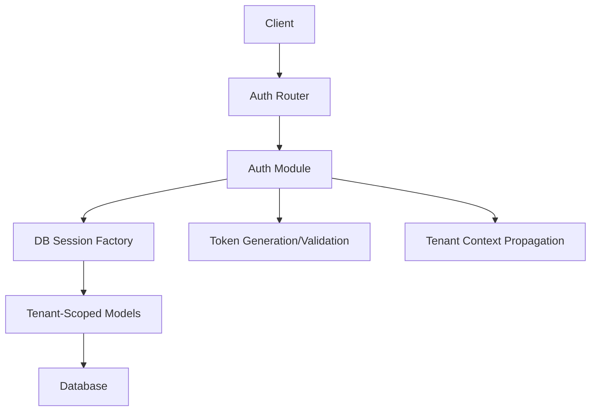
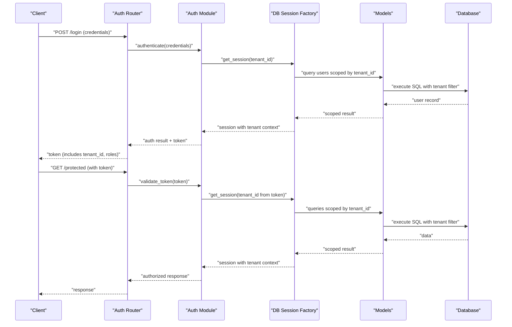
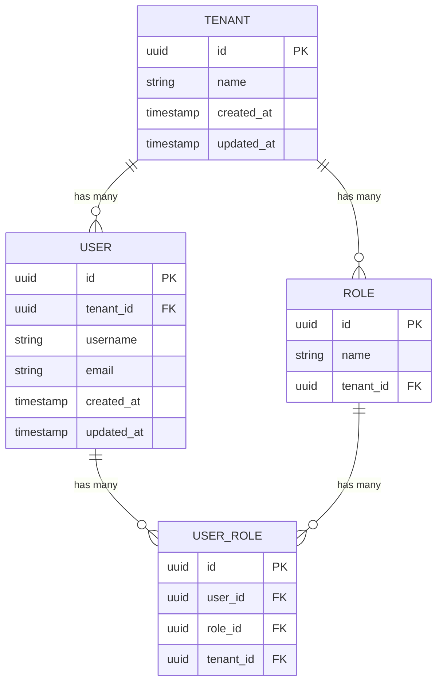
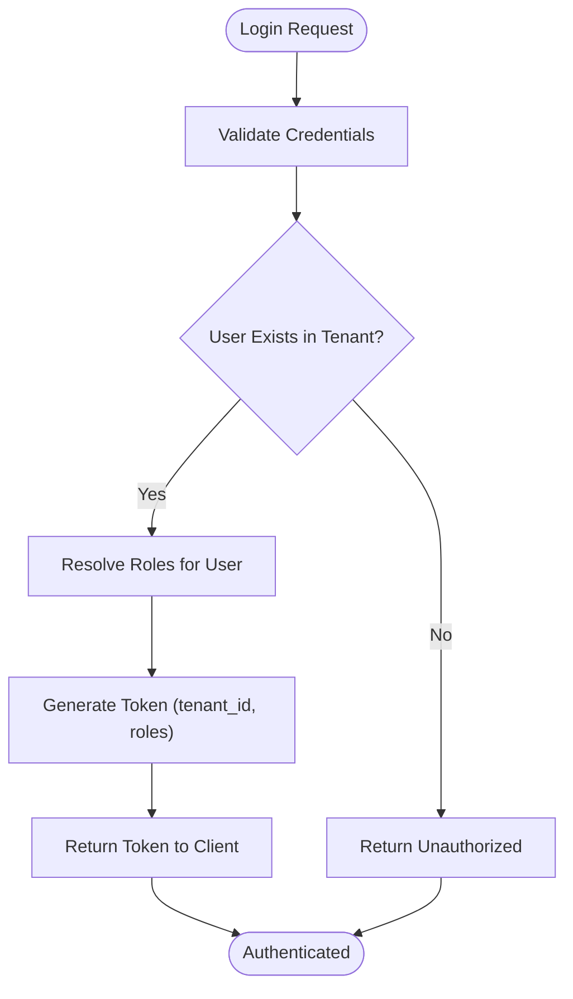
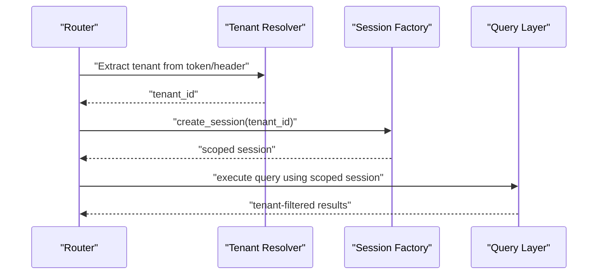
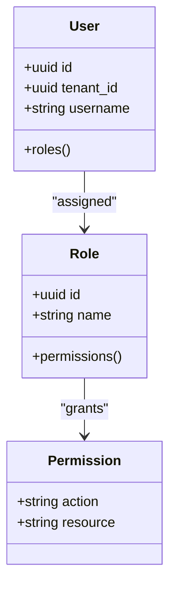
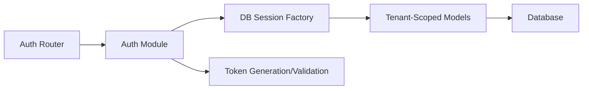

# Multi-Tenant Authentication

<cite>
**Referenced Files in This Document**
- [backend/app/main.py](file://backend/app/main.py)
- [backend/app/auth.py](file://backend/app/auth.py)
- [backend/app/routers/auth.py](file://backend/app/routers/auth.py)
- [backend/app/db/models.py](file://backend/app/db/models.py)
- [backend/app/db/session.py](file://backend/app/db/session.py)
- [backend/app/db/base.py](file://backend/app/db/base.py)
- [backend/alembic/versions/0002_tenant_foundation.py](file://backend/alembic/versions/0002_tenant_foundation.py)
- [backend/scripts/bootstrap_default_tenant.py](file://backend/scripts/bootstrap_default_tenant.py)
- [backend/tests/test_auth.py](file://backend/tests/test_auth.py)
- [backend/tests/test_tenant_isolation.py](file://backend/tests/test_tenant_isolation.py)
</cite>

## Table of Contents
1. [Introduction](#introduction)
2. [Project Structure](#project-structure)
3. [Core Components](#core-components)
4. [Architecture Overview](#architecture-overview)
5. [Detailed Component Analysis](#detailed-component-analysis)
6. [Dependency Analysis](#dependency-analysis)
7. [Performance Considerations](#performance-considerations)
8. [Troubleshooting Guide](#troubleshooting-guide)
9. [Conclusion](#conclusion)

## Introduction
This document explains the multi-tenant authentication system implemented in the backend. It covers how tenant isolation is enforced at the database level, the end-to-end authentication flow from login to session creation, token generation and validation, and how tenant context is propagated across request processing to ensure strict data isolation between tenants. It also includes examples of tenant-specific configuration, user role mapping, and permission inheritance patterns.

## Project Structure
The multi-tenant authentication spans several modules:
- Application entrypoint and middleware setup for tenant context propagation
- Authentication router handling login and session endpoints
- Database models defining tenant-scoped entities and relationships
- Database session factory ensuring per-request tenant scoping
- Alembic migrations establishing tenant schema foundations
- Bootstrap script seeding default tenant data
- Tests validating authentication behavior and tenant isolation

**Diagram sources**
- [backend/app/routers/auth.py](file://backend/app/routers/auth.py)
- [backend/app/auth.py](file://backend/app/auth.py)
- [backend/app/db/session.py](file://backend/app/db/session.py)
- [backend/app/db/models.py](file://backend/app/db/models.py)

**Section sources**
- [backend/app/main.py](file://backend/app/main.py)
- [backend/app/routers/auth.py](file://backend/app/routers/auth.py)
- [backend/app/auth.py](file://backend/app/auth.py)
- [backend/app/db/session.py](file://backend/app/db/session.py)
- [backend/app/db/models.py](file://backend/app/db/models.py)

## Core Components
- Authentication router: exposes login and session endpoints, validates credentials, and issues tokens or sessions scoped to a tenant.
- Auth module: centralizes authentication logic, including credential verification, role resolution, and permission checks.
- Database session factory: creates per-request database sessions with tenant scoping to enforce isolation.
- Data models: define tenant-aware entities and relationships, ensuring all queries are filtered by tenant context.
- Tenant bootstrap: initializes default tenant and baseline configuration during first run.

Key responsibilities:
- Enforce tenant isolation on every database operation via scoped sessions.
- Generate and validate tokens that carry tenant identity and roles.
- Propagate tenant context through request lifecycle to prevent cross-tenant data access.

**Section sources**
- [backend/app/routers/auth.py](file://backend/app/routers/auth.py)
- [backend/app/auth.py](file://backend/app/auth.py)
- [backend/app/db/session.py](file://backend/app/db/session.py)
- [backend/app/db/models.py](file://backend/app/db/models.py)
- [backend/scripts/bootstrap_default_tenant.py](file://backend/scripts/bootstrap_default_tenant.py)

## Architecture Overview
The authentication architecture ensures that each tenant’s users operate within an isolated data boundary. The flow begins at the auth router, which authenticates users and produces tokens. Subsequent requests include these tokens, enabling the system to resolve the tenant context and scope all database operations accordingly.

**Diagram sources**
- [backend/app/routers/auth.py](file://backend/app/routers/auth.py)
- [backend/app/auth.py](file://backend/app/auth.py)
- [backend/app/db/session.py](file://backend/app/db/session.py)
- [backend/app/db/models.py](file://backend/app/db/models.py)

## Detailed Component Analysis

### Database Schema and Tenant Isolation
- Tenant foundation migration establishes core tables and constraints necessary for multi-tenancy, including tenant identifiers and foreign key relationships that enforce isolation.
- Models define tenant-scoped entities; all queries must be filtered by tenant context to prevent cross-tenant leakage.
- The session factory injects tenant context into every database session, ensuring consistent scoping across the application.

**Diagram sources**
- [backend/alembic/versions/0002_tenant_foundation.py](file://backend/alembic/versions/0002_tenant_foundation.py)
- [backend/app/db/models.py](file://backend/app/db/models.py)

**Section sources**
- [backend/alembic/versions/0002_tenant_foundation.py](file://backend/alembic/versions/0002_tenant_foundation.py)
- [backend/app/db/models.py](file://backend/app/db/models.py)
- [backend/app/db/session.py](file://backend/app/db/session.py)

### Authentication Flow and Token Lifecycle
- Login endpoint accepts credentials, verifies them against tenant-scoped user records, and generates a token containing tenant identity and roles.
- Token validation extracts tenant context and ensures subsequent requests are processed within the correct tenant boundary.
- Sessions are created per request with tenant context injected by the session factory.

**Diagram sources**
- [backend/app/routers/auth.py](file://backend/app/routers/auth.py)
- [backend/app/auth.py](file://backend/app/auth.py)

**Section sources**
- [backend/app/routers/auth.py](file://backend/app/routers/auth.py)
- [backend/app/auth.py](file://backend/app/auth.py)

### Tenant Context Propagation
- Middleware or dependency injection resolves tenant context from tokens or request headers.
- Each database session is bound to the resolved tenant, ensuring all queries automatically apply tenant filters.
- Authorization checks use the tenant-scoped session to verify permissions based on user roles.

**Diagram sources**
- [backend/app/main.py](file://backend/app/main.py)
- [backend/app/db/session.py](file://backend/app/db/session.py)

**Section sources**
- [backend/app/main.py](file://backend/app/main.py)
- [backend/app/db/session.py](file://backend/app/db/session.py)

### Role Mapping and Permission Inheritance
- Users are assigned roles within a tenant context; roles define permissions applicable to that tenant.
- Permission checks aggregate user roles and inherited permissions to determine access control decisions.
- Role inheritance allows base roles to extend into specialized roles within the same tenant.

**Diagram sources**
- [backend/app/db/models.py](file://backend/app/db/models.py)
- [backend/app/auth.py](file://backend/app/auth.py)

**Section sources**
- [backend/app/db/models.py](file://backend/app/db/models.py)
- [backend/app/auth.py](file://backend/app/auth.py)

### Tenant-Specific Configuration
- Default tenant bootstrapping seeds initial tenant data and baseline configurations required for operation.
- Tenant-specific settings can be stored alongside tenant metadata and accessed via tenant-scoped sessions.

**Section sources**
- [backend/scripts/bootstrap_default_tenant.py](file://backend/scripts/bootstrap_default_tenant.py)
- [backend/app/db/models.py](file://backend/app/db/models.py)

## Dependency Analysis
The authentication system depends on:
- Router layer exposing endpoints
- Auth module implementing business logic
- Database session factory enforcing tenant scoping
- Models defining tenant-aware structures
- Migrations establishing schema foundations

**Diagram sources**
- [backend/app/routers/auth.py](file://backend/app/routers/auth.py)
- [backend/app/auth.py](file://backend/app/auth.py)
- [backend/app/db/session.py](file://backend/app/db/session.py)
- [backend/app/db/models.py](file://backend/app/db/models.py)

**Section sources**
- [backend/app/routers/auth.py](file://backend/app/routers/auth.py)
- [backend/app/auth.py](file://backend/app/auth.py)
- [backend/app/db/session.py](file://backend/app/db/session.py)
- [backend/app/db/models.py](file://backend/app/db/models.py)

## Performance Considerations
- Use tenant-scoped sessions to minimize query overhead and avoid accidental cross-tenant joins.
- Cache frequently accessed tenant metadata where appropriate to reduce database load.
- Ensure indexes on tenant_id columns in high-volume tables to optimize filtering performance.
- Avoid loading large datasets without pagination; prefer streaming or chunked retrieval when possible.

[No sources needed since this section provides general guidance]

## Troubleshooting Guide
Common issues and resolutions:
- Unauthorized errors during login: verify credentials and ensure the user exists within the specified tenant.
- Cross-tenant data access detected: confirm that tenant context is correctly extracted and applied to sessions.
- Missing tenant configuration: run the bootstrap script to initialize default tenant data.
- Token validation failures: check token expiration and integrity; ensure the token contains valid tenant_id and roles.

Relevant tests:
- Authentication behavior validation
- Tenant isolation enforcement checks

**Section sources**
- [backend/tests/test_auth.py](file://backend/tests/test_auth.py)
- [backend/tests/test_tenant_isolation.py](file://backend/tests/test_tenant_isolation.py)

## Conclusion
The multi-tenant authentication system enforces strict data isolation through tenant-scoped database sessions, robust token-based authorization, and clear role-permission mappings. By propagating tenant context throughout request processing and leveraging tenant-aware models, the system ensures secure and scalable multi-tenancy. Proper configuration and testing further guarantee reliability and correctness in production environments.

[No sources needed since this section summarizes without analyzing specific files]