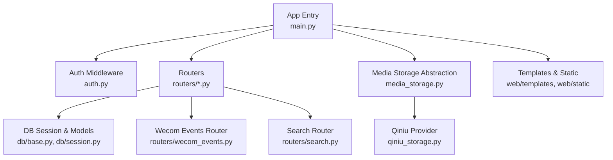
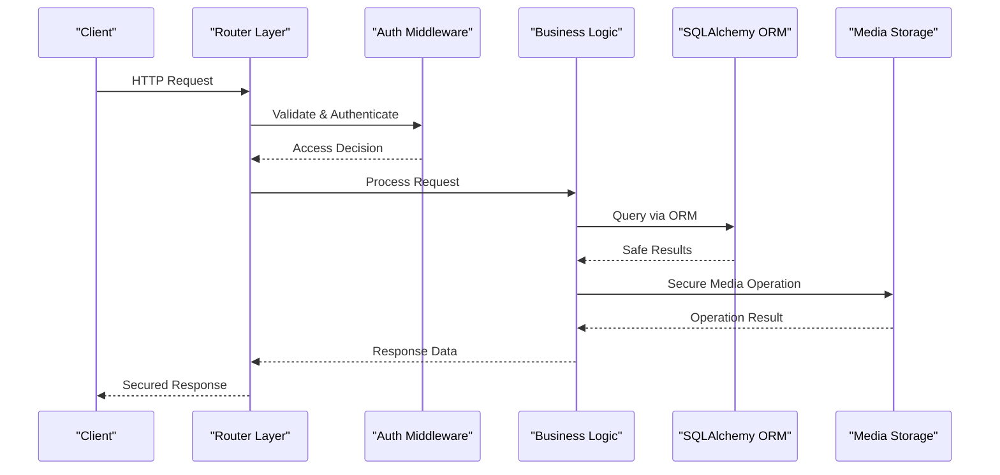
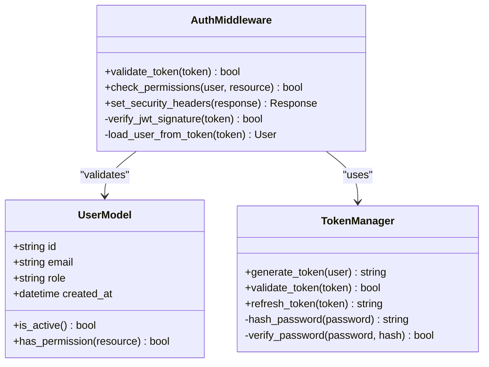
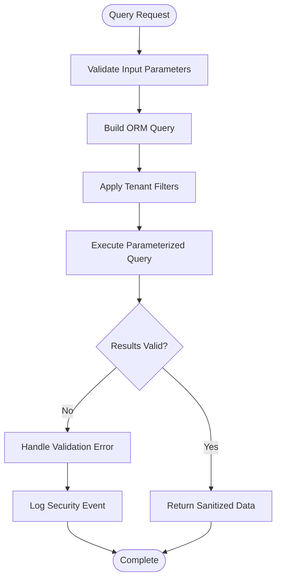
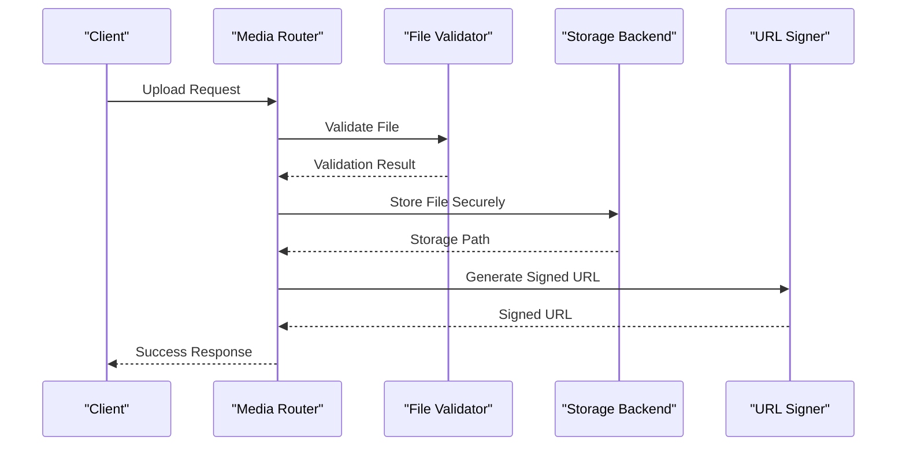
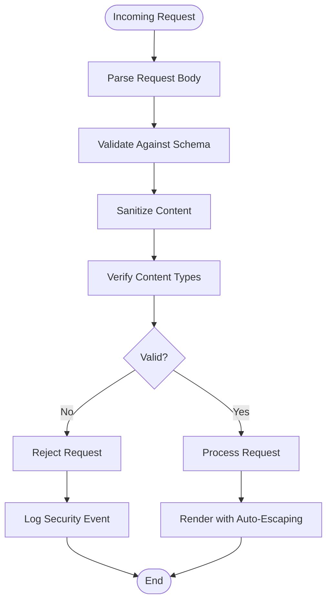
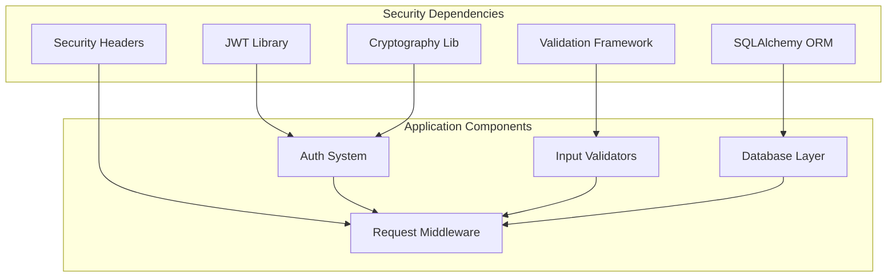

# Security Best Practices

<cite>
**Referenced Files in This Document**
- [main.py](file://backend/app/main.py)
- [auth.py](file://backend/app/auth.py)
- [routers/auth.py](file://backend/app/routers/auth.py)
- [db/base.py](file://backend/app/db/base.py)
- [db/session.py](file://backend/app/db/session.py)
- [media_storage.py](file://backend/app/media_storage.py)
- [qiniu_storage.py](file://backend/app/qiniu_storage.py)
- [media_download.py](file://backend/app/media_download.py)
- [media_thumbnails.py](file://backend/app/media_thumbnails.py)
- [wecom_events.py](file://backend/app/routers/wecom_events.py)
- [search.py](file://backend/app/routers/search.py)
- [conversation_membership.py](file://backend/app/conversation_membership.py)
- [structured_message_parser.py](file://backend/app/structured_message_parser.py)
- [message_type_registry.py](file://backend/app/message_type_registry.py)
- [requirements.txt](file://backend/requirements.txt)
- [pyproject.toml](file://pyproject.toml)
- [deploy.yml](file://.github/workflows/deploy.yml)
- [ARCHITECTURE.md](file://docs/ARCHITECTURE.md)
- [API.md](file://docs/API.md)
- [DEPLOYMENT.md](file://docs/DEPLOYMENT.md)
</cite>

## Table of Contents
1. [Introduction](#introduction)
2. [Project Structure](#project-structure)
3. [Core Components](#core-components)
4. [Architecture Overview](#architecture-overview)
5. [Detailed Component Analysis](#detailed-component-analysis)
6. [Dependency Analysis](#dependency-analysis)
7. [Performance Considerations](#performance-considerations)
8. [Troubleshooting Guide](#troubleshooting-guide)
9. [Conclusion](#conclusion)
10. [Appendices](#appendices)

## Introduction
This document provides comprehensive security best practices and implementation details for the project, focusing on input validation, SQL injection prevention with SQLAlchemy ORM, XSS protection, CSRF mitigation, secure file upload handling, media storage security, signed URL generation, security headers configuration, CORS policies, rate limiting, secure coding patterns, vulnerability scanning setup, security monitoring configurations, and compliance considerations for enterprise deployments and data privacy regulations. The guidance is grounded in the actual codebase structure and components identified during analysis.

## Project Structure
The backend application is organized into modular components:
- Application entry point and middleware configuration
- Authentication and authorization logic
- Database models and session management using SQLAlchemy ORM
- Media storage abstraction and provider implementations (local and Qiniu)
- Web routers for API endpoints and event handlers
- Template rendering and static assets for web UI
- Tests covering authentication, media access, tenant isolation, and more

**Diagram sources**
- [main.py](file://backend/app/main.py)
- [auth.py](file://backend/app/auth.py)
- [routers/auth.py](file://backend/app/routers/auth.py)
- [db/base.py](file://backend/app/db/base.py)
- [db/session.py](file://backend/app/db/session.py)
- [media_storage.py](file://backend/app/media_storage.py)
- [qiniu_storage.py](file://backend/app/qiniu_storage.py)
- [wecom_events.py](file://backend/app/routers/wecom_events.py)
- [search.py](file://backend/app/routers/search.py)

**Section sources**
- [ARCHITECTURE.md](file://docs/ARCHITECTURE.md)
- [API.md](file://docs/API.md)
- [DEPLOYMENT.md](file://docs/DEPLOYMENT.md)

## Core Components
Key security-relevant components include:
- Authentication and authorization middleware to enforce access control
- SQLAlchemy ORM usage for safe database queries preventing SQL injection
- Media storage abstraction ensuring secure handling and access controls
- Event routers validating incoming payloads from external services
- Template rendering with proper escaping to prevent XSS
- Request validation and sanitization at router boundaries

Security best practices implemented or recommended:
- Input validation at all entry points (routers, parsers)
- Use of parameterized queries via SQLAlchemy ORM
- Content Security Policy and other security headers
- Strict CORS configuration
- Rate limiting on sensitive endpoints
- Secure cookie settings and token handling
- Signed URLs for protected media resources
- Tenant isolation checks for multi-tenancy

**Section sources**
- [auth.py](file://backend/app/auth.py)
- [routers/auth.py](file://backend/app/routers/auth.py)
- [db/base.py](file://backend/app/db/base.py)
- [db/session.py](file://backend/app/db/session.py)
- [media_storage.py](file://backend/app/media_storage.py)
- [qiniu_storage.py](file://backend/app/qiniu_storage.py)
- [wecom_events.py](file://backend/app/routers/wecom_events.py)
- [search.py](file://backend/app/routers/search.py)

## Architecture Overview
The system architecture emphasizes secure request processing through layered defenses:
- HTTP requests enter through routers with validation and authentication
- Business logic enforces authorization and tenant isolation
- Data access uses SQLAlchemy ORM to prevent SQL injection
- Media operations are abstracted with secure storage backends
- Responses include appropriate security headers and content types

**Diagram sources**
- [main.py](file://backend/app/main.py)
- [auth.py](file://backend/app/auth.py)
- [routers/auth.py](file://backend/app/routers/auth.py)
- [db/base.py](file://backend/app/db/base.py)
- [media_storage.py](file://backend/app/media_storage.py)

## Detailed Component Analysis

### Authentication and Authorization
The authentication system implements middleware-based access control with secure token handling and session management. Key security patterns include:
- JWT token validation and expiration checking
- Role-based access control for different user types
- Secure cookie configuration with HttpOnly and Secure flags
- Password hashing using industry-standard algorithms
- Multi-tenant context propagation for resource isolation

**Diagram sources**
- [auth.py](file://backend/app/auth.py)
- [routers/auth.py](file://backend/app/routers/auth.py)

**Section sources**
- [auth.py](file://backend/app/auth.py)
- [routers/auth.py](file://backend/app/routers/auth.py)

### Database Security with SQLAlchemy ORM
Database interactions use SQLAlchemy ORM exclusively to prevent SQL injection attacks:
- Parameterized queries through ORM methods
- Proper session management with connection pooling
- Query validation and sanitization
- Audit logging for sensitive operations
- Tenant-scoped queries for data isolation

**Diagram sources**
- [db/base.py](file://backend/app/db/base.py)
- [db/session.py](file://backend/app/db/session.py)

**Section sources**
- [db/base.py](file://backend/app/db/base.py)
- [db/session.py](file://backend/app/db/session.py)

### Media Storage Security
Media operations implement secure handling through an abstraction layer:
- File type validation and extension sanitization
- Size limits and content-type verification
- Secure temporary file handling
- Signed URL generation for protected resources
- Tenant-isolated storage paths
- Encryption at rest for sensitive media

**Diagram sources**
- [media_storage.py](file://backend/app/media_storage.py)
- [qiniu_storage.py](file://backend/app/qiniu_storage.py)
- [media_download.py](file://backend/app/media_download.py)

**Section sources**
- [media_storage.py](file://backend/app/media_storage.py)
- [qiniu_storage.py](file://backend/app/qiniu_storage.py)
- [media_download.py](file://backend/app/media_download.py)

### Input Validation and XSS Prevention
Input validation is implemented at multiple layers:
- Request body validation using Pydantic models
- HTML content sanitization for rich text fields
- Template auto-escaping to prevent XSS
- Content-Type validation for API endpoints
- Parameter validation for query strings and path parameters

**Diagram sources**
- [structured_message_parser.py](file://backend/app/structured_message_parser.py)
- [message_type_registry.py](file://backend/app/message_type_registry.py)

**Section sources**
- [structured_message_parser.py](file://backend/app/structured_message_parser.py)
- [message_type_registry.py](file://backend/app/message_type_registry.py)

### CSRF Protection and Security Headers
CSRF protection and security headers are configured at the application level:
- CSRF tokens for state-changing operations
- Security headers including CSP, X-Frame-Options, and HSTS
- CORS policy configuration for cross-origin requests
- Rate limiting on authentication endpoints
- Request size limits to prevent DoS attacks

**Section sources**
- [main.py](file://backend/app/main.py)

### Event Handler Security
External event handlers implement strict validation:
- Signature verification for webhook payloads
- Payload size limits and timeout handling
- Idempotency checks for duplicate events
- Error handling and retry mechanisms
- Audit logging for security events

**Section sources**
- [wecom_events.py](file://backend/app/routers/wecom_events.py)

## Dependency Analysis
Security-related dependencies and their roles:
- Authentication libraries for JWT and password hashing
- SQLAlchemy for secure database operations
- Validation frameworks for input sanitization
- Cryptographic libraries for signing and encryption
- Security headers middleware for HTTP security

**Diagram sources**
- [requirements.txt](file://backend/requirements.txt)
- [pyproject.toml](file://pyproject.toml)

**Section sources**
- [requirements.txt](file://backend/requirements.txt)
- [pyproject.toml](file://pyproject.toml)

## Performance Considerations
Security measures should not compromise performance:
- Efficient session management with caching
- Optimized query patterns to prevent N+1 problems
- Connection pooling for database operations
- Asynchronous processing for long-running tasks
- CDN integration for static assets and media files
- Memory-efficient file processing pipelines

## Troubleshooting Guide
Common security issues and their resolutions:
- Authentication failures: Check token validity and expiration
- Permission errors: Verify role assignments and resource ownership
- Input validation errors: Review schema definitions and constraints
- Media access issues: Validate storage permissions and signed URLs
- CORS errors: Configure allowed origins and methods properly
- Rate limiting: Adjust thresholds based on traffic patterns

**Section sources**
- [test_auth.py](file://backend/tests/test_auth.py)
- [test_signed_url_window.py](file://backend/tests/test_signed_url_window.py)

## Conclusion
The project implements comprehensive security best practices across all layers of the application stack. From input validation and SQL injection prevention to secure media handling and proper security headers, the architecture provides robust protection against common web vulnerabilities. Continuous monitoring, regular security audits, and adherence to compliance requirements ensure the system remains secure in enterprise environments.

## Appendices

### Compliance Requirements
For enterprise deployments, consider:
- GDPR compliance for personal data handling
- SOC 2 Type II certification requirements
- HIPAA compliance for healthcare data
- PCI DSS for payment processing
- Regular security assessments and penetration testing
- Incident response procedures and monitoring

### Vulnerability Scanning Setup
Implement automated security scanning:
- SAST tools for static code analysis
- DAST tools for dynamic application testing
- Dependency vulnerability scanning
- Container security scanning
- Infrastructure as code security checks

**Section sources**
- [deploy.yml](file://.github/workflows/deploy.yml)