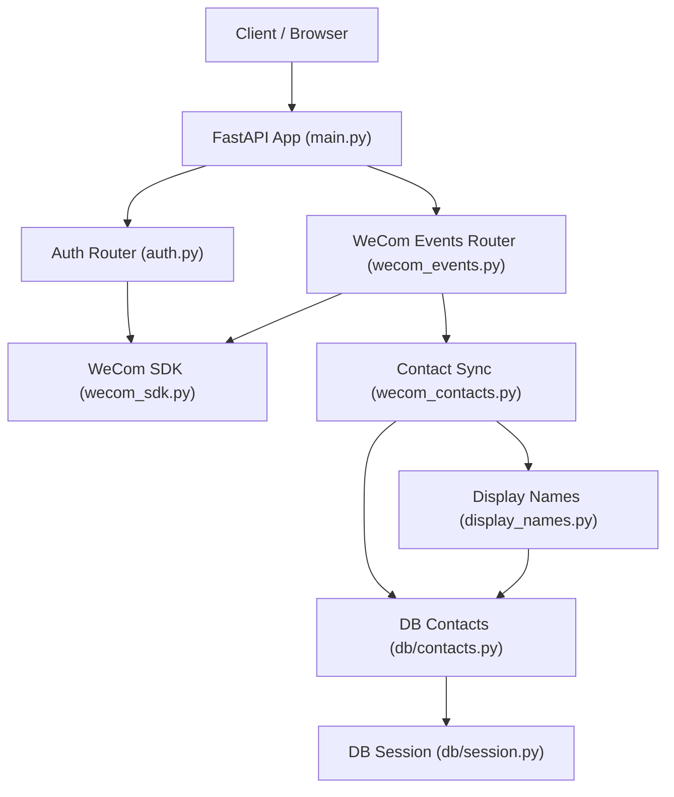
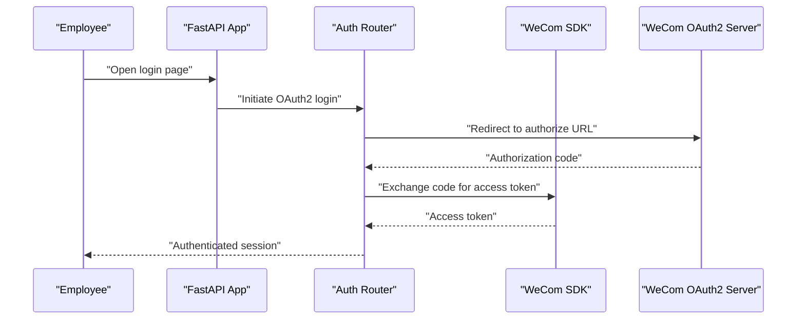
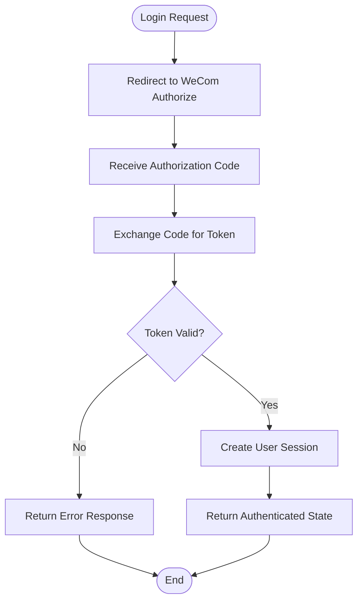
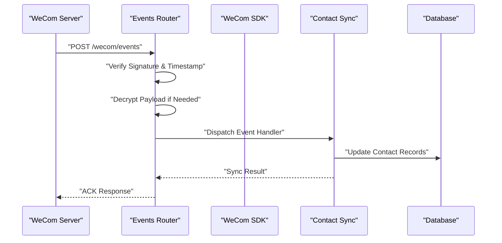
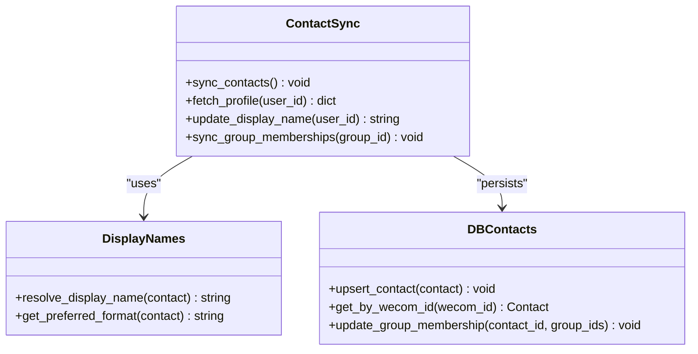
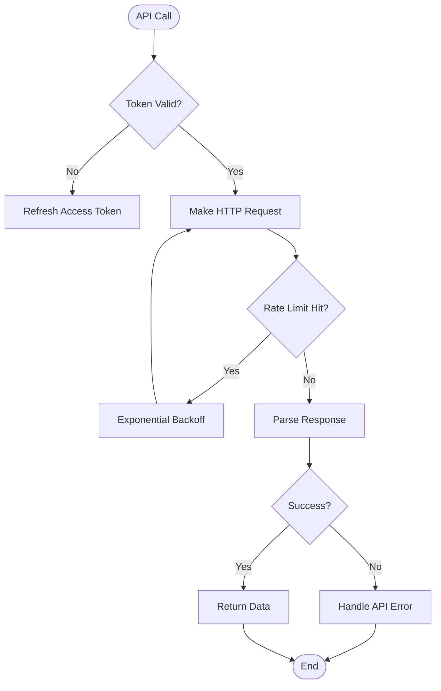
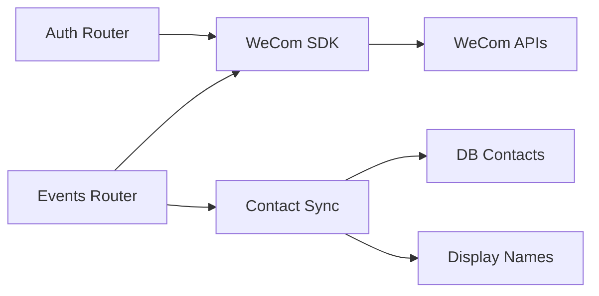

# WeCom Employee Login Integration

<cite>
**Referenced Files in This Document**
- [main.py](file://backend/app/main.py)
- [auth.py](file://backend/app/auth.py)
- [wecom_sdk.py](file://backend/app/sdk/wecom_sdk.py)
- [wecom_events.py](file://backend/app/routers/wecom_events.py)
- [wecom_contacts.py](file://backend/app/wecom_contacts.py)
- [display_names.py](file://backend/app/display_names.py)
- [contacts.py](file://backend/app/db/contacts.py)
- [models.py](file://backend/app/db/models.py)
- [session.py](file://backend/app/db/session.py)
- [test_auth.py](file://backend/tests/test_auth.py)
- [test_contact_sync.py](file://backend/tests/test_contact_sync.py)
- [test_wecom_sdk_media.py](file://backend/tests/test_wecom_sdk_media.py)
</cite>

## Table of Contents
1. [Introduction](#introduction)
2. [Project Structure](#project-structure)
3. [Core Components](#core-components)
4. [Architecture Overview](#architecture-overview)
5. [Detailed Component Analysis](#detailed-component-analysis)
6. [Dependency Analysis](#dependency-analysis)
7. [Performance Considerations](#performance-considerations)
8. [Troubleshooting Guide](#troubleshooting-guide)
9. [Conclusion](#conclusion)

## Introduction
This document explains the WeCom employee authentication integration, focusing on:
- OAuth2 login flow for WeCom employees
- Contact synchronization mechanisms and data mapping
- Event handling for user status changes via webhooks
- SDK usage patterns, API rate limiting, and error handling strategies
- Security considerations for webhook endpoints, signature verification, and message encryption
- Troubleshooting guidance and performance optimization tips

The backend is a Python application that integrates with WeCom APIs to authenticate users, synchronize contacts, and process events. It exposes internal routes for authentication and event ingestion, and uses a dedicated SDK module to interact with WeCom services.

## Project Structure
Key directories and files relevant to WeCom integration:
- Authentication and routing: app/auth.py, app/routers/wecom_events.py, app/main.py
- WeCom SDK: app/sdk/wecom_sdk.py
- Contact sync and display name resolution: app/wecom_contacts.py, app/display_names.py
- Database models and sessions: app/db/models.py, app/db/contacts.py, app/db/session.py
- Tests validating behavior: tests/test_auth.py, tests/test_contact_sync.py, tests/test_wecom_sdk_media.py

**Diagram sources**
- [main.py](file://backend/app/main.py)
- [auth.py](file://backend/app/auth.py)
- [wecom_events.py](file://backend/app/routers/wecom_events.py)
- [wecom_sdk.py](file://backend/app/sdk/wecom_sdk.py)
- [wecom_contacts.py](file://backend/app/wecom_contacts.py)
- [display_names.py](file://backend/app/display_names.py)
- [contacts.py](file://backend/app/db/contacts.py)
- [session.py](file://backend/app/db/session.py)

**Section sources**
- [main.py](file://backend/app/main.py)
- [auth.py](file://backend/app/auth.py)
- [wecom_events.py](file://backend/app/routers/wecom_events.py)
- [wecom_sdk.py](file://backend/app/sdk/wecom_sdk.py)
- [wecom_contacts.py](file://backend/app/wecom_contacts.py)
- [display_names.py](file://backend/app/display_names.py)
- [contacts.py](file://backend/app/db/contacts.py)
- [session.py](file://backend/app/db/session.py)

## Core Components
- Authentication router: Handles WeCom OAuth2 login flows and token exchange.
- WeCom events router: Receives and processes webhook events from WeCom, including user status changes.
- WeCom SDK: Encapsulates HTTP interactions with WeCom APIs, including access token management and request signing.
- Contact synchronization: Pulls and updates contact information, maps fields, and resolves display names.
- Display name resolution: Computes friendly names for users and groups based on available attributes.
- Database layer: Persists contact records and session state using SQLAlchemy models and sessions.

**Section sources**
- [auth.py](file://backend/app/auth.py)
- [wecom_events.py](file://backend/app/routers/wecom_events.py)
- [wecom_sdk.py](file://backend/app/sdk/wecom_sdk.py)
- [wecom_contacts.py](file://backend/app/wecom_contacts.py)
- [display_names.py](file://backend/app/display_names.py)
- [contacts.py](file://backend/app/db/contacts.py)
- [models.py](file://backend/app/db/models.py)
- [session.py](file://backend/app/db/session.py)

## Architecture Overview
The integration follows a typical FastAPI-based architecture:
- The main application registers routers for authentication and WeCom events.
- The auth router orchestrates OAuth2 login by redirecting users to WeCom and exchanging authorization codes for tokens.
- The events router validates incoming webhook payloads and dispatches handlers for specific event types.
- The WeCom SDK abstracts API calls, handles retries, and enforces rate limits.
- Contact synchronization runs periodically or on-demand, updating local records and resolving display names.

**Diagram sources**
- [main.py](file://backend/app/main.py)
- [auth.py](file://backend/app/auth.py)
- [wecom_sdk.py](file://backend/app/sdk/wecom_sdk.py)

**Section sources**
- [main.py](file://backend/app/main.py)
- [auth.py](file://backend/app/auth.py)
- [wecom_sdk.py](file://backend/app/sdk/wecom_sdk.py)

## Detailed Component Analysis

### Authentication Flow (OAuth2)
The authentication flow implements WeCom OAuth2 for employee login:
- Redirect users to WeCom’s authorization endpoint with client credentials and callback URL.
- Exchange the received authorization code for an access token via the SDK.
- Validate the token and establish a session for the authenticated user.
- Handle errors such as invalid codes, expired tokens, and network failures.

**Diagram sources**
- [auth.py](file://backend/app/auth.py)
- [wecom_sdk.py](file://backend/app/sdk/wecom_sdk.py)

**Section sources**
- [auth.py](file://backend/app/auth.py)
- [wecom_sdk.py](file://backend/app/sdk/wecom_sdk.py)
- [test_auth.py](file://backend/tests/test_auth.py)

### WeCom Events Handling
The events router processes webhook events from WeCom:
- Validates incoming requests using signature verification and timestamp checks.
- Decrypts encrypted payloads when required by WeCom’s security model.
- Dispatches handlers for specific event types, such as user status changes.
- Updates local contact records and triggers downstream actions.

**Diagram sources**
- [wecom_events.py](file://backend/app/routers/wecom_events.py)
- [wecom_sdk.py](file://backend/app/sdk/wecom_sdk.py)
- [wecom_contacts.py](file://backend/app/wecom_contacts.py)
- [contacts.py](file://backend/app/db/contacts.py)

**Section sources**
- [wecom_events.py](file://backend/app/routers/wecom_events.py)
- [wecom_sdk.py](file://backend/app/sdk/wecom_sdk.py)
- [wecom_contacts.py](file://backend/app/wecom_contacts.py)
- [contacts.py](file://backend/app/db/contacts.py)

### Contact Synchronization
Contact synchronization ensures local records match WeCom’s directory:
- Fetches contact lists and individual profiles from WeCom APIs.
- Maps WeCom fields to internal data structures, handling missing or null values.
- Resolves display names using preferred attributes (e.g., alias, name).
- Updates group memberships and department associations.

**Diagram sources**
- [wecom_contacts.py](file://backend/app/wecom_contacts.py)
- [display_names.py](file://backend/app/display_names.py)
- [contacts.py](file://backend/app/db/contacts.py)

**Section sources**
- [wecom_contacts.py](file://backend/app/wecom_contacts.py)
- [display_names.py](file://backend/app/display_names.py)
- [contacts.py](file://backend/app/db/contacts.py)
- [test_contact_sync.py](file://backend/tests/test_contact_sync.py)

### WeCom SDK Implementation
The SDK provides a unified interface for WeCom API interactions:
- Manages access tokens and refresh logic.
- Implements retry mechanisms for transient failures.
- Enforces rate limiting to comply with WeCom’s API quotas.
- Handles response parsing and error translation.

**Diagram sources**
- [wecom_sdk.py](file://backend/app/sdk/wecom_sdk.py)

**Section sources**
- [wecom_sdk.py](file://backend/app/sdk/wecom_sdk.py)
- [test_wecom_sdk_media.py](file://backend/tests/test_wecom_sdk_media.py)

## Dependency Analysis
The integration has clear dependency boundaries:
- Routers depend on the SDK for external API calls.
- Contact sync depends on database models and display name resolution.
- The SDK encapsulates all WeCom-specific logic, isolating it from business logic.

**Diagram sources**
- [auth.py](file://backend/app/auth.py)
- [wecom_events.py](file://backend/app/routers/wecom_events.py)
- [wecom_sdk.py](file://backend/app/sdk/wecom_sdk.py)
- [wecom_contacts.py](file://backend/app/wecom_contacts.py)
- [display_names.py](file://backend/app/display_names.py)
- [contacts.py](file://backend/app/db/contacts.py)

**Section sources**
- [auth.py](file://backend/app/auth.py)
- [wecom_events.py](file://backend/app/routers/wecom_events.py)
- [wecom_sdk.py](file://backend/app/sdk/wecom_sdk.py)
- [wecom_contacts.py](file://backend/app/wecom_contacts.py)
- [display_names.py](file://backend/app/display_names.py)
- [contacts.py](file://backend/app/db/contacts.py)

## Performance Considerations
- Implement connection pooling for WeCom API calls to reduce latency.
- Cache frequently accessed data like user profiles and group memberships.
- Use asynchronous processing for long-running operations like bulk contact sync.
- Monitor API rate limits and implement adaptive backoff strategies.
- Optimize database queries with proper indexing and batch operations.

[No sources needed since this section provides general guidance]

## Troubleshooting Guide
Common issues and resolutions:
- OAuth2 login failures: Verify client credentials, callback URLs, and network connectivity.
- Webhook validation errors: Ensure signature verification keys are correctly configured.
- Contact sync delays: Check API rate limits and implement incremental sync strategies.
- Display name resolution issues: Inspect field mappings and fallback logic.
- SDK errors: Review retry configurations and error handling paths.

**Section sources**
- [auth.py](file://backend/app/auth.py)
- [wecom_events.py](file://backend/app/routers/wecom_events.py)
- [wecom_sdk.py](file://backend/app/sdk/wecom_sdk.py)
- [wecom_contacts.py](file://backend/app/wecom_contacts.py)
- [display_names.py](file://backend/app/display_names.py)

## Conclusion
The WeCom employee authentication integration provides a robust foundation for secure employee login, contact synchronization, and event-driven updates. By following the documented patterns for OAuth2 flows, webhook handling, and API interactions, teams can maintain reliable integrations while addressing security and performance requirements effectively.

[No sources needed since this section summarizes without analyzing specific files]