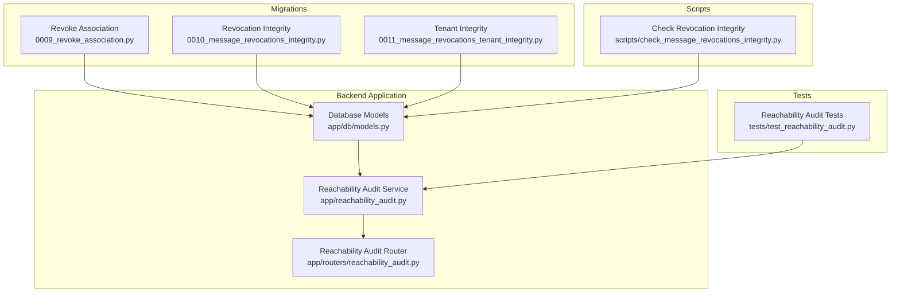
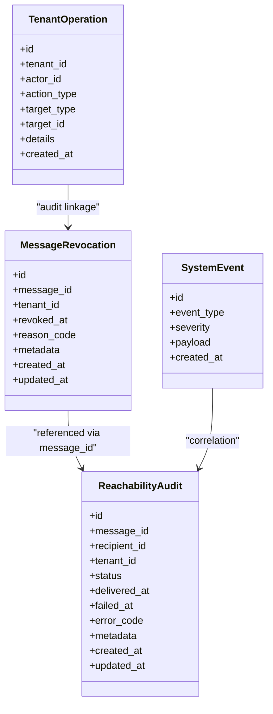
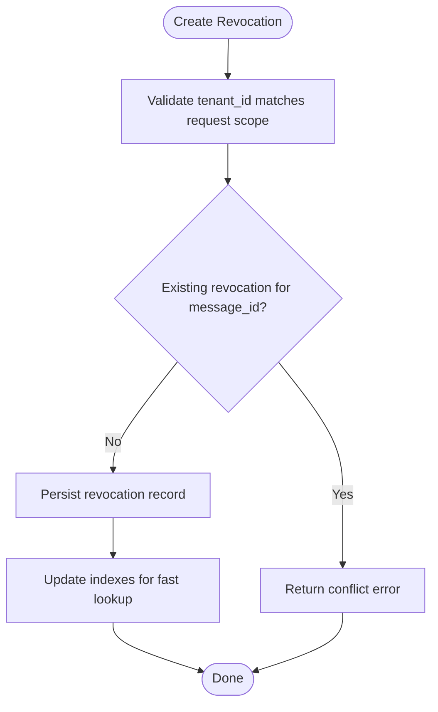
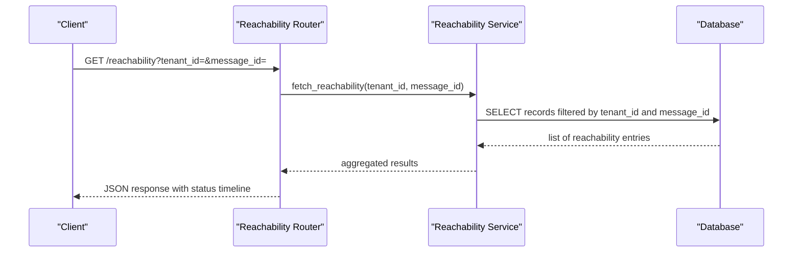
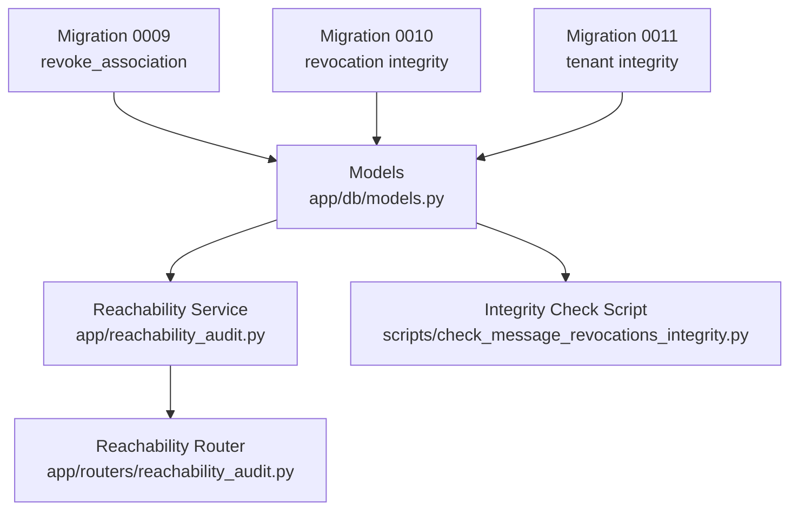

# Audit & Audit Trail

<cite>
**Referenced Files in This Document**
- [models.py](file://backend/app/db/models.py)
- [reachability_audit.py](file://backend/app/reachability_audit.py)
- [reachability_audit.py](file://backend/app/routers/reachability_audit.py)
- [0009_revoke_association.py](file://backend/alembic/versions/0009_revoke_association.py)
- [0010_message_revocations_integrity.py](file://backend/alembic/versions/0010_message_revocations_integrity.py)
- [0011_message_revocations_tenant_integrity.py](file://backend/alembic/versions/0011_message_revocations_tenant_integrity.py)
- [check_message_revocations_integrity.py](file://backend/scripts/check_message_revocations_integrity.py)
- [test_reachability_audit.py](file://backend/tests/test_reachability_audit.py)
- [DATA_MODEL.md](file://docs/DATA_MODEL.md)
</cite>

## Table of Contents
1. [Introduction](#introduction)
2. [Project Structure](#project-structure)
3. [Core Components](#core-components)
4. [Architecture Overview](#architecture-overview)
5. [Detailed Component Analysis](#detailed-component-analysis)
6. [Dependency Analysis](#dependency-analysis)
7. [Performance Considerations](#performance-considerations)
8. [Troubleshooting Guide](#troubleshooting-guide)
9. [Conclusion](#conclusion)
10. [Appendices](#appendices)

## Introduction
This document provides comprehensive data model documentation for the audit and reachability tracking systems within the project. It focuses on:
- The audit trail schema for message revocations, tenant operations, and system events
- The reachability audit model for tracking message delivery status and compliance reporting
- Data retention policies, audit log rotation, and privacy considerations
- Query patterns for compliance reporting and operational monitoring
- Integrity constraints ensuring audit data consistency across tenants
- Examples of audit queries and report generation

The goal is to make the audit and reachability models clear and actionable for both technical and non-technical readers.

## Project Structure
The audit and reachability features are implemented primarily in:
- Database models and migrations under backend/app/db and backend/alembic/versions
- Reachability audit logic and API router under backend/app/reachability_audit.py and backend/app/routers/reachability_audit.py
- Scripts for integrity checks and backfills under backend/scripts
- Tests validating behavior under backend/tests
- High-level data model documentation under docs/DATA_MODEL.md

**Diagram sources**
- [models.py](file://backend/app/db/models.py)
- [reachability_audit.py](file://backend/app/reachability_audit.py)
- [reachability_audit.py](file://backend/app/routers/reachability_audit.py)
- [0009_revoke_association.py](file://backend/alembic/versions/0009_revoke_association.py)
- [0010_message_revocations_integrity.py](file://backend/alembic/versions/0010_message_revocations_integrity.py)
- [0011_message_revocations_tenant_integrity.py](file://backend/alembic/versions/0011_message_revocations_tenant_integrity.py)
- [check_message_revocations_integrity.py](file://backend/scripts/check_message_revocations_integrity.py)
- [test_reachability_audit.py](file://backend/tests/test_reachability_audit.py)

**Section sources**
- [models.py](file://backend/app/db/models.py)
- [reachability_audit.py](file://backend/app/reachability_audit.py)
- [reachability_audit.py](file://backend/app/routers/reachability_audit.py)
- [0009_revoke_association.py](file://backend/alembic/versions/0009_revoke_association.py)
- [0010_message_revocations_integrity.py](file://backend/alembic/versions/0010_message_revocations_integrity.py)
- [0011_message_revocations_tenant_integrity.py](file://backend/alembic/versions/0011_message_revocations_tenant_integrity.py)
- [check_message_revocations_integrity.py](file://backend/scripts/check_message_revocations_integrity.py)
- [test_reachability_audit.py](file://backend/tests/test_reachability_audit.py)
- [DATA_MODEL.md](file://docs/DATA_MODEL.md)

## Core Components
- Message Revocations Model: Captures revocation events with tenant scoping and integrity constraints.
- Reachability Audit Model: Tracks message delivery outcomes per recipient and supports compliance queries.
- Tenant Operations and System Events: Part of the broader audit trail; ensure isolation by tenant and consistent timestamps.
- Integrity Checks: Scripts and migrations enforce referential and tenant-scoped integrity.

Key responsibilities:
- Persist immutable audit records with strong tenant boundaries
- Provide efficient query surfaces for compliance and operational monitoring
- Enforce constraints to prevent inconsistent or cross-tenant leakage

**Section sources**
- [models.py](file://backend/app/db/models.py)
- [0009_revoke_association.py](file://backend/alembic/versions/0009_revoke_association.py)
- [0010_message_revocations_integrity.py](file://backend/alembic/versions/0010_message_revocations_integrity.py)
- [0011_message_revocations_tenant_integrity.py](file://backend/alembic/versions/0011_message_revocations_tenant_integrity.py)
- [check_message_revocations_integrity.py](file://backend/scripts/check_message_revocations_integrity.py)

## Architecture Overview
The audit and reachability architecture centers around persistent models and service layers that enforce tenant isolation and integrity.

**Diagram sources**
- [models.py](file://backend/app/db/models.py)
- [0009_revoke_association.py](file://backend/alembic/versions/0009_revoke_association.py)
- [0010_message_revocations_integrity.py](file://backend/alembic/versions/0010_message_revocations_integrity.py)
- [0011_message_revocations_tenant_integrity.py](file://backend/alembic/versions/0011_message_revocations_tenant_integrity.py)

## Detailed Component Analysis

### Message Revocations Model
Purpose:
- Record when a message is revoked, including reason and metadata
- Ensure tenant-scoped integrity and referential consistency

Key attributes (conceptual):
- id: primary key
- message_id: references original message entity
- tenant_id: tenant boundary
- revoked_at: timestamp of revocation
- reason_code: standardized code for revocation cause
- metadata: additional context
- created_at / updated_at: lifecycle timestamps

Constraints and integrity:
- Unique constraints per tenant and message_id to avoid duplicate revocations
- Foreign key relationships enforced through migrations
- Tenant-scoped uniqueness ensures no cross-tenant collisions

**Diagram sources**
- [0009_revoke_association.py](file://backend/alembic/versions/0009_revoke_association.py)
- [0010_message_revocations_integrity.py](file://backend/alembic/versions/0010_message_revocations_integrity.py)
- [0011_message_revocations_tenant_integrity.py](file://backend/alembic/versions/0011_message_revocations_tenant_integrity.py)

**Section sources**
- [0009_revoke_association.py](file://backend/alembic/versions/0009_revoke_association.py)
- [0010_message_revocations_integrity.py](file://backend/alembic/versions/0010_message_revocations_integrity.py)
- [0011_message_revocations_tenant_integrity.py](file://backend/alembic/versions/0011_message_revocations_tenant_integrity.py)
- [check_message_revocations_integrity.py](file://backend/scripts/check_message_revocations_integrity.py)

### Reachability Audit Model
Purpose:
- Track delivery status of messages to recipients
- Support compliance reporting and operational monitoring

Key attributes (conceptual):
- id: primary key
- message_id: links to message entity
- recipient_id: identifies recipient
- tenant_id: tenant boundary
- status: e.g., delivered, failed, pending
- delivered_at / failed_at: outcome timestamps
- error_code: failure reason if applicable
- metadata: additional details
- created_at / updated_at: lifecycle timestamps

Query patterns:
- By tenant and time range for compliance reports
- By message_id to reconstruct delivery timeline
- By recipient_id to analyze delivery performance
- Aggregations for success rates and failure reasons

**Diagram sources**
- [reachability_audit.py](file://backend/app/reachability_audit.py)
- [reachability_audit.py](file://backend/app/routers/reachability_audit.py)

**Section sources**
- [reachability_audit.py](file://backend/app/reachability_audit.py)
- [reachability_audit.py](file://backend/app/routers/reachability_audit.py)
- [test_reachability_audit.py](file://backend/tests/test_reachability_audit.py)

### Tenant Operations and System Events
Purpose:
- Log tenant-scoped administrative actions and system-wide events
- Maintain chronological audit trails for accountability and diagnostics

Key attributes (conceptual):
- TenantOperation: actor_id, action_type, target_type, target_id, details
- SystemEvent: event_type, severity, payload

Privacy considerations:
- Avoid storing sensitive payloads in plain text
- Use structured fields for categorization and minimal detail storage
- Enforce tenant isolation at query and write paths

**Section sources**
- [models.py](file://backend/app/db/models.py)
- [DATA_MODEL.md](file://docs/DATA_MODEL.md)

## Dependency Analysis
The audit and reachability components depend on database models and migrations to enforce integrity and tenant scoping.

**Diagram sources**
- [models.py](file://backend/app/db/models.py)
- [0009_revoke_association.py](file://backend/alembic/versions/0009_revoke_association.py)
- [0010_message_revocations_integrity.py](file://backend/alembic/versions/0010_message_revocations_integrity.py)
- [0011_message_revocations_tenant_integrity.py](file://backend/alembic/versions/0011_message_revocations_tenant_integrity.py)
- [reachability_audit.py](file://backend/app/reachability_audit.py)
- [reachability_audit.py](file://backend/app/routers/reachability_audit.py)
- [check_message_revocations_integrity.py](file://backend/scripts/check_message_revocations_integrity.py)

**Section sources**
- [models.py](file://backend/app/db/models.py)
- [0009_revoke_association.py](file://backend/alembic/versions/0009_revoke_association.py)
- [0010_message_revocations_integrity.py](file://backend/alembic/versions/0010_message_revocations_integrity.py)
- [0011_message_revocations_tenant_integrity.py](file://backend/alembic/versions/0011_message_revocations_tenant_integrity.py)
- [reachability_audit.py](file://backend/app/reachability_audit.py)
- [reachability_audit.py](file://backend/app/routers/reachability_audit.py)
- [check_message_revocations_integrity.py](file://backend/scripts/check_message_revocations_integrity.py)

## Performance Considerations
- Indexing strategies:
  - Composite indexes on (tenant_id, message_id) for revocations and reachability queries
  - Indexes on (tenant_id, status) for compliance aggregations
- Partitioning:
  - Consider time-based partitioning for large audit tables to improve query performance
- Caching:
  - Cache frequent compliance aggregates where appropriate
- Batch writes:
  - Use batch inserts for high-volume reachability updates to reduce transaction overhead

[No sources needed since this section provides general guidance]

## Troubleshooting Guide
Common issues and resolutions:
- Duplicate revocation errors:
  - Verify unique constraints and ensure idempotent creation paths
- Cross-tenant data leakage:
  - Confirm tenant_id filtering at all query and write points
- Missing reachability records:
  - Check ingestion pipelines and worker jobs for failures
- Integrity violations:
  - Run integrity check scripts and reconcile discrepancies

Operational steps:
- Use integrity check script to validate revocation associations
- Inspect logs for failed deliveries and error codes
- Re-run reconciliation jobs to backfill missing records

**Section sources**
- [check_message_revocations_integrity.py](file://backend/scripts/check_message_revocations_integrity.py)
- [test_reachability_audit.py](file://backend/tests/test_reachability_audit.py)

## Conclusion
The audit and reachability systems provide robust, tenant-scoped tracking for message revocations and delivery outcomes. Strong integrity constraints, clear query patterns, and operational scripts support compliance reporting and monitoring. Adhering to the documented data models and practices ensures consistency, privacy, and performance.

[No sources needed since this section summarizes without analyzing specific files]

## Appendices

### Data Retention Policies and Audit Log Rotation
- Retention windows:
  - Define retention periods per audit type (e.g., revocations, reachability, tenant operations)
- Rotation strategy:
  - Archive older records to cold storage
  - Purge expired records based on policy
- Privacy safeguards:
  - Mask or remove sensitive metadata after retention period
  - Ensure anonymization where required by compliance

[No sources needed since this section provides general guidance]

### Compliance Reporting Queries
Examples of typical queries:
- Revocation summary by tenant and month
- Delivery success rate by recipient group
- Failure reasons distribution over time
- Timeline reconstruction for a specific message

[No sources needed since this section provides general guidance]

### Privacy Considerations
- Minimize stored sensitive data
- Encrypt sensitive fields at rest
- Restrict access to audit logs by role and tenant
- Audit access to audit logs themselves

[No sources needed since this section provides general guidance]