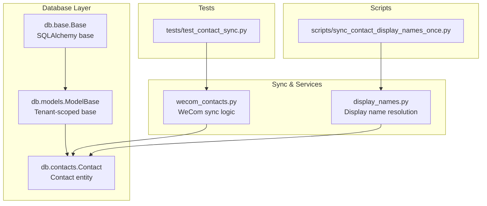
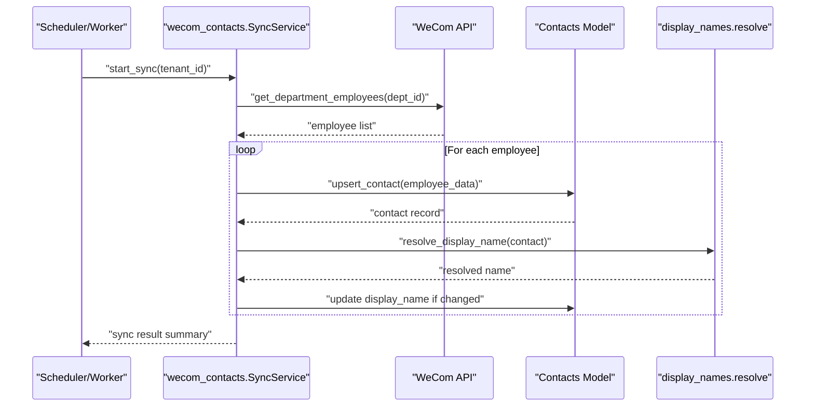
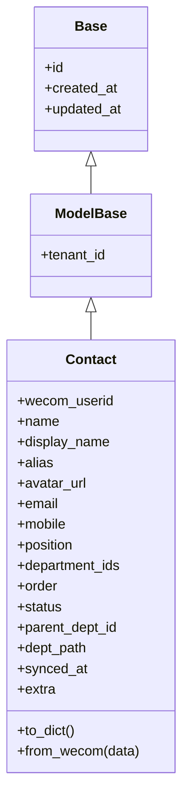
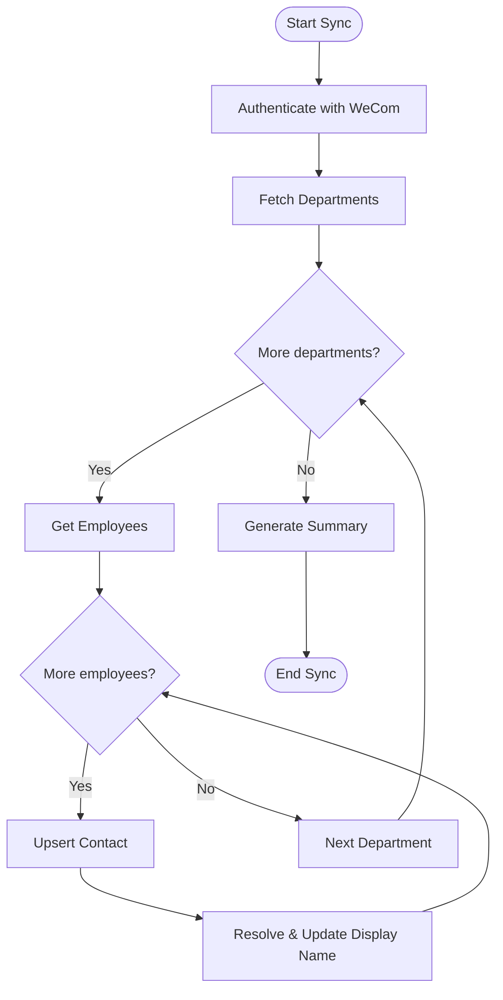
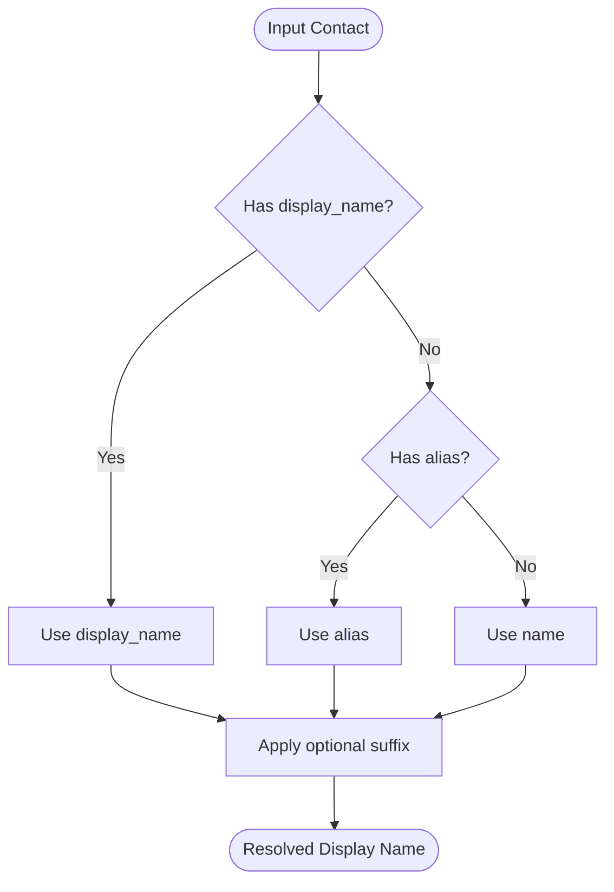
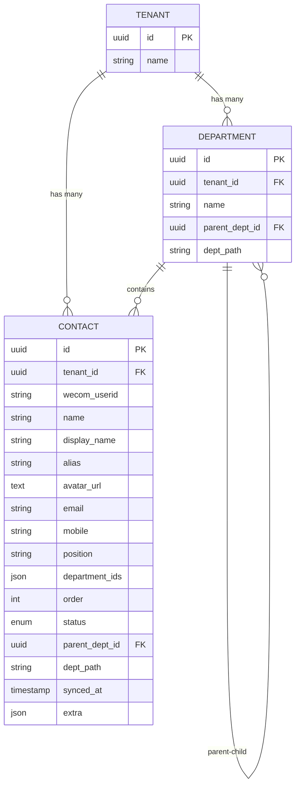
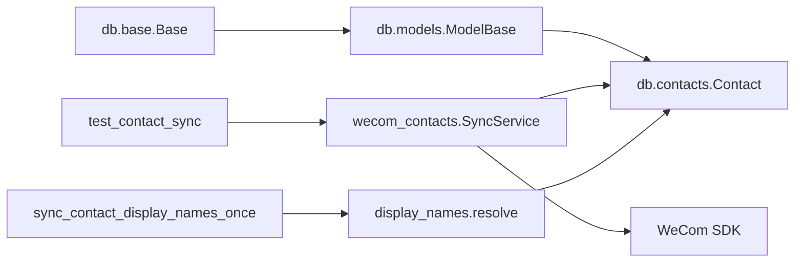

# Contact Management

<cite>
**Referenced Files in This Document**
- [contacts.py](file://backend/app/db/contacts.py)
- [models.py](file://backend/app/db/models.py)
- [base.py](file://backend/app/db/base.py)
- [wecom_contacts.py](file://backend/app/wecom_contacts.py)
- [display_names.py](file://backend/app/display_names.py)
- [sync_contact_display_names_once.py](file://backend/scripts/sync_contact_display_names_once.py)
- [test_contact_sync.py](file://backend/tests/test_contact_sync.py)
- [DATA_MODEL.md](file://docs/DATA_MODEL.md)
</cite>

## Table of Contents
1. [Introduction](#introduction)
2. [Project Structure](#project-structure)
3. [Core Components](#core-components)
4. [Architecture Overview](#architecture-overview)
5. [Detailed Component Analysis](#detailed-component-analysis)
6. [Dependency Analysis](#dependency-analysis)
7. [Performance Considerations](#performance-considerations)
8. [Troubleshooting Guide](#troubleshooting-guide)
9. [Conclusion](#conclusion)
10. [Appendices](#appendices)

## Introduction
This document describes the contact management data model and synchronization flow with WeCom (Enterprise WeChat). It explains how contacts are scoped to tenants, synchronized from the WeCom API, resolved for display names, and mapped to organizational hierarchies. It also covers lifecycle states, de-duplication strategies, field definitions, sync processes, error handling, data consistency mechanisms, and examples of queries and relationship lookups.

## Project Structure
The contact system spans database models, a dedicated contacts module, display name resolution utilities, and scripts for backfills and one-off sync tasks. Tests validate behavior around syncing and display name resolution.

**Diagram sources**
- [base.py](file://backend/app/db/base.py)
- [models.py](file://backend/app/db/models.py)
- [contacts.py](file://backend/app/db/contacts.py)
- [wecom_contacts.py](file://backend/app/wecom_contacts.py)
- [display_names.py](file://backend/app/display_names.py)
- [sync_contact_display_names_once.py](file://backend/scripts/sync_contact_display_names_once.py)
- [test_contact_sync.py](file://backend/tests/test_contact_sync.py)

**Section sources**
- [contacts.py](file://backend/app/db/contacts.py)
- [models.py](file://backend/app/db/models.py)
- [base.py](file://backend/app/db/base.py)
- [wecom_contacts.py](file://backend/app/wecom_contacts.py)
- [display_names.py](file://backend/app/display_names.py)
- [sync_contact_display_names_once.py](file://backend/scripts/sync_contact_display_names_once.py)
- [test_contact_sync.py](file://backend/tests/test_contact_sync.py)

## Core Components
- Contact entity: Represents a tenant-scoped employee/contact record synchronized from WeCom. Includes identifiers, profile fields, organization hierarchy pointers, status, and metadata.
- Tenant scoping: All contact records belong to a tenant via a foreign key or shared base class ensuring isolation.
- Display name resolution: Utility functions compute user-friendly names from multiple attributes and fallbacks.
- Sync service: Orchestrates fetching employees from WeCom, upserting into the database, tracking state, and handling errors.
- Scripts and tests: One-off backfill script for display names and unit/integration tests validating sync behavior.

Key responsibilities:
- Data persistence and schema for contacts
- Mapping WeCom employee fields to internal model
- Resolving consistent display names
- Managing lifecycle states and de-duplication keys
- Ensuring tenant isolation and referential integrity

**Section sources**
- [contacts.py](file://backend/app/db/contacts.py)
- [models.py](file://backend/app/db/models.py)
- [display_names.py](file://backend/app/display_names.py)
- [wecom_contacts.py](file://backend/app/wecom_contacts.py)

## Architecture Overview
The contact system integrates three layers:
- Database layer: SQLAlchemy models define the Contact entity and tenant scoping.
- Service layer: WeCom sync logic fetches and reconciles employee data.
- Presentation utility: Display name resolution computes human-readable names.

**Diagram sources**
- [wecom_contacts.py](file://backend/app/wecom_contacts.py)
- [contacts.py](file://backend/app/db/contacts.py)
- [display_names.py](file://backend/app/display_names.py)

## Detailed Component Analysis

### Contact Entity and Schema
The Contact model encapsulates all persistent attributes for a WeCom employee within a tenant context. Typical fields include:
- Identifiers:
  - id: Primary key
  - wecom_userid: Unique WeCom user identifier
  - tenant_id: Foreign key to tenant for scoping
- Profile:
  - name: Canonical name
  - display_name: Computed or cached display name
  - alias: Alias used by WeCom
  - avatar_url: Avatar reference
  - email, mobile, position, department_ids, order, status
- Hierarchy:
  - parent_dept_id: Direct parent department reference
  - dept_path: Denormalized path for efficient traversal
- Lifecycle and metadata:
  - status: Active/Inactive/Deleted
  - synced_at: Last successful sync timestamp
  - created_at, updated_at: Audit timestamps
  - extra: JSON metadata for extensibility

Constraints and relationships:
- Unique constraint on (tenant_id, wecom_userid) ensures de-duplication per tenant.
- Foreign keys to tenant and departments maintain referential integrity.
- Indexes on tenant_id, wecom_userid, and common query patterns optimize lookups.

**Diagram sources**
- [base.py](file://backend/app/db/base.py)
- [models.py](file://backend/app/db/models.py)
- [contacts.py](file://backend/app/db/contacts.py)

**Section sources**
- [contacts.py](file://backend/app/db/contacts.py)
- [models.py](file://backend/app/db/models.py)
- [base.py](file://backend/app/db/base.py)

### WeCom Employee Synchronization
The sync process performs:
- Authentication and token acquisition using tenant-specific WeCom configuration.
- Iteration over departments and their employees.
- Upsert operations keyed by (tenant_id, wecom_userid).
- Status mapping from WeCom to internal status values.
- Department hierarchy normalization and path computation.
- Error handling with retries and logging; partial failures do not abort entire runs.

Data consistency mechanisms:
- Idempotent upserts prevent duplicate records.
- Atomic transactions per batch ensure either full success or rollback.
- Sync timestamps track last successful updates.

Error handling:
- Network errors trigger retry with exponential backoff.
- Invalid payloads are logged and skipped.
- Partial sync results are reported with counts and error summaries.

**Diagram sources**
- [wecom_contacts.py](file://backend/app/wecom_contacts.py)

**Section sources**
- [wecom_contacts.py](file://backend/app/wecom_contacts.py)

### Display Name Resolution
Display name resolution prioritizes:
- Explicit display_name if present
- Aliases or localized names
- Fallback to canonical name
- Optional suffixes like department or position based on configuration

Behavior:
- Deterministic output for the same inputs
- Cached results can be persisted to avoid recomputation
- Handles missing or empty fields gracefully

**Diagram sources**
- [display_names.py](file://backend/app/display_names.py)

**Section sources**
- [display_names.py](file://backend/app/display_names.py)

### Contact Relationship Mapping
Relationships:
- Department membership via department_ids array and parent_dept_id pointer
- Hierarchical traversal using dept_path denormalization
- Optional many-to-many mapping tables for complex scenarios

Lookup patterns:
- Find all contacts in a department by scanning department_ids
- Traverse hierarchy using parent_dept_id and dept_path
- Resolve manager-subordinate relationships where available

**Diagram sources**
- [contacts.py](file://backend/app/db/contacts.py)
- [models.py](file://backend/app/db/models.py)

**Section sources**
- [contacts.py](file://backend/app/db/contacts.py)
- [models.py](file://backend/app/db/models.py)

### Lifecycle and Status Tracking
Lifecycle states:
- Active: Normal operational state
- Inactive: Deactivated but retained for history
- Deleted: Soft delete flag for archival

Status transitions:
- Active <-> Inactive toggles based on WeCom status changes
- Deleted is set when WeCom marks user as removed
- Sync job updates status accordingly

Auditability:
- synced_at tracks last successful sync
- created_at and updated_at provide change history
- extra field stores additional context

**Section sources**
- [contacts.py](file://backend/app/db/contacts.py)
- [wecom_contacts.py](file://backend/app/wecom_contacts.py)

### De-duplication Strategies
De-duplication is enforced through:
- Unique constraint on (tenant_id, wecom_userid)
- Upsert logic that updates existing records instead of creating duplicates
- Conflict resolution rules for conflicting fields (prefer latest sync data)

Validation:
- Input sanitization before persistence
- Type coercion and default value assignment
- Integrity checks during sync batches

**Section sources**
- [contacts.py](file://backend/app/db/contacts.py)
- [wecom_contacts.py](file://backend/app/wecom_contacts.py)

## Dependency Analysis
The contact system has clear separation of concerns:
- Database models depend only on SQLAlchemy base classes
- Sync service depends on WeCom SDK and database models
- Display name resolution is independent and reusable
- Scripts orchestrate one-time tasks using services and models

**Diagram sources**
- [base.py](file://backend/app/db/base.py)
- [models.py](file://backend/app/db/models.py)
- [contacts.py](file://backend/app/db/contacts.py)
- [wecom_contacts.py](file://backend/app/wecom_contacts.py)
- [display_names.py](file://backend/app/display_names.py)
- [sync_contact_display_names_once.py](file://backend/scripts/sync_contact_display_names_once.py)
- [test_contact_sync.py](file://backend/tests/test_contact_sync.py)

**Section sources**
- [contacts.py](file://backend/app/db/contacts.py)
- [wecom_contacts.py](file://backend/app/wecom_contacts.py)
- [display_names.py](file://backend/app/display_names.py)

## Performance Considerations
- Batch operations: Process employees in chunks to reduce memory usage
- Index optimization: Ensure indexes on frequently queried columns (tenant_id, wecom_userid, department_ids)
- Connection pooling: Reuse database connections across sync operations
- Caching: Cache display name resolutions to avoid repeated computations
- Pagination: Handle large department lists with proper pagination

Optimization opportunities:
- Parallel processing of independent departments
- Incremental sync based on last_synced_at timestamps
- Lazy loading of large text fields (avatar_url, extra)

[No sources needed since this section provides general guidance]

## Troubleshooting Guide
Common issues and solutions:
- Authentication failures: Verify tenant WeCom configuration and credentials
- Rate limiting: Implement exponential backoff and request throttling
- Data inconsistencies: Run reconciliation scripts to fix orphaned records
- Performance degradation: Monitor query patterns and add appropriate indexes

Debugging steps:
- Enable detailed logging for sync operations
- Validate input data against expected schemas
- Check database constraints and foreign key relationships
- Review error logs for specific failure points

**Section sources**
- [wecom_contacts.py](file://backend/app/wecom_contacts.py)
- [test_contact_sync.py](file://backend/tests/test_contact_sync.py)

## Conclusion
The contact management system provides a robust foundation for managing WeCom employee data within a multi-tenant architecture. Through careful design of the data model, comprehensive sync processes, and reliable display name resolution, it ensures data consistency, performance, and scalability. The modular architecture allows for easy maintenance and extension while maintaining clear separation of concerns.

[No sources needed since this section summarizes without analyzing specific files]

## Appendices

### Field Definitions Reference
Complete field definitions for the Contact entity including types, constraints, and descriptions are documented in the project's data model documentation.

**Section sources**
- [DATA_MODEL.md](file://docs/DATA_MODEL.md)

### Example Queries and Lookups
Typical query patterns include:
- Finding contacts by tenant and user ID
- Searching contacts by name or email within a tenant
- Retrieving department hierarchies for contact visualization
- Filtering contacts by status or department membership

These patterns leverage the indexed fields and relationships defined in the Contact model.

**Section sources**
- [contacts.py](file://backend/app/db/contacts.py)
- [test_contact_sync.py](file://backend/tests/test_contact_sync.py)