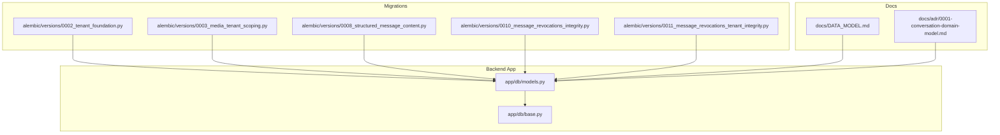
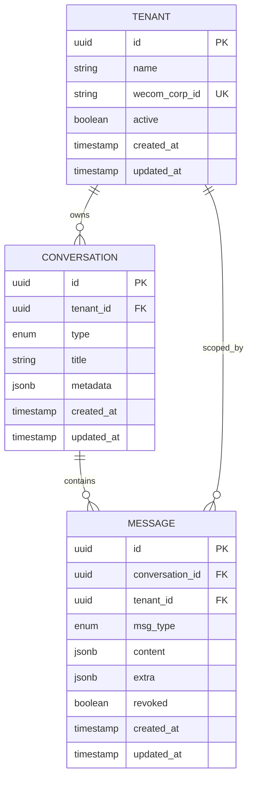
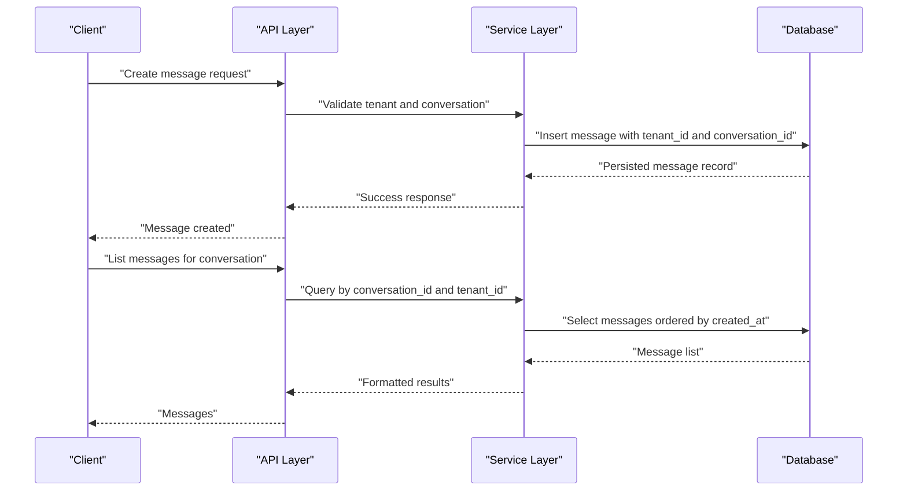
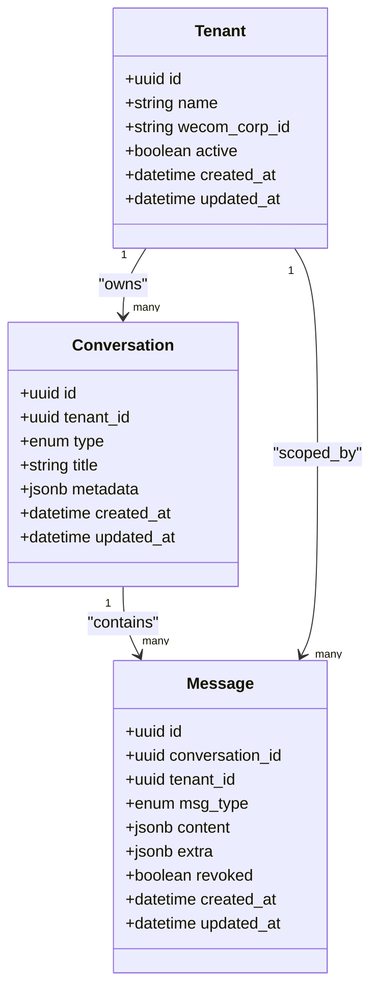
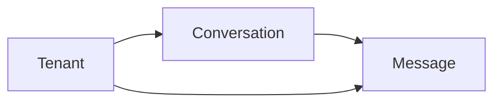

# Core Entities

<cite>
**Referenced Files in This Document**
- [models.py](file://backend/app/db/models.py)
- [base.py](file://backend/app/db/base.py)
- [0002_tenant_foundation.py](file://backend/alembic/versions/0002_tenant_foundation.py)
- [0003_media_tenant_scoping.py](file://backend/alembic/versions/0003_media_tenant_scoping.py)
- [0008_structured_message_content.py](file://backend/alembic/versions/0008_structured_message_content.py)
- [0010_message_revocations_integrity.py](file://backend/alembic/versions/0010_message_revocations_integrity.py)
- [0011_message_revocations_tenant_integrity.py](file://backend/alembic/versions/0011_message_revocations_tenant_integrity.py)
- [DATA_MODEL.md](file://docs/DATA_MODEL.md)
- [conversation_domain_model.md](file://docs/adr/0001-conversation-domain-model.md)
</cite>

## Table of Contents
1. [Introduction](#introduction)
2. [Project Structure](#project-structure)
3. [Core Components](#core-components)
4. [Architecture Overview](#architecture-overview)
5. [Detailed Component Analysis](#detailed-component-analysis)
6. [Dependency Analysis](#dependency-analysis)
7. [Performance Considerations](#performance-considerations)
8. [Troubleshooting Guide](#troubleshooting-guide)
9. [Conclusion](#conclusion)
10. [Appendices](#appendices)

## Introduction
This document provides a comprehensive data model for the core entities: Tenant, Conversation, and Message. It explains multi-tenant isolation, conversation hierarchy (group chats vs direct messages), message types (text, image, video, file), field definitions, constraints, validation rules, foreign key relationships, indexing strategies, query patterns, and business rules governing entity relationships. The goal is to make the data model accessible to both technical and non-technical readers while remaining grounded in the repository’s implementation.

## Project Structure
The data model is defined primarily in the application database models and Alembic migrations. Key files include:
- Application-level ORM models and base configuration
- Migrations that establish and evolve the schema for tenants, conversations, messages, and related structures
- Documentation describing the data model and conversation domain

**Diagram sources**
- [models.py](file://backend/app/db/models.py)
- [base.py](file://backend/app/db/base.py)
- [0002_tenant_foundation.py](file://backend/alembic/versions/0002_tenant_foundation.py)
- [0003_media_tenant_scoping.py](file://backend/alembic/versions/0003_media_tenant_scoping.py)
- [0008_structured_message_content.py](file://backend/alembic/versions/0008_structured_message_content.py)
- [0010_message_revocations_integrity.py](file://backend/alembic/versions/0010_message_revocations_integrity.py)
- [0011_message_revocations_tenant_integrity.py](file://backend/alembic/versions/0011_message_revocations_tenant_integrity.py)
- [DATA_MODEL.md](file://docs/DATA_MODEL.md)
- [conversation_domain_model.md](file://docs/adr/0001-conversation-domain-model.md)

**Section sources**
- [models.py](file://backend/app/db/models.py)
- [base.py](file://backend/app/db/base.py)
- [0002_tenant_foundation.py](file://backend/alembic/versions/0002_tenant_foundation.py)
- [0003_media_tenant_scoping.py](file://backend/alembic/versions/0003_media_tenant_scoping.py)
- [0008_structured_message_content.py](file://backend/alembic/versions/0008_structured_message_content.py)
- [0010_message_revocations_integrity.py](file://backend/alembic/versions/0010_message_revocations_integrity.py)
- [0011_message_revocations_tenant_integrity.py](file://backend/alembic/versions/0011_message_revocations_tenant_integrity.py)
- [DATA_MODEL.md](file://docs/DATA_MODEL.md)
- [conversation_domain_model.md](file://docs/adr/0001-conversation-domain-model.md)

## Core Components
This section outlines the primary entities and their responsibilities:
- Tenant: Represents an isolated organization or workspace with its own configuration and scope.
- Conversation: Represents a chat context, supporting both group chats and direct messages within a tenant.
- Message: Represents individual content items within a conversation, including text and media types.

Key aspects:
- Multi-tenancy enforced at the model level via tenant scoping.
- Conversation hierarchy differentiates group chats from direct messages.
- Message types include text, image, video, and file, with structured content support.

**Section sources**
- [models.py](file://backend/app/db/models.py)
- [DATA_MODEL.md](file://docs/DATA_MODEL.md)
- [conversation_domain_model.md](file://docs/adr/0001-conversation-domain-model.md)

## Architecture Overview
The data architecture centers on three core tables with clear foreign key relationships and tenant-scoped isolation. Conversations belong to tenants; messages belong to conversations and are scoped by tenant. Media-related fields and revocation metadata are integrated through migrations.

**Diagram sources**
- [models.py](file://backend/app/db/models.py)
- [0002_tenant_foundation.py](file://backend/alembic/versions/0002_tenant_foundation.py)
- [0008_structured_message_content.py](file://backend/alembic/versions/0008_structured_message_content.py)
- [0010_message_revocations_integrity.py](file://backend/alembic/versions/0010_message_revocations_integrity.py)
- [0011_message_revocations_tenant_integrity.py](file://backend/alembic/versions/0011_message_revocations_tenant_integrity.py)

## Detailed Component Analysis

### Tenant Model
Purpose:
- Defines an isolated organizational unit with WeCom configuration and lifecycle attributes.

Key fields and types:
- id: UUID primary key
- name: String identifier for display and management
- wecom_corp_id: Unique external corporate ID used for WeCom integration
- active: Boolean flag controlling access and visibility
- created_at, updated_at: Timestamps for lifecycle tracking

Constraints and validation:
- Uniqueness on wecom_corp_id ensures single mapping per external corp
- Active/inactive state gates operations and visibility

Relationships:
- One-to-many with Conversation
- One-to-many with Message (via tenant scoping)

Indexing strategy:
- Primary key index on id
- Unique index on wecom_corp_id
- Optional indexes on active and timestamps for filtering and sorting

Common queries:
- Lookup by corp ID for tenant resolution
- Filter active tenants for availability checks

Business rules:
- Each tenant isolates conversations and messages
- Tenant activation controls system-wide access

**Section sources**
- [0002_tenant_foundation.py](file://backend/alembic/versions/0002_tenant_foundation.py)
- [0004_tenant_wecom_config_corp_id_uniqueness.py](file://backend/alembic/versions/0004_tenant_wecom_config_corp_id_uniqueness.py)
- [models.py](file://backend/app/db/models.py)

### Conversation Model
Purpose:
- Represents a chat context within a tenant, supporting group chats and direct messages.

Key fields and types:
- id: UUID primary key
- tenant_id: Foreign key to Tenant
- type: Enum distinguishing group chats vs direct messages
- title: Human-readable label for the conversation
- metadata: JSONB for flexible attributes (e.g., participants, settings)
- created_at, updated_at: Lifecycle timestamps

Constraints and validation:
- Foreign key integrity to Tenant
- Type enumeration enforces allowed conversation categories

Relationships:
- Belongs to Tenant
- One-to-many with Message

Indexing strategy:
- Primary key index on id
- Index on tenant_id for tenant-scoped queries
- Optional composite index on (tenant_id, type) for filtered listing

Common queries:
- List conversations by tenant and type
- Retrieve conversation details and metadata

Business rules:
- Group chats allow multiple participants; direct messages are pairwise
- Metadata supports extensible features without schema changes

**Section sources**
- [models.py](file://backend/app/db/models.py)
- [conversation_domain_model.md](file://docs/adr/0001-conversation-domain-model.md)

### Message Model
Purpose:
- Stores individual content items within a conversation, supporting various message types and revocation semantics.

Key fields and types:
- id: UUID primary key
- conversation_id: Foreign key to Conversation
- tenant_id: Foreign key to Tenant for scoping
- msg_type: Enum indicating message category (text, image, video, file)
- content: JSONB for structured message payload
- extra: JSONB for additional metadata (e.g., media descriptors, signatures)
- revoked: Boolean flag indicating revocation status
- created_at, updated_at: Lifecycle timestamps

Constraints and validation:
- Foreign key integrity to Conversation and Tenant
- Revocation flags enforce data integrity and compliance

Relationships:
- Belongs to Conversation
- Scoped by Tenant for multi-tenant isolation

Indexing strategy:
- Primary key index on id
- Index on conversation_id for timeline retrieval
- Index on tenant_id for tenant-scoped queries
- Composite index on (conversation_id, created_at) for ordered timelines
- Optional index on revoked for filtering revoked messages

Common queries:
- Fetch messages for a conversation in chronological order
- Filter messages by type and tenant
- Check revocation status for compliance

Business rules:
- Messages must be associated with a valid conversation and tenant
- Revoked messages remain visible but flagged for audit and UI handling

**Section sources**
- [models.py](file://backend/app/db/models.py)
- [0008_structured_message_content.py](file://backend/alembic/versions/0008_structured_message_content.py)
- [0010_message_revocations_integrity.py](file://backend/alembic/versions/0010_message_revocations_integrity.py)
- [0011_message_revocations_tenant_integrity.py](file://backend/alembic/versions/0011_message_revocations_tenant_integrity.py)

### Data Flow and Relationships
The following sequence illustrates how messages are stored and retrieved within the multi-tenant architecture:

**Diagram sources**
- [models.py](file://backend/app/db/models.py)
- [0008_structured_message_content.py](file://backend/alembic/versions/0008_structured_message_content.py)
- [0010_message_revocations_integrity.py](file://backend/alembic/versions/0010_message_revocations_integrity.py)
- [0011_message_revocations_tenant_integrity.py](file://backend/alembic/versions/0011_message_revocations_tenant_integrity.py)

### Class Diagram
The following class diagram maps the core entities and their relationships:

**Diagram sources**
- [models.py](file://backend/app/db/models.py)
- [0002_tenant_foundation.py](file://backend/alembic/versions/0002_tenant_foundation.py)
- [0008_structured_message_content.py](file://backend/alembic/versions/0008_structured_message_content.py)
- [0010_message_revocations_integrity.py](file://backend/alembic/versions/0010_message_revocations_integrity.py)
- [0011_message_revocations_tenant_integrity.py](file://backend/alembic/versions/0011_message_revocations_tenant_integrity.py)

## Dependency Analysis
The data model exhibits clear dependency chains:
- Tenant is foundational and referenced by Conversation and Message
- Conversation depends on Tenant and is referenced by Message
- Message depends on both Conversation and Tenant for scoping and integrity

**Diagram sources**
- [models.py](file://backend/app/db/models.py)
- [0002_tenant_foundation.py](file://backend/alembic/versions/0002_tenant_foundation.py)
- [0008_structured_message_content.py](file://backend/alembic/versions/0008_structured_message_content.py)
- [0010_message_revocations_integrity.py](file://backend/alembic/versions/0010_message_revocations_integrity.py)
- [0011_message_revocations_tenant_integrity.py](file://backend/alembic/versions/0011_message_revocations_tenant_integrity.py)

**Section sources**
- [models.py](file://backend/app/db/models.py)
- [0002_tenant_foundation.py](file://backend/alembic/versions/0002_tenant_foundation.py)
- [0008_structured_message_content.py](file://backend/alembic/versions/0008_structured_message_content.py)
- [0010_message_revocations_integrity.py](file://backend/alembic/versions/0010_message_revocations_integrity.py)
- [0011_message_revocations_tenant_integrity.py](file://backend/alembic/versions/0011_message_revocations_tenant_integrity.py)

## Performance Considerations
- Use indexes on frequently queried columns such as tenant_id, conversation_id, and created_at
- Leverage composite indexes for common filter combinations like (tenant_id, type) for conversations and (conversation_id, created_at) for message timelines
- Avoid over-indexing to maintain write performance
- Partition large tables if necessary based on tenant or time ranges
- Utilize JSONB indexes for selective queries on structured content

[No sources needed since this section provides general guidance]

## Troubleshooting Guide
Common issues and resolutions:
- Foreign key violations: Ensure tenant_id and conversation_id references exist before inserting messages
- Revocation inconsistencies: Verify revoked flags align with business rules and audit logs
- Tenant isolation breaches: Confirm all queries include tenant_id filters to prevent cross-tenant data leakage
- Performance bottlenecks: Review query plans and add appropriate indexes for slow queries

**Section sources**
- [0010_message_revocations_integrity.py](file://backend/alembic/versions/0010_message_revocations_integrity.py)
- [0011_message_revocations_tenant_integrity.py](file://backend/alembic/versions/0011_message_revocations_tenant_integrity.py)

## Conclusion
The core data model establishes a robust multi-tenant architecture with clear entity relationships and scalable design. Tenant isolation, conversation hierarchy, and message typing provide a solid foundation for WeCom archive functionality. Proper indexing and query patterns ensure optimal performance, while validation rules and constraints maintain data integrity.

[No sources needed since this section summarizes without analyzing specific files]

## Appendices
- Additional documentation on data model evolution and migration history can be found in the Alembic versions directory
- Business terms and architectural decisions are documented in the ADR and DATA_MODEL files

**Section sources**
- [DATA_MODEL.md](file://docs/DATA_MODEL.md)
- [conversation_domain_model.md](file://docs/adr/0001-conversation-domain-model.md)