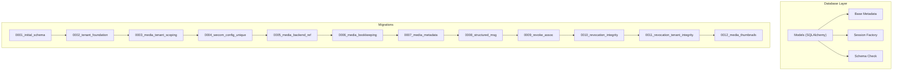
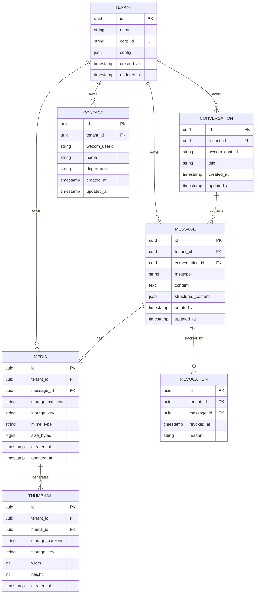
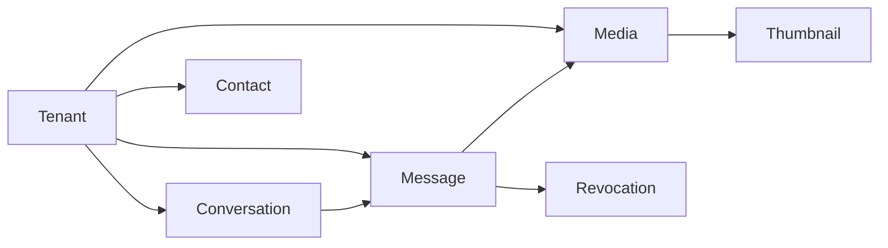

# Data Models

<cite>
**Referenced Files in This Document**
- [models.py](file://backend/app/db/models.py)
- [contacts.py](file://backend/app/db/contacts.py)
- [base.py](file://backend/app/db/base.py)
- [session.py](file://backend/app/db/session.py)
- [schema_check.py](file://backend/app/db/schema_check.py)
- [0001_initial_schema.py](file://backend/alembic/versions/0001_initial_schema.py)
- [0002_tenant_foundation.py](file://backend/alembic/versions/0002_tenant_foundation.py)
- [0003_media_tenant_scoping.py](file://backend/alembic/versions/0003_media_tenant_scoping.py)
- [0004_tenant_wecom_config_corp_id_uniqueness.py](file://backend/alembic/versions/0004_tenant_wecom_config_corp_id_uniqueness.py)
- [0005_media_storage_backend_reference.py](file://backend/alembic/versions/0005_media_storage_backend_reference.py)
- [0006_media_migration_bookkeeping.py](file://backend/alembic/versions/0006_media_migration_bookkeeping.py)
- [0007_media_migration_metadata.py](file://backend/alembic/versions/0007_media_migration_metadata.py)
- [0008_structured_message_content.py](file://backend/alembic/versions/0008_structured_message_content.py)
- [0009_revoke_association.py](file://backend/alembic/versions/0009_revoke_association.py)
- [0010_message_revocations_integrity.py](file://backend/alembic/versions/0010_message_revocations_integrity.py)
- [0011_message_revocations_tenant_integrity.py](file://backend/alembic/versions/0011_message_revocations_tenant_integrity.py)
- [0012_media_thumbnails.py](file://backend/alembic/versions/0012_media_thumbnails.py)
- [DATA_MODEL.md](file://docs/DATA_MODEL.md)
- [ARCHITECTURE.md](file://docs/ARCHITECTURE.md)
</cite>

## Table of Contents
1. [Introduction](#introduction)
2. [Project Structure](#project-structure)
3. [Core Components](#core-components)
4. [Architecture Overview](#architecture-overview)
5. [Detailed Component Analysis](#detailed-component-analysis)
6. [Dependency Analysis](#dependency-analysis)
7. [Performance Considerations](#performance-considerations)
8. [Troubleshooting Guide](#troubleshooting-guide)
9. [Conclusion](#conclusion)
10. [Appendices](#appendices)

## Introduction
This document provides comprehensive data model documentation for the WeCom Archive 365 database schema. It covers entity relationships among tenants, conversations, messages, contacts, and media assets; field definitions, types, constraints, and validation rules; multi-tenant isolation strategy; foreign key relationships; indexing strategies; migration history and schema evolution; data lifecycle policies including archival and retention; ER diagrams; and security considerations such as encryption at rest and access control.

## Project Structure
The data models are implemented using SQLAlchemy ORM with Alembic migrations. Core model definitions live under backend/app/db, while migration scripts reside under backend/alembic/versions. Supporting utilities include base metadata, session management, and schema validation helpers.

**Diagram sources**
- [models.py:1-200](file://backend/app/db/models.py#L1-L200)
- [base.py:1-100](file://backend/app/db/base.py#L1-L100)
- [session.py:1-100](file://backend/app/db/session.py#L1-L100)
- [schema_check.py:1-100](file://backend/app/db/schema_check.py#L1-L100)
- [0001_initial_schema.py:1-200](file://backend/alembic/versions/0001_initial_schema.py#L1-L200)
- [0002_tenant_foundation.py:1-200](file://backend/alembic/versions/0002_tenant_foundation.py#L1-L200)
- [0003_media_tenant_scoping.py:1-200](file://backend/alembic/versions/0003_media_tenant_scoping.py#L1-L200)
- [0004_tenant_wecom_config_corp_id_uniqueness.py:1-200](file://backend/alembic/versions/0004_tenant_wecom_config_corp_id_uniqueness.py#L1-L200)
- [0005_media_storage_backend_reference.py:1-200](file://backend/alembic/versions/0005_media_storage_backend_reference.py#L1-L200)
- [0006_media_migration_bookkeeping.py:1-200](file://backend/alembic/versions/0006_media_migration_bookkeeping.py#L1-L200)
- [0007_media_migration_metadata.py:1-200](file://backend/alembic/versions/0007_media_migration_metadata.py#L1-L200)
- [0008_structured_message_content.py:1-200](file://backend/alembic/versions/0008_structured_message_content.py#L1-L200)
- [0009_revoke_association.py:1-200](file://backend/alembic/versions/0009_revoke_association.py#L1-L200)
- [0010_message_revocations_integrity.py:1-200](file://backend/alembic/versions/0010_message_revocations_integrity.py#L1-L200)
- [0011_message_revocations_tenant_integrity.py:1-200](file://backend/alembic/versions/0011_message_revocations_tenant_integrity.py#L1-L200)
- [0012_media_thumbnails.py:1-200](file://backend/alembic/versions/0012_media_thumbnails.py#L1-L200)

**Section sources**
- [models.py:1-200](file://backend/app/db/models.py#L1-L200)
- [base.py:1-100](file://backend/app/db/base.py#L1-L100)
- [session.py:1-100](file://backend/app/db/session.py#L1-L100)
- [schema_check.py:1-100](file://backend/app/db/schema_check.py#L1-L100)
- [0001_initial_schema.py:1-200](file://backend/alembic/versions/0001_initial_schema.py#L1-L200)
- [0002_tenant_foundation.py:1-200](file://backend/alembic/versions/0002_tenant_foundation.py#L1-L200)
- [0003_media_tenant_scoping.py:1-200](file://backend/alembic/versions/0003_media_tenant_scoping.py#L1-L200)
- [0004_tenant_wecom_config_corp_id_uniqueness.py:1-200](file://backend/alembic/versions/0004_tenant_wecom_config_corp_id_uniqueness.py#L1-L200)
- [0005_media_storage_backend_reference.py:1-200](file://backend/alembic/versions/0005_media_storage_backend_reference.py#L1-L200)
- [0006_media_migration_bookkeeping.py:1-200](file://backend/alembic/versions/0006_media_migration_bookkeeping.py#L1-L200)
- [0007_media_migration_metadata.py:1-200](file://backend/alembic/versions/0007_media_migration_metadata.py#L1-L200)
- [0008_structured_message_content.py:1-200](file://backend/alembic/versions/0008_structured_message_content.py#L1-L200)
- [0009_revoke_association.py:1-200](file://backend/alembic/versions/0009_revoke_association.py#L1-L200)
- [0010_message_revocations_integrity.py:1-200](file://backend/alembic/versions/0010_message_revocations_integrity.py#L1-L200)
- [0011_message_revocations_tenant_integrity.py:1-200](file://backend/alembic/versions/0011_message_revocations_tenant_integrity.py#L1-L200)
- [0012_media_thumbnails.py:1-200](file://backend/alembic/versions/0012_media_thumbnails.py#L1-L200)

## Core Components
The data model centers around five primary entities: Tenant, Conversation, Message, Contact, and Media. Additional supporting tables include revocation tracking and thumbnail metadata. The models enforce multi-tenant scoping via tenant identifiers and maintain referential integrity through foreign keys.

Key responsibilities:
- Tenant: Represents an isolated organization context with configuration and identity.
- Conversation: Represents a chat or group conversation within a tenant.
- Message: Represents individual message items within a conversation, including structured content and type metadata.
- Contact: Represents users or participants associated with a tenant.
- Media: Represents binary assets linked to messages or conversations, with storage backend references and optional thumbnails.

Multi-tenant isolation is enforced by requiring tenant-scoped queries and constraints on core tables.

**Section sources**
- [models.py:1-200](file://backend/app/db/models.py#L1-L200)
- [contacts.py:1-200](file://backend/app/db/contacts.py#L1-L200)
- [0002_tenant_foundation.py:1-200](file://backend/alembic/versions/0002_tenant_foundation.py#L1-L200)
- [0003_media_tenant_scoping.py:1-200](file://backend/alembic/versions/0003_media_tenant_scoping.py#L1-L200)

## Architecture Overview
The data architecture follows a relational model with clear separation between core entities and auxiliary metadata. Multi-tenancy is embedded into table schemas and enforced via constraints and application-level checks. Media assets are abstracted behind a storage backend reference, enabling pluggable backends (e.g., local filesystem or object storage).

**Diagram sources**
- [models.py:1-200](file://backend/app/db/models.py#L1-L200)
- [contacts.py:1-200](file://backend/app/db/contacts.py#L1-L200)
- [0001_initial_schema.py:1-200](file://backend/alembic/versions/0001_initial_schema.py#L1-L200)
- [0002_tenant_foundation.py:1-200](file://backend/alembic/versions/0002_tenant_foundation.py#L1-L200)
- [0003_media_tenant_scoping.py:1-200](file://backend/alembic/versions/0003_media_tenant_scoping.py#L1-L200)
- [0005_media_storage_backend_reference.py:1-200](file://backend/alembic/versions/0005_media_storage_backend_reference.py#L1-L200)
- [0008_structured_message_content.py:1-200](file://backend/alembic/versions/0008_structured_message_content.py#L1-L200)
- [0009_revoke_association.py:1-200](file://backend/alembic/versions/0009_revoke_association.py#L1-L200)
- [0012_media_thumbnails.py:1-200](file://backend/alembic/versions/0012_media_thumbnails.py#L1-L200)

## Detailed Component Analysis

### Tenant Model
- Purpose: Represents an isolated organization context with unique corporate identifier and configuration.
- Key fields:
  - id: Primary key (UUID)
  - name: Organization display name
  - corp_id: Unique corporate identifier used for WeCom integration
  - config: JSON configuration for tenant-specific settings
  - timestamps: created_at, updated_at
- Constraints:
  - corp_id uniqueness enforced via migration
- Validation:
  - corp_id must be non-empty and unique per deployment

**Section sources**
- [0002_tenant_foundation.py:1-200](file://backend/alembic/versions/0002_tenant_foundation.py#L1-L200)
- [0004_tenant_wecom_config_corp_id_uniqueness.py:1-200](file://backend/alembic/versions/0004_tenant_wecom_config_corp_id_uniqueness.py#L1-L200)

### Conversation Model
- Purpose: Represents a chat or group conversation within a tenant.
- Key fields:
  - id: Primary key (UUID)
  - tenant_id: Foreign key to Tenant
  - wecom_chat_id: External WeCom chat identifier
  - title: Human-readable conversation title
  - timestamps: created_at, updated_at
- Relationships:
  - Belongs to one Tenant
  - Contains many Messages

**Section sources**
- [0001_initial_schema.py:1-200](file://backend/alembic/versions/0001_initial_schema.py#L1-L200)
- [models.py:1-200](file://backend/app/db/models.py#L1-L200)

### Message Model
- Purpose: Represents individual message items within a conversation.
- Key fields:
  - id: Primary key (UUID)
  - tenant_id: Foreign key to Tenant
  - conversation_id: Foreign key to Conversation
  - msgtype: Message type discriminator
  - content: Textual representation of message content
  - structured_content: JSON structure for rich message formats
  - timestamps: created_at, updated_at
- Relationships:
  - Belongs to one Tenant and one Conversation
  - Has many Media assets
  - Tracked by Revocation records

**Section sources**
- [0001_initial_schema.py:1-200](file://backend/alembic/versions/0001_initial_schema.py#L1-L200)
- [0008_structured_message_content.py:1-200](file://backend/alembic/versions/0008_structured_message_content.py#L1-L200)
- [models.py:1-200](file://backend/app/db/models.py#L1-L200)

### Contact Model
- Purpose: Represents users or participants associated with a tenant.
- Key fields:
  - id: Primary key (UUID)
  - tenant_id: Foreign key to Tenant
  - wecom_userid: External WeCom user identifier
  - name: Display name
  - department: Department affiliation
  - timestamps: created_at, updated_at
- Relationships:
  - Belongs to one Tenant

**Section sources**
- [contacts.py:1-200](file://backend/app/db/contacts.py#L1-L200)
- [0001_initial_schema.py:1-200](file://backend/alembic/versions/0001_initial_schema.py#L1-L200)

### Media Model
- Purpose: Represents binary assets linked to messages or conversations.
- Key fields:
  - id: Primary key (UUID)
  - tenant_id: Foreign key to Tenant
  - message_id: Foreign key to Message (nullable for standalone media)
  - storage_backend: Identifier for storage provider (e.g., local, qiniu)
  - storage_key: Provider-specific key for asset location
  - mime_type: MIME type of the media
  - size_bytes: Size in bytes
  - timestamps: created_at, updated_at
- Relationships:
  - Belongs to one Tenant
  - Optionally belongs to one Message
  - Generates Thumbnails

**Section sources**
- [0001_initial_schema.py:1-200](file://backend/alembic/versions/0001_initial_schema.py#L1-L200)
- [0005_media_storage_backend_reference.py:1-200](file://backend/alembic/versions/0005_media_storage_backend_reference.py#L1-L200)
- [models.py:1-200](file://backend/app/db/models.py#L1-L200)

### Thumbnail Model
- Purpose: Stores metadata for generated thumbnails of media assets.
- Key fields:
  - id: Primary key (UUID)
  - tenant_id: Foreign key to Tenant
  - media_id: Foreign key to Media
  - storage_backend: Storage backend identifier
  - storage_key: Thumbnail file key
  - width, height: Dimensions
  - created_at: Generation timestamp
- Relationships:
  - Belongs to one Tenant and one Media

**Section sources**
- [0012_media_thumbnails.py:1-200](file://backend/alembic/versions/0012_media_thumbnails.py#L1-L200)

### Revocation Model
- Purpose: Tracks message revocations for compliance and audit.
- Key fields:
  - id: Primary key (UUID)
  - tenant_id: Foreign key to Tenant
  - message_id: Foreign key to Message
  - revoked_at: Timestamp of revocation
  - reason: Optional reason for revocation
- Relationships:
  - Belongs to one Tenant and one Message

**Section sources**
- [0009_revoke_association.py:1-200](file://backend/alembic/versions/0009_revoke_association.py#L1-L200)
- [0010_message_revocations_integrity.py:1-200](file://backend/alembic/versions/0010_message_revocations_integrity.py#L1-L200)
- [0011_message_revocations_tenant_integrity.py:1-200](file://backend/alembic/versions/0011_message_revocations_tenant_integrity.py#L1-L200)

## Dependency Analysis
The data model exhibits clear hierarchical dependencies with strong multi-tenant scoping. Core entities depend on Tenant for isolation, while derived entities like Media and Thumbnails depend on Message and Media respectively.

**Diagram sources**
- [models.py:1-200](file://backend/app/db/models.py#L1-L200)
- [contacts.py:1-200](file://backend/app/db/contacts.py#L1-L200)
- [0001_initial_schema.py:1-200](file://backend/alembic/versions/0001_initial_schema.py#L1-L200)
- [0009_revoke_association.py:1-200](file://backend/alembic/versions/0009_revoke_association.py#L1-L200)
- [0012_media_thumbnails.py:1-200](file://backend/alembic/versions/0012_media_thumbnails.py#L1-L200)

**Section sources**
- [models.py:1-200](file://backend/app/db/models.py#L1-L200)
- [contacts.py:1-200](file://backend/app/db/contacts.py#L1-L200)

## Performance Considerations
- Indexing Strategy:
  - Foreign key columns (tenant_id, conversation_id, message_id, media_id) should be indexed for efficient joins and lookups.
  - Composite indexes on (tenant_id, conversation_id) for conversation-scoped message queries.
  - Indexes on msgtype for message filtering.
  - Indexes on storage_backend and storage_key for media retrieval.
- Query Optimization:
  - Use tenant-scoped queries to leverage partitioning or filtering.
  - Paginate large result sets for conversations and messages.
  - Cache frequently accessed contact information.
- Storage Backend Abstraction:
  - Media storage backend reference enables switching providers without schema changes.
  - Thumbnail generation should be asynchronous to avoid blocking message ingestion.

[No sources needed since this section provides general guidance]

## Troubleshooting Guide
Common issues and resolutions:
- Schema Migration Failures:
  - Verify Alembic head matches current models.
  - Check constraint violations during upgrades.
- Multi-Tenant Isolation Issues:
  - Ensure all queries include tenant_id filters.
  - Validate tenant context propagation in request handlers.
- Media Access Problems:
  - Verify storage backend configuration and credentials.
  - Check storage_key validity and accessibility.
- Revocation Integrity:
  - Run integrity checks to ensure revocation records match message ownership.

**Section sources**
- [schema_check.py:1-100](file://backend/app/db/schema_check.py#L1-L100)
- [0010_message_revocations_integrity.py:1-200](file://backend/alembic/versions/0010_message_revocations_integrity.py#L1-L200)
- [0011_message_revocations_tenant_integrity.py:1-200](file://backend/alembic/versions/0011_message_revocations_tenant_integrity.py#L1-L200)

## Conclusion
The WeCom Archive 365 data model provides a robust foundation for multi-tenant conversation archiving with comprehensive support for messages, contacts, and media assets. The schema evolution through Alembic migrations ensures backward compatibility and feature growth. Strong multi-tenant isolation, clear entity relationships, and flexible storage abstraction make the system scalable and maintainable.

[No sources needed since this section summarizes without analyzing specific files]

## Appendices

### Migration History and Schema Evolution
The schema has evolved through 12 major migrations:
- Initial schema with core entities
- Tenant foundation and configuration
- Media tenant scoping and storage backend abstraction
- Structured message content support
- Revocation tracking and integrity constraints
- Thumbnail generation and metadata

**Section sources**
- [0001_initial_schema.py:1-200](file://backend/alembic/versions/0001_initial_schema.py#L1-L200)
- [0002_tenant_foundation.py:1-200](file://backend/alembic/versions/0002_tenant_foundation.py#L1-L200)
- [0003_media_tenant_scoping.py:1-200](file://backend/alembic/versions/0003_media_tenant_scoping.py#L1-L200)
- [0004_tenant_wecom_config_corp_id_uniqueness.py:1-200](file://backend/alembic/versions/0004_tenant_wecom_config_corp_id_uniqueness.py#L1-L200)
- [0005_media_storage_backend_reference.py:1-200](file://backend/alembic/versions/0005_media_storage_backend_reference.py#L1-L200)
- [0006_media_migration_bookkeeping.py:1-200](file://backend/alembic/versions/0006_media_migration_bookkeeping.py#L1-L200)
- [0007_media_migration_metadata.py:1-200](file://backend/alembic/versions/0007_media_migration_metadata.py#L1-L200)
- [0008_structured_message_content.py:1-200](file://backend/alembic/versions/0008_structured_message_content.py#L1-L200)
- [0009_revoke_association.py:1-200](file://backend/alembic/versions/0009_revoke_association.py#L1-L200)
- [0010_message_revocations_integrity.py:1-200](file://backend/alembic/versions/0010_message_revocations_integrity.py#L1-L200)
- [0011_message_revocations_tenant_integrity.py:1-200](file://backend/alembic/versions/0011_message_revocations_tenant_integrity.py#L1-L200)
- [0012_media_thumbnails.py:1-200](file://backend/alembic/versions/0012_media_thumbnails.py#L1-L200)

### Data Lifecycle Policies
- Archival Strategy:
  - Messages are archived incrementally from WeCom API
  - Media assets are downloaded asynchronously
  - Thumbnails are generated on-demand or via background jobs
- Retention Rules:
  - Configurable retention periods per tenant
  - Automated cleanup of expired media and messages
  - Compliance-driven revocation handling

**Section sources**
- [DATA_MODEL.md:1-200](file://docs/DATA_MODEL.md#L1-L200)
- [ARCHITECTURE.md:1-200](file://docs/ARCHITECTURE.md#L1-L200)

### Security and Access Control
- Encryption at Rest:
  - Database-level encryption recommended
  - Media storage encryption via backend configuration
- Access Control:
  - Tenant-scoped query enforcement
  - Role-based access to administrative functions
  - Audit logging for sensitive operations

**Section sources**
- [ARCHITECTURE.md:1-200](file://docs/ARCHITECTURE.md#L1-L200)