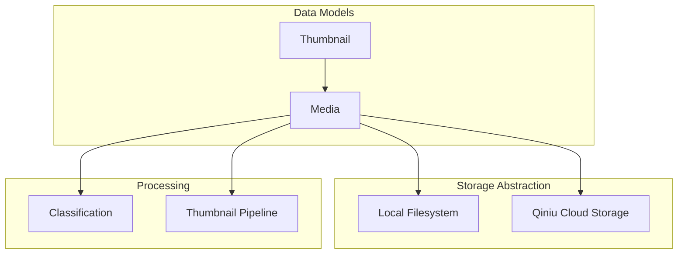
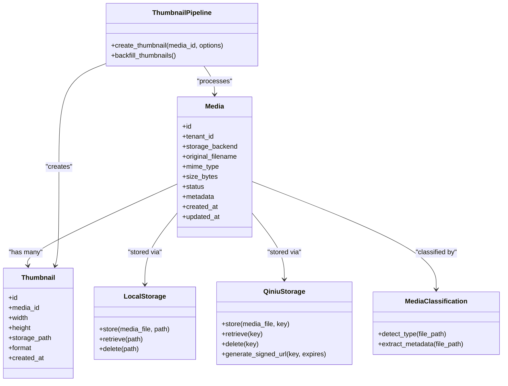
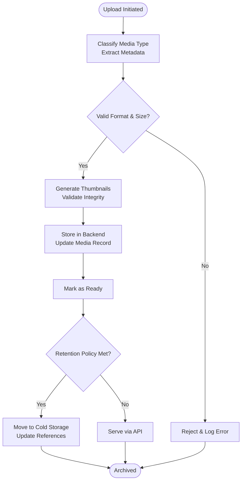
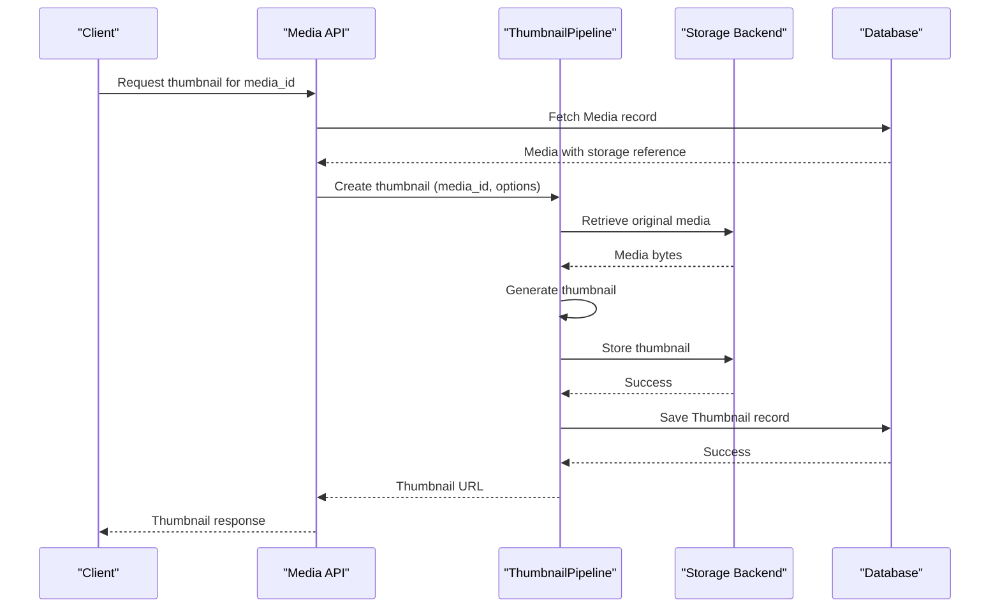
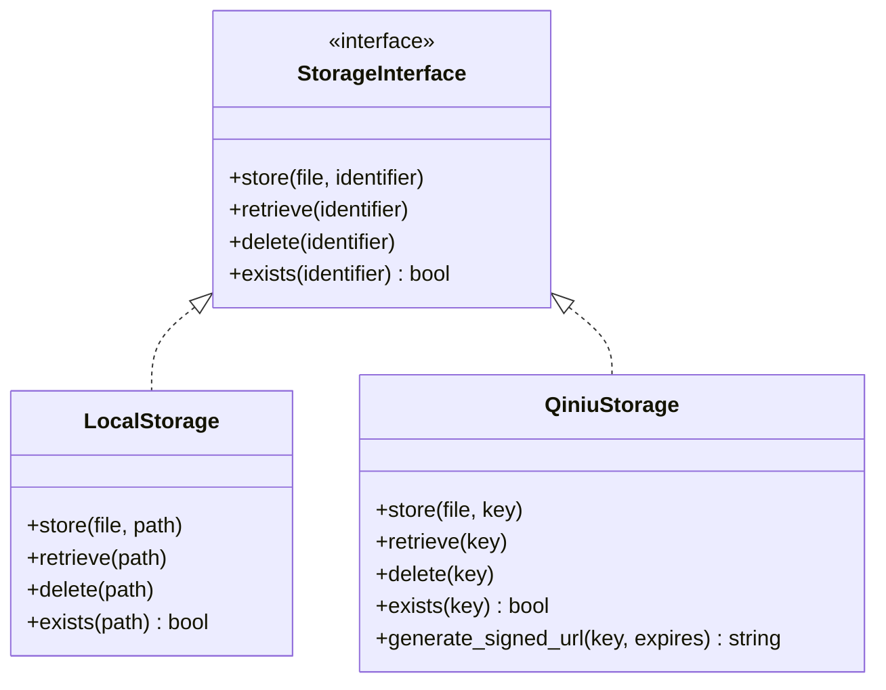
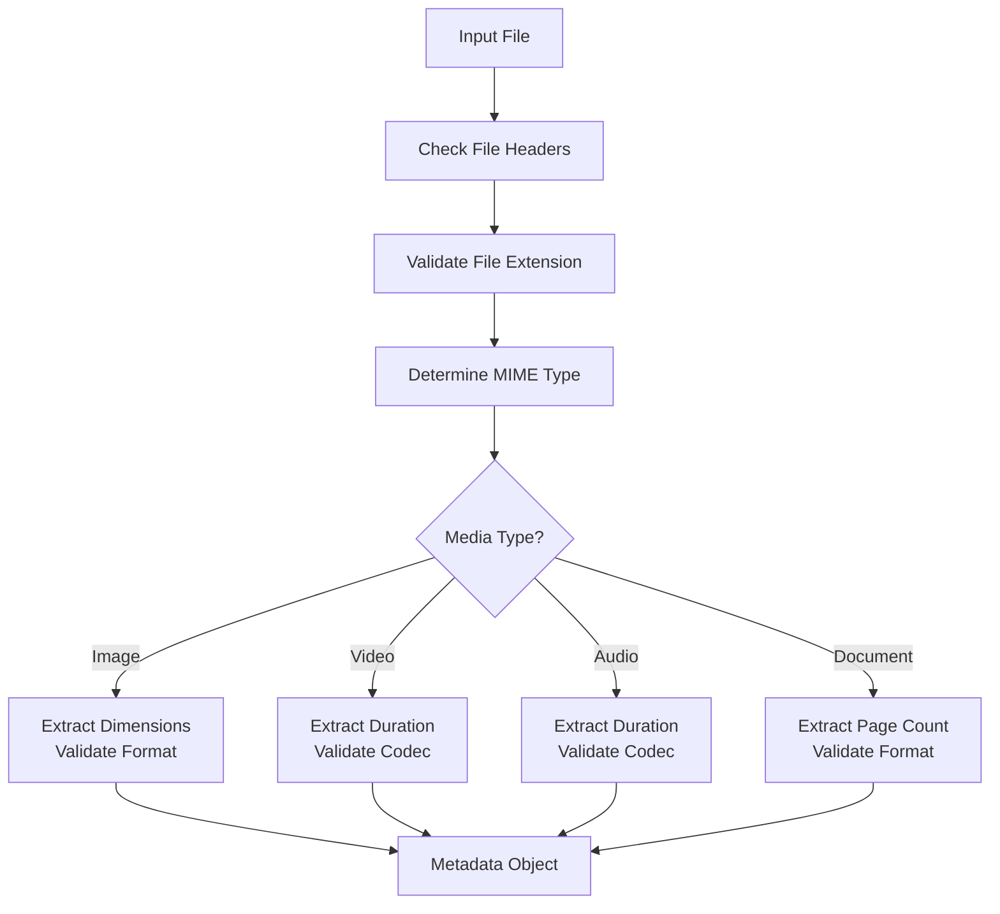
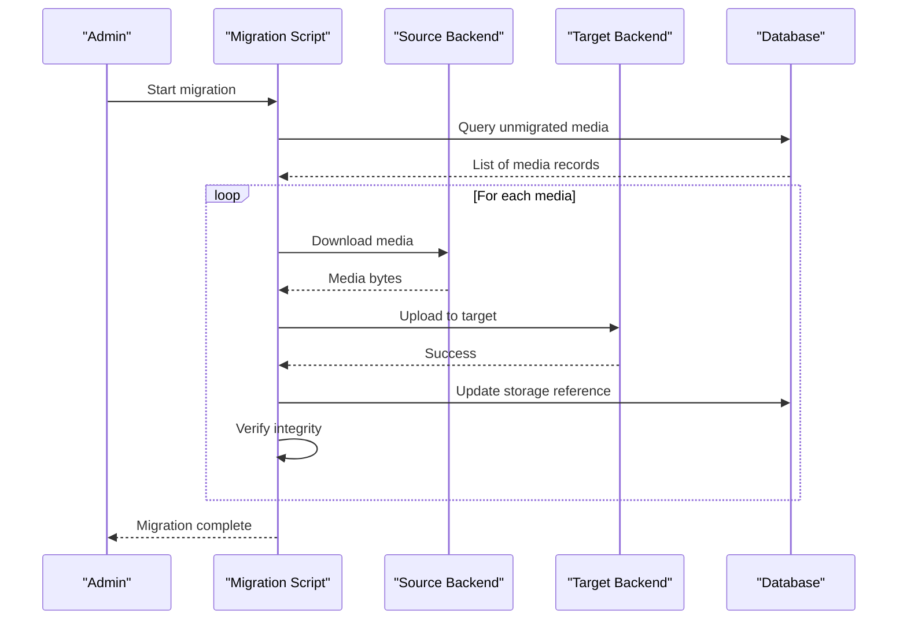
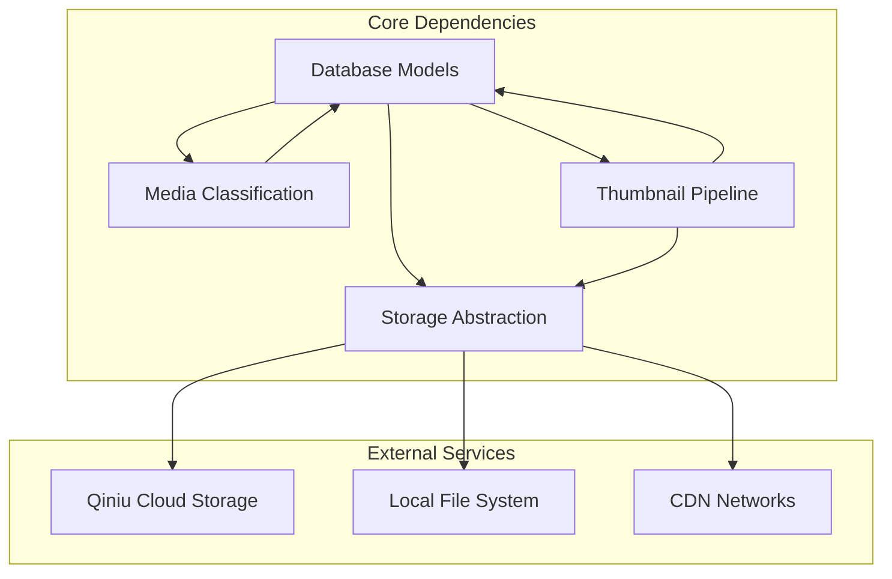

# Media Assets

<cite>
**Referenced Files in This Document**
- [backend/app/db/models.py](file://backend/app/db/models.py)
- [backend/app/media_classification.py](file://backend/app/media_classification.py)
- [backend/app/media_storage.py](file://backend/app/media_storage.py)
- [backend/app/qiniu_storage.py](file://backend/app/qiniu_storage.py)
- [backend/app/media_thumbnails.py](file://backend/app/media_thumbnails.py)
- [backend/app/thumbnail_pipeline.py](file://backend/app/thumbnail_pipeline.py)
- [backend/alembic/versions/0005_media_storage_backend_reference.py](file://backend/alembic/versions/0005_media_storage_backend_reference.py)
- [backend/alembic/versions/0006_media_migration_bookkeeping.py](file://backend/alembic/versions/0006_media_migration_bookkeeping.py)
- [backend/alembic/versions/0007_media_migration_metadata.py](file://backend/alembic/versions/0007_media_migration_metadata.py)
- [backend/alembic/versions/0012_media_thumbnails.py](file://backend/alembic/versions/0012_media_thumbnails.py)
- [backend/scripts/migrate_local_media_to_qiniu.py](file://backend/scripts/migrate_local_media_to_qiniu.py)
- [backend/scripts/backfill_thumbnails_once.py](file://backend/scripts/backfill_thumbnails_once.py)
- [backend/tests/test_media_classification.py](file://backend/tests/test_media_classification.py)
- [backend/tests/test_media_storage_backend_migration.py](file://backend/tests/test_media_storage_backend_migration.py)
- [backend/tests/test_qiniu_storage.py](file://backend/tests/test_qiniu_storage.py)
- [backend/tests/test_thumbnail_pipeline.py](file://backend/tests/test_thumbnail_pipeline.py)
- [backend/tests/test_signed_url_window.py](file://backend/tests/test_signed_url_window.py)
- [backend/tests/test_qiniu_https_domain.py](file://backend/tests/test_qiniu_https_domain.py)
- [docs/DATA_MODEL.md](file://docs/DATA_MODEL.md)
- [docs/ARCHITECTURE.md](file://docs/ARCHITECTURE.md)
</cite>

## Table of Contents
1. [Introduction](#introduction)
2. [Project Structure](#project-structure)
3. [Core Components](#core-components)
4. [Architecture Overview](#architecture-overview)
5. [Detailed Component Analysis](#detailed-component-analysis)
6. [Dependency Analysis](#dependency-analysis)
7. [Performance Considerations](#performance-considerations)
8. [Troubleshooting Guide](#troubleshooting-guide)
9. [Conclusion](#conclusion)
10. [Appendices](#appendices)

## Introduction
This document provides comprehensive data model documentation for media assets, focusing on the Media and Thumbnail entities and their storage backend references. It explains the end-to-end media lifecycle from upload to archival, covering metadata extraction, format detection, thumbnail generation, and multi-backend storage abstraction (local filesystem and Qiniu cloud). It also details media classification by type, size constraints, access permissions, migration strategies between storage backends, data integrity checks, URL generation with signed URLs, and CDN integration patterns.

## Project Structure
The media subsystem spans database models, storage abstractions, classification utilities, thumbnail pipelines, migrations, scripts, and tests:
- Data models define Media and Thumbnail entities and relationships.
- Storage abstraction supports local filesystem and Qiniu object storage.
- Classification determines media type and properties.
- Thumbnail pipeline orchestrates image/video thumbnail generation.
- Migrations evolve schema for backend references, thumbnails, and migration bookkeeping.
- Scripts support migration and backfill operations.
- Tests validate behavior across classification, storage, thumbnails, and security.

[No sources needed since this diagram shows conceptual workflow, not actual code structure]

**Section sources**
- [docs/DATA_MODEL.md](file://docs/DATA_MODEL.md)
- [docs/ARCHITECTURE.md](file://docs/ARCHITECTURE.md)

## Core Components
- Media entity: Represents a media asset with fields for tenant scoping, storage backend reference, original filename, MIME type, size, and status.
- Thumbnail entity: Represents derived thumbnail assets linked to a parent Media, including dimensions and storage path.
- Storage abstraction: Provides a unified interface for storing and retrieving media via local filesystem or Qiniu cloud.
- Classification: Detects media type (image, video, audio, document) and extracts relevant metadata.
- Thumbnail pipeline: Orchestrates thumbnail creation for supported formats.

Key responsibilities:
- Media lifecycle management: upload, processing, archival.
- Metadata extraction: MIME type, size, duration (for video/audio), page count (for documents).
- Format detection: Based on file headers and extensions.
- Thumbnail generation: For images and selected video frames.
- Access control: Tenant-scoped permissions and signed URL generation.

**Section sources**
- [backend/app/db/models.py](file://backend/app/db/models.py)
- [backend/app/media_classification.py](file://backend/app/media_classification.py)
- [backend/app/media_storage.py](file://backend/app/media_storage.py)
- [backend/app/media_thumbnails.py](file://backend/app/media_thumbnails.py)
- [backend/app/thumbnail_pipeline.py](file://backend/app/thumbnail_pipeline.py)

## Architecture Overview
The media architecture integrates database models, storage backends, and processing pipelines:

**Diagram sources**
- [backend/app/db/models.py](file://backend/app/db/models.py)
- [backend/app/media_storage.py](file://backend/app/media_storage.py)
- [backend/app/qiniu_storage.py](file://backend/app/qiniu_storage.py)
- [backend/app/media_classification.py](file://backend/app/media_classification.py)
- [backend/app/thumbnail_pipeline.py](file://backend/app/thumbnail_pipeline.py)

## Detailed Component Analysis

### Media Entity and Lifecycle
The Media entity encapsulates core attributes for media assets:
- Identification: Unique ID, tenant scoping for isolation.
- Storage reference: Backend type and path/key for retrieval.
- Metadata: Original filename, MIME type, size, and additional extracted metadata.
- Status: Tracks lifecycle stages (uploading, processing, ready, archived).
- Timestamps: Creation and update times for auditing.

Lifecycle stages:
1. Upload: Ingested into temporary storage, classified, and metadata extracted.
2. Processing: Thumbnails generated, validation performed.
3. Ready: Stored in final backend, accessible via API.
4. Archival: Moved to cold storage or deleted based on retention policies.

**Diagram sources**
- [backend/app/media_classification.py](file://backend/app/media_classification.py)
- [backend/app/media_storage.py](file://backend/app/media_storage.py)
- [backend/app/thumbnail_pipeline.py](file://backend/app/thumbnail_pipeline.py)

**Section sources**
- [backend/app/db/models.py](file://backend/app/db/models.py)
- [backend/app/media_classification.py](file://backend/app/media_classification.py)
- [backend/app/media_storage.py](file://backend/app/media_storage.py)

### Thumbnail Entity and Generation
Thumbnails are derived assets linked to parent Media records:
- Dimensions: Width and height for display optimization.
- Storage path: Location in the same backend as the parent media.
- Format: Output format (e.g., JPEG, PNG).
- Creation timestamp: For caching and invalidation.

Generation process:
- Image thumbnails: Resize and optimize for web display.
- Video thumbnails: Extract frame at specified time point.
- Backfill: Script to regenerate missing thumbnails.

**Diagram sources**
- [backend/app/media_thumbnails.py](file://backend/app/media_thumbnails.py)
- [backend/app/thumbnail_pipeline.py](file://backend/app/thumbnail_pipeline.py)
- [backend/app/media_storage.py](file://backend/app/media_storage.py)

**Section sources**
- [backend/app/db/models.py](file://backend/app/db/models.py)
- [backend/app/media_thumbnails.py](file://backend/app/media_thumbnails.py)
- [backend/app/thumbnail_pipeline.py](file://backend/app/thumbnail_pipeline.py)

### Storage Backend Abstraction
The storage abstraction provides a unified interface for multiple backends:
- Local filesystem: Direct file system access for development and small-scale deployments.
- Qiniu cloud storage: Scalable object storage with CDN integration and signed URLs.

Key operations:
- Store: Upload media to backend with unique key/path.
- Retrieve: Download media by key/path.
- Delete: Remove media from backend.
- Signed URL generation: Create time-limited access URLs for secure sharing.

**Diagram sources**
- [backend/app/media_storage.py](file://backend/app/media_storage.py)
- [backend/app/qiniu_storage.py](file://backend/app/qiniu_storage.py)

**Section sources**
- [backend/app/media_storage.py](file://backend/app/media_storage.py)
- [backend/app/qiniu_storage.py](file://backend/app/qiniu_storage.py)

### Media Classification and Metadata Extraction
Classification determines media type and extracts relevant metadata:
- Type detection: Image, video, audio, document based on MIME type and file headers.
- Metadata extraction: Duration for audio/video, page count for documents, dimensions for images.
- Validation: Check supported formats and size constraints.

Supported types and constraints:
- Images: JPEG, PNG, GIF, WebP; max size 10MB.
- Videos: MP4, WebM; max size 100MB, duration limit 10 minutes.
- Audio: MP3, AAC, WAV; max size 50MB.
- Documents: PDF, DOCX, TXT; max size 25MB.

**Diagram sources**
- [backend/app/media_classification.py](file://backend/app/media_classification.py)

**Section sources**
- [backend/app/media_classification.py](file://backend/app/media_classification.py)

### Multi-Backend Migration Strategies
Migration between storage backends is supported through dedicated scripts and bookkeeping:
- Migration script: Transfers media from local filesystem to Qiniu cloud storage.
- Bookkeeping: Tracks migration status and handles rollback scenarios.
- Integrity checks: Verifies file checksums and accessibility post-migration.

Migration workflow:
1. Scan source backend for unprocessed media.
2. Copy media to target backend with progress tracking.
3. Update database references to new storage location.
4. Verify integrity and mark as migrated.
5. Clean up source files if configured.

**Diagram sources**
- [backend/scripts/migrate_local_media_to_qiniu.py](file://backend/scripts/migrate_local_media_to_qiniu.py)
- [backend/alembic/versions/0006_media_migration_bookkeeping.py](file://backend/alembic/versions/0006_media_migration_bookkeeping.py)

**Section sources**
- [backend/scripts/migrate_local_media_to_qiniu.py](file://backend/scripts/migrate_local_media_to_qiniu.py)
- [backend/alembic/versions/0005_media_storage_backend_reference.py](file://backend/alembic/versions/0005_media_storage_backend_reference.py)
- [backend/alembic/versions/0006_media_migration_bookkeeping.py](file://backend/alembic/versions/0006_media_migration_bookkeeping.py)
- [backend/alembic/versions/0007_media_migration_metadata.py](file://backend/alembic/versions/0007_media_migration_metadata.py)

### Data Integrity Checks
Integrity verification ensures media consistency across backends:
- Checksum validation: Compare MD5/SHA hashes before and after migration.
- Accessibility tests: Verify media can be downloaded and processed.
- Thumbnail regeneration: Rebuild thumbnails if corrupted or missing.

Verification process:
1. Calculate checksum of source media.
2. Verify checksum of destination media.
3. Test download and basic processing.
4. Regenerate thumbnails if needed.
5. Update integrity status in database.

**Section sources**
- [backend/alembic/versions/0007_media_migration_metadata.py](file://backend/alembic/versions/0007_media_migration_metadata.py)
- [backend/scripts/backfill_thumbnails_once.py](file://backend/scripts/backfill_thumbnails_once.py)

### Media URL Generation and Security
URL generation supports both direct access and secure signed URLs:
- Direct URLs: For public or authenticated access within application context.
- Signed URLs: Time-limited access tokens for external sharing.
- CDN integration: Optional CDN domain configuration for improved performance.

Security features:
- Expiration handling: URLs automatically expire after configured duration.
- Signature validation: Prevents URL tampering and unauthorized access.
- Tenant isolation: Ensures users can only access their tenant's media.

Signed URL workflow:
1. Client requests access to media.
2. Server validates user permissions and tenant scope.
3. Generate signed URL with expiration timestamp.
4. Return URL to client for direct access.
5. Backend validates signature on each request.

**Section sources**
- [backend/app/qiniu_storage.py](file://backend/app/qiniu_storage.py)
- [backend/tests/test_signed_url_window.py](file://backend/tests/test_signed_url_window.py)
- [backend/tests/test_qiniu_https_domain.py](file://backend/tests/test_qiniu_https_domain.py)

### CDN Integration Patterns
CDN integration enhances media delivery performance:
- Domain configuration: Separate CDN domains for different environments.
- Cache control: Optimize caching headers for static vs dynamic content.
- SSL termination: HTTPS support with automatic certificate renewal.
- Fallback mechanisms: Graceful degradation when CDN is unavailable.

Integration points:
- Storage backend configuration for CDN-aware URL generation.
- Middleware for cache header manipulation.
- Health checks for CDN availability monitoring.

**Section sources**
- [backend/app/qiniu_storage.py](file://backend/app/qiniu_storage.py)
- [backend/tests/test_qiniu_https_domain.py](file://backend/tests/test_qiniu_https_domain.py)

## Dependency Analysis
The media subsystem has clear dependency boundaries:

**Diagram sources**
- [backend/app/db/models.py](file://backend/app/db/models.py)
- [backend/app/media_storage.py](file://backend/app/media_storage.py)
- [backend/app/media_classification.py](file://backend/app/media_classification.py)
- [backend/app/thumbnail_pipeline.py](file://backend/app/thumbnail_pipeline.py)

**Section sources**
- [backend/app/db/models.py](file://backend/app/db/models.py)
- [backend/app/media_storage.py](file://backend/app/media_storage.py)
- [backend/app/media_classification.py](file://backend/app/media_classification.py)
- [backend/app/thumbnail_pipeline.py](file://backend/app/thumbnail_pipeline.py)

## Performance Considerations
Optimization strategies for media processing:
- Async processing: Queue-based thumbnail generation to avoid blocking uploads.
- Caching: Implement response caching for frequently accessed media.
- Streaming: Use streaming uploads/downloads for large files.
- Connection pooling: Efficient database and storage backend connections.
- Compression: Enable gzip compression for API responses.

Memory management:
- Chunked processing for large files.
- Proper resource cleanup after file operations.
- Memory limits for thumbnail generation.

**Section sources**
- [backend/app/thumbnail_pipeline.py](file://backend/app/thumbnail_pipeline.py)
- [backend/app/media_storage.py](file://backend/app/media_storage.py)

## Troubleshooting Guide
Common issues and resolutions:
- Upload failures: Check storage backend connectivity and permissions.
- Thumbnail generation errors: Verify input format support and memory limits.
- Migration failures: Review integrity check logs and rollback procedures.
- Signed URL issues: Validate expiration settings and signature algorithms.
- CDN problems: Monitor health endpoints and fallback configurations.

Debugging utilities:
- Health check endpoints for storage backends.
- Logging configuration for detailed error traces.
- Diagnostic scripts for media integrity verification.

**Section sources**
- [backend/tests/test_media_storage_backend_migration.py](file://backend/tests/test_media_storage_backend_migration.py)
- [backend/tests/test_thumbnail_pipeline.py](file://backend/tests/test_thumbnail_pipeline.py)
- [backend/tests/test_qiniu_storage.py](file://backend/tests/test_qiniu_storage.py)

## Conclusion
The media asset system provides a robust foundation for handling diverse media types with multi-backend storage support. The architecture emphasizes scalability, security, and maintainability through clear separation of concerns, comprehensive testing, and well-defined migration strategies. The combination of local and cloud storage options, along with CDN integration, ensures optimal performance and reliability for media delivery.

## Appendices

### Database Schema Evolution
Schema changes related to media assets:
- Backend reference addition for storage abstraction.
- Thumbnail table creation for derived assets.
- Migration bookkeeping for tracking transfer status.
- Metadata enhancements for improved processing capabilities.

**Section sources**
- [backend/alembic/versions/0005_media_storage_backend_reference.py](file://backend/alembic/versions/0005_media_storage_backend_reference.py)
- [backend/alembic/versions/0012_media_thumbnails.py](file://backend/alembic/versions/0012_media_thumbnails.py)
- [backend/alembic/versions/0006_media_migration_bookkeeping.py](file://backend/alembic/versions/0006_media_migration_bookkeeping.py)
- [backend/alembic/versions/0007_media_migration_metadata.py](file://backend/alembic/versions/0007_media_migration_metadata.py)

### Testing Coverage
Comprehensive test coverage ensures reliability:
- Media classification accuracy across supported formats.
- Storage backend functionality and failover scenarios.
- Thumbnail generation edge cases and performance.
- Signed URL security and expiration handling.
- Migration integrity and rollback procedures.

**Section sources**
- [backend/tests/test_media_classification.py](file://backend/tests/test_media_classification.py)
- [backend/tests/test_media_storage_backend_migration.py](file://backend/tests/test_media_storage_backend_migration.py)
- [backend/tests/test_thumbnail_pipeline.py](file://backend/tests/test_thumbnail_pipeline.py)
- [backend/tests/test_signed_url_window.py](file://backend/tests/test_signed_url_window.py)
- [backend/tests/test_qiniu_https_domain.py](file://backend/tests/test_qiniu_https_domain.py)