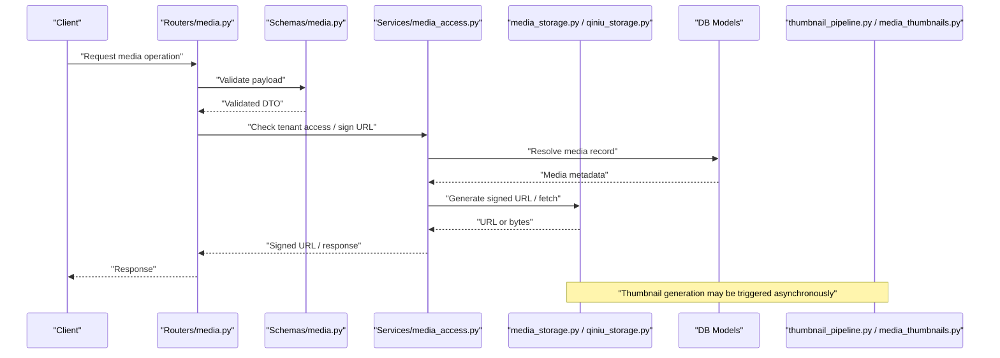
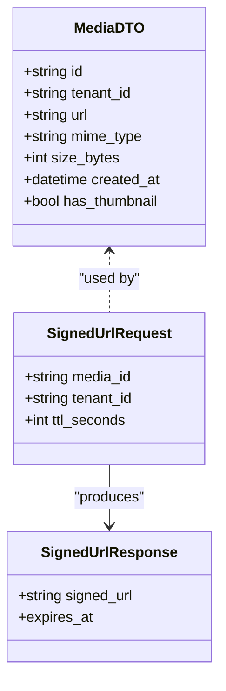
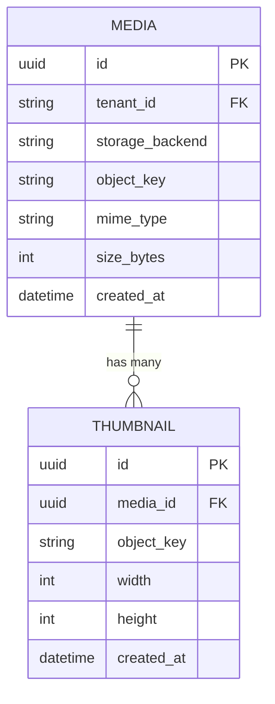
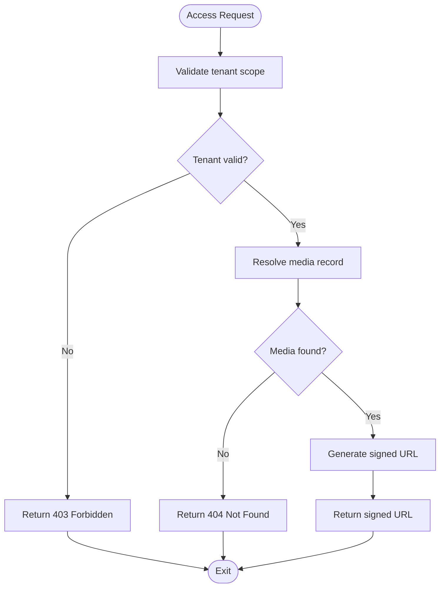
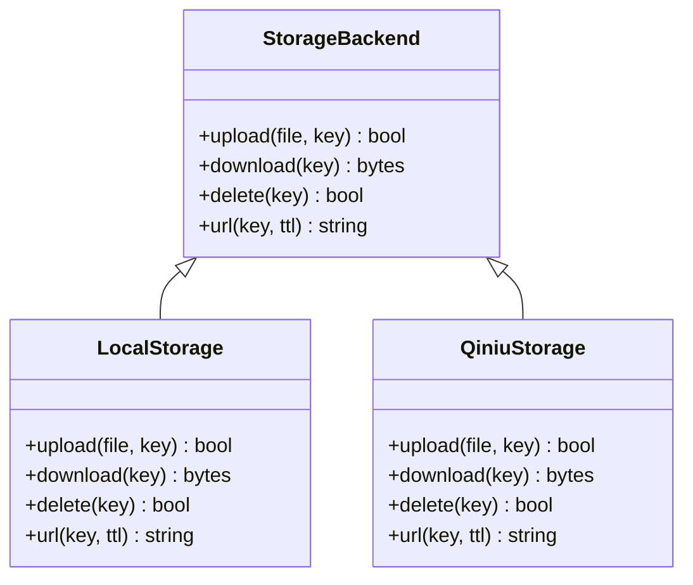
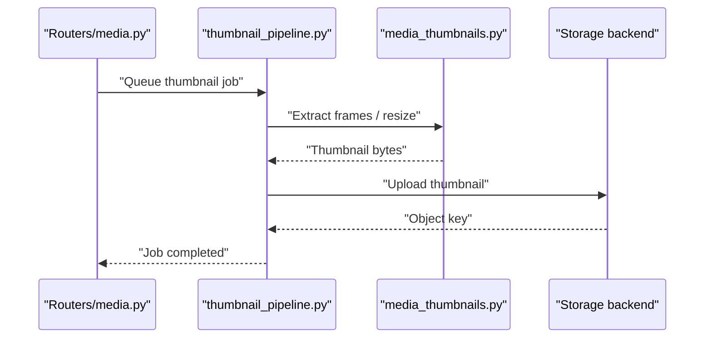
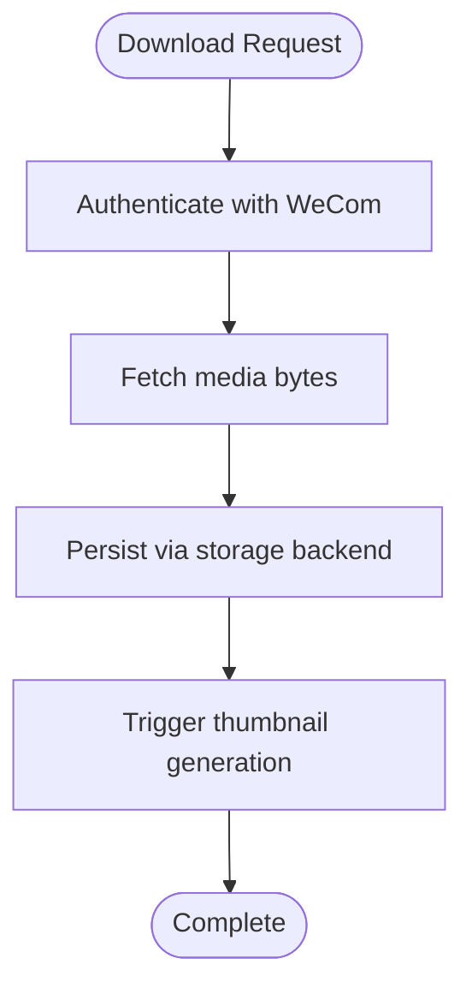
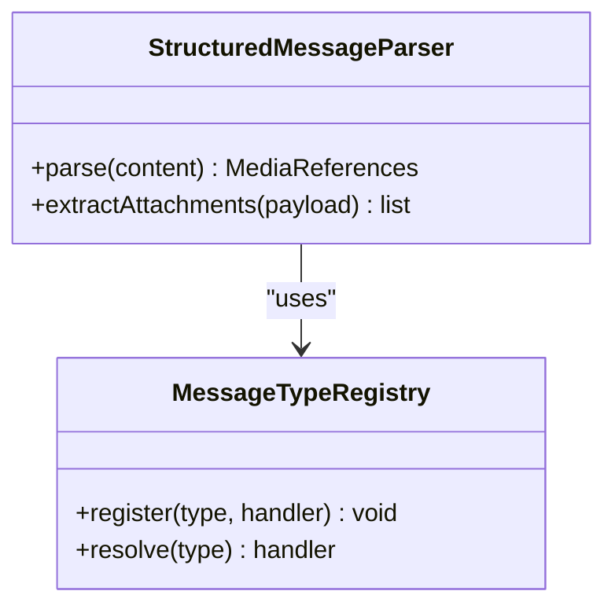
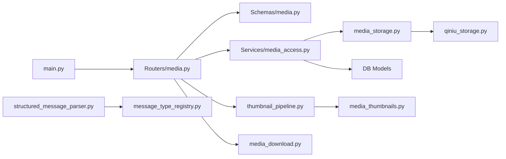

# Media Data Schemas

<cite>
**Referenced Files in This Document**
- [backend/app/schemas/media.py](file://backend/app/schemas/media.py)
- [backend/app/db/models.py](file://backend/app/db/models.py)
- [backend/alembic/versions/0012_media_thumbnails.py](file://backend/alembic/versions/0012_media_thumbnails.py)
- [backend/app/routers/media.py](file://backend/app/routers/media.py)
- [backend/app/services/media_access.py](file://backend/app/services/media_access.py)
- [backend/app/media_classification.py](file://backend/app/media_classification.py)
- [backend/app/media_storage.py](file://backend/app/media_storage.py)
- [backend/app/qiniu_storage.py](file://backend/app/qiniu_storage.py)
- [backend/app/thumbnail_pipeline.py](file://backend/app/thumbnail_pipeline.py)
- [backend/app/media_download.py](file://backend/app/media_download.py)
- [backend/app/media_thumbnails.py](file://backend/app/media_thumbnails.py)
- [backend/app/structured_message_parser.py](file://backend/app/structured_message_parser.py)
- [backend/app/message_type_registry.py](file://backend/app/message_type_registry.py)
- [backend/app/main.py](file://backend/app/main.py)
</cite>

## Table of Contents
1. [Introduction](#introduction)
2. [Project Structure](#project-structure)
3. [Core Components](#core-components)
4. [Architecture Overview](#architecture-overview)
5. [Detailed Component Analysis](#detailed-component-analysis)
6. [Dependency Analysis](#dependency-analysis)
7. [Performance Considerations](#performance-considerations)
8. [Troubleshooting Guide](#troubleshooting-guide)
9. [Conclusion](#conclusion)

## Introduction
This document explains the media data schemas and their integration across the application. It focuses on how media entities are modeled, validated, stored, served, and transformed (including thumbnails), and how they relate to messages and tenants. The goal is to provide a clear mental model for developers working with media ingestion, storage backends, access control, and thumbnail generation.

## Project Structure
Media-related code spans several layers:
- Schemas define request/response contracts and validation rules.
- Database models represent persistent entities and relationships.
- Routers expose HTTP endpoints that consume schemas and orchestrate services.
- Services implement business logic such as access control and URL signing.
- Storage modules abstract different backends (local filesystem and Qiniu).
- Thumbnail pipeline handles asynchronous thumbnail creation and caching.
- Download utilities manage fetching remote media from WeCom.
- Structured message parsing extracts embedded media references from rich content.

```mermaid
graph TB
subgraph "API Layer"
Router["Routers/media.py"]
Schema["Schemas/media.py"]
end
subgraph "Domain & Persistence"
Models["DB Models"]
Migration["Alembic 0012_media_thumbnails.py"]
end
subgraph "Services"
Access["Services/media_access.py"]
Classification["media_classification.py"]
end
subgraph "Storage"
Storage["media_storage.py"]
Qiniu["qiniu_storage.py"]
end
subgraph "Processing"
Thumbnails["thumbnail_pipeline.py"]
MediaThumbs["media_thumbnails.py"]
Download["media_download.py"]
end
Parser["structured_message_parser.py"]
MsgTypes["message_type_registry.py"]
AppMain["main.py"]
Router --> Schema
Router --> Access
Router --> Storage
Router --> Thumbnails
Router --> Download
Access --> Storage
Access --> Models
Storage --> Qiniu
Thumbnails --> MediaThumbs
Parser --> MsgTypes
AppMain --> Router
```

**Diagram sources**
- [backend/app/routers/media.py](file://backend/app/routers/media.py)
- [backend/app/schemas/media.py](file://backend/app/schemas/media.py)
- [backend/app/db/models.py](file://backend/app/db/models.py)
- [backend/alembic/versions/0012_media_thumbnails.py](file://backend/alembic/versions/0012_media_thumbnails.py)
- [backend/app/services/media_access.py](file://backend/app/services/media_access.py)
- [backend/app/media_storage.py](file://backend/app/media_storage.py)
- [backend/app/qiniu_storage.py](file://backend/app/qiniu_storage.py)
- [backend/app/thumbnail_pipeline.py](file://backend/app/thumbnail_pipeline.py)
- [backend/app/media_thumbnails.py](file://backend/app/media_thumbnails.py)
- [backend/app/media_download.py](file://backend/app/media_download.py)
- [backend/app/structured_message_parser.py](file://backend/app/structured_message_parser.py)
- [backend/app/message_type_registry.py](file://backend/app/message_type_registry.py)
- [backend/app/main.py](file://backend/app/main.py)

**Section sources**
- [backend/app/routers/media.py](file://backend/app/routers/media.py)
- [backend/app/schemas/media.py](file://backend/app/schemas/media.py)
- [backend/app/db/models.py](file://backend/app/db/models.py)
- [backend/alembic/versions/0012_media_thumbnails.py](file://backend/alembic/versions/0012_media_thumbnails.py)
- [backend/app/services/media_access.py](file://backend/app/services/media_access.py)
- [backend/app/media_storage.py](file://backend/app/media_storage.py)
- [backend/app/qiniu_storage.py](file://backend/app/qiniu_storage.py)
- [backend/app/thumbnail_pipeline.py](file://backend/app/thumbnail_pipeline.py)
- [backend/app/media_thumbnails.py](file://backend/app/media_thumbnails.py)
- [backend/app/media_download.py](file://backend/app/media_download.py)
- [backend/app/structured_message_parser.py](file://backend/app/structured_message_parser.py)
- [backend/app/message_type_registry.py](file://backend/app/message_type_registry.py)
- [backend/app/main.py](file://backend/app/main.py)

## Core Components
- Media schema definitions: Request/response models for media operations, including descriptors, signatures, and metadata fields used by APIs.
- Database models: Persistent representation of media records, tenant scoping, storage backend references, and thumbnail associations.
- Media access service: Enforces tenant isolation, signature verification, and signed URL generation for secure media retrieval.
- Storage abstraction: Pluggable backends (local and Qiniu) with consistent interfaces for upload, download, and URL resolution.
- Thumbnail pipeline: Asynchronous processing to generate thumbnails, store them alongside originals, and serve optimized previews.
- Message integration: Parsing structured message content to extract embedded media and map message types to media handling strategies.

**Section sources**
- [backend/app/schemas/media.py](file://backend/app/schemas/media.py)
- [backend/app/db/models.py](file://backend/app/db/models.py)
- [backend/app/services/media_access.py](file://backend/app/services/media_access.py)
- [backend/app/media_storage.py](file://backend/app/media_storage.py)
- [backend/app/qiniu_storage.py](file://backend/app/qiniu_storage.py)
- [backend/app/thumbnail_pipeline.py](file://backend/app/thumbnail_pipeline.py)
- [backend/app/media_thumbnails.py](file://backend/app/media_thumbnails.py)
- [backend/app/media_download.py](file://backend/app/media_download.py)
- [backend/app/structured_message_parser.py](file://backend/app/structured_message_parser.py)
- [backend/app/message_type_registry.py](file://backend/app/message_type_registry.py)

## Architecture Overview
The media subsystem follows a layered architecture:
- API layer validates inputs via Pydantic schemas and delegates to services.
- Services enforce business rules (tenant scoping, access control) and coordinate storage and processing.
- Storage layer abstracts backend specifics behind a common interface.
- Thumbnail pipeline runs asynchronously to produce previews without blocking requests.
- Message parsing integrates media into conversation context, mapping message types to handlers.



**Diagram sources**
- [backend/app/routers/media.py](file://backend/app/routers/media.py)
- [backend/app/schemas/media.py](file://backend/app/schemas/media.py)
- [backend/app/services/media_access.py](file://backend/app/services/media_access.py)
- [backend/app/media_storage.py](file://backend/app/media_storage.py)
- [backend/app/qiniu_storage.py](file://backend/app/qiniu_storage.py)
- [backend/app/db/models.py](file://backend/app/db/models.py)
- [backend/app/thumbnail_pipeline.py](file://backend/app/thumbnail_pipeline.py)
- [backend/app/media_thumbnails.py](file://backend/app/media_thumbnails.py)

## Detailed Component Analysis

### Media Schemas and DTOs
- Purpose: Define strict contracts for media-related requests and responses, ensuring type safety and consistent validation across the API surface.
- Typical responsibilities:
  - Validate identifiers, URLs, and metadata fields.
  - Represent signed URL payloads and descriptor structures.
  - Support pagination and listing formats for media collections.
- Integration points:
  - Consumed by routers to parse incoming requests.
  - Used by services to construct responses and error payloads.



**Diagram sources**
- [backend/app/schemas/media.py](file://backend/app/schemas/media.py)

**Section sources**
- [backend/app/schemas/media.py](file://backend/app/schemas/media.py)

### Database Models and Migrations
- Purpose: Persist media records with tenant scoping, storage backend references, and thumbnail associations.
- Key aspects:
  - Tenant isolation enforced at the model level.
  - References to storage backend configuration for flexible deployment.
  - Thumbnail records linked to original media for preview serving.
- Migration highlights:
  - Introduces thumbnail tables and relationships.
  - Ensures integrity constraints between media and thumbnails.



**Diagram sources**
- [backend/app/db/models.py](file://backend/app/db/models.py)
- [backend/alembic/versions/0012_media_thumbnails.py](file://backend/alembic/versions/0012_media_thumbnails.py)

**Section sources**
- [backend/app/db/models.py](file://backend/app/db/models.py)
- [backend/alembic/versions/0012_media_thumbnails.py](file://backend/alembic/versions/0012_media_thumbnails.py)

### Media Access Service
- Purpose: Provide secure, tenant-scoped access to media resources.
- Responsibilities:
  - Verify tenant ownership and permissions.
  - Generate short-lived signed URLs for safe distribution.
  - Resolve storage backend-specific URL strategies.
- Error handling:
  - Returns explicit errors for unauthorized access or missing resources.
  - Validates TTL and signature parameters.



**Diagram sources**
- [backend/app/services/media_access.py](file://backend/app/services/media_access.py)
- [backend/app/media_storage.py](file://backend/app/media_storage.py)
- [backend/app/qiniu_storage.py](file://backend/app/qiniu_storage.py)

**Section sources**
- [backend/app/services/media_access.py](file://backend/app/services/media_access.py)
- [backend/app/media_storage.py](file://backend/app/media_storage.py)
- [backend/app/qiniu_storage.py](file://backend/app/qiniu_storage.py)

### Storage Abstraction and Backends
- Purpose: Abstract storage operations behind a unified interface supporting multiple backends.
- Backends:
  - Local filesystem for development and small deployments.
  - Qiniu Kodo for scalable cloud storage with CDN support.
- Operations:
  - Upload, download, delete, and URL generation.
  - Backend-specific optimizations (e.g., presigned URLs, CDN domains).



**Diagram sources**
- [backend/app/media_storage.py](file://backend/app/media_storage.py)
- [backend/app/qiniu_storage.py](file://backend/app/qiniu_storage.py)

**Section sources**
- [backend/app/media_storage.py](file://backend/app/media_storage.py)
- [backend/app/qiniu_storage.py](file://backend/app/qiniu_storage.py)

### Thumbnail Pipeline
- Purpose: Generate thumbnails for images and videos to improve loading performance and user experience.
- Workflow:
  - Triggered after successful media upload or when requested explicitly.
  - Processes files asynchronously to avoid blocking API responses.
  - Stores thumbnails alongside originals and links them via foreign keys.
- Caching strategy:
  - Reuses existing thumbnails if available.
  - Supports configurable sizes and formats.



**Diagram sources**
- [backend/app/thumbnail_pipeline.py](file://backend/app/thumbnail_pipeline.py)
- [backend/app/media_thumbnails.py](file://backend/app/media_thumbnails.py)
- [backend/app/media_storage.py](file://backend/app/media_storage.py)

**Section sources**
- [backend/app/thumbnail_pipeline.py](file://backend/app/thumbnail_pipeline.py)
- [backend/app/media_thumbnails.py](file://backend/app/media_thumbnails.py)
- [backend/app/media_storage.py](file://backend/app/media_storage.py)

### Media Download and Ingestion
- Purpose: Fetch media from WeCom and persist it using configured storage backends.
- Features:
  - Handles authentication and rate limits.
  - Supports retry and error recovery.
  - Integrates with tenant scoping for multi-tenancy.



**Diagram sources**
- [backend/app/media_download.py](file://backend/app/media_download.py)
- [backend/app/media_storage.py](file://backend/app/media_storage.py)
- [backend/app/thumbnail_pipeline.py](file://backend/app/thumbnail_pipeline.py)

**Section sources**
- [backend/app/media_download.py](file://backend/app/media_download.py)
- [backend/app/media_storage.py](file://backend/app/media_storage.py)
- [backend/app/thumbnail_pipeline.py](file://backend/app/thumbnail_pipeline.py)

### Structured Message Parsing and Media Extraction
- Purpose: Extract embedded media references from rich message content and map message types to appropriate handlers.
- Capabilities:
  - Parses structured payloads to identify image, video, and file attachments.
  - Normalizes media metadata for consistent downstream processing.
  - Integrates with message type registry to route processing logic.



**Diagram sources**
- [backend/app/structured_message_parser.py](file://backend/app/structured_message_parser.py)
- [backend/app/message_type_registry.py](file://backend/app/message_type_registry.py)

**Section sources**
- [backend/app/structured_message_parser.py](file://backend/app/structured_message_parser.py)
- [backend/app/message_type_registry.py](file://backend/app/message_type_registry.py)

## Dependency Analysis
The media subsystem exhibits clear separation of concerns:
- Routers depend on schemas for validation and services for business logic.
- Services depend on storage abstractions and database models.
- Thumbnail pipeline depends on storage and file processing utilities.
- Message parsing depends on type registry for routing.



**Diagram sources**
- [backend/app/routers/media.py](file://backend/app/routers/media.py)
- [backend/app/schemas/media.py](file://backend/app/schemas/media.py)
- [backend/app/services/media_access.py](file://backend/app/services/media_access.py)
- [backend/app/media_storage.py](file://backend/app/media_storage.py)
- [backend/app/qiniu_storage.py](file://backend/app/qiniu_storage.py)
- [backend/app/db/models.py](file://backend/app/db/models.py)
- [backend/app/thumbnail_pipeline.py](file://backend/app/thumbnail_pipeline.py)
- [backend/app/media_thumbnails.py](file://backend/app/media_thumbnails.py)
- [backend/app/media_download.py](file://backend/app/media_download.py)
- [backend/app/structured_message_parser.py](file://backend/app/structured_message_parser.py)
- [backend/app/message_type_registry.py](file://backend/app/message_type_registry.py)
- [backend/app/main.py](file://backend/app/main.py)

**Section sources**
- [backend/app/routers/media.py](file://backend/app/routers/media.py)
- [backend/app/schemas/media.py](file://backend/app/schemas/media.py)
- [backend/app/services/media_access.py](file://backend/app/services/media_access.py)
- [backend/app/media_storage.py](file://backend/app/media_storage.py)
- [backend/app/qiniu_storage.py](file://backend/app/qiniu_storage.py)
- [backend/app/db/models.py](file://backend/app/db/models.py)
- [backend/app/thumbnail_pipeline.py](file://backend/app/thumbnail_pipeline.py)
- [backend/app/media_thumbnails.py](file://backend/app/media_thumbnails.py)
- [backend/app/media_download.py](file://backend/app/media_download.py)
- [backend/app/structured_message_parser.py](file://backend/app/structured_message_parser.py)
- [backend/app/message_type_registry.py](file://backend/app/message_type_registry.py)
- [backend/app/main.py](file://backend/app/main.py)

## Performance Considerations
- Use signed URLs to minimize server load and enable direct client-to-storage transfers.
- Implement thumbnail caching to reduce repeated processing.
- Configure appropriate TTL values for signed URLs to balance security and usability.
- Optimize storage backend selection based on scale and cost requirements.
- Monitor thumbnail queue depth and adjust concurrency settings accordingly.

[No sources needed since this section provides general guidance]

## Troubleshooting Guide
Common issues and resolutions:
- Unauthorized access errors: Verify tenant scoping and permission checks in the access service.
- Missing thumbnails: Check thumbnail pipeline logs and ensure jobs are queued and processed.
- Storage backend failures: Validate credentials and network connectivity; review backend-specific error messages.
- Slow downloads: Inspect WeCom API rate limits and implement exponential backoff retries.

**Section sources**
- [backend/app/services/media_access.py](file://backend/app/services/media_access.py)
- [backend/app/thumbnail_pipeline.py](file://backend/app/thumbnail_pipeline.py)
- [backend/app/media_download.py](file://backend/app/media_download.py)

## Conclusion
The media data schemas and associated components form a robust, extensible system for managing media assets across tenants. By separating concerns between validation, access control, storage abstraction, and processing pipelines, the architecture supports scalability, security, and maintainability. Developers can extend functionality by adding new storage backends, enhancing thumbnail processing, or integrating additional message types while preserving consistency and reliability.

[No sources needed since this section summarizes without analyzing specific files]