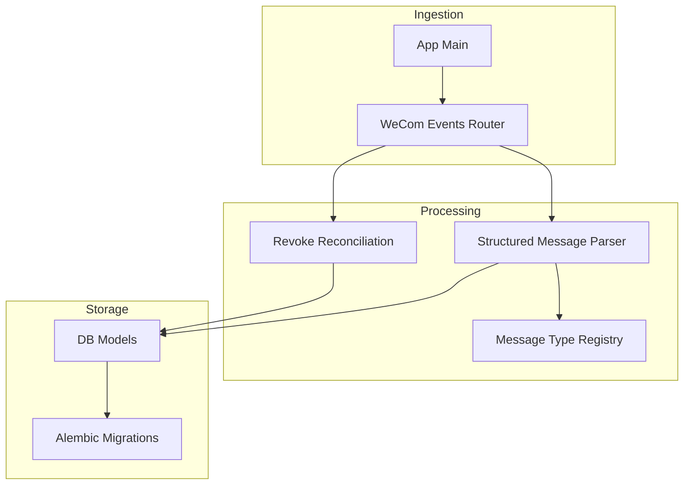
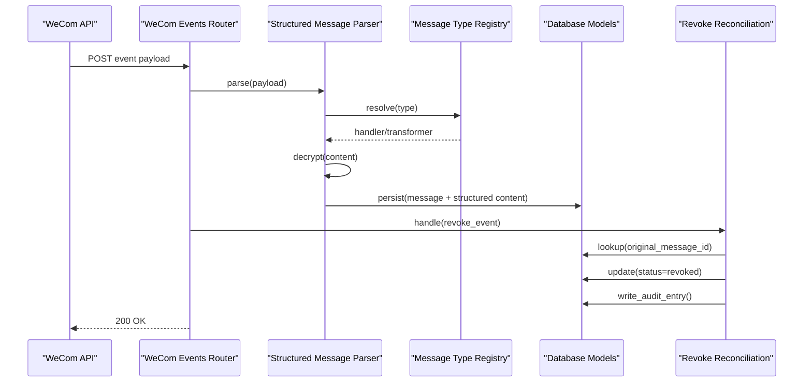
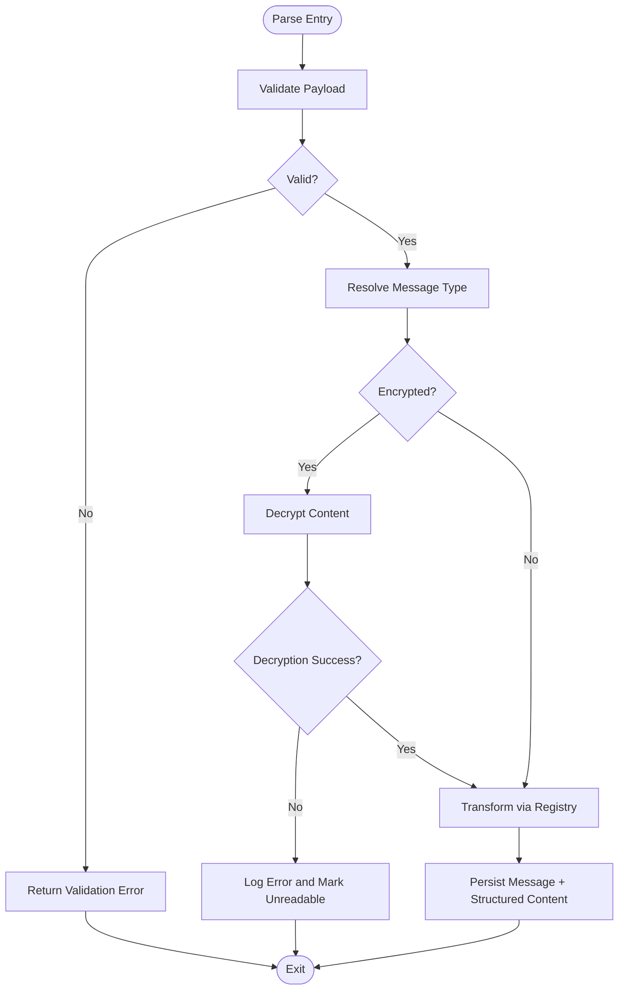
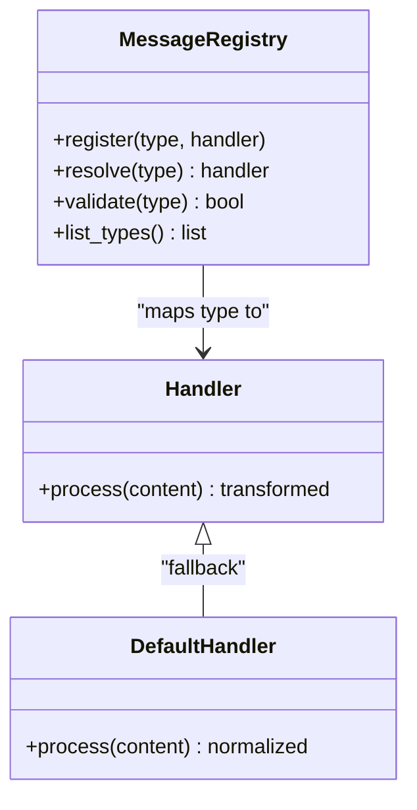
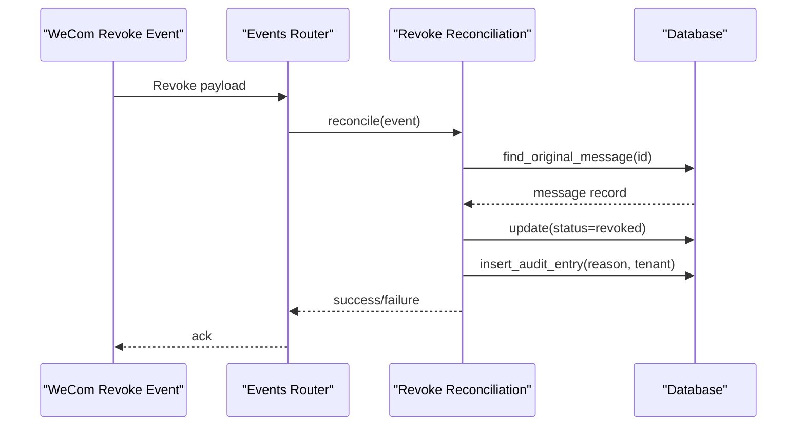
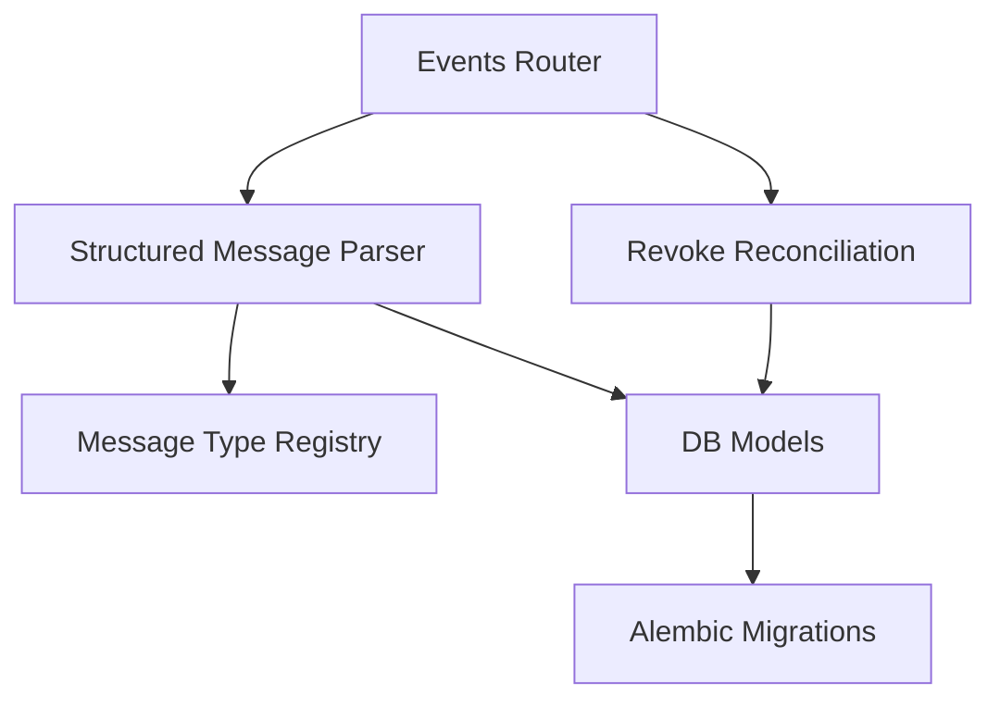

# Message Processing

<cite>
**Referenced Files in This Document**
- [structured_message_parser.py](file://backend/app/structured_message_parser.py)
- [message_type_registry.py](file://backend/app/message_type_registry.py)
- [revoke_reconciliation.py](file://backend/app/revoke_reconciliation.py)
- [models.py](file://backend/app/db/models.py)
- [0008_structured_message_content.py](file://backend/alembic/versions/0008_structured_message_content.py)
- [0009_revoke_association.py](file://backend/alembic/versions/0009_revoke_association.py)
- [0010_message_revocations_integrity.py](file://backend/alembic/versions/0010_message_revocations_integrity.py)
- [0011_message_revocations_tenant_integrity.py](file://backend/alembic/versions/0011_message_revocations_tenant_integrity.py)
- [wecom_events.py](file://backend/app/routers/wecom_events.py)
- [main.py](file://backend/app/main.py)
- [test_structured_message_parser.py](file://backend/tests/test_structured_message_parser.py)
- [test_message_type_registry.py](file://backend/tests/test_message_type_registry.py)
- [test_message_type_registry_core.py](file://backend/tests/test_message_type_registry_core.py)
- [test_revoke_reconciliation.py](file://backend/tests/test_revoke_reconciliation.py)
- [test_backfill_revoke_associations.py](file://backend/tests/test_backfill_revoke_associations.py)
- [decrypt_wecom_messages_once.py](file://backend/scripts/decrypt_wecom_messages_once.py)
</cite>

## Table of Contents
1. [Introduction](#introduction)
2. [Project Structure](#project-structure)
3. [Core Components](#core-components)
4. [Architecture Overview](#architecture-overview)
5. [Detailed Component Analysis](#detailed-component-analysis)
6. [Dependency Analysis](#dependency-analysis)
7. [Performance Considerations](#performance-considerations)
8. [Troubleshooting Guide](#troubleshooting-guide)
9. [Conclusion](#conclusion)
10. [Appendices](#appendices)

## Introduction
This document explains the message processing subsystem focused on structured message content, a type registry for message types, and revocation tracking. It covers the parsing pipeline, encryption/decryption of message content, type-specific data structures, revocation mechanisms, association tracking, audit trails, lifecycle states, processing queues, error handling, custom type registration, content transformation, retention policies, and cleanup strategies. The goal is to make the system understandable for both technical and non-technical readers while providing precise references to source files.

## Project Structure
The message processing features are primarily implemented under backend/app with supporting Alembic migrations under backend/alembic/versions and tests under backend/tests. Key modules include:
- Structured message parser for transforming raw payloads into typed models
- Message type registry for discovering and validating message handlers
- Revocation reconciliation for reconciling WeCom revoke events with stored messages
- Database models and migrations defining schema for structured content and revocations
- HTTP router for ingesting WeCom events and triggering processing
- Scripts for one-off decryption and backfills

**Diagram sources**
- [wecom_events.py](file://backend/app/routers/wecom_events.py)
- [main.py](file://backend/app/main.py)
- [structured_message_parser.py](file://backend/app/structured_message_parser.py)
- [message_type_registry.py](file://backend/app/message_type_registry.py)
- [revoke_reconciliation.py](file://backend/app/revoke_reconciliation.py)
- [models.py](file://backend/app/db/models.py)
- [0008_structured_message_content.py](file://backend/alembic/versions/0008_structured_message_content.py)
- [0009_revoke_association.py](file://backend/alembic/versions/0009_revoke_association.py)
- [0010_message_revocations_integrity.py](file://backend/alembic/versions/0010_message_revocations_integrity.py)
- [0011_message_revocations_tenant_integrity.py](file://backend/alembic/versions/0011_message_revocations_tenant_integrity.py)

**Section sources**
- [wecom_events.py](file://backend/app/routers/wecom_events.py)
- [main.py](file://backend/app/main.py)
- [structured_message_parser.py](file://backend/app/structured_message_parser.py)
- [message_type_registry.py](file://backend/app/message_type_registry.py)
- [revoke_reconciliation.py](file://backend/app/revoke_reconciliation.py)
- [models.py](file://backend/app/db/models.py)
- [0008_structured_message_content.py](file://backend/alembic/versions/0008_structured_message_content.py)
- [0009_revoke_association.py](file://backend/alembic/versions/0009_revoke_association.py)
- [0010_message_revocations_integrity.py](file://backend/alembic/versions/0010_message_revocations_integrity.py)
- [0011_message_revocations_tenant_integrity.py](file://backend/alembic/versions/0011_message_revocations_tenant_integrity.py)

## Core Components
- Structured Message Parser: Converts raw WeCom payloads into typed message models, handles encryption/decryption, and normalizes fields for downstream use.
- Message Type Registry: Centralized registry that maps message type strings to handler functions or transformers, enabling extensibility and validation.
- Revocation Reconciliation: Tracks revoke events, associates them with original messages, updates state, and maintains an audit trail.
- Database Models and Migrations: Define tables for messages, structured content, revocations, associations, and tenant scoping.

Key responsibilities:
- Parsing: Validate input, extract type, decrypt content if needed, transform into domain model.
- Registration: Discover and register custom message types and their processors.
- Revocation: Ingest revoke events, reconcile with persisted messages, update status, record audit entries.
- Storage: Persist structured content and revocation records with integrity constraints.

**Section sources**
- [structured_message_parser.py](file://backend/app/structured_message_parser.py)
- [message_type_registry.py](file://backend/app/message_type_registry.py)
- [revoke_reconciliation.py](file://backend/app/revoke_reconciliation.py)
- [models.py](file://backend/app/db/models.py)
- [0008_structured_message_content.py](file://backend/alembic/versions/0008_structured_message_content.py)
- [0009_revoke_association.py](file://backend/alembic/versions/0009_revoke_association.py)
- [0010_message_revocations_integrity.py](file://backend/alembic/versions/0010_message_revocations_integrity.py)
- [0011_message_revocations_tenant_integrity.py](file://backend/alembic/versions/0011_message_revocations_tenant_integrity.py)

## Architecture Overview
The message processing architecture follows an ingestion-parsing-processing-storage flow with explicit revocation reconciliation and type-driven transformations.

**Diagram sources**
- [wecom_events.py](file://backend/app/routers/wecom_events.py)
- [structured_message_parser.py](file://backend/app/structured_message_parser.py)
- [message_type_registry.py](file://backend/app/message_type_registry.py)
- [revoke_reconciliation.py](file://backend/app/revoke_reconciliation.py)
- [models.py](file://backend/app/db/models.py)

## Detailed Component Analysis

### Structured Message Parser
Responsibilities:
- Parse raw payloads into typed message models
- Decrypt encrypted content using configured keys or algorithms
- Normalize fields and enforce schema constraints
- Transform content based on message type via registry

Data structures:
- Raw payload: JSON-like structure from WeCom events
- Decrypted content: normalized object with fields validated against schema
- Typed message model: includes metadata (type, timestamp, sender, conversation) and structured content

Processing logic:
- Input validation and type resolution
- Decryption step when content is flagged as encrypted
- Transformation through registered handlers
- Persistence of structured content alongside base message

Error handling:
- Validation errors return structured error responses
- Decryption failures log details and mark content as unreadable
- Unknown message types fallback to generic handler or reject

**Diagram sources**
- [structured_message_parser.py](file://backend/app/structured_message_parser.py)
- [message_type_registry.py](file://backend/app/message_type_registry.py)

**Section sources**
- [structured_message_parser.py](file://backend/app/structured_message_parser.py)
- [test_structured_message_parser.py](file://backend/tests/test_structured_message_parser.py)

### Message Type Registry
Responsibilities:
- Maintain mapping from message type strings to handlers or transformers
- Provide registration APIs for custom types
- Validate incoming message types against known registry entries
- Support default fallback behavior for unknown types

Registration patterns:
- Decorator-based registration for handlers
- Programmatic registration for dynamic environments
- Validation at parse time to ensure type safety

Extensibility:
- Custom message types can be added without modifying core parsing logic
- Transformers can normalize or enrich content before persistence

**Diagram sources**
- [message_type_registry.py](file://backend/app/message_type_registry.py)

**Section sources**
- [message_type_registry.py](file://backend/app/message_type_registry.py)
- [test_message_type_registry.py](file://backend/tests/test_message_type_registry.py)
- [test_message_type_registry_core.py](file://backend/tests/test_message_type_registry_core.py)

### Revocation Reconciliation
Responsibilities:
- Ingest revoke events from WeCom
- Associate revoke events with original messages by IDs or references
- Update message status to revoked and record audit entries
- Ensure tenant isolation and integrity constraints

Association tracking:
- Stores associations between revoke events and original messages
- Maintains timestamps and reasons for revocation
- Supports backfilling missing associations for historical data

Audit trail:
- Logs each revocation action with context (tenant, user, reason)
- Provides queryable history for compliance and debugging

Lifecycle states:
- Messages transition from active to revoked upon successful reconciliation
- Failed reconciliations retain original state and log errors

**Diagram sources**
- [revoke_reconciliation.py](file://backend/app/revoke_reconciliation.py)
- [wecom_events.py](file://backend/app/routers/wecom_events.py)
- [models.py](file://backend/app/db/models.py)

**Section sources**
- [revoke_reconciliation.py](file://backend/app/revoke_reconciliation.py)
- [test_revoke_reconciliation.py](file://backend/tests/test_revoke_reconciliation.py)
- [test_backfill_revoke_associations.py](file://backend/tests/test_backfill_revoke_associations.py)

### Data Models and Migrations
Schema highlights:
- Structured message content table stores parsed and transformed content per message
- Revocation associations link revoke events to original messages
- Integrity constraints ensure tenant isolation and referential consistency

Migrations:
- 0008 introduces structured message content storage
- 0009 adds revoke association relationships
- 0010 enforces revocation integrity constraints
- 0011 ensures tenant-scoped revocation records

Retention and cleanup:
- Processed messages may be retained indefinitely for audit purposes
- Revocation records are kept to maintain compliance and traceability
- Cleanup strategies target orphaned or expired records based on policy

**Section sources**
- [models.py](file://backend/app/db/models.py)
- [0008_structured_message_content.py](file://backend/alembic/versions/0008_structured_message_content.py)
- [0009_revoke_association.py](file://backend/alembic/versions/0009_revoke_association.py)
- [0010_message_revocations_integrity.py](file://backend/alembic/versions/0010_message_revocations_integrity.py)
- [0011_message_revocations_tenant_integrity.py](file://backend/alembic/versions/0011_message_revocations_tenant_integrity.py)

### Encryption/Decryption Pipeline
Content encryption/decryption is integrated into the parsing pipeline:
- Encrypted content is identified by flags or metadata in the payload
- Decryption uses configured keys or algorithms appropriate for WeCom formats
- Decrypted content is validated and transformed into structured models
- Failures are logged and marked for manual review or retry

One-off decryption:
- Scripts exist to decrypt historical messages where needed
- Ensures backward compatibility during migration phases

**Section sources**
- [structured_message_parser.py](file://backend/app/structured_message_parser.py)
- [decrypt_wecom_messages_once.py](file://backend/scripts/decrypt_wecom_messages_once.py)

### Custom Message Type Registration and Transformation
Custom types can be registered to extend parsing behavior:
- Use decorator-based registration to associate handlers with type strings
- Implement transformers to normalize or enrich content
- Register handlers dynamically in application startup or configuration

Examples:
- Register a new rich media type with specific normalization rules
- Add a transformer to extract attachments and metadata

**Section sources**
- [message_type_registry.py](file://backend/app/message_type_registry.py)
- [test_message_type_registry.py](file://backend/tests/test_message_type_registry.py)
- [test_message_type_registry_core.py](file://backend/tests/test_message_type_registry_core.py)

### Message Lifecycle States and Queues
Lifecycle states:
- New: Incoming message awaiting parsing
- Parsed: Successfully parsed and transformed
- Revoked: Associated with a revoke event and marked inactive
- Error: Failed parsing or decryption requiring attention

Queues:
- Ingestion queue buffers incoming events for async processing
- Processing queue handles parsing and transformation tasks
- Revocation queue processes revoke events independently

Error handling:
- Retries with exponential backoff for transient failures
- Dead-letter queues for persistent errors
- Alerts for critical failures affecting data integrity

[No sources needed since this section provides general guidance]

## Dependency Analysis
Components interact through well-defined interfaces:
- Router depends on Parser and Reconciler for event handling
- Parser depends on Registry for type resolution and transformation
- Reconciler depends on Models for persistence and audit logging
- Migrations define schema evolution and constraints

**Diagram sources**
- [wecom_events.py](file://backend/app/routers/wecom_events.py)
- [structured_message_parser.py](file://backend/app/structured_message_parser.py)
- [message_type_registry.py](file://backend/app/message_type_registry.py)
- [revoke_reconciliation.py](file://backend/app/revoke_reconciliation.py)
- [models.py](file://backend/app/db/models.py)
- [0008_structured_message_content.py](file://backend/alembic/versions/0008_structured_message_content.py)
- [0009_revoke_association.py](file://backend/alembic/versions/0009_revoke_association.py)
- [0010_message_revocations_integrity.py](file://backend/alembic/versions/0010_message_revocations_integrity.py)
- [0011_message_revocations_tenant_integrity.py](file://backend/alembic/versions/0011_message_revocations_tenant_integrity.py)

**Section sources**
- [wecom_events.py](file://backend/app/routers/wecom_events.py)
- [structured_message_parser.py](file://backend/app/structured_message_parser.py)
- [message_type_registry.py](file://backend/app/message_type_registry.py)
- [revoke_reconciliation.py](file://backend/app/revoke_reconciliation.py)
- [models.py](file://backend/app/db/models.py)

## Performance Considerations
- Batch processing for high-volume message ingestion
- Caching for frequently accessed message types and handlers
- Asynchronous processing to decouple ingestion from parsing
- Efficient indexing on message IDs and revocation associations
- Memory management for large encrypted payloads during decryption

[No sources needed since this section provides general guidance]

## Troubleshooting Guide
Common issues:
- Decryption failures due to missing keys or corrupted payloads
- Unknown message types causing parsing errors
- Revocation reconciliation failures due to missing associations
- Tenant isolation violations leading to integrity constraint errors

Debugging steps:
- Inspect logs for decryption and parsing errors
- Verify message type registration and handler availability
- Check revocation association backfill scripts for missing records
- Review database constraints and tenant scoping configurations

**Section sources**
- [structured_message_parser.py](file://backend/app/structured_message_parser.py)
- [message_type_registry.py](file://backend/app/message_type_registry.py)
- [revoke_reconciliation.py](file://backend/app/revoke_reconciliation.py)
- [test_backfill_revoke_associations.py](file://backend/tests/test_backfill_revoke_associations.py)

## Conclusion
The message processing subsystem provides robust parsing, type-driven transformations, and comprehensive revocation tracking. With extensible type registration, secure content handling, and strong data integrity, it supports scalable and compliant message archival. Proper retention policies and cleanup strategies ensure long-term operational efficiency.

[No sources needed since this section summarizes without analyzing specific files]

## Appendices
- Example custom type registration: Refer to test files for registration patterns
- One-off decryption script: Use provided script for historical data migration
- Backfill operations: Utilize backfill scripts to repair missing associations

[No sources needed since this section provides general guidance]