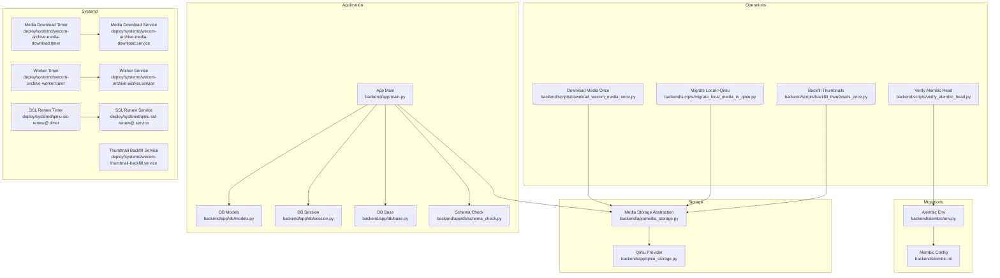
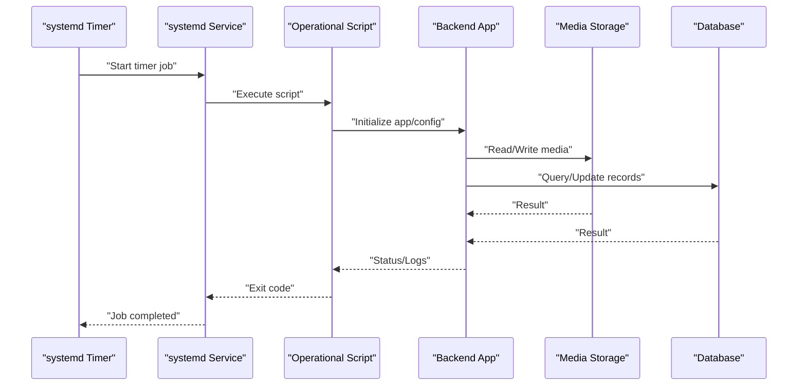
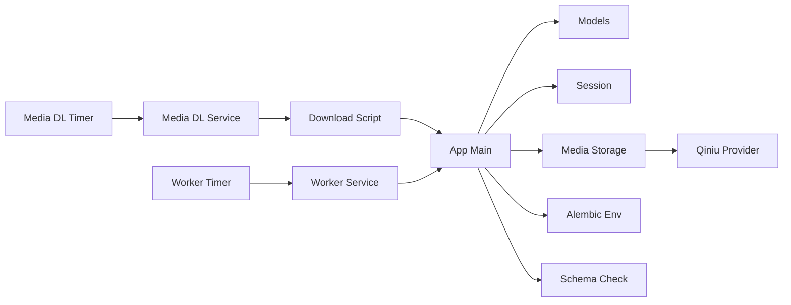

# Backup & Recovery

<cite>
**Referenced Files in This Document**
- [backend/app/media_storage.py](file://backend/app/media_storage.py)
- [backend/app/qiniu_storage.py](file://backend/app/qiniu_storage.py)
- [backend/alembic.ini](file://backend/alembic.ini)
- [backend/alembic/env.py](file://backend/alembic/env.py)
- [backend/scripts/migrate_local_media_to_qiniu.py](file://backend/scripts/migrate_local_media_to_qiniu.py)
- [backend/scripts/download_wecom_media_once.py](file://backend/scripts/download_wecom_media_once.py)
- [backend/scripts/backfill_thumbnails_once.py](file://backend/scripts/backfill_thumbnails_once.py)
- [backend/scripts/verify_alembic_head.py](file://backend/scripts/verify_alembic_head.py)
- [backend/app/db/base.py](file://backend/app/db/base.py)
- [backend/app/db/session.py](file://backend/app/db/session.py)
- [backend/app/db/models.py](file://backend/app/db/models.py)
- [backend/app/db/schema_check.py](file://backend/app/db/schema_check.py)
- [backend/app/main.py](file://backend/app/main.py)
- [deploy/systemd/wecom-archive-media-download.service](file://deploy/systemd/wecom-archive-media-download.service)
- [deploy/systemd/wecom-archive-worker.service](file://deploy/systemd/wecom-archive-worker.service)
- [deploy/systemd/wecom-thumbnail-backfill.service](file://deploy/systemd/wecom-thumbnail-backfill.service)
- [deploy/systemd/wecom-archive-media-download.timer](file://deploy/systemd/wecom-archive-media-download.timer)
- [deploy/systemd/wecom-archive-worker.timer](file://deploy/systemd/wecom-archive-worker.timer)
- [deploy/systemd/qiniu-ssl-renew@.service](file://deploy/systemd/qiniu-ssl-renew@.service)
- [deploy/systemd/qiniu-ssl-renew@.timer](file://deploy/systemd/qiniu-ssl-renew@.timer)
- [backend/requirements.txt](file://backend/requirements.txt)
- [pyproject.toml](file://pyproject.toml)
- [Makefile](file://Makefile)
- [.github/workflows/deploy.yml](file://.github/workflows/deploy.yml)
</cite>

## Table of Contents
1. [Introduction](#introduction)
2. [Project Structure](#project-structure)
3. [Core Components](#core-components)
4. [Architecture Overview](#architecture-overview)
5. [Detailed Component Analysis](#detailed-component-analysis)
6. [Dependency Analysis](#dependency-analysis)
7. [Performance Considerations](#performance-considerations)
8. [Troubleshooting Guide](#troubleshooting-guide)
9. [Conclusion](#conclusion)
10. [Appendices](#appendices)

## Introduction
This document provides comprehensive backup and disaster recovery guidance for the WeCom Archive system. It covers database backup strategies (full, incremental, point-in-time recovery), media file backup processes for local storage and Qiniu cloud integration, data migration procedures using Alembic, schema versioning strategies, disaster recovery playbooks, failover procedures, restoration workflows, and verification/testing to ensure data integrity.

## Project Structure
The project is a Python backend with:
- Database models and Alembic migrations under backend/app/db and backend/alembic
- Media storage abstraction with local and Qiniu backends
- Systemd services and timers for scheduled jobs
- Scripts for one-off operations and migrations
- CI deployment workflow

**Diagram sources**
- [backend/app/main.py](file://backend/app/main.py)
- [backend/app/db/models.py](file://backend/app/db/models.py)
- [backend/app/db/session.py](file://backend/app/db/session.py)
- [backend/app/db/base.py](file://backend/app/db/base.py)
- [backend/app/db/schema_check.py](file://backend/app/db/schema_check.py)
- [backend/app/media_storage.py](file://backend/app/media_storage.py)
- [backend/app/qiniu_storage.py](file://backend/app/qiniu_storage.py)
- [backend/alembic/env.py](file://backend/alembic/env.py)
- [backend/alembic.ini](file://backend/alembic.ini)
- [backend/scripts/download_wecom_media_once.py](file://backend/scripts/download_wecom_media_once.py)
- [backend/scripts/migrate_local_media_to_qiniu.py](file://backend/scripts/migrate_local_media_to_qiniu.py)
- [backend/scripts/backfill_thumbnails_once.py](file://backend/scripts/backfill_thumbnails_once.py)
- [backend/scripts/verify_alembic_head.py](file://backend/scripts/verify_alembic_head.py)
- [deploy/systemd/wecom-archive-media-download.timer](file://deploy/systemd/wecom-archive-media-download.timer)
- [deploy/systemd/wecom-archive-media-download.service](file://deploy/systemd/wecom-archive-media-download.service)
- [deploy/systemd/wecom-archive-worker.timer](file://deploy/systemd/wecom-archive-worker.timer)
- [deploy/systemd/wecom-archive-worker.service](file://deploy/systemd/wecom-archive-worker.service)
- [deploy/systemd/qiniu-ssl-renew@.timer](file://deploy/systemd/qiniu-ssl-renew@.timer)
- [deploy/systemd/qiniu-ssl-renew@.service](file://deploy/systemd/qiniu-ssl-renew@.service)
- [deploy/systemd/wecom-thumbnail-backfill.service](file://deploy/systemd/wecom-thumbnail-backfill.service)

**Section sources**
- [backend/app/main.py](file://backend/app/main.py)
- [backend/app/db/models.py](file://backend/app/db/models.py)
- [backend/app/db/session.py](file://backend/app/db/session.py)
- [backend/app/db/base.py](file://backend/app/db/base.py)
- [backend/app/db/schema_check.py](file://backend/app/db/schema_check.py)
- [backend/app/media_storage.py](file://backend/app/media_storage.py)
- [backend/app/qiniu_storage.py](file://backend/app/qiniu_storage.py)
- [backend/alembic/env.py](file://backend/alembic/env.py)
- [backend/alembic.ini](file://backend/alembic.ini)
- [backend/scripts/download_wecom_media_once.py](file://backend/scripts/download_wecom_media_once.py)
- [backend/scripts/migrate_local_media_to_qiniu.py](file://backend/scripts/migrate_local_media_to_qiniu.py)
- [backend/scripts/backfill_thumbnails_once.py](file://backend/scripts/backfill_thumbnails_once.py)
- [backend/scripts/verify_alembic_head.py](file://backend/scripts/verify_alembic_head.py)
- [deploy/systemd/wecom-archive-media-download.timer](file://deploy/systemd/wecom-archive-media-download.timer)
- [deploy/systemd/wecom-archive-media-download.service](file://deploy/systemd/wecom-archive-media-download.service)
- [deploy/systemd/wecom-archive-worker.timer](file://deploy/systemd/wecom-archive-worker.timer)
- [deploy/systemd/wecom-archive-worker.service](file://deploy/systemd/wecom-archive-worker.service)
- [deploy/systemd/qiniu-ssl-renew@.timer](file://deploy/systemd/qiniu-ssl-renew@.timer)
- [deploy/systemd/qiniu-ssl-renew@.service](file://deploy/systemd/qiniu-ssl-renew@.service)
- [deploy/systemd/wecom-thumbnail-backfill.service](file://deploy/systemd/wecom-thumbnail-backfill.service)

## Core Components
- Database layer: SQLAlchemy base, session management, models, and schema checks.
- Storage layer: Abstracted media storage with local filesystem and Qiniu provider implementations.
- Migration tooling: Alembic configuration and environment setup.
- Operational scripts: One-time downloads, migrations, thumbnail backfills, and Alembic head verification.
- Systemd units: Timers and services for scheduled and background tasks.

Key responsibilities:
- Database backups target the underlying DB engine via external tools; application code exposes models and sessions used by these tools.
- Media backups target either local disk or Qiniu object storage depending on configured backend.
- Migrations are managed through Alembic; scripts validate and execute changes safely.

**Section sources**
- [backend/app/db/base.py](file://backend/app/db/base.py)
- [backend/app/db/session.py](file://backend/app/db/session.py)
- [backend/app/db/models.py](file://backend/app/db/models.py)
- [backend/app/db/schema_check.py](file://backend/app/db/schema_check.py)
- [backend/app/media_storage.py](file://backend/app/media_storage.py)
- [backend/app/qiniu_storage.py](file://backend/app/qiniu_storage.py)
- [backend/alembic/env.py](file://backend/alembic/env.py)
- [backend/alembic.ini](file://backend/alembic.ini)
- [backend/scripts/download_wecom_media_once.py](file://backend/scripts/download_wecom_media_once.py)
- [backend/scripts/migrate_local_media_to_qiniu.py](file://backend/scripts/migrate_local_media_to_qiniu.py)
- [backend/scripts/backfill_thumbnails_once.py](file://backend/scripts/backfill_thumbnails_once.py)
- [backend/scripts/verify_alembic_head.py](file://backend/scripts/verify_alembic_head.py)

## Architecture Overview
The system integrates application logic with storage backends and scheduled operations. Database state is persisted via SQLAlchemy models; media assets are stored locally or on Qiniu. Scheduled tasks run via systemd timers invoking service units that execute operational scripts.

**Diagram sources**
- [deploy/systemd/wecom-archive-media-download.timer](file://deploy/systemd/wecom-archive-media-download.timer)
- [deploy/systemd/wecom-archive-media-download.service](file://deploy/systemd/wecom-archive-media-download.service)
- [backend/scripts/download_wecom_media_once.py](file://backend/scripts/download_wecom_media_once.py)
- [backend/app/main.py](file://backend/app/main.py)
- [backend/app/media_storage.py](file://backend/app/media_storage.py)
- [backend/app/db/session.py](file://backend/app/db/session.py)

## Detailed Component Analysis

### Database Backup Strategy
- Full backups: Use native DB engine tools to create consistent snapshots. Ensure application connections are quiesced or use logical backups if supported.
- Incremental backups: Enable WAL/archiving (if applicable) and schedule periodic incremental snapshots to minimize RPO.
- Point-in-time recovery (PITR): Combine full backups with WAL archives to restore to any timestamp within retention window.

Operational notes:
- Validate backup integrity regularly using checksums and restore drills.
- Encrypt backups at rest and in transit.
- Retain multiple generations per compliance requirements.

[No sources needed since this section provides general guidance]

### Media File Backup Processes
- Local storage:
  - Back up the media directory tree consistently.
  - Use snapshot-capable filesystems or rsync with hard links for incremental efficiency.
  - Verify file counts and sizes post-sync.
- Qiniu cloud storage:
  - Use Qiniu CLI or SDK to mirror buckets.
  - Enable versioning and lifecycle policies where appropriate.
  - Validate object metadata and signatures.

Integration points:
- Application uses a storage abstraction to read/write media files.
- Operational scripts can trigger downloads and migrations between backends.

**Section sources**
- [backend/app/media_storage.py](file://backend/app/media_storage.py)
- [backend/app/qiniu_storage.py](file://backend/app/qiniu_storage.py)
- [backend/scripts/download_wecom_media_once.py](file://backend/scripts/download_wecom_media_once.py)
- [backend/scripts/migrate_local_media_to_qiniu.py](file://backend/scripts/migrate_local_media_to_qiniu.py)

### Data Migration Procedures and Alembic Management
- Schema versioning:
  - Each change is an Alembic migration file under alembic versions.
  - The Alembic env configures connection and migration context.
- Safe execution:
  - Run migrations in a transactional context when possible.
  - Pre-validate with Alembic head check before applying.
- Rollback strategy:
  - Keep downgrades available; test rollback paths in staging.

Verification:
- Use the Alembic head verification script to ensure no drift between code and DB.

**Section sources**
- [backend/alembic/env.py](file://backend/alembic/env.py)
- [backend/alembic.ini](file://backend/alembic.ini)
- [backend/scripts/verify_alembic_head.py](file://backend/scripts/verify_alembic_head.py)

### Disaster Recovery Playbook
- Detection:
  - Monitor health endpoints and alert on failures.
- Decision:
  - Determine scope (database-only, media-only, or both).
- Restoration:
  - Restore DB from latest full + WAL archives to desired PIT.
  - Restore media from local snapshots or Qiniu bucket mirrors.
- Validation:
  - Run schema checks and Alembic head verification.
  - Perform smoke tests against APIs and sample queries.
- Failover:
  - Redirect traffic to DR site once validated.
  - Promote DR DB if necessary and update DNS/load balancer.

[No sources needed since this section provides general guidance]

### Failover Procedures
- Pre-failover:
  - Ensure DR replicas are caught up (DB replication lag minimal).
  - Confirm media sync status across regions.
- During failover:
  - Stop writes to primary; drain connections.
  - Promote replica; verify schema and data consistency.
  - Update routing to DR endpoint.
- Post-failover:
  - Reconcile any missed events.
  - Monitor error rates and performance metrics.

[No sources needed since this section provides general guidance]

### Data Restoration Workflows
- Database restoration:
  - Apply full backup, replay WAL to target timestamp.
  - Verify schema version matches application expectations.
- Media restoration:
  - Restore local directory tree or rehydrate from Qiniu.
  - Rebuild thumbnails if missing.

**Section sources**
- [backend/scripts/backfill_thumbnails_once.py](file://backend/scripts/backfill_thumbnails_once.py)

### Backup Verification and Testing
- Integrity checks:
  - Compare checksums of restored files with originals.
  - Validate DB constraints and referential integrity.
- Functional tests:
  - Run Alembic head verification.
  - Execute targeted API smoke tests.
- Periodic drills:
  - Schedule quarterly restore drills to production-like environments.

**Section sources**
- [backend/scripts/verify_alembic_head.py](file://backend/scripts/verify_alembic_head.py)

## Dependency Analysis
The application depends on:
- SQLAlchemy models and session for DB access.
- Storage abstraction for media I/O.
- Alembic for schema evolution.
- Systemd timers/services for scheduling.

**Diagram sources**
- [backend/app/main.py](file://backend/app/main.py)
- [backend/app/db/models.py](file://backend/app/db/models.py)
- [backend/app/db/session.py](file://backend/app/db/session.py)
- [backend/app/media_storage.py](file://backend/app/media_storage.py)
- [backend/app/qiniu_storage.py](file://backend/app/qiniu_storage.py)
- [backend/alembic/env.py](file://backend/alembic/env.py)
- [backend/app/db/schema_check.py](file://backend/app/db/schema_check.py)
- [deploy/systemd/wecom-archive-media-download.timer](file://deploy/systemd/wecom-archive-media-download.timer)
- [deploy/systemd/wecom-archive-media-download.service](file://deploy/systemd/wecom-archive-media-download.service)
- [deploy/systemd/wecom-archive-worker.timer](file://deploy/systemd/wecom-archive-worker.timer)
- [deploy/systemd/wecom-archive-worker.service](file://deploy/systemd/wecom-archive-worker.service)

**Section sources**
- [backend/app/main.py](file://backend/app/main.py)
- [backend/app/db/models.py](file://backend/app/db/models.py)
- [backend/app/db/session.py](file://backend/app/db/session.py)
- [backend/app/media_storage.py](file://backend/app/media_storage.py)
- [backend/app/qiniu_storage.py](file://backend/app/qiniu_storage.py)
- [backend/alembic/env.py](file://backend/alembic/env.py)
- [backend/app/db/schema_check.py](file://backend/app/db/schema_check.py)
- [deploy/systemd/wecom-archive-media-download.timer](file://deploy/systemd/wecom-archive-media-download.timer)
- [deploy/systemd/wecom-archive-media-download.service](file://deploy/systemd/wecom-archive-media-download.service)
- [deploy/systemd/wecom-archive-worker.timer](file://deploy/systemd/wecom-archive-worker.timer)
- [deploy/systemd/wecom-archive-worker.service](file://deploy/systemd/wecom-archive-worker.service)

## Performance Considerations
- Prefer incremental backups to reduce RPO and storage costs.
- Use streaming restores for large datasets to minimize downtime.
- Offload heavy operations (e.g., thumbnail generation) to background workers.
- Cache frequently accessed metadata to reduce DB load during recovery validation.

[No sources needed since this section provides general guidance]

## Troubleshooting Guide
Common issues and resolutions:
- Alembic head mismatch:
  - Run the Alembic head verification script to detect drift.
- Media download failures:
  - Inspect network connectivity and credentials; retry with idempotent runs.
- Thumbnail backfill stalls:
  - Check worker logs and resource utilization; scale workers if needed.
- SSL renewal problems:
  - Validate domain bindings and certificate chains; review renewal logs.

**Section sources**
- [backend/scripts/verify_alembic_head.py](file://backend/scripts/verify_alembic_head.py)
- [backend/scripts/download_wecom_media_once.py](file://backend/scripts/download_wecom_media_once.py)
- [backend/scripts/backfill_thumbnails_once.py](file://backend/scripts/backfill_thumbnails_once.py)
- [deploy/systemd/qiniu-ssl-renew@.service](file://deploy/systemd/qiniu-ssl-renew@.service)

## Conclusion
A robust backup and disaster recovery strategy combines reliable database snapshots, consistent media backups, and rigorous testing. Alembic-managed schema versioning ensures compatibility, while systemd-based automation supports repeatable operations. Regular drills and verification keep recovery procedures effective and predictable.

[No sources needed since this section summarizes without analyzing specific files]

## Appendices

### Appendix A: Backup Scheduling and Automation
- Use systemd timers to schedule regular backups and maintenance tasks.
- Ensure idempotency for all backup scripts to support retries.

**Section sources**
- [deploy/systemd/wecom-archive-media-download.timer](file://deploy/systemd/wecom-archive-media-download.timer)
- [deploy/systemd/wecom-archive-worker.timer](file://deploy/systemd/wecom-archive-worker.timer)
- [deploy/systemd/qiniu-ssl-renew@.timer](file://deploy/systemd/qiniu-ssl-renew@.timer)

### Appendix B: Deployment and CI Integration
- CI pipeline triggers deployments; ensure artifacts include updated migrations and dependencies.
- Validate environment readiness before rollout.

**Section sources**
- [.github/workflows/deploy.yml](file://.github/workflows/deploy.yml)
- [Makefile](file://Makefile)
- [backend/requirements.txt](file://backend/requirements.txt)
- [pyproject.toml](file://pyproject.toml)