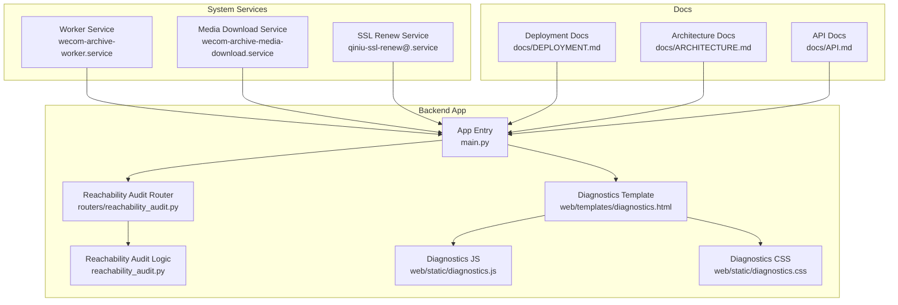
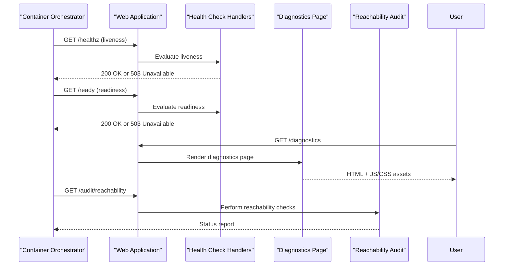
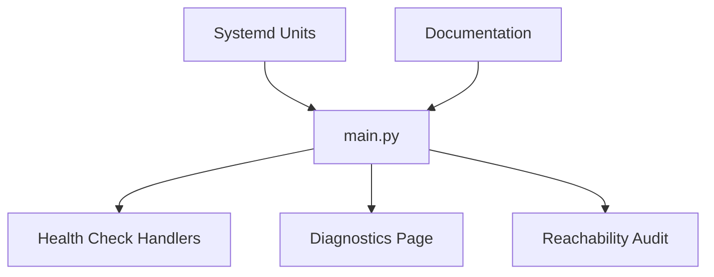

# Monitoring & Logging

<cite>
**Referenced Files in This Document**
- [main.py](file://backend/app/main.py)
- [test_readiness_health_endpoint.py](file://backend/tests/test_readiness_health_endpoint.py)
- [diagnostics.html](file://backend/app/web/templates/diagnostics.html)
- [diagnostics.js](file://backend/app/web/static/diagnostics.js)
- [diagnostics.css](file://backend/app/web/static/diagnostics.css)
- [reachability_audit.py](file://backend/app/reachability_audit.py)
- [routers/reachability_audit.py](file://backend/app/routers/reachability_audit.py)
- [wecom-archive-worker.service](file://deploy/systemd/wecom-archive-worker.service)
- [wecom-archive-media-download.service](file://deploy/systemd/wecom-archive-media-download.service)
- [qiniu-ssl-renew@.service](file://deploy/systemd/qiniu-ssl-renew@.service)
- [DEPLOYMENT.md](file://docs/DEPLOYMENT.md)
- [ARCHITECTURE.md](file://docs/ARCHITECTURE.md)
- [API.md](file://docs/API.md)
</cite>

## Table of Contents
1. [Introduction](#introduction)
2. [Project Structure](#project-structure)
3. [Core Components](#core-components)
4. [Architecture Overview](#architecture-overview)
5. [Detailed Component Analysis](#detailed-component-analysis)
6. [Dependency Analysis](#dependency-analysis)
7. [Performance Considerations](#performance-considerations)
8. [Troubleshooting Guide](#troubleshooting-guide)
9. [Conclusion](#conclusion)
10. [Appendices](#appendices)

## Introduction
This document provides comprehensive monitoring and logging guidance for the WeCom Archive application. It covers health check endpoints, readiness probes, liveness checks, log collection and rotation strategies, centralized logging setup, performance metrics collection, application monitoring with Prometheus or APM tools, alerting configurations, diagnostic tools usage, troubleshooting workflows, common operational issues, and audit logging for compliance and security monitoring. The content is derived from the repository’s codebase and documentation to ensure accuracy and practical applicability.

## Project Structure
The backend application exposes web routes and templates that include diagnostics and reachability auditing features. Systemd service units are provided for long-running processes such as workers and media download tasks. Documentation files describe deployment practices and architecture decisions relevant to observability.

**Diagram sources**
- [main.py](file://backend/app/main.py)
- [routers/reachability_audit.py](file://backend/app/routers/reachability_audit.py)
- [reachability_audit.py](file://backend/app/reachability_audit.py)
- [diagnostics.html](file://backend/app/web/templates/diagnostics.html)
- [diagnostics.js](file://backend/app/web/static/diagnostics.js)
- [diagnostics.css](file://backend/app/web/static/diagnostics.css)
- [wecom-archive-worker.service](file://deploy/systemd/wecom-archive-worker.service)
- [wecom-archive-media-download.service](file://deploy/systemd/wecom-archive-media-download.service)
- [qiniu-ssl-renew@.service](file://deploy/systemd/qiniu-ssl-renew@.service)
- [DEPLOYMENT.md](file://docs/DEPLOYMENT.md)
- [ARCHITECTURE.md](file://docs/ARCHITECTURE.md)
- [API.md](file://docs/API.md)

**Section sources**
- [main.py](file://backend/app/main.py)
- [routers/reachability_audit.py](file://backend/app/routers/reachability_audit.py)
- [reachability_audit.py](file://backend/app/reachability_audit.py)
- [diagnostics.html](file://backend/app/web/templates/diagnostics.html)
- [diagnostics.js](file://backend/app/web/static/diagnostics.js)
- [diagnostics.css](file://backend/app/web/static/diagnostics.css)
- [wecom-archive-worker.service](file://deploy/systemd/wecom-archive-worker.service)
- [wecom-archive-media-download.service](file://deploy/systemd/wecom-archive-media-download.service)
- [qiniu-ssl-renew@.service](file://deploy/systemd/qiniu-ssl-renew@.service)
- [DEPLOYMENT.md](file://docs/DEPLOYMENT.md)
- [ARCHITECTURE.md](file://docs/ARCHITECTURE.md)
- [API.md](file://docs/API.md)

## Core Components
- Health Check Endpoints: Readiness and liveness checks are implemented to support container orchestration platforms. Tests validate the behavior of readiness endpoints.
- Diagnostics Page: A web-based diagnostics interface renders runtime information and supports interactive checks via JavaScript.
- Reachability Audit: Dedicated router and logic provide endpoints and processing for reachability audits, useful for external dependency checks.
- Systemd Services: Long-running services (worker, media download, SSL renewal) are managed via systemd units, enabling process lifecycle control and integration with OS-level monitoring.

Key implementation references:
- Readiness health endpoint tests: [test_readiness_health_endpoint.py](file://backend/tests/test_readiness_health_endpoint.py)
- Diagnostics template and assets: [diagnostics.html](file://backend/app/web/templates/diagnostics.html), [diagnostics.js](file://backend/app/web/static/diagnostics.js), [diagnostics.css](file://backend/app/web/static/diagnostics.css)
- Reachability audit router and module: [routers/reachability_audit.py](file://backend/app/routers/reachability_audit.py), [reachability_audit.py](file://backend/app/reachability_audit.py)
- Systemd service units: [wecom-archive-worker.service](file://deploy/systemd/wecom-archive-worker.service), [wecom-archive-media-download.service](file://deploy/systemd/wecom-archive-media-download.service), [qiniu-ssl-renew@.service](file://deploy/systemd/qiniu-ssl-renew@.service)

**Section sources**
- [test_readiness_health_endpoint.py](file://backend/tests/test_readiness_health_endpoint.py)
- [diagnostics.html](file://backend/app/web/templates/diagnostics.html)
- [diagnostics.js](file://backend/app/web/static/diagnostics.js)
- [diagnostics.css](file://backend/app/web/static/diagnostics.css)
- [routers/reachability_audit.py](file://backend/app/routers/reachability_audit.py)
- [reachability_audit.py](file://backend/app/reachability_audit.py)
- [wecom-archive-worker.service](file://deploy/systemd/wecom-archive-worker.service)
- [wecom-archive-media-download.service](file://deploy/systemd/wecom-archive-media-download.service)
- [qiniu-ssl-renew@.service](file://deploy/systemd/qiniu-ssl-renew@.service)

## Architecture Overview
The application exposes HTTP endpoints for health checks and diagnostics, integrates with external dependencies through reachability audits, and runs background tasks via systemd-managed services. Container orchestration platforms can probe readiness and liveness endpoints to manage scaling and restarts effectively.

**Diagram sources**
- [main.py](file://backend/app/main.py)
- [routers/reachability_audit.py](file://backend/app/routers/reachability_audit.py)
- [reachability_audit.py](file://backend/app/reachability_audit.py)
- [diagnostics.html](file://backend/app/web/templates/diagnostics.html)
- [diagnostics.js](file://backend/app/web/static/diagnostics.js)
- [diagnostics.css](file://backend/app/web/static/diagnostics.css)

## Detailed Component Analysis

### Health Check Endpoints and Probes
- Liveness Probe: Indicates whether the process is alive and responsive. Typically returns a simple status without heavy checks.
- Readiness Probe: Validates if the application is ready to serve traffic, including dependency availability and internal state.

Implementation references:
- Readiness endpoint tests demonstrate expected behaviors and responses: [test_readiness_health_endpoint.py](file://backend/tests/test_readiness_health_endpoint.py)
- Health check handlers are registered within the main application entry point: [main.py](file://backend/app/main.py)

Operational guidance:
- Configure orchestrators to poll liveness at a moderate interval to avoid unnecessary restarts.
- Use readiness probes to gate traffic until all dependencies (e.g., database, storage backends) are healthy.

**Section sources**
- [test_readiness_health_endpoint.py](file://backend/tests/test_readiness_health_endpoint.py)
- [main.py](file://backend/app/main.py)

### Diagnostics Page and Interactive Tools
The diagnostics page provides a user-friendly interface to inspect runtime state and perform quick checks. It leverages static assets for rendering and interactivity.

Key components:
- Template: [diagnostics.html](file://backend/app/web/templates/diagnostics.html)
- Client-side logic: [diagnostics.js](file://backend/app/web/static/diagnostics.js)
- Styling: [diagnostics.css](file://backend/app/web/static/diagnostics.css)

Usage workflow:
- Access the diagnostics page via the web UI.
- Use interactive controls to trigger checks and view results.
- Export or capture outputs for further analysis.

**Section sources**
- [diagnostics.html](file://backend/app/web/templates/diagnostics.html)
- [diagnostics.js](file://backend/app/web/static/diagnostics.js)
- [diagnostics.css](file://backend/app/web/static/diagnostics.css)

### Reachability Audit Module
The reachability audit feature allows checking connectivity and responsiveness of external systems critical to the application.

Components:
- Router exposing endpoints: [routers/reachability_audit.py](file://backend/app/routers/reachability_audit.py)
- Core logic for performing audits: [reachability_audit.py](file://backend/app/reachability_audit.py)

Typical flow:
- An orchestrator or operator calls the audit endpoint.
- The router delegates to the audit module.
- The module performs checks against configured dependencies and returns a structured status.

**Section sources**
- [routers/reachability_audit.py](file://backend/app/routers/reachability_audit.py)
- [reachability_audit.py](file://backend/app/reachability_audit.py)

### Systemd Services and Process Lifecycle
Long-running tasks are managed via systemd units, ensuring robust lifecycle management and integration with system-level monitoring.

Services:
- Worker process: [wecom-archive-worker.service](file://deploy/systemd/wecom-archive-worker.service)
- Media download task: [wecom-archive-media-download.service](file://deploy/systemd/wecom-archive-media-download.service)
- SSL renewal utility: [qiniu-ssl-renew@.service](file://deploy/systemd/qiniu-ssl-renew@.service)

Best practices:
- Monitor service status using systemctl commands.
- Integrate with centralized logging by directing logs to standard output or journal.
- Configure restart policies and resource limits in unit files.

**Section sources**
- [wecom-archive-worker.service](file://deploy/systemd/wecom-archive-worker.service)
- [wecom-archive-media-download.service](file://deploy/systemd/wecom-archive-media-download.service)
- [qiniu-ssl-renew@.service](file://deploy/systemd/qiniu-ssl-renew@.service)

## Dependency Analysis
The application’s observability stack depends on:
- Web framework routing for health and diagnostics endpoints.
- External dependency checks via reachability audit module.
- Systemd for managing background services.
- Documentation guiding deployment and operational practices.

**Diagram sources**
- [main.py](file://backend/app/main.py)
- [routers/reachability_audit.py](file://backend/app/routers/reachability_audit.py)
- [reachability_audit.py](file://backend/app/reachability_audit.py)
- [diagnostics.html](file://backend/app/web/templates/diagnostics.html)
- [wecom-archive-worker.service](file://deploy/systemd/wecom-archive-worker.service)
- [wecom-archive-media-download.service](file://deploy/systemd/wecom-archive-media-download.service)
- [qiniu-ssl-renew@.service](file://deploy/systemd/qiniu-ssl-renew@.service)
- [DEPLOYMENT.md](file://docs/DEPLOYMENT.md)
- [ARCHITECTURE.md](file://docs/ARCHITECTURE.md)
- [API.md](file://docs/API.md)

**Section sources**
- [main.py](file://backend/app/main.py)
- [routers/reachability_audit.py](file://backend/app/routers/reachability_audit.py)
- [reachability_audit.py](file://backend/app/reachability_audit.py)
- [diagnostics.html](file://backend/app/web/templates/diagnostics.html)
- [wecom-archive-worker.service](file://deploy/systemd/wecom-archive-worker.service)
- [wecom-archive-media-download.service](file://deploy/systemd/wecom-archive-media-download.service)
- [qiniu-ssl-renew@.service](file://deploy/systemd/qiniu-ssl-renew@.service)
- [DEPLOYMENT.md](file://docs/DEPLOYMENT.md)
- [ARCHITECTURE.md](file://docs/ARCHITECTURE.md)
- [API.md](file://docs/API.md)

## Performance Considerations
- Keep liveness checks lightweight to avoid impacting request latency.
- Use readiness probes to defer traffic until dependencies are healthy, reducing error rates during startup.
- Avoid expensive operations in health endpoints; delegate heavy checks to background jobs or cache results when appropriate.
- Monitor CPU and memory usage of worker and media download services; tune concurrency and resource limits based on workload.

[No sources needed since this section provides general guidance]

## Troubleshooting Guide
Common operational issues and resolutions:
- Health checks failing: Verify dependency availability and internal state; use diagnostics page to inspect runtime conditions.
- Readiness not achieved: Check database connections, storage backends, and configuration; review logs for initialization errors.
- Worker stalls: Inspect systemd service status and logs; ensure queues and external APIs are reachable.
- SSL renewal failures: Validate domain configuration and credentials; consult SSL renewal documentation and logs.

Diagnostic steps:
- Use the diagnostics page to run targeted checks.
- Review systemd journal entries for service-specific errors.
- Correlate timestamps across application logs and system events.

**Section sources**
- [diagnostics.html](file://backend/app/web/templates/diagnostics.html)
- [diagnostics.js](file://backend/app/web/static/diagnostics.js)
- [wecom-archive-worker.service](file://deploy/systemd/wecom-archive-worker.service)
- [wecom-archive-media-download.service](file://deploy/systemd/wecom-archive-media-download.service)
- [qiniu-ssl-renew@.service](file://deploy/systemd/qiniu-ssl-renew@.service)

## Conclusion
The WeCom Archive application provides essential observability features including health check endpoints, diagnostics tools, and reachability audits. Combined with systemd-managed services and documented deployment practices, operators can implement robust monitoring, logging, and alerting strategies. Following the guidance in this document ensures reliable operation and effective troubleshooting in production environments.

[No sources needed since this section summarizes without analyzing specific files]

## Appendices

### Log Collection Strategies
- Centralized logging: Direct application logs to stdout/stderr and collect via journald or a log shipper (e.g., Fluent Bit, Filebeat).
- Structured logging: Emit JSON-formatted logs with consistent fields (timestamp, level, service, trace_id) for easy parsing.
- Log rotation: Configure logrotate or rely on journald rotation policies to manage disk usage.

[No sources needed since this section provides general guidance]

### Performance Metrics Collection
- Expose metrics endpoints compatible with Prometheus scraping.
- Instrument key operations (requests, queue lengths, dependency latencies) with counters, histograms, and gauges.
- Use APM solutions to trace requests across services and identify bottlenecks.

[No sources needed since this section provides general guidance]

### Alerting Configurations
- Define alerts for health check failures, high error rates, and resource exhaustion.
- Integrate with notification channels (email, Slack, PagerDuty) for timely incident response.
- Implement runbooks linked to alerts for rapid resolution.

[No sources needed since this section provides general guidance]

### Audit Logging for Compliance and Security
- Record access and modification events for sensitive resources.
- Include contextual details (user, action, timestamp, outcome) in audit logs.
- Retain audit logs per compliance requirements and protect them from tampering.

[No sources needed since this section provides general guidance]