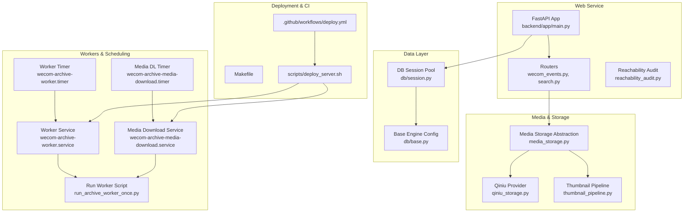
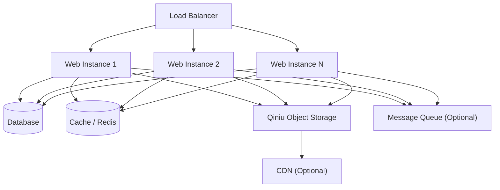
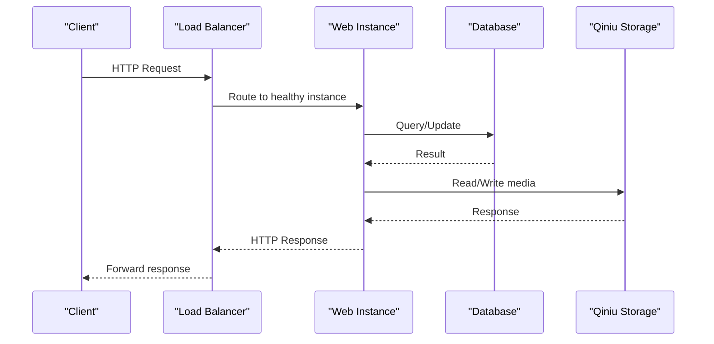
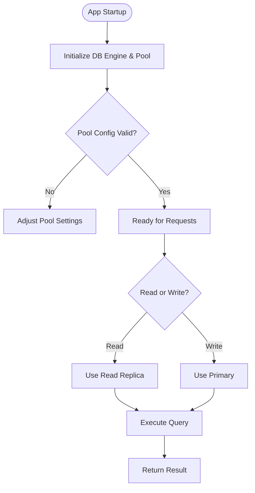
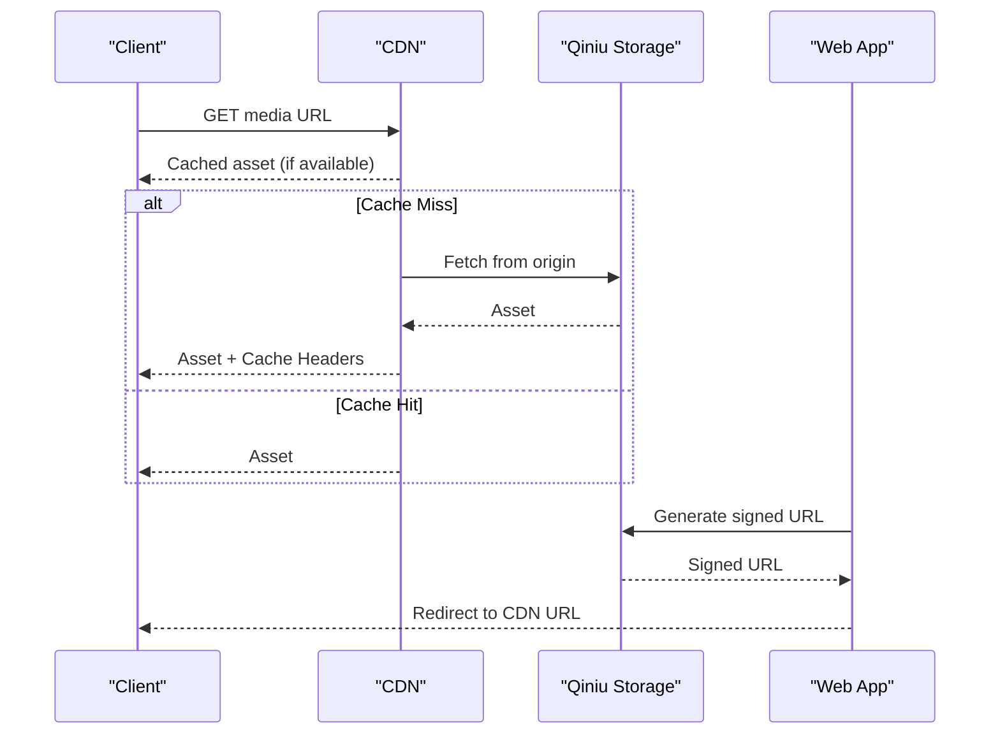
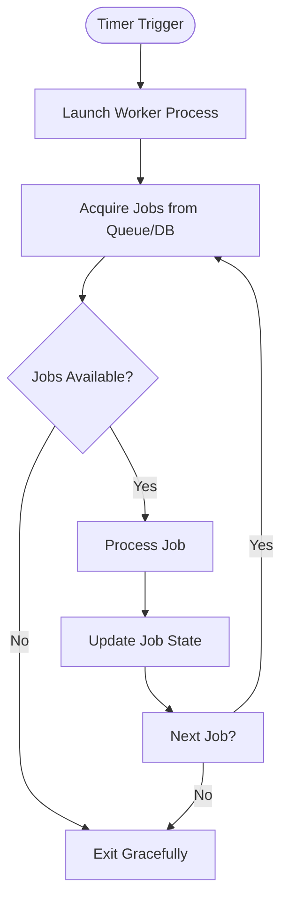
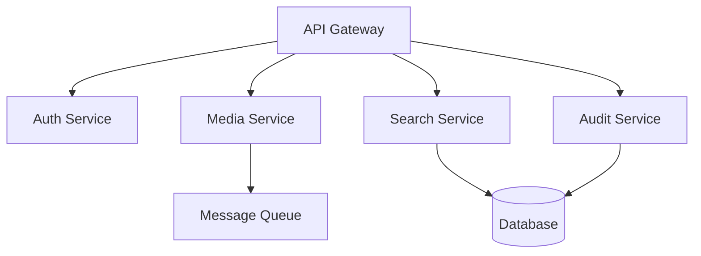
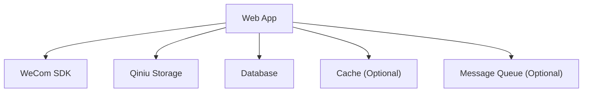

# Scaling & High Availability

<cite>
**Referenced Files in This Document**
- [backend/app/main.py](file://backend/app/main.py)
- [backend/app/db/session.py](file://backend/app/db/session.py)
- [backend/app/db/base.py](file://backend/app/db/base.py)
- [backend/app/media_storage.py](file://backend/app/media_storage.py)
- [backend/app/qiniu_storage.py](file://backend/app/qiniu_storage.py)
- [backend/app/thumbnail_pipeline.py](file://backend/app/thumbnail_pipeline.py)
- [backend/app/routers/wecom_events.py](file://backend/app/routers/wecom_events.py)
- [backend/app/routers/search.py](file://backend/app/routers/search.py)
- [backend/app/reachability_audit.py](file://backend/app/reachability_audit.py)
- [backend/scripts/run_archive_worker_once.py](file://backend/scripts/run_archive_worker_once.py)
- [deploy/systemd/wecom-archive-worker.service](file://deploy/systemd/wecom-archive-worker.service)
- [deploy/systemd/wecom-archive-media-download.service](file://deploy/systemd/wecom-archive-media-download.service)
- [deploy/systemd/wecom-archive-worker.timer](file://deploy/systemd/wecom-archive-worker.timer)
- [deploy/systemd/wecom-archive-media-download.timer](file://deploy/systemd/wecom-archive-media-download.timer)
- [.github/workflows/deploy.yml](file://.github/workflows/deploy.yml)
- [backend/requirements.txt](file://backend/requirements.txt)
- [pyproject.toml](file://pyproject.toml)
- [Makefile](file://Makefile)
- [scripts/deploy_server.sh](file://scripts/deploy_server.sh)
- [docs/ARCHITECTURE.md](file://docs/ARCHITECTURE.md)
- [docs/DEPLOYMENT.md](file://docs/DEPLOYMENT.md)
- [docs/ops/media_storage_ops.md](file://docs/ops/media_storage_ops.md)
</cite>

## Table of Contents
1. [Introduction](#introduction)
2. [Project Structure](#project-structure)
3. [Core Components](#core-components)
4. [Architecture Overview](#architecture-overview)
5. [Detailed Component Analysis](#detailed-component-analysis)
6. [Dependency Analysis](#dependency-analysis)
7. [Performance Considerations](#performance-considerations)
8. [Troubleshooting Guide](#troubleshooting-guide)
9. [Conclusion](#conclusion)
10. [Appendices](#appendices)

## Introduction
This document provides comprehensive guidance for scaling and achieving high availability (HA) for the WeCom Archive system. It covers horizontal scaling strategies for worker processes, load balancing approaches, stateless service design principles, database scaling options with connection pooling and read replicas, caching strategies, CDN integration for media files, auto-scaling configurations for cloud deployments, resource allocation guidelines, capacity planning recommendations, session management, message queue scaling patterns, and microservice decomposition considerations. The guidance is grounded in the repository’s architecture, deployment units, and operational scripts.

## Project Structure
The application is a Python web service with background workers and external integrations:
- Web API and templates under backend/app
- Database models and sessions under backend/app/db
- Media storage abstraction and Qiniu provider under backend/app
- Background workers and scheduled tasks via systemd units and timers
- Deployment automation via GitHub Actions and shell scripts
- Operational documentation for media storage operations

**Diagram sources**
- [backend/app/main.py](file://backend/app/main.py)
- [backend/app/db/session.py](file://backend/app/db/session.py)
- [backend/app/db/base.py](file://backend/app/db/base.py)
- [backend/app/media_storage.py](file://backend/app/media_storage.py)
- [backend/app/qiniu_storage.py](file://backend/app/qiniu_storage.py)
- [backend/app/thumbnail_pipeline.py](file://backend/app/thumbnail_pipeline.py)
- [backend/app/routers/wecom_events.py](file://backend/app/routers/wecom_events.py)
- [backend/app/routers/search.py](file://backend/app/routers/search.py)
- [backend/app/reachability_audit.py](file://backend/app/reachability_audit.py)
- [backend/scripts/run_archive_worker_once.py](file://backend/scripts/run_archive_worker_once.py)
- [deploy/systemd/wecom-archive-worker.service](file://deploy/systemd/wecom-archive-worker.service)
- [deploy/systemd/wecom-archive-media-download.service](file://deploy/systemd/wecom-archive-media-download.service)
- [deploy/systemd/wecom-archive-worker.timer](file://deploy/systemd/wecom-archive-worker.timer)
- [deploy/systemd/wecom-archive-media-download.timer](file://deploy/systemd/wecom-archive-media-download.timer)
- [.github/workflows/deploy.yml](file://.github/workflows/deploy.yml)
- [scripts/deploy_server.sh](file://scripts/deploy_server.sh)

**Section sources**
- [docs/ARCHITECTURE.md](file://docs/ARCHITECTURE.md)
- [docs/DEPLOYMENT.md](file://docs/DEPLOYMENT.md)

## Core Components
- Web Application Entry Point: FastAPI app initialization, middleware, and routing setup.
- Database Session Management: Connection pool configuration and lifecycle handling.
- Media Storage Abstraction: Pluggable storage backends with Qiniu integration.
- Thumbnail Pipeline: Asynchronous processing for thumbnail generation.
- Event Router: Ingestion of WeCom events and webhook handling.
- Search Router: Query endpoints for searching archived content.
- Reachability Audit: Health and reachability checks for external services.
- Workers and Timers: Systemd services and timers to run background jobs.

Key responsibilities:
- Stateless HTTP handlers that delegate I/O to DB and storage layers.
- Robust connection pooling and retry policies for external dependencies.
- Decoupled background processing via systemd units and timers.

**Section sources**
- [backend/app/main.py](file://backend/app/main.py)
- [backend/app/db/session.py](file://backend/app/db/session.py)
- [backend/app/db/base.py](file://backend/app/db/base.py)
- [backend/app/media_storage.py](file://backend/app/media_storage.py)
- [backend/app/qiniu_storage.py](file://backend/app/qiniu_storage.py)
- [backend/app/thumbnail_pipeline.py](file://backend/app/thumbnail_pipeline.py)
- [backend/app/routers/wecom_events.py](file://backend/app/routers/wecom_events.py)
- [backend/app/routers/search.py](file://backend/app/routers/search.py)
- [backend/app/reachability_audit.py](file://backend/app/reachability_audit.py)
- [backend/scripts/run_archive_worker_once.py](file://backend/scripts/run_archive_worker_once.py)
- [deploy/systemd/wecom-archive-worker.service](file://deploy/systemd/wecom-archive-worker.service)
- [deploy/systemd/wecom-archive-media-download.service](file://deploy/systemd/wecom-archive-media-download.service)
- [deploy/systemd/wecom-archive-worker.timer](file://deploy/systemd/wecom-archive-worker.timer)
- [deploy/systemd/wecom-archive-media-download.timer](file://deploy/systemd/wecom-archive-media-download.timer)

## Architecture Overview
The system follows a layered architecture:
- Presentation: Web UI templates and static assets served by the FastAPI app.
- API Layer: Routers exposing REST endpoints for authentication, conversations, search, and WeCom events.
- Domain Services: Business logic modules for media classification, download, thumbnails, and audit.
- Data Access: SQLAlchemy-based ORM with configured connection pools.
- External Integrations: WeCom SDK, Qiniu object storage, and optional CDN.

Horizontal scaling is achieved by running multiple instances of the web service behind a load balancer and scaling out worker processes via systemd units or container orchestration. Statelessness ensures requests can be routed to any instance. Shared state is minimized; when necessary, it is offloaded to external systems like databases and object storage.

[No sources needed since this diagram shows conceptual workflow, not actual code structure]

## Detailed Component Analysis

### Web Application Scaling and Load Balancing
- Stateless Design: Ensure all request handlers are stateless by avoiding in-process caches or mutable global state. Store session data externally if needed.
- Horizontal Scaling: Run multiple instances behind an HTTP load balancer (e.g., NGINX, HAProxy, or cloud ALB). Use health check endpoints exposed by the app.
- Concurrency Model: Tune the number of worker processes per instance based on CPU cores and I/O characteristics. For CPU-bound tasks, increase workers; for I/O-bound, rely on async concurrency.
- Graceful Shutdown: Implement graceful shutdown hooks to drain connections and avoid dropping in-flight requests during rolling updates.

**Diagram sources**
- [backend/app/main.py](file://backend/app/main.py)
- [backend/app/routers/wecom_events.py](file://backend/app/routers/wecom_events.py)
- [backend/app/routers/search.py](file://backend/app/routers/search.py)
- [backend/app/db/session.py](file://backend/app/db/session.py)
- [backend/app/media_storage.py](file://backend/app/media_storage.py)
- [backend/app/qiniu_storage.py](file://backend/app/qiniu_storage.py)

**Section sources**
- [backend/app/main.py](file://backend/app/main.py)
- [backend/app/routers/wecom_events.py](file://backend/app/routers/wecom_events.py)
- [backend/app/routers/search.py](file://backend/app/routers/search.py)

### Database Scaling, Connection Pooling, and Read Replicas
- Connection Pooling: Configure SQLAlchemy engine pool size, max overflow, and recycle settings to match workload and DB capacity. Monitor pool utilization and adjust accordingly.
- Read Replicas: Offload read-heavy queries to read replicas. Use separate engines or session factories for reads vs writes where appropriate.
- Sharding and Partitioning: For very large datasets, consider sharding by tenant or time ranges. Ensure routing logic directs queries to the correct shard.
- Migration Safety: Use Alembic migrations with idempotent operations and careful ordering to support zero-downtime upgrades.

**Diagram sources**
- [backend/app/db/session.py](file://backend/app/db/session.py)
- [backend/app/db/base.py](file://backend/app/db/base.py)

**Section sources**
- [backend/app/db/session.py](file://backend/app/db/session.py)
- [backend/app/db/base.py](file://backend/app/db/base.py)

### Caching Strategies and CDN Integration
- Application-Level Cache: Use an in-memory cache for hot metadata (e.g., tenant configs, contact display names). Prefer external cache (Redis/Memcached) for multi-instance setups.
- CDN for Media: Serve media files through Qiniu with CDN enabled. Use signed URLs for secure access and set appropriate cache-control headers.
- Cache Invalidation: Implement invalidation strategies for updated metadata and media. Use versioned keys or tags to simplify purging.
- Static Assets: Cache CSS/JS bundles aggressively with content hashing.

**Diagram sources**
- [backend/app/media_storage.py](file://backend/app/media_storage.py)
- [backend/app/qiniu_storage.py](file://backend/app/qiniu_storage.py)

**Section sources**
- [backend/app/media_storage.py](file://backend/app/media_storage.py)
- [backend/app/qiniu_storage.py](file://backend/app/qiniu_storage.py)
- [docs/ops/media_storage_ops.md](file://docs/ops/media_storage_ops.md)

### Background Workers and Message Queue Scaling
- Systemd Workers: Use systemd services and timers to run periodic tasks such as archive ingestion and media downloads. Scale horizontally by running multiple instances or increasing timer frequency.
- Idempotency: Ensure worker tasks are idempotent to handle retries safely.
- Message Queue: For higher throughput, decouple ingestion using a message queue (e.g., RabbitMQ, Kafka). Consumers scale independently of producers.

**Diagram sources**
- [backend/scripts/run_archive_worker_once.py](file://backend/scripts/run_archive_worker_once.py)
- [deploy/systemd/wecom-archive-worker.service](file://deploy/systemd/wecom-archive-worker.service)
- [deploy/systemd/wecom-archive-worker.timer](file://deploy/systemd/wecom-archive-worker.timer)

**Section sources**
- [backend/scripts/run_archive_worker_once.py](file://backend/scripts/run_archive_worker_once.py)
- [deploy/systemd/wecom-archive-worker.service](file://deploy/systemd/wecom-archive-worker.service)
- [deploy/systemd/wecom-archive-worker.timer](file://deploy/systemd/wecom-archive-worker.timer)

### Microservice Decomposition Patterns
- Separate Concerns: Split heavy media processing into dedicated services (e.g., thumbnail generator, media downloader).
- API Gateway: Introduce an API gateway for routing, rate limiting, and authentication.
- Event-Driven Architecture: Use events to decouple services. Producers publish events; consumers react asynchronously.
- Service Discovery: Implement service discovery and configuration management for dynamic scaling.

[No sources needed since this diagram shows conceptual workflow, not actual code structure]

## Dependency Analysis
External dependencies include:
- WeCom SDK for event ingestion and data retrieval
- Qiniu Object Storage for media persistence and delivery
- Database (PostgreSQL recommended) for structured data
- Optional Cache (Redis) and Message Queue (RabbitMQ/Kafka) for scalability

**Diagram sources**
- [backend/app/main.py](file://backend/app/main.py)
- [backend/app/sync_wecom_contacts.py](file://backend/app/wecom_contacts.py)
- [backend/app/media_storage.py](file://backend/app/media_storage.py)
- [backend/app/qiniu_storage.py](file://backend/app/qiniu_storage.py)
- [backend/app/db/session.py](file://backend/app/db/session.py)

**Section sources**
- [backend/requirements.txt](file://backend/requirements.txt)
- [pyproject.toml](file://pyproject.toml)

## Performance Considerations
- Connection Pool Tuning: Monitor pool usage and adjust pool_size, max_overflow, and pool_recycle to prevent exhaustion and reduce latency.
- Async I/O: Leverage async handlers for I/O-bound operations to improve throughput.
- Caching Hot Paths: Cache frequently accessed metadata and use CDN for media delivery.
- Batch Operations: Use batch inserts/updates for bulk data processing in workers.
- Monitoring and Alerts: Instrument metrics for DB pool, cache hit rates, and external API latency. Set alerts for anomalies.

[No sources needed since this section provides general guidance]

## Troubleshooting Guide
Common issues and resolutions:
- Database Connection Exhaustion: Increase pool size, optimize long-running queries, and ensure proper connection release.
- Qiniu Upload Failures: Verify credentials, network connectivity, and bucket permissions. Implement retries with exponential backoff.
- Worker Stalls: Check job queues for deadlocks, ensure idempotency, and monitor worker logs for errors.
- Cache Misses: Validate cache key consistency and TTL settings. Purge stale entries when data changes.

Operational references:
- Media storage operations guide for troubleshooting Qiniu integration.
- Deployment scripts for verifying service status and logs.

**Section sources**
- [docs/ops/media_storage_ops.md](file://docs/ops/media_storage_ops.md)
- [scripts/deploy_server.sh](file://scripts/deploy_server.sh)

## Conclusion
Scaling and high availability for the WeCom Archive system involve designing stateless services, leveraging connection pooling and read replicas, integrating CDN for media delivery, and decoupling workloads with message queues. Horizontal scaling of workers and web instances, combined with robust monitoring and automated deployments, ensures resilience and performance under varying loads. Adopting microservice patterns further enhances scalability and maintainability.

[No sources needed since this section summarizes without analyzing specific files]

## Appendices

### Auto-Scaling and Cloud Deployment
- Container Orchestration: Deploy containers with Kubernetes or ECS. Define HPA policies based on CPU/memory or custom metrics.
- Rolling Updates: Use blue-green or canary deployments to minimize downtime.
- Resource Allocation: Right-size CPU and memory limits. Monitor utilization and adjust quotas.
- Capacity Planning: Estimate peak traffic, DB throughput, and storage growth. Plan scaling thresholds accordingly.

**Section sources**
- [.github/workflows/deploy.yml](file://.github/workflows/deploy.yml)
- [Makefile](file://Makefile)
- [scripts/deploy_server.sh](file://scripts/deploy_server.sh)
- [docs/DEPLOYMENT.md](file://docs/DEPLOYMENT.md)

### Session Management
- Stateless Sessions: Avoid server-side sessions. Use JWT or token-based auth stored client-side.
- External Session Store: If required, use Redis for distributed session storage with appropriate TTL and eviction policies.

[No sources needed since this section provides general guidance]

### Message Queue Scaling
- Consumer Groups: Use consumer groups to parallelize processing. Scale consumers based on queue depth.
- Backpressure: Implement rate limiting and circuit breakers to handle upstream spikes.
- Dead Letter Queues: Capture failed messages for inspection and reprocessing.

[No sources needed since this section provides general guidance]