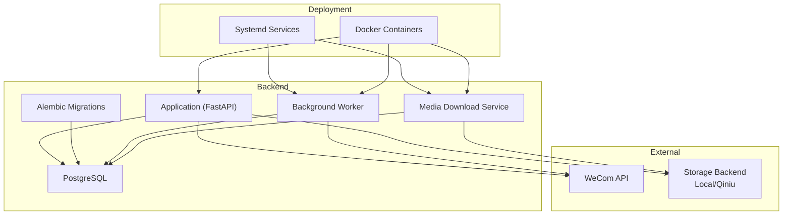
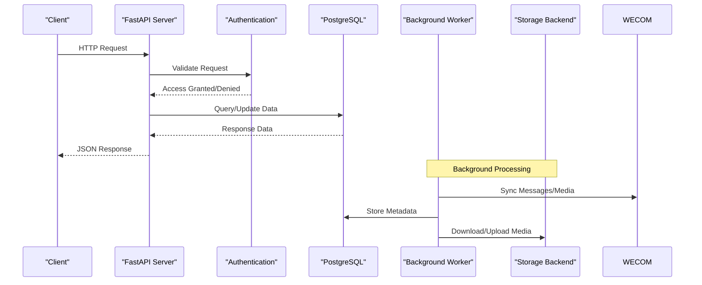

# Getting Started

<cite>
**Referenced Files in This Document**
- [README.md](file://README.md)
- [Makefile](file://Makefile)
- [backend/requirements.txt](file://backend/requirements.txt)
- [backend/app/main.py](file://backend/app/main.py)
- [backend/alembic.ini](file://backend/alembic.ini)
- [backend/alembic/env.py](file://backend/alembic/env.py)
- [backend/alembic/script.py.mako](file://backend/alembic/script.py.mako)
- [backend/app/db/base.py](file://backend/app/db/base.py)
- [backend/app/db/session.py](file://backend/app/db/session.py)
- [deploy/systemd/wecom-archive-worker.service](file://deploy/systemd/wecom-archive-worker.service)
- [deploy/systemd/wecom-archive-media-download.service](file://deploy/systemd/wecom-archive-media-download.service)
- [scripts/deploy_server.sh](file://scripts/deploy_server.sh)
- [ssl-renew/install.sh](file://ssl-renew/install.sh)
- [ssl-renew/renew.sh](file://ssl-renew/renew.sh)
- [ssl-renew/verify_https.sh](file://ssl-renew/verify_https.sh)
- [docs/DEPLOYMENT.md](file://docs/DEPLOYMENT.md)
- [docs/API.md](file://docs/API.md)
</cite>

## Table of Contents
1. [Introduction](#introduction)
2. [Prerequisites](#prerequisites)
3. [Project Structure](#project-structure)
4. [Core Components](#core-components)
5. [Architecture Overview](#architecture-overview)
6. [Installation and Setup](#installation-and-setup)
7. [Development Environment](#development-environment)
8. [Database Initialization with Alembic](#database-initialization-with-alembic)
9. [Basic Configuration](#basic-configuration)
10. [Local Deployment](#local-deployment)
11. [Production Deployment](#production-deployment)
12. [Verification Steps](#verification-steps)
13. [Troubleshooting Guide](#troubleshooting-guide)
14. [Conclusion](#conclusion)

## Introduction
WeCom Archive 365 is a backend application that integrates with WeCom (Enterprise WeChat) to archive conversations, media, and related metadata. It provides APIs, a web console, background workers for ingestion and media handling, and optional SSL renewal automation. This guide helps you set up the environment, install dependencies, initialize the database, configure the application, and deploy it locally or in production.

## Prerequisites
- Python 3.x compatible with the project’s requirements
- PostgreSQL server accessible from your host
- Docker and Docker Compose (optional, for containerized deployment)
- Systemd (optional, for service-based deployment on Linux)
- Git (for cloning the repository)
- Network access to WeCom APIs and any configured storage backends (e.g., local filesystem or Qiniu)

Ensure your system has the necessary packages installed and that PostgreSQL credentials are ready before proceeding.

## Project Structure
The repository is organized into logical directories:
- backend: Core application code, Alembic migrations, scripts, and tests
- deploy/systemd: Systemd unit files for worker and media download services
- scripts: Utility scripts including deployment helpers
- ssl-renew: Tools and scripts for SSL certificate management and verification
- docs: Documentation including architecture, API, and deployment guides



[No sources needed since this diagram shows conceptual workflow, not actual code structure]

## Core Components
- Application Server: FastAPI-based web server exposing REST endpoints and serving the web console
- Database Layer: SQLAlchemy models and session management with PostgreSQL
- Migration Tool: Alembic for schema versioning and updates
- Background Workers: Processes for syncing WeCom data and downloading media
- Media Storage: Pluggable storage backend supporting local filesystem and cloud providers like Qiniu
- SSL Renewal: Automated certificate management and HTTPS verification utilities

Key implementation points:
- The main application entry point initializes routers, middleware, and database connections
- Database sessions are managed through a centralized session factory
- Alembic configuration drives migration execution against the configured PostgreSQL instance
- Systemd units manage long-running worker processes and scheduled tasks

**Section sources**
- [backend/app/main.py](file://backend/app/main.py)
- [backend/app/db/base.py](file://backend/app/db/base.py)
- [backend/app/db/session.py](file://backend/app/db/session.py)
- [backend/alembic.ini](file://backend/alembic.ini)
- [backend/alembic/env.py](file://backend/alembic/env.py)

## Architecture Overview
The system follows a modular architecture with clear separation between the web API, background processing, and data persistence layers.



**Diagram sources**
- [backend/app/main.py](file://backend/app/main.py)
- [backend/app/db/session.py](file://backend/app/db/session.py)

## Installation and Setup
Follow these steps to install and configure WeCom Archive 365:

### Step 1: Clone the Repository
```bash
git clone <repository-url>
cd wecom-archive-365
```

### Step 2: Install Python Dependencies
Navigate to the backend directory and install required packages:
```bash
cd backend
pip install -r requirements.txt
```

### Step 3: Set Up PostgreSQL
Create a new database and user for the application:
```bash
sudo -u postgres createdb wecom_archive
sudo -u postgres createuser --interactive
sudo -u postgres psql -c "ALTER USER <username> WITH PASSWORD '<password>';"
sudo -u postgres psql -c "GRANT ALL PRIVILEGES ON DATABASE wecom_archive TO <username>;"
```

### Step 4: Configure Environment Variables
Create a configuration file or set environment variables for database connection and other settings.

### Step 5: Run Database Migrations
Initialize the database schema using Alembic:
```bash
cd backend
alembic upgrade head
```

### Step 6: Start the Application
Run the FastAPI server:
```bash
uvicorn app.main:app --host 0.0.0.0 --port 8000
```

**Section sources**
- [backend/requirements.txt](file://backend/requirements.txt)
- [backend/alembic.ini](file://backend/alembic.ini)
- [backend/app/main.py](file://backend/app/main.py)

## Development Environment
For development, ensure you have all necessary tools and configurations:

### Python Environment Setup
- Use a virtual environment to isolate dependencies
- Install development dependencies if available
- Configure logging levels for detailed debugging

### Database Setup
- Create separate development and test databases
- Use Alembic for schema management
- Seed initial data using provided scripts

### Local Development Workflow
- Run the application with auto-reload enabled
- Use database migration commands during development
- Test API endpoints using curl or Postman

**Section sources**
- [backend/requirements.txt](file://backend/requirements.txt)
- [backend/app/main.py](file://backend/app/main.py)

## Database Initialization with Alembic
Alembic manages database schema changes and ensures consistency across environments.

### Migration Commands
- Initialize migrations: `alembic init`
- Generate migration: `alembic revision --autogenerate -m "description"`
- Apply migrations: `alembic upgrade head`
- Rollback migrations: `alembic downgrade -1`
- Check current version: `alembic current`

### Configuration
The Alembic configuration file controls database connections and migration behavior.

### Custom Scripts
Additional scripts handle specific data operations and maintenance tasks.

**Section sources**
- [backend/alembic.ini](file://backend/alembic.ini)
- [backend/alembic/env.py](file://backend/alembic/env.py)
- [backend/alembic/script.py.mako](file://backend/alembic/script.py.mako)

## Basic Configuration
Configure the application by setting environment variables or creating a configuration file:

### Required Configuration
- Database connection string (PostgreSQL)
- WeCom API credentials (corp_id, corp_secret, agent_id)
- Storage backend settings (local path or cloud provider credentials)
- JWT secret keys for authentication
- Logging configuration

### Optional Configuration
- Cache settings
- Rate limiting parameters
- Feature flags
- Third-party service integrations

### Configuration Validation
The application validates configuration at startup and provides clear error messages for missing or invalid settings.

**Section sources**
- [backend/app/main.py](file://backend/app/main.py)

## Local Deployment
Deploy the application locally using different approaches:

### Using Docker
Build and run containers for the application and dependencies:
```bash
docker-compose build
docker-compose up
```

### Using Systemd Services
Install and configure systemd services for production-like deployment:
```bash
sudo cp deploy/systemd/*.service /etc/systemd/system/
sudo systemctl enable wecom-archive-worker
sudo systemctl start wecom-archive-worker
```

### Direct Execution
Run components directly for development and testing:
```bash
python -m uvicorn app.main:app --reload
python scripts/run_archive_worker_once.py
```

**Section sources**
- [deploy/systemd/wecom-archive-worker.service](file://deploy/systemd/wecom-archive-worker.service)
- [deploy/systemd/wecom-archive-media-download.service](file://deploy/systemd/wecom-archive-media-download.service)
- [scripts/deploy_server.sh](file://scripts/deploy_server.sh)

## Production Deployment
For production deployments, follow these best practices:

### Infrastructure Requirements
- Dedicated PostgreSQL server with proper backup configuration
- Load balancer for high availability
- Object storage for media files (Qiniu or compatible)
- Monitoring and logging infrastructure

### Security Considerations
- Use HTTPS with valid SSL certificates
- Implement proper authentication and authorization
- Configure firewall rules and network security
- Use secrets management for sensitive configuration

### Scaling Strategies
- Horizontal scaling of application servers
- Database read replicas for improved performance
- Message queues for background job processing
- CDN integration for static assets and media

### Monitoring and Maintenance
- Health check endpoints for load balancers
- Performance metrics collection
- Log aggregation and analysis
- Regular backup and disaster recovery procedures

**Section sources**
- [docs/DEPLOYMENT.md](file://docs/DEPLOYMENT.md)

## Verification Steps
Verify that the system is running correctly after installation:

### Health Check Endpoints
- `/health`: Basic health status
- `/ready`: Readiness probe for load balancers
- `/api/docs`: OpenAPI documentation interface

### Database Connectivity
- Verify database connection with Alembic: `alembic current`
- Check table creation and schema integrity
- Test basic CRUD operations through API endpoints

### API Functionality
- Test authentication endpoints
- Verify WeCom API connectivity
- Check media upload/download functionality
- Validate background worker status

### SSL Certificate Verification
Use the provided verification script to ensure SSL certificates are properly configured:
```bash
./ssl-renew/verify_https.sh
```

**Section sources**
- [ssl-renew/verify_https.sh](file://ssl-renew/verify_https.sh)
- [docs/API.md](file://docs/API.md)

## Troubleshooting Guide
Common issues and their solutions:

### Database Connection Issues
- Verify PostgreSQL service is running
- Check database credentials and permissions
- Ensure network connectivity to database server
- Review connection pool settings

### Migration Failures
- Check Alembic version alignment
- Review migration history and conflicts
- Backup database before rolling back migrations
- Examine migration logs for detailed error information

### WeCom API Integration Problems
- Validate API credentials and permissions
- Check network access to WeCom servers
- Review rate limiting and timeout configurations
- Monitor API response codes and error messages

### SSL Certificate Issues
- Verify certificate validity and expiration dates
- Check domain DNS configuration
- Ensure proper certificate chain installation
- Use verification scripts for troubleshooting

### Performance Issues
- Monitor database query performance
- Check memory usage and garbage collection
- Review background job queue lengths
- Analyze API response times and throughput

**Section sources**
- [backend/alembic/env.py](file://backend/alembic/env.py)
- [ssl-renew/renew.sh](file://ssl-renew/renew.sh)

## Conclusion
WeCom Archive 365 provides a comprehensive solution for archiving WeCom conversations and media. By following this getting started guide, you can successfully set up the development environment, configure the application, and deploy it for production use. The modular architecture and extensive documentation make it easy to customize and extend the system according to your specific needs.

For additional information, refer to the comprehensive documentation in the docs directory, particularly the architecture overview, API documentation, and deployment guides.