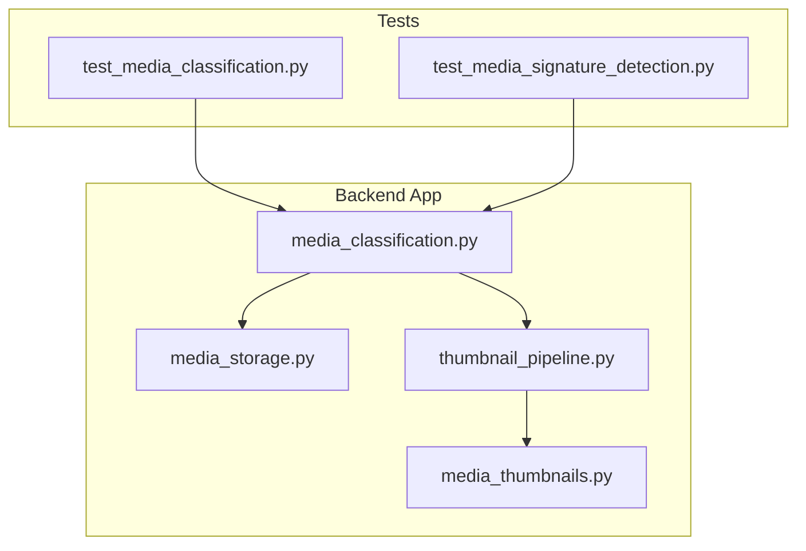
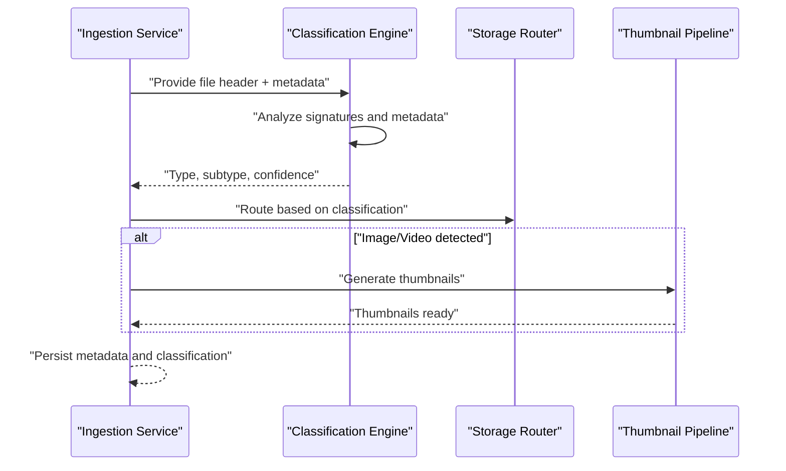
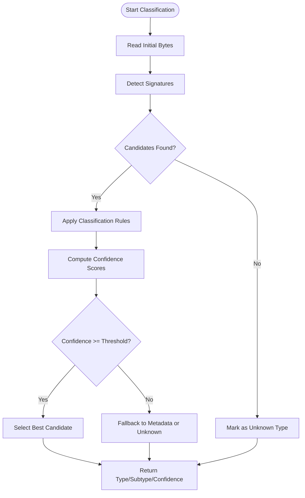
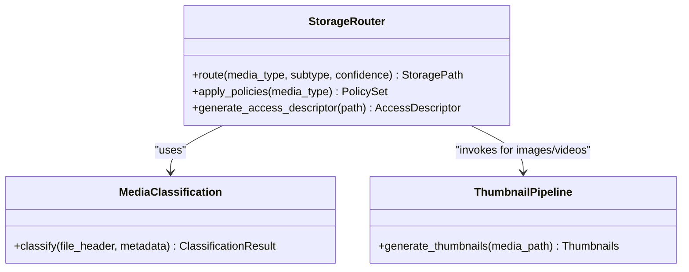
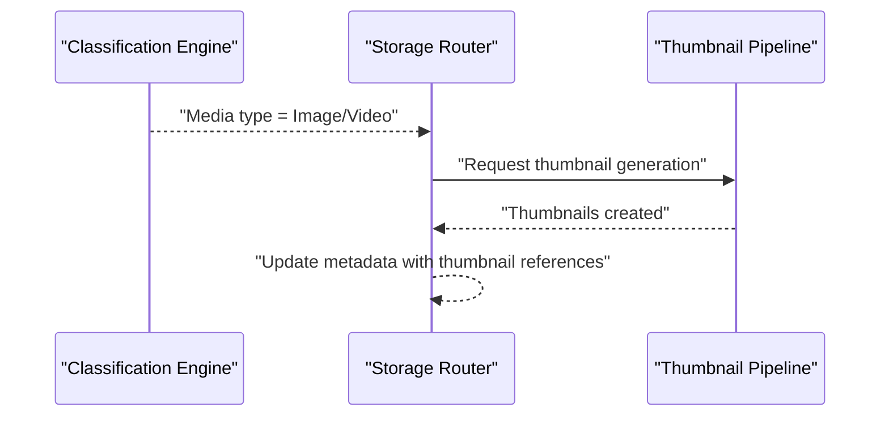
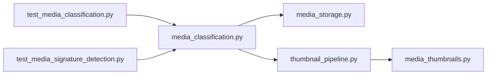

# Media Classification System

<cite>
**Referenced Files in This Document**
- [media_classification.py](file://backend/app/media_classification.py)
- [media_storage.py](file://backend/app/media_storage.py)
- [test_media_classification.py](file://backend/tests/test_media_classification.py)
- [test_media_signature_detection.py](file://backend/tests/test_media_signature_detection.py)
- [thumbnail_pipeline.py](file://backend/app/thumbnail_pipeline.py)
- [media_thumbnails.py](file://backend/app/media_thumbnails.py)
</cite>

## Table of Contents
1. [Introduction](#introduction)
2. [Project Structure](#project-structure)
3. [Core Components](#core-components)
4. [Architecture Overview](#architecture-overview)
5. [Detailed Component Analysis](#detailed-component-analysis)
6. [Dependency Analysis](#dependency-analysis)
7. [Performance Considerations](#performance-considerations)
8. [Troubleshooting Guide](#troubleshooting-guide)
9. [Conclusion](#conclusion)

## Introduction
This document explains the media classification system used to automatically classify uploaded media files by type (images, videos, documents, etc.). It covers how file signatures and metadata are analyzed to determine media types, supported formats, confidence scoring, custom rules, unknown type handling, integration with external services, and how classification influences storage routing. It also provides guidance for performance optimization during batch classification and caching strategies.

## Project Structure
The media classification functionality is implemented within the backend application module and exercised through dedicated tests. Key components include:
- A classification engine that inspects file headers/signatures and metadata to infer media type
- Integration points with storage routing to direct media to appropriate backends or paths based on classification
- Thumbnail pipeline interactions for image/video content
- Tests validating signature detection and classification behavior

**Diagram sources**
- [media_classification.py](file://backend/app/media_classification.py)
- [media_storage.py](file://backend/app/media_storage.py)
- [thumbnail_pipeline.py](file://backend/app/thumbnail_pipeline.py)
- [media_thumbnails.py](file://backend/app/media_thumbnails.py)
- [test_media_classification.py](file://backend/tests/test_media_classification.py)
- [test_media_signature_detection.py](file://backend/tests/test_media_signature_detection.py)

**Section sources**
- [media_classification.py](file://backend/app/media_classification.py)
- [media_storage.py](file://backend/app/media_storage.py)
- [thumbnail_pipeline.py](file://backend/app/thumbnail_pipeline.py)
- [media_thumbnails.py](file://backend/app/media_thumbnails.py)
- [test_media_classification.py](file://backend/tests/test_media_classification.py)
- [test_media_signature_detection.py](file://backend/tests/test_media_signature_detection.py)

## Core Components
- Classification Engine
  - Analyzes file signatures (magic bytes) and metadata to infer media type
  - Produces a structured classification result including type, subtype, and confidence score
  - Supports pluggable rules for custom classification logic
- Storage Routing
  - Uses classification results to decide where and how to store media (e.g., different backends or path schemes)
  - May adjust retention, access policies, or processing pipelines based on type
- Thumbnail Pipeline Integration
  - For images/videos, triggers thumbnail generation and metadata extraction
  - Coordinates with thumbnail service to produce previews and cached assets
- Test Suite
  - Validates signature detection accuracy across known formats
  - Exercises classification outcomes and edge cases (unknown types, corrupted headers)

**Section sources**
- [media_classification.py](file://backend/app/media_classification.py)
- [media_storage.py](file://backend/app/media_storage.py)
- [thumbnail_pipeline.py](file://backend/app/thumbnail_pipeline.py)
- [media_thumbnails.py](file://backend/app/media_thumbnails.py)
- [test_media_classification.py](file://backend/tests/test_media_classification.py)
- [test_media_signature_detection.py](file://backend/tests/test_media_signature_detection.py)

## Architecture Overview
The classification flow begins when a new media file is ingested. The system reads a small initial chunk to detect signatures, consults metadata if available, applies classification rules, and returns a confident type decision. Storage routing then uses this decision to persist the file appropriately. For visual media, thumbnails are generated and cached.

**Diagram sources**
- [media_classification.py](file://backend/app/media_classification.py)
- [media_storage.py](file://backend/app/media_storage.py)
- [thumbnail_pipeline.py](file://backend/app/thumbnail_pipeline.py)

## Detailed Component Analysis

### Classification Engine
Responsibilities:
- Signature-based detection using magic bytes from file headers
- Metadata-driven inference (e.g., MIME hints, container tags)
- Confidence scoring per candidate type
- Custom rule support for domain-specific classification needs
- Handling unknown or ambiguous files gracefully

Key behaviors:
- Reads a fixed-size initial buffer to inspect signatures
- Applies ordered rules to narrow candidates
- Computes confidence scores based on signature match strength and metadata consistency
- Returns a normalized type/subtype pair suitable for downstream routing

**Diagram sources**
- [media_classification.py](file://backend/app/media_classification.py)

**Section sources**
- [media_classification.py](file://backend/app/media_classification.py)
- [test_media_classification.py](file://backend/tests/test_media_classification.py)
- [test_media_signature_detection.py](file://backend/tests/test_media_signature_detection.py)

### Storage Routing
Responsibilities:
- Decide storage backend/path based on classification outcome
- Enforce tenant scoping and retention policies
- Integrate with cloud storage providers (e.g., Qiniu) and local storage
- Ensure consistent URL generation and access control

Routing logic highlights:
- Images/videos may be routed to optimized storage tiers
- Documents may be stored with different retention or indexing settings
- Unknown types may be placed in a quarantine or review bucket

**Diagram sources**
- [media_storage.py](file://backend/app/media_storage.py)
- [media_classification.py](file://backend/app/media_classification.py)
- [thumbnail_pipeline.py](file://backend/app/thumbnail_pipeline.py)

**Section sources**
- [media_storage.py](file://backend/app/media_storage.py)
- [media_classification.py](file://backend/app/media_classification.py)

### Thumbnail Pipeline Integration
Responsibilities:
- Generate thumbnails for images and videos
- Cache thumbnails for fast retrieval
- Coordinate with classification to avoid unnecessary processing for non-visual types

Integration points:
- Triggered after successful classification for image/video types
- Uses classification metadata (dimensions, duration) to optimize processing
- Stores thumbnails alongside original media or in a separate cache layer

**Diagram sources**
- [thumbnail_pipeline.py](file://backend/app/thumbnail_pipeline.py)
- [media_thumbnails.py](file://backend/app/media_thumbnails.py)
- [media_storage.py](file://backend/app/media_storage.py)

**Section sources**
- [thumbnail_pipeline.py](file://backend/app/thumbnail_pipeline.py)
- [media_thumbnails.py](file://backend/app/media_thumbnails.py)
- [media_storage.py](file://backend/app/media_storage.py)

### Supported File Formats and Confidence Scoring
Supported formats:
- Images: common raster formats recognized via signature bytes
- Videos: standard containers identified by header markers
- Documents: office and PDF-like formats inferred from signatures and metadata

Confidence scoring:
- Based on signature match strength (exact vs partial)
- Adjusted by metadata consistency (MIME hints, container tags)
- Lower confidence leads to fallback strategies or manual review

Custom classification rules:
- Extendable rules to handle proprietary or domain-specific formats
- Rule priority ensures deterministic outcomes
- Rules can override default behavior for specific tenants or contexts

Unknown file types:
- Marked explicitly to prevent misclassification
- Can be routed to quarantine or review workflows
- Allow reprocessing when new rules are added

External classification services:
- Optional integration point for advanced AI-based classification
- Fallback mechanism if local detection fails
- Caching of external results to reduce latency and cost

**Section sources**
- [media_classification.py](file://backend/app/media_classification.py)
- [test_media_signature_detection.py](file://backend/tests/test_media_signature_detection.py)

## Dependency Analysis
The classification system depends on storage routing and thumbnail pipeline modules. Tests validate core behaviors and signature detection accuracy.

**Diagram sources**
- [media_classification.py](file://backend/app/media_classification.py)
- [media_storage.py](file://backend/app/media_storage.py)
- [thumbnail_pipeline.py](file://backend/app/thumbnail_pipeline.py)
- [media_thumbnails.py](file://backend/app/media_thumbnails.py)
- [test_media_classification.py](file://backend/tests/test_media_classification.py)
- [test_media_signature_detection.py](file://backend/tests/test_media_signature_detection.py)

**Section sources**
- [media_classification.py](file://backend/app/media_classification.py)
- [media_storage.py](file://backend/app/media_storage.py)
- [thumbnail_pipeline.py](file://backend/app/thumbnail_pipeline.py)
- [media_thumbnails.py](file://backend/app/media_thumbnails.py)
- [test_media_classification.py](file://backend/tests/test_media_classification.py)
- [test_media_signature_detection.py](file://backend/tests/test_media_signature_detection.py)

## Performance Considerations
Batch classification optimizations:
- Process multiple files concurrently using worker pools
- Reuse signature lookup tables and metadata parsers
- Defer heavy metadata parsing until necessary

Caching strategies:
- Cache classification results keyed by file hash and version
- Cache thumbnail outputs to avoid regeneration
- Use in-memory caches for hot paths and persistent caches for long-term reuse

Memory and I/O:
- Limit initial buffer size for signature inspection
- Stream large files where possible to avoid full loads
- Batch database updates for classification metadata

[No sources needed since this section provides general guidance]

## Troubleshooting Guide
Common issues and resolutions:
- Misclassification due to corrupted headers: Validate file integrity and consider re-uploading
- Low confidence scores: Review classification rules and metadata quality
- Unknown types: Update signature tables or add custom rules
- Thumbnail generation failures: Check codec support and file compatibility
- Storage routing errors: Verify backend configuration and permissions

Debugging steps:
- Inspect classification logs for signature matches and rule applications
- Validate metadata fields used for inference
- Test custom rules against sample files
- Monitor external service integrations for timeouts or errors

**Section sources**
- [test_media_classification.py](file://backend/tests/test_media_classification.py)
- [test_media_signature_detection.py](file://backend/tests/test_media_signature_detection.py)

## Conclusion
The media classification system provides robust, extensible, and efficient classification of uploaded media files using file signatures and metadata analysis. It integrates seamlessly with storage routing and thumbnail pipelines, supports custom rules and external services, and includes comprehensive testing to ensure reliability. By following the outlined best practices and troubleshooting steps, teams can maintain high accuracy and performance while scaling to diverse media types and volumes.

[No sources needed since this section summarizes without analyzing specific files]