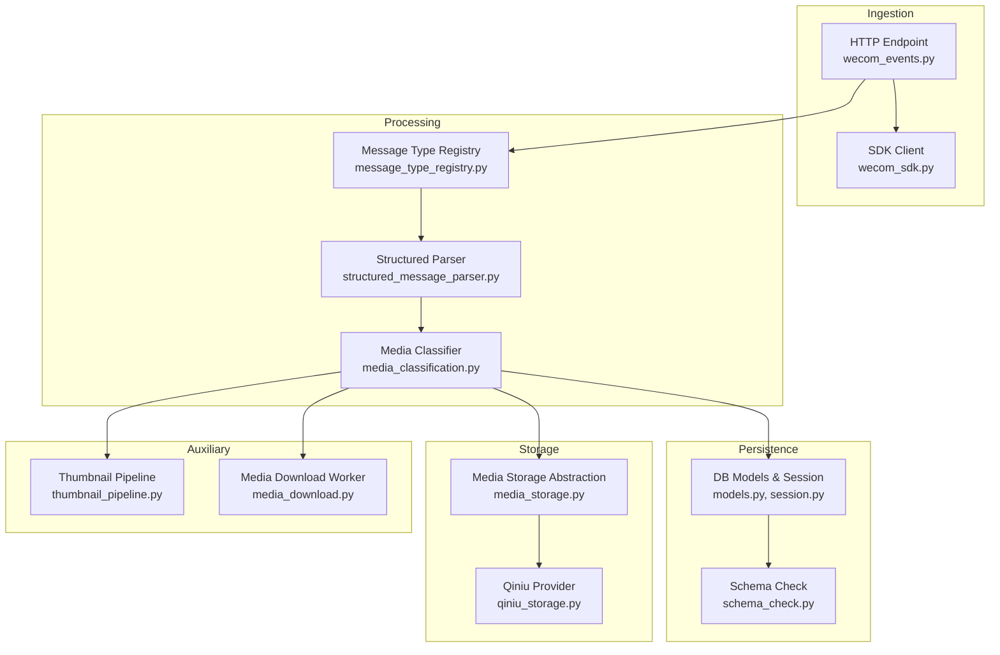
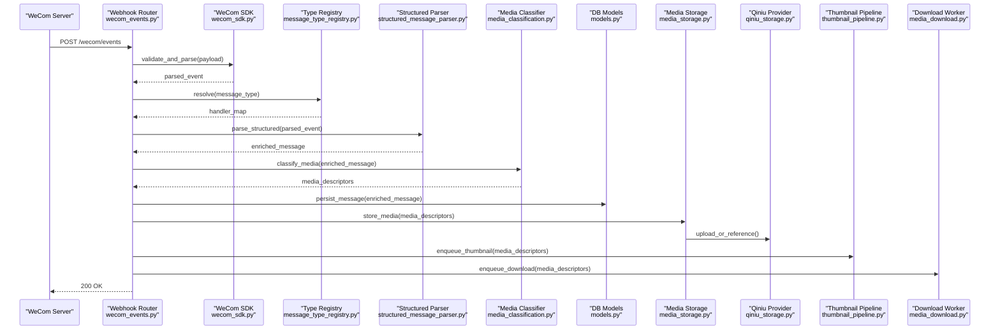
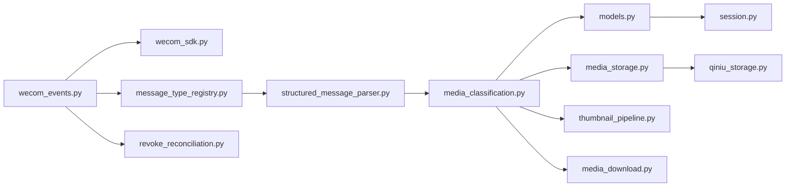

# Message Processing Pipeline

<cite>
**Referenced Files in This Document**
- [main.py](file://backend/app/main.py)
- [wecom_events.py](file://backend/app/routers/wecom_events.py)
- [message_type_registry.py](file://backend/app/message_type_registry.py)
- [structured_message_parser.py](file://backend/app/structured_message_parser.py)
- [media_classification.py](file://backend/app/media_classification.py)
- [revoke_reconciliation.py](file://backend/app/revoke_reconciliation.py)
- [models.py](file://backend/app/db/models.py)
- [schema_check.py](file://backend/app/db/schema_check.py)
- [session.py](file://backend/app/db/session.py)
- [thumbnail_pipeline.py](file://backend/app/thumbnail_pipeline.py)
- [media_download.py](file://backend/app/media_download.py)
- [media_storage.py](file://backend/app/media_storage.py)
- [qiniu_storage.py](file://backend/app/qiniu_storage.py)
- [wecom_sdk.py](file://backend/app/sdk/wecom_sdk.py)
- [ARCHITECTURE.md](file://docs/ARCHITECTURE.md)
- [DATA_MODEL.md](file://docs/DATA_MODEL.md)
</cite>

## Table of Contents
1. [Introduction](#introduction)
2. [Project Structure](#project-structure)
3. [Core Components](#core-components)
4. [Architecture Overview](#architecture-overview)
5. [Detailed Component Analysis](#detailed-component-analysis)
6. [Dependency Analysis](#dependency-analysis)
7. [Performance Considerations](#performance-considerations)
8. [Troubleshooting Guide](#troubleshooting-guide)
9. [Conclusion](#conclusion)

## Introduction
This document explains the message processing pipeline that ingests WeCom messages, parses and classifies them, enriches metadata, persists structured content, and reconciles revocations. It covers the message type registry, rich content parsing, media classification, storage backends, thumbnail generation, and error handling with retry and dead-letter patterns. It also provides guidance on performance optimization, batch processing, and concurrency control.

## Project Structure
The pipeline spans HTTP ingestion, parsing, classification, persistence, and auxiliary pipelines for thumbnails and media downloads. Key modules:
- Ingestion: WeCom webhook endpoint and event routing
- Parsing: Message type registry and structured parser
- Classification: Media type detection and enrichment
- Storage: Database models and migrations, plus media storage backends
- Reconciliation: Revocation handling and timeline consistency
- Auxiliary: Thumbnail pipeline and download worker integration

**Diagram sources**
- [wecom_events.py](file://backend/app/routers/wecom_events.py)
- [wecom_sdk.py](file://backend/app/sdk/wecom_sdk.py)
- [message_type_registry.py](file://backend/app/message_type_registry.py)
- [structured_message_parser.py](file://backend/app/structured_message_parser.py)
- [media_classification.py](file://backend/app/media_classification.py)
- [models.py](file://backend/app/db/models.py)
- [session.py](file://backend/app/db/session.py)
- [schema_check.py](file://backend/app/db/schema_check.py)
- [media_storage.py](file://backend/app/media_storage.py)
- [qiniu_storage.py](file://backend/app/qiniu_storage.py)
- [thumbnail_pipeline.py](file://backend/app/thumbnail_pipeline.py)
- [media_download.py](file://backend/app/media_download.py)

**Section sources**
- [ARCHITECTURE.md](file://docs/ARCHITECTURE.md)
- [DATA_MODEL.md](file://docs/DATA_MODEL.md)

## Core Components
- WeCom Webhook Router: Receives events, validates signatures, and dispatches to handlers.
- Message Type Registry: Centralized mapping from WeCom message types to parsers and classifiers.
- Structured Message Parser: Decrypts and extracts rich content (text, images, links, cards, etc.).
- Media Classifier: Detects media types, sets MIME, and prepares storage descriptors.
- Persistence Layer: SQLAlchemy models and sessions; schema validation ensures compatibility.
- Storage Backends: Abstracted media storage with Qiniu provider implementation.
- Thumbnail Pipeline: Generates thumbnails asynchronously for supported media.
- Media Download Worker: Fetches remote media and persists references.
- Revoke Reconciliation: Tracks deletions and updates to maintain timeline integrity.

**Section sources**
- [wecom_events.py](file://backend/app/routers/wecom_events.py)
- [message_type_registry.py](file://backend/app/message_type_registry.py)
- [structured_message_parser.py](file://backend/app/structured_message_parser.py)
- [media_classification.py](file://backend/app/media_classification.py)
- [models.py](file://backend/app/db/models.py)
- [session.py](file://backend/app/db/session.py)
- [schema_check.py](file://backend/app/db/schema_check.py)
- [media_storage.py](file://backend/app/media_storage.py)
- [qiniu_storage.py](file://backend/app/qiniu_storage.py)
- [thumbnail_pipeline.py](file://backend/app/thumbnail_pipeline.py)
- [media_download.py](file://backend/app/media_download.py)
- [revoke_reconciliation.py](file://backend/app/revoke_reconciliation.py)

## Architecture Overview
The pipeline follows a clear sequence:
1. Ingest via WeCom webhook endpoint.
2. Validate and parse payload using SDK utilities.
3. Classify message type via registry.
4. Parse structured content and extract entities.
5. Classify media and prepare storage descriptors.
6. Persist messages and associated metadata to DB.
7. Enqueue thumbnail generation and media downloads as needed.
8. Reconcile revocations to keep timelines consistent.

**Diagram sources**
- [wecom_events.py](file://backend/app/routers/wecom_events.py)
- [wecom_sdk.py](file://backend/app/sdk/wecom_sdk.py)
- [message_type_registry.py](file://backend/app/message_type_registry.py)
- [structured_message_parser.py](file://backend/app/structured_message_parser.py)
- [media_classification.py](file://backend/app/media_classification.py)
- [models.py](file://backend/app/db/models.py)
- [media_storage.py](file://backend/app/media_storage.py)
- [qiniu_storage.py](file://backend/app/qiniu_storage.py)
- [thumbnail_pipeline.py](file://backend/app/thumbnail_pipeline.py)
- [media_download.py](file://backend/app/media_download.py)

## Detailed Component Analysis

### WeCom Webhook Router
Responsibilities:
- Accepts webhook requests and validates signatures.
- Dispatches events based on message type.
- Orchestrates parsing, classification, and persistence.
- Returns appropriate HTTP responses and logs errors.

Key behaviors:
- Validates request signature and tenant context.
- Routes to specific handlers per message type.
- Invokes structured parser and media classifier.
- Persists results and enqueues downstream tasks.

Error handling:
- Logs malformed payloads and signature failures.
- Returns 4xx for invalid requests and 5xx for server errors.
- Delegates transient failures to retry mechanisms downstream.

**Section sources**
- [wecom_events.py](file://backend/app/routers/wecom_events.py)

### Message Type Registry
Responsibilities:
- Maintains a registry mapping WeCom message types to handlers.
- Supports registration of new message formats.
- Provides lookup and fallback behavior for unknown types.

Design patterns:
- Registry pattern with explicit registration functions.
- Extensible by adding new type-to-handler mappings.
- Centralizes type-specific logic for clarity and testability.

Extensibility:
- Add new message types by registering handlers.
- Provide default parsers for unsupported or legacy types.

**Section sources**
- [message_type_registry.py](file://backend/app/message_type_registry.py)

### Structured Message Parser
Responsibilities:
- Decrypts encrypted fields when present.
- Extracts text, attachments, links, and card data.
- Normalizes content into a unified structure.
- Handles nested structures and edge cases.

Parsing flow:
- Input raw event payload.
- Decrypt sensitive fields if required.
- Map fields to canonical message model.
- Attach metadata such as timestamps and sender info.

Error handling:
- Gracefully handles missing fields and malformed JSON.
- Returns partial results where possible.
- Logs decryption and parsing failures.

**Section sources**
- [structured_message_parser.py](file://backend/app/structured_message_parser.py)

### Media Classification Logic
Responsibilities:
- Detects media types from content and URLs.
- Determines MIME types and file extensions.
- Produces storage descriptors for persistence.
- Flags media requiring thumbnail generation.

Classification rules:
- URL-based heuristics for image/video/audio.
- Content sniffing for binary blobs.
- Fallback to generic binary type when uncertain.

Enrichment:
- Adds size hints and format metadata.
- Prepares access descriptors for storage backends.

**Section sources**
- [media_classification.py](file://backend/app/media_classification.py)

### Persistence Layer
Responsibilities:
- Defines database models for messages, media, and revocations.
- Manages sessions and transactions.
- Ensures schema compatibility via checks.

Data model highlights:
- Message entities with structured content.
- Media records referencing storage backends.
- Revocation associations linking to original messages.

Integrity:
- Schema checks prevent runtime mismatches.
- Foreign keys enforce referential integrity.

**Section sources**
- [models.py](file://backend/app/db/models.py)
- [session.py](file://backend/app/db/session.py)
- [schema_check.py](file://backend/app/db/schema_check.py)

### Storage Backends
Responsibilities:
- Abstracts media storage operations.
- Implements providers like Qiniu.
- Generates signed URLs and manages access policies.

Abstraction design:
- Common interface for upload, download, and delete.
- Provider-specific implementations encapsulate vendor details.
- Descriptors carry backend-specific metadata.

**Section sources**
- [media_storage.py](file://backend/app/media_storage.py)
- [qiniu_storage.py](file://backend/app/qiniu_storage.py)

### Thumbnail Pipeline
Responsibilities:
- Generates thumbnails for supported media types.
- Runs asynchronously to avoid blocking ingestion.
- Stores thumbnails alongside original media.

Workflow:
- Enqueue thumbnail task after media classification.
- Process jobs with concurrency limits.
- Persist thumbnail references to DB.

**Section sources**
- [thumbnail_pipeline.py](file://backend/app/thumbnail_pipeline.py)

### Media Download Worker
Responsibilities:
- Downloads external media referenced in messages.
- Persists media files and updates descriptors.
- Retries failed downloads with backoff.

Worker behavior:
- Consumes download tasks from queue.
- Validates content and stores via media storage abstraction.
- Updates message media references upon success.

**Section sources**
- [media_download.py](file://backend/app/media_download.py)

### Revoke Reconciliation
Responsibilities:
- Processes revoke events to mark messages deleted or updated.
- Maintains timeline consistency across tenants.
- Supports backfills and integrity checks.

Reconciliation process:
- Identify revoked messages by IDs.
- Update status and associate revocation records.
- Ensure idempotency and rollback safety.

**Section sources**
- [revoke_reconciliation.py](file://backend/app/revoke_reconciliation.py)

## Dependency Analysis
The pipeline exhibits clear layering and separation of concerns:
- HTTP layer depends on SDK and router logic.
- Parser and classifier depend on registry and shared utilities.
- Persistence depends on models and sessions.
- Storage abstraction decouples providers.
- Auxiliary pipelines are decoupled via queues.

**Diagram sources**
- [wecom_events.py](file://backend/app/routers/wecom_events.py)
- [wecom_sdk.py](file://backend/app/sdk/wecom_sdk.py)
- [message_type_registry.py](file://backend/app/message_type_registry.py)
- [structured_message_parser.py](file://backend/app/structured_message_parser.py)
- [media_classification.py](file://backend/app/media_classification.py)
- [models.py](file://backend/app/db/models.py)
- [session.py](file://backend/app/db/session.py)
- [media_storage.py](file://backend/app/media_storage.py)
- [qiniu_storage.py](file://backend/app/qiniu_storage.py)
- [thumbnail_pipeline.py](file://backend/app/thumbnail_pipeline.py)
- [media_download.py](file://backend/app/media_download.py)
- [revoke_reconciliation.py](file://backend/app/revoke_reconciliation.py)

**Section sources**
- [ARCHITECTURE.md](file://docs/ARCHITECTURE.md)
- [DATA_MODEL.md](file://docs/DATA_MODEL.md)

## Performance Considerations
- Concurrency control: Limit parallelism in thumbnail generation and media downloads to avoid resource exhaustion.
- Batch processing: Group message persistence and media uploads where feasible to reduce overhead.
- Idempotency: Ensure retries do not duplicate records; use unique constraints and upsert semantics.
- Caching: Cache frequently accessed descriptors and configuration to reduce latency.
- Backpressure: Use queues with bounded sizes to handle spikes gracefully.
- Connection pooling: Pool DB and HTTP connections for throughput.
- Lazy loading: Defer heavy operations like decryption until necessary.

[No sources needed since this section provides general guidance]

## Troubleshooting Guide
Common issues and resolutions:
- Signature validation failures: Verify webhook secret and timestamp tolerance.
- Decryption errors: Check key availability and payload integrity.
- Unknown message types: Register handlers or add fallback parsers.
- Media upload failures: Inspect provider credentials and network connectivity.
- Thumbnail generation timeouts: Adjust concurrency and timeout settings.
- Revocation inconsistencies: Run reconciliation scripts and verify foreign key integrity.

Operational tips:
- Enable detailed logging for ingestion and storage layers.
- Monitor queue depths and worker health.
- Periodically run schema checks and integrity validations.

**Section sources**
- [wecom_events.py](file://backend/app/routers/wecom_events.py)
- [structured_message_parser.py](file://backend/app/structured_message_parser.py)
- [media_classification.py](file://backend/app/media_classification.py)
- [media_storage.py](file://backend/app/media_storage.py)
- [qiniu_storage.py](file://backend/app/qiniu_storage.py)
- [thumbnail_pipeline.py](file://backend/app/thumbnail_pipeline.py)
- [media_download.py](file://backend/app/media_download.py)
- [revoke_reconciliation.py](file://backend/app/revoke_reconciliation.py)
- [schema_check.py](file://backend/app/db/schema_check.py)

## Conclusion
The message processing pipeline provides a robust, extensible framework for ingesting, parsing, classifying, and storing WeCom messages. The registry-driven architecture supports new message types seamlessly, while the storage abstraction enables flexible backends. Auxiliary pipelines handle thumbnails and downloads efficiently. With careful attention to concurrency, batching, and idempotency, the system scales reliably under load. Revoke reconciliation ensures timeline accuracy, and comprehensive error handling improves resilience.

[No sources needed since this section summarizes without analyzing specific files]