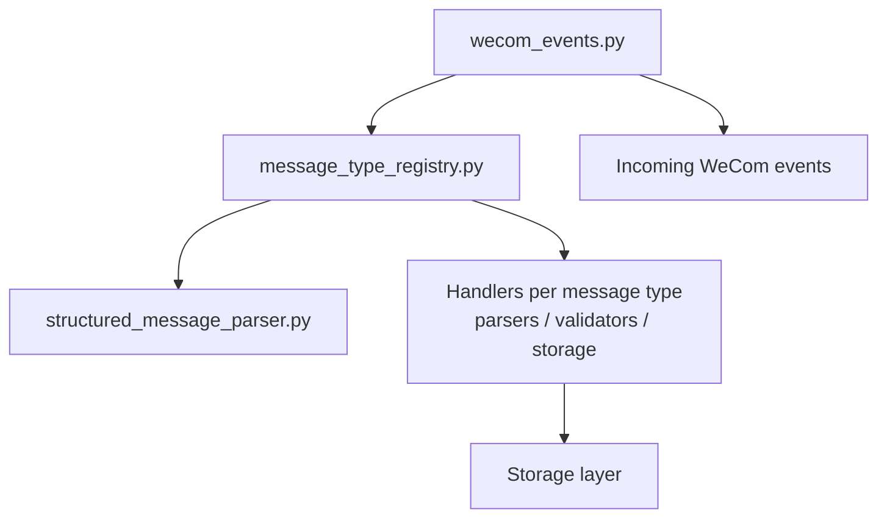
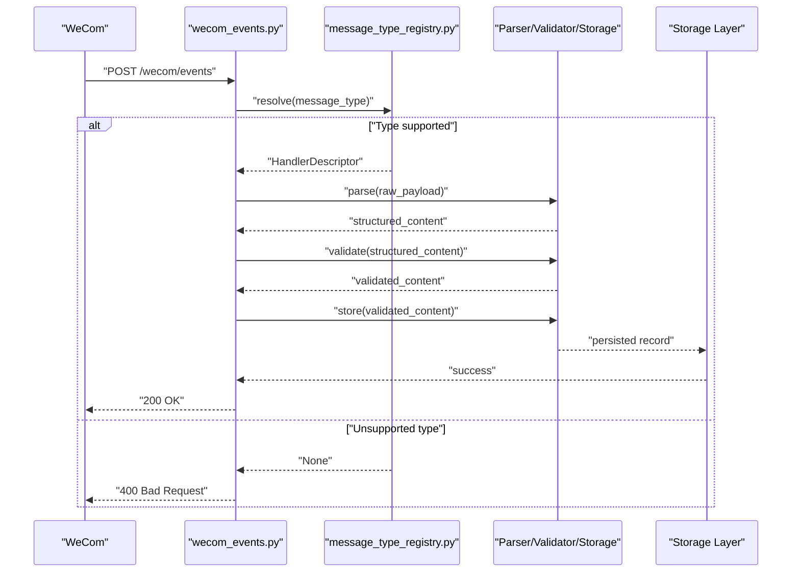
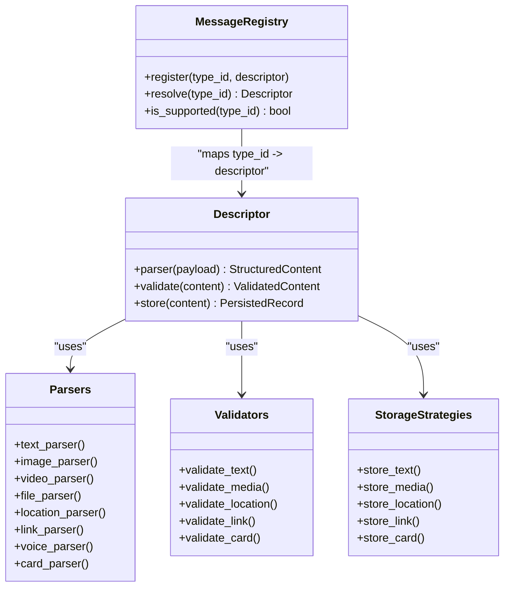
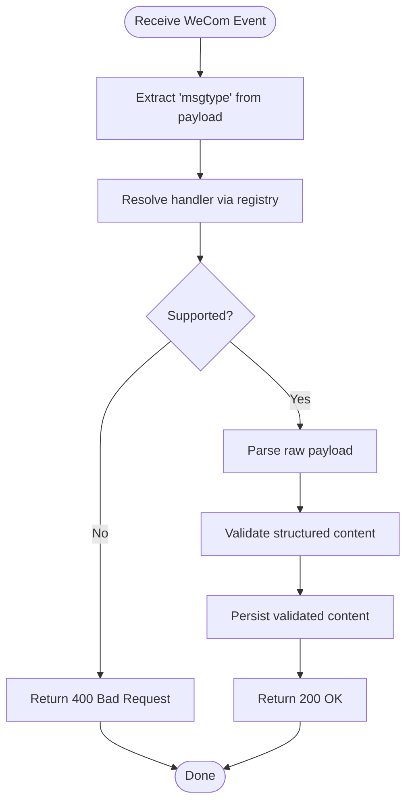
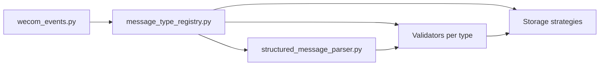

# Message Type Registry

<cite>
**Referenced Files in This Document**
- [message_type_registry.py](file://backend/app/message_type_registry.py)
- [structured_message_parser.py](file://backend/app/structured_message_parser.py)
- [wecom_events.py](file://backend/app/routers/wecom_events.py)
- [test_message_type_registry.py](file://backend/tests/test_message_type_registry.py)
- [test_message_type_registry_core.py](file://backend/tests/test_message_type_registry_core.py)
</cite>

## Table of Contents
1. [Introduction](#introduction)
2. [Project Structure](#project-structure)
3. [Core Components](#core-components)
4. [Architecture Overview](#architecture-overview)
5. [Detailed Component Analysis](#detailed-component-analysis)
6. [Dependency Analysis](#dependency-analysis)
7. [Performance Considerations](#performance-considerations)
8. [Troubleshooting Guide](#troubleshooting-guide)
9. [Conclusion](#conclusion)
10. [Appendices](#appendices)

## Introduction
This document explains the message type registry system that manages WeCom message types, their handlers, and processing logic. It covers how new message types are registered, how type validation and handler resolution work, and how parsers, validators, and storage strategies relate to each message type. It also provides guidance on extending the system with custom formats while maintaining backward compatibility.

## Project Structure
The message type registry is implemented as a centralized module that:
- Declares supported message types and their metadata
- Registers handlers for parsing, validating, and storing messages
- Provides lookup utilities to resolve the correct handler by message type
- Integrates with the WeCom event router to process incoming messages

**Diagram sources**
- [wecom_events.py](file://backend/app/routers/wecom_events.py)
- [message_type_registry.py](file://backend/app/message_type_registry.py)
- [structured_message_parser.py](file://backend/app/structured_message_parser.py)

**Section sources**
- [message_type_registry.py](file://backend/app/message_type_registry.py)
- [wecom_events.py](file://backend/app/routers/wecom_events.py)
- [structured_message_parser.py](file://backend/app/structured_message_parser.py)

## Core Components
- Message Type Registry: Central registry that maps message type identifiers to handler descriptors. Each descriptor includes references to:
  - Parser: Converts raw payload into structured content
  - Validator: Ensures structural and semantic correctness
  - Storage strategy: Persists normalized data consistently
- Handler Resolution: Resolves the appropriate parser/validator/storage tuple based on the message type string.
- Integration Point: The WeCom event router delegates message processing to the registry, which then invokes the corresponding handler pipeline.

Key responsibilities:
- Registration API for adding new message types
- Validation of message type strings against known types
- Safe fallback behavior for unsupported or unknown types
- Consistent error handling across the pipeline

**Section sources**
- [message_type_registry.py](file://backend/app/message_type_registry.py)
- [wecom_events.py](file://backend/app/routers/wecom_events.py)

## Architecture Overview
The registry sits between the HTTP event ingestion and the domain-specific processing logic. Incoming WeCom events are routed to a handler that uses the registry to find the correct parser/validator/storage chain. If a message type is not recognized, the system returns a controlled error without crashing.

**Diagram sources**
- [wecom_events.py](file://backend/app/routers/wecom_events.py)
- [message_type_registry.py](file://backend/app/message_type_registry.py)

## Detailed Component Analysis

### Message Type Registry
The registry maintains a mapping from message type identifiers to handler descriptors. Each descriptor encapsulates:
- Parser function: Transforms raw payloads into typed structures
- Validator function: Enforces schema and business rules
- Storage function: Persists validated content using tenant-aware strategies

Registration mechanism:
- Provide a unique message type identifier (string)
- Attach parser, validator, and storage functions
- Optionally include metadata such as display name or versioning hints

Lookup and validation:
- Given a message type string, return the associated descriptor if present
- Return a clear indication when the type is unknown or unsupported

Error handling:
- Unsupported types result in a controlled error path
- Exceptions within parsers/validators are propagated up to the router for consistent response formatting

Extensibility:
- New message types can be added without modifying core routing logic
- Backward compatibility is maintained by preserving existing mappings and avoiding breaking changes to descriptor interfaces

**Diagram sources**
- [message_type_registry.py](file://backend/app/message_type_registry.py)
- [structured_message_parser.py](file://backend/app/structured_message_parser.py)

**Section sources**
- [message_type_registry.py](file://backend/app/message_type_registry.py)
- [structured_message_parser.py](file://backend/app/structured_message_parser.py)

### WeCom Event Router Integration
The router receives incoming WeCom events and delegates processing to the registry:
- Extracts the message type from the request payload
- Uses the registry to resolve the handler descriptor
- Invokes the parser/validator/storage pipeline
- Returns standardized responses for success and failure cases

Unsupported format handling:
- If the message type is not found, the router responds with an appropriate error code
- Logging and metrics should capture unsupported types for observability

**Diagram sources**
- [wecom_events.py](file://backend/app/routers/wecom_events.py)
- [message_type_registry.py](file://backend/app/message_type_registry.py)

**Section sources**
- [wecom_events.py](file://backend/app/routers/wecom_events.py)

### Structured Message Parser
The parser module provides type-specific parsing functions:
- Text: Extracts plain text content and metadata
- Media (image/video/file): Handles binary payloads and media metadata
- Location: Parses geographic coordinates and place details
- Link: Validates URLs and extracts link previews
- Voice: Processes audio payloads and duration metadata
- Card: Renders rich card content and interactive elements

Parsing best practices:
- Normalize field names across different WeCom versions
- Handle missing fields gracefully with defaults
- Preserve original payload for audit purposes

**Section sources**
- [structured_message_parser.py](file://backend/app/structured_message_parser.py)

### Tests and Validation
Tests ensure registry behavior and integration points are stable:
- Unit tests for registration and resolution
- Edge case coverage for unsupported types
- Integration tests verifying end-to-end processing flows

Key test files:
- Core registry functionality
- Router integration scenarios

**Section sources**
- [test_message_type_registry.py](file://backend/tests/test_message_type_registry.py)
- [test_message_type_registry_core.py](file://backend/tests/test_message_type_registry_core.py)

## Dependency Analysis
The registry depends on:
- Parser implementations for each message type
- Validator functions enforcing schema constraints
- Storage strategies for persistence

The router depends on:
- Registry for handler resolution
- Parser/validator/storage pipeline for processing

**Diagram sources**
- [wecom_events.py](file://backend/app/routers/wecom_events.py)
- [message_type_registry.py](file://backend/app/message_type_registry.py)
- [structured_message_parser.py](file://backend/app/structured_message_parser.py)

**Section sources**
- [wecom_events.py](file://backend/app/routers/wecom_events.py)
- [message_type_registry.py](file://backend/app/message_type_registry.py)
- [structured_message_parser.py](file://backend/app/structured_message_parser.py)

## Performance Considerations
- Registry lookups should be O(1) using hash maps for fast resolution
- Parsing and validation should avoid unnecessary object creation
- Storage operations should batch where possible to reduce I/O overhead
- Consider caching frequently used descriptors for high-throughput scenarios

[No sources needed since this section provides general guidance]

## Troubleshooting Guide
Common issues and resolutions:
- Unsupported message type: Verify the type string matches registered identifiers; check router logging for exact values received
- Parser failures: Inspect raw payload structure; ensure parser handles all expected fields and edge cases
- Validation errors: Review validator rules; update schemas if WeCom introduces new fields
- Storage failures: Check database connectivity and permissions; verify tenant scoping

Diagnostic steps:
- Enable detailed logging for message type resolution
- Add metrics for unsupported types and processing latency
- Use test suites to validate new message type implementations

**Section sources**
- [wecom_events.py](file://backend/app/routers/wecom_events.py)
- [message_type_registry.py](file://backend/app/message_type_registry.py)

## Conclusion
The message type registry provides a robust, extensible foundation for handling diverse WeCom message formats. By centralizing registration, validation, and storage logic, it enables easy addition of new message types while maintaining system stability and backward compatibility. Proper testing and monitoring ensure reliable operation in production environments.

[No sources needed since this section summarizes without analyzing specific files]

## Appendices

### Registering a New Message Type
Steps to add support for a new message type:
1. Define parser function to convert raw payload to structured content
2. Implement validator function to enforce schema and business rules
3. Create storage strategy to persist the validated content
4. Register the new type with the registry using a unique identifier
5. Update tests to cover the new message type

Example reference paths:
- [message_type_registry.py](file://backend/app/message_type_registry.py)
- [structured_message_parser.py](file://backend/app/structured_message_parser.py)

### Handling Unsupported Formats
When encountering unsupported message types:
- Log the unexpected type for analysis
- Return appropriate HTTP status codes
- Avoid crashing the service
- Consider graceful degradation strategies

Reference paths:
- [wecom_events.py](file://backend/app/routers/wecom_events.py)
- [message_type_registry.py](file://backend/app/message_type_registry.py)

### Maintaining Backward Compatibility
Guidelines for evolving the registry:
- Never remove existing message type registrations
- Add new fields with default values
- Version parsers and validators when breaking changes are necessary
- Test thoroughly against historical message samples

Reference paths:
- [message_type_registry.py](file://backend/app/message_type_registry.py)
- [structured_message_parser.py](file://backend/app/structured_message_parser.py)