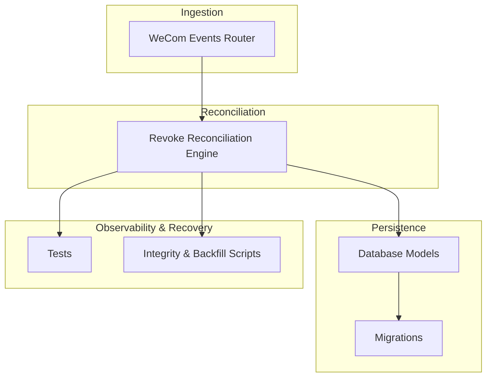
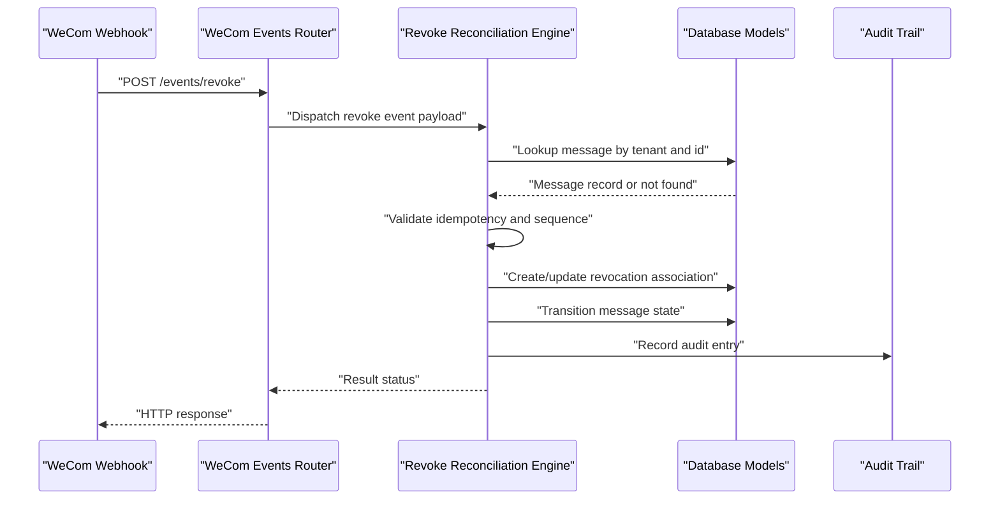
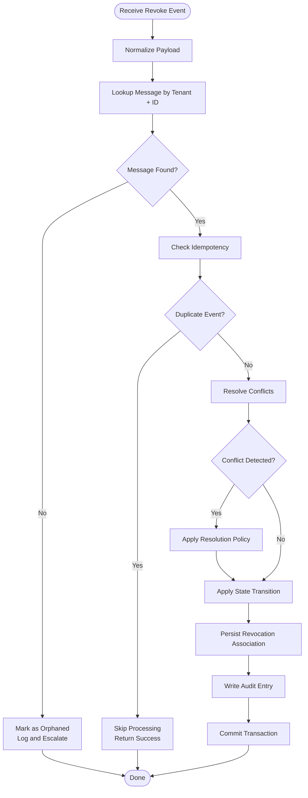
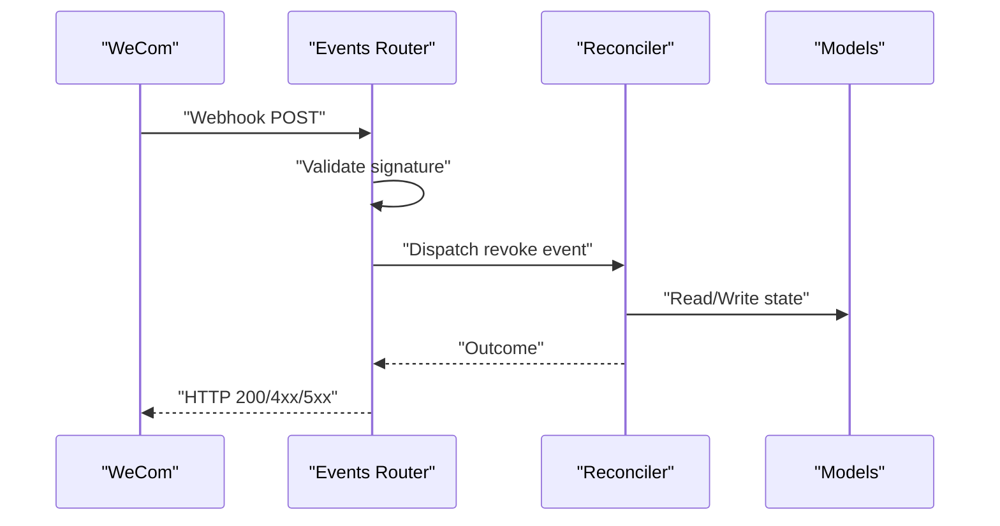
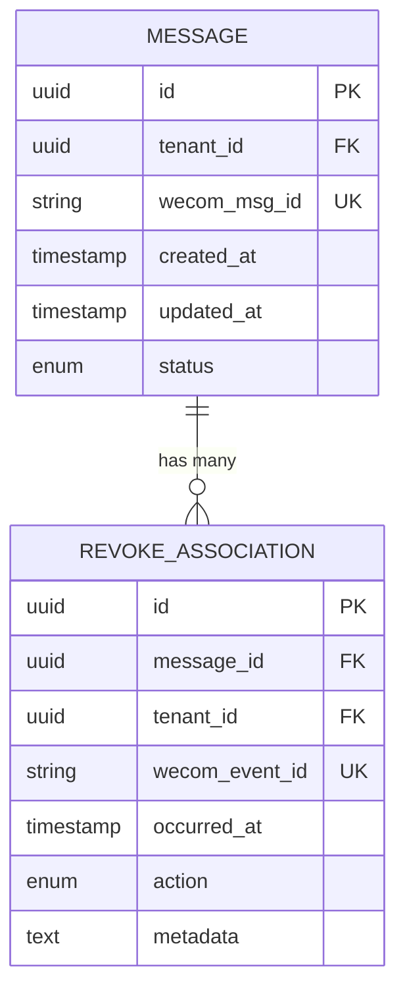
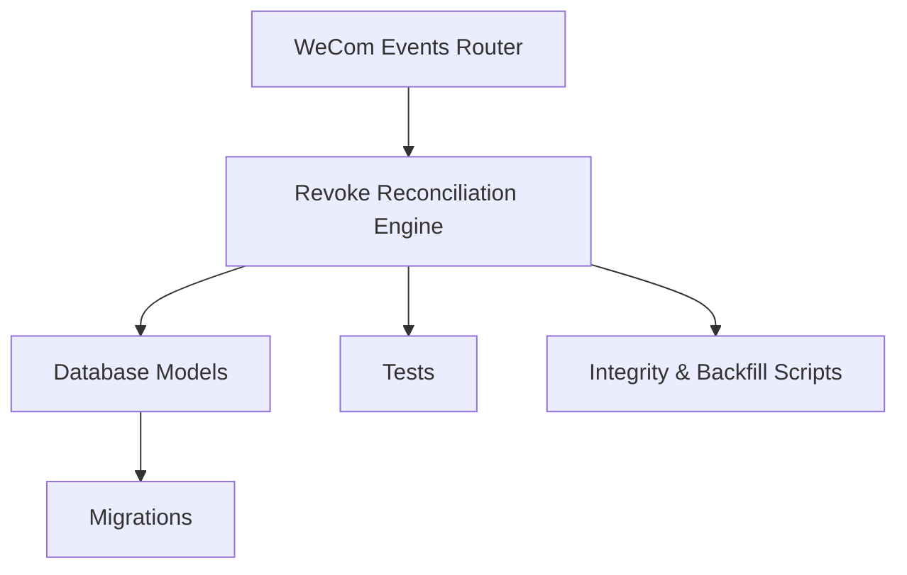

# Revoke Reconciliation Engine

<cite>
**Referenced Files in This Document**
- [revoke_reconciliation.py](file://backend/app/revoke_reconciliation.py)
- [models.py](file://backend/app/db/models.py)
- [wecom_events.py](file://backend/app/routers/wecom_events.py)
- [0009_revoke_association.py](file://backend/alembic/versions/0009_revoke_association.py)
- [0010_message_revocations_integrity.py](file://backend/alembic/versions/0010_message_revocations_integrity.py)
- [0011_message_revocations_tenant_integrity.py](file://backend/alembic/versions/0011_message_revocations_tenant_integrity.py)
- [test_revoke_reconciliation.py](file://backend/tests/test_revoke_reconciliation.py)
- [test_revoke_concurrency.py](file://backend/tests/test_revoke_concurrency.py)
- [test_backfill_historical_revoke_recovery.py](file://backend/tests/test_backfill_historical_revoke_recovery.py)
- [check_message_revocations_integrity.py](file://backend/scripts/check_message_revocations_integrity.py)
</cite>

## Table of Contents
1. [Introduction](#introduction)
2. [Project Structure](#project-structure)
3. [Core Components](#core-components)
4. [Architecture Overview](#architecture-overview)
5. [Detailed Component Analysis](#detailed-component-analysis)
6. [Dependency Analysis](#dependency-analysis)
7. [Performance Considerations](#performance-considerations)
8. [Troubleshooting Guide](#troubleshooting-guide)
9. [Conclusion](#conclusion)

## Introduction
This document explains the revoke reconciliation engine that processes message revocation events from WeCom, tracks them, and reconciles local message state accordingly. It covers how revocations are ingested, validated, persisted, and applied to ensure consistency between WeCom’s authoritative state and the local archive. The guide also details idempotency guarantees, concurrency control, conflict resolution strategies, audit trail maintenance, and recovery procedures for failed reconciliations.

## Project Structure
The revoke reconciliation feature spans several modules:
- Event ingestion and routing for WeCom revoke events
- Core reconciliation logic and state transitions
- Database models and migrations for revocation tracking
- Tests validating correctness under concurrency and failure scenarios
- Scripts for integrity checks and backfills

**Diagram sources**
- [wecom_events.py](file://backend/app/routers/wecom_events.py)
- [revoke_reconciliation.py](file://backend/app/revoke_reconciliation.py)
- [models.py](file://backend/app/db/models.py)
- [0009_revoke_association.py](file://backend/alembic/versions/0009_revoke_association.py)
- [0010_message_revocations_integrity.py](file://backend/alembic/versions/0010_message_revocations_integrity.py)
- [0011_message_revocations_tenant_integrity.py](file://backend/alembic/versions/0011_message_revocations_tenant_integrity.py)
- [test_revoke_reconciliation.py](file://backend/tests/test_revoke_reconciliation.py)
- [test_revoke_concurrency.py](file://backend/tests/test_revoke_concurrency.py)
- [check_message_revocations_integrity.py](file://backend/scripts/check_message_revocations_integrity.py)

**Section sources**
- [wecom_events.py](file://backend/app/routers/wecom_events.py)
- [revoke_reconciliation.py](file://backend/app/revoke_reconciliation.py)
- [models.py](file://backend/app/db/models.py)
- [0009_revoke_association.py](file://backend/alembic/versions/0009_revoke_association.py)
- [0010_message_revocations_integrity.py](file://backend/alembic/versions/0010_message_revocations_integrity.py)
- [0011_message_revocations_tenant_integrity.py](file://backend/alembic/versions/0011_message_revocations_tenant_integrity.py)

## Core Components
- Revoke Reconciliation Engine: Centralizes processing of revoke events, enforces idempotency, manages state transitions, and updates message revocation records.
- WeCom Events Router: Receives webhook events from WeCom and dispatches revoke events to the reconciliation engine.
- Database Models: Represent messages and their revocation associations, including tenant scoping and integrity constraints.
- Migrations: Establish schema for revocation associations, enforce referential integrity, and add tenant-scoped uniqueness.
- Observability and Recovery: Tests validate behavior under concurrency and failures; scripts check integrity and support backfills.

Key responsibilities:
- Validate incoming revoke events against existing message records
- Apply idempotent updates to avoid duplicate processing
- Transition message states consistently (e.g., active to revoked)
- Maintain an audit trail via revocation association records
- Handle conflicts by comparing timestamps and event sequences
- Ensure tenant isolation for multi-tenant environments

**Section sources**
- [revoke_reconciliation.py](file://backend/app/revoke_reconciliation.py)
- [wecom_events.py](file://backend/app/routers/wecom_events.py)
- [models.py](file://backend/app/db/models.py)
- [0009_revoke_association.py](file://backend/alembic/versions/0009_revoke_association.py)
- [0010_message_revocations_integrity.py](file://backend/alembic/versions/0010_message_revocations_integrity.py)
- [0011_message_revocations_tenant_integrity.py](file://backend/alembic/versions/0011_message_revocations_tenant_integrity.py)

## Architecture Overview
The revoke reconciliation pipeline integrates with WeCom webhooks, persists revocation metadata, and updates message lifecycle state.

**Diagram sources**
- [wecom_events.py](file://backend/app/routers/wecom_events.py)
- [revoke_reconciliation.py](file://backend/app/revoke_reconciliation.py)
- [models.py](file://backend/app/db/models.py)

## Detailed Component Analysis

### Revoke Reconciliation Engine
Responsibilities:
- Ingest revoke events and normalize payloads
- Enforce idempotency using unique identifiers and sequence numbers
- Resolve conflicts by comparing event timestamps and ordering
- Update message state transitions deterministically
- Persist revocation associations and maintain audit trails
- Support rollback and retry semantics for partial failures

Concurrency control:
- Uses database-level constraints and transactions to prevent race conditions
- Applies optimistic locking where applicable to detect conflicting updates
- Ensures single-writer semantics per message within a tenant scope

Idempotency guarantees:
- Deduplicates based on event IDs and message-tuple keys
- Skips reprocessing when revocation state is already consistent
- Records processed event markers to avoid replay issues

Conflict resolution:
- Compares WeCom-provided timestamps with local state
- Applies last-write-wins policy only when safe and verified
- Logs discrepancies for manual review when necessary

Audit trail:
- Creates revocation association records linking messages to revocation events
- Captures event metadata, timestamps, and outcome statuses
- Enables traceability across message lifecycle changes

State transitions:
- Active -> Revoked upon successful reconcile
- Revoked -> Active if restoration occurs (if supported by upstream)
- Invalid -> Marked for review when data integrity checks fail

**Diagram sources**
- [revoke_reconciliation.py](file://backend/app/revoke_reconciliation.py)
- [models.py](file://backend/app/db/models.py)

**Section sources**
- [revoke_reconciliation.py](file://backend/app/revoke_reconciliation.py)
- [models.py](file://backend/app/db/models.py)

### WeCom Events Router
Responsibilities:
- Accepts webhook requests from WeCom
- Validates request signatures and headers
- Dispatches revoke events to the reconciliation engine
- Returns appropriate HTTP responses and error codes

Integration points:
- Routes revoke events to the reconciliation engine
- Enforces rate limiting and request validation
- Logs inbound events for observability

**Diagram sources**
- [wecom_events.py](file://backend/app/routers/wecom_events.py)
- [revoke_reconciliation.py](file://backend/app/revoke_reconciliation.py)
- [models.py](file://backend/app/db/models.py)

**Section sources**
- [wecom_events.py](file://backend/app/routers/wecom_events.py)

### Database Models and Migrations
Models:
- Message entity with lifecycle fields
- Revocation association linking messages to revocation events
- Tenant-scoped constraints ensuring isolation

Migrations:
- Introduce revocation association table
- Add integrity constraints for referential consistency
- Enforce tenant uniqueness for revocation records

**Diagram sources**
- [models.py](file://backend/app/db/models.py)
- [0009_revoke_association.py](file://backend/alembic/versions/0009_revoke_association.py)
- [0010_message_revocations_integrity.py](file://backend/alembic/versions/0010_message_revocations_integrity.py)
- [0011_message_revocations_tenant_integrity.py](file://backend/alembic/versions/0011_message_revocations_tenant_integrity.py)

**Section sources**
- [models.py](file://backend/app/db/models.py)
- [0009_revoke_association.py](file://backend/alembic/versions/0009_revoke_association.py)
- [0010_message_revocations_integrity.py](file://backend/alembic/versions/0010_message_revocations_integrity.py)
- [0011_message_revocations_tenant_integrity.py](file://backend/alembic/versions/0011_message_revocations_tenant_integrity.py)

### Concurrency Control and Idempotency
Concurrency control:
- Transactions wrap state reads and writes to prevent inconsistent updates
- Unique constraints on event IDs and message-tuple keys prevent duplicates
- Optimistic locking detects concurrent modifications and retries safely

Idempotency guarantees:
- Deduplication keyed by event ID and tenant/message context
- Early exit on duplicate detection without side effects
- Consistent outcomes regardless of retry frequency

Recovery procedures:
- Retry policies with exponential backoff for transient failures
- Dead-letter queues or audit logs for persistent failures
- Backfill scripts to reconcile historical gaps

**Section sources**
- [revoke_reconciliation.py](file://backend/app/revoke_reconciliation.py)
- [models.py](file://backend/app/db/models.py)
- [test_revoke_concurrency.py](file://backend/tests/test_revoke_concurrency.py)

### Audit Trail Maintenance
Audit mechanisms:
- Revocation association records capture event metadata and outcomes
- Timestamps and sequence numbers enable chronological reconstruction
- Status flags indicate success, failure, or pending states

Traceability:
- Queries can reconstruct message lifecycle changes over time
- Integration with search and timeline features for user visibility
- Export capabilities for compliance and auditing

**Section sources**
- [models.py](file://backend/app/db/models.py)
- [0009_revoke_association.py](file://backend/alembic/versions/0009_revoke_association.py)

### Example Revoke Event Processing
End-to-end flow:
1. WeCom sends revoke event with message ID and timestamp
2. Router validates and dispatches to reconciliation engine
3. Engine looks up message by tenant and ID
4. Checks idempotency and resolves any conflicts
5. Updates message state to revoked and persists revocation association
6. Writes audit entry and commits transaction
7. Returns success response to WeCom

State transitions:
- Active -> Revoked on successful reconcile
- No change on duplicate events
- Error path for invalid or missing messages

**Section sources**
- [wecom_events.py](file://backend/app/routers/wecom_events.py)
- [revoke_reconciliation.py](file://backend/app/revoke_reconciliation.py)
- [test_revoke_reconciliation.py](file://backend/tests/test_revoke_reconciliation.py)

## Dependency Analysis
The revoke reconciliation engine depends on:
- WeCom SDK for event ingestion
- Database layer for persistence and integrity
- Migration system for schema evolution
- Test suite for validation and regression prevention

**Diagram sources**
- [revoke_reconciliation.py](file://backend/app/revoke_reconciliation.py)
- [wecom_events.py](file://backend/app/routers/wecom_events.py)
- [models.py](file://backend/app/db/models.py)
- [0009_revoke_association.py](file://backend/alembic/versions/0009_revoke_association.py)
- [0010_message_revocations_integrity.py](file://backend/alembic/versions/0010_message_revocations_integrity.py)
- [0011_message_revocations_tenant_integrity.py](file://backend/alembic/versions/0011_message_revocations_tenant_integrity.py)
- [test_revoke_reconciliation.py](file://backend/tests/test_revoke_reconciliation.py)
- [test_revoke_concurrency.py](file://backend/tests/test_revoke_concurrency.py)
- [check_message_revocations_integrity.py](file://backend/scripts/check_message_revocations_integrity.py)

**Section sources**
- [revoke_reconciliation.py](file://backend/app/revoke_reconciliation.py)
- [wecom_events.py](file://backend/app/routers/wecom_events.py)
- [models.py](file://backend/app/db/models.py)
- [0009_revoke_association.py](file://backend/alembic/versions/0009_revoke_association.py)
- [0010_message_revocations_integrity.py](file://backend/alembic/versions/0010_message_revocations_integrity.py)
- [0011_message_revocations_tenant_integrity.py](file://backend/alembic/versions/0011_message_revocations_tenant_integrity.py)
- [test_revoke_reconciliation.py](file://backend/tests/test_revoke_reconciliation.py)
- [test_revoke_concurrency.py](file://backend/tests/test_revoke_concurrency.py)
- [check_message_revocations_integrity.py](file://backend/scripts/check_message_revocations_integrity.py)

## Performance Considerations
- Batch processing for high-volume revoke events
- Indexing on tenant_id, wecom_msg_id, and wecom_event_id for fast lookups
- Connection pooling and transaction optimization
- Asynchronous processing for non-critical audit writes
- Caching frequently accessed message metadata

[No sources needed since this section provides general guidance]

## Troubleshooting Guide
Common issues and resolutions:
- Duplicate event processing: Verify idempotency keys and deduplication logic
- Missing message records: Check tenant scoping and message indexing
- Concurrency conflicts: Review optimistic locking and retry policies
- Integrity violations: Run integrity checks and backfill scripts
- Audit gaps: Reconstruct timelines using revocation associations

Diagnostic tools:
- Integrity check script for revocation associations
- Backfill scripts for historical recovery
- Test suites for concurrency and reconciliation correctness

**Section sources**
- [check_message_revocations_integrity.py](file://backend/scripts/check_message_revocations_integrity.py)
- [test_backfill_historical_revoke_recovery.py](file://backend/tests/test_backfill_historical_revoke_recovery.py)
- [test_revoke_concurrency.py](file://backend/tests/test_revoke_concurrency.py)
- [test_revoke_reconciliation.py](file://backend/tests/test_revoke_reconciliation.py)

## Conclusion
The revoke reconciliation engine ensures reliable processing of WeCom message revocations through robust idempotency, concurrency control, and audit trail maintenance. By integrating tightly with database models and migrations, it maintains consistency between external and internal message states while supporting recovery and observability. Proper configuration and monitoring enable scalable and resilient operation in production environments.

[No sources needed since this section summarizes without analyzing specific files]