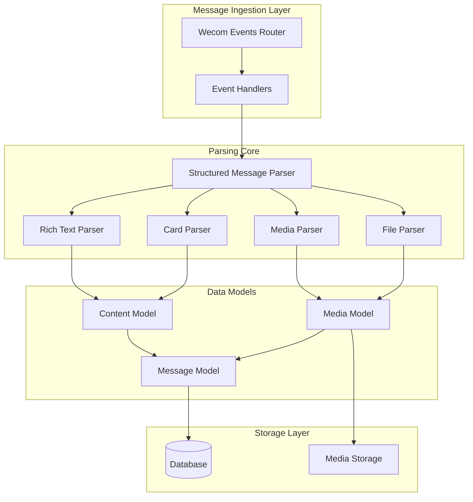
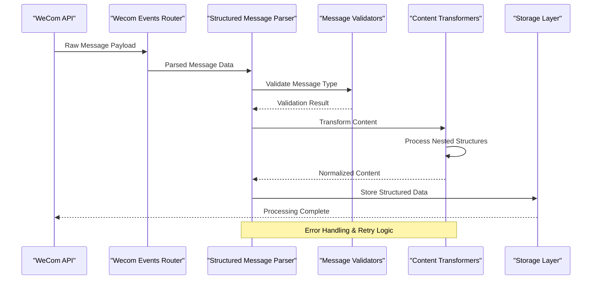
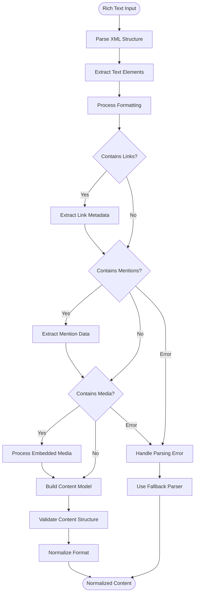
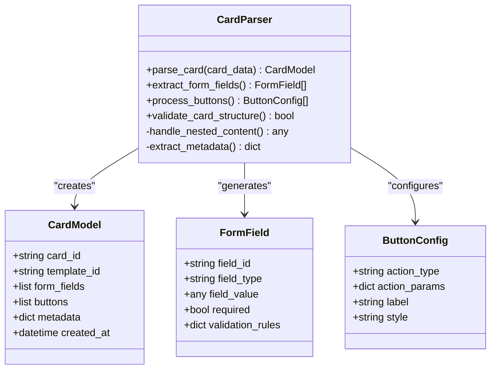
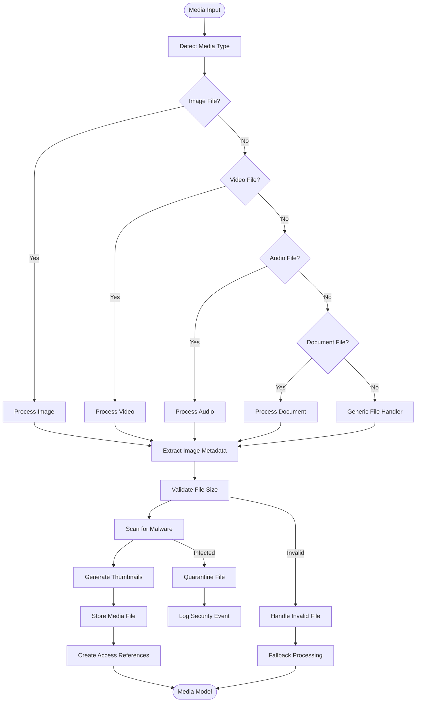
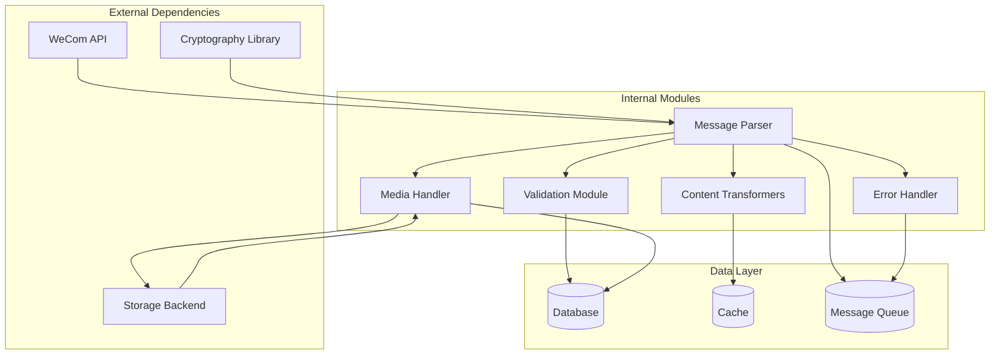

# Structured Message Parser

<cite>
**Referenced Files in This Document**
- [structured_message_parser.py](file://backend/app/structured_message_parser.py)
- [test_structured_message_parser.py](file://backend/tests/test_structured_message_parser.py)
- [models.py](file://backend/app/db/models.py)
- [wecom_events.py](file://backend/app/routers/wecom_events.py)
- [media_download.py](file://backend/app/media_download.py)
- [media_storage.py](file://backend/app/media_storage.py)
</cite>

## Table of Contents
1. [Introduction](#introduction)
2. [Project Structure](#project-structure)
3. [Core Components](#core-components)
4. [Architecture Overview](#architecture-overview)
5. [Detailed Component Analysis](#detailed-component-analysis)
6. [Dependency Analysis](#dependency-analysis)
7. [Performance Considerations](#performance-considerations)
8. [Troubleshooting Guide](#troubleshooting-guide)
9. [Conclusion](#conclusion)

## Introduction

The Structured Message Parser is a critical component in the WeCom Archive system responsible for transforming complex WeCom messages into normalized data models. This parser handles various message types including rich text, cards, files, images, and other media formats, converting them into structured representations that can be efficiently stored, searched, and displayed.

The parser serves as the bridge between raw WeCom message payloads and the application's internal data models, ensuring consistency and reliability across the entire message processing pipeline. It implements robust error handling, validation rules, and performance optimizations to handle large message payloads and malformed data gracefully.

## Project Structure

The structured message parsing functionality is primarily implemented in the backend application, with the core parser logic located in the main application module. The system follows a modular architecture where different components handle specific aspects of message processing:

**Diagram sources**
- [wecom_events.py](file://backend/app/routers/wecom_events.py)
- [structured_message_parser.py](file://backend/app/structured_message_parser.py)
- [models.py](file://backend/app/db/models.py)

**Section sources**
- [structured_message_parser.py](file://backend/app/structured_message_parser.py)
- [wecom_events.py](file://backend/app/routers/wecom_events.py)

## Core Components

The structured message parser consists of several key components that work together to process different types of WeCom messages:

### Main Parser Engine
The central parser engine orchestrates the parsing process, determining the appropriate parser for each message type and coordinating the transformation workflow. It handles message routing, validation, and error management.

### Rich Text Parser
Specialized parser for WeCom rich text messages, which contain complex nested structures including formatted text, links, mentions, and embedded media. The rich text parser recursively processes these nested elements while preserving formatting and relationships.

### Card Parser
Handles WeCom card messages that contain structured content with buttons, forms, and interactive elements. The card parser extracts form fields, button actions, and card-specific metadata.

### Media Parser
Processes various media types including images, videos, audio files, and documents. The media parser validates file types, extracts metadata, and prepares media references for storage.

### File Parser
Dedicated parser for file attachments, handling different file formats, extracting file properties, and managing file access permissions.

**Section sources**
- [structured_message_parser.py](file://backend/app/structured_message_parser.py)

## Architecture Overview

The structured message parser follows a pipeline architecture where raw message payloads flow through multiple processing stages, each responsible for specific transformations:

**Diagram sources**
- [wecom_events.py](file://backend/app/routers/wecom_events.py)
- [structured_message_parser.py](file://backend/app/structured_message_parser.py)
- [media_download.py](file://backend/app/media_download.py)

The architecture ensures separation of concerns, with each component focusing on specific aspects of message processing while maintaining clear interfaces between layers.

## Detailed Component Analysis

### Rich Text Parsing Pipeline

The rich text parser handles the most complex message structures in WeCom, supporting nested elements like formatted text, hyperlinks, mentions, and embedded media:

**Diagram sources**
- [structured_message_parser.py](file://backend/app/structured_message_parser.py)

### Card Message Processing

Card messages contain structured interactive content that requires specialized parsing to extract form fields, button configurations, and card-specific metadata:

**Diagram sources**
- [structured_message_parser.py](file://backend/app/structured_message_parser.py)

### Media Processing Pipeline

The media parser handles various file types with specific processing logic for each format:

**Diagram sources**
- [media_download.py](file://backend/app/media_download.py)
- [media_storage.py](file://backend/app/media_storage.py)

**Section sources**
- [structured_message_parser.py](file://backend/app/structured_message_parser.py)
- [media_download.py](file://backend/app/media_download.py)
- [media_storage.py](file://backend/app/media_storage.py)

## Dependency Analysis

The structured message parser has well-defined dependencies on external services and internal modules:

**Diagram sources**
- [structured_message_parser.py](file://backend/app/structured_message_parser.py)
- [media_download.py](file://backend/app/media_download.py)

Key dependency characteristics:
- **Loose Coupling**: Components communicate through well-defined interfaces
- **Service Abstraction**: External services are abstracted behind interfaces
- **Error Isolation**: Failures in one component don't cascade to others
- **Caching Strategy**: Frequently accessed data is cached for performance

**Section sources**
- [structured_message_parser.py](file://backend/app/structured_message_parser.py)

## Performance Considerations

The structured message parser implements several optimization strategies to handle large message payloads efficiently:

### Memory Management
- **Streaming Processing**: Large messages are processed in chunks to minimize memory usage
- **Lazy Loading**: Nested content is loaded only when needed
- **Resource Cleanup**: Temporary resources are promptly released after use

### Caching Strategies
- **Parser Cache**: Reused parser instances for similar message types
- **Metadata Cache**: Cached message metadata to avoid repeated parsing
- **Media Reference Cache**: Cached media access URLs and metadata

### Concurrency Control
- **Async Processing**: Non-blocking operations for I/O intensive tasks
- **Batch Processing**: Grouped processing of related messages
- **Rate Limiting**: Controlled processing rates to prevent overload

### Optimization Techniques
- **Early Validation**: Quick rejection of invalid messages before expensive processing
- **Selective Parsing**: Only parse necessary parts of complex messages
- **Compression**: Compressed storage for large message payloads

## Troubleshooting Guide

Common issues and their solutions when working with the structured message parser:

### Parsing Errors
- **Malformed XML**: Verify message structure and encoding
- **Unsupported Types**: Check message type compatibility
- **Nested Structure Issues**: Validate depth limits and recursion handling

### Performance Issues
- **Memory Leaks**: Monitor memory usage during large message processing
- **Slow Parsing**: Profile parser performance and optimize hot paths
- **Database Bottlenecks**: Optimize database queries and indexing

### Media Processing Problems
- **File Corruption**: Implement file integrity checks
- **Storage Failures**: Configure proper error handling and retries
- **Thumbnail Generation**: Ensure adequate resources for image processing

### Debugging Techniques
- **Logging Levels**: Configure appropriate log levels for troubleshooting
- **Trace Analysis**: Use distributed tracing for complex workflows
- **Performance Profiling**: Identify bottlenecks with profiling tools

**Section sources**
- [test_structured_message_parser.py](file://backend/tests/test_structured_message_parser.py)

## Conclusion

The structured message parser is a sophisticated component that transforms complex WeCom messages into normalized, searchable data models. Its modular architecture, robust error handling, and performance optimizations make it suitable for high-volume message processing scenarios.

Key strengths include:
- **Comprehensive Coverage**: Supports all major WeCom message types
- **Robust Error Handling**: Graceful degradation and recovery mechanisms
- **Performance Optimized**: Efficient processing of large message payloads
- **Extensible Design**: Easy addition of new message types and parsers

Future enhancements could include advanced content analysis, machine learning-based classification, and enhanced security scanning capabilities.